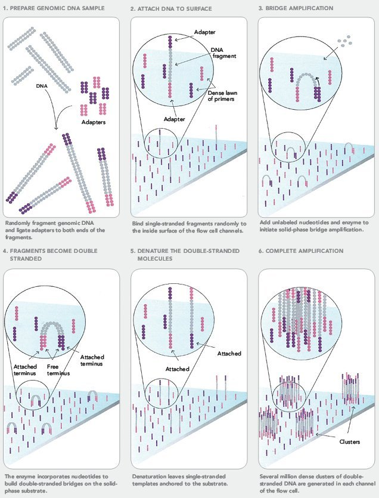
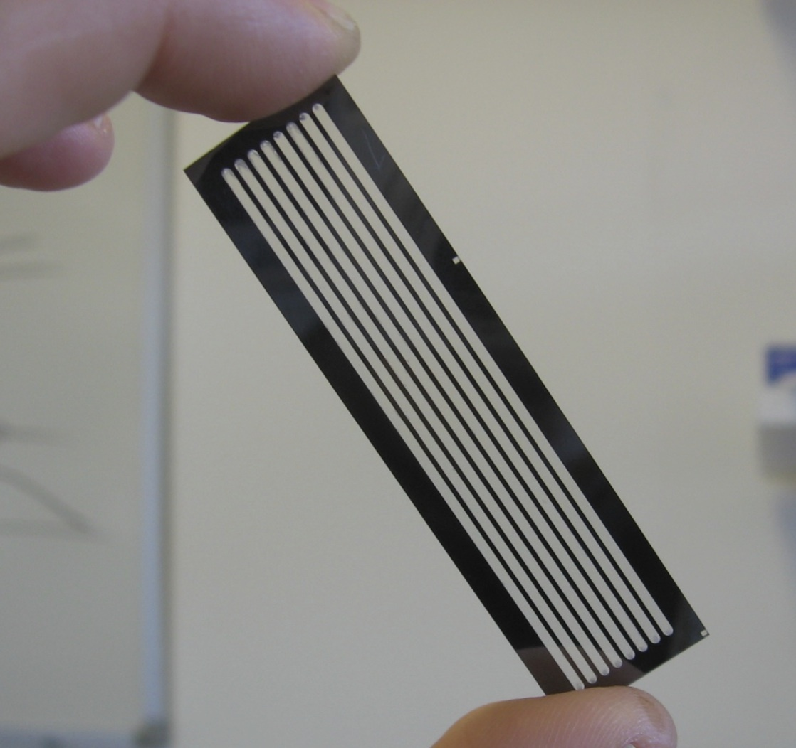
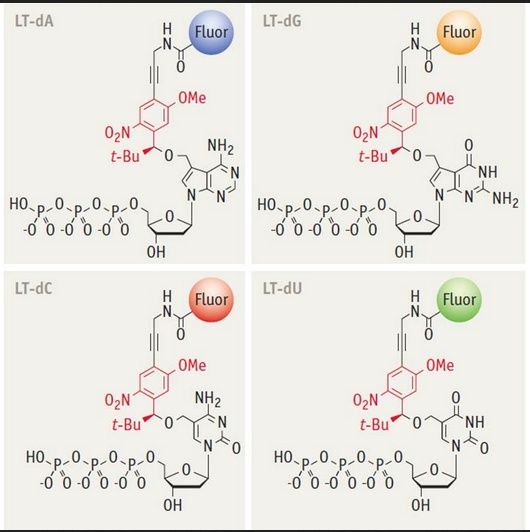

# 基础问题 1—5 {#sec-a-questions-01-05}

本组保留原题和原稿参考答案。题库目前收录 1—25 题；历史仪器参数和软件用法仍需逐项更新。

对应 [测序与数据格式](../manuscript/03-sequencing-and-data-formats.md)。

## 100 Bioinformatic Basic Questions_1 {#question-01-1}

#### 1. 掌握FASTQ格式 {#question-01-3}

##### 1.1 格式有什么特点？ {#question-01-5}

fastq内容格式有4行：
- 第1行主要储存序列测序时的坐标等信息；

    举个例子：
    @ST-E00126:128:HJFLHCCXX:2:1101:7405:1133   
    1. @，开始的标记符号;
    2. ST-E00126:128:HJFLHCCXX，测序仪唯一的设备名称;  
    3. 2，lane的编号;			
    4. 1101，tail的坐标;
    5. 7405，在tail中的X坐标;
    6. 1133，在tail中的Y坐标
- 第2行就是测序得到的序列信息，一般用ATCGN来表示，其中N用于荧光信号干扰无法判断到底是哪个碱基时的代表符号；
- 第3行以“+”开始，可以储存一些附加信息，但目前的测序fastq文件这一行一般是空的。
- 第4行储存的是质量信息，与第2行的碱基序列是一一对应的，其中的每一个符号对应的ASCII值是经过换算的phred值，可以简单理解为对应位置碱基的测序质量值，越大说明测序的质量越好。不同的版本对应的phred值范围不同。

##### 1.2 什么是phred值，怎么计算？ {#question-01-22}

 
是评估这个bp测序质量的值，测序仪通过判断荧光信号的颜色来判断碱基的种类，ATCG分别对应红黄蓝绿，信号强弱不同，在这种情况下对每个结果的判断的正确性都存在一个概率值，这个值被储存为ASCII码形式，转化方式如下：  

- 将该碱基判断错误概率值P取log10之后再乘以-10，得到的结果为Q。

    比如，P=1%，那么对应的Q=-10*log10（0.01）=20（这个计算公式illumina平台使用，Solexa系列测序仪使用不同的公示来计算质量值：Q=-10log(P/1-P)） 

- 把这个Q加上33或者64转成一个新的数值，称为Phred，最后把Phred对应的ASCII字符对应到这个碱基。

    如Q=20，Phred = 20 + 33 = 53，53在ASCII码表里对应的ASCII符号是”5”
    

##### 1.3 phred33 与 phred64是什么意思？ {#question-01-35}

 质量字符的ASCII值和质量得分的关系有如下两种：可以粗略分为 Phred+33和Phred+64，这里的33和64就是指ASCII值转换为Q该减去的数值。

在处理测序数据时，因为一些软件会根据碱基质量得分的不同做不同的处理，常要指定正确的编码方式，有必要对质量字符与质量得分的关系（Phred+33或Phred+64）作出正确的判断。当然，如果处理的是最近两年产生的测序数据，基本上都是Phred+33的，但从NCBI SRA数据库下载的较早的数据可能不同，需要注意。  

#### 2. FASTA格式的构成是怎样的，有什么样的规律？ {#question-01-40}

- fasta格式用于储存序列，可以储存DNA、RNA和蛋白质序列，一般分为两个部分，第1行是以>开头的序列描述信息，包括数据库中的编号，序列名称，序列类型，剩余的为序列信息,以蛋白质和mRNA序列文件为例:
        
蛋白质fasta文件
 
- 以>开头
- sp|P69905 数据库编码
- HBA_HUMAN Hemoglobin subunit alpha  蛋白质名称
- OS=Homo sapiens  所属物种
- GN=HBA1 基因名称
    

>sp|P69905|HBA_HUMAN Hemoglobin subunit alpha OS=Homo sapiens GN=HBA1 MVLSPADKTNVKAAWGKVGAHAGEYGAEALERMFLSFPTTKTYFPHFDLSHGSAQVKGHGKKVADALTNAVAHVDDMPNALSALSDLHAHKLRVDPVNFKLLSHCLLVTLAAHLPAEFTPAVHASLDKLASVSTVLTSKYR`  
    
核酸序列文件（mRNA序列中的U均用T来代替）

- 以>开头
- gi|13650073 基因ID
- gb|AF349571.1 genebank编号
-  Homo sapiens hemoglobin alpha-1 globin chain (HBA1) 基因名称
- mRNA, complete cds 序列类型  
    

>gi|13650073|gb|AF349571.1| Homo sapiens hemoglobin alpha-1 globin chain (HBA1) mRNA, complete cds CCCACAGACTCAGAGAGAACCCACCATGGTGCTGTCTCCTGACGACAAGACCAACGTCAAGGCCGCCTGGGGTAAGGTCGGCGCGCACGCTGGCGAGTATGGTGCGGAGGCCCTGGAGAGGATGTTCCTGTCCTTCCCCACCACCAAGACCTACTTCCCGCACTTCGACCTGAGCCACGGCTCTGCCCAGGTTAAGGGCCACGGCAAGAAGGTGGCCGACGCGCTGACCAACGCCGTGGCGCACGTGGACGACATGCCCAACGCGCTGTCCGCCCTGAGCGACCTGCACGCGCACAAGCTTCGGGTGGACCCGGTCAACTTCAAGCTCCTAAGCCACTGCCTGCTGGTGACCCTGGCCGCCCACCTCCCCGCCGAGTTCACCCCTGCGGTGCACGCCTCCCTGGACAAGTTCCTGGCTTCTGTGAGCACCGTGCTGACCTCCAAATACCGTTAAGCTGGAGCCTCGGTGGCCATGCTTCTTGCCCCTTTG

#### 3. 什么序列适合用FASTA保存，什么序列适合用FASTQ保存？ {#question-01-66}

单纯的蛋白或者核酸的序列信息一般用FASTA格式保存，而测序文件一般用包含仪器信息和测序质量的FASTQ格式保存。

  
  
   
  
  

## 100 Bioinformatic Basic Questions_2 {#question-01-77}

现在我们实验室或者公司常用第1代测序与第2代测序，那么：

#### 1. 第1代测序 sanger 测序法的原理是什么？通量比较低的核心原因是什么？ {#question-01-80}

sanger法测序及双脱氧链终止法，它采取DNA复制原理，通过在DNA复制过程中添加双脱氧三磷酸核苷酸（ddNTP）终止DNA链的延伸，在DNA链不同位置的延伸终止判断该位置的碱基类型。但是凝胶电泳的时间较长，导致sanger法测序通量低。

#### 2. 作为2006年正式发布的illumina测序技术，或者称为第2代测序技术的代表性技术，其最大的特点是什么？ {#question-01-83}

高通量，成本低，但测序长度较短。

#### 3. Illumina测序技术的核心是什么？ {#question-01-86}

核心内容有两个，一个是桥式PCR，主要用于扩大信号；另一个是4色荧光可逆终止反应，使illumina测序可以实现边合成边测序的技术。

#### 4. Illumina测序技术为什么不能像第1代测序技术一样测500bp以上？ {#question-01-89}

   主要的原因有两个，一方面测序时，经过长时间的PCR，会有不同步的情况。比如一开始1个cluster中是100个完全一样的DNA链，但是经过1轮增加碱基，其中99个都加入了1个碱基，显示了红色，另外1个没有加入碱基，不显示颜色。这时候整体为红色，我们可以顺利得到结果。随后，在第2轮再加入碱基进行合成的时候，之前没有加入的加入了1个碱基显示红色，剩下的99个显示绿色，这个时候就会出现杂信号。当测序长度不断延长，这个杂信号会越来越多，最后很有可能出现50个红，50个绿色，这时信号不足以判断碱基类型；第二就是测序过程中合成酶的活性越来越不稳定，后面碱基添加出现问题。

## 100 Bioinformatic Basic Questions_3 {#question-01-94}

目前我们最常使用的就是Illumina公司的测序技术，Illumina公司的测序技术最明显的几个特点是：价格低，通量高，测序读长短。那么我们今天的问题，就是围绕Illumina测序技术的细节来提问的。

#### 1. 什么是Illumina测序adapter？同一批上机的adapter序列一样吗？它的作用是什么？ {#question-01-97}

adapter的中文意思为适配器或者接口，在illumina测序过程中关键一步是将文库片段固定在flowcell上，然后通过桥式PCR将片段扩增，在被打断成300~500bp的长度的片段末端被补平后adaptor将被添加到片段两端，一方面用于将片段固定在flowcell上，同时adaptor中还包含桥式PCR所需要的引物

#### 2. 一个完整的Illumina测序过程是那几步？ {#question-01-99}

完整的测序过程仅包含两步，第一是桥式PCR扩增，第二是以4色荧光可逆终止反应为核心技术的测序；

#### 3. 什么是桥式PCR技术？为什么要进行桥式PCR？ {#question-01-101}

加上adaptor之后的DNA样品与flowcell上固定的oligo（寡链核苷酸）匹配后就被固定在flowcell上，通过桥式PCR进行扩增成cluster,便于后面的荧光测序，主要步骤为：

- 进行第一轮扩增，将序列补成双链。加入NaOH强碱性溶液破坏DNA的双链，并洗脱。由于最开始的序列是使用化学键连接的，所以不会被洗。
- 加入缓冲溶液，这时候序列自由端的部分就会和旁边的oligo进行匹配
进行一轮PCR，在PCR的过程中，序列是弯成桥状，所以叫桥式PCR，一轮桥式PCR可以使得序列扩增1倍
如此循环下去，就会得到一个具有完全相同序列的cluster
{#fig-a-questions-01-05-001}
 
引用自：http://www.intechopen.com/source/html/49419/media/image2.png 

#### 4. 我们都说，测序结果会包含index，那么index是什么？有什么作用？ {#question-01-115}

一条lane能测得的数据量在30G左右，而一个样品的测序量一般不会这么大，所以在建库的时候对每一种样品的接头加上不同的标签序列，这个标签就叫做Index，有了index就可以同时在一个lane中测多种数据了，后期可以根据index将数据分开；

#### 5. 我们所说的flowcell，lane，tile都是什么意思？ {#question-01-118}

- flowcell    是指Illumina测序时，测序反应发生的位置，1个flowcell含有8条lane
- lane    每一个flowcell上都有8条泳道，用于测序反应，可以添加试剂，洗脱等等
- tile 每一次测序荧光扫描的最小单位
{#fig-a-questions-01-05-002}
引用自：http://41j.com/blog/2012/04/nextgen-sequencing-primer/

#### 6. Illumina测序结果质量表示方法采用的是Phred33还是Phred64？ {#question-01-128}

最新的测序质量结果一般都为Phred33，但是早期的测序数据可能出现Phred64。

## 100 Bioinformatic Basic Questions_4 {#question-01-132}

#### 1. Illumina目前主流的测序仪都有哪几种型号？各自大概的通量是多少？（也就是1个run能跑出多少数据） {#question-01-133}

目前主流的测序仪及其通量主要是Hiseq2500（50-1000Gb）、Hiseq3000（125-750Gb）、Hiseq4000（125-1500Gb）、Hiseq X Five（900-1800Gb）和Hiseq X Ten（900-1800Gb），

#### 2. Illumina目前的测序技术，最核心的就是边合成边测序，即我们常说的 Sequencing by synthesis （SBS），那么为什么能够实现SBS？ {#question-01-135}

经过桥式PCR之后同一段序列已经成簇，下一段就是开始进行测序，这一步比较简单，就是加入primer，然后添加经过特殊处理的ATCG四种碱基，特殊的地方有两点：一个是碱基部分加入了荧光基团，可以激发出不同的颜色，另一个是脱氧核糖3号位加入了叠氮基团而不是常规的羟基，这个叠氮集团保证了每次只能够在序列上添加1个碱基.
{#fig-a-questions-01-05-003}

这样每1轮测序，保证只有1个碱基加入的当前测序链。这时候测序仪会发出激发光，并扫描荧光。因为一个cluster中所有的序列是一样的，所以理论上，这时候cluster中发出的荧光应该颜色一致。随后加入试剂，将脱氧核糖3号位的—N2改变成—OH，然后切掉部分荧光基团，使其在下一轮反应中，不再发出荧光。如此往复，就可以测出序列的内容。

#### 3. 我们在第1问中，问了大家一个问题“Illumina测序技术为什么不能像第1代测序技术一样测500bp以上？”，这里面主要涉及到两种错误，一种叫phasing，一种叫pre-phasing，分别是什么意思？ {#question-01-144}

通俗来讲phasing表示本来同步添加的碱基有一些没加上，而pre-phasing则是加多了，都会导致当前bp的荧光检测出现噪音，造成phasing的主要原因是合成酶的活性降低，而pre-phasing则可能是叠氮基团性质不稳定，转化为羟基在一步检测中添加了不止一个碱基。

## 100 Bioinformatic Basic Questions_5 {#question-01-148}

Hello大家好！

上周我们已经把Illumina测序的基础内容基本搞清了，那么本周的问题我们主要是为围绕着测序后续的质控与建库细节来进行。

今天我们提出的问题是Illumina目前常用的双端测序建库办法中，会在打断的序列前后加上adapter，请问：

#### 1. adapter是什么意思？adapter与primer有什么区别？ {#question-01-156}

adapter在中文是适配器或者接口的意思，在前面的内容中已经提到将测序序列打碎成片断后要将末端补平然后添加adapter，用于与flowcell上的oligo匹配固定并为后续桥式PCR做准备，而前面提到的Index与adapter之间的位置关系一般为adapter1-Index-fragment-adapter2，adapter2通过与oligo互补连接在flowcell上，在进行完桥式PCR之后进行测序时，添加primer，这一段primer的序列是与Index互补的而非adapter1，所以最终拿到的测序结果应该是Index+fragment+adapter2或者Index+部分fragment

#### 2.比如最终的测序结果是 AATTCCGGATCGATCG...，那么adapter的序列可能出现在哪一端，还是两端都有可能出现？为什么？ {#question-01-160}

一般出现在3'端，在上面第1题中已经说到，最终的测序结果应该是Index+fragment+adapter2或者Index+部分fragment，也就是说测序的方向是从5'到3'，adapter只可能出现在3'端。

