# 分析环境的搭建与必要的编程技术 {#sec-ch02}

## 本章提要 {#chapter-summary-02 .unnumbered}

本章帮助你建立能够开展分析的工作环境，并掌握后续实践所需的编程基础。我们从电脑、服务器和软件环境开始，逐步学习命令行与文本操作、Shell 批处理、R 数据处理与绘图，以及 Python 和结构化配置。最后用项目目录、版本管理与排错把这些技能组织起来。阅读时可以先完成一条适合自己设备的环境搭建路线，再围绕小文件和样本表练习；遇到不理解的命令，可以借助 AI 解释，但要检查输入、输出和实际运行结果。

## 电脑、服务器与软件环境 {#sec-02-01}

建立可用且相互隔离的分析环境。

### 生物信息学平台的构建 {#src-0090-build-up-bioinfo-platform-1}

[]{#build_up_platform}


### Windows、Linux和MacOS的选择 {#src-0090-build-up-bioinfo-platform-3}

生信分析的平台主要分为个人电脑和服务器。服务器几乎全部使用Linux，发行版以Cent OS和Ubuntu Server为主，前者更多。个人电脑则Windows、Mac OS和Linux均有，本书主要介绍Windows和Linux的使用，而Mac OS的使用和Linux较为接近，仅有较少的差别。

而个人电脑操作系统的选择，在Windows 10推出WSL（Windows Subsystem for Linux）前以Linux和Mac最为方便。因为大多数开源生信软件仅会提供Linux版的二进制包或者是源代码。而源码编译安装的测试一般只在Linux下进行，Mac因为与Linux的接近而编译安装较为容易。Windows有着与Linux较大的差别，编译安装步骤常常存在很大的问题，无法简单使用软件开发者提供的编译流程。

但是WSL的出现使得在Windows下也可以获得十分接近Linux命令行环境的操作和兼容性体验。大多数人不用特别选择个人电脑的操作系统，原来使用Windows的只需要升级到Windows 10的最新版本即可。

WSL第一代使用了二进制翻译Linux API的方式建立了兼容层，兼容性已经较为优秀，但是在I/O密集型任务上存在效率问题，限制了生信分析的实际进行。WSL第二代则使用了轻量高效的虚拟机运行真正的Linux内核，具有高度的兼容性，也解决I/O密集型任务效率问题，可用于绝大多数生信分析的场景。操作系统不再成为限制生信分析的关键环节。

#### APT {#src-0090-build-up-bioinfo-platform-25}

apt（Advance Packaging Tool）是Debian系Linux发行版的默认包管理工具，于对包括系统本身在内的升级安装等管理操作。

**apt和apt-get命令**

`apt`是2014年正式发布的心得apt包管理工具的命令，相较于`apt-get`系列命令它更为简洁易用。

| apt 命令 | 取代的命令 | 命令的功能 |
|:----- |:----- | ----- |
| apt install | apt-get install | 安装软件包 |
| apt remove | apt-get remove | 移除软件包 |
| apt purge | apt-get purge | 移除软件包及配置文件 |
| apt update | apt-get update | 刷新存储库索引 |
| apt upgrade | apt-get upgrade | 升级所有可升级的软件包 |
| apt autoremove | apt-get autoremove | 自动删除不需要的包 |
| apt full-upgrade | apt-get dist-upgrade | 在升级软件包时自动处理依赖关系 |
| apt search | apt-cache search | 搜索应用程序 |
| apt show | apt-cache show | 显示装细节 |

: apt 取代的 apt-get 系列命令 {#tbl-02-environment-and-programming-01}

| 新的apt命令 | 命令的功能 |
| ----- | ----- |
| apt list | 列出包含条件的包（已安装，可升级等） |
| apt edit-sources | 编辑源列表 |

: 新的 apt 命令 {#tbl-02-environment-and-programming-02}

**apt镜像设置**

apt默认的镜像在国内的访问速度是较慢的，所以设置一个国内的镜像是必要的。这里推荐北京外国语大学的开源软件站。其帮助信息完善，Ubuntu的镜像设置帮助文档地址为(https://mirrors.bfsu.edu.cn/help/ubuntu/)。

可以在文档中选择你具体使用的Ubuntu版本以获取对应的软件源地址。备份原先的软件源配置文件后即可更改配置文件。修改完成后执行`sudo apt update`命令刷新索引既可生效。


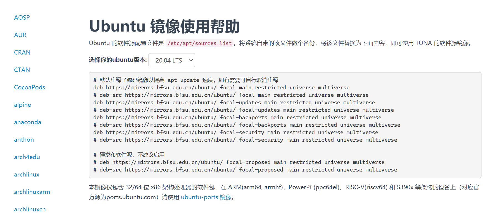{#fig-02-computing-and-programming-001}


#### yum {#src-0090-build-up-bioinfo-platform-62}

yum（Yellow dog Updater, Modified）使用RedHat系（Red Hat、Cent OS、Fedora）发行版的默认包管理工具。

| 命令 | 功能 |
| ----- | ----- |
| yum install | 安装软件包 |
| yum update | 更新软件包 |
| yum check-update | 检查是否有可用更新 |
| yum remove | 删除指定的软件包 |
| yum list | 显示软件包的信息 |
| yun search | 查找软件包的信息 |
| yum info | 显示指定软件包的信息 |
| yum clean | 清理过期缓存 |

: 常用 yum 命令 {#tbl-02-environment-and-programming-03}

**yum镜像**

我们依然十分推荐北外的相关镜像，访问（https://mirrors.bfsu.edu.cn/help/centos/ ）就可以进入CentOS镜像的帮助页面，选择你的系统版本即可获得详细的镜像配置文件内容和详细的指引。


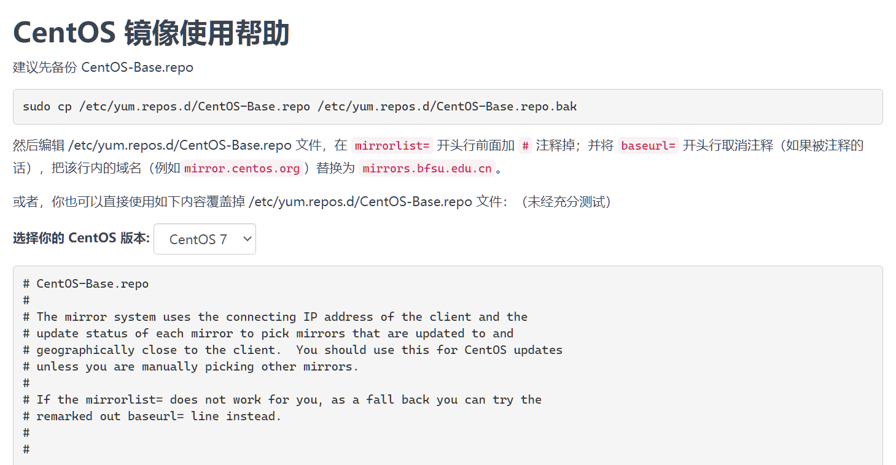{#fig-02-computing-and-programming-002}


### Windows命令行环境搭建 {#src-0090-build-up-bioinfo-platform-86}

Windows和Linux、Mac OS在操作上有着较大区别，但是掌握特点后也可以很好地完成任务。

#### 环境变量 {#src-0090-build-up-bioinfo-platform-90}

环境变量是在操作系统中一个具有特定名字的对象，它包含了一个或者多个应用程序所将使用到的信息。比如日常我们最初接触的Path环境变量。当你在命令行输入程序名称而不包括完整路径时，系统除了在当前目录下查找还会在Path环境变量中的路径进行查找。还有一些软件会用环境变量存储少部分主要设置项的值，比如Julia语言的官方编译器以环境变量JULIA_NUM_THREADS来设置线程数。

Windows的环境变量主要分为：系统、用户、进程（只在当前进程中生效）。设置位置包括系统的“高级设置”（具体内容存储于注册表中）和PowerShell的系统和用户配置文件。系统高级设置的环境变量可以被系统内运行的所有软件读取，而PowerShell配置文件的环境变量只在启动PowerShell时生效。

#### Windows高级设置修改环境变量 {#src-0090-build-up-bioinfo-platform-96}

首先，我再次推荐还没有升级到Windows10的尽快升级。如果你已经是Windows10了，直接在任务栏搜索框中输入“高级设置”，搜索结果中就会有“查看系统高级设置”的结果，点击后就进入到系统高级设置了。如果你还没有升级到Windows10，那么右击“计算机”选择“属性”，弹出窗口内可以找到“高级设置”的入口。

高级设置的窗口内就可以看到环境变量设置的入口。


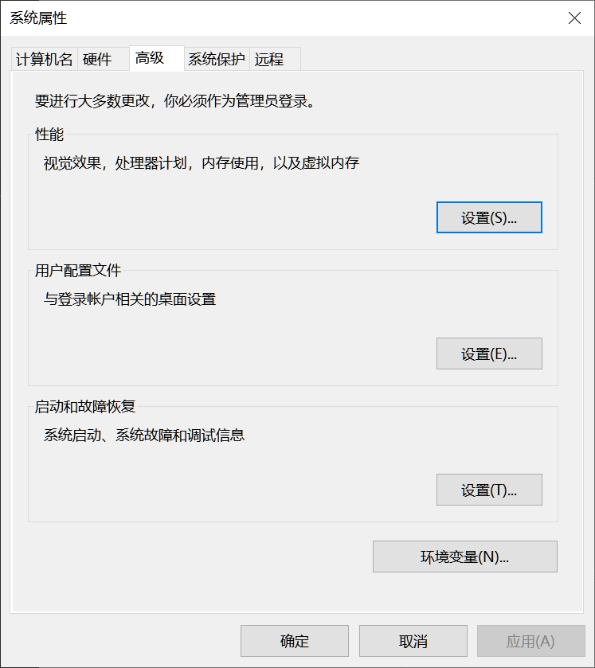{#fig-02-computing-and-programming-003}


在弹出窗口中就可以选择对应的的用户或者系统环境变量进行新建、编辑或删除环境变量了。


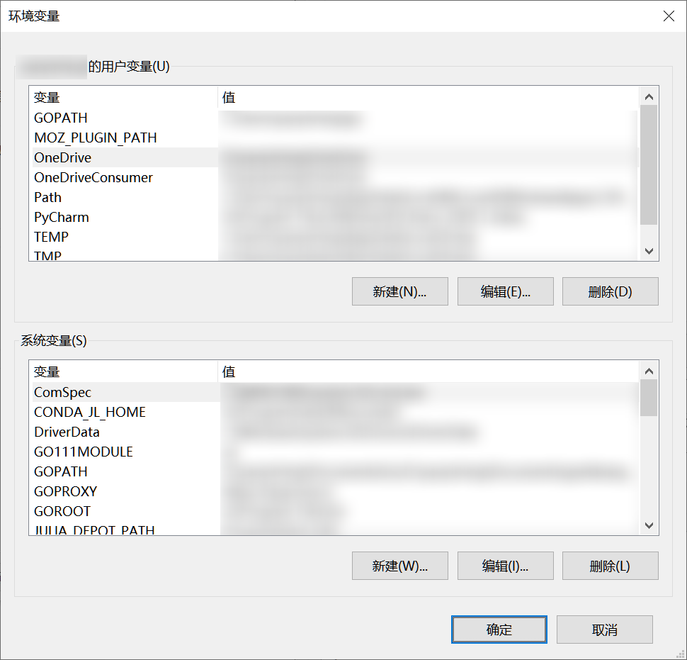{#fig-02-computing-and-programming-004}


**编辑环境变量** []{#src-0090-build-up-bioinfo-platform-108}

比如这里选择用户变量的Path然后选择“编辑”，就会弹出对应的编辑窗口。“新建”就是添加一个新的路径到Path环境变量中；“编辑”为修改当前Path环境变量下的某个路径；“浏览”则可以通过“浏览文件夹”窗口选择路径；“删除”则可以删除已有的；“上移”和“下移”调整具体路径的优先度，下方的优先度更高；“编辑文本”则是在一个输入框编辑，各个路径之间以英文分号分隔，一般情况并不适用主要用在完全复制一个用户的单个环境变量的多个值时。


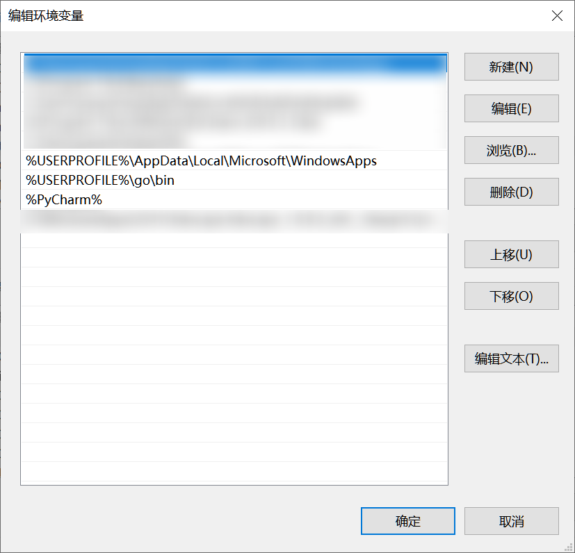{#fig-02-computing-and-programming-005}


**新建环境变量** []{#src-0090-build-up-bioinfo-platform-114}

在环境变量设置窗口对应区域点击“新建”按钮即可新建用户或系统环境变量。变量值可以有多个，每个变量值之间用英文分号分隔。两个“浏览”按钮分布使用浏览窗口选择目录或文件。


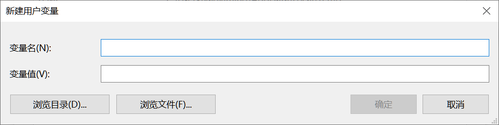{#fig-02-computing-and-programming-006}


新建或编辑完环境变量并确认后，回到”环境变量“确认后就修改完成。初期相关读取环境变量的程序即可生效。如果仍未生效，则注销用户后重新登陆即可。

#### PowerShell配置文件设置环境变量 {#src-0090-build-up-bioinfo-platform-122}

Windows中的PowerShell包括系统内置的Windows PowerShell和可自行安装的PowerShell Core，个人推荐安装PowerShell Core。


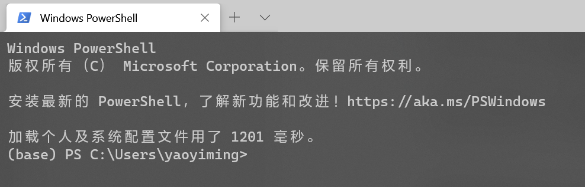{#fig-02-computing-and-programming-007}


不论你启动Windows PowerShell还是PowerShell Core（Windows PowerShell可以右击开始按钮的菜单启动，PowerShell Core安装后会在应用程序列表中出现），都可以用变量查看配置文件路径。`$profile.CurrentUserAllHosts`用于查看用户配置文件，只作用于当前用户。`$profile.AllUsersAllHosts`用于查看系统配置文件，作用域当前系统的所有用户。


{#fig-02-computing-and-programming-008}


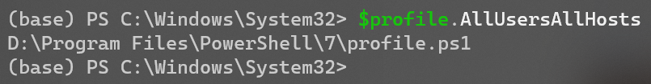{#fig-02-computing-and-programming-009}


当然在修改配置文件之前需要对PowerShell的执行策略进行更改，否则配置文件是无法被载入的。右击开始按钮在菜单中选择“Windows PowerShell (管理员)”，弹出窗口中执行`Set-ExecutionPolicy RemoteSigned`命令。

查找到配置文件路径后就可以就通过编辑配置文件添加或修改环境变量。


```{.powershell data-book-role="code" data-focus-lines="3"}
$env:TEST="D:\\"
$env:TEST=$env:TEST+";E:\\"
$env:Path=$env:Path+";F:\\"
```

上面是一个例子，第一行新建了一个名为TEST的环境变量，并设置其值为"D:\\"，如果TEST环境变量已存在，则会覆盖原值。第二行在原值基础上添加一个值"E:\\"。所以第三行我们也以类似的方法在现有的Path环境变量下添加一个值，以防覆盖原有的值。修改完配置文件后只要重启PowerShell即可生效。

### WSL {#src-0090-build-up-bioinfo-platform-147}

微软官方文档的解释很好的解释了WSL（Windows Subsystem for Linux）为何。

> 适用于 Linux 的 Windows 子系统可让开发人员按原样运行 GNU/Linux 环境 - 包括大多数命令行工具、实用工具和应用程序 - 且不会产生传统虚拟机或双启动设置开销。

#### 安装WSL {#src-0090-build-up-bioinfo-platform-153}

安装WSL前请先将Windows10更新到最新版。然后以管理员权限启动PowerShell，依序执行以下两个命令后重新启动计算机。

**启用“适用于 Linux 的 Windows 子系统”可选功能** []{#src-0090-build-up-bioinfo-platform-157}


```{.powershell data-book-role="code"}
dism.exe /online /enable-feature /featurename:Microsoft-Windows-Subsystem-Linux /all /norestart
```

**启用“虚拟机平台”可选功能** []{#src-0090-build-up-bioinfo-platform-163}


```{.powershell data-book-role="code"}
dism.exe /online /enable-feature /featurename:VirtualMachinePlatform /all /norestart
```

**设置WSL2为默认版本** []{#src-0090-build-up-bioinfo-platform-169}

以管理员权限启动PowerShell，执行以下命令。


```{.powershell data-book-role="code"}
wsl --set-default-version 2
```

**安装发行版** []{#src-0090-build-up-bioinfo-platform-177}

访问(https://aka.ms/wslstore)，启动应用商店对应页面选择一个你中意的发行版即可，或者直接在应用商店搜索`Linux`，可以找到更多发行版。


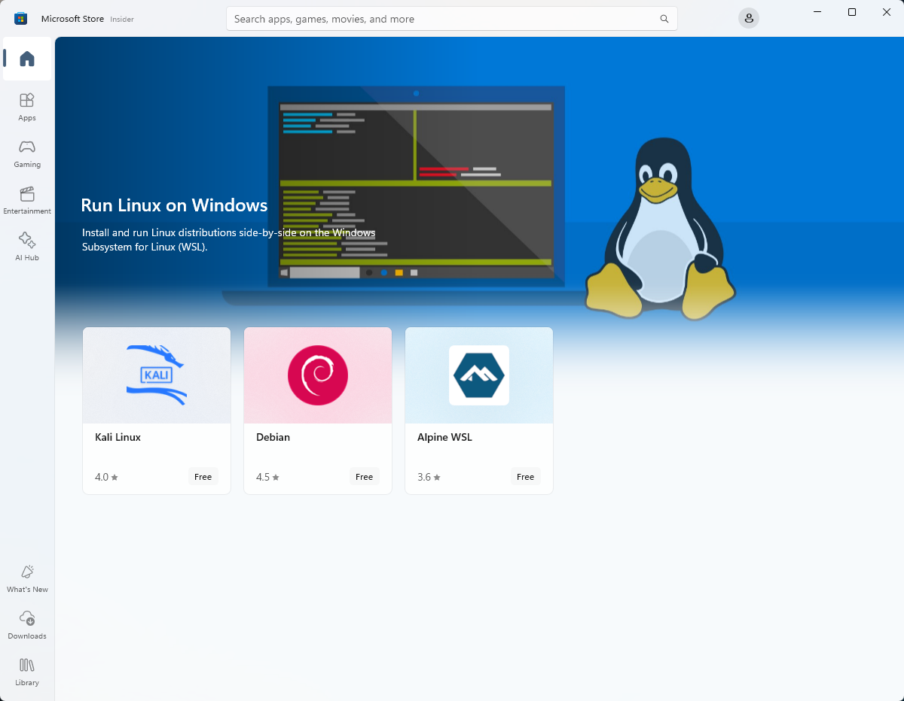{#fig-02-computing-and-programming-010}


**创建账户和密码** []{#src-0090-build-up-bioinfo-platform-183}

安装完成发行版后首次启动时会要求你创建用户名和密码。


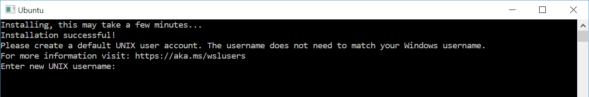{#fig-02-computing-and-programming-011}


#### Windows Terminal {#src-0090-build-up-bioinfo-platform-189}

> Windows 终端可启用多个选项卡（在多个 Linux 命令行、Windows 命令提示符、PowerShell 和 Azure CLI 等之间快速切换）、创建键绑定（用于打开或关闭选项卡、复制粘贴等的快捷方式键）、使用搜索功能，以及使用自定义主题（配色方案、字体样式和大小、背景图像/模糊/透明度）。

在应用商店搜索`Windows Terminal`后安装即可。


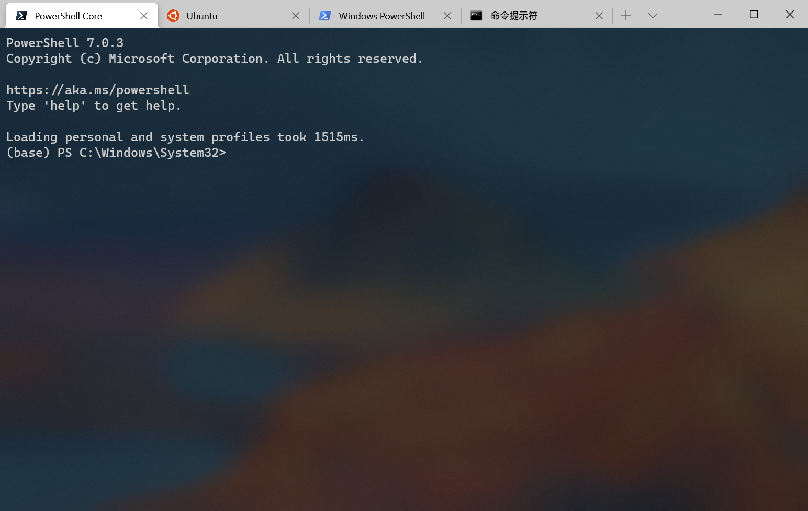{#fig-02-computing-and-programming-012}


### OpenSSH for Windows {#src-0090-build-up-bioinfo-platform-197}

SSH命令是链接服务器很重要的工具。Linux和Mac都是自带且启动SSH命令的，但是Windows长期以来都不自带SSH命令，直到Windows 10。Windows 10最新版目前自带OpenSSH客户端和服务器端，但是默认情况下都不启用。在任务栏搜索框中输入“可选功能”，结果中会出现“添加可选功能”，点击即可进入。也可以通过“Windows设置→应用→可选功能”进入。


::: {.book-placeholder}
原稿图片缺失或外部地址不可用：`https://images-cdn.shimo.im/ZZob1QhLKmoyhnlk/Snipaste_2018_09_09_21_16_25.png!original`。原有图位保留。
:::


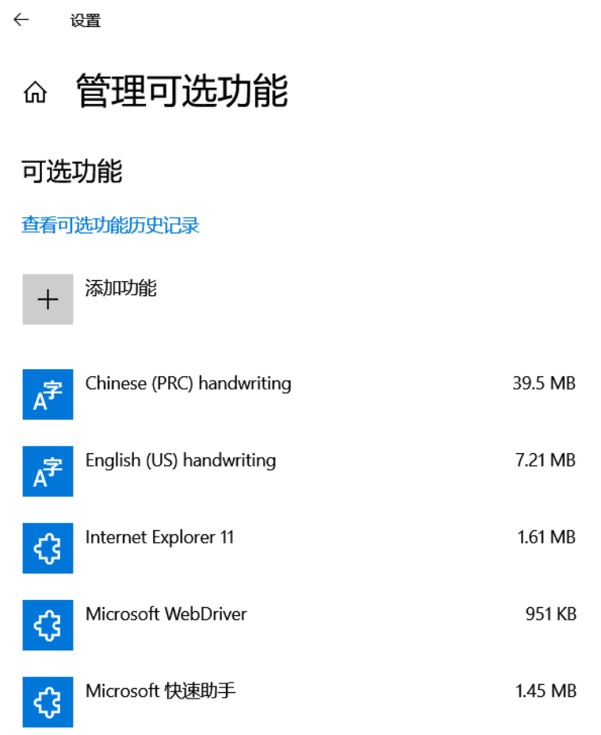{#fig-02-computing-and-programming-013}


点击“添加功能”进入到添加功能的页面，选择“OpenSSH客户端”，点击“安装”按钮即可开始安装，不长的一段时间后就安装完毕了。


::: {.book-placeholder}
原稿图片缺失或外部地址不可用：`https://images-cdn.shimo.im/2PrwPwoL75oUjCsd/Snipaste_2018_09_09_21_20_52.png!original`。原有图位保留。
:::


### Anaconda and bioconda {#src-0090-build-up-bioinfo-platform-209}


::::: {.callout-note .book-core title="核心知识｜Anaconda、conda 与 Bioconda"}

Anaconda是Anaconda公司开的一个Python发行版，集成的除了Python本体外还包括大量科学计算的常用模块和Anaconda公司开发的Python模块和环境管理器conda。conda管理器的对环境和包管理的易用性要超过Python本地自带的功能，而且还可以管理非Python的模块（Perl、Java、R……）。对于生信分析人员，Bioconda这个conda源更是收入了大量生信分析软件，大大降低了生信软件的安装复杂度，一条命令即可，不需要手动编译和root权限。

:::::


在你已经添加了相应软件源的情况下，安装包只要用下面的命令即可(这里演示的是IPython的安装)。


```{.bash data-book-role="code"}
conda install ipython
```

Anaconda的管理器默认会从Anaconda公司的官方服务器下载模块，而且默认只有一个default源。其他一些常用源像Bioconda也需要用户自己添加。这个时候手动添加所有常用源的国内镜像就十分有必要。

#### Anaconda的安装 {#src-0090-build-up-bioinfo-platform-221}

这些镜像网站本身也会提供Anaconda的安装包。直接从镜像站下载安装包就免去官网下载可能的卡顿。需要特别提到的是，镜像站除了提高标准版的Anaconda安装包外还会提供Miniconda的安装包。这是一个精简的版本，体积相比标准版要小不少，只包括Python和conda管理器，包需要自行通过`conda`和`pip`安装。在一些磁盘有限的情况下可以选择Miniconda。

Anaconda给Mac提供的是pkg和sh安装包，给Windows提供的是exe安装包，而给Linux只提供sh安装包。pkg和exe双击安装即可，而sh安装包需要通过命令行执行。即可通过图形界面启动sh安装包，很多设置也要在随之启动的终端下进行。

在这里也要特别提醒的是安装过程中pkg和exe安装过程中会有一部让你设置是否要将Anaconda的路径加入到环境变量中，一定要勾上。而sh安装的最后一部也会询问是否进行初始化（init），要记得输入`yes`。这些选上之后，只要重启终端环境变量即可生效，就可以正常使用conda管理和相关的包。

#### Anaconda镜像的设置 {#src-0090-build-up-bioinfo-platform-229}

目前国内最完善的公开Anaconda镜像就是清华大学的镜像(https://mirrors.bfsu.edu.cn/anaconda/ )， 不过国内部分地区访问清华大学镜像有时候不稳定，可以考虑使用北京外国语大学的镜像(https://mirrors.bfsu.edu.cn/help/anaconda/ )，其由清华开源软件协会负责维护内容基本保持一致，但是访问的稳定性很多时候更为优秀。帮助信息提到的存放`.condarc` 配置文件的用户目录，在Linux下使用`cd ~`命令进入；在Windows下使用`cd $env:USERPROFILE`命令进入，或者在资源管理地址栏输入`%USERPROFILE%`后回车进入。

我们依然推荐你通过上面的链接详细查阅他们的帮助信息，写入在`custom_channels`范围的镜像地址在使用时只有指定c参数才会生效。例如如果按帮助页面的信息设置Anaconda配置文件，使用`conda install seqkit`命令会按照失败，需要使用`conda install -c bioconda seqkit`命令。


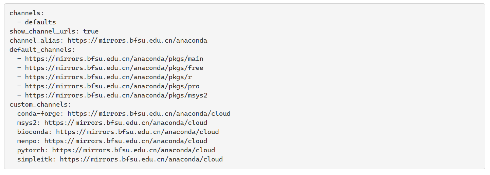{#fig-02-computing-and-programming-014}


#### Anaconda环境的管理 {#src-0090-build-up-bioinfo-platform-237}


::::: {.callout-note .book-core title="核心知识｜为不同项目隔离环境"}

为了防止不同的依赖之间相互冲突造成bug，除了最核心的常用组件，通常会为了每一类项目单独建立一个独立的环境。使得不同项目之间的模块可以版本不同。比如优势需要不同版本的Python或者R。

:::::


**创建环境**

你可以指定环境的名称，后面再赶上环境中一个或几个包的版本，也可以只有名称没有其他参数。这时新建的环境里就不会预装任何包


```{.bash data-book-role="code"}
conda create -n py2 python=2
```

指定环境名称的创建方式会把环境相关文件放在Anaconda的安装目录下，但是有时候你需要将环境相关文件放在制动的路径。这个时候你就可以通过`p`参数来指定conda环境的路径。比如下面就是一个指定环境目录为`/home/test_conda`并指定环境中的Python版本号为3.4。


```{.bash data-book-role="code"}
conda -p /home/test_conda python=3.4
```

**删除环境**

我们同样可以通过参数来指定特定名称或路径的环境。


```{.bash data-book-role="code"}
conda remove -n py2 --all
conda remove -p /home/test_conda --all
```

#### mamba {#src-0090-build-up-bioinfo-platform-264}

本书在这里还要特别提到一个C++的conda管理器实现：mamba。Anaconda千好万好，但是却有一个很致命的问题：计算依赖和扫描各个源的速度都较慢。当你已安装的包较多时，计算依赖和扫描源的时间都会不短。这个时候mamba就是一个拯救者的角色。通过C++的高效性，加上计算依赖和扫描源时的多线程并行，可以让原本耗时巨大的安装过程时间缩短十倍到几十上百倍。所以这里建议大家在安装完成Anaconda的第一时间就安装mamba。

安装mamba也很方便，直接通过`conda install -c conda-forge mamba`命令即可。安装完成后，所有出现`conda`命令的地方把单词替换成`mamba`即可。

::: {.book-placeholder}
本节内容待补充。
:::
## 命令行与文本文件操作 {#sec-02-02}

能在终端找到、查看、筛选和传递数据。

### Linux的一些基本概念 {#src-0090-build-up-bioinfo-platform-13}


#### Linux的环境变量 {#src-0090-build-up-bioinfo-platform-15}

Linux下的可以通过修改`~/.bashrc`来设置用户环境变量，修改`/etc/.bashrc`来设置系统环境变量。绝大多数情况下修改系统环境变量即可。具体添加到`.bashrc`的内容可以参考下方的代码。第一行是在一个已有的环境变量中添加值（Linux中一个环境变量下的多个值以冒号分隔），第二行则是创建一个并赋值一个新的环境变量或是修改一个已有环境变量的值。


```{.bash data-book-role="code" data-focus-lines="1,2"}
export PATH="/export/apps/JAVA/jdk1.8.0_111/bin:$PATH"
export JULIA_PKG_SERVER="https://mirrors.bfsu.edu.cn/julia/static"
```
修改完`.bashrc`文件后如果想到马上生效而不是重新启动命令行，可以使用`source`执行对应文件。比如设置用户环境变量时使用`source ~/.bashrc`即可。

::: {.book-placeholder}
本节内容待补充。
:::
## Shell 脚本与批量处理 {#sec-02-03}

将单条命令组织为可检查的批处理。

::: {.book-placeholder}
本节内容待补充。
:::
## R 数据处理与绘图基础 {#sec-02-04}

具备阅读差异分析代码和处理结果表的能力。

### R and Rstudio {#src-0090-build-up-bioinfo-platform-300}

R语言也是生信分子中一个极为重要的编程语言。R语言官方的软件源CRAN中有着大量数据分析和生信领域的相关包。Bioconductor项目更是集中了大多数生信领域的R包。

#### R-base的安装和CRAN镜像设置 {#src-0090-build-up-bioinfo-platform-303}

R-base的安装包可以通过CRAN的镜像站点获得(https://mirrors.bfsu.edu.cn/CRAN/ )，Windows和Mac根据你自己的操作系统点击链接，可以进入获取二进制安装包的页面。


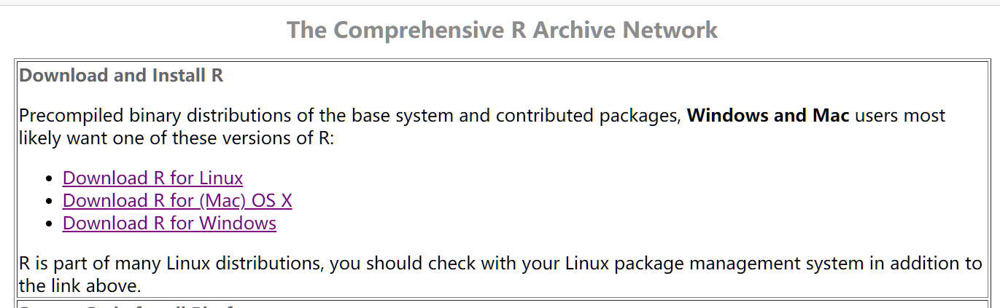{#fig-02-computing-and-programming-015}


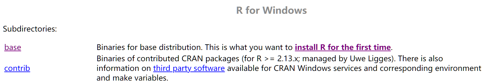{#fig-02-computing-and-programming-016}


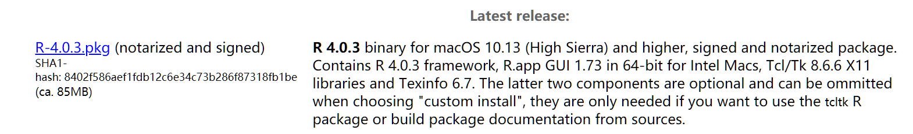{#fig-02-computing-and-programming-017}


Linux用户的话，有管理员权限的话建议使用系统的包管理器安装。如果没有管理员权限也不要紧，使用Anaconda即可。使用`conda install -c conda-forge r-base`命令就可以完成R-base的安装。

而CRAN的镜像设置需要进入R的用户home目录，可以在R的交互模式下通过命令`path.expand("~")`获取。


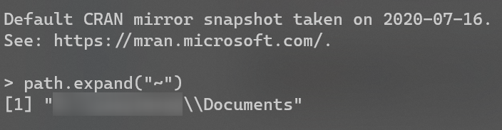{#fig-02-computing-and-programming-018}


获取R语言环境的home路径后，进入到该路径。查看路径下是否已经存在`.Rprofile`，如果没有则新建一个空白的即可。随后在`.Rprofile`文件末尾加入`options("repos" = c(CRAN="https://mirrors.bfsu.edu.cn/CRAN/"))`，保存后会在新启动的R环境中生效。

#### Rtools {#src-0090-build-up-bioinfo-platform-321}

Bioconductor和CRAN上提供的R包绝大部分都提供Windows平台下的二进制包，安装过程无需编译。但因为二进制包的更新一般晚于源码包的更新，且个别R包不提供二进制包，所有还是存在需要编译安装的情况。这个时候就需要R官方所提供的编译器集合Rtools。

访问（https://cran.r-project.org/bin/windows/Rtools/）即可获得安装包。要注意的是要根据自己系统的位数选择对应的安装包，以及Rtools页面提供的目前是Rtools40，仅适用于R 4.0及更新的版本。如果你还在使用R 3.X的版本，需要访问历史版本页面（https://cran.r-project.org/bin/windows/Rtools/history.html）下载对应的版本。


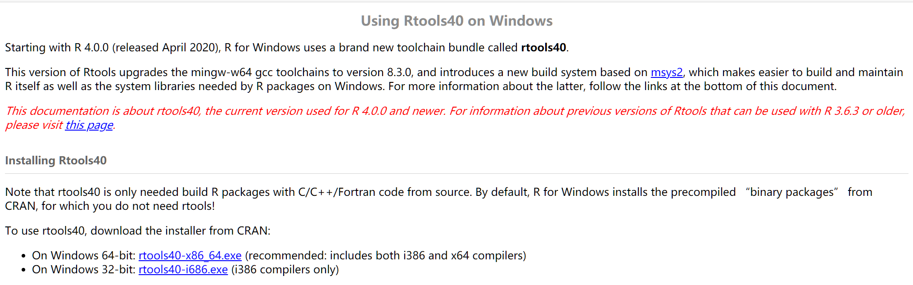{#fig-02-computing-and-programming-019}


安装完Rtools后仍需修改R环境变量配置文件以使R能够识别的Rtools的路径，在需要时调用相关编译器。可以参照上一节中的`path.expand("~")`获取R的用户home目录，然后在该目录下编辑`.Renviron`文件，添加下面的内容。


```{.text data-book-role="data"}
PATH="D:\\Program Files\\rtools40\\usr\\bin;${PATH}"
# 上面分号前的内容是Rtools安装目录下编译器所在路径，
# 应根据Rtools安装目录进行修改。
# 分号后的内容是表面是代表之前已有的PATH环境变量内容，
# 以免覆盖原有环境变量内容。
```

设置完R环境变量后应该保存文件，然后重启R的交互环境。然后在交互环境中使用语句`Sys.which("make")`验证是否设置成功，如果成功则会出现Rtools目录的`make.exe`的路径。如果设置成功，以后在出现源码包版本高于二进制包版本或R包吴源码包版本的情况，R就会提醒你是否进行编译安装。你可以使用语句

`install.packages("Rcpp", type = "source")`源码编译安装`Rcpp`包测试一下。


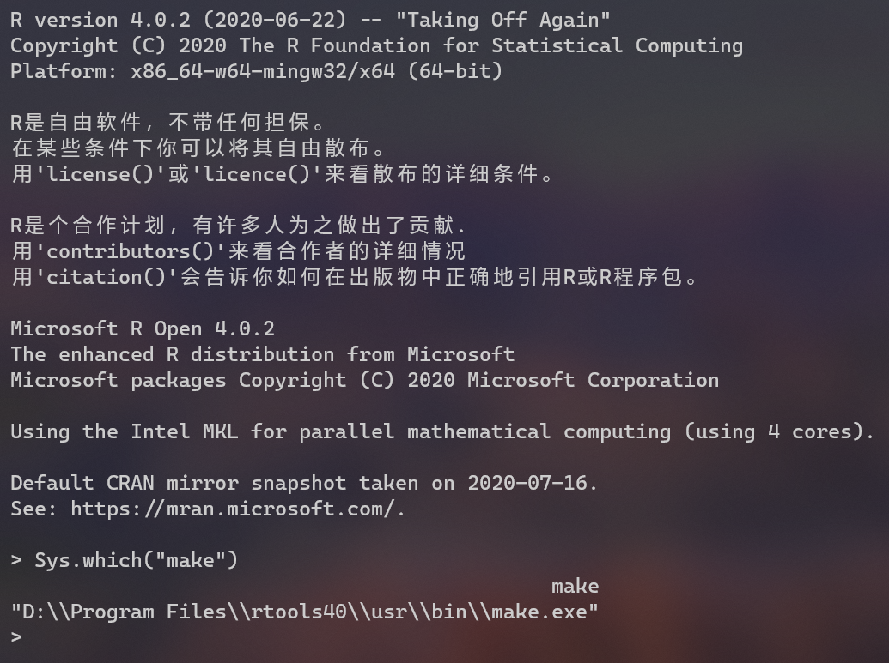{#fig-02-computing-and-programming-020}


::: {.book-placeholder}
本节内容待补充。
:::
## Python 与结构化配置的最低必要知识 {#sec-02-05}

能读懂基础脚本及后续 Snakemake 中的 Python 表达式。

### Jupyter {#src-0090-build-up-bioinfo-platform-270}

Jupyter是一个非盈利开源项目，2014年从IPython项目诞生。从诞生依赖不断发生，基于网页支持跨几乎所有编程语言的交互式数据分析与科学计算。最早的项目是IPython Notebook，随着发展改名Jupyter Notebook。而现在Jupyter项目的核心是JupyterLab。如果你之前是Jupyter Notebook的用户，迁移到JupyterLab的学习成本很低。第一眼看上去最大的变化可能就是多标签和侧边栏。当然由于相对于Jupyter Notebook，JupyterLab的历史还短一些，一些主题和个别扩展还不支持JupyterLab。但是随着JupyterLab正式版来到2.X时代，扩展生态已经相当发达。

#### 安装JupyterLab {#src-0090-build-up-bioinfo-platform-274}

安装JupyterLab非常简单，Pypi和Anaconda都有收录。这里再度建议大家使用C++实现的conda管理器mamba进行安装


```{.bash data-book-role="code"}
pip install jupyterlab # pypi安装
conda install jupyterlab # anaconda安装
mamba install jupyterlab # mamba安装
```

#### 内核安装 {#src-0090-build-up-bioinfo-platform-284}

JupyterLab安装时只支持Python，如果需要支持其他语言，需要自己安装相应的内核。例如R语言需要安装R包`IRkernel`，然后在R交互模式中使用`IRkernel::installspec()`命令注册内核到JupyterLab。而Julia语言则需要安装Julia包`IJulia`，然后通过`build IJulia`命令来注册内核。

#### 本地和远程使用 {#src-0090-build-up-bioinfo-platform-288}

JupyterLab的本地启动十分简单，启动一个终端（Windows下可以选择PowerShell，或者通过Windows Terminal使用某个终端），切换到你需要进行分析的目录。Jupyter只可以读取启动时的目录及其子目录下的文件。当进入到需要的目录是，在终端中使用`jupyter lab`命令就可以启动JupyterLab。默认浏览器这时会自动启动，并打开JupyterLab的页面。

而远程使用服务商的应用会复杂一些。需要先在本地的终端中使用`ssh`命令将服务器的客户端的某特定端口映射到本地计算机。执行完下面的命令后，会登录远程服务器，再使用`jupyter lab`即可启动远程服务器上的JupyterLab。在本地浏览器中访问`127.0.0.1:1234`即可链接服务器的8888端口。（username是你在服务器上的用户名，serverip为服务器IP地址。1234为希望的本地端口，8888则为远程服务器的端口。）


```{.bash data-book-role="code"}
ssh username@serverip -L 127.0.0.1:1234:127.0.0.1:8888
```


::::: {.callout-warning .book-warning title="注意｜以实际启动端口为准"}

这里还需要提醒大家，有时候因为服务器上已经有其他用户，或者你之前启动了一个JupyterLab还未关闭，远程端口可能不会是8888。所以这里其实更推荐大家，先用ssh登录远程服务器（可以使用某些ssh软件比如MobaXtrem，也可以用`ssh`命令）启动JupyterLab，通过启动时的提示信息查看端口号，由此更改下面映射命令中远程服务器端口。

:::::


### Julia {#src-0090-build-up-bioinfo-platform-346}

Julia是一门很新的语言，2018年8月8日才正式发布1.0版。算是迈入了相对成熟的阶段。它是一门动态类型语言，语法规则简单，类似Python；它编译运行，运行效率很高，类似C++/C；对正则支持良好，类似Perl……

Julia对并行和分布式也支持良好，比如一个多线程的for循环只要像下面一样在原有的for循环代码上简单地加上`@threads`宏。


```{.julia data-book-role="code" data-focus-lines="1"}
Threads.@threads for i = 1:1000
    ago_sdf = cm_df[i,:]
end
```

当然，它也非尽善尽美，仍然存在不足：

1. 生物信息学领域生态相对不足。虽然BioJulia项目已经初具规模，提供了不少高质量的Julia包，但是和有着长久积累的R和Python而言还差异巨大。
2. 因为需要进行编译，所以运行前存在“预热”时间，并不适合本身运行时间就很短的任务，否则反而有可能导致效率下降。

#### Julia基础环境搭建 {#src-0090-build-up-bioinfo-platform-363}


**Julia的安装** []{#src-0090-build-up-bioinfo-platform-365}

Julia语言的安装相对来说是很友好的：Mac下提供了二进制安装包，Linux下提供了解压后即可用的压缩包，Windows下则同时提供了两类安装包。下载的地址，国外的用户建议直接上官网（https://julialang.org/downloads/），而国内用户我们依然建议使用已经推荐了很多次的北外镜像（https://mirrors.bfsu.edu.cn/julia-releases/bin/）。

使用二进制安装包或解压可用的安装包安装后，要记住把Julia可执行程序的所在目录添加到环境变量PATH中。比如现在我的Julia安装在`D:\Program Files\Julia-1.5.2`中，需要添加到环境变量PATH中的就是`D:\Program Files\Julia-1.5.2\bin`。具体的添加方法请查看本章前面的部分。

**Julia的REPL** []{#src-0090-build-up-bioinfo-platform-371}

Julia带有一个交互式命令行环境REPL（read-eval-print loop），它内置于`julia`可执行文件中。其允许简单快捷地执行Julia语句，同时具有可搜索的历史记录、tab补全功能、help和shell模式以及一些实用的快捷键。只要不带参数地执行`julia`可执行文件（Julia可执行程序的所在目录添加到环境变量PATH中后，在终端中执行`julia`命令即可）或着双击执行`julia`可执行文件就可以启动REPL。

Julian模式：REPL的默认操作模式，可以快捷执行Julia语句。

pkg模式：包管理模式，在默认模式下光标位于行开头时输入]（英文右侧方括号）进入。

shell模式：命令模式，在该模式下可使用系统命令。

help模式：帮助模式，可以在该模式下查看各种帮助信息。例如可以在help模式下使用`if`命令查看if语句的帮助信息，使用`@time`查看`@time`宏的帮助信息。

**Julia的设置** []{#src-0090-build-up-bioinfo-platform-383}

Julia的各种自定义设置都是通过环境变量进行的。其有两类方式进行修改。一是通过更改系统或当前用户的环境变量进行，Julia的线程数环境变量`JULIA_NUM_THREADS`和Julia仓库路径环境变量`JULIA_DEPOT_PATH`等少数环境变量只能通过此种方式进行修改。二是通过修改Julia参考路径下的`config`目录下的`startup.jl`文件内容设置其他大部分Julia设置环境变量。例如Julia包服务器地址环境变量`JULIA_PKG_SERVER`就可以通过在添加语句进行设置。例如可以在该文件中添加一行`ENV["JULIA_PKG_SERVER"] = "https://mirrors.bfsu.edu.cn/julia/static"`将包服务器设置为北外开源镜像站的地址。特别提醒，仓库路径也是存放二进制依赖、包原始文件、包预编译文件等属于当前用户的Julia环境数据。所以如果你想自定存放这些文件的地方就只能通过系统环境变量或者当前用户环境变量设置环境变量`JULIA_DEPOT_PATH`的值。如果不进行自定义设置，则仓库路径为当前用户的用户目录下的`.julia`目录。

**Julia包的管理** []{#src-0090-build-up-bioinfo-platform-387}

Julia的使用REPL的pkg模式进行包管理。在pkg模式下，`add`命令按照包，`up`命令升级包，`rm`命令卸载包，`status`查看已安装包的状态。例如可以在pkg模式下用`add IJulia`命令安装IJulia包。

**开发环境配置** []{#src-0090-build-up-bioinfo-platform-391}

Julia的开发环境主要有三种，JupyterLab、Visual Studio Code和基于Julia的Pluto。

**JupyterLab的Julia环境配置**

Julia本体安装完成后，再安装IJulia包，IJulia包安装好后，执行`build IJulia`目录进行初始化即可将Julia内核添加至JupyterLab。


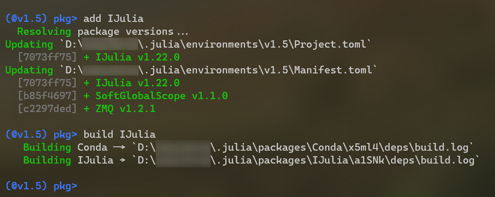{#fig-02-computing-and-programming-021}


**Visual Studio Code的Julia环境配置**

Visual Studio Code可以通过安装Julia扩展快捷地获得对Julia的支持。安装后还需要修改VS Code设置中的`julia.executablePath`设置项，设置`julia`可执行文件的完整路径。


{#fig-02-computing-and-programming-022}


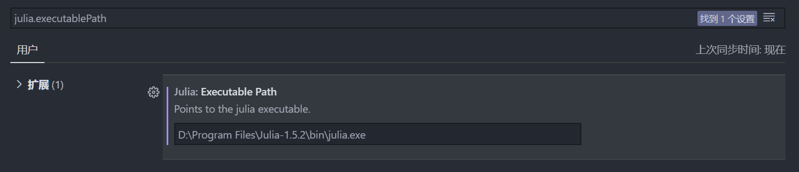{#fig-02-computing-and-programming-023}


**Pluto环境设置**

Pluto是一个基于Julia的轻量、易用且具有反应式特性（当改变一个函数或变量时，Pluto会自动更新所有受影响的Cell。）的交互式notebook。安装Pluto只要通过pkg模式安装`Pluto`包即可。启动则在REPL默认模式下使用以下命令即可。


```{.julia data-book-role="code" data-focus-lines="2"}
import Pluto
Pluto.run()
```

### Perl {#src-0090-build-up-bioinfo-platform-418}

Perl作为一个生信分析领域上有着大量积累的脚本语言，你完全可以不用学习从头编写Perl脚本，但是很可能你会需要使用别人的Perl脚本，或者使用一些基于Perl的生信分析软件。所以掌握Perl环境的搭建就是很有必要的。

感谢十分强大的Anaconda以及收录了大部分生信相关Perl模块的Bioconda和conda-forge软件源，对于我们来说搭建Perl环境是相对很简单的。首先你要确认你按照本书之前的部分为Anaconda添加了Bioconda和conda-forge源。那么就可以简单地在终端中使用`conda install -c conda-forge perl`命令安装Perl。当然如果你所使用的分析软件或者Perl脚本如果不依赖第三方模块，其实也可以直接使用Linux和MacOS自带的Perl。

安装Perl第三模块会稍稍麻烦点，因为Bioconda和conda-forge收录的模块的名字形式稍稍和Perl官方源略有不同。你可以使用网站（https://anaconda.org/）进行搜索，比如查找bioperl模块可以搜索`bioperl`，就可以找到相应的模块名称和安装命令。


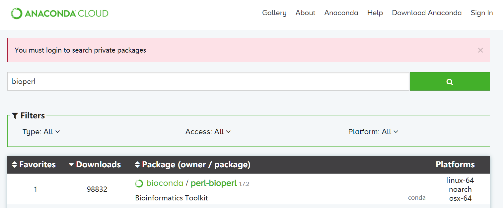{#fig-02-computing-and-programming-024}


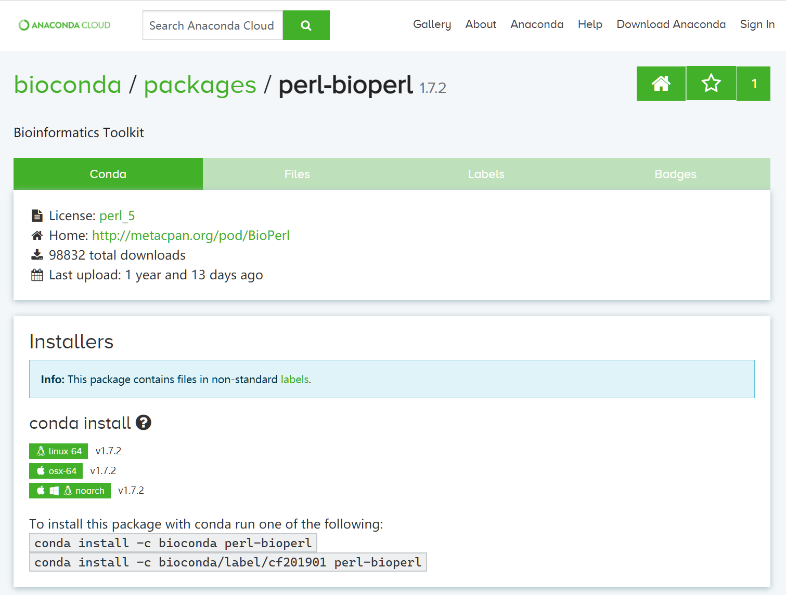{#fig-02-computing-and-programming-025}


::: {.book-placeholder}
本节内容待补充。
:::
## 项目目录、版本管理与排错 {#sec-02-06}

形成可维护的工作习惯，遇到错误能够定位原因。

### 其他内容 {#src-0090-build-up-bioinfo-platform-431}

::: {.book-placeholder}
本节内容待补充。
:::
::: {.book-placeholder}
本节内容待补充。
:::