# 测序技术 {#sec-ch03}

::: {.hero-book .book-chapter-summary}

## 本章提要 {#chapter-summary-03 .unnumbered}

本章围绕测序技术和原始数据展开：先理解不同实验究竟测到了什么，再沿技术发展认识 Sanger 测序与高通量测序、以 Illumina 为代表的第二代测序、MGI，以及 PacBio 与 Nanopore 长读长技术。随后把高通量文库构建与 FASTA/FASTQ 数据存储、质量编码联系起来，学习逐模块阅读 FastQC 报告，掌握去接头、质量裁剪与 seqkit 等常见数据清理操作。通过这些内容，希望你能说明原始数据的来源，读懂质量信息，并解释每一次数据处理的目的。

:::

## 不同测序实验究竟测到了什么 {#sec-03-01}

避免把不同实验的 reads 当作同一种生物学测量。

拿到一份测序数据时，最先要回答的问题不是“用什么软件分析”，而是“这份样本里究竟测到了什么分子”。测序仪输出的 reads 形式上都一样——一串 A、T、C、G 和对应的质量值——但它们背后的生物学对象可以完全不同：有的测的是基因组 DNA，有的测的是逆转录后的 mRNA，有的测的是被蛋白质“拉下来”的 DNA 片段，还有的只测外显子区域。如果不清楚 reads 的来源，后面的每一步分析都可能答非所问。

理解一份测序数据，可以从三个问题入手：**样本是什么**（组织、细胞还是单个细胞）；**文库怎么建**（片段如何打断、是否逆转录、是否富集特定区域）；**测的是哪一段**（基因组全序列、外显子、转录本还是结合位点片段）。下表列出本书后续章节会详细分析的常见实验类型。

| 实验类型 | 测到的分子 | 回答的生物学问题 | 详见 |
| --- | --- | --- | --- |
| 全基因组测序（WGS） | 基因组 DNA 片段 | 群体与个体变异、基因组组装 | 第 7 章 |
| 全外显子测序（WES） | 富集到的外显子区域 DNA | 罕见病与癌症中的编码区变异 | 第 7 章 |
| 转录组测序（RNA-seq） | mRNA 逆转录成的 cDNA | 基因表达水平与差异表达 | 第 5 章 |
| 单细胞转录组测序 | 单个细胞内的 mRNA | 细胞类型、状态与发育轨迹 | 第 9 章 |
| ChIP-seq | 蛋白质结合的 DNA 片段 | 转录因子或组蛋白的结合位置 | 第 6 章 |
| ATAC-seq | 开放染色质区域的 DNA | 染色质可及性变化 | 第 6 章 |
| 长读长测序 | 长片段 DNA 或 RNA | 结构变异、复杂区域、转录本异构体 | 本章 3.5 节 |

: 常见测序实验类型与其测到的分子 {#tbl-03-experiment-types}

同一个样本用不同实验处理，得到的 reads 含义完全不同；反过来，不同的建库方案也会改变数据的偏向和噪声特性。本章接下来先介绍产生这些 reads 的测序技术本身，再讲文库构建、数据存储格式与质量评估，为后续各章的具体分析打下基础。

## 从 Sanger 到高通量测序 {#sec-03-sequencing-generations}

[]{#question-01-77}

理解每一代测序技术解决了什么问题、又付出了什么代价。

### Sanger 测序：双脱氧链终止法 {#question-01-80}

[]{#basic_knowledge}

Sanger 法即双脱氧链终止法，是第一代测序技术的代表。它利用 DNA 复制原理，在反应中加入双脱氧核苷三磷酸（ddNTP）：ddNTP 缺少 3′ 羟基，一旦掺入延伸中的链，反应就无法继续，DNA 链便在对应位置终止。四种 ddNTP 分别反应（或以荧光标记区分）后，依据不同长度的终止片段判断每个位置的碱基类型。

Sanger 测序的读长可达 500—1000 bp，单条序列的准确率很高，至今仍是验证少量序列的“金标准”。它通量低的核心原因是每条序列都需要独立的反应和电泳分离（早期为凝胶电泳，后来是毛细管电泳），一次运行的并行条数有限。实验室里常用它验证质粒、PCR 产物或克隆单条序列，但测一个人类基因组就需要天文数字的独立反应，成本无法承受。

### 第二代测序的兴起 {#src-0020-introduction-of-NGS-1}

[]{#question-01-83}

第二代测序（Next Generation Sequencing，NGS）的核心突破不是把单条序列读得更准，而是**并行化**：把亿万条模板片段固定在芯片上同时测序，用“空间换通量”。发展过程中出现过几条技术路线：Roche 454 采用焦磷酸测序，Ion Torrent 用半导体芯片检测合成时释放的氢离子，而 Illumina（源于 Solexa 公司 2006 年发布的 Genome Analyzer）采用荧光可逆终止化学，凭借通量和成本的平衡最终占据主导。我们接触到的很多生物信息学技术，比如 RNA-seq、ChIP-seq、Hi-C 等，都建立在 NGS 之上。

于是第二代测序呈现鲜明的特点：**高通量、单碱基成本低，但读长短**（通常 50—300 bp）。本章 3.3 节以 Illumina 为代表讲解原理，其他短读长平台思路相近。

### 机型与通量：随时代变化 {#question-01-133}

[]{#question-01-132}

分析数据前需要知道它出自什么仪器。本系列写作时期（约 2016—2018 年）Illumina 的主流机型及通量：HiSeq 2500（50—1000 Gb）、HiSeq 3000（125—750 Gb）、HiSeq 4000（125—1500 Gb）、HiSeq X Five（900—1800 Gb）和 HiSeq X Ten（900—1800 Gb）。

::: {.callout-warning .book-warning title="注意｜机型与通量随时间变化"}

HiSeq 系列现已停产。如今 Illumina 的主力机型是 NovaSeq 6000 与 NovaSeq X/X Plus（单次运行可达 Tb 级），中小通量有 NextSeq 2000/550、MiSeq 等；华大智造 MGI 的 DNBSEQ 系列也广泛使用。不同型号的通量、读长和流动槽结构差异很大，分析具体数据前应以测序公司提供的实际参数为准。

:::

## Illumina 测序原理 {#sec-03-02}

[]{#src-0020-introduction-of-NGS-3}

理解接头、索引、双端测序和测序错误如何影响数据。

### 一些常用基本概念的介绍 {#src-0020-introduction-of-NGS-8}

- **flowcell**（流动槽）是测序反应发生的位置；lane 数目随仪器和流动槽型号变化
- **lane**（泳道）是流动槽内的反应区域，具体结构取决于平台
- **tile** 每一次测序荧光扫描的最小单位
- **read** 指一次读取获得的序列，复数为 reads
- **bp** base pair 碱基对，用于衡量序列长度
- **双端测序** 指从同一插入片段的两端分别读取，例如一个 500 bp 的插入片段两端各读 150 bp
- **未读取区间** 在上述例子中，中间还有约 200 bp 未被两端的 reads 覆盖；这段区间不称为 junction。RNA 比对中的 splice junction 通常指剪接连接位点
- **adapter** 建库时连接到片段两端的人工序列，包含测序引物结合位点等功能元件
- **primer** PCR 或测序反应中的引物

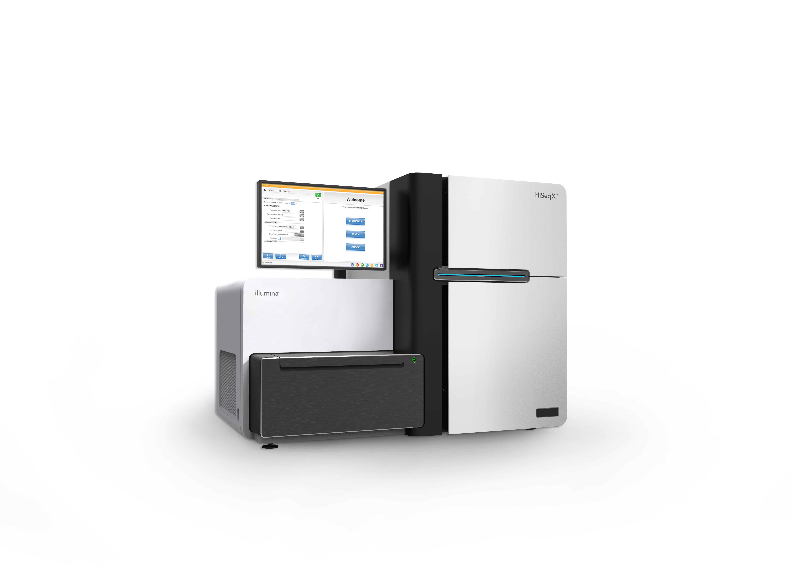{#fig-03-sequencing-and-data-formats-001}

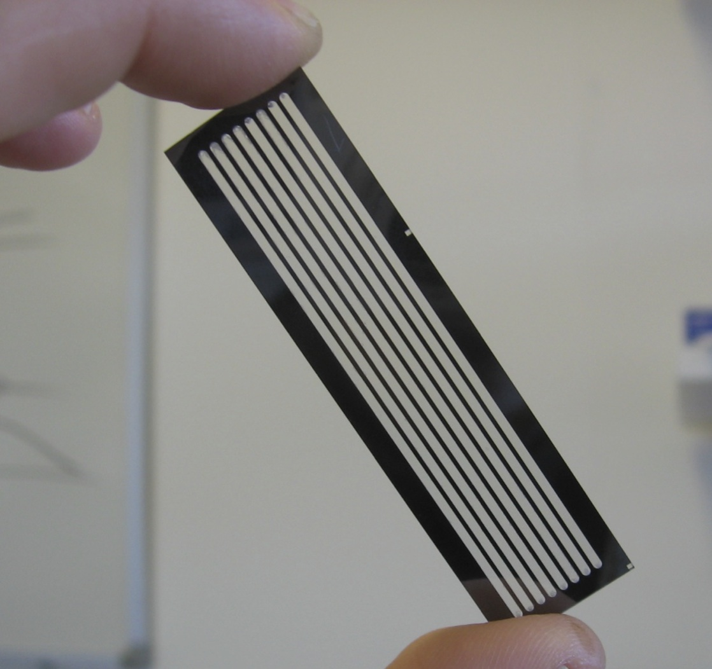{#fig-03-sequencing-and-data-formats-002}

[]{#question-01-118}

）](../assets/a-questions-01-05/002-flowcell.jpg){#fig-a-questions-01-05-002}

### 桥式 PCR 与簇生成 {#src-0020-introduction-of-NGS-36}

[]{#question-01-101}

单分子发出的荧光太弱，无法直接检测，因此测序前要先在流动槽表面把每个模板扩增成“簇”。将调整到合适浓度的 DNA 文库加入 flowcell，文库片段末端的 adapter 与流动槽表面固定的寡核苷酸互补配对，通过共价连接固定。随后开始桥式 PCR：第一轮扩增把单链补成双链；加入 NaOH 碱性溶液变性、洗脱——由于最初的连接是共价键，模板不会被洗掉；再加入缓冲液，序列自由端与表面相邻的寡核苷酸配对，弯成“桥”状进行一轮扩增。如此循环，每个原始分子就扩增成一个由完全相同序列组成的簇（cluster）。

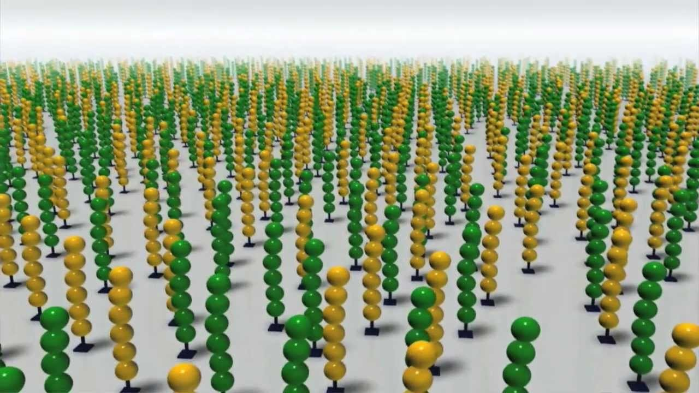{#fig-03-sequencing-and-data-formats-004}

{#fig-03-sequencing-and-data-formats-005}

在整个 flowcell 上看，就是一个个彼此独立的 cluster；测序时每个 cluster 作为一个“单分子”参与信号读取，这就是二代测序并行化的物理基础。

### 边合成边测序（SBS） {#src-0020-introduction-of-NGS-55}

[]{#question-01-99}

[]{#question-01-86}

[]{#question-01-135}

::: {.callout-note .book-core title="核心知识｜边合成边测序的循环"}

测序时，聚合酶沿模板延伸引物，加入带有可逆终止基团的核苷酸，使一轮反应只延伸一个碱基。仪器根据荧光信号判断本轮加入的碱基，再解除终止并进入下一轮。不同代际平台的荧光编码和化学体系有所不同，不能都理解为四种碱基各自发出一种颜色。

:::

Illumina 边合成边测序（Sequencing by Synthesis，SBS）的化学核心是**可逆终止子核苷酸**：它在两个方面经过修饰——碱基通过可切除连接子带上荧光染料；脱氧核糖 3′ 羟基被叠氮甲基（–CH₂–N₃）封闭，保证每轮反应只能延伸一个碱基。下页的示意图给出直观印象，精确的化学结构见本节末的拓展阅读框。

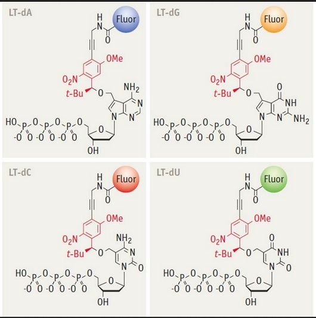{#fig-03-sequencing-and-data-formats-006}

每轮循环包含三步：聚合酶掺入一个带荧光的可逆终止子，仪器扫描并记录整个 cluster 的荧光颜色，随后用化学试剂（TCEP）一步完成两件事——3′ 封闭基团完全恢复为羟基、碱基上的染料被切除（切除后在碱基上残留一小段连接子）——再进入下一轮。因为一个 cluster 中所有序列都是同一条模板的拷贝，理论上每轮整个 cluster 发出同一颜色的荧光；逐 tile 扫描、把信号序列转换成碱基序列，就完成了测序。

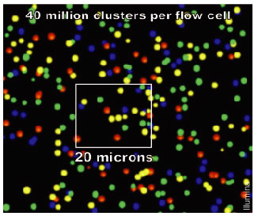{#fig-03-sequencing-and-data-formats-007}

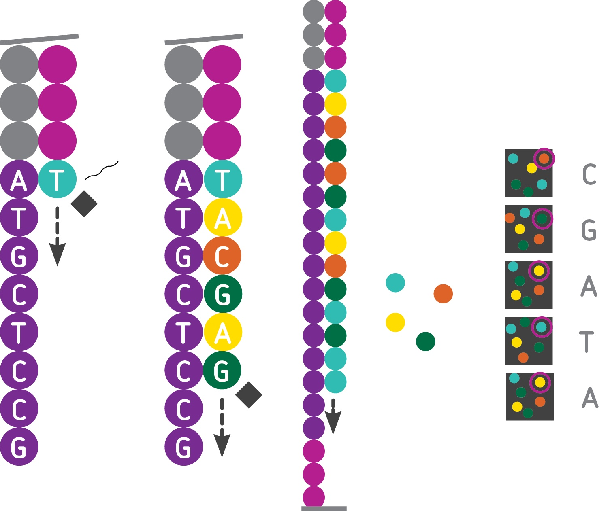{#fig-03-sequencing-and-data-formats-008}

::: {.callout-note .book-extension title="拓展阅读｜可逆终止子的化学结构" collapse="true"}

下图是 3′-O-叠氮甲基-dCTP 的精确结构：A 面板为完整分子，B、C 面板放大两个关键修饰位点，供希望深入理解化学原理的读者参考。

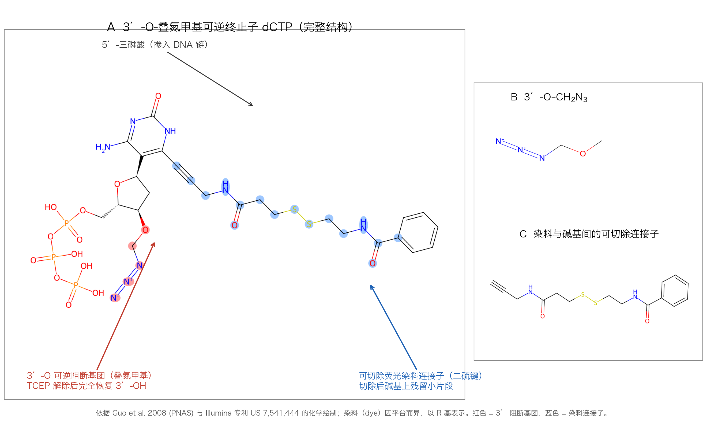{#fig-03-nucleotide-reversible-terminator}

- **3′-O-叠氮甲基（–O–CH₂–N₃，B 面板）**：3′ 羟基被“叠氮甲基”以醚键封闭，聚合酶无法继续延伸。它本质上是半缩醛的保护形式：TCEP（水溶性膦试剂）对叠氮基发生 Staudinger 型还原，产物不稳定、随即水解释落，干净地恢复 3′-OH——掺入链的糖环上不留任何残基。注意名称与写法：是 3′-**O**-叠氮甲基（N₃，三个氮），不是“3′-叠氮”，更不是 N₂。
- **碱基上的可切除染料（C 面板）**：荧光染料通过连接子接在碱基上——嘧啶接 C5，嘌呤接 C7（且必须画成 7-脱氮嘌呤才能带 C7 取代基）；先经炔丙胺（–C≡C–CH₂–NH–）连接，再经可断裂连接子（早期商业化学为二硫键）连到染料。同一步 TCEP 处理把染料切除，但连接子会有一小段残留在碱基上（所谓“scar”）：掺入的碱基与天然碱基并不完全相同，只是不影响后续轮次的碱基判读。
- **5′-三磷酸**：与天然 dNTP 相同，由聚合酶正常识别并掺入，染料和封闭基团都只在 3′ 端与碱基上做文章。
- **历史脉络**：2006 年 Ju 组的四色 SBS 论文用的是 3′-O-烯丙基封闭（钯催化脱除）；2008 年同组改为 3′-O-叠氮甲基（TCEP 脱除），后者成为 Solexa/Illumina 的商业化学并沿用至今。两色化学改变的只是检测方式，终止子本身没有变。

:::

::: {.callout-note .book-extension title="拓展阅读｜为什么有的平台只需要两种荧光" collapse="true"}

早期 Illumina 平台四种碱基各带一种染料，需要四个光学通道。NovaSeq 等新平台改用两色编码：G 不带染料（“暗碱基”），一个碱基带双染料，其余两种各带一种染料——例如 NovaSeq 6000 上 A 为红绿双染、C 红、T 绿、G 暗；NovaSeq X/XLEAP 化学则改为蓝绿双通道，C 为双染。减少通道可以提高成像速度和密度，代价是需要靠“有无信号”的组合来推断碱基，对信号质量的要求更高。

:::

### 读长的限制：phasing 与 pre-phasing {#question-01-144}

[]{#question-01-89}

Illumina 单端读长通常不超过 300 bp，主要有两方面原因。

第一，测序循环中不同模板链的延伸会逐渐失去同步，即 **phasing**（落后：本该加的碱基没加上）与 **pre-phasing**（超前：一轮加了不止一个碱基）。通俗地讲，一个 cluster 起初是 100 条完全相同的链；某轮如果 99 条加了碱基、1 条没加，整体信号仍是那种颜色，还能正确判断；但随着循环数增加，不同步的链越来越多，杂信号越来越强，最后可能出现“50 红 50 绿”，无法判断到底是哪种碱基。造成 phasing 的主要原因是部分链没有正常延伸（如聚合酶活性下降）；pre-phasing 则可能来自可逆终止基团提前脱落或不完全终止。

第二，测序使用的核苷酸带有很大的荧光修饰基团，聚合酶长时间反应后活性下降；实际读长还受化学稳定性、信号质量和解码方法等因素影响，不能把所有平台归为同一种“荧光淬灭原理”。

相比之下，Sanger 测序的每条序列独立反应、独立电泳读出，不受 cluster 同步性限制，因此单条序列可以读到 500 bp 以上。

## MGI 测序技术 {#sec-03-03}

知道第二个主流短读长平台用什么策略解决同样的问题。

### 华大智造测序仪 {#src-0020-introduction-of-NGS-84}

华大智造（MGI）的 DNBSEQ 技术同样实现大规模并行短读长测序，但簇生成和测序化学与 Illumina 不同。

文库片段先环化，再通过**滚环复制**（rolling circle replication）反复复制同一个环状分子，形成由大量相同拷贝组成的 DNA 纳米球（DNB，DNA Nanoball）。这一步是溶液中的线性扩增：每轮复制都从原始环重新读取，复制错误不会像链式反应那样指数放大。制备好的 DNB 被加载到芯片上规则排列的结合位点，每个位点只容纳一个纳米球，形成规则阵列。

测序采用 **cPAS**（联合探针锚定聚合测序）：每轮反应中加入带荧光的可逆终止 dNTP，在锚定探针和聚合酶的作用下延伸一个碱基并成像，随后清除荧光、解除终止进入下一轮。reads 输出同样是 FASTQ 格式，与 Illumina 数据的下游分析流程高度兼容。

常见机型覆盖不同通量：DNBSEQ-T7 与 T20×2 面向超大人群测序，MGISEQ-2000/DNBSEQ-G400 等常用于科研与临床。选型时同样应查对应型号的实际参数，而不是凭印象套用其他平台的数字。

## 长读长测序：PacBio 与 Nanopore {#sec-03-04}

知道何时短读长不足，并正确理解长读长技术的输入输出。

短读长 reads 难以跨越重复序列、结构变异和全长转录本，这时需要长读长技术。与短读长平台不同，长读长测序不依赖簇扩增，而是直接读取单个分子。

### PacBio：SMRT 测序与 HiFi 读长 {#src-0020-introduction-of-NGS-78}

PacBio 的 SMRT（Single Molecule Real-Time）测序把单个聚合酶固定在零模波导孔（ZMW）底部，四种带不同荧光染料的 dNTP（染料标记在磷酸链上，掺入后自动脱离，因此不需要可逆终止）逐个掺入，实时记录荧光脉冲序列。聚合酶可以连续合成，单条读长可达数十 kb。

SMRT 的单遍错误率较高（约 10% 量级），但错误基本随机分布。HiFi 测序利用这一点：把同一分子环化后反复读取（至少 3 遍），对多次读取取一致序列，得到既长（15—25 kb）又准（Q30 以上）的 HiFi reads。PacBio 适合解决结构变异、高度重复或复杂区域，以及通过 Iso-Seq 获得全长转录本。

### Nanopore：纳米孔电流测序 {#src-0020-introduction-of-NGS-81}

Oxford Nanopore 的原理完全不同：马达蛋白牵引单链 DNA（或 RNA）穿过嵌在膜上的纳米孔，不同碱基组合对孔道电流的阻滞不同，仪器连续记录电流变化，再由碱基识别算法（basecalling）把电信号翻译成序列。它不依赖合成反应，读长理论上只受样品 DNA 长度限制，可达数百 kb 至 Mb 级；设备从掌上 MinION 到高通量台式机都有，可以现场快速测序。

纳米孔的单遍错误率历史上约 5%—10%，且存在非随机的系统偏差；随着化学体系与识别算法改进（如 Q20 化学和新版 basecaller），精度持续提升。它还能对 RNA 直接测序（不经过逆转录），保留碱基修饰信息，这是其他平台做不到的。

### 长读长 RNA 测序 {#src-0050-RNA-seq-85}

常规短读长 RNA-seq 通常先把 RNA 逆转录成 cDNA，再进行文库构建（流程详见第 5 章）。长读长技术可以减少把一个转录本拆成许多短片段后再推断结构的困难，因此特别适合理解转录本异构体。

::: {.callout-note .book-core title="核心知识｜长读长与直接 RNA 测序"}

PacBio 的 SMRT 测序观察聚合酶合成 DNA 时的荧光信号。Iso-Seq 分析的是由 RNA 逆转录得到的全长 cDNA，不能称为直接 RNA 测序。Oxford Nanopore 则根据核酸链通过纳米孔时的电流变化推断序列，既有 cDNA 测序，也有直接 RNA 测序；其常用平台不依靠外切酶逐个切下碱基再读取。

:::

长读长、准确度、通量和定量性能需要结合具体平台、化学版本和建库方案讨论，不能只用某一代平台的单一数值来概括。PacBio、Nanopore 和直接 RNA 测序的进一步比较、示例数据与练习待完善。

参考：[Oxford Nanopore 技术说明](https://nanoporetech.com/platform/technology)；[PacBio RNA 测序说明](https://www.pacb.com/products-and-services/applications/rna-sequencing/)。

## 高通量文库构建 {#sec-03-05}

[]{#question-01-94}

理解文库结构，才能解释 reads 里为什么会有接头和 index。

### 建库的基本流程 {#src-0020-introduction-of-NGS-24}

::: {.callout-tip .book-example title="示例与练习｜片段化 DNA 文库"}

短读长测序每次只能读取有限长度，因此需要先把待测核酸制成适合平台的文库。下面以片段化的 DNA 文库为例：先把较长的 DNA 打断，再通过片段筛选控制长度分布。本书以 300—500 bp 的插入片段举例；实际范围应按建库方案、读长和研究目的确定。

:::

打断以后的片段末端往往不平整，先用酶补平，得到平末端；再在 3′ 端用酶加上一个特异的碱基 A。此后利用 A 与未端 T 的互补配对，把 adapter 连接到片段两端。

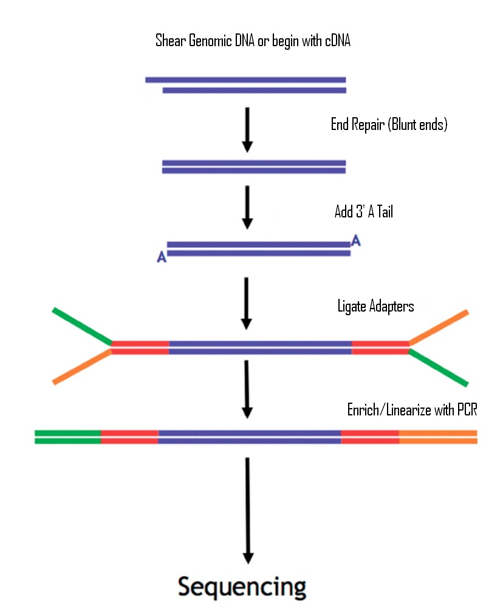{#fig-03-sequencing-and-data-formats-003}

### 接头（adapter）的结构与作用 {#question-01-97}

[]{#question-01-148}

[]{#question-01-156}

adapter 中文常译为适配器或接头，是建库时连接到片段两端的人工序列。它不只是“一段引物”，而是一组功能元件的组合：与 flowcell 表面寡核苷酸互补配对的序列（P5/P7）、桥式 PCR 所需的引物结合位点、测序引物结合位点，以及样本标签（index）位点。

一个典型的双端索引文库结构是：

```{.text data-book-role="data" data-code-title="双端索引文库结构"}
P5 — adapter1（含 i5 index 位点）— fragment — adapter2（含 i7 index 位点）— P7
```

测序时加入的引物结合的是 adapter 中专门的测序引物结合位点；index 序列由独立的 index read 单独读取，并不出现在 R1/R2 的 reads 里。adapter 与 primer 的区别由此清晰：adapter 是连接在分子上的固定序列，primer 是反应时外加的寡核苷酸，二者靠互补配对起作用。

### index 与多样本混合上机 {#question-01-115}

[]{#question-01-128}

一条 lane 的测序能力往往远大于一个样本的需要（早期的 HiSeq 2000/2500 一条 lane 约 30G；如今一条 lane 的产出从几 Gb 到数 Tb 不等，随机型差异极大）。为充分利用通量并节约成本，建库时给每个样本的接头加上不同的标签序列，即 **index**（也称 barcode）。多个文库可以混合上机（multiplexing），测序后再按 index 把数据拆分回各自的样本。因此拿到数据时，除了 R1/R2，通常还会得到 index read 的 fastq 文件。

### 测穿与 read 3′ 端的接头序列 {#question-01-160}

read1 从 insert 的一端向内测序。当插入片段比读长短时，聚合会“测穿”片段、读到另一端的 adapter，因此 adapter 序列总是出现在 read 的 3′ 端。这正是后续质控中“Adapter Content”模块要检测的内容：如果大量 reads 的 3′ 端出现接头，说明文库插入片段偏短或测序读长过长，比对前必须去除。

## 测序数据的存储：FASTA 与 FASTQ {#sec-03-06}

[]{#question-01-1}

能够逐行读懂原始序列文件并解释碱基质量。

测序得到的原始数据以 **FASTQ** 格式储存，纯序列则常用 **FASTA** 格式。本节先认识这两种文件格式，再解释其中质量值的编码方式。

### FASTQ：一条读段的四行记录 {#question-01-3}

[]{#question-01-5}

[]{#question-06-3}

FASTQ 文件每 4 行记录一条 read：

- 第 1 行以 `@` 开头，储存这条 read 的名称和测序坐标等信息；
- 第 2 行是测序得到的碱基序列，一般用 A、T、C、G、N 表示，N 代表该位置荧光信号无法判断碱基种类；
- 第 3 行以 `+` 开头，可以储存附加信息，目前的测序数据这一行一般是空的；
- 第 4 行是质量字符串，与第 2 行的碱基一一对应，每个字符编码对应位置碱基的测序质量，值越大质量越好。

第 1 行的一个典型例子是 `@ST-E00126:128:HJFLHCCXX:2:1101:7405:1133`，冒号分隔的各字段含义如下：

| 字段 | 示例 | 含义 |
| --- | --- | --- |
| 标记 | `@` | read 名称行的起始符号 |
| 设备名 | `ST-E00126` | 测序仪（设备）名称 |
| 运行号 | `128` | run（运行）编号 |
| 流动槽 | `HJFLHCCXX` | flowcell 编号 |
| 泳道 | `2` | lane 的编号 |
| 扫描区 | `1101` | tile 的编号 |
| X 坐标 | `7405` | 在 tile 中的 X 坐标 |
| Y 坐标 | `1133` | 在 tile 中的 Y 坐标 |

: Illumina read 名称行的字段含义 {#tbl-03-fastq-header}

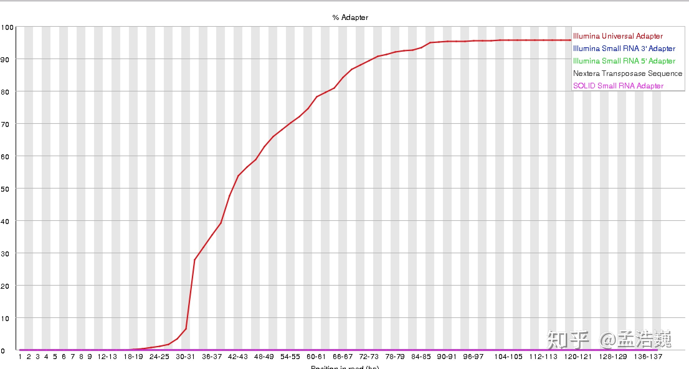{#fig-a-questions-11-15-001}

实际拿到手的 Illumina 数据通常是 `.fastq.gz`：`gz` 表示用 gzip 压缩，`fastq` 表示用 FASTQ 格式存储。双端测序每个样本会有 R1、R2 两个文件（可能还有 index 文件），两者中同名 read 互为配对。

### 碱基质量与 Phred 编码 {#src-0050-RNA-seq-132}

[]{#question-01-22}

[]{#question-01-35}

质量字符串的每个字符都是 ASCII 字符，其质量值等于 ASCII 十进制值减去一个固定偏移。同一字符在不同偏移下含义不同，历史上常见的两种编码是 Phred+33 与 Phred+64：

$$
\begin{aligned}
\operatorname{Phred}_{33}(\text{F}) &= 70-33=37 \\
\operatorname{Phred}_{64}(\text{F}) &= 70-64=6
\end{aligned}
$$ {#eq-phred-encodings}

也就是说，同样的字符 `F`，在 Phred+33 文件里代表质量值 37，在 Phred+64 文件里代表质量值 6，相差整整 31。下表覆盖全部 128 个 ASCII 字符（编号 0—127）：左半组为 0—63、右半组为 64—127。质量字符串只会使用可打印字符（33—126），因此控制字符（0—31、127）两列 Q 值均记为“—”；Phred+64 编码历史上只用到 105（Q41）。

| 十进制 | 字符 | Phred+33 的 Q 值 | Phred+64 的 Q 值 | 十进制 | 字符 | Phred+33 的 Q 值 | Phred+64 的 Q 值 |
| ---: | :---: | ---: | ---: | ---: | :---: | ---: | ---: |
| 0 | NUL | — | — | 64 | `@` | 31 | 0 |
| 1 | SOH | — | — | 65 | `A` | 32 | 1 |
| 2 | STX | — | — | 66 | `B` | 33 | 2 |
| 3 | ETX | — | — | 67 | `C` | 34 | 3 |
| 4 | EOT | — | — | 68 | `D` | 35 | 4 |
| 5 | ENQ | — | — | 69 | `E` | 36 | 5 |
| 6 | ACK | — | — | 70 | `F` | 37 | 6 |
| 7 | BEL | — | — | 71 | `G` | 38 | 7 |
| 8 | BS | — | — | 72 | `H` | 39 | 8 |
| 9 | HT | — | — | 73 | `I` | 40 | 9 |
| 10 | LF | — | — | 74 | `J` | 41 | 10 |
| 11 | VT | — | — | 75 | `K` | 42 | 11 |
| 12 | FF | — | — | 76 | `L` | 43 | 12 |
| 13 | CR | — | — | 77 | `M` | 44 | 13 |
| 14 | SO | — | — | 78 | `N` | 45 | 14 |
| 15 | SI | — | — | 79 | `O` | 46 | 15 |
| 16 | DLE | — | — | 80 | `P` | 47 | 16 |
| 17 | DC1 | — | — | 81 | `Q` | 48 | 17 |
| 18 | DC2 | — | — | 82 | `R` | 49 | 18 |
| 19 | DC3 | — | — | 83 | `S` | 50 | 19 |
| 20 | DC4 | — | — | 84 | `T` | 51 | 20 |
| 21 | NAK | — | — | 85 | `U` | 52 | 21 |
| 22 | SYN | — | — | 86 | `V` | 53 | 22 |
| 23 | ETB | — | — | 87 | `W` | 54 | 23 |
| 24 | CAN | — | — | 88 | `X` | 55 | 24 |
| 25 | EM | — | — | 89 | `Y` | 56 | 25 |
| 26 | SUB | — | — | 90 | `Z` | 57 | 26 |
| 27 | ESC | — | — | 91 | `[` | 58 | 27 |
| 28 | FS | — | — | 92 | `\` | 59 | 28 |
| 29 | GS | — | — | 93 | `]` | 60 | 29 |
| 30 | RS | — | — | 94 | `^` | 61 | 30 |
| 31 | US | — | — | 95 | `_` | 62 | 31 |
| 32 | 空格 | — | — | 96 | `` ` `` | 63 | 32 |
| 33 | `!` | 0 | — | 97 | `a` | 64 | 33 |
| 34 | `"` | 1 | — | 98 | `b` | 65 | 34 |
| 35 | `#` | 2 | — | 99 | `c` | 66 | 35 |
| 36 | `$` | 3 | — | 100 | `d` | 67 | 36 |
| 37 | `%` | 4 | — | 101 | `e` | 68 | 37 |
| 38 | `&` | 5 | — | 102 | `f` | 69 | 38 |
| 39 | `'` | 6 | — | 103 | `g` | 70 | 39 |
| 40 | `(` | 7 | — | 104 | `h` | 71 | 40 |
| 41 | `)` | 8 | — | 105 | `i` | 72 | 41 |
| 42 | `*` | 9 | — | 106 | `j` | 73 | — |
| 43 | `+` | 10 | — | 107 | `k` | 74 | — |
| 44 | `,` | 11 | — | 108 | `l` | 75 | — |
| 45 | `-` | 12 | — | 109 | `m` | 76 | — |
| 46 | `.` | 13 | — | 110 | `n` | 77 | — |
| 47 | `/` | 14 | — | 111 | `o` | 78 | — |
| 48 | `0` | 15 | — | 112 | `p` | 79 | — |
| 49 | `1` | 16 | — | 113 | `q` | 80 | — |
| 50 | `2` | 17 | — | 114 | `r` | 81 | — |
| 51 | `3` | 18 | — | 115 | `s` | 82 | — |
| 52 | `4` | 19 | — | 116 | `t` | 83 | — |
| 53 | `5` | 20 | — | 117 | `u` | 84 | — |
| 54 | `6` | 21 | — | 118 | `v` | 85 | — |
| 55 | `7` | 22 | — | 119 | `w` | 86 | — |
| 56 | `8` | 23 | — | 120 | `x` | 87 | — |
| 57 | `9` | 24 | — | 121 | `y` | 88 | — |
| 58 | `:` | 25 | — | 122 | `z` | 89 | — |
| 59 | `;` | 26 | — | 123 | `{` | 90 | — |
| 60 | `<` | 27 | — | 124 | &#124; | 91 | — |
| 61 | `=` | 28 | — | 125 | `}` | 92 | — |
| 62 | `>` | 29 | — | 126 | `~` | 93 | — |
| 63 | `?` | 30 | — | 127 | DEL | — | — |

: ASCII 全表（0—127）与两种 Phred 质量编码的对照 {#tbl-03-ascii-phred}

那质量值 Q 本身是什么？它是错误概率的函数：

$$
Q=-10\log_{10}P
$$ {#eq-phred-quality}

其中 *P* 是该碱基被判读错误的概率（Probability of incorrect base call）。Q 值为 40 代表错误概率 0.0001；为 30 代表 0.001；为 20 代表 0.01；为 10 则代表 0.1。把 Q 加上偏移量（33 或 64），再取对应的 ASCII 字符，就得到 FASTQ 第四行的质量字符串；反过来，读文件时用字符的十进制值减去偏移量即恢复 Q 值。

早年 Solexa 系列仪器使用过另一种以错误几率定义的质量：

$$
Q_{\text{Solexa}}=-10\log_{10}\frac{P}{1-P}
$$ {#eq-solexa-quality}

它在错误率较高时与 Phred 定义差别明显，低错误率时两者趋于一致。实际数据处理中需要注意编码历史：近年产生的数据基本都采用 Phred+33；从 NCBI SRA 下载的早期数据可能是 Phred+64 或 Solexa 编码，交给软件处理时要正确指定，例如 cutadapt 的 `--quality-base=64` 参数。

### FASTA：存储纯序列 {#question-01-40}

FASTA 格式用于储存纯序列信息，可以放 DNA、RNA 和蛋白质序列。第 1 行以 `>` 开头，是序列描述；从第 2 行起是序列本身。描述行的字段因数据库而异，下面是两个常见例子（UniProt 蛋白质记录与 GenBank mRNA 记录；mRNA 序列中的 U 在文件里写作 T）：

```{.text data-book-role="data" data-code-title="FASTA｜蛋白质序列（UniProt）"}
>sp|P69905|HBA_HUMAN Hemoglobin subunit alpha OS=Homo sapiens GN=HBA1
MVLSPADKTNVKAAWGKVGAHAGEYGAEALERMFLSFPTTKTYFPHFDLSHGSAQVKGHGKKVADALTNAVAHVDDMPNALSALSDLHAHKLRVDPVNFKLLSHCLLVTLAAHLPAEFTPAVHASLDKLASVSTVLTSKYR
```

```{.text data-book-role="data" data-code-title="FASTA｜mRNA 序列（GenBank）"}
>gi|13650073|gb|AF349571.1| Homo sapiens hemoglobin alpha-1 globin chain (HBA1) mRNA, complete cds
CCCACAGACTCAGAGAGAACCCACCATGGTGCTGTCTCCTGACGACAAGACCAACGTCAAGGCCGCCTGGGGTAAGGTCGGCGCGCACGCTGGCGAGTATGGTGCGGAGGCCCTGGAGAGGATGTTCCTGTCCTTCCCCACCACCAAGACCTACTTCCCGCACTTCGACCTGAGCCACGGCTCTGCCCAGGTTAAGGGCCACGGCAAGAAGGTGGCCGACGCGCTGACCAACGCCGTGGCGCACGTGGACGACATGCCCAACGCGCTGTCCGCCCTGAGCGACCTGCACGCGCACAAGCTTCGGGTGGACCCGGTCAACTTCAAGCTCCTAAGCCACTGCCTGCTGGTGACCCTGGCCGCCCACCTCCCCGCCGAGTTCACCCCTGCGGTGCACGCCTCCCTGGACAAGTTCCTGGCTTCTGTGAGCACCGTGCTGACCTCCAAATACCGTTAAGCTGGAGCCTCGGTGGCCATGCTTCTTGCCCCTTTG
```

### FASTA 与 FASTQ 的适用场景 {#question-01-66}

只关心序列本身时用 FASTA：参考基因组、转录本序列、蛋白质序列都以此发布。需要同时保留每个碱基的测序质量时用 FASTQ：测序仪下机数据、交给比对和质控软件的原始数据都是 FASTQ。一句话概括：FASTA 描述“序列是什么”，FASTQ 额外记录“每个碱基测得多准”。

## 质量评估：FastQC 与 MultiQC {#sec-03-07}

[]{#src-0030-QC-of-FASTQ-7}

[]{#ngs_qc}

依据实验背景解释质控图，而非只看红绿灯。

### 质量控制包括什么 {#src-0050-RNA-seq-128}

[]{#src-0030-QC-of-FASTQ-9}

::: {.callout-note .book-core title="核心知识｜质量控制包括什么"}

测序原始数据以 FASTQ 格式存储，包含序列信息和碱基质量。测序过程中存在样本污染或降解、接头污染以及不可避免的测序误差等干扰因素，都会影响数据质量。质量控制的目的，一是评估数据质量、判断能否进入后续分析，二是获得高质量的测序片段。质量控制包括测序质量评估和高质量测序片段的获取两部分。

:::

质控不能等到分析失败才做：拿到数据的第一步就应运行质控软件，先了解数据“长什么样”，再决定用什么参数处理。

### FastQC：运行与结果总览 {#src-0050-RNA-seq-154}

[]{#src-0030-QC-of-FASTQ-11}

[]{#src-0030-QC-of-FASTQ-13}

[FastQC](https://www.bioinformatics.babraham.ac.uk/projects/fastqc/) 是最常用的 FASTQ 质量评估软件（ @fig-04-quality-control-and-alignment-033 ）。命令行运行方式示例：

```{.bash data-book-role="code"}
fastqc -t 4 -o fastqc_result sample_R1.fastq.gz sample_R2.fastq.gz
```

FastQC 会对每一个输入文件生成一个 html 网页和一个 zip 压缩包（内含网页中的图片），日常只需要看网页里整理好的内容。它对碱基质量、接头序列、重复序列、GC 含量、N 含量、长度分布等逐项统计，并给出模块级别的判定：

{#fig-04-quality-control-and-alignment-033}

1. 基本统计（Basic Statistics）
2. 每个位置的碱基质量（Per base sequence quality）
3. 每条 reads 的质量分布（Per sequence quality scores）
4. 每个位置上四种碱基的比例（Per base sequence content）
5. 每条 reads 的 GC 含量分布（Per sequence GC content）
6. 每个位置不明碱基 N 的含量（Per base N content）
7. 长度分布（Sequence Length Distribution）
8. 序列的重复水平（Sequence Duplication Levels）
9. 突出的重复序列（Overrepresented sequences）
10. 接头序列情况（Adapter Content）
11. 特定短序列（k-mer）的富集情况（Kmer Content）

软件对每一项给出判定：绿色对勾代表 pass，黄色叹号代表 warn，红色叉代表 fail。**判定只针对“随机文库”这一默认假设**，评估为 warn 或 fail 不代表样品一定不能用，必须结合具体测序对象解读。

{#fig-04-quality-control-and-alignment-036}

基本统计模块汇总文件类型、编码方式、总 read 数、GC 含量和序列长度等，能最快了解样本概况（ @fig-04-quality-control-and-alignment-037 ）。

{#fig-04-quality-control-and-alignment-037}

{#fig-a-questions-06-10-003}

[]{#question-06-8}

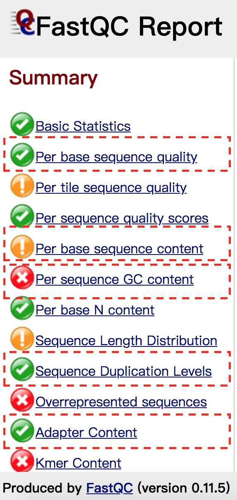{#fig-a-questions-06-10-006}

下面逐模块解读最常看的几张图。

#### 逐碱基序列质量（Per base sequence quality） {#question-06-7}

横轴是 read 中的位置（第 1 到第 150 个碱基），纵轴是每个位置所有碱基的质量值（ @fig-04-quality-control-and-alignment-034 ）。每个位置画一个箱线图：上下横线分别是 90% 和 10% 分位数，箱体上下缘是 75% 和 25% 分位数，箱中横线是中位数；蓝色细线连接各位置的平均质量。分位数的直观解释：若一组数的 25% 分位数是 a，意味着 a 超过了这组数中 25% 的值。判读阈值：任一位置的下四分位数低于 10 或中位数低于 25 时评估为 warn；低于 5 或 20 时评估为 fail。

{#fig-04-quality-control-and-alignment-034}

[]{#question-06-35}

双端数据要把 R1 与 R2 分开看。下面的两张图来自同一次测序（ @fig-a-questions-06-10-001 与 @fig-a-questions-06-10-002 ）：reads2 的质量均匀性明显差于 reads1。原因在本章 3.3 已经埋下伏笔——reads2 的测序是在 reads1 的 150bp 完成后，先重新合成互补链、再进行荧光测序；此时合成酶活性经过长时间反应已经下降，部分链加不上碱基，cluster 内的同步性变差，主要表现为 phasing 错误累积，箱体整体下移、离群点增多。

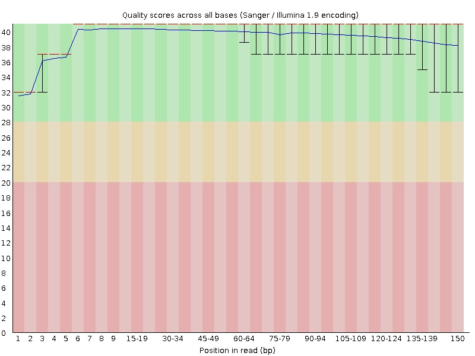{#fig-a-questions-06-10-001}

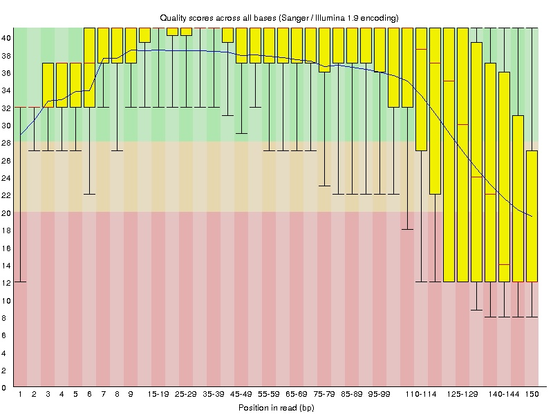{#fig-a-questions-06-10-002}

[]{#question-06-79}

#### 碱基组成（Per base sequence content） {#question-06-80}

横轴同样是 read 中的位置，纵轴是每个位置 A、T、C、G 各自的百分比（ @fig-04-quality-control-and-alignment-035 ）。随机文库中每个位置四种碱基的比例应大致相等（Chargaff 法则），四条线应当平行地贴着 25%。判读阈值：任一位置 A 与 T 的比例之差、或 G 与 C 的比例之差超过 10% 评估为 warn，超过 20% 评估为 fail——比较的是互补碱基之间的差值，而不是 A/T 与 G/C 两个比值之间的差。

{#fig-04-quality-control-and-alignment-035}

[]{#question-06-109}

开头几 bp 出现波动是普遍现象，主要原因是建库引入的序列偏好：RNA-seq 的随机六聚体引物、转座酶片段化都会造成对起始位置的选择偏好。FastQC 官方文档指出，这类文库在约前 12bp 普遍存在偏差，多数 RNA-seq 样本在这一模块都会触发警告，一般不影响下游分析，也无法靠 trim 消除。如果测序质量得分很高，可以不 trim 开头部分；只有得分也差时才考虑 trim。

DNA 全基因组测序样本通常呈现“前 10bp 左右波动、之后四线平稳”的形态（ @fig-a-questions-06-10-004 ），平稳区的四条线可以用来读出该物种的 GC 含量——图中 GC 合计约 42%，与人类基因组的已知值一致。GC 含量在同一物种内是相当稳定的量，不同物种间通常不同。

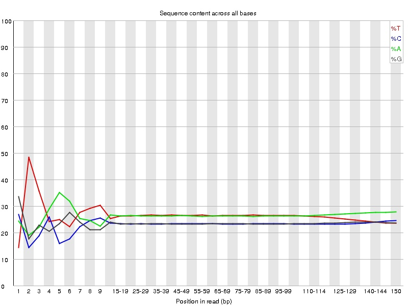{#fig-a-questions-06-10-004}

如果四条线全程剧烈波动（ @fig-a-questions-06-10-005 ），说明文库测到的分子群体碱基组成不随机——例如特殊建库富集的 RNA 群体。再如 @fig-04-quality-control-and-alignment-035 的小 RNA 样本：文库测到的是 miRNA 等特定的小 RNA 分子，其群体碱基组成本身不随机（例如 miRNA 的第 1 位碱基多为 U），四线不平行、AT 占比偏高属于正常现象。

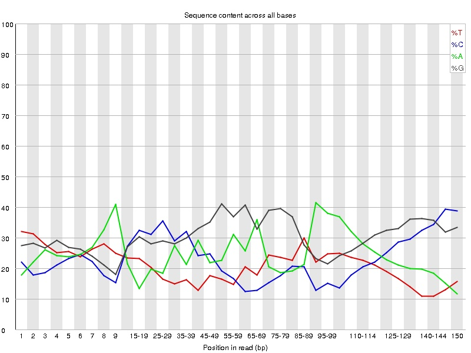{#fig-a-questions-06-10-005}

[]{#question-06-136}

#### 每序列 GC 含量分布（Per sequence GC content） {#question-06-137}

[]{#question-06-178}

这个模块换了一个视角：对每条 read 计算整体 GC 含量，画所有 reads 的分布曲线（ @fig-a-questions-06-10-007 ）。横轴是 GC 含量（0—100%），纵轴是具有相应 GC 含量的 reads 数量；蓝色虚线是根据数据拟合的理论正态分布。随机文库的曲线应是与蓝线基本重合的单峰，峰的位置就是该物种基因组的 GC 含量。

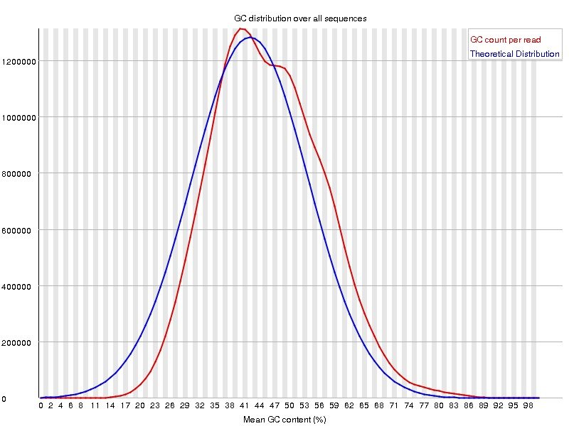{#fig-a-questions-06-10-007}

当曲线出现异常形态时需要追问原因。 @fig-a-questions-06-10-008 的曲线出现双峰且偏离理论分布，最常见的解释是混入了其他物种的 DNA（污染），也可能是 rRNA、接头序列或 PCR 过度扩增等造成。

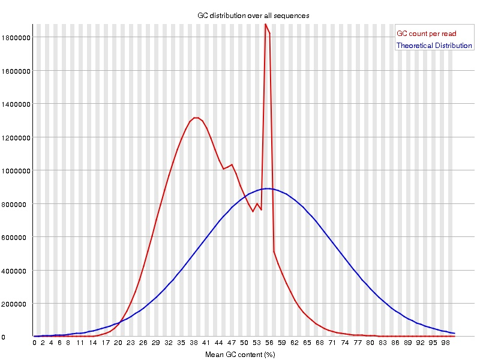{#fig-a-questions-06-10-008}

::: {.callout-tip .book-example title="示例与练习｜GC 双峰的处理"}

遇到 GC 分布双峰时，可以按下面的思路排查：

1. 先把 reads 比对到目标参考基因组，统计 mapping rate；如果比例非常低，说明污染严重，数据基本不可用。
2. 如果大部分 reads 比对成功，可把未比对的 reads 拿去做 blast，确认混入的是哪些物种的序列，过滤掉这部分 reads 后一般不影响后续分析。

**参考解答要点：** 关键量是 mapping rate——它把“分布形状异常”转化为“有多少数据属于目标物种”的可量化判断。

:::

#### 序列长度分布（Sequence Length Distribution） {#topic-03-sequence-length-distribution}

横轴是序列长度，纵轴是相应长度 reads 的数量（ @fig-a-questions-06-10-009 ）。刚下机的 Illumina 数据所有 reads 长度一致（如双端 150bp），因为测序循环数固定，图中应是一个尖峰。经过 cutadapt 等去除接头后，reads 长度就会变得参差——不同 insert 是否被测穿、被切掉多长并不相同。看到“长度不齐”不要惊讶，那通常是处理后的正常形态。

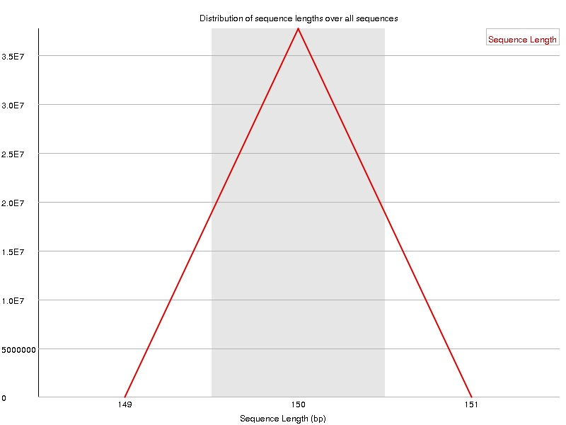{#fig-a-questions-06-10-009}

#### 重复序列水平（Sequence Duplication Levels） {#question-09-duplication}

这个模块统计完全相同（或高度相似）的序列在文库中出现的次数分布：横轴是重复级别（唯一、重复 2 次、重复 3—4 次……），纵轴是相应 reads 的比例。随机片段化的文库应以唯一序列为主；如果高重复级别的比例异常，通常意味着文库复杂度低——样本投入量不足、PCR 扩增轮数过多，或文库本身来源分子有限（如靶向富集、单细胞）。

判定时要区分“重复的原因”。对常规 RNA-seq，duplication 主要来自转录本表达量的天然差异和文库构建，**一般不做去重**，直接去除反而会破坏表达定量。但对于 PCR 轮数很多的特殊建库（如单细胞 RNA-seq），大量 duplication 是扩增假象，这时需要在建库时加入 random barcode（现在常称 **UMI**，唯一分子标识符），按 UMI 区分“来自不同原始分子的相同序列”与“同一分子的 PCR 拷贝”，只对后者去重。

[]{#question-06-289}

[]{#question-06-290}

#### 接头含量（Adapter Content） {#question-06-340}

横轴是 read 中的位置，纵轴是相应位置含某种接头序列的 reads 百分比，不同颜色对应不同的通用接头（ @fig-a-questions-06-10-011 、 @fig-a-questions-06-10-012 ）。正常文库只有少量 reads 在 3′ 端测穿进入接头；如果 read 后半段接头比例很高（如 @fig-a-questions-06-10-012 ），说明文库插入片段普遍偏短或存在建库问题，必须去除接头才能比对。

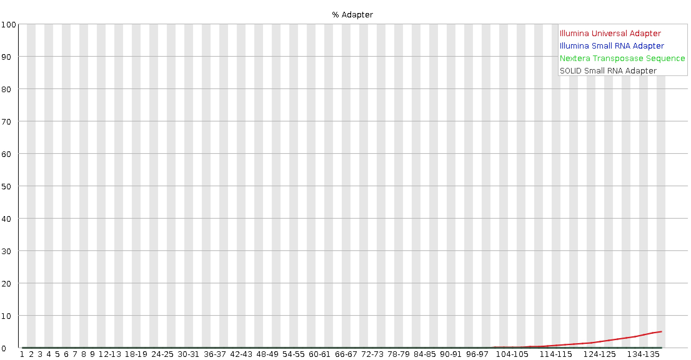{#fig-a-questions-06-10-011}

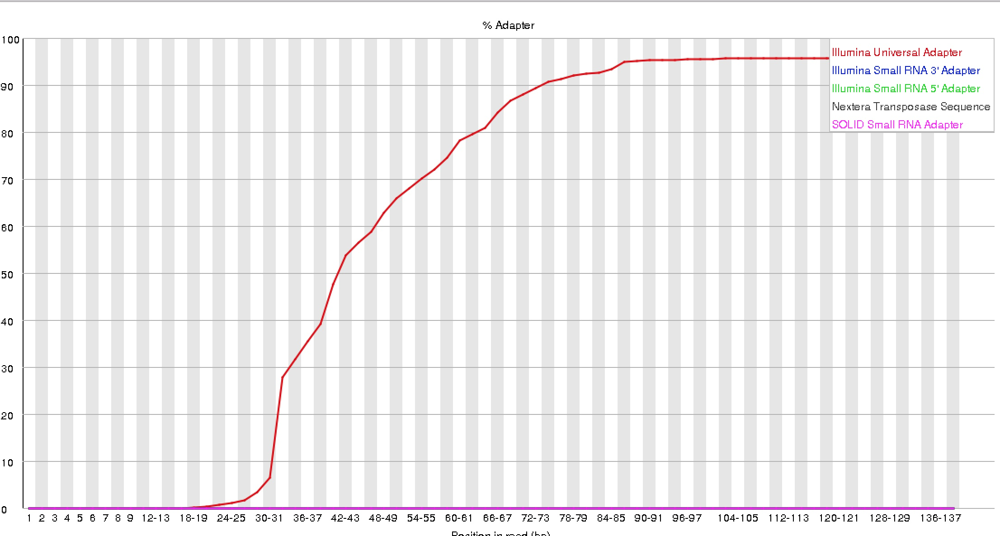{#fig-a-questions-06-10-012}

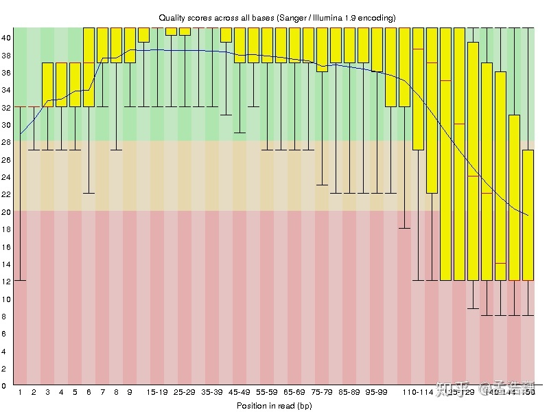{#fig-a-questions-11-15-002}

统计默认使用的通用接头序列如下（序列中的 `*` 表示硫代磷酸键修饰，并不是笔误）：

```{.text data-book-role="data" data-code-title="Illumina 通用接头序列"}
Illumina Paired End Adapters (cannot be used for multiplexing)

Top adapter

    5′ ACACTCTTTCCCTACACGACGCTCTTCCGATC*T 3’

Bottom adapter


    5′ P-GATCGGAAGAGCGGTTCAGCAGGAATGCCGAG 3’
```

**来源**：[Illumina adapter and primer sequences（CVR 生物信息博客）](http://bioinformatics.cvr.ac.uk/blog/illumina-adapter-and-primer-sequences/)。如果在运行 FastQC 时没有用 `--adapters` 选项（旧版本为 `-a`）指定接头文件，则默认按图例中的通用接头序列统计。

#### K-mer 含量（Kmer Content） {#question-06-375}

[]{#question-06-211}

k-mer 指定长的短序列，例如 AATTCCGG 是一个 8-mer。该模块统计每个 7-mer 在 read 各位置的出现频率：横轴是 read 中的位置，纵轴是在对应位置含有该 k-mer 的 reads 百分比，每条线代表一个出现富集的 k-mer（ @fig-a-questions-06-10-013 ）。正常文库的短序列不应偏好特定位置；某条线在固定位置明显抬升，说明存在系统性来源——接头、随机引物偏好，或建库时加入的固定序列。

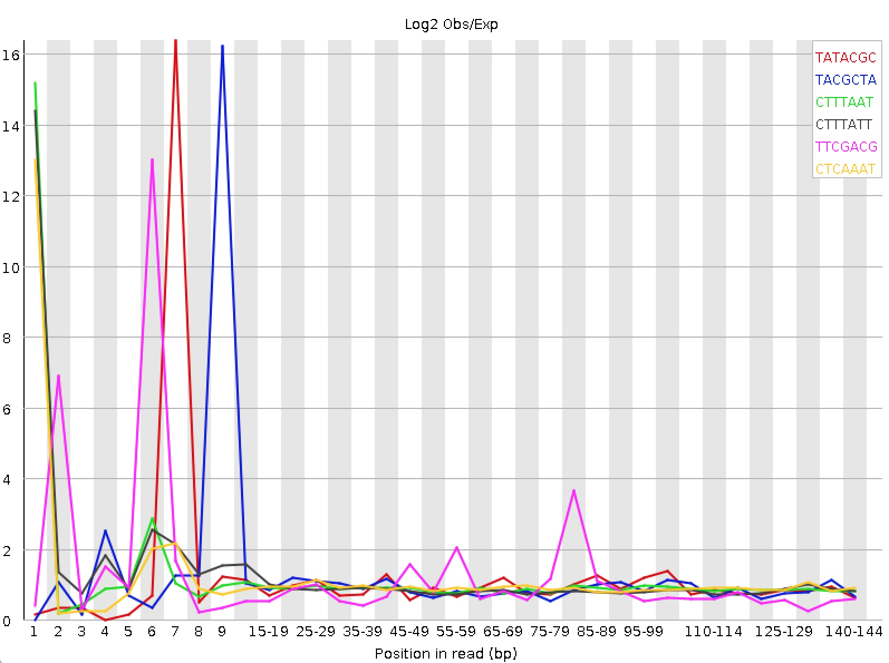{#fig-a-questions-06-10-013}

@fig-a-questions-06-10-014 中 kmer 在 read 开头集中富集，原因是建库时在 5′ 端加入了约 10bp 的 random barcode（UMI）——这段固定位置的随机序列本身造成了 kmer 富集，与 @fig-a-questions-06-10-015 的统计表互相印证。表中各列依次是：kmer 序列、该 kmer 在整个文库中被观测到的总次数（Count）、二项分布检验的 P 值、观察值与期望值之比的最大值（Obs/Exp Max）、以及该最大值出现的位置（Max Position）。FastQC 采样约 2% 的 reads 进行统计，序列超过 500bp 时只分析前 500bp。

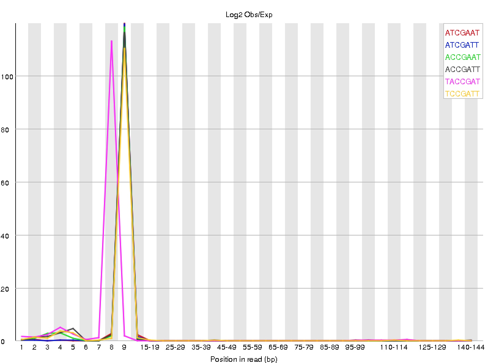{#fig-a-questions-06-10-014}

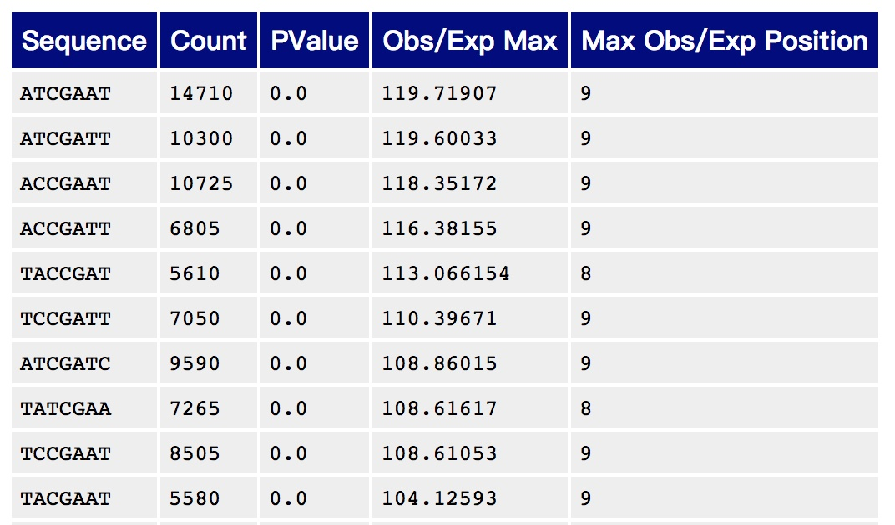{#fig-a-questions-06-10-015}

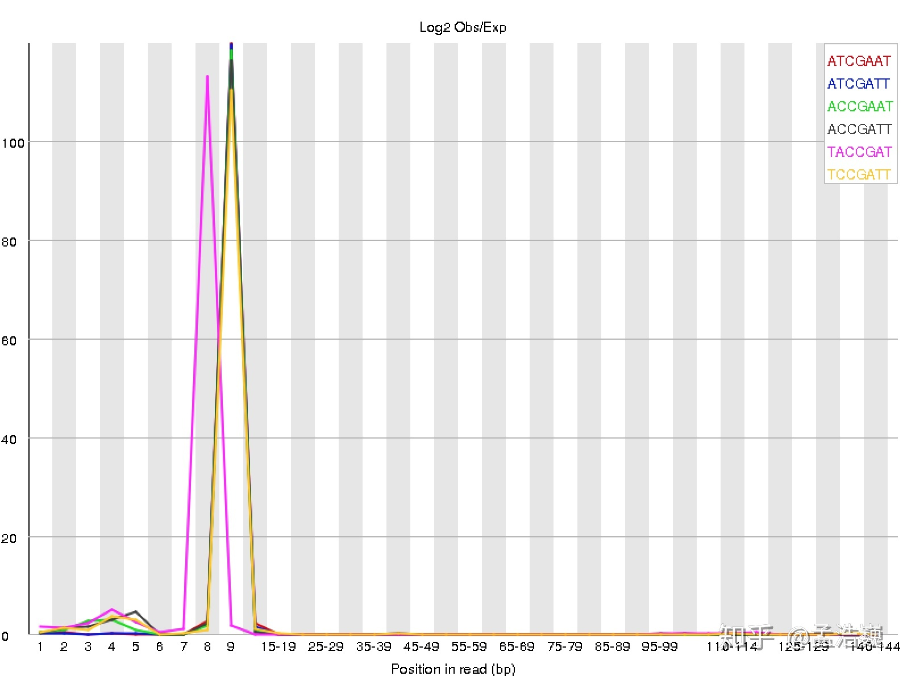{#fig-a-questions-11-15-003}

::: {.callout-tip .book-example title="示例与练习｜计算 hg19 每条染色体的 GC 含量"}

如何计算 human genome 19（hg19）每一条染色体的 GC 含量？

**参考解答：**

思路一：从 UCSC 或 Ensembl 下载 hg19 染色体序列，写 Python 程序依次读取每条序列、统计每条染色体的 GC 含量。

思路二：直接使用现成工具按染色体统计碱基组成，再换算 GC 比例。

两种思路都要注意：线粒体染色体（chrM）长度很短且 GC 含量与核染色体差别大，单列统计更容易发现异常。

:::

### MultiQC：多样本汇总 {#src-0030-QC-of-FASTQ-15}

实际项目往往一次产出几十上百个样本，逐个打开 FastQC 网页不现实。[MultiQC](https://multiqc.info/) 会扫描指定目录下 FastQC、cutadapt、比对软件等工具的输出，把所有样本的关键指标汇总成可排序的报告表和总览图，例如各样本的数据量、质量趋势、接头比例、mapping rate。常用命令：

```{.bash data-book-role="code"}
multiqc fastqc_result/ -o multiqc_report
```

看报告时优先扫全局异常的样本，再回到单样本 FastQC 细看原因；两种报告配合使用，是项目质控的常规做法。

## 数据清理：去接头与低质量序列 {#sec-03-08}

理解何时修剪、如何保持配对关系以及如何验证处理效果。

### 为什么要清理以及常用工具 {#src-0050-RNA-seq-204}

[]{#src-0030-QC-of-FASTQ-17}

[]{#src-0030-QC-of-FASTQ-19}

质控报告确认数据可用后，进入获取高质量 reads 的步骤。需要清理的内容包括：低质量碱基或 reads、含 N 过多的序列，以及接头序列——用于区分样本的 barcode（index）序列、建库 PCR 扩增所需的引物结合序列，以及与 flowcell 表面寡核苷酸互补配对的序列。这些序列不存在于基因组上，不切除会显著拉低比对率。

常用工具各有侧重。**Trimmomatic** 的滑动窗口（SLIDINGWINDOW）从 read 一端评估窗口内碱基质量均值，低于阈值时从该处切除后续碱基（配合最低长度参数可丢弃过短 read），还支持接头去除、去除 reads 3′/5′ 端指定长度或低质量碱基。**Cutadapt** 偏重接头处理：去除 reads 内部或两端的接头，可设置接头错配率、允许接头含 indel、支持通配碱基，也能过滤含 N 过多和低质量的 reads。**fastp** 把去接头、质量裁剪和报告生成合并为一步完成，是目前快速流程的常见选择。

::: {.callout-warning .book-warning title="注意｜工具的年代"}

Fastx-toolkit 与 NGSQC 是早期常用工具，已长期停止维护，本书保留其用于理解处理思路和练习。如今的同类操作更常用 Cutadapt、fastp、Trimmomatic（仍在维护）以及 seqtk、seqkit 等。

:::

### cutadapt：接头去除的参数 {#question-11-3}

[]{#question-11-4}

cutadapt 支持单端和双端数据，也支持 gz 格式的自动压缩与解压缩。双端去除接头的常用命令：

```{.bash data-book-role="code"}
cutadapt -a ADAPTER_FWD -A ADAPTER_REV -o out.1.fastq -p out.2.fastq reads.1.fastq reads.2.fastq
```

参数含义：`-a` 是 read1 3′ 端要去除的接头；`-A` 是 read2 3′ 端要去除的接头；`-o`、`-p` 分别是两端输出文件；最后是两个输入文件。`-g`/`-G` 的用法与 `-a`/`-A` 类似，但对应 5′ 端接头——常规 Illumina 文库 5′ 端不会测出接头，所以很少用到。

`-m` 参数指定最小保留长度：切完接头后短于该长度的 read 直接舍弃，因为过短的序列无法可靠比对。`-q` 参数用于质量裁剪，见下文。

### cutadapt：3′ 端质量裁剪的算法 {#topic-03-cutadapt-quality-trim}

测序中常见 read 的 3′ 端质量较差（例如逐碱基质量图中 3′ 端箱体逐渐下移）。`-q` 参数可以在去接头的同时切掉低质量末端，例如：

```{.bash data-book-role="code"}
cutadapt -q 10 -o output.fastq input.fastq
```

`-q` 后的数字是质量阈值，低于该值的碱基将被切除；若文件采用 Phred64 编码，需加 `--quality-base=64`。

cutadapt 不是“遇到第一个低质量碱基就停”，而是允许好碱基夹杂在坏区域中，找整体最优的切点。以一条 13bp、阈值 10 的 read 为例：

```{.text data-book-role="data" data-code-title="算例｜序列与质量值"}
A,T,G,C,C,G,T,A,C,C,G,G,T
42, 42, 41, 41, 40, 26, 27, 8, 7, 11, 4, 2, 3
```

第一步，每个质量值减去阈值：

```{.text data-book-role="data" data-code-title="算例｜减去阈值 10"}
32, 32, 31, 31, 30, 16, 17, -2, -3, 1, -6, -8, -7
```

第二步，从 3′ 端向 5′ 端累加，得到每个位置到末尾的累加和：

```{.text data-book-role="data" data-code-title="算例｜从 3′ 端累加的部分和"}
164, 132, 100, 69, 38, 8, -8, -25, -23, -20, -21, -15, -7
```

cutadapt 的规则是取累加和最小值（−25）出现的位置——第 8 位——作为裁剪位点，保留其前面的碱基：

```{.text data-book-role="data" data-code-title="算例｜裁剪结果"}
A,T,G,C,C,G,T--cut here--A,C,C,G,G,T
```

这样处理的好处是可以容忍 3′ 端零星的质量回升，不会因为个别碱基质量突然变好而过早停止裁剪。

## 其他常用整理操作 {#sec-03-09}

### seqkit：FASTQ/FASTA 的多功能工具箱 {#src-0030-QC-of-FASTQ-23}

除了去接头和裁剪，日常还经常需要对 FASTQ/FASTA 做统计、抽样、截取等整理。[seqkit](https://bioinf.shenwei.me/seqkit/) 是一个跨平台、多线程的命令行工具箱，直接操作 gzip 文件，命令风格统一。

```{.bash data-book-role="code"}
seqkit stats -a *.fastq.gz
```

`seqkit stats` 汇总每个文件的 reads 数、长度、GC 含量和 Q20/Q30 比例，是检查数据概况最快的方式之一。

#### 截取固定长度 {#src-0030-QC-of-FASTQ-25}

需要统一 reads 长度时（例如某些特定分析流程的输入要求），可以用 `seqkit subseq` 按位置截取：

```{.bash data-book-role="code"}
seqkit subseq -r 1:50 input.fastq.gz -o trim50.fastq.gz
```

`-r 1:50` 表示保留每条 read 的第 1 到 50 位。注意这会“硬截”而不管质量，一般先做质控裁剪再统一长度；老一代工具中 fastx_trimmer 也做同样的事。

#### 随机抽样 {#src-0030-QC-of-FASTQ-27}

调试流程或做大数据集的快速预览时，常需要抽取一部分 reads：

```{.bash data-book-role="code"}
seqkit sample -p 0.1 -s 11 -2 sample_R1.fastq.gz -o sub_R1.fastq.gz
```

`-p 0.1` 表示按比例抽取 10%，`-s` 是随机种子（固定种子保证可重复），`-2` 采用两遍扫描模式以降低内存占用。双端数据需对 R1、R2 使用相同种子分别抽样，保持配对关系。

#### 其他常用操作 {#src-0030-QC-of-FASTQ-29}

seqkit 还覆盖大量日常操作：`seqkit grep` 按名称或序列筛选 reads，`seqkit fx2tab` 把 FASTQ/FASTA 转成表格便于查看和统计，`seqkit split` 拆分文件。同类的还有更早的 seqtk（`seqtk sample`、`seqtk trimfq` 等）。原则是一样的：先明确要做什么，再选择工具，用 `--help` 确认参数含义。

### 综合练习：等长截取的三步流程 {#question-11-86}

[]{#question-11-88}

:::: {.callout-tip .book-example title="示例与练习｜设计等长截取的处理流程"}

假设你有一个 RNA-Seq 文件需要进行可变剪切分析，要求达到：

1. 处理后的 fastq 文件中不包含 adapter 序列；
2. 开头 10bp 的 random barcode 需要去掉；
3. 最后得到的序列长度完全一致（不满足要求的丢弃）。

输入文件是 `input.fastq`，系统是 Linux Ubuntu，adapter 序列为 `AGATCGGAAGAGCGTCGTGTAGGGAAAGAGTGTAGATCTCGGTGGTCGCCGTATCATT`。请参考 cutadapt 与历史工具 fastx_trimmer 的用法，设计处理路线并给出参数。

**参考解答：** 分三步——先用 FastQC 确认 3′ 端接头与 5′ 端 barcode 的情况；再用 cutadapt 去掉 3′ 端接头并用 `-m` 保留足够长的序列；最后截掉开头 10bp 并统一到固定长度（fastx_trimmer 的 `-f 11 -l 125` 表示保留第 11 到 125 位，得到 115bp 的等长序列；现代流程可用 seqkit subseq 完成同样操作）：

```{.bash .numberLines data-book-role="code"}
# step 1, FastQC
fastqc -q -t 3 -o ./FastQC_result ./input.fastq

# step 2, cut adapter
cutadapt -q 25 -m 125 \
-a AGATCGGAAGAGCGTCGTGTAGGGAAAGAGTGTAGATCTCGGTGGTCGCCGTATCATT \
-o input_cutadapt.fq.gz input.fastq

# step 3, trim
zcat input_cutadapt.fq.gz | fastx_trimmer \
-f 11 -l 125 -z -o ./input_cutadapt_trim11_125.fq.gz

# 经过上述 3 个步骤，可以获得长度统一为 115bp 的序列
```

其中 fastx_trimmer 所属的 fastx_toolkit 是长期停止维护的早期工具，此处保留用于演示流程；实际项目中可用 `seqkit subseq -r 11:125` 替代第三步。

::::

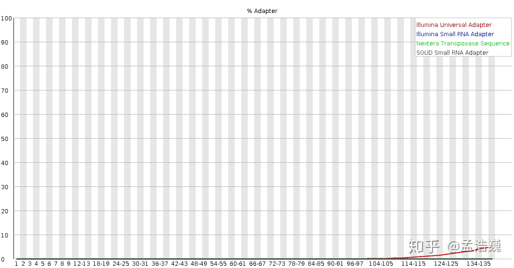{#fig-a-questions-11-15-004}
