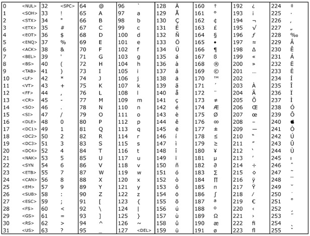

# 测序技术 {#sec-ch03}

::: {.hero-book .book-chapter-summary}

## 本章提要 {#chapter-summary-03 .unnumbered}

本章围绕测序技术和原始数据展开：先理解不同实验测到了什么，再认识以 Illumina 为代表的第二代测序、MGI，以及 PacBio 与 Nanopore。随后把高通量文库构建与 FASTQ 等数据存储方式联系起来，学习阅读 FastQC 报告、去除接头和常见的数据清理操作。长读长部分以原理和用途概览为主。通过这些内容，希望你能说明原始数据的来源，读懂质量信息，并解释每一次数据处理的目的。

:::

## 不同测序实验究竟测到了什么 {#sec-03-01}

避免把不同实验的 reads 当作同一种生物学测量。

::: {.book-placeholder}
本节内容待补充。
:::

## 以Illumina为代表的第二代测序技术 {#sec-03-02}

理解接头、索引、双端测序和测序错误如何影响数据。

### 高通量测序技术基础 {#src-0020-introduction-of-NGS-1}

[]{#basic_knowledge}

::: {.book-placeholder}
本节内容待补充。
:::

### Illumina 测序技术原理 {#src-0020-introduction-of-NGS-3}

目前我们接触到的很多生物信息学的技术，都是基于NGS技术的，比如RNA-Seq，ChIP-Seq，FAIRE-Seq，ChIA-PET，Hi-C等等。所谓的NGS就是Next Generation Sequencing，翻译为“下一代测序技术”，或者是“第二代测序技术”。之所以这么叫，是因为相比较于第一代测序技术其测序通量有了很大的提升。

二代测序的发展过程中出现过 Roche 454、Illumina 等不同技术路线。本节以 Illumina 的边合成边测序为例，解释文库、簇和测序循环如何产生 reads。图中的 X Ten 是 2016 年前后的仪器示例；如今不同平台的通量、读长和流动槽结构差异很大，应查对应型号的说明书。

#### 一些常用基本概念的介绍 {#src-0020-introduction-of-NGS-8}

- **flowcell**（流动槽）是测序反应发生的位置；lane 数目随仪器和流动槽型号变化
- **lane**（泳道）是流动槽内的反应区域，具体结构取决于平台
- **tile** 每一次测序荧光扫描的最小单位
- **read** 指一次读取获得的序列，复数为 reads
- **bp** base pair 碱基对，用于衡量序列长度
- **双端测序** 指从同一插入片段的两端分别读取，例如一个 500 bp 的插入片段两端各读 150 bp
- **未读取区间** 在上述例子中，中间还有约 200 bp 未被两端的 reads 覆盖；这段区间不称为 junction。RNA 比对中的 splice junction 通常指剪接连接位点
- **adapter** 就是测序中需要的一段特定的序列，有类似于引物的功能
- **primer** PCR中的引物


{#fig-03-sequencing-and-data-formats-001}


{#fig-03-sequencing-and-data-formats-002}


#### 桥式PCR {#src-0020-introduction-of-NGS-36}

将上述的DNA样品调整到合适的浓度加入到flowcell中，再加入特异的化学试剂，就可以使得序列的一端与flowcell上面已经存在的短序列通过化学键十分强健地相连，如下图。图中不同的颜色表示的是两种不同的 adapter，分别对应序列之前加入的两种 adapter

连接以后就正式开始桥式PCR。首先进行第一轮扩增，将序列补成双链。加入NaOH强碱性溶液破坏DNA的双链，并洗脱。由于最开始的序列是使用化学键连接的，所以不会被洗脱。

加入缓冲溶液，这时候序列自由端的部分就会和旁边的 adapter 进行匹配。

进行一轮PCR，在PCR的过程中，序列是弯成桥状，所以叫桥式PCR，一轮桥式PCR可以使得序列扩增1倍。

如此循环下去，就会得到一个具有完全相同序列的簇，一般叫cluster。


{#fig-03-sequencing-and-data-formats-004}


桥式PCR的整体流程大体如下：


{#fig-03-sequencing-and-data-formats-005}


形成这种1个cluster，1个cluster的形态，在整个flowcell中看上去，示意图如下。其中的每1个cluster就算是1群完全相同的序列。

#### 测序 {#src-0020-introduction-of-NGS-55}


::::: {.callout-note .book-core title="核心知识｜边合成边测序的循环"}

测序时，聚合酶沿模板延伸引物，加入带有可逆终止基团的核苷酸，使一轮反应主要延伸一个碱基。仪器根据荧光信号判断本轮加入的碱基，再解除终止并进入下一轮。不同代际平台的荧光编码和化学体系有所不同，不能都理解为四种碱基各自发出一种颜色。

:::::


下图为带有荧光基团和 3′-O 可逆阻断基团的核苷酸示意（[图片来源：oezratty.net](http://www.oezratty.net/)）。Illumina 的可逆阻断基团是 3′-O-叠氮甲基（可用 −N₃ 表示）；早期资料中“3 号位加入叠氮基团 N₂”的说法并不准确，具体化学结构以对应平台的文献为准。


{#fig-03-sequencing-and-data-formats-006}


在测序过程中，每一轮反应保证只有一个碱基加入到当前测序链。这时候测序仪会发出激发光，并扫描荧光。因为一个cluster中所有的序列是一样的，所以理论上，这时候cluster中发出的荧光应该颜色一致。一个测序扫描图片如下：


{#fig-03-sequencing-and-data-formats-007}


成像后，解除可逆终止并清除本轮检测信号，使下一轮可以继续延伸。循环进行，即可从信号序列推断碱基序列。


{#fig-03-sequencing-and-data-formats-008}


限制 Illumina 测序读长的主要原因有下面两点：

1. 测序循环中，不同模板分子的延伸可能逐渐失去同步（phasing 或 pre-phasing）。这里的测序延伸不等于反复进行 PCR。通俗一点讲，比如一开始1个cluster中是100个完全一样的DNA链，但是经过1轮增加碱基，其中99个都加入了1个碱基，显示了红色，另外1个没有加入碱基，不显示颜色。这时候整体为红色，我们可以顺利得到结果。随后，在第2轮再加入碱基进行合成的时候，就变成了，之前没有加入的加入了1个碱基显示红色，剩下的99个显示绿色，这个时候就会出现杂信号。当测序长度不断延长，这个杂信号会越来越多，最后很有可能出现，50个红，50个绿色，这时候我们判断不出来到底是什么碱基被合成。

2. 测序过程中，使用的碱基是特殊处理的，有一个非常大的荧光基团修饰。在使用 DNA polymerase 的时候，酶的状态也会受到底物的影响，其活性也越来越差。实际读长还受化学稳定性、信号质量和解码方法等因素影响，不能把所有平台归为“荧光淬灭原理”。

### 知识问答 2：Sanger 与 Illumina 测序原理 {#question-01-77}

现在我们实验室或者公司常用第1代测序与第2代测序，那么：

#### 1. 第1代测序 sanger 测序法的原理是什么？通量比较低的核心原因是什么？ {#question-01-80}


Sanger 法即双脱氧链终止法：它利用 DNA 复制原理，在反应中加入双脱氧核苷三磷酸（ddNTP），使 DNA 链在延伸到不同位置时终止，再依据不同长度的终止片段判断每个位置的碱基类型。Sanger 通量低的核心原因是每条序列都需要独立的反应和电泳分离（早期为凝胶电泳，后来是毛细管电泳），一次运行的并行条数有限；二代测序则在一张流动槽上同时测定数十亿个片段。

#### 2. 作为2006年正式发布的illumina测序技术，或者称为第2代测序技术的代表性技术，其最大的特点是什么？ {#question-01-83}


高通量，成本低，但测序长度较短。

#### 3. Illumina测序技术的核心是什么？ {#question-01-86}


核心内容有两个：一个是桥式 PCR，主要用于把单分子信号放大成簇信号；另一个是可逆终止的边合成边测序反应（早期平台为四色荧光编码，新平台有所变化），使 Illumina 实现边合成边测序。

#### 4. Illumina测序技术为什么不能像第1代测序技术一样测500bp以上？ {#question-01-89}


   主要原因有两个（原理详见 3.2“测序”一节的解释）：一方面 cluster 内不同链的延伸会逐渐失去同步（phasing 与 pre-phasing），杂信号随测序长度增加而累积，最后信号不足以判断碱基类型；另一方面合成酶的活性随循环数增加而下降，后面的碱基添加更容易出问题。而 Sanger 测序的每条序列独立反应、独立电泳读出，不受 cluster 同步性限制，因此单条序列可以读到 500bp 以上。

### 知识问答 4：SBS 与测序误差 {#question-01-132}

#### 1. Illumina目前主流的测序仪都有哪几种型号？各自大概的通量是多少？（也就是1个run能跑出多少数据） {#question-01-133}

本系列写作时期（约 2016—2018 年）Illumina 的主流机型及通量：HiSeq 2500（50—1000 Gb）、HiSeq 3000（125—750 Gb）、HiSeq 4000（125—1500 Gb）、HiSeq X Five（900—1800 Gb）和 HiSeq X Ten（900—1800 Gb）。

::: {.callout-warning .book-warning title="注意｜机型与通量随时间变化"}

HiSeq 系列现已停产。如今 Illumina 的主力机型是 NovaSeq 6000 与 NovaSeq X/X Plus（单次运行可达 Tb 级），中小通量有 NextSeq 2000/550、MiSeq 等；华大智造 MGI 的 DNBSEQ 系列也广泛使用。不同型号的通量、读长和流动槽结构差异很大，分析具体数据前应以测序公司提供的实际参数为准。

:::

#### 2. Illumina目前的测序技术，最核心的就是边合成边测序，即我们常说的 Sequencing by synthesis （SBS），那么为什么能够实现SBS？ {#question-01-135}


桥式 PCR 把同一段序列扩增成簇之后开始测序：加入引物，再添加经过特殊修饰的核苷酸。修饰有两点：一是碱基带有荧光基团（颜色编码方式随平台代际不同，见 3.2 的核心知识框）；二是脱氧核糖 3′ 羟基被可逆阻断基团（叠氮甲基）修饰，保证每轮反应只能延伸一个碱基。

{#fig-a-questions-01-05-003}


测序循环的信号采集与 3.2“测序”一节相同：每轮只延伸一个碱基，扫描整个 cluster 的荧光，再解除阻断、清除染料后进入下一轮。如此往复，就可以测出序列的内容。


#### 3. 我们在第1问中，问了大家一个问题“Illumina测序技术为什么不能像第1代测序技术一样测500bp以上？”，这里面主要涉及到两种错误，一种叫phasing，一种叫pre-phasing，分别是什么意思？ {#question-01-144}


通俗来讲phasing表示本来同步添加的碱基有一些没加上，而pre-phasing则是加多了，都会导致当前bp的荧光检测出现噪音，造成 phasing 的主要原因是部分链没有正常延伸（如聚合酶活性下降）；pre-phasing 则可能是可逆终止基团提前脱落或不完全终止，使一轮反应中添加了不止一个碱基。

## MGI测序技术 {#sec-03-03}

### 华大智造测序仪 {#src-0020-introduction-of-NGS-84}

::: {.book-placeholder}
本节内容待补充。
:::

## PacBio与Nanopore {#sec-03-04}

知道何时短读长不足，并正确理解长读长技术的输入输出。

### PacBio {#src-0020-introduction-of-NGS-78}

::: {.book-placeholder}
本节内容待补充。
:::

### Nanopore {#src-0020-introduction-of-NGS-81}

::: {.book-placeholder}
本节内容待补充。
:::

### 长读长 RNA 测序 {#src-0050-RNA-seq-85}

常规短读长 RNA-seq 通常先把 RNA 逆转录成 cDNA，再进行文库构建（流程详见第 5 章）。长读长技术可以减少把一个转录本拆成许多短片段后再推断结构的困难，因此特别适合理解转录本异构体。


::::: {.callout-note .book-core title="核心知识｜长读长与直接 RNA 测序"}

PacBio 的 SMRT 测序观察聚合酶合成 DNA 时的荧光信号。Iso-Seq 分析的是由 RNA 逆转录得到的全长 cDNA，不能称为直接 RNA 测序。Oxford Nanopore 则根据核酸链通过纳米孔时的电流变化推断序列，既有 cDNA 测序，也有直接 RNA 测序；其常用平台不依靠外切酶逐个切下碱基再读取。

:::::


长读长、准确度、通量和定量性能需要结合具体平台、化学版本和建库方案讨论，不能只用某一代平台的单一数值来概括。PacBio、Nanopore 和直接 RNA 测序的进一步比较、示例数据与练习待完善。

参考：[Oxford Nanopore 技术说明](https://nanoporetech.com/platform/technology)；[PacBio RNA 测序说明](https://www.pacb.com/products-and-services/applications/rna-sequencing/)。

## 高通量文库构建 {#sec-03-05}

### 建库 {#src-0020-introduction-of-NGS-24}


::::: {.callout-tip .book-example title="示例与练习｜片段化 DNA 文库"}

短读长测序每次只能读取有限长度，因此需要先把待测核酸制成适合平台的文库。下面以片段化的 DNA 文库为例：先把较长的 DNA 打断，再通过片段筛选控制长度分布。本书以 300—500 bp 的插入片段举例；实际范围应按建库方案、读长和研究目的确定。

:::::


打断以后会出现末端不平整的情况，用酶补平，所以现在的序列是平末端。

完成补平以后，在3'端使用酶加上一个特异的碱基A

加上 A 之后就可以利用互补配对的原则，加上 adapter。这个 adapter 可以分成两个部分：一部分是测序的时候需要用的引物序列，另一部分是建库扩增时候需要用的引物序列


{#fig-03-sequencing-and-data-formats-003}


### 知识问答 3：接头、扩增、索引与测序结构 {#question-01-94}

目前我们最常使用的就是Illumina公司的测序技术，Illumina公司的测序技术最明显的几个特点是：价格低，通量高，测序读长短。那么我们今天的问题，就是围绕Illumina测序技术的细节来提问的。

#### 1. 什么是Illumina测序adapter？同一批上机的adapter序列一样吗？它的作用是什么？ {#question-01-97}

adapter的中文意思为适配器或者接口，在illumina测序过程中关键一步是将文库片段固定在flowcell上，然后通过桥式PCR将片段扩增，在被打断成 300~500bp 的片段末端被补平后，adapter 将被添加到片段两端：一方面用于将片段固定在 flowcell 上，同时 adapter 中还包含桥式 PCR 所需要的引物

#### 2. 一个完整的Illumina测序过程是那几步？ {#question-01-99}

完整的测序过程仅包含两步，第一是桥式PCR扩增，第二是以4色荧光可逆终止反应为核心技术的测序；

#### 3. 什么是桥式PCR技术？为什么要进行桥式PCR？ {#question-01-101}


加上 adapter 之后的 DNA 样品与 flowcell 上固定的 oligo（寡核苷酸）互补匹配后就被固定在 flowcell 上，再通过桥式 PCR 扩增成 cluster，把单分子信号放大到荧光测序可以检测的水平。具体步骤（补成双链、碱变性洗脱、桥形扩增、循环成簇）见 3.2“桥式PCR”一节，此处不再重复。


#### 4. 我们都说，测序结果会包含index，那么index是什么？有什么作用？ {#question-01-115}


在早期的 HiSeq 2000/2500 上，一条 lane 能测 30G 左右（如今一条 lane 的产出从几 Gb 到数 Tb 不等，随机型差异极大），而一个样品的测序量一般不会这么大，所以在建库的时候对每一种样品的接头加上不同的标签序列，这个标签就叫做Index，有了index就可以同时在一个lane中测多种数据了，后期可以根据index将数据分开；

#### 5. 我们所说的flowcell，lane，tile都是什么意思？ {#question-01-118}


- flowcell    指 Illumina 测序时测序反应发生的位置；以 HiSeq 2000/2500 为例，1 个 flowcell 含有 8 条 lane（lane 数随仪器型号而异，如 MiSeq 只有 1 条，NovaSeq 6000 为 2—4 条）
- lane    flowcell 上的泳道，是独立的测序反应区域，可以添加试剂、洗脱等
- tile 每一次测序荧光扫描的最小单位

{#fig-a-questions-01-05-002}

引用自：[NextGen Sequencing Primer（41j.com）](http://41j.com/blog/2012/04/nextgen-sequencing-primer/)


#### 6. Illumina测序结果质量表示方法采用的是Phred33还是Phred64？ {#question-01-128}


最新的测序质量结果一般都为Phred33，但是早期的测序数据可能出现Phred64。

### 知识问答 5：接头、引物与双端建库 {#question-01-148}


本节围绕 Illumina 双端建库中接头的结构提问：Illumina 常用的双端测序建库办法中，会在打断的序列前后加上 adapter，请问：


#### 1. adapter是什么意思？adapter与primer有什么区别？ {#question-01-156}


adapter 在中文里是适配器或接头的意思。如前文所述，测序序列打断、末端补平后添加 adapter，用于与 flowcell 上的 oligo 互补匹配固定，并为后续桥式 PCR 做准备。一个典型的双端索引文库结构是 P5—adapter1（含 i5 index 位点）—fragment—adapter2（含 i7 index 位点）—P7。测序时加入的引物结合的是 adapter 中专门的测序引物结合位点；index 序列由独立的 index read 单独读取，并不出现在 R1/R2 的 reads 里。因此 read1 从 insert 的一端向内测序；如果片段较短被“测穿”，read 的 3′ 端会带上另一端 adapter 的序列。


#### 2.比如最终的测序结果是 AATTCCGGATCGATCG...，那么adapter的序列可能出现在哪一端，还是两端都有可能出现？为什么？ {#question-01-160}

一般出现在 3′ 端。测序从 insert 一端（read 的 5′ 端）向内进行；只有当 insert 比读长短、被“测穿”时，才会读到另一端的 adapter，因此 adapter 序列总是出现在 read 的 3′ 端。

## 测序数据的储存 {#sec-03-06}

能够逐行读懂原始序列文件并解释碱基质量。

测序得到的原始数据以 FASTQ 格式储存，纯序列则常用 FASTA 格式。本节先认识这两种文件格式，再解释 FASTQ 中质量值的编码方式。

### 知识问答 1：FASTA、FASTQ 与质量编码 {#question-01-1}

#### 1. 掌握FASTQ格式 {#question-01-3}


**1.1 格式有什么特点？** []{#question-01-5}


fastq内容格式有4行：
- 第1行主要储存序列测序时的坐标等信息；

  举个例子：

  @ST-E00126:128:HJFLHCCXX:2:1101:7405:1133   
  1. @，开始的标记符号;
  2. ST-E00126，测序仪（设备）名称;
  3. 128，run（运行）编号;
  4. HJFLHCCXX，流动槽编号;  
  5. 2，lane 的编号;			
  6. 1101，tile 的编号;
  7. 7405，在 tile 中的 X 坐标;
  8. 1133，在 tile 中的 Y 坐标

- 第2行就是测序得到的序列信息，一般用ATCGN来表示，其中N用于荧光信号干扰无法判断到底是哪个碱基时的代表符号；
- 第3行以“+”开始，可以储存一些附加信息，但目前的测序fastq文件这一行一般是空的。
- 第4行储存的是质量信息，与第2行的碱基序列是一一对应的，其中的每一个符号对应的ASCII值是经过换算的phred值，可以简单理解为对应位置碱基的测序质量值，越大说明测序的质量越好。不同的版本对应的phred值范围不同。


**1.2 什么是phred值，怎么计算？** []{#question-01-22}

 
是评估这个 bp 测序质量的值。测序仪根据荧光信号判断碱基的种类（荧光编码方式随平台代际不同：早期平台为四色，NovaSeq 之后为两色组合编码，并不是“红黄蓝绿”的固定对应），每次判读都存在一个错误概率；这个概率经转换后以 ASCII 字符形式储存在 FASTQ 第四行，转化方式如下：  

- 将该碱基判断错误概率值P取log10之后再乘以-10，得到的结果为Q。

    比如，P=1%，那么对应的$Q=-10\log_{10}(0.01)=20$（这个计算公式 Illumina 平台使用；Solexa 系列测序仪使用不同的公式计算质量值：$Q=-10\log_{10}\frac{P}{1-P}$） 


- 把这个Q加上33或者64转成一个新的数值，称为Phred，最后把Phred对应的ASCII字符对应到这个碱基。

    如 Q=20，Phred = 20 + 33 = 53，53 在 ASCII 码表里对应的 ASCII 符号是 "5"
    

**1.3 phred33 与 phred64是什么意思？** []{#question-01-35}

 质量字符的ASCII值和质量得分的关系有如下两种：可以粗略分为 Phred+33和Phred+64，这里的33和64就是指ASCII值转换为Q该减去的数值。

在处理测序数据时，因为一些软件会根据碱基质量得分的不同做不同的处理，常要指定正确的编码方式，有必要对质量字符与质量得分的关系（Phred+33或Phred+64）作出正确的判断。当然，如果处理的是最近两年产生的测序数据，基本上都是Phred+33的，但从NCBI SRA数据库下载的较早的数据可能不同，需要注意。  


#### 2. FASTA格式的构成是怎样的，有什么样的规律？ {#question-01-40}


- fasta格式用于储存序列，可以储存DNA、RNA和蛋白质序列，一般分为两个部分，第1行是以>开头的序列描述信息，包括数据库中的编号，序列名称，序列类型，剩余的为序列信息,以蛋白质和mRNA序列文件为例:
        
蛋白质fasta文件
 
- 以>开头
- sp|P69905 数据库编码
- HBA_HUMAN Hemoglobin subunit alpha  蛋白质名称
- OS=Homo sapiens  所属物种
- GN=HBA1 基因名称
    

>sp|P69905|HBA_HUMAN Hemoglobin subunit alpha OS=Homo sapiens GN=HBA1
MVLSPADKTNVKAAWGKVGAHAGEYGAEALERMFLSFPTTKTYFPHFDLSHGSAQVKGHGKKVADALTNAVAHVDDMPNALSALSDLHAHKLRVDPVNFKLLSHCLLVTLAAHLPAEFTPAVHASLDKLASVSTVLTSKYR  
    
核酸序列文件（mRNA序列中的U均用T来代替）

- 以>开头
- gi|13650073 基因ID
- gb|AF349571.1 genebank编号
-  Homo sapiens hemoglobin alpha-1 globin chain (HBA1) 基因名称
- mRNA, complete cds 序列类型  
    

>gi|13650073|gb|AF349571.1| Homo sapiens hemoglobin alpha-1 globin chain (HBA1) mRNA, complete cds
CCCACAGACTCAGAGAGAACCCACCATGGTGCTGTCTCCTGACGACAAGACCAACGTCAAGGCCGCCTGGGGTAAGGTCGGCGCGCACGCTGGCGAGTATGGTGCGGAGGCCCTGGAGAGGATGTTCCTGTCCTTCCCCACCACCAAGACCTACTTCCCGCACTTCGACCTGAGCCACGGCTCTGCCCAGGTTAAGGGCCACGGCAAGAAGGTGGCCGACGCGCTGACCAACGCCGTGGCGCACGTGGACGACATGCCCAACGCGCTGTCCGCCCTGAGCGACCTGCACGCGCACAAGCTTCGGGTGGACCCGGTCAACTTCAAGCTCCTAAGCCACTGCCTGCTGGTGACCCTGGCCGCCCACCTCCCCGCCGAGTTCACCCCTGCGGTGCACGCCTCCCTGGACAAGTTCCTGGCTTCTGTGAGCACCGTGCTGACCTCCAAATACCGTTAAGCTGGAGCCTCGGTGGCCATGCTTCTTGCCCCTTTG


#### 3. 什么序列适合用FASTA保存，什么序列适合用FASTQ保存？ {#question-01-66}


单纯的蛋白或者核酸的序列信息一般用FASTA格式保存，而测序文件一般用包含仪器信息和测序质量的FASTQ格式保存。

### 碱基质量 {#src-0050-RNA-seq-132}

Fastq文件对每一个碱基质量都基于ASCII码进行了打分（ @fig-03-sequencing-and-data-formats-009 ）。


{#fig-03-sequencing-and-data-formats-009}


测序质量控制软件会通过碱基的Q值（Quality Score, *Q*）对碱基进行统计和过滤。

有两种格式Phred33和Phred64，分别代表碱基质量等于ASCII码值减去33或者64，例如：

Phred33：  $\operatorname{Phred}(\text{F})=70-33=37$

Phred64 ： $\operatorname{Phred}(\text{F})=70-64=6$

Q值是错误概率（Probability of incorrect base call, *P*）的对数：

$$
Q=-10\log_{10}P
$$ {#eq-phred-quality}

Q 值为 40 则代表错误概率为 0.0001；为 30 则代表错误概率为 0.001；为 20 则代表错误概率为 0.01；为 10 则代表错误概率为 0.1。

## 读懂测序质量报告 FastQC {#sec-03-07}

依据实验背景解释质控图，而非只看红绿灯。

### 测序数据的质量控制 {#src-0050-RNA-seq-128}


::::: {.callout-note .book-core title="核心知识｜质量控制包括什么"}

测序原始数据是Fastq格式存储到文件，文件中包含序列的测序信息、本身碱基序列信息、碱基质量等内容。由于测序过程中存在很多或主观或客观的因素，例如样本污染或降解、接头污染以及测序过程中不可避免的测序误差等，都影响着测序数据的质量。对测序数据的质量控制可以减少数据噪音，保证结果的准确性。质量控制包括测序质量评估和高质量测序片段的获取。

:::::


#### 质量评估软件FastQC {#src-0050-RNA-seq-154}

在进行测序数据的正式分析之前，需要对样本的整体质量进行评估，包括碱基质量评估、接头序列检测、重复序列评估等。

[FastQC](https://www.bioinformatics.babraham.ac.uk/projects/fastqc/) 是常用的 fastq 质量评估软件（ @fig-04-quality-control-and-alignment-033 ）。


{#fig-04-quality-control-and-alignment-033}


  


FastQC可以对每个位点碱基质量进行评估汇总、检测接头序列及重复序列，对GC含量分布、N碱基含量、长度分布进行统计，用网页展示结果。以下示例图片源于用 FastQC 对一个单端小 RNA 测序样本的质量评估。

FastQC会给出一个测序数据总体的质量情况（ @fig-04-quality-control-and-alignment-036 ）。包括:

1. 基本统计(Basic Statistics);
2. 每个位点的碱基质量（Per base sequence quality)
3. 每条reads的质量均值（Per sequence quality scores）
4. 每个位置上四种碱基的比例（Per base sequence content）
5. 每条reads的GC含量分布（Per sequence GC content）
6. 每个位点不明碱基N的含量（Per base N content）
7. 长度分布图（Sequence Length Distribution）
8. 序列的重复水平（Sequence Duplication Levels）
9. 突出的重复序列 （Overrepresented sequences）
10. 接头序列情况（Adapter Content）
11. 特定短序列（k-mer）的富集情况（Kmer Content）

软件会对以上每一项进行评估，绿色对勾代表“pass”，黄色叹号代表“warn”，红色叉代表“fail”。


{#fig-04-quality-control-and-alignment-036}


基本信息的统计能够快速了解样本的基本情况，例如文件类型、编码方式、总read数、序列长度等（ @fig-04-quality-control-and-alignment-037 ）。


{#fig-04-quality-control-and-alignment-037}


每个位点的碱基质量统计，能够快速了解样本的整体质量（ @fig-04-quality-control-and-alignment-034 ）。横轴代表碱基在reads上的位置；纵轴代表这个碱基的quality；Quality 即为 Phred 值，计算公式见 @eq-phred-quality ，p为测错的概率，假设quality等于20，这个碱基出错的概率为0.01，假设quality等于30，这个碱基出错的概率为0.001；每一个碱基位置有一个箱型图，其中红线代表中位数，蓝线代表平均数；当然任意位置的下四分位数低于10或中位数低于25时FastQC软件会对此项评估为“warn”，当任意位置的下四分位数低于5或中位数低于20时FastQC软件会对此项评估为“fail”。


{#fig-04-quality-control-and-alignment-034}


每条reads中四种碱基的统计显示碱基分布不均衡（ @fig-04-quality-control-and-alignment-035 ）。一般情况下，A、T、C、G四种碱基的出现频率是均衡的，当任一位置 A 与 T 的比例之差或 G 与 C 的比例之差超过 10% 时，FastQC 会将此项评估为“warn”；超过 20% 时评估为“fail”（比较的是互补碱基之间的差值，而不是 A/T 与 G/C 两个比值之间的差）。需要注意的是，评估为 Fail 不代表样品一定不能用，要结合具体测序对象来分析。例如 @fig-04-quality-control-and-alignment-035 中 AT 含量较高，导致评估为 Fail。这是一个小 RNA 测序样本：文库测到的是 miRNA 等特定的小 RNA 分子，其群体的碱基组成本身并不随机（例如 miRNA 的第 1 位碱基多为 U），四条线不平行、AT 占比偏高在这两个模块触发警告属于正常现象。


{#fig-04-quality-control-and-alignment-035}


### 测序数据的质控与前处理 {#src-0030-QC-of-FASTQ-7}

[]{#ngs_qc}

::: {.book-placeholder}
本节内容待补充。
:::


### 数据质控的目的 {#src-0030-QC-of-FASTQ-9}

::: {.book-placeholder}
本节内容待补充。
:::

### 生成 FastQC 报告与 MultiQC 汇总 {#src-0030-QC-of-FASTQ-11}

单个样本的 FastQC 报告解读见上文“质量评估软件FastQC”小节，此处不再重复；本小节补充命令行用法与多样本汇总。

#### FastQC {#src-0030-QC-of-FASTQ-13}

::: {.book-placeholder}
本节内容待补充。
:::

#### MultiQC {#src-0030-QC-of-FASTQ-15}

::: {.book-placeholder}
本节内容待补充。
:::
[]{#question-06-3}

### 知识问答 6：逐碱基质量图 {#question-06-7}

#### 问题描述 {#question-06-8}


在实际的数据处理中，我们拿到的 Illumina 测序数据是 .fastq.gz 格式：gz 表示使用 gzip 压缩，fastq 表示用 FASTQ 格式存储。获得数据后的第一步，通常是用 FastQC 软件进行质量评估。

FastQC 会对每一个输入的 fastq.gz 文件生成 1 个 html 网页和 1 个 zip 压缩包（压缩包里是网页中包含的图片信息），日常只需要看网页里整理好的内容。本问围绕 FastQC 的质控图展开，请看下面两张图。


{#fig-a-questions-06-10-001}


boxplot


{#fig-a-questions-06-10-002}

 


#### 参考答案 {#question-06-35}

**1.图中的横坐标表示什么意思？**


::: {.book-prose}

横轴是测序序列第 1 个碱基到第 150 个碱基。

:::
**2.图中的纵坐标表示什么意思？**


::: {.book-prose}

纵坐标表示每一 bp 所对应的测序质量值：FASTQ 第四行的质量字符，是由该碱基判读错误概率 P 按下式得到 Q 后，再加上 33（Phred33 编码）所对应的 ASCII 字符；  

:::

计算公式见 @eq-phred-quality 。

::: {.book-prose}

即 Q=20 表示 1% 的错误率，Q=30 表示 0.1% 的错误率。  

:::
**3.图中的蓝色线是什么意思？**


::: {.book-prose}

蓝色的细线是各个位置的质量值的平均值的连线；  

:::
**4.图中的box 下面的bar ， 上面的bar，箱体的下沿，箱体的上沿，箱体内部的横线分别代表什么意思？**


::: {.book-prose}

每1个boxplot，都是该位置的所有序列的测序质量的一个统计，  
上面的bar是90%分位数；  
下面的bar是10%分位数；  
箱子的中间的横线是50%分位数；  
箱体上缘是75%分位数；  
箱体下缘是25%分位数；  
分位数一个简单解释是：  
如果一组数的25%分位数是a，意味着a超过了这组数中25%数字的大小；  

:::
**5. @fig-a-questions-06-10-001 与 @fig-a-questions-06-10-002 最主要的区别在哪里？结合我们之前的问题，为什么会出现这种情况？**


::: {.book-prose}

相比于 reads1 的测序结果， @fig-a-questions-06-10-002 中 reads2 的测序质量均匀性差、准确率低；  
主要原因是：  
reads2 的测序是在 reads1 的 150bp 测序完成后，  
forward strand 先通过 1 次桥式 PCR 重新合成 reverse strand，之后再进行荧光测序；  
测序质量差的主要原因是长时间反应后合成酶的活性降低，  
导致合成时加不上一些碱基，最终同步性变差，主要属于 phasing 错误。  

:::

### 知识问答 7：碱基组成图 {#question-06-79}

#### 原题描述 {#question-06-80}


FastQC 结果中一般认为 boxplot 等几张图是必看的质控图。一般情况下 FastQC 的结果会包含下面几个图，而我们主要会看下图圈出来的几个。

{#fig-a-questions-06-10-003}


上一问讨论了其中的“Per base sequence quality”，本问先来讨论“Per base sequence content”

{#fig-a-questions-06-10-004}


{#fig-a-questions-06-10-005}


#### 参考答案 {#question-06-109}


**1. @fig-a-questions-06-10-004 与 @fig-a-questions-06-10-005 中横坐标是什么意思？纵坐标是什么意思？**


::: {.book-prose}

横轴代表1到150bp;纵轴代表ATCG在该bp的百分比。  

:::
**2. @fig-a-questions-06-10-004 是1个正常的DNA 全基因组测序结果，为什么前面的几bp线是波动的？后面的线是平衡的？**


::: {.book-prose}

随机文库中每个位置 A 与 T、G 与 C 的比例应大致相等（Chargaff 法则），四条线应当平行；  
但开头几 bp 常出现波动，主要原因是建库引入的序列偏好：RNA-seq 的随机六聚体引物、转座酶片段化都会造成对起始位置的选择偏好。FastQC 官方文档指出，这类文库在约前 12bp 普遍存在偏差，多数 RNA-seq 样本在这一模块都会触发警告。  
像这种情况，  
如果测序的得分很高，可以不 trim 开始部分的序列；  
如果测序得分很低，需要 trim 掉开始部分的序列。  

:::
**3. @fig-a-questions-06-10-005 是1个特殊RNA建库的测序结果，4条线出现波动更可能是什么原因造成的？**


::: {.book-prose}

RNA是单链核苷酸，GC或AT的含量并没有直接的关系，  
4条线的波动是由于模板中ATCG的量不同导致的（就是所谓GC不平衡）。  

:::
**4.在 @fig-a-questions-06-10-004 中你能不能看出一个恒定的量？（提示，同一物种间相同，不同物种间一般不同）如果能看出来，这个量是什么？数值大约是多少？**


::: {.book-prose}

GC含量在同一物种中是一个恒定值。图中GC总体比例大约在42%（目测）。  

:::

### 知识问答 8：GC 含量分布 {#question-06-136}

#### 原题描述 {#question-06-137}

FastQC 报告的研读还剩最后两次。FastQC 报告中最重要的几张图都在下面用红框框出来了。

{#fig-a-questions-06-10-006}


今天我们来研读2张图。
第1张图是：Per sequence GC content  

{#fig-a-questions-06-10-007}


{#fig-a-questions-06-10-008}

 

第2张图是：Sequence Length Distribution


{#fig-a-questions-06-10-009}

 
 
 
 

#### 参考答案 {#question-06-178}

**1. @fig-a-questions-06-10-007  与  @fig-a-questions-06-10-008  中的横坐标是什么意思？纵坐标是什么意思？**


::: {.book-prose}

横轴是 0—100%；纵轴是拥有相应 GC 含量的序列所对应的数量。

:::
**2. @fig-a-questions-06-10-007 中是human全基因组测序，结合昨天的问题，那么peak的中间大约应该在多少？**


::: {.book-prose}

上一次的问题中GC总体比例大约在42%左右，所以如果这是human全基因组测序，那么peak在横坐标对应42的位置比较好。  

:::
**3. @fig-a-questions-06-10-008 与 @fig-a-questions-06-10-007 有哪些显著的不同？造成这些不同的原因有可能是什么？遇到这个问题，我们通常应该做些什么？**


::: {.book-prose}

@fig-a-questions-06-10-007 有一个peak,并且与理论值（蓝线）基本重合；  
而 @fig-a-questions-06-10-008 有两个，并且其中一个 peak 与蓝线相差很多。当红色的线出现双峰，常见原因是混入了其他物种的 DNA（污染），也可能是 rRNA、接头序列或 PCR 过度扩增等造成。  
遇到这个问题，首先进行mapping统计有多大比例reads map到了目标参考基因组上，如果比例非常低说明污染严重，数据不可用；  
如果大部分reads都map成功，剩余一部分可以通过blast检查是混入了哪些污染物，过滤掉这些reads就可以，不影响后续的分析。  

:::
**4. @fig-a-questions-06-10-009 的横坐标是什么意思？纵坐标是什么意思？**


::: {.book-prose}

横坐标代表序列长度，纵坐标代表长度为某一bp的序列所对应的数量。  

:::
**5. @fig-a-questions-06-10-009 是刚下机的fastq数据进行FastQC 结果图，有什么特点？为什么会出现这样的结果？如果对刚下机的fastq数据进行cutadapt， @fig-a-questions-06-10-009 还会是这样的结果吗？为什么？**


::: {.book-prose}

测序仪成功下机的数据都是整齐的一定长度的序列，比如最常用的illumina X Ten是双端150bp；  
测序过程当中产生的不足150bp的序列在下机时已经被过滤掉了；  
如果进行cut adapter，序列的长度将不一致，因为reads中包含信息的insert的长度并不完全一致，  
150bp的测序长度是否已经包含了adapter的序列是未知的，因此 cutadapt 之后的 reads 长度不同。  

:::


#### 能力扩展题： {#question-06-211}

**6.请想办法，计算Human genome 19（hg19）每一条染色体的GC含量。**


::: {.book-prose}

思路1  
\- 从 UCSC 或 Ensembl 下载 human genome 19（hg19）染色体序列；  
\- 直接把下载的序列使用Fastqc检测序列“质量”，  
\- report中Sequence content across all bases会显示GC结果。  

思路2  
\- 从 UCSC 或 Ensembl 下载 human genome 19（hg19）染色体序列；  
\- 写Python程序依次读取序列内容；  
\- 统计每一条染色体的GC含量

:::

### 知识问答 9：重复序列水平 {#question-09-duplication}

::: {.book-placeholder}
本问原对应“读懂 FastQC 报告之 duplicate 问题”（Sequence Duplication Levels 模块），内容待并入。
:::

### 知识问答 10：接头与 k-mer 报告 {#question-06-289}

#### 原题描述 {#question-06-290}


本问是 FastQC 部分的最后一次提问，聊聊 adapter 与 kmer 的问题。

前文讨论过 adapter 的主要作用：与 flowcell 连接、方便进行桥式 PCR。那么我们的 fastq 文件中到底含不含 adapter 呢？FastQC 报告就能告诉我们。

同时，本问还会讨论 kmer 的问题，相关的报告 FastQC 也会输出出来。
Part I adapter部分

{#fig-a-questions-06-10-011}

 
  

{#fig-a-questions-06-10-012}

 
 
Part II kmer部分

{#fig-a-questions-06-10-013}

 
 

{#fig-a-questions-06-10-014}

 
  

{#fig-a-questions-06-10-015}

 


#### 参考答案：关于 adapter 的问题 {#question-06-340}

**1.Illumina的通用adapter序列是什么？ @fig-a-questions-06-10-011 与 @fig-a-questions-06-10-012 中的各种不同颜色的图例是什么意思？**


```{.text data-book-role="data"}
Illumina Paired End Adapters (cannot be used for multiplexing)

Top adapter
    
    5′ ACACTCTTTCCCTACACGACGCTCTTCCGATC*T 3’

Bottom adapter
    
    
    5′ P-GATCGGAAGAGCGGTTCAGCAGGAATGCCGAG 3’
```

::: {.book-prose}

**来源**：[Illumina adapter and primer sequences（CVR 生物信息博客）](http://bioinformatics.cvr.ac.uk/blog/illumina-adapter-and-primer-sequences/)  

不同颜色的图例代表不同的通用 adapter；如果在运行 FastQC 时没有用 `--adapters` 选项（旧版本为 `-a`）指定接头文件，则默认按图例中的通用 adapter 序列进行统计。另外，上面序列中的 `*` 表示硫代磷酸键修饰，并不是笔误。  

:::

**2. @fig-a-questions-06-10-011 与 @fig-a-questions-06-10-012 中的横坐标与纵坐标分别是什么意思？**


::: {.book-prose}

横坐标代表reads中的位置，纵坐标代表adapter序列含量的百分比。  

:::

**3. @fig-a-questions-06-10-011 与 @fig-a-questions-06-10-012 中最显著的差异是什么？如果两者都是RNA-Seq的数据，哪个可以继续下游分析，哪个不能够进行下游分析？为什么？**


::: {.book-prose}

@fig-a-questions-06-10-011 的结果表明少量的序列3'端测到了少部分adapter序列，且测序时使用的是红色图例代表的adapter；  
@fig-a-questions-06-10-012 的结果表明测序时使用的是红色图例代表的adapter；除了前20bp，reads后半段序列有很高比例都是adapter，建库可能存在问题。  

:::


#### 参考答案：关于 kmer 的问题 {#question-06-375}

**4.kmer就是一定长度的序列，比如AATTCCGG就可以叫做8-mer。那么 @fig-a-questions-06-10-013 与 @fig-a-questions-06-10-014 中的横坐标什么意思？纵坐标什么意思？**


::: {.book-prose}

横坐标代表 read 中的位置，纵坐标代表在对应位置含有该 kmer 的 reads 百分比；图中每条线代表一个出现富集的 7-mer。  

:::

**5. @fig-a-questions-06-10-013 与 @fig-a-questions-06-10-014 中哪个kmer问题比较严重？为什么？**


::: {.book-prose}

@fig-a-questions-06-10-014 的问题更严重：该图中 kmer 在固定位置集中出现且数量较多，更可能是建库时在 5′ 端加入了 random barcode，这段固定位置的序列本身造成了 kmer 富集。  

:::

**6. @fig-a-questions-06-10-014 中是在reads的5’端加入了约10bp左右的随机序列，结合 FastQC 报告中 duplication（重复水平）的概念，这样做的目的是什么？**


::: {.book-prose}

一般在进行 RNA-Seq 测序时是不会去除 duplication 的；  
但是一些比较特殊的建库流程，比如单细胞 RNA-Seq 测序时 PCR 扩增轮数较多，可能出现大量的 duplication；  
对于这些建库方法，通常需要添加 random barcode（现在常称 UMI，唯一分子标识符），再根据它来去除由 PCR 造成的重复。  

:::
**7.思考题： @fig-a-questions-06-10-015 是FastQC生成的kmer是否显著的统计报告。其中的每一列是什么意思？这个统计显著性检验计算的p-value是使用什么方法计算的？**


::: {.book-prose}

\- 第一列：kmer内容  
\- 第二列：该 kmer 在整个文库中被观测到的总次数（Count）  
\- 第三列：二项分布统计检验P-value  
\- 第四列：kmer在某一位置的观察值与理论值的比值  
\- 第五列：观察值与理论值比值最高值出现的位置  

:::

## 去除测序接头 {#sec-03-08}

理解何时修剪、如何保持配对关系以及如何验证处理效果。

### 用质量控制软件获取高质量测序片段 {#src-0050-RNA-seq-204}

对评估后确定数据质量合格的样品，进行进一步的分析。使用Trimmomatic、Cutadapt、Fastx-toolkit、NGSQC等去除数据中的低质量测序片段、接头序列等，以获得高质量测序片段，即clean reads。对于低质量的reads，例如Q值过低、含N过多的reads片段要进行切除或过滤，接头序列包括用于区分样本来源的 barcode（index）序列、建库 PCR 扩增所需的引物结合序列，以及与 flowcell 表面寡核苷酸互补配对的序列。需要切除这部分序列。

Trimmomatic 的滑动窗口（SLIDINGWINDOW）从 read 一端开始评估窗口内的碱基质量均值，低于阈值时从该处切除后续碱基（配合最低长度参数可丢弃过短的 read）；它还可以用于 reads 的修剪、接头的去除、去除 reads 3‘/5’端指定长度，或者质量低于指定值的碱基。Cutadapt 偏重对接头的处理：去除存在于 reads 内部或者两端的 5'/3' 接头，可以设置接头错配率、接头是否含有 indel 以及在接头中设置通配碱基 N 等，也能去除含 N 过多的 reads 和低质量碱基。Fastx-toolkit 可以对碱基质量进行过滤以及统计。

::: {.callout-warning .book-warning title="注意｜工具的年代"}

Fastx-toolkit 与 NGSQC 是早期常用工具，已长期停止维护，此处保留用于理解处理思路。如今的同类操作更常用 Cutadapt、fastp、Trimmomatic（仍在维护）以及 seqtk、seqkit 等；fastp 还可以把去接头、质量裁剪和报告生成合并为一步完成。

:::

### 常用的数据前处理办法及思路 {#src-0030-QC-of-FASTQ-17}


#### 去除测序接头 {#src-0030-QC-of-FASTQ-19}

- cutadapt
- Trim Galore

### 知识问答 11：接头处理的参数与输出 {#question-11-3}

#### 问题描述 {#question-11-4}

掌握了测序的基本原理、FASTA 与 FASTQ 格式以及 FastQC 的质控报告之后，接下来学习如何把原始的 FASTQ 测序结果一步一步准备成可以用来比对（mapping）的质控后的 FASTQ。

前文已经知道，测序结果中可能会有若干条序列存在 adapter 的信息，而 adapter 的信息一般是不在基因组上存在的。所以，在比对之前如果不把 adapter 去干净，你会得到一个非常低的 mapping rate。

{#fig-a-questions-11-15-001}

 通常情况下，我们都是使用cutadapt这个软件进行adapter（接头）序列的去除。cutadapt这个软件不但支持单端序列，还支持双端序列的切除，同时还支持gz格式的自动压缩与解压缩。一个常用的切除命令类似：
在linux 命令行模式下  

```{.bash data-book-role="code"}
cutadapt -a ADAPTER_FWD -A ADAPTER_REV -o out.1.fastq -p out.2.fastq   
reads.1.fastq reads.2.fastq
```

- -a是第1个文件的adapter序列
- -A是第2个文件的adapter序列
- -o是第1个输出文件
- -p是第2个输出文件
- reads.1.fastq 是第1个输入文件，也就是双端测序中的read-1
- reads.2.fastq 是第2个输入文件，也就是双端测序中的read-2


{#fig-a-questions-11-15-002}


那么我们今天需要思考的问题，与切除adapter的具体内容有关。

**1. cutadapt中-a/-A 参数与-g/-G参数分别代表什么意思？Illumina测序过程中，一般不会用到哪个参数？**  


::: {.book-prose}

-a 后面跟一段核苷酸序列，代表单端测序中3'端需要去掉的adapter；  
-A 代表双端测序中，read2的3'端需要去掉的adapter；  
注意：如果是双端测序数据，-a针对read1起作用；  

-g 后面也分别是一段核苷酸序列，代表单端测序中5'端adapter序列;  
-G 的用法可以类比-a/-A，是针对reads2的5'端的adapter；  

通常情况下，Illumina测序过程中5'端不会测出adapter序列，所以-G/-g一般不会被用到。  

:::

**2. cutadapt可以过滤一些非常短的reads，请解释其中-m 参数是什么意思？为什么要过滤一些非常短的reads？**  


::: {.book-prose}

-m 后面跟着是一个数字；  
意思是当每条read切完adapter后如果序列长度低于这个数字就会被舍弃，  
因为如果序列长度过短，则这条read不宜被用于后续的mapping。  

:::

**3. 在测序的过程中，我们经常发现一些序列的3'端的测序质量不太好（例如前文 FastQC 逐碱基质量图中 3′ 端箱体逐渐下移的现象），即使去掉 adapter 以后还是需要把低质量的序列再去除 1 次，从而保证后续的mapping质量。cutadapt可以使用一些办法来去除3'端质量不太好的序列。请说明用哪个参数来设置相关的cutoff，并简要说明cutadapt对read质量判断的策略与方法。**


::: {.book-prose}

使用 -q 参数可以在去除 adapter 的同时切掉低质量序列：设定一个质量值，低于该分数的 bp 将被切掉，具体命令是:  

:::

```{.bash data-book-role="code"}
cutadapt -q 10 -o output.fastq input.fastq 
	
```

::: {.book-prose}

需要注意的是，-q 后面的数字表示质量值的低阈值。如果 FASTQ 文件质量值采用 Phred33 标准，则不用额外指定；但如果 FASTQ 文件采用 Phred64 标准，则需要在代码中添加 `--quality-base=64`。  

cutadapt 去除 3′ 端低质量序列的核心算法：

:::

质量值的计算公式见 @eq-phred-quality 。

::: {.book-prose}

假设我们有13bp的序列，其序列和phred值分别为：  

:::

```{.text data-book-role="data"}
	A,T,G,C,C,G,T,A,C,C,G,G,T
	42, 42, 41, 41, 40, 26, 27, 8, 7, 11, 4, 2, 3
```

::: {.book-prose}

假设我们的-q参数选择10，首先先对所有序列的质量值减去这个-q后面的参数，结果：  

:::

```{.text data-book-role="data"}
	32, 32, 31, 31, 30, 16, 17, -2, -3, 1, -6, -8, -7
```

::: {.book-prose}

随后从3'方向向5'方向进行累加，结果如下：  

:::

```{.text data-book-role="data"}
	164, 132, 100, 69, 38, 8, -8, -25, -23, -20, -21, -15, -7
	
```

::: {.book-prose}

cutadapt 的规则是取累加和最小值（−25）出现的位置——第 8 位——作为裁剪位点，保留其前面的碱基；  
所以最终保留 cut 的结果为：  

:::

```{.text data-book-role="data"}
	A,T,G,C,C,G,T--cut here--A,C,C,G,G,T
```

::: {.book-prose}

这样做的好处是可以得到比较稳定的高测序质量值，防止因为3'端某个质量值突然提高而终止去除。  


:::

## 其他常见的数据清理操作 {#sec-03-09}

### FASTQ 文件的其他常用操作（seqkit 等） {#src-0030-QC-of-FASTQ-23}


#### trim到相同长度 {#src-0030-QC-of-FASTQ-25}

::: {.book-placeholder}
本节内容待补充。
:::
#### 随机筛选 {#src-0030-QC-of-FASTQ-27}

::: {.book-placeholder}
本节内容待补充。
:::
#### 其他常用操作 {#src-0030-QC-of-FASTQ-29}

::: {.book-placeholder}
本节内容待补充。
:::
### 知识问答 12：长度整理与预处理流程 {#question-11-86}

#### 问题描述 {#question-11-88}

上一问介绍了 cutadapt 软件的使用，其中着重强调了 -m 参数。本问的问题就是使用 -m 参数和另一个工具联合的一个妙用。在这之前，先介绍一个早期的工具箱 fastx_toolkit。

fastx_toolkit 是一组针对比对前 fastq 文件做质控的工具：切掉不想要的内容（fastx_trimmer）、FASTQ 与 FASTA 格式的转换（fastq_to_fasta）、按 barcode/index 拆分样本（fastx_barcode_splitter）等。它已长期停止维护，此处作为教学示例，现代可用 seqtk、seqkit 等完成同类操作。我们今天主要说一下 fastx_trimmer 的用处。

fastx_trimmer主要是切掉一些fastq中你不想要的序列，比如有些序列5'端有若干bp的质量不好的或者碱基不稳定的部分；或者是5'端有一些用来去重复（duplicate）的random barcode（如 @fig-a-questions-11-15-003 所示）；还可能是3'端一些质量不好的碱基。

{#fig-a-questions-11-15-003}

 这里我再给大家1张图，就是之前我们展示过的Human普通的RNA-Seq测序的adapter分布图（ @fig-a-questions-11-15-004 ）。

{#fig-a-questions-11-15-004}


在实际数据分析与处理的过程中，会有下面几个要求：

**1. fastq文件中的adapter肯定是需要去掉的;**

**2. 一些头部的random barcode也是需要去掉的；**

**3. 在进行一些特殊的分析的时候，还需要保证所有的输入序列长度完全一致，不能长不能短，必须整整齐齐在一起（早期的一些 RNA-Seq 可变剪切分析流程就有这个要求；现代主流工具一般不再要求等长）。**


那么我们今天的问题就是——

假设你有一个RNA-Seq测序文件需要进行可变剪切分析，你需要达到的要求是：

 **1. 处理过后的fastq文件中不包含adapter序列；**  
 
 **2. 处理过后的fastq文件中的开头10bp是random barcode也需要去；**  
 
 **3. 最后得到的序列长度完全一致（不满足上述要求的扔掉）；**

假设我们的输入文件是：input.fastq
假设我们的操作系统是：Linux Ubuntu
其中的adapter序列是：AGATCGGAAGAGCGTCGTGTAGGGAAAGAGTGTAGATCTCGGTGGTCGCCGTATCATT
请参考cutadapt与fastx_trimmer这两个软件的使用说明，设计处理路线图。如果有可能，请给出相应的参数。


::: {.book-prose}

为了达到最终目的，处理过程主要分为3步：  
第1步：  
使用fastqc获得序列3'端adapter以及5'端random barcode的信息；  

第2步：  
使用cutadapt去掉3'端的adapter，务必注意需要使用-m参数，只保留一定长度以上的序列；  

第3步：  
使用fastx_trimmer去除5'端不想要random barcode，同时截取相同长度的序列，  
保证最后得到的序列长度完全一致。  

参考代码及参数如下：  

:::

```{.bash .numberLines data-book-role="code"}
# step 1, FastQC
fastqc -q -t 3 -o ./FastQC_result ./input.fastq

# step 2, cut adapter
cutadapt -q 25 -m 125 \
-a AGATCGGAAGAGCGTCGTGTAGGGAAAGAGTGTAGATCTCGGTGGTCGCCGTATCATT \
-o input_cutadapt.fq.gz input.fastq

# step 3, trim
zcat input_cutadapt.fq.gz | fastx_trimmer \
-f 11 -l 125 -z -o ./input_cutadapt_trim11_125.fq.gz

# 经过上述3个步骤，可以获得长度统一为115bp的序列！
```
