# 从原始 reads 到可信的比对结果 {#sec-ch04}

建立三类实战共用的预处理流程，并理解每一步的判断依据。

::: {.callout-note title="阅读提示" collapse="true"}
本章保留原稿中的原理、命令和历史软件示例。命令不会在网页构建时执行；实战环境、软件版本与预期结果仍需按各节“待完善”项补齐。
:::

## 测序抽样、深度、覆盖与复杂度 {#sec-04-01}

能区分数据量、有效信息量和覆盖不足。

#### 覆盖度估算 {#src-0070-WGS-9}

假设构建的基因组文库无区域偏好性，测序片段来自于基因组各个区域的概率均等，则我们可以估计特定建库方式下，一定的library size的序列所能覆盖的基因组区域

已知目标基因组的长度为$G$，测序片段长度（read size）为$S$，library size为$N$，则某一条read来自于一个长度为$L$的基因组区段的概率为$\frac{L}{G}$

此时，设随机变量：


$$
D=起始于一个长度为L的区段的reads数
$$ {#eq-04-quality-control-and-alignment-001}


则D服从二项分布：


$$
D \sim Binomial(N,\frac{L}{G})
$$ {#eq-04-quality-control-and-alignment-002}


令$L=S$，则起始于该长度为S的区段的reads，均覆盖该区段的最后一个碱基，即此时D就是该碱基位置的测序深度

我们知道，对于二项分布，当其实验次数$N\to \infty$，概率$P\to 0$时，二项分布近似于泊松分布，在这里，因为$S<<G$，则$P=\frac{S}{G} \to 0$，且$N$非常大，可以用泊松分布近似，即：


$$
D \sim Possion(\lambda), 其中\lambda=N\frac{S}{G}
$$ {#eq-04-quality-control-and-alignment-003}


因此，我们获得了全基因组各碱基位点的测序深度的概率分布（概率质量分布PMF）估计，如下图（以$\lambda=40$为例）：

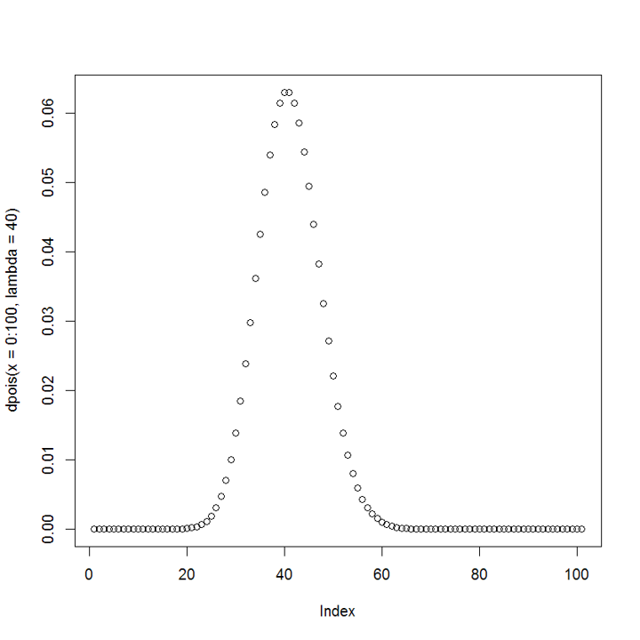{#fig-04-quality-control-and-alignment-038}

依据测序深度的概率分布，可以很容易推出测序深度大于指定阈值$d$的基因组区域比例：


$$
P(D\ge d) = \sum_{i=d,...,\infty}P(D=i)
$$ {#eq-04-quality-control-and-alignment-004}


不过实际的基因组测序深度分布与泊松分布并不完全一致，由于GC偏好性等因素的影响，之前推导过程中依据的全基因组来源等概率的假设并不完全成立，从而使实际的分布相对于理论分布，存在明显的overdispersion（即$Var(D) > E(D)$）


{#fig-04-quality-control-and-alignment-038-repeat-2}

 

Bentley et al, Nature, 2008


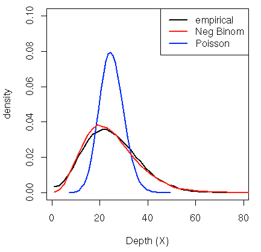{#fig-04-quality-control-and-alignment-039}

 

Shen et al, Nature, 2008

::: {.callout-note title="待完善" collapse="true"}
先给直观例子，将较长推导放到扩展框。
:::

## 阅读 FastQC 与 MultiQC 报告 {#sec-04-02}

依据实验背景解释质控图，而非只看红绿灯。

#### 测序数据的质量控制 {#src-0050-RNA-seq-128}

测序原始数据是Fastq格式存储到文件，文件中包含序列的测序信息、本身碱基序列信息、碱基质量等内容。由于测序过程中存在很多或主观或客观的因素，例如样本污染或降解、接头污染以及测序过程中不可避免的测序误差等，都影响着测序数据的质量。对测序数据的质量控制可以减少数据噪音，保证结果的准确性。质量控制包括测序质量评估和高质量测序片段的获取。

##### 质量评估软件FastQC {#src-0050-RNA-seq-154}

在进行测序数据的正式分析之前，需要对样本的整体质量进行评估，包括碱基质量评估、接头序列检测、重复序列评估等。

FastQC（https://www.bioinformatics.babraham.ac.uk/projects/fastqc/）是常用的fastq质量评估软件（图3.4）。


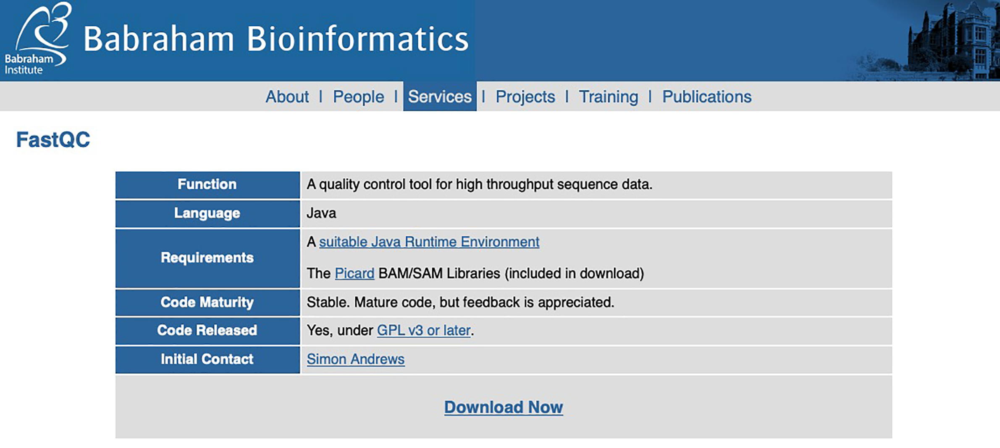{#fig-04-quality-control-and-alignment-033}

  

图3.4 FastQC网站

FastQC可以对每个位点碱基质量进行评估汇总、检测接头序列及重复序列，对GC含量分布、N碱基含量、长度分布进行统计，用网页展示结果。以下示例图片源于用FastQC对一个单端小RNA组测序样本的质量评估。

FastQC会给出一个测序数据总体的质量情况（图3.5）。包括:

1. 基本统计(Basic Statistics);
2. 每个位点的碱基质量（Per base sequence quality)
3. 每条reads的质量均值（Per sequence quality scores）
4. 每条reads中四种碱基出现频率（Per base sequence content）
5. reads每个位置的GC含量（Per sequence GC content）
6. 每个位点不明碱基N的含量（Per base N content）
7. 长度分布图（Sequence Length Distribution）
8. 序列的重复水平（Sequence Duplication Levels）
9. 突出的重复序列 （Overrepresented sequences）
10. 接头序列情况（Adapter Content）
11. 短序列重复片段（Kmer Content）

软件会对以上每一项进行评估，绿色对勾代表“pass”，黄色叹号代表“warn”，红色叉代表“fail”。


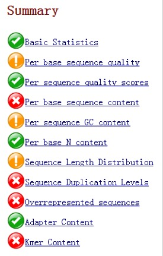{#fig-04-quality-control-and-alignment-036}


图3.5 FastQC对一个RNA测序样本的总览

基本信息的统计能够快速了解样本的基本情况，例如文件类型、编码方式、总read数、序列长度等（图3.6）。


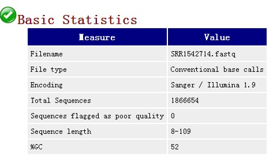{#fig-04-quality-control-and-alignment-037}


图3.6 FastQC对RNA测序样本基本信息统计

每个位点的碱基质量统计，能够快速了解样本的整体质量（见本小节的碱基质量图）。横轴代表碱基在reads上的位置；纵轴代表这个碱基的quality；Quality即为Fred值，计算公式-10*log10(p)，p为测错的概率，假设quality等于20，这个碱基出错的概率为0.01，假设quality等于30，这个碱基出错的概率为0.001；每一个碱基位置有一个箱型图，其中红线代表中位数，蓝线代表平均数；当然任意位置的下四分位数低于10或中位数低于25时FastQC软件会对此项评估为“warn”，当任意位置的下四分位数低于5或中位数低于20时FastQC软件会对此项评估为“fail”。


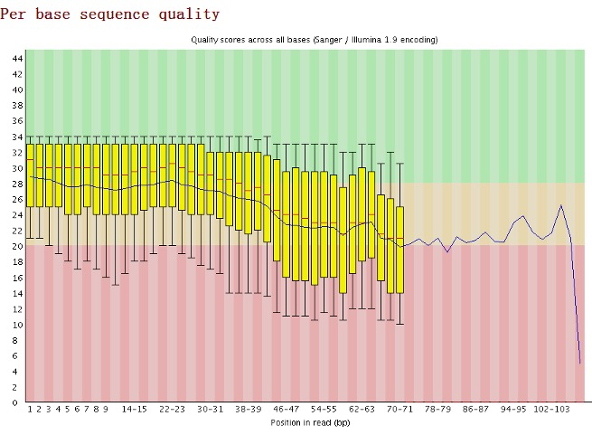{#fig-04-quality-control-and-alignment-034}


图3.7 FastQC对RNA测序样本的碱基质量

每条reads中四种碱基的统计显示碱基分布不均衡（图3.8）。一般情况下，A、T、C、G四种碱基的出现频率是均衡的，当任一位置的A/T比例与G/C比例相差超过10%时FastQC软件会对此项评估为“warn”，当任一位置的A/T比例与G/C比例相差超过20%时FastQC软件会对此项评估为“fail”。需要注意的是，评估为Fail不代表样品一定不能 用，要结合具体测序对象来分析。例如图3.7中的AT含量较高，导致评估为Fail，这是一个小RNA测序样本，小RNA中有大量的miRNA，而miRNA主要通过与mRNA富含AT碱基的3'非编码区结合，行使其调控功能，因此小RNA测序样本中AT含量高是正常现象。


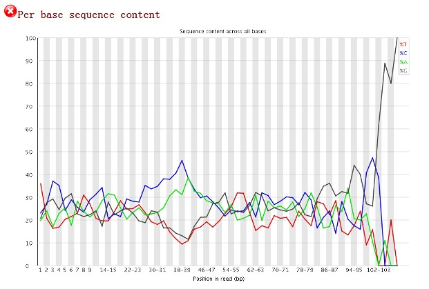{#fig-04-quality-control-and-alignment-035}


图3.8 FastQC对RNA测序样本的碱基质量

### 测序数据的质控与前处理 {#src-0030-QC-of-FASTQ-7}

[]{#ngs_qc}


### 数据质控的目的 {#src-0030-QC-of-FASTQ-9}

待完善

### 生成FastQ测序数据报告 {#src-0030-QC-of-FASTQ-11}


#### FastQC {#src-0030-QC-of-FASTQ-13}

待完善

#### MultiQC {#src-0030-QC-of-FASTQ-15}

待完善

## 接头、低质量序列与双端预处理 {#sec-04-03}

理解何时修剪、如何保持配对关系以及如何验证处理效果。

##### 用质量控制软件获取高质量测序片段 {#src-0050-RNA-seq-204}

对评估后确定数据质量合格的样品，进行进一步的分析。使用Trimmomatic、Cutadapt、Fastx-toolkit、NGSQC等去除数据中的低质量测序片段、接头序列等，以获得高质量测序片段，即clean reads。对于低质量的reads，例如Q值过低、含N过多的reads片段要进行切除或过滤，接头序列包括用于区分DNA片段来自哪个样本的barcode序列、DNA片段的PCR扩增序列，以及DNA片段与测序仪 lane结合的序列。需要切除这部分序列。

Trimmomatic采取滑动窗口的方式对reads质量进行评估，如果窗口碱基质量均值小于指定值，则将该read去除，还可以用于reads的修剪和接头的去除、去除reads 3‘/5’端指定长度，或者质量低于指定值的碱基。Cutadapt偏重对接头的处理，存在于reads内部或者两端的5'/3'接头的去除，设置接头错配率、接头是否含有indel以及在接头中设置通配碱基N等，去除含N过多的reads和低质量碱基。Fastx-toolkit可以对碱基质量进行过滤以及统计。

### 常用的数据前处理办法及思路 {#src-0030-QC-of-FASTQ-17}


#### 去除测序接头 {#src-0030-QC-of-FASTQ-19}

- cutadapt
- trim galore

### 针对FASTQ文件的其他操作 （seqkit） {#src-0030-QC-of-FASTQ-23}


#### trim到相同长度 {#src-0030-QC-of-FASTQ-25}

待完善

#### 随机筛选 {#src-0030-QC-of-FASTQ-27}

待完善

#### 等等 {#src-0030-QC-of-FASTQ-29}

待完善

## 比对算法的直观原理 {#sec-04-04}

理解速度、灵敏度与唯一定位之间的权衡。

### 测序数据的比对及文件操作 {#src-0040-mapping-and-BAM-operation-8}

[]{#mapping_and_BAM}


### 常用比对方法概述 {#src-0040-mapping-and-BAM-operation-10}


#### 从双序列比对说起 {#src-0040-mapping-and-BAM-operation-12}

双序列比对是一切比对问题的基础。所谓的序列比对就是找到两条序列最佳的匹配方式。

**比对**其实应该对应的单词是alignment，但往往特指低通量的序列之间的比较。比如10条序列，进行多序列比对就是我们常说的 multiple alignment问题；如果是2条序列的比对，我们经常称其为pairwise alignment.

**回贴**通常对应的单词应该是mapping，一般指高通量的数据去寻找基因组的位置。比如我们进行测序以后，有10M对read pair，要去寻找他们在基因组上的位置，这个时候就是一个典型的mapping问题。

alignment与mapping其实是密切相关的概念，所有的mapping软件其实都是从低通量的办法逐步改进而得到的。

其实双序列比对（pairwise alignment）的相关算法，主要是Needleman-Wunsch算法（全局比对）和Smith-Waterman算法（局部比对）。

#### 使用BLAST对单条序列进行搜索 {#src-0040-mapping-and-BAM-operation-24}

当我们在鉴定一些未知名物种的时候，常规的分子生物学操作通常是：提取物种DNA，而后使用通用引物进行pcr扩增，送去公司进行sanger测序，序列结果返回后，通过NCBI进行检索，从而获取分子层面的物种鉴定。

在检索的过程中，我们选择的通常是一整个数据库进行比对，面对上亿的序列信息，如何在极短的时间内完成整个检索并反馈给用户，采用1对1的比对显然是不现实的，故而NCBI采用了一种启发式的序列检索工具Basic Local Alignment Search Tools，简称BLAST。

BLAST的基本原理就是先对数据库所有序列建立index，在输入序列后，对序列分割成若干段，而后通过快速检索与打分，最后反馈给用户。

### 高通量测序数据的比对算法简介 {#src-0040-mapping-and-BAM-operation-31}

说回到我们手上的高通量数据，类比blast查询，fq文件就是我们要检索的序列，reference genome就是我们手上存在的数据库，我们要做的事情就是把fq里面的序列全部在reference genome上找一下位置。与blast不同的是这回我们面对的是成千上万条序列的检索，而对应的数据库则小了很多，而且检索序列相对于传统的sanger测序序列其实短了很多，根据这些特性不同，软件设计者们设计了各式各样的软件，但按照所使用的核心算法不同，大致可以拆分成两大阵营：hash-table algorithm以及 BWT algorithm


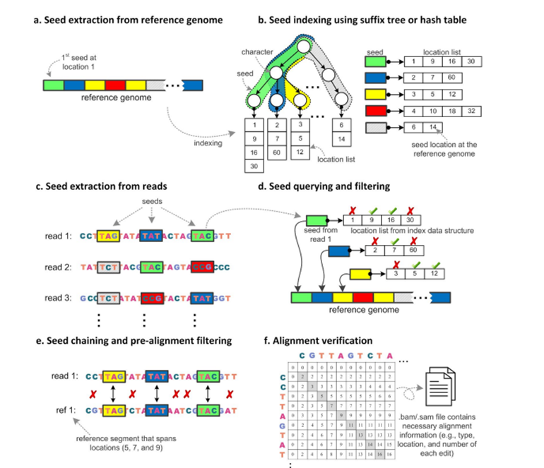{#fig-04-quality-control-and-alignment-001}


#### 基于哈希表（hash-table）数据结构的比对算法 {#src-0040-mapping-and-BAM-operation-36}

哈希表是通过把关键码值（key value） 映射到表中的具体位置来进行访问，从而加快数据的查询速度。其核心思想就是采用种子序列定位及延伸算法（seed-and-extend algorithm）。

根据索引构建对象的不同，可以将软件分为两类：基于参考基因组索引的延伸比对软件与基于短序列数据集索引的延伸比对软件。

基于参考基因组索引构建哈希表数据结构的软件代表有PASS跟GASSST，其工作原理就是通过查询短序列在参考基因组的可能检索位点来定位序列可能存在的位置；基于短序列数据集构建索引的则刚好与之相反，此种索引构建方法为大部分哈希表比对软件所采用，代表软件诸如SOAP,SeqMap等等。

而根据哈希表所采用的比对策略不同，又可以分为连续种子序列（contiguous seed）策略与间隔种子（spaced seed）策略。
在了解这两种不同的比对策略之前，让我们先来实际看看哈希表是大概怎么构建的。

##### 哈希表的构建 {#src-0040-mapping-and-BAM-operation-46}

了解哈希表之前，我们需要补充一个概念k-mer：所谓k-mer，就是将一段序列拆分成包含k个碱基的迭代子序列，即从一条母序列中迭代的选取长度为K个碱基的序列，若母序列的长度为L，k-mer长度为K，那么就可以得到L-K+1个k-mer。

DNA序列是由A,T,C,G四种碱基排序而成，我们可以按四进制给序列进行计数，而后转换为十进制作为哈希表的关键码值生成函数H（x）。


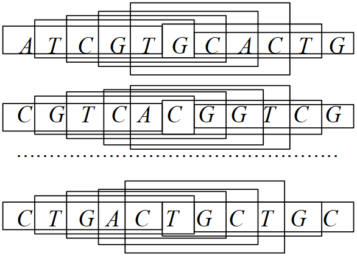{#fig-04-quality-control-and-alignment-002}


举个例子，如果某个子序列为ATGCT，其中我们设定A->0, T->1, C->2, G->3,则H（x） = 1 x 4^0 + 2 x 4^1 + 3 x 4^2 + 4 x 4^3 + 0 x 4^4 = 121,这样我们就得到了5-mer序列在哈希表中的关键码值。将上面的方法进一步推广，即可得到在x长度为n的序列，H(X) = I(n) x 4^n + I(n-1) x 4^(n-1) + ... + I(1) X 4^0。
  
在得到一个哈希表之后，我们就相当于知道了所有seed序列的位置，在检索输入序列后，即可快速进行比对反馈，而后进行延伸就得到了序列所在位置。


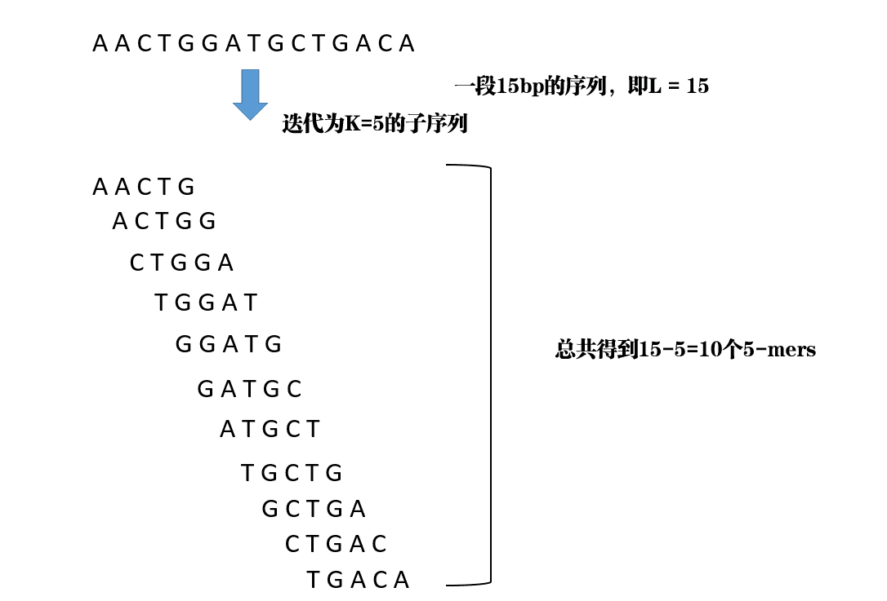{#fig-04-quality-control-and-alignment-003}


##### 连续种子序列策略 {#src-0040-mapping-and-BAM-operation-59}

连续种子序列策略是将短序列拆分成k-mer长的子序列，而后查看由基因组k-mer的子序列所构建的哈希表数据结构进行匹配，从而完成整个回溯过程。
  
  这种算法的缺点是显而易见的，即不允许mismatch的存在，如果序列中出现了至少一个位点的突变，则该位点就会被过滤掉。为了弥补这种缺陷，软件设计者们采用了鸽洞原理（pigeonhole principle）对算法进行了修正：首先，将短序列分割成等会参观的多段迭代子序列，进行定位时，如果完成match上，则证明序列定位成功，如果存在mismatch，只要不超过设定的某个mismatch数目，则将该序列设定为候选序列，在所有候选序列汇总后选出最少的mismatch作为回溯序列。而后又陆续推出了一系列的修正算法，如q-gram过滤算法，但由于本书重点不在算法解释，仅作简单介绍，有兴趣的读者可以自行查阅相关文献。
  


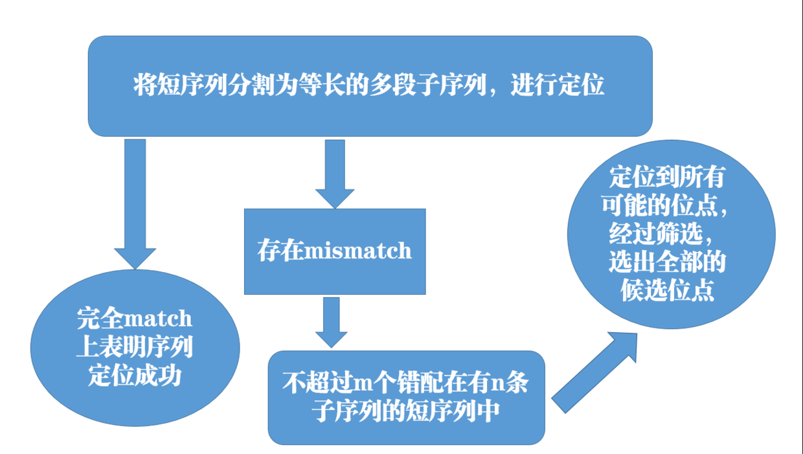{#fig-04-quality-control-and-alignment-004}


##### 间隔种子序列策略 {#src-0040-mapping-and-BAM-operation-66}

所谓的间隔种子序列策略，就是种子序列中间允许存在若干个不确定的碱基，即在比对过程种允许mismatch的存在。举个例子，间隔种子序列AGxCGTAA，既可以跟AGGCGTAA匹配，也可以跟AGCCGTAA匹配。这样做的优势就是明显增加了比对算法的灵敏度，但反过来，比对所消耗的时间复杂度明显增加。

#### BWT算法介绍 {#src-0040-mapping-and-BAM-operation-69}

无论采用的是连续种子策略还是间隔种子策略，两者都存在共同的问题，即面对高重复序列的真核生物基因组时，比对效果会比较差，究其原因就是因为k-mer分割所导致的。为了解决这个问题，软件设计者们另辟蹊径，引入了后缀树作为比对算法，但由于后缀树会保留所有字符串的后缀，故而带来内存消耗，时间复杂度以及空间复杂度激增，从而导致了这一类的软件始终不适合大面积的推广。与后缀树对应的是前缀树，因为可以减少很多重复字符串的比较，查询效率会非常高，虽然内存消耗会非常大，但成功的解决了空间复杂度的问题。在现在内存价格持续走低的时代，大内存从来就不是阻碍条件。而我们所提及的BWT算法，本质就是一种前缀树的实现。

所谓BWT (Burrows–Wheeler_transform)数据转换算法，原本是用于文本存储的一种压缩算法，其大致原理是将原来的文本转换为一个相似的文本，转换后使得相同的字符位置连续或者相邻，再通过其他手段对文本进行压缩。
构建BWT的步骤大致如下：

(1)给定一个子序列，譬如：ACAACG，给其后面加入一个后缀$,而后迭代排序。


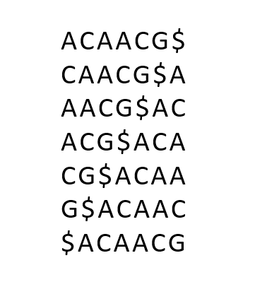{#fig-04-quality-control-and-alignment-005}


(2)按照ASCII码进行大小排序，得到转置矩阵。


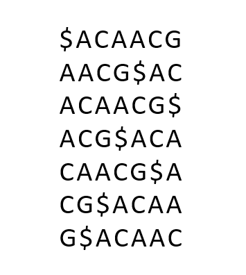{#fig-04-quality-control-and-alignment-006}


(3)取每个串的最后一个字符串，连成一个序列，即得到BWT='GC$AAC'。

构建完一个BWT之后，在回溯过程其实就是一个解码过程，具体解码步骤如下：

(1)L列的第一个元素为原始序列的最后一个元素（因为$在该位置后面）。
(2)F列中的每一个元素，都是其同一行中的L列的下一个元素。也就是L列是F列的前一个元素。


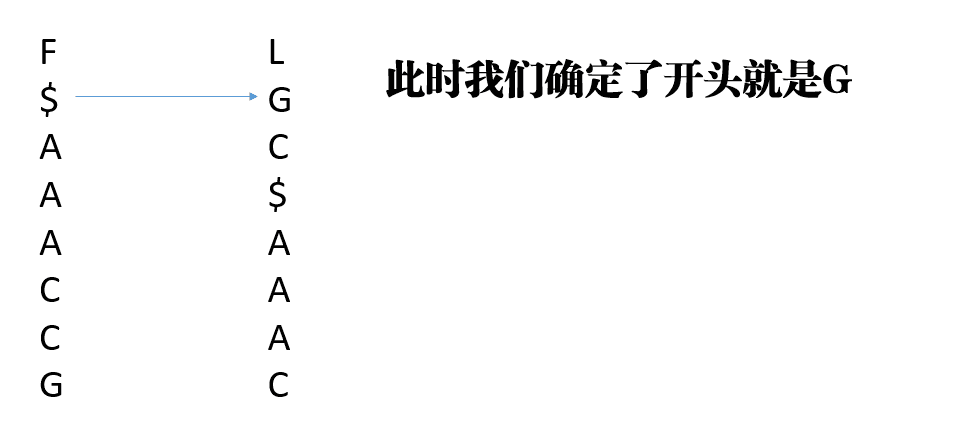{#fig-04-quality-control-and-alignment-007}


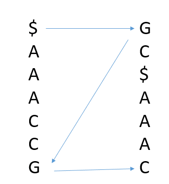{#fig-04-quality-control-and-alignment-008}


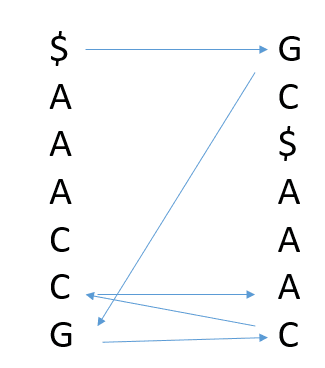{#fig-04-quality-control-and-alignment-009}


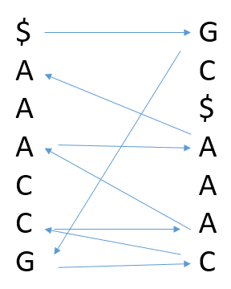{#fig-04-quality-control-and-alignment-010}


::: {.callout-note title="待完善" collapse="true"}
纠正现有数值例题及概念混用；长推导移入附录。
:::

## 根据数据选择比对策略 {#sec-04-05}

能为 DNA 与 RNA 选择合适策略并解释未比对或多重比对。

### 常用的高通量比对软件 {#src-0040-mapping-and-BAM-operation-98}

现在最为流行的二代测序比对软件基本都是基于BWT算法的，例如最早的bowtie与bwa，后面针对转录组又开发了bowtie2，再到后面的tophat2，到现在的hisat2。
由于后面的tophat2与hisat2都是基于bowtie2进行改进的，故而这里仅对bwa，bowtie以及bowtie2进行讲解，从粗略的理解深入对这三者进行比较，方便读者在日后的科研工作中进行选择。

首先说一下bwa，其优势在于提供了更多的比对模式选择，可以根据基因组大小进行比对模式选择，也可以根据序列长短进行比对模式选择，同时mem模式对长序列提供了更好的支持，可以处理三代测序数据，更常见于重测序数据的处理。

bowtie与bowtie2，其实bowtie2更像是对bowtie的一个补充。比起bowtie，bowtie2支持了gap，同时也允许了参考基因组出现不确定碱基N，同时支持了局部比对，在中长序列（50-1000bp）的处理上更具速度与准确性。但在面对small RNA等短序列的时候不允许gap与不确定碱基的bowtie更具优势，究其原因就是比对上更为严格，仅支持全局最优的序列作为比对成功序列。

至于bwa与bowtie2在处理转录组数据时，谁更具备优势，其实很难界定，更多是看个人的工具使用倾向，同时在处理长序列的能力方面，作为bowtie2的最新升级版hisat2也在19年下半年的更新中得到了显著性提升，在许多泛基因组的研究中被越来越多的使用。

#### 以Bowtie2为例进行实操讲解 {#src-0040-mapping-and-BAM-operation-108}

下面本书就以bowtie2的安装与使用为例，讲解在使用过程中应该注意的事项。

##### bowtie2的安装 {#src-0040-mapping-and-BAM-operation-111}

由于bowtie2有将安装包放进conda的channel--bioconda里面，故而最为方便的安装方式是直接使用conda进行安装

首先，如果我们在不知道具体哪个channel的情况下，可以在浏览器中输入“conda cloud”进行检索（以必应为例）


{#fig-04-quality-control-and-alignment-011}


点进去即可搜索bowtie2


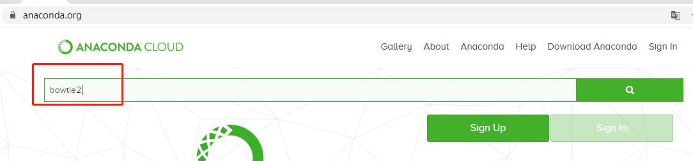{#fig-04-quality-control-and-alignment-012}


搜索结果如下


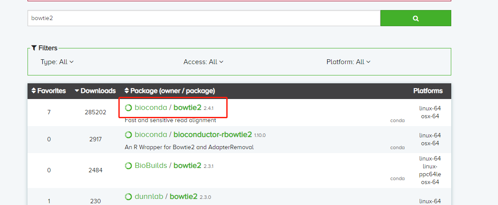{#fig-04-quality-control-and-alignment-013}


点进入即可看到安装命令行


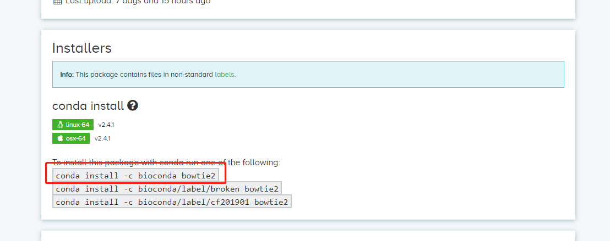{#fig-04-quality-control-and-alignment-014}


```
conda install -c bioconda bowtie2
#在软件检索完成之后，按照提示输入y即可按照完成

```


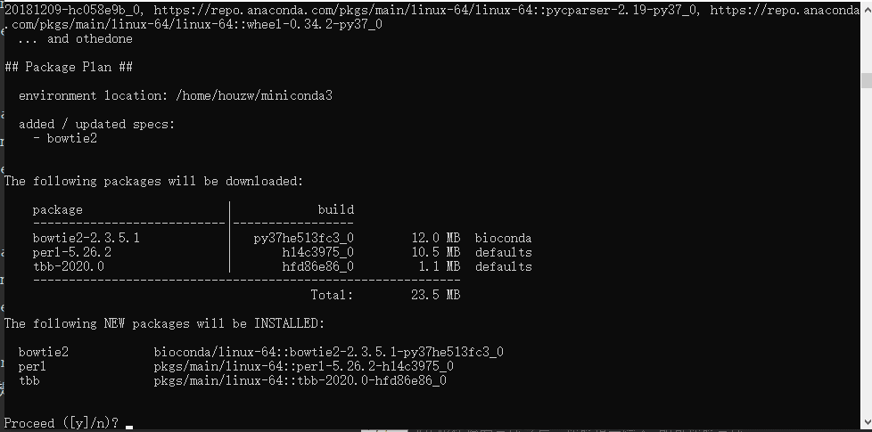{#fig-04-quality-control-and-alignment-015}


按照完成后即可在命令行中敲出bowtie2，连按tab键补齐三下即可看到所有bowtie2开头的命令


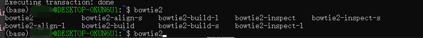{#fig-04-quality-control-and-alignment-016}


这种按照方法较为简单，推荐刚入门的新手使用，而对于已经熟悉了的读者，则可以自行下载，并配置全局调用，此处简单介绍，各位以后想自己安装了就可以自行尝试

首先在搜索引擎上搜索bowtie2


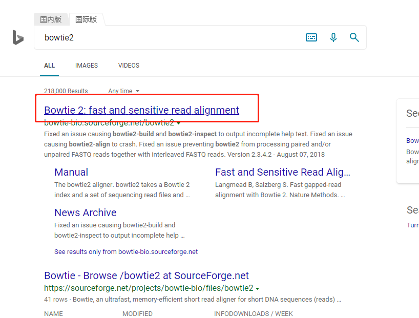{#fig-04-quality-control-and-alignment-017}


进入官网，即可看到每个版本修复的问题，而在右下角提供的github链接则为我们要下载的源码地址


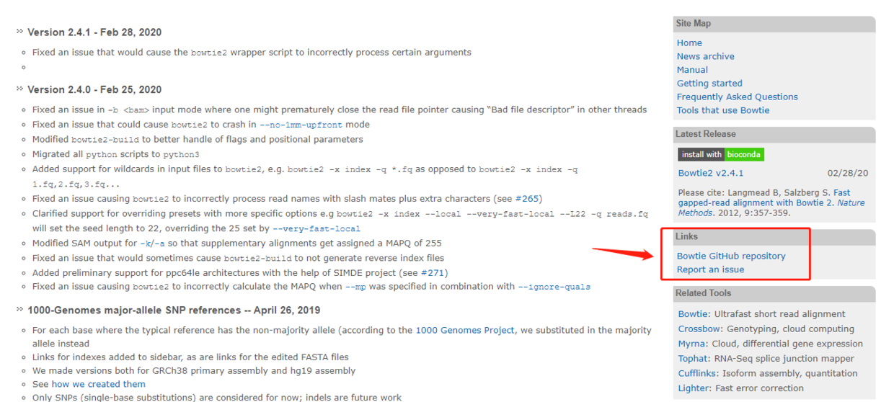{#fig-04-quality-control-and-alignment-018}


点击绿色的clone按键，在window的用户可以下载为zip而后解压传输到服务器上，如果服务器网络较好，也可以通过clone的方式下载到服务器上


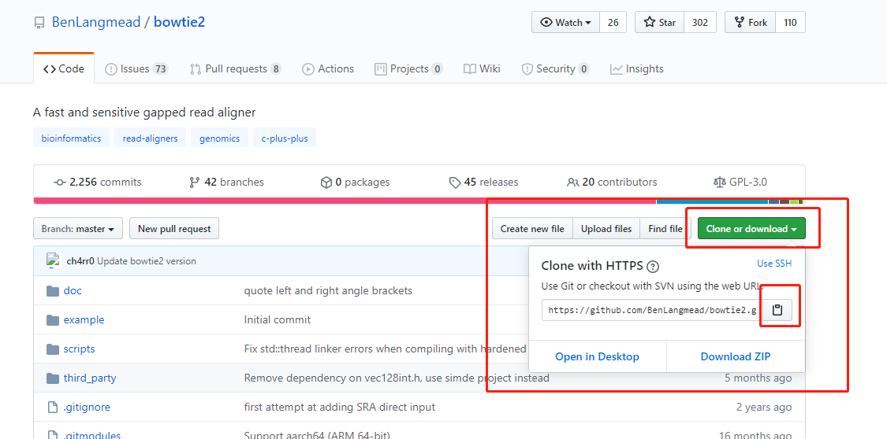{#fig-04-quality-control-and-alignment-019}


```
git clone https://github.com/BenLangmead/bowtie2.git

```


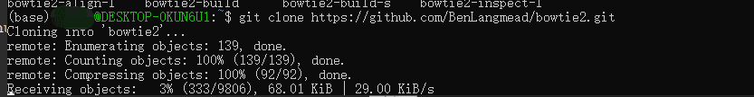{#fig-04-quality-control-and-alignment-020}


```
#由于bowtie2是无需编译的，下载完成后，即可立即使用

#进入下载后的文件夹，不知道文件夹全名是什么可以ls一下，即可看到当前目录的所有文件跟文件夹，选择进入
cd bowtie2 

#看到bowtie2文件夹内的所有文件
ls 

#选择当前文件夹内的程序使用./+文件名，-h即打开说明书，回车一下即可看到bowtie2的使用说明
./bowtie2 -h 

#获取当前的全路径，并复制
pwd 

#打开环境配置的文件，按i进入编辑模式,去到最后一行输入下一列内容
vim ~/.bashrc 

#从home到bowtie2这一段为刚刚pwd复制的全路径
export PATH="$PATH:/home/Alfred/biosoft/bowtie2/bowtie2-2.3.5.1-linux-x86_64/" 

#ESC键退出编辑模式，并按:wq，退出并保存
source ~/.bashrc #更新当前环境

```

由于购买此书基本为新手，故而不推荐大家一开始就进行自行下载，更新环境，能用conda解决就用conda解决，等熟悉了Linux的操作逻辑再自行翻阅尝试即可。

##### bowtie2的使用 {#src-0040-mapping-and-BAM-operation-188}

作为一名生信从业的科研人员，我们面对不熟悉的软件，第一件事并不是火急火燎的去乱问别人，而是应该秉承着先检索前人使用经验与阅读说明书的原则去熟悉一个新软件，在GitHub的下载页面下面即有bowtie2的使用简要说明


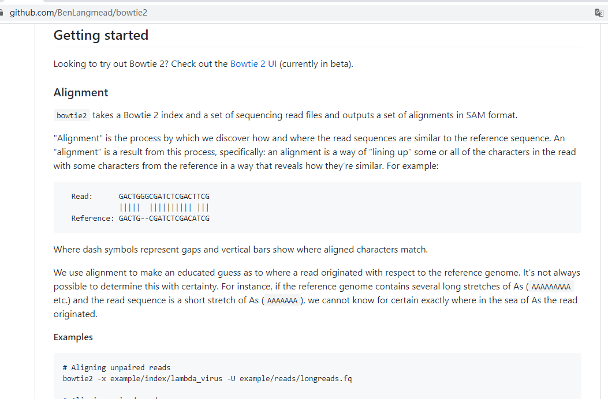{#fig-04-quality-control-and-alignment-021}


下面由我跟大家用实际例子做个介绍

首先，我们需要从书上提供的地址下载参考基因组，下载完成之后即为一个fa文件


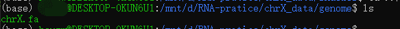{#fig-04-quality-control-and-alignment-022}


我们使用bowtie2做的第一件事就是对这个参考基因组构建一个索引，这一步的目的就是上文提到构建索引表，供后续比对检索回帖

```
bowtie2-build chrX.fa chrX.fa
# bowtie2-build命令为构建索引的命令
# 第一个chrX.fa代表输入的参考序列
# 第二个chrX.fa代表输出的索引文件前缀
# 产生六个.bt2新文件

```


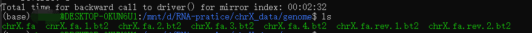{#fig-04-quality-control-and-alignment-023}


接着就是拿我们在上一个步骤处理干净的clean data进行回帖操作，这一步可以理解为将所有短序列在参考基因组上找回他们对应的位置，下面我们对bowtie2的参数进行一个大概的认知。

```
#必选参数
# -x <int> 选择索引前缀，即刚刚由bowtie2-build所生成的chrX.fa。
# -1 <int> 双端测序对应的R1.fa，可以为多个文件，并用逗号分开；需要与-2中的R2.fa文件一一对应。
# -2 <int> 双端测序对应的R2.fa.
# -U <int> 单端测序对应的fa，可以为多个文件，并用逗号分开。
# -S <int> 指定所生成的SAM格式的文件前缀。
#常用可选参数
# -p/--threads <num> 设置线程数.默认为1
# --reorder 配合-p使用，使比对结果在顺序与fq的reads顺序一致
# --seed <int> 设置随机种子
# --no-unal 不记录没比对上的reads
# --un-gz <path> 将unpaired reads输出到指定的<path>,并以gzip形式压缩
# --al-gz <path> 将至少能比对1次以上的unpaired reads写入<path>，并以gzip形式压缩
# -5/--trim5 <int> 剪掉5'端<int>个碱基再比对
# -3/--trim3 <int> 剪掉3'端<int>个碱基再比对
#比对参数
#-N <int> 比对时允许的mismatch数目，除非是跨物种比对，一般不更改
#-L <int> 设置比对时reads种子的长度
#-i <int> 设置两个相邻种子间的间隔碱基数
#--n-ceil <func> 设置reads中允许含有的N碱基数目
#--gbar <int> 设置头尾<int>个碱基内不允许的gap数
#--end-to-end 全局比对，为默认模式
#--local 局部比对，多用于找motif，read两端的一些碱基不进行比对罚分
#罚分参数
#--ma <int> 设置匹配得分，仅在--local时生效，比对上一个碱基得<int>分，默认为2，而全局比对时为0
#--mp MX,MN 设置错配罚分，MX即最高罚分，MN为最低分，默认为MX=6，MN=2，如果设置--ignore-qual则每次错配为MX
#--np <int> 当匹配到N时的罚分，默认为1
#--rdg <int1>,<int2> 设置read上打开gap罚分<int1>，延长gap罚分<int2>,默认为5，3
#--rfg <int1>,<int2> 设置reference上打开gap罚分<int1>，延长gap罚分<int2>,默认为5，3
#--score-min <func> 设置有效比对的最小分值，在全局比对时默认为L,-0.6,-0.6，在局部比对时默认为G,20,8
#双端比对参数
#-I/--minins <int> 设置允许插入片段最小长度，默认为0
#-X/--maxins <int> 设置允许插入片段最大长度，默认为500

```

看到这么多参数可能会觉得头晕目眩，其实在我们正常使用中，仅仅是选择必须参数与多线程即可，在比对完成后查看结果再进行调整。

```
bowtie2 -p 10 -x chrX.fa -1 ERR188245_chrX_1.fastq.gz -2 ERR188245_chrX_2.fastq.gz -S ERR188245.sam &

```

##### 对比结果检查 {#src-0040-mapping-and-BAM-operation-256}

在比对完成之后，bowtie2会输出一段log文件，记录着比对情况，但那只是初略的比对情况，简单的检查可以用，但如果是涉及每个染色体的比对情况，则推荐用qualimap2进行检查。该软件的安装，使用conda即可

```
conda install -c bioconda qualimap
```

而后进行质检也非常简单，选择bamqc即可：

```
qualimap bamqc -bam ERR188245.sam -outdir bamqc_result -outformat PDF:HTML
```

如果想看注释的区域也可以加上gff文件的参数：

```
qualimap bamqc -bam ERR188245.sam -gff chrX.gff -outdir bamqc_result -outformat PDF:HTML

```

::: {.callout-note title="待完善" collapse="true"}
修订工具适用范围，用同一类 reads 展示策略差异。
:::

## SAM/BAM 操作与过滤 {#sec-04-06}

能把比对结果转换成适合下游分析的输入。

### SAM文件与BAM文件操作基础 {#src-0040-mapping-and-BAM-operation-276}


#### SAM文件与BAM文件的介绍 {#src-0040-mapping-and-BAM-operation-278}

经过bowtie2比对之后，会生成一个后缀是sam的结果文件，这个文件里面就记录了我们的比对的结果，下面我们使用less指令查看这个文件，看看有什么玄妙的地方

```
less ERR188245.sam

```


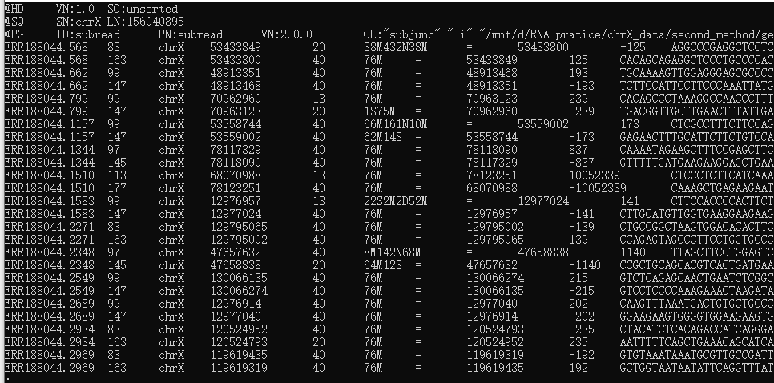{#fig-04-quality-control-and-alignment-024}


我们可以看到第一行是@HD开头，VN表示版本号，SO表示是否经过排序如果是排过序的是显示coordinate，没有排序则是unsorted
而第二行是@SQ，后面跟的是染色体号以及染色体长度，单位是bp
第三行则是@PG，表示使用的程序跟命令行。
上面这些@开头的部分统称为头文件，记录着一些基本信息
下面一系列格式类似的则是我们的比对结果，每一列记录着不同的信息。
第一列即ERR开头的这些表示的是read的编号，即fq文件的第一行
第二列是一列数字，这列数字叫做flag，即位标识，表示的是比对上的情况，是下面这些情况的数值之和

```
0：比对到参考序列的正链上
1：是paired-end或mate pair中的一条
2：同一模板的各片段满足比对软件定义的正确配对条件（proper pair）
4：没有比对到参考序列上
8：另一片段（mate）未比对到参考序列
16：比对到参考序列的负链上
32：双末端reads的另一条（mate）比对到参考序列的负链上
64：这条read是mate 1
128：这条read是mate 2
#后续根据比对情况进行过滤就是用到这些数字

```

第三列是表示比对上的参考基因组的某条染色体，如果什么都没比对上则是'*'

第四列是比对上的染色体的具体位置起始位置，从1计数，如果比对不上则是以0计数

第五列是比对质量 MAPQ，用 Phred 标度表达比对位置错误的概率。SAM 规范并未将取值限制为 0—60；255 表示没有可用的比对质量。具体算法、上限和过滤阈值依赖比对软件及分析目的，不能把 MAPQ≥20 当作普遍的可信保证。

第六列是比对情况表达式，CIGAR，主要由soft  clipping 、match/mismatch、insertion、deletion、 padding、skipped bases、hard clipping、match、mismatch对应字母S、M、I、D、P、N、H、=、X跟数字组成，例如 `3S38M432N38M` 表示先软剪切 3 个碱基，再比对 38 个碱基、跳过参考上的 432 个碱基、再比对 38 个碱基；`M` 同时包含匹配与错配，`S` 必须大写

第七列表示下一片段比对上的参考序列的标号，同一片段用=，没有另外片段则为'*'

第八列表示下一片段比对上的位置，如果不可用则用0

第九列表示Template的长度，最左边得为正，最右边的为负，中间的不用定义正负，不可用则为0

第十列则为比对上的reads对应的序列信息

第十一列则是比对上的序列的质量信息，计分方法同FASTQ文件

看到这里你可能觉得头晕晕的，但其实可以不用记得这么仔细，你只需要知道sam文件就是记录了比对上了哪些reads，比对上的reads在什么位置，这些reads比对的质量怎么样即可了，到真的需要过滤的时候再查看一下具体内容就行了。

#### BAM文件的生成 {#src-0040-mapping-and-BAM-operation-330}

由于我们的sam文件是文本类的文件，这就导致比对所产生的结果文件动辄大几G，对我们硬盘的造成了很大存储压力，如果压缩则能够减小很多体积，而直接转成二进制文件则更为节约体积，故而就诞生了一种二进制格式bam来对比对结果进行存储，除了是二进制以外其存储的内容与sam文件无异。怎么区分这两个呢，我觉得用英文区分就很简单可以区分开，s是string的意思，字符，文本的意思，b是binary的意思，二进制的意思，一下子就知道两者的区别了。

那么转成二进制文件之后，要怎么打开呢？很明显使用less这种打开文本文件的是不适合的了。这个时候就要提到bwa之父李恒大神为sam与bam开发的一个处理利器samtools。首先是国际惯例，安装

```
conda install -c bioconda samtools

```

安装完毕之后就可以在命令行上使用了，首先是将sam文件转换为bam文件：

```
# 将sam文件转换为bam文件
samtools view -b -S ERR188245.sam > ERR188245.bam

# 同样的，我们可以把bam文件转为sam文件
samtools view -h ERR188245.bam > ERR188245.sam
```

那么问题来了，转为bam文件之后，怎么用samtools查看？我们可以将bam转为sam，然后再利用管道符用less查看：

```
# 查看完整的bam文件
samtools view -h ERR188245_chrX.bam | less -S

#如果只想查看头文件
samtools view -H ERR188245_chrX.bam

#如果想跳过头文件
samtools view ERR188245_chrX.bam  | less -S

```

#### BAM文件的排序 {#src-0040-mapping-and-BAM-operation-364}

如果我们是做全基因组测序，那么在进行下游分析之前，需要对bam文件进行一个排序，这个功能可以用samtools，也可以用Picard或者gatk做到。

使用samtools对bam文件进行排序：

```
samtools sort -@ 20 -m 8G -O bam -o ERR188245_chrX.sorted.bam ERR188245_chrX.bam
# @：指定线程数
# m：每个线程分配的最大内存
# O：输出文件格式
# o：输出文件的名字
# 输入文件放在最后
```

如果是picard的话，可以参考下面的命令：
```
java -jar picard.jar SortSam I=ERR188245_chrX.bam  O=ERR188245_chrX.sorted.bam  SORT_ORDER=coordinate

```

如果使用GATK工具，对bam文件进行排序，可以参考：

```
#如果是gatk的话, 先建立index与dict
samtools faidx chrX.fa
gatk CreateSequenceDictionary -R chrX.fa -O chrX.dict

#再使用gatk进行排序
gatk SortSam -I ERR188245_chrX.bam -O ERR188245_chrX.sorted.bam -R chrX.fa -SO coordinate --CREATE_INDEX

```

#### BAM文件的index的建立 {#src-0040-mapping-and-BAM-operation-396}

经过排序之后的bam文件，就可以建立索引，如果不排序则会报错。建立bam文件的索引文件，是为了更方便地

```
samtools index ERR188245_chrX.sorted.bam

```

运行完上面的命令，即可在文件夹中获得一个index文件，一般情况下默认的文件名为bam文件名后面增加`.bai`后缀。比如这里就会生成`ERR188245_chrX.sorted.bam.bai`文件。我们在对排序完的bam文件进行一些特殊的操作时，一般都需要index文件和bam文件在同一文件夹中，否则可能会出现报错的现象。

#### 对比对结果进行过滤 {#src-0040-mapping-and-BAM-operation-406}

果然想通过mapping质量或者比对情况进行过滤，那samtools一定是处理代码最为简洁的。

```
samtools view -h -b -q 20 -F 4 -F 256 ERR188245_chrX.sorted.bam > ERR188245_chrX.q1F4F256.sorted.bam

#-f 提取提取出没有mapping上的reads
#-F 过滤过滤掉没有mapping上的reads，也就是说提取出mapping上的reads
#-u 输出格式为未压缩的bam格式
#-q 过滤掉MAPQ值低某个阈值
#-h 设定输出的SAM文件带有header
#-b 输出格式设定为BAM
#-S 输入格式为SAM
```

#### 对比对结果进行统计 {#src-0040-mapping-and-BAM-operation-421}

如果相对bam文件进行一些基础的统计分析，比如测序片段的数目，整体的突变情况，基因组测序结果的覆盖度等等，都可以用下面的命令生成报告。

```
samtools flagstat ERR188245_chrX.sorted.bam

```

结果文件统计bam文件中reads的比对情况，如多少reads比对上等信息，其中的结果比较丰富，但是需要再使用R或者Python编程进行生成图表。所以，当不追求速度的情况下还是建议用qualimap2软件。

## 重复 reads、UMI 与实验特异处理 {#sec-04-07}

避免对所有实验套用同一去重复策略。

#### 去除bam文件中的PCR扩增冗余 {#src-0040-mapping-and-BAM-operation-433}

这一步，我们经常叫`remove duplication`。所谓的duplication一般是指构建测序文库的过程中，会有PCR扩增的步骤，这个步骤往往会对片段进行多次扩增。如果有来源于同一个原始片段的测序结果比对到了基因组上，有可能会对我们的下游分析造成一些影响。所以，某些情况下需要对bam文件进行冗余的去除，这里的冗余一般习惯上称为`duplication`。

去除duplication的方法一般有两种，1个是使用samtools rmdup命令，另一个是使用GATK/Picard工具中的MarkDuplicates。

```
samtools rmdup ERR188245_chrX.sorted.bam ERR188245_chrX.sorted.rmdup.bam

```
由于samtools的算法是针对单端测序的，故而在对双端测序的bam文件处理效果奇差无比，在处理双端测序的文件时，通常我们更推荐使用gatk或者Picard。

首先对duplicate进行标记

```
gatk MarkDuplicates -I ERR188245_chrX.sorted.bam -O ERR188245_chrX.sorted.mkdup.bam -M ERR188245_chrX.metrics --CREATE_INDEX

```

接着就是移除duplicate，但一般也只是标记不移除。

```
gatk MarkDuplicates REMOVE_DUPLICATES=true -I ERR188245_chrX.sorted.mkdup.bam -O ERR188245_chrX.sorted.rmdup.bam -M ERR188245_chrX.metrics

```

或者使用Picard一步进行上述GATK的两步过程：

```
java -jar picard.jar MarkDuplicates I=ERR188245_chrX.sorted.bam O=ERR188245_chrX.sorted.mkdup.bam M=ERR188245_chrX.metrics ASO=coordinate REMOVE_DUPLICATES=true
```

关于samtools的用法其实很多，但限于篇幅，我们只对最常用的几个命令进行了简单介绍，对于组学分析中的其他应用可以参考接下来各章的介绍。

#### SNV/SNP的数据前处理 {#src-0070-WGS-46}


##### 去除PCR重复 {#src-0070-WGS-48}


###### duplicate产生原因 {#src-0070-WGS-50}


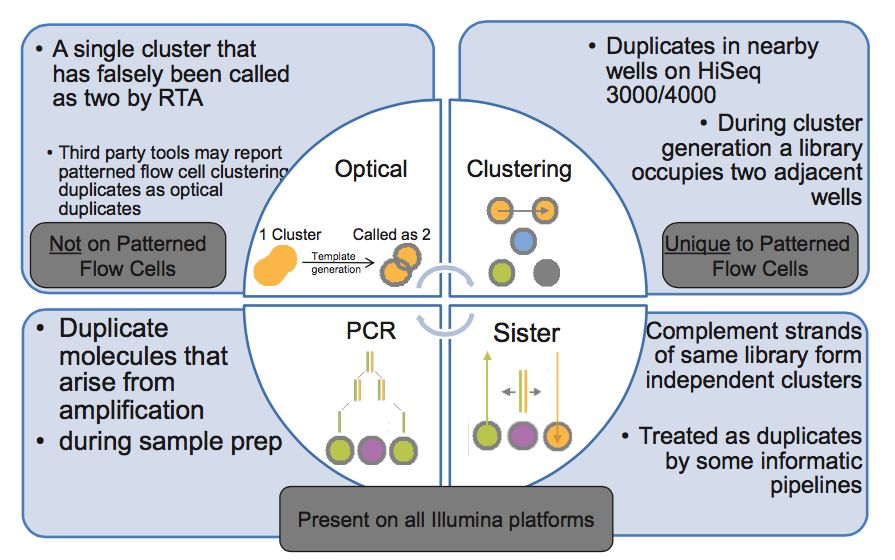{#fig-04-quality-control-and-alignment-040}

 

- **PCR duplicates（PCR重复）**

PCR扩增时，同一个DNA片段会产生多个相同的拷贝，第4步测序的时候，这些来源于同！一！个！拷贝的DNA片段会结合到Fellowcell的不同位置上，生成完全相同的测序cluster，然后被测序出来，这些相同的序列就是duplicate

- **Cluster duplicates**

生成测序cluster的时候，某一个cluster中的DNA序列可能搭到旁边的另一个cluster的生成位点上，又再重新长成一个相同的cluster，这也是序列duplicate的另一个来源，这个现象在Illumina HiSeq4000之后的Flowcell中会有这类Cluster duplicates

- **Optical duplicates（光学重复）**

某些cluster在测序的时候，捕获的荧光亮点由于光波的衍射，导致形状出现重影（如同近视散光一样），导致它可能会被当成两个荧光点来处理。这也会被读出为两条完全相同的reads

- **Sister duplicates**

它是文库分子的两条互补链同时都与Flowcell上的引物结合分别形成了各自的cluster被测序，最后产生的这对reads是完全反向互补的。比对到参考基因组时，也分别在正负链的相同位置上，在有些分析中也会被认为是一种duplicates。

###### 用泊松分布解释duplicate问题 {#src-0070-WGS-70}

求解duplicate rate，相当于是在问这样一个问题：

> 对于已经建好的测序文库，其中有N种序列片段，每条片段长度均为l，每种片段的拷贝数为$k_i(i=1,...,N)$，文库大小（library size）为M，即：
>
> 

$$
M=\sum_{i=1}^{N}k_i
$$ {#eq-04-quality-control-and-alignment-005}


>
> 现在，从这个文库M中随机抽取m条序列($m \ll M$)，进行测序
>
> 问：duplicate rate为多少？

先给大家一个结论：


$$
duplicate\,rate \approx 1-\frac{\lambda N}{M}
$$ {#eq-04-quality-control-and-alignment-006}


其中$\lambda=Ml/G$，当原始文库确定（即测序对象G确定，且片段长度l和总文库大小M确定）时，$\lambda/M$是一个常数，此时$duplicate\,rate \approx 1-kN$，即此时duplicate rate只与原始文库中序列片段的种类数$N$有关，且是负相关

具体的推导过程，请阅读以下部分

解：

下面采用逆向思维来完成这个推导过程

假设，我们可以知道这$m$条序列中总共有$n$种片段，则我们可以很容易地求出目标duplicate rate $d$为：


$$
d=1-\frac{n}{m}
$$ {#eq-04-quality-control-and-alignment-007}

<!-- Original equation tag: 1 -->


那么，这个$n$为多少呢？

现在问题变成了：

> 从这个文库$M$中随机抽取$m$条序列($m \ll M$)，理论上我们能抽中多少种片段？

对于原始文库中的任意一种片段$i$，设以下随机变量：


$$
X_i = \left\{ 
  \begin{array}{ll}
    1 & 该片段被至少抽中一次 \\
    0 & 该片段未被抽中
  \end{array}
\right.
$$ {#eq-04-quality-control-and-alignment-008}


注：当随机变量按照以上形式进行设定时，该随机变量的分布函数称为**示性函数**

则总共被抽中的片段种类为：


$$
n=\sum_{i=1}^{N}X_i
$$ {#eq-04-quality-control-and-alignment-009}

<!-- Original equation tag: 2 -->


我们需要求出$n$的期望，又


$$
E(n)=E(\sum_{i=1}^{N}X_i)=\sum_{i=1}^{N}E(X_i)
$$ {#eq-04-quality-control-and-alignment-010}

<!-- Original equation tag: 3 -->


则我们需要求出其中$E(X_i)$的通式

对于原始文库中的任意一种片段$i$，还可以设以下随机变量：


$$
\theta_i=该种片段被抽中的次数
$$ {#eq-04-quality-control-and-alignment-011}


则$\theta_i$服从二项分布：$\theta_i \sim Binomial(m, \frac{k_i}{M})$

又由于$\frac{k_i}{M} \to 0$，且$m$也比较大，所以$\theta_i$服从泊松分布，即：$\theta_i \sim Possion(\lambda_i)$，其中$\lambda_i=\frac{m\cdot k_i}{M}$

则


$$
\begin{aligned}
&\quad E(X_i) \\
&= P(X_i=1) \\
&= P(\theta_i\ge 1) \\
&= 1-P(\theta_i=0) \\
&= 1-e^{-\lambda_i} \\
&= 1-e^{-m\cdot k_i/M}
\end{aligned}
$$ {#eq-04-quality-control-and-alignment-012}

<!-- Original equation tag: 4 -->


这是我们在已知原始文库中该片段拷贝数$k_i$的情况下，能得出的结果，若我们不知道，则可以知道$k_i \sim Possion(\lambda)$，其中$\lambda=\frac{M\cdot l}{G}$，上式(4)就变成了


$$
E(X_i)=E(1-e^{-m\cdot k_i/M})=\sum_{k=0}^{\infty} (1-e^{-m\cdot k_i/M})\cdot p_k
$$ {#eq-04-quality-control-and-alignment-013}

<!-- Original equation tag: 5 -->


而且每种片段被抽中的可能性均满足(5)

所以


$$
E(n)=\sum_{i=1}^{N}E(X_i)=N\cdot E(X_i)=N\cdot \sum_{k=0}^{\infty} (1-e^{-m\cdot k_i/M})\cdot p_k
$$ {#eq-04-quality-control-and-alignment-014}

<!-- Original equation tag: 6 -->


所以


$$
\begin{aligned}
&\quad d \\
&=1-\frac{E(n)}{m} \\
&=1-\frac{N}{m}\sum_{k=0}^{\infty} (1-e^{-m\cdot k_i/M})\cdot p_k \\
&=1-\frac{N}{m}\sum_{k=0}^{\infty} (1-e^{-m\cdot k_i/M})\cdot \frac{\lambda^k}{k!}e^{-\lambda} \\
&=1-\frac{N}{m}+\frac{Ne^{-\lambda}}{m}\sum_{k=0}^{\infty} \frac{1}{k!}(\lambda e^{-m/M})^k
\end{aligned}
$$ {#eq-04-quality-control-and-alignment-015}

<!-- Original equation tag: 7 -->


上式(7)中的$\sum_{k=0}^{\infty} \frac{1}{k!}(\lambda e^{-m/M})^k$（其中$\lambda e^{-m/M} \to 0$）近似指数函数$e^x$在$(0, f(0))$处的泰勒展开式：


$$
e^x=\sum_{n=0}^{\infty} \frac{x^n}{n!}
$$ {#eq-04-quality-control-and-alignment-016}

<!-- Original equation tag: 8 -->


因此，可以得到


$$
\begin{aligned}
&\quad d \\
&=1-\frac{N}{m}+\frac{Ne^{-\lambda}}{m}\sum_{k=0}^{\infty} \frac{1}{k!}(\lambda e^{-m/M})^k \\
&\approx1-\frac{N}{m}+\frac{Ne^{-\lambda}}{m}\cdot e^{\lambda e^{-m/M}} \\
&=1-\frac{N}{m}\left(1-e^{-\lambda}\cdot e^{\lambda e^{-m/M}}\right) \\
&=1-\frac{N}{m}\left(1-e^{\lambda (e^{-m/M}-1)}\right)
\end{aligned}
$$ {#eq-04-quality-control-and-alignment-017}

<!-- Original equation tag: 9 -->


由于$m \ll M$，则$-m/M \to 0^-$，且由于$e^x$在$x=0$处的一阶泰勒公式为：$e^x=1+x+o(x)$，则此时$e^{-m/M} \approx 1-m/M$

则(9)可以化简为：


$$
\begin{aligned}
&\quad d \\
&\approx 1-\frac{N}{m}(1-e^{-\lambda m/M}) \\
&\approx 1-\frac{N}{m}[1-(1-\lambda m/M)] \\
&=1-\frac{N}{m}\frac{\lambda m}{M} \\
&=1-\frac{\lambda N}{M}
\end{aligned}
$$ {#eq-04-quality-control-and-alignment-018}

<!-- Original equation tag: 10 -->


故，最终得到


$$
d\approx 1-\frac{\lambda N}{M}
$$ {#eq-04-quality-control-and-alignment-019}


###### PCR bias的影响 {#src-0070-WGS-208}

1. DNA在打断的那一步会发生一些损失，主要表现是会引发一些碱基发生颠换变换（嘌呤-变嘧啶或者嘧啶变嘌呤），带来假的变异。PCR过程会扩大这个信号，导致最后的检测结果中混入了假的结果；

2. PCR反应过程中也会带来新的碱基错误。发生在前几轮的PCR扩增发生的错误会在后续的PCR过程中扩大，同样带来假的变异；

3. 对于真实的变异，PCR反应可能会对包含某一个碱基的DNA模版扩增更加剧烈（这个现象称为PCR Bias）。因此， 如果反应体系是对含有reference allele的模板扩增偏向强烈，那么变异碱基的信息会变小，从而会导致假阴。


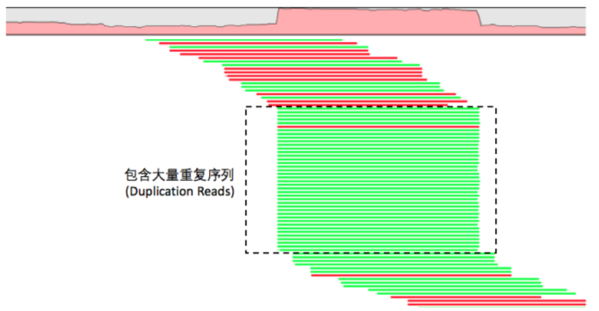{#fig-04-quality-control-and-alignment-041}


###### 操作 {#src-0070-WGS-218}


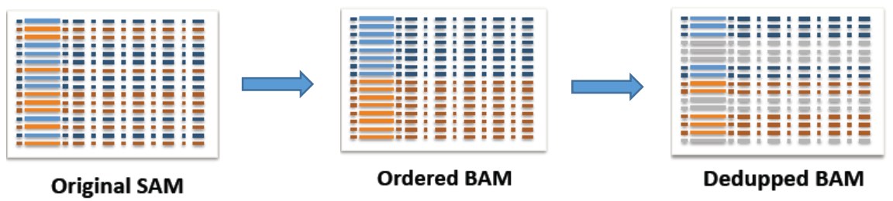{#fig-04-quality-control-and-alignment-042}


**1. 排序（SortSam）**

- 对sam文件进行排序并生成bam文件，将sam文件中同一染色体对应的条目按照坐标顺序从小到大进行排序
- GATK4的排序功能是通过`picard SortSam`工具实现的。虽然`samtools sort`工具也可以实现该功能，但是在GATK流程中还是推荐用picard实现，因为SortSam会在输出文件的头信息部分添加一个SO标签用于说明文件已经被成功排序，且**这个标签是必须的**，GATK需要检查这个标签以保证后续分析可以正常进行
- `https://software.broadinstitute.org/gatk/documentation/tooldocs/current/picard_sam_SortSam.php`

```bash
# 使用GATK命令
$ gatk SortSam -I mapping/T.chr17.sam -O preprocess/T.chr17.sort.bam -R database/chr17.fa -SO coordinate --CREATE_INDEX
# 使用picard命令
$ java -jar picard.jar SortSam \
      I=input.bam \
      O=sorted.bam \
      SORT_ORDER=coordinate
```


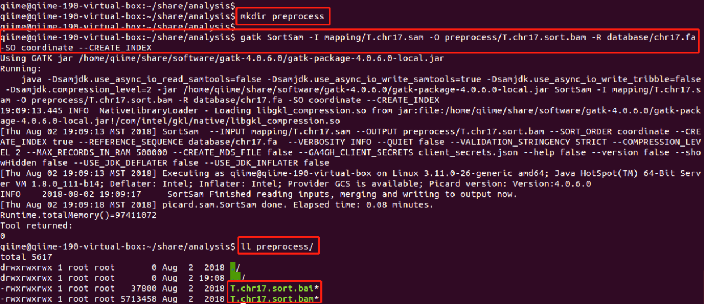{#fig-04-quality-control-and-alignment-043}


如何检查是否成功排序？

```bash
$ samtools view -H /path/to/my.bam
@HD     VN:1.0  GO:none SO:coordinate
@SQ     SN:1    LN:247249719
@SQ     SN:2    LN:242951149
@SQ     SN:3    LN:199501827
@SQ     SN:4    LN:191273063
@SQ     SN:5    LN:180857866
@SQ     SN:6    LN:170899992
@SQ     SN:7    LN:158821424
@SQ     SN:8    LN:146274826
@SQ     SN:9    LN:140273252
@SQ     SN:10   LN:135374737
@SQ     SN:11   LN:134452384
@SQ     SN:12   LN:132349534
@SQ     SN:13   LN:114142980
@SQ     SN:14   LN:106368585
@SQ     SN:15   LN:100338915
@SQ     SN:16   LN:88827254
@SQ     SN:17   LN:78774742
@SQ     SN:18   LN:76117153
@SQ     SN:19   LN:63811651
@SQ     SN:20   LN:62435964
@SQ     SN:21   LN:46944323
@SQ     SN:22   LN:49691432
@SQ     SN:X    LN:154913754
@SQ     SN:Y    LN:57772954
@SQ     SN:MT   LN:16571
@SQ     SN:NT_113887    LN:3994
...
```

若随后的比对记录中的contig那一列的顺序与头文件的顺序一致，且在头信息中包含`SO:coordinate`这个标签，则说明，该文件是排序过的

**2. 标记重复（Markduplicates）**

- 标记文库中的重复
- `https://software.broadinstitute.org/gatk/documentation/tooldocs/current/picard_sam_markduplicates_MarkDuplicates.php`

```bash
gatk MarkDuplicates -I preprocess/T.chr17.sort.bam -O preprocess/T.chr17.markdup.bam -M preprocess/T.chr17.metrics --CREATE_INDEX

```


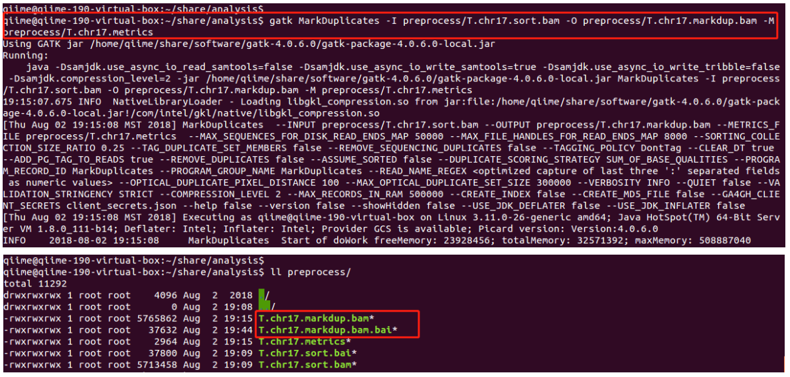{#fig-04-quality-control-and-alignment-044}


::: {.callout-note title="待完善" collapse="true"}
补 UMI 思路、处理适用条件及影响比较。
:::

## 比对后质控、IGV 与继续分析的判断 {#sec-04-08}

确认数据足以支持目标分析，并发现流程中的明显错误。

### IGV可视化查看比对结果 {#src-0040-mapping-and-BAM-operation-467}

虽然使用samtools的flagstat或者qualimap2可以从一个总体的情况得知整个fq的比对情况，但有时候，我们可能只是想看染色体上某一段区域，又或者还想直观的看编码区之类的比对情况，那这个时候就需要一个可视化的基因浏览器---IGV（Integrative Genomics Viewer）。
首先国际惯例，如何找到这个软件

打开bing，搜索IGV


{#fig-04-quality-control-and-alignment-025}


本次以桌面版为例


{#fig-04-quality-control-and-alignment-026}


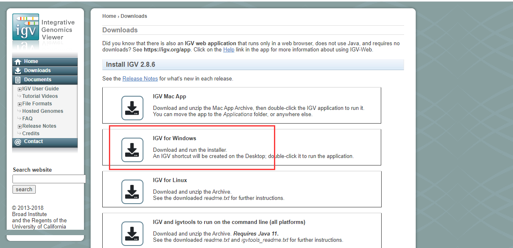{#fig-04-quality-control-and-alignment-027}


而后按照指示安装完成之后，我们来处理一下我们的bam文件，为导入到IGV里做准备

```
#如果还没对序列排序，记得先排序
samtools sort -@ 2 -o ERR188044_chrX.sorted.bam ERR188044_chrX.bam

#排好序之后，对bam文件建立index
samtools index -@ 2 ERR188044_chrX.sorted.bam ERR188044_chrX.sorted.bai

```

而后我们打开安装好的IGV，可以看到如下界面


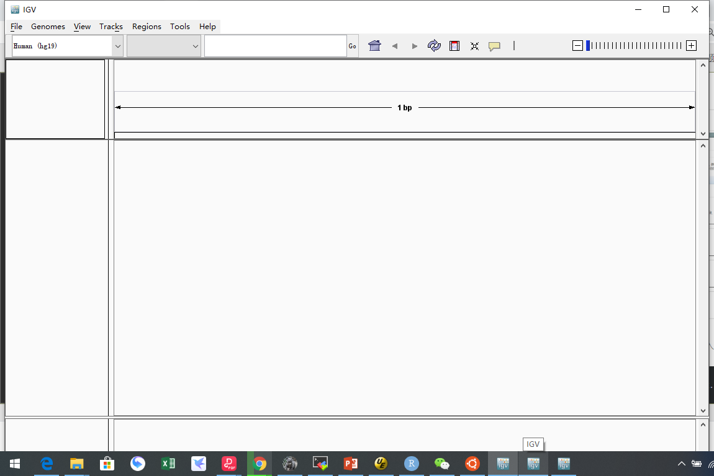{#fig-04-quality-control-and-alignment-028}


选择File--> Load from File--->加载想要查看的bam文件

导入成功后，可以选择染色体，由于我们的测序只测了chrX，故而选择chrX


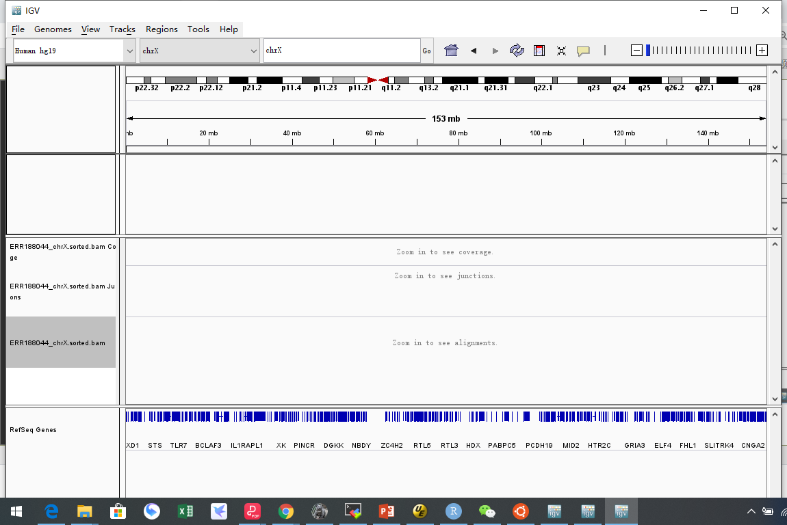{#fig-04-quality-control-and-alignment-029}


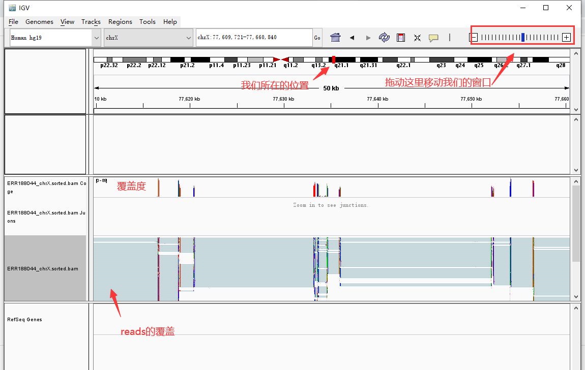{#fig-04-quality-control-and-alignment-030}


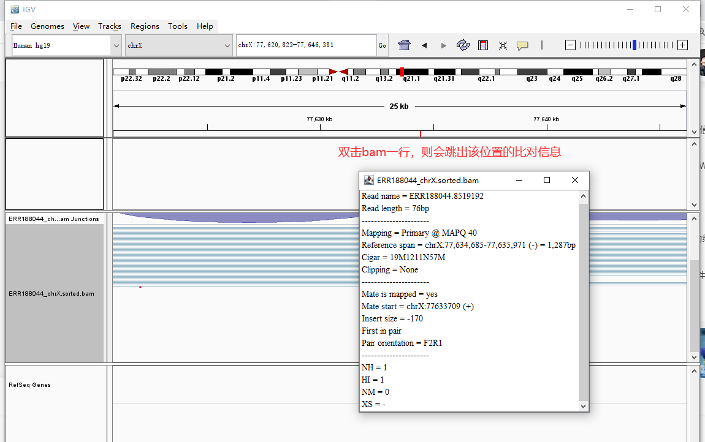{#fig-04-quality-control-and-alignment-031}


不断双击想查看的位置，即可放大该位置


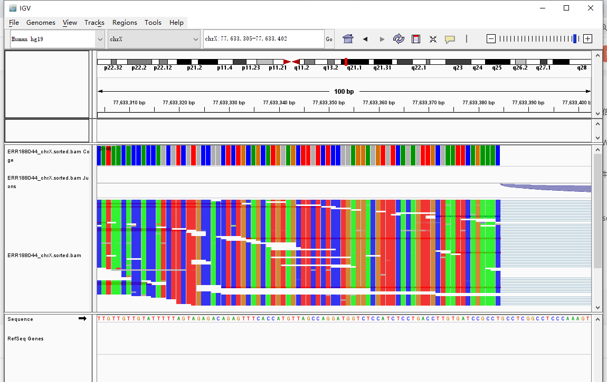{#fig-04-quality-control-and-alignment-032}


IGV工具是可视化bam文件的一个非常好的方法，好好利用可以事半功倍地帮助我们检查bam文件中的比对问题，更好地展示结果。

::: {.callout-note title="待完善" collapse="true"}
新增统一 QC 检查表；专题特异指标留到对应章展开。
:::
