# 测序结果的比对 {#sec-ch04}

## 本章提要 {#chapter-summary-04 .unnumbered}

本章从参考基因组、参考转录本和基因注释出发，理解序列为什么能够定位到参考资源，以及怎样选择合适的比对策略。我们会介绍双序列比对、mapping 和 BLAST 等概念，练习 SAM/BAM 的查看、转换、排序与过滤，再讨论测序深度、文库复杂度和 IGV 中的结果检查。最后从公共数据库获取数据，把参考资源与实际输入对应起来。学习的重点是理解文件、参数和处理结果之间的联系。

## 概览 {#sec-04-01}

本章先认识参考基因组与常用注释，再进入序列比对、结果操作与检查。把序列放到参考资源中理解，是连接原始测序结果与后续分析的重要一步。

## 参考基因组 {#sec-04-02}

选取相互兼容的参考资源并理解注释差异。

#### 构建参考基因组索引 {#src-0050-RNA-seq-210}

在上一步的分析中获取到的clean reads，需要将它们回帖到基因组上，在此之前，我们要建立一个基因组索引。对于有参考基因组的转录组分析，构建参考基因组索引是非常关键的一步。构建参考基因组这一步，在许多分析中，操作类似，比如之前章节介绍BWT算法时讲到的，以及后续ChIP-Seq，WGS分析中也会用到类似的操作。

RNA-Seq分析中参考基因组包括基因组DNA序列和基因组注释文件，可以从Ensemble、USCS等数据库获取。

（加一些网站图片）

##### 构建参考基因组索引的软件 {#src-0050-RNA-seq-241}

构建参考基因组索引的软件有：BWA（Fast and accurate short read alignment with Burrows-Wheeler transform. Heng Li and Richard Burbin），Bowtie（Ultrafast and memory-efficient alignment of short DNA sequences to the human genome），Bowtie2，HISAT，HISAT2。

此外，BLASR（Basic Local Alignment with Successive Refinement）主要用于将PacBio测序的reads和参考序列进行匹配，这是一个处理三代测序的软件。用sawriter命令建库、blasr进行序列比对。

::: {.callout-note title="待完善" collapse="true"}
修订格式与 ID 解释，增加参考版本不匹配的排错练习。
:::

## 参考转录本与基因注释 {#sec-04-03}

##### GTF与GFF 文件 {#src-0050-RNA-seq-218}

RNA-Seq中一个很重要的注释文件就是GTF文件或者是GFF文件。这个文件主要保存

其中基因组注释文件有两种格式，分别是GTF（General Transfer Format） 和GFF （ General Feature Format），那么这二者有何不同？其实GFF有若干个版本，GTF正是GFF文件的其中一个版本，一般认为GTF文件就是GFF 2.0版本的内容。

这两者只是一些格式细节上的不同，包含的信息内容上完全可以等价，也有很多工具可以提供两种格式的互相转换。

一个标准的GTF/GFF2.0文件需要包括9列内容（https://asia.ensembl.org/info/website/upload/gff.html）：

``` 
seqname    #序列名，一般为染色体名
source	   #来源，注释来源的软件名、数据库名等，没有则用“.”表示
feature    #特征类型，包括gene、mRNA、exon、CDS
start      #起始坐标位点
end        #终止坐标位点
score      #得分，该条注释信息可信度的打分，没有则用“.”表示
strand     #正负链，“+”表示正莲，“-”表示负莲
frame      #读码框，表示读码框的位置。当feature为CDS、start_codon、stop_codon时，frame值分别为0、1、2，0表示读码框在该位点进行读码，1表示读码框在该位点1个碱基后进行读码，2表示读码框在该位点2个碱基后进行读码。当feature为其他类型时，则用“.”表示。
attribute  #属性，包含众多属性。格式为“tag=value”，不同属性之间以分号相隔。

```

### 坐标的起点与区间边界


把一种文件里的区间拿到另一种工具中使用之前，要同时核对参考版本、染色体名称、坐标起点和右边界是否包含在区间内。SAM 文本中的 POS 从 1 开始计数；BED 通常使用从 0 开始、右端不包含的区间。相同的数字不一定表示同一段序列。

系统示例、转换练习和容易混淆的边界情况待完善。规范来源：[SAM/BAM 格式规范](https://samtools.github.io/hts-specs/SAMv1.pdf)。

### 知识问答 24：GTF/GFF 与基因注释 {#question-21-351}

#### 问题描述 {#question-21-353}


Hello大家好！我们又见面了！

在第23问的时候，我们开始学习了转录组相关的生物信息学。在转录组分析的过程中，往往需要基因注释文件，通常是GFF或者是GTF文件，那么这两个文件的内容是什么？有什么特点呢？这是我们今天要探索的问题。


#### 1. 我们为什么需要基因注释文件？ {#question-21-359}

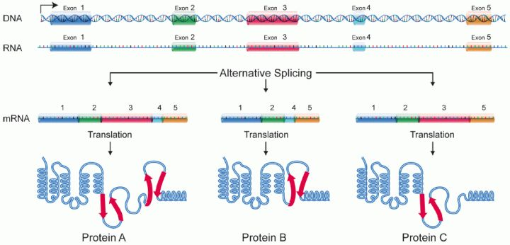{#fig-a-questions-21-25-008}  

 图1. 通过对外显子（exon）的可变剪切，同1个基因可以形成多种蛋白（https://en.wikipedia.org/wiki/Alternative_splicing）  

我们的gene在基因组上的结构不是连续的，而是exon-intron-exon（exon=外显子，intron=内含子）分隔开的。基因要表达，首先会先发生转录过程，转录出包含intron的pre-mRNA序列，然后再进行可变剪切，加5'帽子，3' PolyA尾巴等一系列复杂的加工过程才会形成成熟的mRNA。

在进行转录组序列比对，尤其是mRNA序列比对的时候，经常需要处理跨越两个exon之间的reads，所以在进行序列比对的时候往往需要对基因组有一个注释，告诉比对软件哪个位置是gene的exon，哪个地方是gene的intron，这个就是我们所说的基因注释信息。所以，它里面核心内容就是一大堆gene在基因组上的坐标，以及这个gene本身的一些属性。


#### 2. GTF与GFF都是基因注释文件 {#question-21-372}

GTF = General Transfer Format

GFF = General Feature Format

GFF有若干个版本，简单来说，GTF是GFF文件的其中一个版本，我们一般认为GTF文件就是GFF 2.0版本的内容。一个标准的GTF/GFF2.0文件需要包括9列内容，一个简单的示意图如下：  

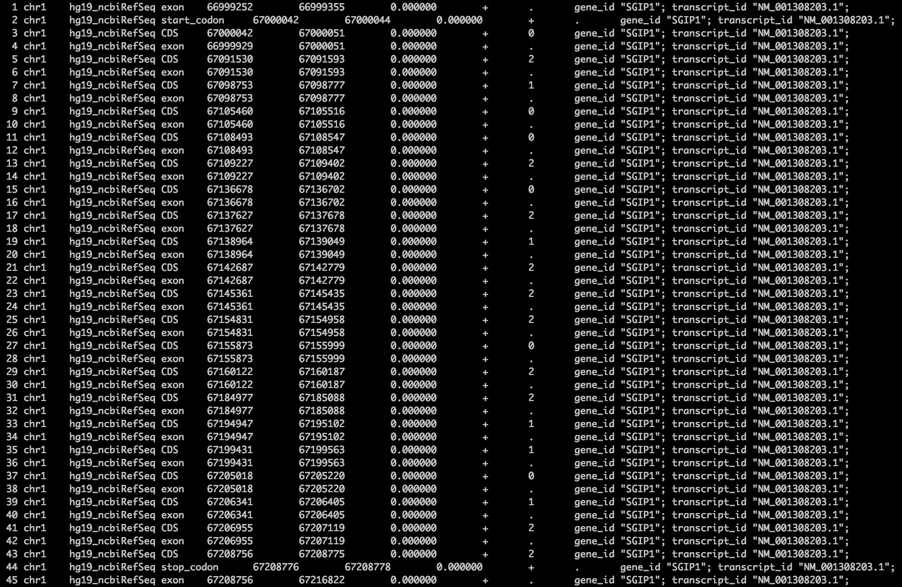{#fig-a-questions-21-25-009}  

 图2. 1个标准的GTF格式文件，文件不包括前面的行号 
 
```
# 所有的列必须用TAB分隔，总共有9列内容，第9列是补充列；
# 补充列的内容可以为空，但是前面8列必须有内容，如果想表达空的概念，则需要用"."；

# 第1列 seqname
染色体的名称，需要与genome FASTA文件中的染色体名对应，别一个用"chr1"一个用"Chr1"；

# 第2列 source
注释来自哪里，比如图2表示来自NCBI RefSeq数据库；

# 第3列 feature
此行的注释类型，一般有exon，CDS，stop_codon, start_codon等等；

# 第4，5列 start，end
此行注释的起始和终止位置，标准的GTF/GFF都是以1为染色体的起点（1-based system）;
注意！无论这个gene是正链还是负链，start的坐标都小于end坐标；

# 第6列 score
一般存放打分值，比如拼装的可信度之类。下载的官方注释文件一般为0.0

# 第7列 strand
正链基因标记为 "+", 负链基因标记为 "-";

# 第8列 frame
只可能是0,1,2这3个值,表示与CDS中codon的相对位置；
0表示，这个region的第1bp就是正好是codon 三连密码子的第1个碱基；
1表示，这个region的第2bp就是正好是codon 三连密码子的第1个碱基；
2表示，这个region的第3bp就是正好是codon 三连密码子的第1个碱基；

# 第9列 attribute
一般会记录 gene_id 与transcript_id;
这一列是可选列，可以增加很多内容。在程序处理过程中，相同的attribute会合并在一起处理。
比如，所有gene_id=SGIP1的行都会先汇总在一起，表示1个基因。
```  

#### 3.提出问题 {#question-21-421}


既然是这样，我们今天就思考2个小问题，1个比较偏理论，1个是比较具体。

1. 你认为GTF/GFF的文件格式设计合理吗？为什么？  

```
并不是非常合理，这种格式虽然包括了注释需要的全部信息，但是同一个基因不同的elements并不在  
一行，在mapping的时候需要用循环一行一行去判断该element是否还同属一个基因，比较耗费和内存，  
如果不选择GTF文件，而是选择下图所示的“all files from selected table”文件，这种文件的注释信息的组合方式与GTF不同，是以一个基因为一行，包括了这个基因中的各个elements，这样的注释方法使比对过程更加便捷。 
```
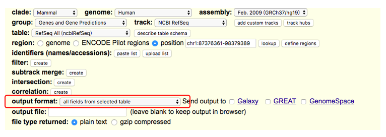{#fig-a-questions-21-25-010}  

 答1. 另一种注释文件


```
all files from selected table 文件内容示例：
#bin	name	chrom	strand	txStart	txEnd	cdsStart	cdsEnd	exonCount	exonStarts	exonEnds	score	name2	cdsStartStat	cdsEndStat	exonFrames
1251	NM_004261.4	chr1	-	87328127	87380048	87329156	87379794	5	87328127,87333735,87346344,87368963,87379710,	87329288,87333785,87346408,87369131,87380048,	0	SELENOF	cmpl	cmpl	0,1,0,0,0,
```

2. 如果告知，transcript_id 为NM001308203.1，gene_id 为SGIP1, 在转录本上的坐标为101，那么对应基因组的坐标是多少？请写出答案与简要程序思路。注释信息如下：

```
chr1	hg19_ncbiRefSeq	exon	66999252	66999355	0.000000	+	.	gene_id "SGIP1"; transcript_id "NM_001308203.1";
chr1	hg19_ncbiRefSeq	start_codon	67000042	67000044	0.000000	+	.	gene_id "SGIP1"; transcript_id "NM_001308203.1";
chr1	hg19_ncbiRefSeq	CDS	67000042	67000051	0.000000	+	0	gene_id "SGIP1"; transcript_id "NM_001308203.1";
chr1	hg19_ncbiRefSeq	exon	66999929	67000051	0.000000	+	.	gene_id "SGIP1"; transcript_id "NM_001308203.1";
chr1	hg19_ncbiRefSeq	CDS	67091530	67091593	0.000000	+	2	gene_id "SGIP1"; transcript_id "NM_001308203.1";
chr1	hg19_ncbiRefSeq	exon	67091530	67091593	0.000000	+	.	gene_id "SGIP1"; transcript_id "NM_001308203.1";
chr1	hg19_ncbiRefSeq	CDS	67098753	67098777	0.000000	+	1	gene_id "SGIP1"; transcript_id "NM_001308203.1";
chr1	hg19_ncbiRefSeq	exon	67098753	67098777	0.000000	+	.	gene_id "SGIP1"; transcript_id "NM_001308203.1";
chr1	hg19_ncbiRefSeq	CDS	67105460	67105516	0.000000	+	0	gene_id "SGIP1"; transcript_id "NM_001308203.1";
chr1	hg19_ncbiRefSeq	exon	67105460	67105516	0.000000	+	.	gene_id "SGIP1"; transcript_id "NM_001308203.1";
chr1	hg19_ncbiRefSeq	CDS	67108493	67108547	0.000000	+	0	gene_id "SGIP1"; transcript_id "NM_001308203.1";
chr1	hg19_ncbiRefSeq	exon	67108493	67108547	0.000000	+	.	gene_id "SGIP1"; transcript_id "NM_001308203.1";
chr1	hg19_ncbiRefSeq	CDS	67109227	67109402	0.000000	+	2	gene_id "SGIP1"; transcript_id "NM_001308203.1";
chr1	hg19_ncbiRefSeq	exon	67109227	67109402	0.000000	+	.	gene_id "SGIP1"; transcript_id "NM_001308203.1";
chr1	hg19_ncbiRefSeq	CDS	67136678	67136702	0.000000	+	0	gene_id "SGIP1"; transcript_id "NM_001308203.1";
chr1	hg19_ncbiRefSeq	exon	67136678	67136702	0.000000	+	.	gene_id "SGIP1"; transcript_id "NM_001308203.1";
chr1	hg19_ncbiRefSeq	CDS	67137627	67137678	0.000000	+	2	gene_id "SGIP1"; transcript_id "NM_001308203.1";
chr1	hg19_ncbiRefSeq	exon	67137627	67137678	0.000000	+	.	gene_id "SGIP1"; transcript_id "NM_001308203.1";
chr1	hg19_ncbiRefSeq	CDS	67138964	67139049	0.000000	+	1	gene_id "SGIP1"; transcript_id "NM_001308203.1";
chr1	hg19_ncbiRefSeq	exon	67138964	67139049	0.000000	+	.	gene_id "SGIP1"; transcript_id "NM_001308203.1";
chr1	hg19_ncbiRefSeq	CDS	67142687	67142779	0.000000	+	2	gene_id "SGIP1"; transcript_id "NM_001308203.1";
chr1	hg19_ncbiRefSeq	exon	67142687	67142779	0.000000	+	.	gene_id "SGIP1"; transcript_id "NM_001308203.1";
chr1	hg19_ncbiRefSeq	CDS	67145361	67145435	0.000000	+	2	gene_id "SGIP1"; transcript_id "NM_001308203.1";
chr1	hg19_ncbiRefSeq	exon	67145361	67145435	0.000000	+	.	gene_id "SGIP1"; transcript_id "NM_001308203.1";
chr1	hg19_ncbiRefSeq	CDS	67154831	67154958	0.000000	+	2	gene_id "SGIP1"; transcript_id "NM_001308203.1";
chr1	hg19_ncbiRefSeq	exon	67154831	67154958	0.000000	+	.	gene_id "SGIP1"; transcript_id "NM_001308203.1";
chr1	hg19_ncbiRefSeq	CDS	67155873	67155999	0.000000	+	0	gene_id "SGIP1"; transcript_id "NM_001308203.1";
chr1	hg19_ncbiRefSeq	exon	67155873	67155999	0.000000	+	.	gene_id "SGIP1"; transcript_id "NM_001308203.1";
chr1	hg19_ncbiRefSeq	CDS	67160122	67160187	0.000000	+	2	gene_id "SGIP1"; transcript_id "NM_001308203.1";
chr1	hg19_ncbiRefSeq	exon	67160122	67160187	0.000000	+	.	gene_id "SGIP1"; transcript_id "NM_001308203.1";
chr1	hg19_ncbiRefSeq	CDS	67184977	67185088	0.000000	+	2	gene_id "SGIP1"; transcript_id "NM_001308203.1";
chr1	hg19_ncbiRefSeq	exon	67184977	67185088	0.000000	+	.	gene_id "SGIP1"; transcript_id "NM_001308203.1";
chr1	hg19_ncbiRefSeq	CDS	67194947	67195102	0.000000	+	1	gene_id "SGIP1"; transcript_id "NM_001308203.1";
chr1	hg19_ncbiRefSeq	exon	67194947	67195102	0.000000	+	.	gene_id "SGIP1"; transcript_id "NM_001308203.1";
chr1	hg19_ncbiRefSeq	CDS	67199431	67199563	0.000000	+	1	gene_id "SGIP1"; transcript_id "NM_001308203.1";
chr1	hg19_ncbiRefSeq	exon	67199431	67199563	0.000000	+	.	gene_id "SGIP1"; transcript_id "NM_001308203.1";
chr1	hg19_ncbiRefSeq	CDS	67205018	67205220	0.000000	+	0	gene_id "SGIP1"; transcript_id "NM_001308203.1";
chr1	hg19_ncbiRefSeq	exon	67205018	67205220	0.000000	+	.	gene_id "SGIP1"; transcript_id "NM_001308203.1";
chr1	hg19_ncbiRefSeq	CDS	67206341	67206405	0.000000	+	1	gene_id "SGIP1"; transcript_id "NM_001308203.1";
chr1	hg19_ncbiRefSeq	exon	67206341	67206405	0.000000	+	.	gene_id "SGIP1"; transcript_id "NM_001308203.1";
chr1	hg19_ncbiRefSeq	CDS	67206955	67207119	0.000000	+	2	gene_id "SGIP1"; transcript_id "NM_001308203.1";
chr1	hg19_ncbiRefSeq	exon	67206955	67207119	0.000000	+	.	gene_id "SGIP1"; transcript_id "NM_001308203.1";
chr1	hg19_ncbiRefSeq	CDS	67208756	67208775	0.000000	+	2	gene_id "SGIP1"; transcript_id "NM_001308203.1";
chr1	hg19_ncbiRefSeq	stop_codon	67208776	67208778	0.000000	+	.	gene_id "SGIP1"; transcript_id "NM_001308203.1";
chr1	hg19_ncbiRefSeq	exon	67208756	67216822	0.000000
```
***


```
判断的思路是根据注释信息计算chr1上的exon的分布与长度，转录本上的坐标值代表了该片段之前的exon长度，那么以该题为例，chr1上该基因第一个Exon的长度是 6699355-66999252+1=104， 转录本坐标是101，说明该片段就是map到这个exon上的，坐标是6699355+101-1=6699455 

```

### 知识问答 25：参考转录本与注释资源 {#question-21-506}

#### 问题描述 {#question-21-508}


Hello everyone! 我们又见面了！

我们昨天刚刚回答了GTF/GFF文件到底是什么的问题，那么我们今天尝试回答GTF/GFF文件是怎么来的，从哪里能够下载。

根据BBQ24问的介绍，我们知道了GTF是GFF的2.0版本。（以后我们把这两者到简称为GTF文件好了！）主要记录的内容是基因组上基因的结构，包括哪里是exon，哪里是intron，哪里是CDS，哪里是start codon，哪里是stop codon.  在提问的环节，我们也设置了问题让大家去吐槽GTF文件糟糕的的文件结构（希望大家能吐得开心！）。今天我们来为大家介绍GTF文件是怎么来的。

**1. 什么是参考GTF/GFF文件**  

针对一些已经通过测序计划，拼装好基因组序列信息的物种，一般会同时提供其转录组的注释信息，也就是我们所说的GTF/GFF文件。常用的模式生物，比如human（人），mouse（小鼠），rat（大鼠），chicken（鸡），lizard（蜥蜴），Arabidopsis thaliana（拟南芥）等等都已经有非常好的 全基因组参考序列（FASTA文件），以及转录组注释信息（GTF或GFF文件）。因此，直接到能够提供下载地址的网站上下载就好了。图1给大家展示了已经公布参考基因组哺乳动物的系统发生树，大家可以看看人类和哪种动物演化距离最近。

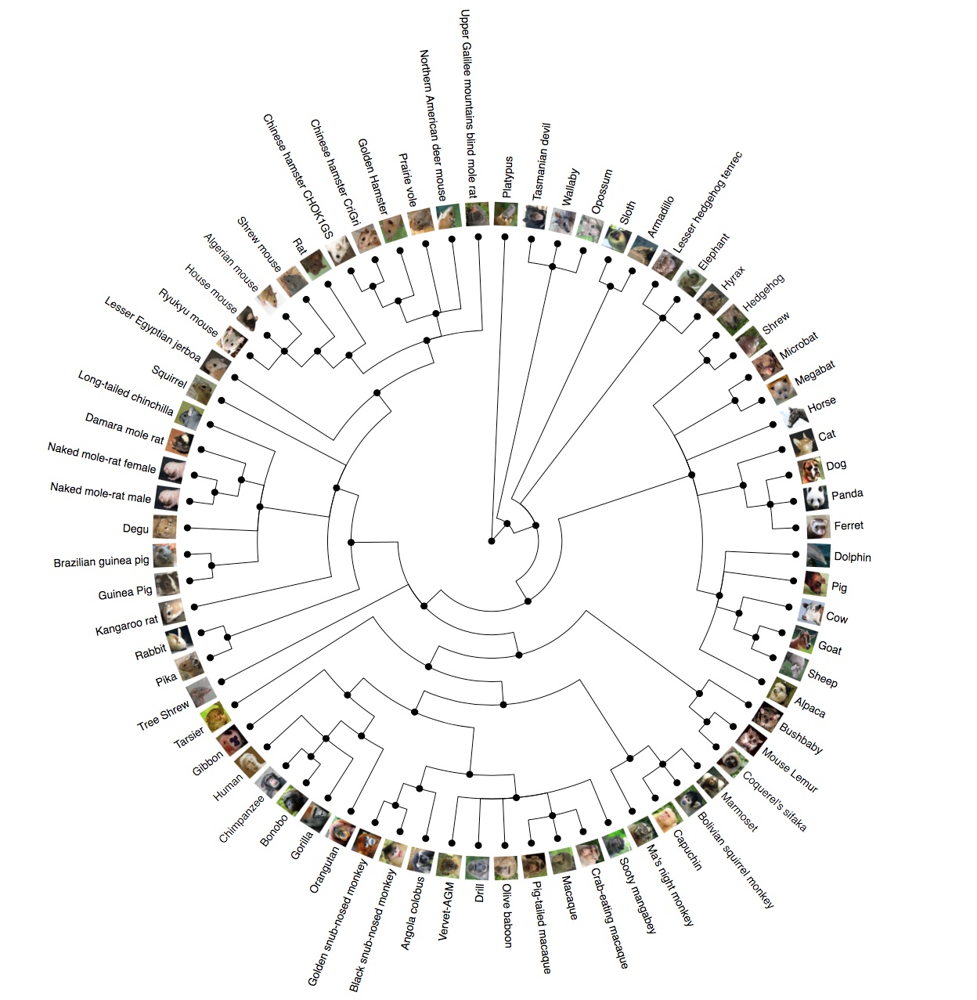{#fig-a-questions-21-25-011}  

 图1 已经公布参考基因组的哺乳动物系统发生树（http://asia.ensembl.org/info/about/speciestree.html）     

多说一句，这个下载下来的FASTA文件就是我们所谓的参考基因组，需要用这个文件去构建mapping的index；下载下来的GTF文件是转录组注释信息，一般在计算表达量的时候需要提供。


#### 2.什么是拼装转录本 {#question-21-530}

在进行转录组分析的过程中，我们经常会听到一句话叫“用XX软件拼装转录本”，这句话是什么意思呢？不都有参考转录组了，还要拼个啥转录组？

**第1个方面**，对于无参考基因组，无参考转录组的物种来说，往往需要通过RNA-Seq的数据自己拼出参考转录组，然后再进行下游的数据分析。所以，对于无参分析来说，往往需要自己拼装转录本，生成自己的参考转录组信息，也包括注释信息（GTF文件）。

**第2个方面**，对于有非常好注释的基因组，例如human来说。不同的细胞条件可能不同，一些永生化的细胞系往往都具有“癌症”的特征，这些细胞的转录组，基因组或多或少都有结构的变异，以及转录本的差异。

举个例子，有一个geneA，在参考转录组中注释的是从chr1:1000~15000进行转录，但是在另外的细胞系中有可能就是从chr1:980~15050进行转录。这种转录起始和终点的不同是很常见的现象。因此，有时候为了比较严谨地进行下游序列分析，是需要根据已知的参考转录组以及测序数据对其进行一个修饰。常用的软件是cufflinks，stringtie等等。

不过，对于有参考转录组的物种，一般情况下，我还是建议不要去自己拼转录本，也不要去做什么所谓的修正，意义不大。除非你研究的体系非常特殊。

#### 3. 从哪里下载参考转录组GTF/GFF文件呢？ {#question-21-540}


关于下载GTF/GFF文件的内容，给大家介绍2个最常用的网站：

1个是UCSC genome browser （UCSC Genome Browser-网址链接）
1个是Ensembl（Ensembl 网址链接）
注意：对于植物的Ensembl网站（Ensembl Plants）

**3.1 从UCSC genome browser下载human的GTF文件**

```
1. 打开UCSC genome browser网站 （图3.1-1）
2. 在Tools里选择 Table Browser(图3.1-2）
3. 打开Table Browser以后，设置相关的需要内容（图3.1-3）
4. 点击get output即可下载

# hg19 = human genome 19是常用的human参考基因组版本号；
# RefSeq gene是全部经过人工检查过的gene注释文件；
```
{#fig-a-questions-21-25-012}  

 图3.1-1 打开UCSC genome browser网站  
  
 
***
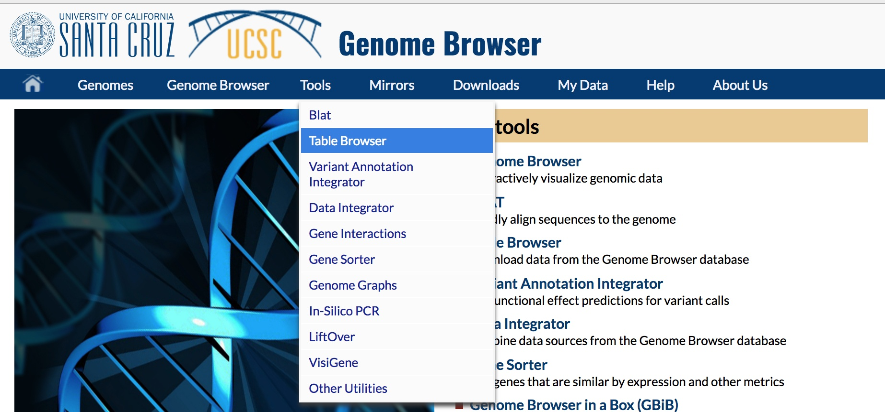{#fig-a-questions-21-25-013}  

 图3.1-2 在Tools里选择 Table Browser
  
  
***
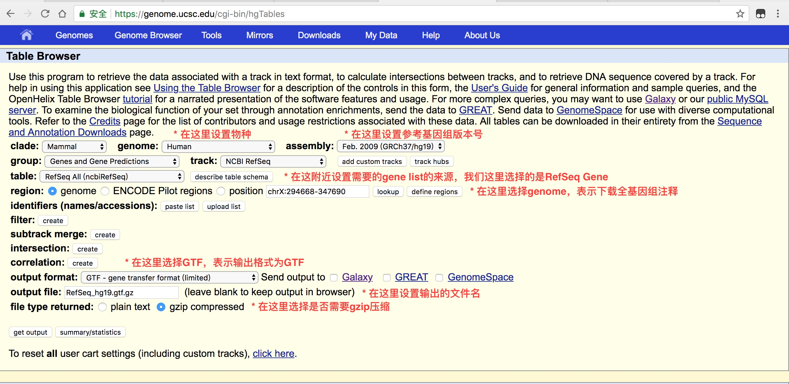{#fig-a-questions-21-25-014}  

 图3.1-3 打开Table Browser以后，设置相关的需要内容  

**3.2 Ensembl下载human的GTF文件**  
在下载之前我必须跟大家提个醒。

```
* 对于动物相关的信息都请访问Ensembl的动物站：http://www.ensembl.org/index.html
* 对于植物相关的信息都请访问Ensembl的植物站：http://plants.ensembl.org/index.html
```

我们在这里还是以下载human hg19版本的GTF文件为例，操作步骤如下：  

```
1. 登陆Ensembl网站，并跳转到hg19版本界面 （图3.2-1）
2. 继续选择跳转到hg19版本界面（图3.2-2）
3. 在hg19版本的Ensembl界面中选择download（图3.2-3）
4. 在download页面中选择Download a sequence or region （图3.2-4）
5. 在左边栏选择 FTP download 然后选择下载 GTF文件（图3.2-5）
6. 选择注释好的GTF进行下载（图3.2-6）  
```  

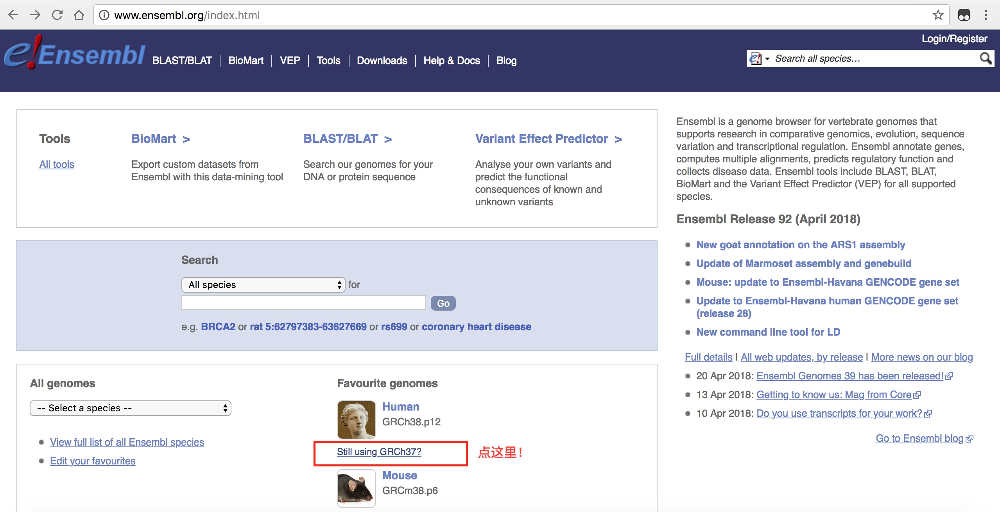{#fig-a-questions-21-25-015}  

 图3.2-1 登陆Ensembl网站，并跳转到hg19版本界面
  
***
 

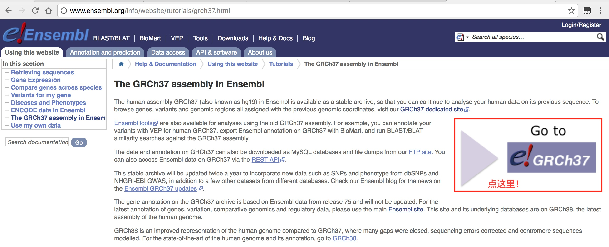{#fig-a-questions-21-25-016}  

 图3.2-2 继续选择跳转到hg19版本界面

***
{#fig-a-questions-21-25-017}  

 图3.2-3 在hg19版本的Ensembl界面中选择download  


***

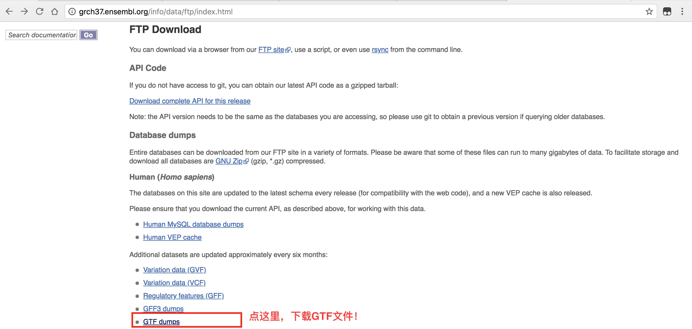{#fig-a-questions-21-25-018}  

 图3.2-5 在左边栏选择 FTP download 然后选择下载 GTF文件  


***
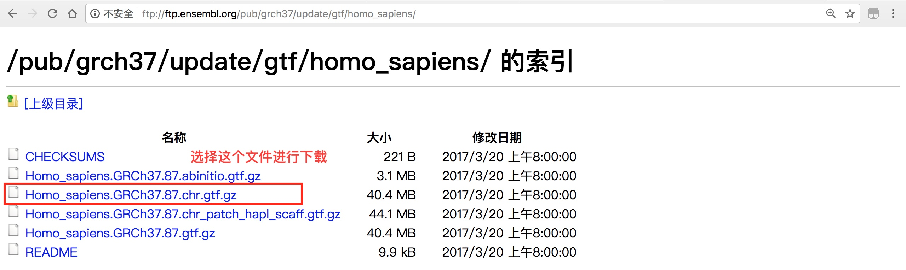{#fig-a-questions-21-25-019}  

 图3.2-6 选择注释好的GTF进行下载   


#### 4. 提问环节 {#question-21-655}

**1. 请按照文中教程分别从UCSC Genome Browser，以及Ensembl网站上下载hg19的转录组注释的GTF格式文件。**    

下载的文件及压缩文件大小如下：

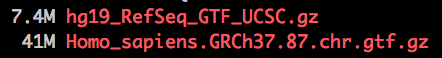{#fig-a-questions-21-25-020} 

**2. 下载这两个文件解压缩以后的大小是否有差异，差异大不大？**  

```
两个网站下载的GTF文件大小差异较大，解压之后hg19_RefSeq_GTF_UCSC文件126M，Homo_sapiens.GRCh37.87.chr.gtf文件大小是1.2G。
```
 


**3. 解压并使用Linux less命令打开这两个文件，观察这两个文件的transcript_id以及gene_id是否相同，再找找看有哪些其他地方的不同。** 

```
两个文件的transcript_id以及gene_id均不相同，Ensembl网站下载的gtf文件transcript_id以及  
gene_id均以ENSG和ENSG开头，全称是Ensembl Transcript ID和Ensembl Gene ID，而UCSC网站  
下载的gtf文件transcript_id以及gene_id均以NM开头,在NCBI数据库中代表mRNA；除此之外，UCSC  
的注释信息非常简练，而Ensemble网站中的gtf文件注释信息相比于UCSC更加全面，但也存在冗余，NCBI  
数据库中的基因注释被验证的比例更大，所以在比对策略上可以选择先使用UCSC的GTF文件筛选目标基因，  
再利用Ensemble数据库的GTF文件找到更加详细的注释。
```

```
Ensembl gtf文件：
1       havana  exon    12613   12721   .       +       .       gene_id "ENSG00000223972"; gene_version "4"; transcript_id "ENST00000456328"; transcript_version "2"; exon_number "2"; gene_name "DDX11L1"; gene_source "ensembl_havana"; gene_biotype "pseudogene"; transcript_name "DDX11L1-002"; transcript_source "havana"; transcript_biotype "processed_transcript"; havana_transcript "OTTHUMT00000362751"; havana_transcript_version "1"; exon_id "ENSE00003582793"; exon_version "1"; tag "basic";
```
```
UCSC gtf文件：
chr1    hg19_ncbiRefSeq exon    66999929        67000051        0.000000        +       .       gene_id "NM_001308203.1"; transcript_id "NM_001308203.1";
```

## 序列比对算法 {#sec-04-04}

理解速度、灵敏度与唯一定位之间的权衡。

### 测序数据的比对及文件操作 {#src-0040-mapping-and-BAM-operation-8}

[]{#mapping_and_BAM}


### 常用比对方法概述 {#src-0040-mapping-and-BAM-operation-10}


#### 从双序列比对说起 {#src-0040-mapping-and-BAM-operation-12}

双序列比对是一切比对问题的基础。所谓的序列比对就是找到两条序列最佳的匹配方式。

**比对**其实应该对应的单词是alignment，但往往特指低通量的序列之间的比较。比如10条序列，进行多序列比对就是我们常说的 multiple alignment问题；如果是2条序列的比对，我们经常称其为pairwise alignment.

**回贴**通常对应的单词应该是mapping，一般指高通量的数据去寻找基因组的位置。比如我们进行测序以后，有10M对read pair，要去寻找他们在基因组上的位置，这个时候就是一个典型的mapping问题。

alignment与mapping其实是密切相关的概念，所有的mapping软件其实都是从低通量的办法逐步改进而得到的。

其实双序列比对（pairwise alignment）的相关算法，主要是Needleman-Wunsch算法（全局比对）和Smith-Waterman算法（局部比对）。

#### 使用BLAST对单条序列进行搜索 {#src-0040-mapping-and-BAM-operation-24}

当我们在鉴定一些未知名物种的时候，常规的分子生物学操作通常是：提取物种DNA，而后使用通用引物进行pcr扩增，送去公司进行sanger测序，序列结果返回后，通过NCBI进行检索，从而获取分子层面的物种鉴定。

在检索的过程中，我们选择的通常是一整个数据库进行比对，面对上亿的序列信息，如何在极短的时间内完成整个检索并反馈给用户，采用1对1的比对显然是不现实的，故而NCBI采用了一种启发式的序列检索工具Basic Local Alignment Search Tools，简称BLAST。

BLAST的基本原理就是先对数据库所有序列建立index，在输入序列后，对序列分割成若干段，而后通过快速检索与打分，最后反馈给用户。

### 高通量测序数据的比对算法简介 {#src-0040-mapping-and-BAM-operation-31}

说回到我们手上的高通量数据，类比blast查询，fq文件就是我们要检索的序列，reference genome就是我们手上存在的数据库，我们要做的事情就是把fq里面的序列全部在reference genome上找一下位置。与blast不同的是这回我们面对的是成千上万条序列的检索，而对应的数据库则小了很多，而且检索序列相对于传统的sanger测序序列其实短了很多，根据这些特性不同，软件设计者们设计了各式各样的软件，但按照所使用的核心算法不同，大致可以拆分成两大阵营：hash-table algorithm以及 BWT algorithm


{#fig-04-quality-control-and-alignment-001}


#### 基于哈希表（hash-table）数据结构的比对算法 {#src-0040-mapping-and-BAM-operation-36}

哈希表是通过把关键码值（key value） 映射到表中的具体位置来进行访问，从而加快数据的查询速度。其核心思想就是采用种子序列定位及延伸算法（seed-and-extend algorithm）。

根据索引构建对象的不同，可以将软件分为两类：基于参考基因组索引的延伸比对软件与基于短序列数据集索引的延伸比对软件。

基于参考基因组索引构建哈希表数据结构的软件代表有PASS跟GASSST，其工作原理就是通过查询短序列在参考基因组的可能检索位点来定位序列可能存在的位置；基于短序列数据集构建索引的则刚好与之相反，此种索引构建方法为大部分哈希表比对软件所采用，代表软件诸如SOAP,SeqMap等等。

而根据哈希表所采用的比对策略不同，又可以分为连续种子序列（contiguous seed）策略与间隔种子（spaced seed）策略。
在了解这两种不同的比对策略之前，让我们先来实际看看哈希表是大概怎么构建的。

##### 哈希表的构建 {#src-0040-mapping-and-BAM-operation-46}

了解哈希表之前，我们需要补充一个概念k-mer：所谓k-mer，就是将一段序列拆分成包含k个碱基的迭代子序列，即从一条母序列中迭代的选取长度为K个碱基的序列，若母序列的长度为L，k-mer长度为K，那么就可以得到L-K+1个k-mer。

DNA序列是由A,T,C,G四种碱基排序而成，我们可以按四进制给序列进行计数，而后转换为十进制作为哈希表的关键码值生成函数H（x）。


{#fig-04-quality-control-and-alignment-002}


举个例子，如果某个子序列为ATGCT，其中我们设定A->0, T->1, C->2, G->3,则H（x） = 1 x 4^0 + 2 x 4^1 + 3 x 4^2 + 4 x 4^3 + 0 x 4^4 = 121,这样我们就得到了5-mer序列在哈希表中的关键码值。将上面的方法进一步推广，即可得到在x长度为n的序列，H(X) = I(n) x 4^n + I(n-1) x 4^(n-1) + ... + I(1) X 4^0。
  
在得到一个哈希表之后，我们就相当于知道了所有seed序列的位置，在检索输入序列后，即可快速进行比对反馈，而后进行延伸就得到了序列所在位置。


{#fig-04-quality-control-and-alignment-003}


##### 连续种子序列策略 {#src-0040-mapping-and-BAM-operation-59}

连续种子序列策略是将短序列拆分成k-mer长的子序列，而后查看由基因组k-mer的子序列所构建的哈希表数据结构进行匹配，从而完成整个回溯过程。
  
  这种算法的缺点是显而易见的，即不允许mismatch的存在，如果序列中出现了至少一个位点的突变，则该位点就会被过滤掉。为了弥补这种缺陷，软件设计者们采用了鸽洞原理（pigeonhole principle）对算法进行了修正：首先，将短序列分割成等会参观的多段迭代子序列，进行定位时，如果完成match上，则证明序列定位成功，如果存在mismatch，只要不超过设定的某个mismatch数目，则将该序列设定为候选序列，在所有候选序列汇总后选出最少的mismatch作为回溯序列。而后又陆续推出了一系列的修正算法，如q-gram过滤算法，但由于本书重点不在算法解释，仅作简单介绍，有兴趣的读者可以自行查阅相关文献。
  


{#fig-04-quality-control-and-alignment-004}


##### 间隔种子序列策略 {#src-0040-mapping-and-BAM-operation-66}

所谓的间隔种子序列策略，就是种子序列中间允许存在若干个不确定的碱基，即在比对过程种允许mismatch的存在。举个例子，间隔种子序列AGxCGTAA，既可以跟AGGCGTAA匹配，也可以跟AGCCGTAA匹配。这样做的优势就是明显增加了比对算法的灵敏度，但反过来，比对所消耗的时间复杂度明显增加。

#### BWT算法介绍 {#src-0040-mapping-and-BAM-operation-69}

无论采用的是连续种子策略还是间隔种子策略，两者都存在共同的问题，即面对高重复序列的真核生物基因组时，比对效果会比较差，究其原因就是因为k-mer分割所导致的。为了解决这个问题，软件设计者们另辟蹊径，引入了后缀树作为比对算法，但由于后缀树会保留所有字符串的后缀，故而带来内存消耗，时间复杂度以及空间复杂度激增，从而导致了这一类的软件始终不适合大面积的推广。与后缀树对应的是前缀树，因为可以减少很多重复字符串的比较，查询效率会非常高，虽然内存消耗会非常大，但成功的解决了空间复杂度的问题。在现在内存价格持续走低的时代，大内存从来就不是阻碍条件。而我们所提及的BWT算法，本质就是一种前缀树的实现。

所谓BWT (Burrows–Wheeler_transform)数据转换算法，原本是用于文本存储的一种压缩算法，其大致原理是将原来的文本转换为一个相似的文本，转换后使得相同的字符位置连续或者相邻，再通过其他手段对文本进行压缩。
构建BWT的步骤大致如下：

(1)给定一个子序列，譬如：ACAACG，给其后面加入一个后缀$,而后迭代排序。


{#fig-04-quality-control-and-alignment-005}


(2)按照ASCII码进行大小排序，得到转置矩阵。


{#fig-04-quality-control-and-alignment-006}


(3)取每个串的最后一个字符串，连成一个序列，即得到BWT='GC$AAC'。

构建完一个BWT之后，在回溯过程其实就是一个解码过程，具体解码步骤如下：

(1)L列的第一个元素为原始序列的最后一个元素（因为$在该位置后面）。
(2)F列中的每一个元素，都是其同一行中的L列的下一个元素。也就是L列是F列的前一个元素。


{#fig-04-quality-control-and-alignment-007}


{#fig-04-quality-control-and-alignment-008}


{#fig-04-quality-control-and-alignment-009}


{#fig-04-quality-control-and-alignment-010}


::: {.callout-note title="待完善" collapse="true"}
纠正现有数值例题及概念混用；长推导作为本节扩展阅读。
:::

### 知识问答 13：双序列比对 {#question-11-158}

#### 问题描述 {#question-11-160}

Hello 大家好！

经过我们之前的12个问题，我们对Illumina 测序的原理，测序的储存模式，测序数据的质控已经有了一个比较清楚的认识。那么我们今天就开始用接下来的若干次提问来学习与比对有关的知识。

比对其实应该对应的单词是alignment，但往往特指低通量的序列之间的比较。比如10条序列，进行多序列比对就是我们常说的 multiple alignment问题；如果是2条序列的比对，我们经常称其为pairwise alignment.

回贴通常对应的单词应该是mapping，一般指高通量的数据去寻找基因组的位置。比如我们进行测序以后，有10M对read pair，要去寻找他们在基因组上的位置，这个时候就是一个典型的mapping问题。

alignment与mapping其实是密切相关的概念，所有的mapping软件其实都是从低通量的办法逐步改进而得到的。

今天我们的问题是，请各位学习一下北京大学高歌老师的《生物信息学：导论与方法》中的双序列比对（pairwise alignment）的相关算法。主要是Needleman-Wunsch算法（全局比对）和Smith-Waterman算法（局部比对）相关的内容，然后回答下面的问题。


每个视频长度都不长，希望大家认真看完！今天的内容是以后的基础，如果学不好，以后的高楼盖得再高，也有轰然倒塌的那一天！

课程视频的链接如下：

1. 生物信息学：导论与方法(北京大学)-序列比对中的基本概念  
https://link.zhihu.com/?target=https%3A//www.bilibili.com/video/av10042290/%3Fp%3D5

2. 生物信息学：导论与方法(北京大学)-利用动态规划进行全局序列比对  
https://link.zhihu.com/?target=https%3A//www.bilibili.com/video/av10042290/%3Fp%3D6

3. 生物信息学：导论与方法(北京大学)-从全局比对到局部比对  
https://link.zhihu.com/?target=https%3A//www.bilibili.com/video/av10042290/%3Fp%3D7


今天的问题：

如果我们假设比对的 scoring matrix 如下图1所示，同时gap的罚分d = -5

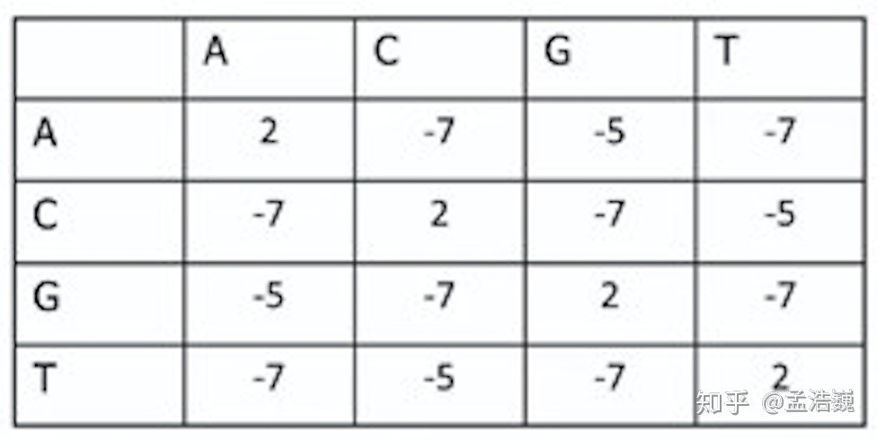{#fig-a-questions-11-15-005}
 
假设我们的 seq1 = AAGT，seq2=AGCT；那么我们进行双序列比对，需要填写下面的表格。
 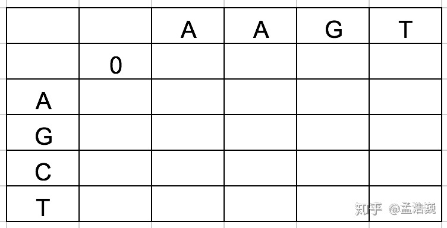{#fig-a-questions-11-15-006}
 
**1. 使用Needleman-Wunsch算法（全局比对），那么表1应该怎么填写？最终的比对结果是什么？**  


计算过程如下：
 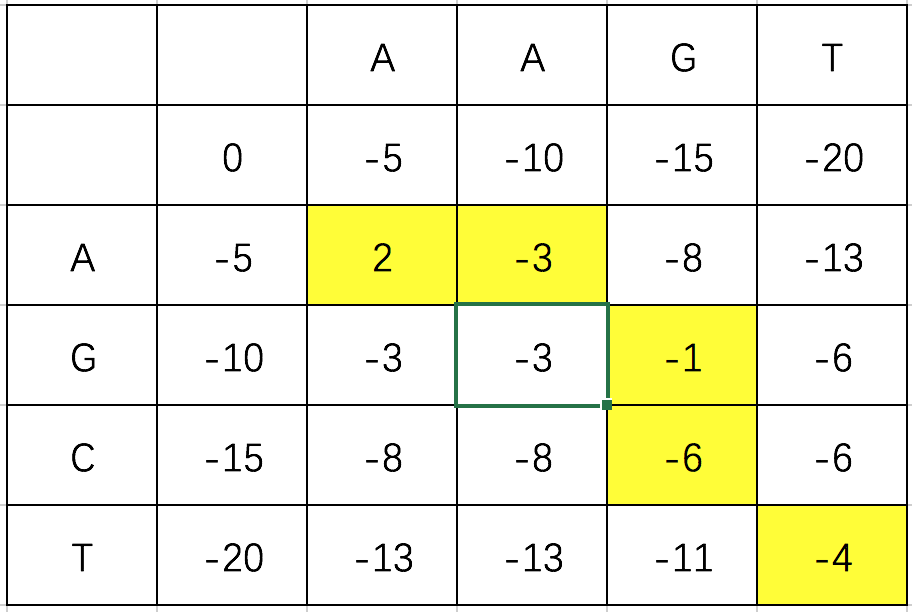{#fig-a-questions-11-15-007}
最终的比对结果为
 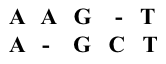{#fig-a-questions-11-15-008}

**2. 使用Smith-Waterman算法（局部比对），那么表1应该怎么填写？最终的比对结果是什么？**  


计算过程如下：
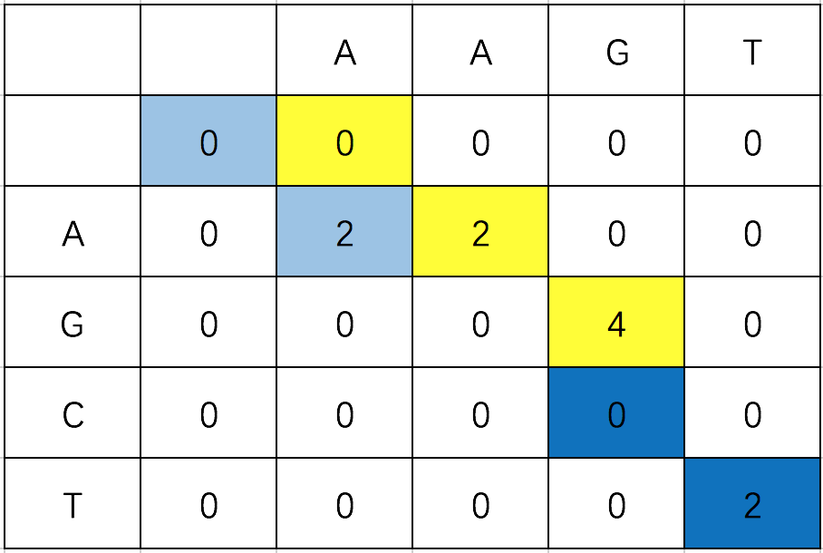{#fig-a-questions-11-15-009}

```
注意：在进行局部比对回溯的时候，需要从第1个非零的碱基开始，沿对角线方向到第1个遇到0的结果为止。因此本题中，局部比对的结果有3个：

第1个结果是（浅蓝色）：
A
A

第2个结果是（黄色）：
A	A	G
A	-	G

第3个结果是（深蓝色）：
T
T
```

**3. 请思考，为什么有的时候需要全局比对，有的时候需要局部比对？**  

```
全局比对，是从头到尾对序列的每一个碱基都进行比对，找到最优解；
局部比对，是为了找到两条序列中最相似的部分，可以有多个结果；

全局比对能找到2条序列比对的最优解，用处很大自不必说，单独说说局部比对的相关意义与必要性。

随着越来越多的序列信息的产生，人们发现对于：
1.某些蛋白序列虽然整体相差很大，但是对于某些特殊的功能域却有着极高的相似性；
2.而且在不同物种中序列和功能都相当保守，这在全局比对中是很难发现的；
3.另一方面随着70年代内含子的发现比对算法必须要能够处理由于内含子导致的大片段的差异。
```

### 知识问答 14：BLAST 序列搜索 {#question-11-253}

#### 问题描述 {#question-11-255}

Hello,大家好！ 

从第13问开始，我们开启了序列比对之旅。

之前的第13题本质上是为了让大家学习双序列比对（pairwise alignment），接下来，我们不会去讲多序列比对（multiple alignment）的算法问题，因为多序列比对的不同算法各种各样，但很多时候的思路都是把多序列比对，分解成若干个双序列比对的问题，然后再进行最后的结果整合。所以，我们把pairwise alignment的原理与算法搞定了，就已经很OK了~ 

今天我们带大家思考1个问题，就是为什么要开发BLAST算法？

我们在第13问中学习到的是pairwise alignment的两种算法，全局比对算法与局部比对算法，无论哪种算法，得到的都是2条序列比对的最优解，当然某些时候最优解有可能有多个。那所有的序列比对问题是不是都可以用这种算法来解决了呢？ 我们来算这么1笔账。

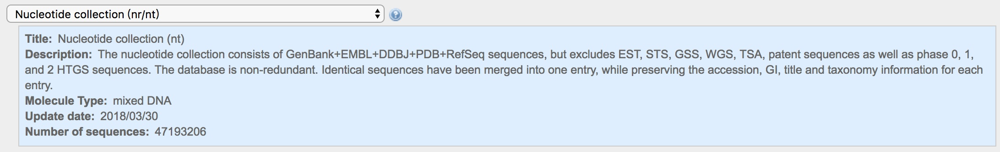{#fig-a-questions-11-15-010}
假设我有1条序列 SeqA = 100bp（这个不是很长哟~），我想找到这条序列的相似序列。目前已知的非冗余核酸序列库，序列有47193206条，按平均长度在0.1Mbp左右。如果我们想要找到SeqA的相似序列，使用局部比对算法，那么至少就需要100bp × 0.1Mbp  × 47193206条 次比较运算等于471930 × 10^9，现在服务器最快的CPU，单核心1秒可以大约运行3×10^9次，假设我们的服务器有20个核心，那么 —— 

完成任务大约需要的时间 = 471930 × 10^9 ÷ 3 × 10^9 ÷ 20 = 7860秒 大约是130分钟；

如果我们的SeqA = 1000bp（这个也不是很长哟~ ）那么时间就变成了1300分钟；

我们就为了找个相似性，就要花2个小时？这个肯定不划算吧？ 所以，有了这个需求以后，一帮大佬就搞出个优化算法叫BLAST（Basic Local Alignment Search Tool）把上面这个任务的运行时间缩短到了1分钟以内。


我们今天的问题，也是请大家去观看北京大学-生物信息学导论里面的视频：

生物信息学：导论与方法(北京大学) - BLAST


在看完视频以后，请大家回答问题：

**1. BLAST提高搜索速度的核心算法的名称是什么？**

```
启发式算法！
```
**2. BLAST结果中E-value是什么意思？**  

```
在BLAST结果中每一条匹配序列都会有匹配的score值和E值；
S值表示两序列的相似度，分值越高表明它们之间相似的程度越大；
E值是可靠性的评价，它表明在随机的情况下出现这种相似度的序列的条数。
- - - - - - - - - - - - - - - - - - - - 
S值越大越好，最大是100%；E值越小越好，注意E值有可能大于1！
```
**3. 如果想要降低BLAST的假阳性，你通常需要做什么？**    

```
- Word size的选择，BLAST算法将目标序列分割成一系列具有字段长度的小的序列进行数据库搜索，因此当此值越小得到的搜索结果越多，假阳性也就越多。
- 根据序列长度调整E值，如果检索序列较短可适当提高E值，反之可降低E值。
- 空位罚分的选择，严谨的罚分会让相似度高的序列错过，而松弛的罚分会使检索结果过多。
- 序列检索前将低复杂度的序列先去除，尤其是DNA序列中的重复片段。
```
**4. 假设给你一条序列，运行结果中序列相似度最高的来自于哪个物种？**
```
>Protein Sequence
MVRAPCCEKMGLKKGPWTPEEDQILISYIQSNGHG
NWRALPKLAGLLRCGKSCRLRWTNYLRPDIKRGNF
TREEEDSIIQLHEMLGNRWSAIAARLPGRTDNEIK
NVWHTHLKKRLKNYQPPQSSKRHSKNKDSKAPCTS
QIALKSSNNFSNIKEDGPGLGSGPNSPQLSSSEMS
TVTADSLAVTMDISNSNDQIDSSENFIPEIDESFW
TDGLSTSGGGEELQVQFPFHDMKQENVEKDVGAKL
EDDMDFWYSVFIKSGDLLELPEF 

**使用网站**  

BLAST：http://blast.ncbi.nlm.nih.gov 

**参数设置**  
 
Database: Non-redundant protein sequences (nr) 
Algorithm: blastp 
Word size: 3 
Matrix: BLOSUM62 
Gap Costs: Existence: 11 Extension: 1 
其他参数默认
```

运行结果：
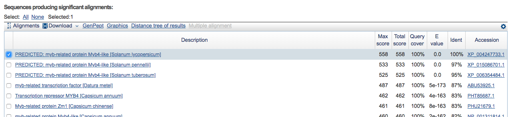{#fig-a-questions-11-15-011}
 由图中结果可知，序列相似度最高的的物种是Solanum lycopersicum，番茄。

### 知识问答 15：BLAT 与快速定位 {#question-11-341}

#### 问题描述 {#question-11-343}


Hello大家好！ 我们又见面了！又是新的一周，又是元气满满的一天！

今天我们讨论讨论低通量比对的最后一次问题，来为大家介绍一下BLAT。

可能看到BLAT这个名字，你可能会懵逼，不是BLAST吗？怎么少了个S？？？我们来为大家解释一下这个问题。

BLAST = Basic Local Alignment Search Tool；

BLAT = BLAST-like alignment tool；

从名字上，我们可以知道结论，BLAST是为了寻找1条SeqA的相似序列。一般输入的是1条FASTA序列，使用的参考序列是所有常见生物，包括微生物在内的非冗余数据库。特点是可以找到所有已知序列生物的相似序列。

优点是全，缺点是有的时候输出冗余。

比如，有时我只需要在某一种我想要的物种的基因组上进行快速的序列定位，结果BLAST却把所有的相似序列都找出来了。从时间上，还有从输出的冗余程度来说，这都不是最优解。所以BLAT工具应运而生！

BLAT的功能，简单来说就是我有1条序列SeqA，我想知道SeqA在某一种基因组中的定位（比如human genome）的工具。

在线的BLAT工具地址是Human BLAT Search；

或者可以通过打开UCSC genome browser --> tools --> BLAT的方式打开；

{#fig-a-questions-11-15-012}
点开BLAT以后的页面如下：
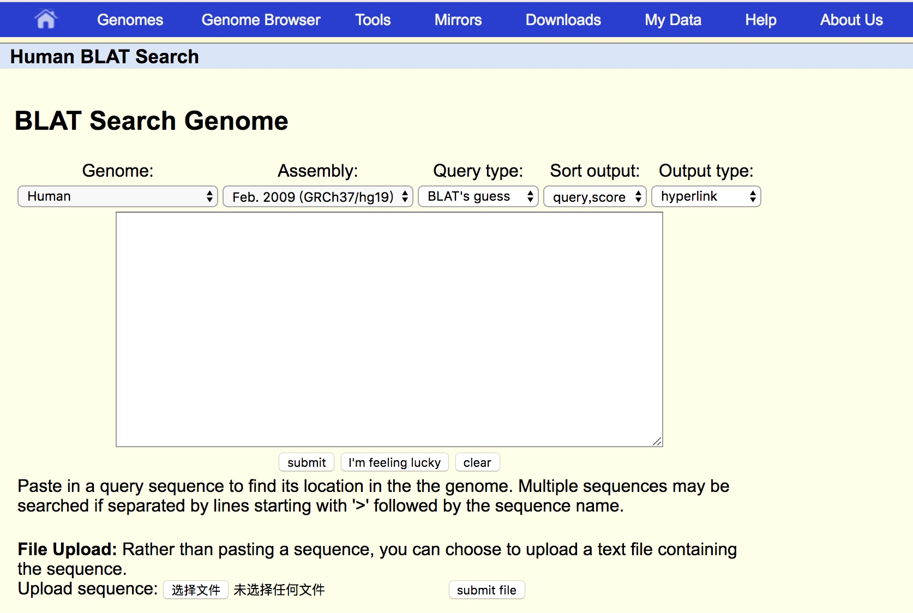{#fig-a-questions-11-15-013}
第1行是你要选择的基因组的参数，比如我们这里常用的就是人的参考基因组hg19版本。

下面的白框可以用来输入序列，用标准的FASTA格式就行。之后点submit就大功告成！


我们今天的问题比较具体，也是我实际分析数据的时候遇到的1个问题。

假设，我们有1个小RNA的测序结果，这些RNA的平均长度小于200bp；我们在比对到小RNA的序列库的候，发现有一个非常奇怪的现象。有2条miRNA的序列mapping到了非常多的reads数目，但是剩下的1800种miRNA总共才mapping到了10000条reads.

> 具体数目如下：  
>   
> hsa-mir-7641-2	2000000  
> 
> hsa-mir-7641-1	50000  
> 
通过miRBase检索，我们得到序列如下：

>hsa-mir-7641-2 
GUUUGAUCUCGGAAGCUAAGCAGGGUCGGGCCUGGUUAGUACUUGGAUGGGAG  

>hsa-mir-7641-1
UCUCGUUUGAUCUCGGAAGCUAAGCAGGGUUGGGCCUGGUUAGUACUUGGAUGGGAAACUU
请尝试使用BLAT，Pairwise alignment等工具探索并解释原因。

双序列比对（Pairwise alignment）请使用下面的工具：

EMBOSS Water < Pairwise Sequence Alignment < EMBL-EBI  

首先我们通过blat检索来看一下这两条序列分别定位于染色体上的什么位置，通过blat可得：
 hsa-mir-7641-2和 hsa-mir-7641-1比对到了5SRNA中间的一段序列上：  
 
 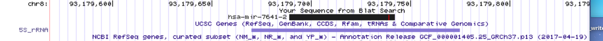{#fig-a-questions-11-15-014} 
  
 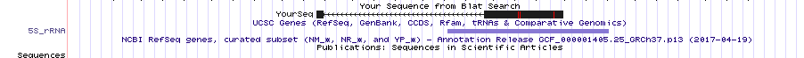{#fig-a-questions-11-15-015}  
 
对5SRNA序列与两条目的序列分别做局部双序列比对：  

hsa-mir-7641-1与5SRNA比对结果：  

 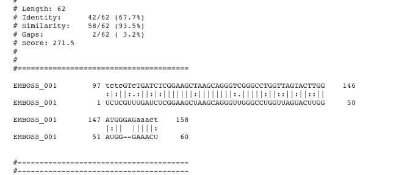{#fig-a-questions-11-15-016}  
 
hsa-mir-7641-2与5SRNA比对结果：  
 
 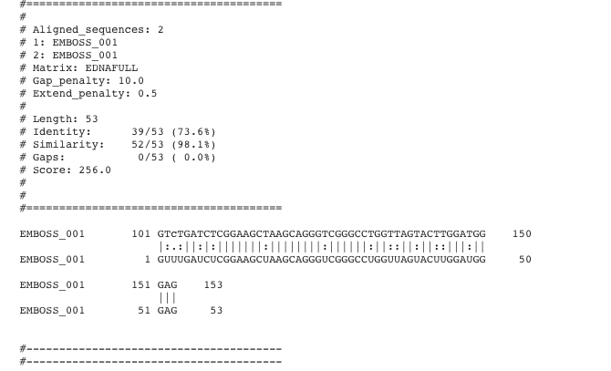{#fig-a-questions-11-15-017}   
      
两条目标序列局部双序列比对结果：  
 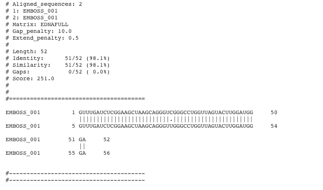{#fig-a-questions-11-15-018} 
  
 ```
从上述比对结果可以看出：
1.这2条目标序列与5SRNA中的一段序列高度重合；
2.这2条目标序列重合的区域高度相似；
结合前面的问题中提到本次实验属于小RNA的测序，
那么建库过程中核糖体RNA不可能完全去除，最终导致了之前的比对结果。

```

## 根据数据选择比对策略 {#sec-04-05}

能为 DNA 与 RNA 选择合适策略并解释未比对或多重比对。

### 常用的高通量比对软件 {#src-0040-mapping-and-BAM-operation-98}

现在最为流行的二代测序比对软件基本都是基于BWT算法的，例如最早的bowtie与bwa，后面针对转录组又开发了bowtie2，再到后面的tophat2，到现在的hisat2。
由于后面的tophat2与hisat2都是基于bowtie2进行改进的，故而这里仅对bwa，bowtie以及bowtie2进行讲解，从粗略的理解深入对这三者进行比较，方便读者在日后的科研工作中进行选择。

首先说一下bwa，其优势在于提供了更多的比对模式选择，可以根据基因组大小进行比对模式选择，也可以根据序列长短进行比对模式选择，同时mem模式对长序列提供了更好的支持，可以处理三代测序数据，更常见于重测序数据的处理。

bowtie与bowtie2，其实bowtie2更像是对bowtie的一个补充。比起bowtie，bowtie2支持了gap，同时也允许了参考基因组出现不确定碱基N，同时支持了局部比对，在中长序列（50-1000bp）的处理上更具速度与准确性。但在面对small RNA等短序列的时候不允许gap与不确定碱基的bowtie更具优势，究其原因就是比对上更为严格，仅支持全局最优的序列作为比对成功序列。

至于bwa与bowtie2在处理转录组数据时，谁更具备优势，其实很难界定，更多是看个人的工具使用倾向，同时在处理长序列的能力方面，作为bowtie2的最新升级版hisat2也在19年下半年的更新中得到了显著性提升，在许多泛基因组的研究中被越来越多的使用。

#### 以Bowtie2为例进行实操讲解 {#src-0040-mapping-and-BAM-operation-108}

下面本书就以bowtie2的安装与使用为例，讲解在使用过程中应该注意的事项。

##### bowtie2的安装 {#src-0040-mapping-and-BAM-operation-111}

由于bowtie2有将安装包放进conda的channel--bioconda里面，故而最为方便的安装方式是直接使用conda进行安装

首先，如果我们在不知道具体哪个channel的情况下，可以在浏览器中输入“conda cloud”进行检索（以必应为例）


{#fig-04-quality-control-and-alignment-011}


点进去即可搜索bowtie2


{#fig-04-quality-control-and-alignment-012}


搜索结果如下


{#fig-04-quality-control-and-alignment-013}


点进入即可看到安装命令行


{#fig-04-quality-control-and-alignment-014}


```
conda install -c bioconda bowtie2
#在软件检索完成之后，按照提示输入y即可按照完成

```


{#fig-04-quality-control-and-alignment-015}


按照完成后即可在命令行中敲出bowtie2，连按tab键补齐三下即可看到所有bowtie2开头的命令


{#fig-04-quality-control-and-alignment-016}


这种按照方法较为简单，推荐刚入门的新手使用，而对于已经熟悉了的读者，则可以自行下载，并配置全局调用，此处简单介绍，各位以后想自己安装了就可以自行尝试

首先在搜索引擎上搜索bowtie2


{#fig-04-quality-control-and-alignment-017}


进入官网，即可看到每个版本修复的问题，而在右下角提供的github链接则为我们要下载的源码地址


{#fig-04-quality-control-and-alignment-018}


点击绿色的clone按键，在window的用户可以下载为zip而后解压传输到服务器上，如果服务器网络较好，也可以通过clone的方式下载到服务器上


{#fig-04-quality-control-and-alignment-019}


```
git clone https://github.com/BenLangmead/bowtie2.git

```


{#fig-04-quality-control-and-alignment-020}


```
#由于bowtie2是无需编译的，下载完成后，即可立即使用

#进入下载后的文件夹，不知道文件夹全名是什么可以ls一下，即可看到当前目录的所有文件跟文件夹，选择进入
cd bowtie2 

#看到bowtie2文件夹内的所有文件
ls 

#选择当前文件夹内的程序使用./+文件名，-h即打开说明书，回车一下即可看到bowtie2的使用说明
./bowtie2 -h 

#获取当前的全路径，并复制
pwd 

#打开环境配置的文件，按i进入编辑模式,去到最后一行输入下一列内容
vim ~/.bashrc 

#从home到bowtie2这一段为刚刚pwd复制的全路径
export PATH="$PATH:/home/Alfred/biosoft/bowtie2/bowtie2-2.3.5.1-linux-x86_64/" 

#ESC键退出编辑模式，并按:wq，退出并保存
source ~/.bashrc #更新当前环境

```

由于购买此书基本为新手，故而不推荐大家一开始就进行自行下载，更新环境，能用conda解决就用conda解决，等熟悉了Linux的操作逻辑再自行翻阅尝试即可。

##### bowtie2的使用 {#src-0040-mapping-and-BAM-operation-188}

作为一名生信从业的科研人员，我们面对不熟悉的软件，第一件事并不是火急火燎的去乱问别人，而是应该秉承着先检索前人使用经验与阅读说明书的原则去熟悉一个新软件，在GitHub的下载页面下面即有bowtie2的使用简要说明


{#fig-04-quality-control-and-alignment-021}


下面由我跟大家用实际例子做个介绍

首先，我们需要从书上提供的地址下载参考基因组，下载完成之后即为一个fa文件


{#fig-04-quality-control-and-alignment-022}


我们使用bowtie2做的第一件事就是对这个参考基因组构建一个索引，这一步的目的就是上文提到构建索引表，供后续比对检索回帖

```
bowtie2-build chrX.fa chrX.fa
# bowtie2-build命令为构建索引的命令
# 第一个chrX.fa代表输入的参考序列
# 第二个chrX.fa代表输出的索引文件前缀
# 产生六个.bt2新文件

```


{#fig-04-quality-control-and-alignment-023}


接着就是拿我们在上一个步骤处理干净的clean data进行回帖操作，这一步可以理解为将所有短序列在参考基因组上找回他们对应的位置，下面我们对bowtie2的参数进行一个大概的认知。

```
#必选参数
# -x <int> 选择索引前缀，即刚刚由bowtie2-build所生成的chrX.fa。
# -1 <int> 双端测序对应的R1.fa，可以为多个文件，并用逗号分开；需要与-2中的R2.fa文件一一对应。
# -2 <int> 双端测序对应的R2.fa.
# -U <int> 单端测序对应的fa，可以为多个文件，并用逗号分开。
# -S <int> 指定所生成的SAM格式的文件前缀。
#常用可选参数
# -p/--threads <num> 设置线程数.默认为1
# --reorder 配合-p使用，使比对结果在顺序与fq的reads顺序一致
# --seed <int> 设置随机种子
# --no-unal 不记录没比对上的reads
# --un-gz <path> 将unpaired reads输出到指定的<path>,并以gzip形式压缩
# --al-gz <path> 将至少能比对1次以上的unpaired reads写入<path>，并以gzip形式压缩
# -5/--trim5 <int> 剪掉5'端<int>个碱基再比对
# -3/--trim3 <int> 剪掉3'端<int>个碱基再比对
#比对参数
#-N <int> 比对时允许的mismatch数目，除非是跨物种比对，一般不更改
#-L <int> 设置比对时reads种子的长度
#-i <int> 设置两个相邻种子间的间隔碱基数
#--n-ceil <func> 设置reads中允许含有的N碱基数目
#--gbar <int> 设置头尾<int>个碱基内不允许的gap数
#--end-to-end 全局比对，为默认模式
#--local 局部比对，多用于找motif，read两端的一些碱基不进行比对罚分
#罚分参数
#--ma <int> 设置匹配得分，仅在--local时生效，比对上一个碱基得<int>分，默认为2，而全局比对时为0
#--mp MX,MN 设置错配罚分，MX即最高罚分，MN为最低分，默认为MX=6，MN=2，如果设置--ignore-qual则每次错配为MX
#--np <int> 当匹配到N时的罚分，默认为1
#--rdg <int1>,<int2> 设置read上打开gap罚分<int1>，延长gap罚分<int2>,默认为5，3
#--rfg <int1>,<int2> 设置reference上打开gap罚分<int1>，延长gap罚分<int2>,默认为5，3
#--score-min <func> 设置有效比对的最小分值，在全局比对时默认为L,-0.6,-0.6，在局部比对时默认为G,20,8
#双端比对参数
#-I/--minins <int> 设置允许插入片段最小长度，默认为0
#-X/--maxins <int> 设置允许插入片段最大长度，默认为500

```

看到这么多参数可能会觉得头晕目眩，其实在我们正常使用中，仅仅是选择必须参数与多线程即可，在比对完成后查看结果再进行调整。

```
bowtie2 -p 10 -x chrX.fa -1 ERR188245_chrX_1.fastq.gz -2 ERR188245_chrX_2.fastq.gz -S ERR188245.sam &

```

##### 对比结果检查 {#src-0040-mapping-and-BAM-operation-256}

在比对完成之后，bowtie2会输出一段log文件，记录着比对情况，但那只是初略的比对情况，简单的检查可以用，但如果是涉及每个染色体的比对情况，则推荐用qualimap2进行检查。该软件的安装，使用conda即可

```
conda install -c bioconda qualimap
```

而后进行质检也非常简单，选择bamqc即可：

```
qualimap bamqc -bam ERR188245.sam -outdir bamqc_result -outformat PDF:HTML
```

如果想看注释的区域也可以加上gff文件的参数：

```
qualimap bamqc -bam ERR188245.sam -gff chrX.gff -outdir bamqc_result -outformat PDF:HTML

```

::: {.callout-note title="待完善" collapse="true"}
修订工具适用范围，用同一类 reads 展示策略差异。
:::

### 知识问答 16：高通量序列比对实践 {#question-16-2}

#### 问题描述 {#question-16-3}


Hello大家好！我们又见面了！


在这之前，我们一直在讨论怎么去做FASTQ文件的质控，怎么trim，怎么cutadapt；还为大家介绍了从双序列比对的最根本的原理及算法；再到后来学习了低通量的找相似序列的办法BLAST以及基因组快速定位的办法BLAT。那么从今天开始以后的若干问都是与高通量测序结果的回贴（mapping）问题有关。

首先来看一下技术路线图：  

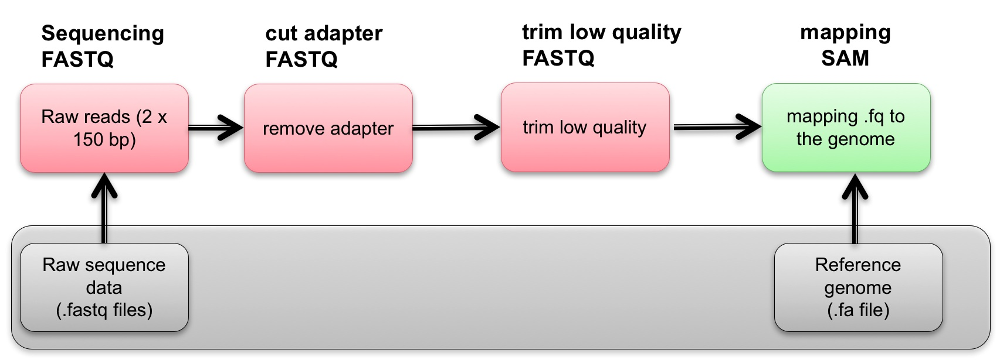{#fig-a-questions-16-20-001}  
 图1.从FASTQ到SAM路线图  
我们的核心任务是从FASTQ文件开始，经过中间的质控，最终找到序列在基因组上的定位。

那么，我们之前的算法和方法能不能高效完成这个问题呢，答案是不行的！因为这次我们的输入常常是10^7 甚至更多的reads，而且是要在全基因组上寻找定位，比如人的基因组有3Gbp大！所以如果不优化算法，估计mapping这个问题就要等到地老天荒。关于mapping的算法问题，我之前录过1期视频，专门推导了为什么应用BWT算法就可以完成我们这项艰巨的任务。

[踏踏实实做技术：BWA，Bowtie，Bowtie2的比对算法推导](https://zhuanlan.zhihu.com/p/30485711)

***
  
谈完了算法，我们再谈谈比对软件。目前市面上针对DNA测序的结果mapping的比对软件有很多。针对2代测序优化过的，最常用的有Bowtie，Bowtie2，BWA这三款；针对3代测序优化的比对软件有BLASR，LAST，BWA-MEM等等。因为目前二代测序占据了90%以上的市场份额，因此我们前期主要讨论的内容是二代测序的比对问题，也就是Bowtie，Bowtie2，BWA这三款软件。

其实，看过我上面BWT推导的朋友应该能够知道，这三个软件本质上的算法是没有区别的，有区别的地方都是小修小改。所以上，理解了其中的1个，其他的也都很好理解。我们会发现，这些算法的最基础的要点就是都要有1个index。那么什么是index呢？简单来说就是若干个文件，方便我们快速地访问及搜索基因组。上面我说的这些比对软件都需要建立index。

一般建立index的输入文件为参考基因组序列（FASTA格式）和1个我们指定的index-name；输出为若干个以index-name为开头的index文件。比如我们使用Bowtie2，以human reference genome建立index的命令为：    
  
```
build-index by Bowtie2
> bowtie2-build hg19_only_chromosome.fa  hg19_only_chromosome &
```

```
解释
> bowtie2-build为建立index的命令，安装bowtie2以后就可以用；
> hg19_only_chromosome.fa 为human genome的参考基因组，FASTA格式；
> hg19_only_chromosome 为建立index需要指定的名称；  
```
最终建立index输出结果如图2：  
{#fig-a-questions-16-20-001-repeat-2}  
图2.使用bowtie2建立的human genome index  
 
那么今天的任务是，请观看我的两个视频：  


第1个视频是介绍BWT算法的及推导的；

视频链接：   
[踏踏实实做技术：BWA，Bowtie，Bowtie2的比对算法推导](https://zhuanlan.zhihu.com/p/30485711)；  

第2个视频是介绍怎么从UCSC genome browser上下载参考基因组然后构建index的；

视频链接：  
[高通量测序技术交流录像](https://link.zhihu.com/?target=https%3A//www.bilibili.com/video/av12969326/)
请观看视频的 24:45 - 41:00部分，参考基因组的下载与bowtie2 index的建立


#### 参考答案 {#question-16-66}

那么我们今天的问题是：  

**1. 为什么FASTQ文件的快速比对需要建立index？**  
  
```
主要是为了加快比对速度，Index简单来说就是若干个文件，方便程序快速地访问及搜索基因组；
在Index的帮助下，比对软件可以把序列比对的问题的时间复杂度降低。
```  

**2. 如果我从1个网站上下载的是1个物种的参考转录组的序列，其中包含了A,U,C,G碱基，我的FASTQ为该物种转录组测序的结果，用A,G,T,C，4种碱基来表示。那么需不需要在建立index之前把参考转录组中的U全部都换成T？**  

```  
需要转化，因为比对程序并不能将U直接识别为T。
```

**3. 请在Linux环境下，下载human genome 19参考基因组的1号染色体序列；并使用bowtie建立index。**   


- 下载 human genome 19参考基因组的1号染色体序列        

```
> weget -c -o ./test http://hgdownload.soe.ucsc.edu/goldenPath/hg19/chromosomes/chr1.fa.gz &   
# -o，将文件下载到指定目录中
# -c，断点传续
# &,后台运行
```

- 下载得到的文件为 chr1.fa.gz，压缩格式，解压文件  
 
``` 
> gzip -d ./test/chr1.fa.gz 
```

- 解压得到chr1.fa，下一步建立Index  


```
> bowtie2-build ./test/chr1.fa ./test/chr1_bowtie2_index &
```

- 得到`chr1_bowtie2_index.bt2`，注意，调用index时使用的名字为`chr1_bowtie2_index`

### 知识问答 18：MAPQ 与比对质量 {#question-16-244}

#### 问题描述 {#question-16-245}

Hello 大家好！ 我们又见面了！

今天我们接着昨天的内容，为大家介绍一下比对的质量MAPQ。

在我们BBQ100的第1问中，我们就问了大家一个问题FASTQ格式中的第4行记录的是什么内容。我们也给大家进行了解答，FASTQ格式的第4行记录的是每一个碱基的测序质量信息，也叫phred值。1个FASTQ记录的例子如下：

```
@HWI-ST1350:124:C1C2TACXX:3:1101:1223:2042
CTTTTCGAGTCAGACACATGACAGCCGGCAGCAACTGGAATGGCAGCAATT
+
BBCFFFFFGHHHHJJIJJIIJJJJIJJJGIJIIJJIJIGIIJJGIIIJIIG
```
我们在mapping的时候，会遇到一个问题，比如就用我们上面给大家展示的FASTQ序列举例。如果这条序列（readA）最终可以比对到：1号染色体的100000这个位置，但其中包含了1个mismatch（错配）；或者是2号染色体的200000这个位置，但是有2个错配。那readA到底是比对到第1个位置还是第2个位置呢？

这个时候就需要1个度量值来帮我们做判断，选择1个最好的作为最终的比对结果（当然研究一些比较特殊问题的时候需要把相似的比对结果都输出出来），这个度量值就是MAPQ。

那么MAPQ是什么意思呢？
根据SAM文件的官方定义：

```
MAPQ: Mapping Quality. It equals  -10 log10 Pr{mapping position is wrong}, rounded to the nearest integer. A  
 value 255 indicates that the mapping quality is not available.
```

简单翻译一下：MAPQ是mapping的质量值，计算方法与FASTQ的质量值类似，

```
MAPQ=-10 * log10{mapping出错的概率}
```
当MAPQ=255的时候，代表MAPQ没有意义，就是一个占位符。

那么怎么计算MAPQ呢？
到了这里，可能又会有同学问了，虽然我们知道了MAPQ的含义，但是里面有一个mapping出错的概率，我应该怎么计算呢？这是一个非常容易问到的问题！

而我的回答是：根据mapping的情况，然后结合碱基的测序质量值进行评估。核心思想是，低质量的碱基如果进行了mismatch（错配），那么很有可能是测序错误导致的，不应该罚太多分；低质量的碱基如果与参考基因组完美match（匹配），那么也很有可能是测序错误导致的，不应该加太多分。

以我们下面的图1内容为例，第5列是MAPQ值，一般在后续分析的时候，我们都需要把MAPQ质量过低的reads去掉，一般的cutoff是MAPQ≥10，严格一些的比如去寻找somatic mutation的时候需要MAPQ≥30.  

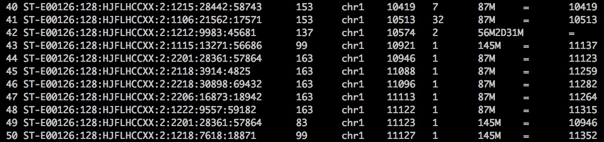{#fig-a-questions-16-20-006}    
 图1 标准的SAM文件截图 
 

#### 参考答案 {#question-16-291}

好了，说了这么多，我们今天的思考如下：

**1. 如果mapping的时候输入的是FASTA文件，那么MAPQ还有意义吗？为什么？**

```
没有意义。FASTA不包含测序质量信息，因此最后的MAPQ无法计算，也没有意义，常用255代替。
```
**2. 不同的比对软件比如bwa与bowtie2，计算出来的MAPQ意义相同吗？为什么？**
  
```
BWA与Bowtie2的核心算法相同，但是比对策略和最终判断输出结果的评价体系不同。
MAPQ虽然代表的均是mapping的质量值，但是不同算法软件间的MAPQ不能同时比较。
简单来说，我们不能认为BWA 中 MAPQ=42就要好于Bowtie的MAPQ=40，反之亦然！

```

**3. 请写出samtools view 命令获得MAPQ大于等于20的sam文件，假设原始的sam文件名为raw.sam，过滤后的sam文件名为filter_MAPQ20.sam**

```
samtools view -S -q 20 ./raw.sam > ./filter_MAPQ20.sam  
# -S input is sam file;
# -q INT minimum mapping quality ;
```  
运行结果：
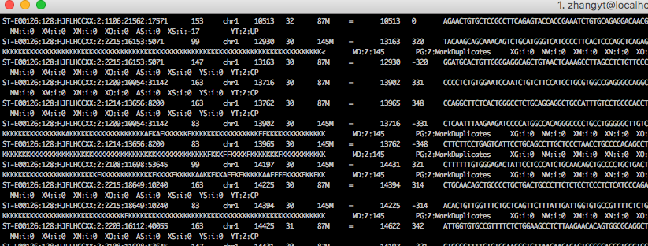{#fig-a-questions-16-20-007}    
 答1 质量值均高于20   


大家在看了我们的BBQ100活动以后，也不要忘了支持我们的知乎Live！

[知乎 Live - 生物信息学](https://www.zhihu.com/lives/users/d75e3cc0c84c322ae56d2e010e4d8e9e)

## SAM/BAM 操作与过滤 {#sec-04-06}

能把比对结果转换成适合下游分析的输入。

### SAM文件与BAM文件操作基础 {#src-0040-mapping-and-BAM-operation-276}


#### SAM文件与BAM文件的介绍 {#src-0040-mapping-and-BAM-operation-278}

经过bowtie2比对之后，会生成一个后缀是sam的结果文件，这个文件里面就记录了我们的比对的结果，下面我们使用less指令查看这个文件，看看有什么玄妙的地方

```
less ERR188245.sam

```


{#fig-04-quality-control-and-alignment-024}


我们可以看到第一行是@HD开头，VN表示版本号，SO表示是否经过排序如果是排过序的是显示coordinate，没有排序则是unsorted
而第二行是@SQ，后面跟的是染色体号以及染色体长度，单位是bp
第三行则是@PG，表示使用的程序跟命令行。
上面这些@开头的部分统称为头文件，记录着一些基本信息
下面一系列格式类似的则是我们的比对结果，每一列记录着不同的信息。
第一列即ERR开头的这些表示的是read的编号，即fq文件的第一行
第二列是一列数字，这列数字叫做flag，即位标识，表示的是比对上的情况，是下面这些情况的数值之和

```
0：比对到参考序列的正链上
1：是paired-end或mate pair中的一条
2：同一模板的各片段满足比对软件定义的正确配对条件（proper pair）
4：没有比对到参考序列上
8：另一片段（mate）未比对到参考序列
16：比对到参考序列的负链上
32：双末端reads的另一条（mate）比对到参考序列的负链上
64：这条read是mate 1
128：这条read是mate 2
#后续根据比对情况进行过滤就是用到这些数字

```

第三列是表示比对上的参考基因组的某条染色体，如果什么都没比对上则是'*'

第四列是比对上的染色体的具体位置起始位置，从1计数，如果比对不上则是以0计数

第五列是比对质量 MAPQ，用 Phred 标度表达比对位置错误的概率。SAM 规范并未将取值限制为 0—60；255 表示没有可用的比对质量。具体算法、上限和过滤阈值依赖比对软件及分析目的，不能把 MAPQ≥20 当作普遍的可信保证。

第六列是比对情况表达式，CIGAR，主要由soft  clipping 、match/mismatch、insertion、deletion、 padding、skipped bases、hard clipping、match、mismatch对应字母S、M、I、D、P、N、H、=、X跟数字组成，例如 `3S38M432N38M` 表示先软剪切 3 个碱基，再比对 38 个碱基、跳过参考上的 432 个碱基、再比对 38 个碱基；`M` 同时包含匹配与错配，`S` 必须大写

第七列表示下一片段比对上的参考序列的标号，同一片段用=，没有另外片段则为'*'

第八列表示下一片段比对上的位置，如果不可用则用0

第九列表示Template的长度，最左边得为正，最右边的为负，中间的不用定义正负，不可用则为0

第十列则为比对上的reads对应的序列信息

第十一列则是比对上的序列的质量信息，计分方法同FASTQ文件

看到这里你可能觉得头晕晕的，但其实可以不用记得这么仔细，你只需要知道sam文件就是记录了比对上了哪些reads，比对上的reads在什么位置，这些reads比对的质量怎么样即可了，到真的需要过滤的时候再查看一下具体内容就行了。

#### BAM文件的生成 {#src-0040-mapping-and-BAM-operation-330}

由于我们的sam文件是文本类的文件，这就导致比对所产生的结果文件动辄大几G，对我们硬盘的造成了很大存储压力，如果压缩则能够减小很多体积，而直接转成二进制文件则更为节约体积，故而就诞生了一种二进制格式bam来对比对结果进行存储，除了是二进制以外其存储的内容与sam文件无异。怎么区分这两个呢，我觉得用英文区分就很简单可以区分开，s是string的意思，字符，文本的意思，b是binary的意思，二进制的意思，一下子就知道两者的区别了。

那么转成二进制文件之后，要怎么打开呢？很明显使用less这种打开文本文件的是不适合的了。这个时候就要提到bwa之父李恒大神为sam与bam开发的一个处理利器samtools。首先是国际惯例，安装

```
conda install -c bioconda samtools

```

安装完毕之后就可以在命令行上使用了，首先是将sam文件转换为bam文件：

```
# 将sam文件转换为bam文件
samtools view -b -S ERR188245.sam > ERR188245.bam

# 同样的，我们可以把bam文件转为sam文件
samtools view -h ERR188245.bam > ERR188245.sam
```

那么问题来了，转为bam文件之后，怎么用samtools查看？我们可以将bam转为sam，然后再利用管道符用less查看：

```
# 查看完整的bam文件
samtools view -h ERR188245_chrX.bam | less -S

#如果只想查看头文件
samtools view -H ERR188245_chrX.bam

#如果想跳过头文件
samtools view ERR188245_chrX.bam  | less -S

```

#### BAM文件的排序 {#src-0040-mapping-and-BAM-operation-364}

如果我们是做全基因组测序，那么在进行下游分析之前，需要对bam文件进行一个排序，这个功能可以用samtools，也可以用Picard或者gatk做到。

使用samtools对bam文件进行排序：

```
samtools sort -@ 20 -m 8G -O bam -o ERR188245_chrX.sorted.bam ERR188245_chrX.bam
# @：指定线程数
# m：每个线程分配的最大内存
# O：输出文件格式
# o：输出文件的名字
# 输入文件放在最后
```

如果是picard的话，可以参考下面的命令：
```
java -jar picard.jar SortSam I=ERR188245_chrX.bam  O=ERR188245_chrX.sorted.bam  SORT_ORDER=coordinate

```

如果使用GATK工具，对bam文件进行排序，可以参考：

```
#如果是gatk的话, 先建立index与dict
samtools faidx chrX.fa
gatk CreateSequenceDictionary -R chrX.fa -O chrX.dict

#再使用gatk进行排序
gatk SortSam -I ERR188245_chrX.bam -O ERR188245_chrX.sorted.bam -R chrX.fa -SO coordinate --CREATE_INDEX

```

#### BAM文件的index的建立 {#src-0040-mapping-and-BAM-operation-396}

经过排序之后的bam文件，就可以建立索引，如果不排序则会报错。建立bam文件的索引文件，是为了更方便地

```
samtools index ERR188245_chrX.sorted.bam

```

运行完上面的命令，即可在文件夹中获得一个index文件，一般情况下默认的文件名为bam文件名后面增加`.bai`后缀。比如这里就会生成`ERR188245_chrX.sorted.bam.bai`文件。我们在对排序完的bam文件进行一些特殊的操作时，一般都需要index文件和bam文件在同一文件夹中，否则可能会出现报错的现象。

#### 对比对结果进行过滤 {#src-0040-mapping-and-BAM-operation-406}

果然想通过mapping质量或者比对情况进行过滤，那samtools一定是处理代码最为简洁的。

```
samtools view -h -b -q 20 -F 4 -F 256 ERR188245_chrX.sorted.bam > ERR188245_chrX.q1F4F256.sorted.bam

#-f 提取提取出没有mapping上的reads
#-F 过滤过滤掉没有mapping上的reads，也就是说提取出mapping上的reads
#-u 输出格式为未压缩的bam格式
#-q 过滤掉MAPQ值低某个阈值
#-h 设定输出的SAM文件带有header
#-b 输出格式设定为BAM
#-S 输入格式为SAM
```

#### 对比对结果进行统计 {#src-0040-mapping-and-BAM-operation-421}

如果相对bam文件进行一些基础的统计分析，比如测序片段的数目，整体的突变情况，基因组测序结果的覆盖度等等，都可以用下面的命令生成报告。

```
samtools flagstat ERR188245_chrX.sorted.bam

```

结果文件统计bam文件中reads的比对情况，如多少reads比对上等信息，其中的结果比较丰富，但是需要再使用R或者Python编程进行生成图表。所以，当不追求速度的情况下还是建议用qualimap2软件。

### 知识问答 17：SAM 文件与 FLAG {#question-16-111}

#### 问题描述 {#question-16-112}

Hello大家好！ 我们今天又见面了！

经过了1个小长假，不知道大家的生物信息学100问作业写得怎么样了？

对了，告诉大家一个好消息，我们的生物信息学基础100问终于有了一个好的名字，叫100 bioinformatics basic questions ， 简称BBQ100，大家以后要记住这个名字哟！

我们从第16题开始，正式接触了高通量测序mapping的内容，可能有的朋友又忘记了mapping的定义，我们再来回顾一下这个概念。  


> "比对“对应的单词是alignment，往往特指低通量的序列之间的比较。比如10条序列，进行多序列比对就是我们常说的 multiple alignment问题；如果是2条序列的比对，我们经常称其为pairwise alignment.
 
> “回贴”通常对应的单词应该是mapping，一般指高通量的数据去寻找基因组的位置。比如我们进行测序以后，有10^6对 read pair，要去寻找他们在基因组上的位置，这个时候就是一个典型的mapping问题。  


我们再把思路理清楚，在进行mapping的时候，

输入文件应该包含：

```  
1. 测序结果（通常是FASTQ或者是FASTQ的压缩文件）
2. 之前建立好的参考基因组的index文件（不同的mapping软件建立的方法大同小异，但一般都是提前构建）
```  
输出文件应该包括：  

```  
1. 比对的结果文件（一般是SAM文件格式或者是BAM文件格式）
2. 比对的情况报告
```  
今天我们就要谈一谈SAM/BAM文件格式。

首先先说二者之间的关系，BAM文件是SAM文件的压缩格式，压缩以后可以节省空间，排好序的BAM文件还可以提供随机访问功能，性能优良。但是BAM文件和SAM文件储存的内容是完全一样的。我们以后还要单独再说BAM文件的操作方法，今天我们把重点放在文件中的内容上。

SAM文件的全称是：Sequence Alignment Map，它设计之初就是为了存储mapping结果的。一个标准的SAM文件由2部分组成，第1部分是以“@”开头的头部，在文件的最前面；第2部分就是紧跟在头部后面的比对结果文件。我们先来看一个例子（图1）。  

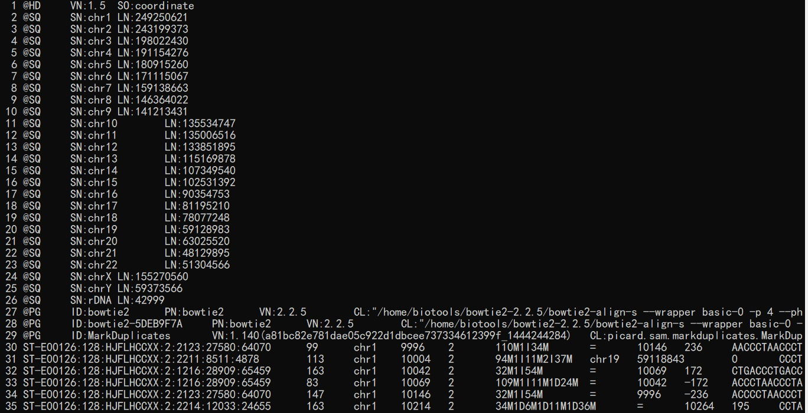{#fig-a-questions-16-20-002}   
 
图1 SAM文件的内容   
 在Linux中，访问sam文件最好用的工具是samtools，常用的操作如下：
 
 ```
# 假设SAM文件的文件名是 test.sam

# 1.只查看头部
samtools view -H test.sam

# 2.只查看内容，不查看头部
samtools view test.sam

# 3.查看头部内容
samtools view -h test.sam 

# 4.查看帮助文档
samtools view  

 ```  
另外，通常情况下，1行SAM文件的内容包含有多列，标准的SAM文件会包含11列内容，其中每一列的内容代表的意思与简单的描述如下。我们今天主要关注的是前面4列内容。   
 
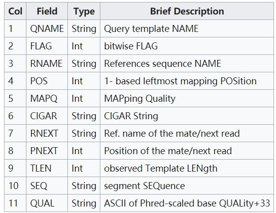{#fig-a-questions-16-20-003}    
 图2 标准SAM文件中的11列内容代表的含义    
 
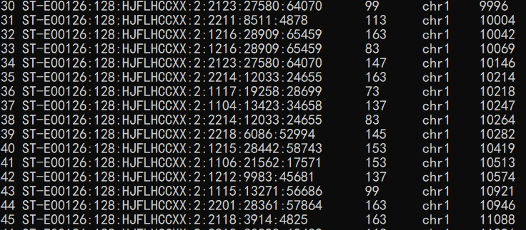{#fig-a-questions-16-20-004}    
 图3 SAM文件中的前4列内容    


#### 参考答案 {#question-16-188}

说了这么多，那么我们今天的问题如下：

**1. SAM文件的头部内容中常见的标志符号有@HD，@SQ，@PG，请问这三者后面跟随的信息分别是什么意思？**  

```
- 这三者都属于注释信息；
- @HD:说明符合标准的版本、对比结果是否进行了排序
- @SQ:参考序列说明
- @PG:得到的文件都经过了哪些处理，比如mapping的详细程序等等；
```

**2. 图3是SAM文件内容的前4列（最前面的序号是我加上去的，不包含在SAM文件中），那么请你解释一下这4列分别代表什么意思？其中的FLAG是第几列，是什么意思？**  

```
- QNAME：比对片段的编号；以及read name，通常包括测序平台的信息；
- FALG：比对情况的代表值，也叫做位标识，每一个数字代表一种比对情况，这里的值是符合情况的数字相加总和；
- flag取值：
1（1）该read是成对的paired reads中的一个 
2（10）paired reads中每个都正确比对到参考序列上 
4（100）该read没比对到参考序列上 
8（1000）与该read成对的matepair read没有比对到参考序列上 
16（10000）该read其反向互补序列能够比对到参考序列 
32（100000）与该read成对的matepair read其反向互补序列能够比对到参考序列 
64（1000000）在paired reads中，该read是与参考序列比对的第一条 
128（10000000）在paired reads中，该read是与参考序列比对的第二条 
256（100000000）该read是次优的比对结果 
512（1000000000）该read没有通过质量控制 
1024（10000000000）由于PCR或测序错误产生的重复reads 
2048（100000000000）补充匹配的read
```

**3. 如果1条序列的FLAG=83 （图3标号38的行）请解释其比对含义。**  

使用Explain SAM Flags工具，结果如下：

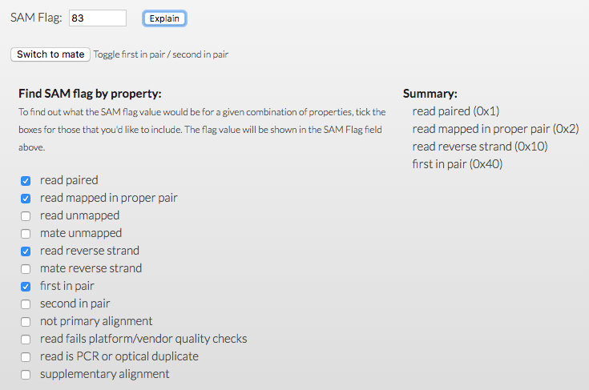{#fig-a-questions-16-20-005}    
```
FLAG = 1+2+16+64=83 ，不同数字对应的解释如上。即当FLAG=83时，这代表着：
（1）序列是双端测序的结果；
（2）mapping的结果正常；
（3）reads mapping到了genome的负链上；
（4）此reads为reads1
```


参考资料：

[超好用的FLAG解释工具-Explain SAM Flags](https://link.zhihu.com/?target=https%3A//broadinstitute.github.io/picard/explain-flags.html)

[维基百科-SAM (file format)](https://en.wikipedia.org/wiki/SAM_(file_format))

### 知识问答 19：CIGAR 与序列比对关系 {#question-16-329}

#### 问题描述 {#question-16-330}


Hello大家好！我们又见面了！

今天我们来和大家一起继续学习SAM/BAM文件的文件结构与特性。

我们之前学习到了从SAM文件是用来存储序列mapping结果的标准格式，BAM文件是SAM文件的压缩格式，二者在信息层面是等价的。

SAM/BAM文件的前面5列，分别记录了，各位可以对照下图1中的内容对应一下。

```
1. 序列的名称；
2. FLAG值；
3. 比对到的染色体；
4. 比对到的染色体的具体位置；
5. 比对的质量值， 也叫MAPQ；
```

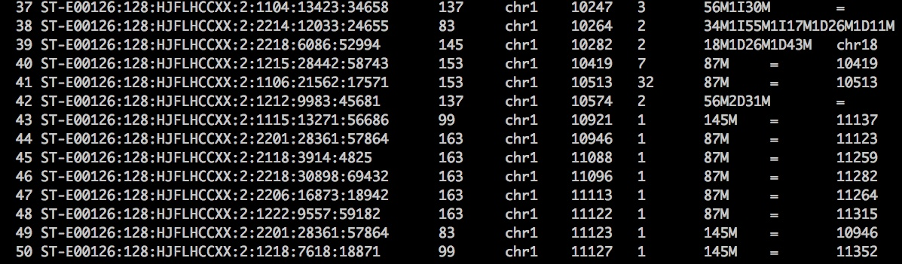{#fig-a-questions-16-20-008}    
 图1 全基因组测序的比对数据   
 那么第6列信息到底是什么呢？它其实是比对的一个简单描述，有一个很好听的名字叫CIGAR值（对滴，就是雪茄烟的那个单词）。

CIGAR = Concise Idiosyncratic Gapped Alignment Report 

我们先来简单理解一下CIGAR值。

```
例子1：如图1第37行，CIGAR = 56M1I30M；
它的含义就是：这条序列与参考基因组相比；
前56bp能够match上；
中间有1bp的insertion（相比于参考基因组有1bp的插入）；
最后是30bp的match

例子2：如图1第50行，CIGAR=145M，
含义就是：这条序列与参考基因组比对的结果是145bp完全match上。
```
那么常用的CIGAR标记符号都有哪些呢？根据SAM格式的官方文档如图2所示。

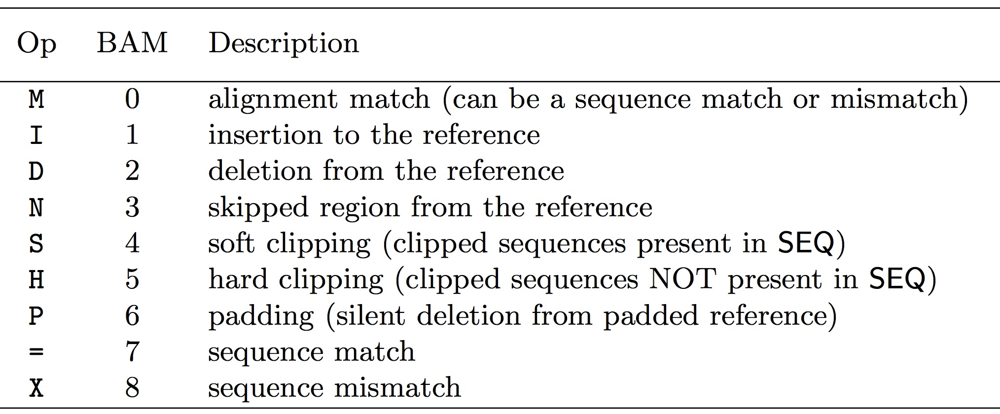{#fig-a-questions-16-20-009}    
 表1 常用的CIGAR符号 
    
目前，我们只需要了解到前面7个，后面的=，X已经很不常用了，大家可以先忽略一下。


#### 参考答案 {#question-16-381}

我们今天就是让大家去理解CIGAR值到底是什么，因此我们今天的问题就是：  

**1. M,I,D,N分别是什么意思？如果1条序列的CIGAR=150M， 那么是不是可以说这150bp的区域中没有mismatch（错配）的现象？**

```
M:序列匹配或错配
I:参考序列上的插入
D:参考序列上的缺失
N:参考序列上的跳跃区
150M不能说150bp区域区域中没有错配，因为M表示完全匹配;
但是无论reads与序列的正确匹配或是错误匹配该位置都显示为M 。
```
**2. 如果1条序列来自于成熟的mRNA，在mapping到基因组的时候会有什么问题？如果这条序列中间正好跨过了200bp的intron，前后各有75bp mapping到了exon上，那么这条序列的CIGAR值应该怎么写？**

```
- 错配，intron,跳跃区；
- CIGAR：75M200N75M
```
**3. 根据下图提示，请理解clip的含义，无论是softclip还是hardclip。**

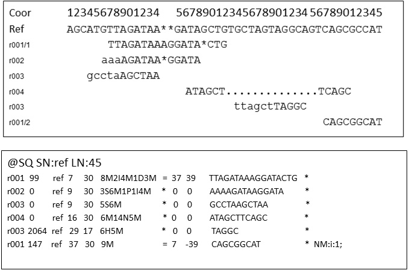{#fig-a-questions-16-20-010}    
 图2 引自 http://bioinformatics.cvr.ac.uk/blog/tag/cigar-string/ 

```
以r003序列为例，两个比对结果中序列剪切之后进行比对，那么所对应的CIGAR分别是5S6M和6H14N5M;
最终bam文件中序列分别是11bp和25bp,
这说明，在read进行softclip后，reads的原始信息在BAM文件中依然保留；
但是hardclip中，reads只在BAM文件中保留了切除以后的序列将直接被删除。
```
大家在看了我们的BBQ100活动以后，也不要忘了支持我们的知乎Live！

孟浩巍的知乎 Live - 生物信息学

购买任意一个上面链接内生物信息学的知乎Live都可以加入我们的生物信息学交流群。

目前群已经有1000多人了！

谢谢大家的支持！

### 知识问答 20：配对字段与序列信息 {#question-16-426}

#### 问题描述 {#question-16-427}

Hello大家好！今天我们又见面了！

今天我们来继续探索SAM/BAM文件的信息列。

我们之前已经说过，1个标准的SAM文件包含前面的11列标准信息列和若干标识符信息列（如表1所示），其中前面的6列我们已经为大家解释清楚。那么今天我们来继续探索剩下的7到11列。 
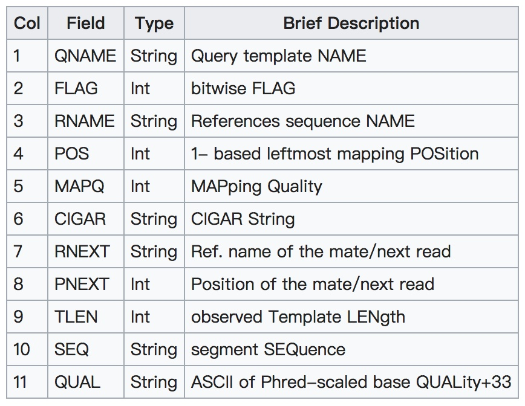{#fig-a-questions-16-20-011}    
 表1 SAM格式的标准11列信息介绍 
 
第7列，一般情况下是指Pair read的另一半的比对的参考基因组；

第8列，一般情况下是指Pair read的另一半的比对的参考基因组的坐标；

第9列，可以简单理解为这1对read比对到基因组上以后，上游第1个碱基到下游最后1个碱基的距离。如果用负号表示是下游的序列；如果是正数表示为上游的序列；如果是0表示只是单端比对上；

第10列，进行比对read的序列信息；

第11列，进行比对read的质量信息；  
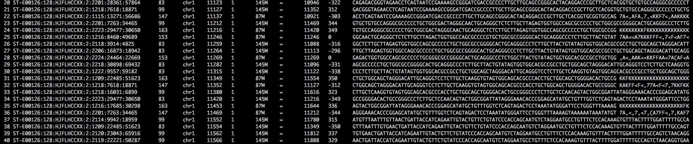{#fig-a-questions-16-20-012}    
 图1 SAM文件的截图，包含11列   
 对于我们今天的简单讲解，其实还涉及到很多概念，就比如在SAM官方文档中，对template，segment，read的各自定义就很让人挠头，我也是用了很长的时间才弄懂学会的。大家有兴趣的可以看一下图2我的截图，看看里面的定义
 
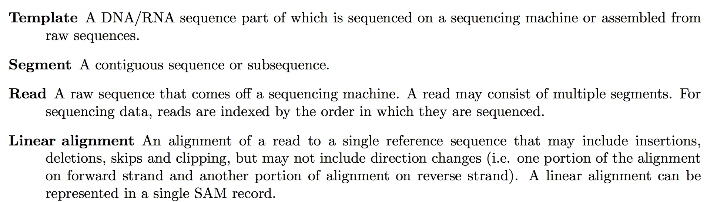{#fig-a-questions-16-20-013}    
 图2 SAM官方文档中对一些概念的解释（很让人难懂）     
  


#### 参考答案 {#question-16-465}

那么我们今天的问题如下：

**1. 图1中第20行，第9列记录了TLEN值，请你根据今天的文章与图1中的信息，列出算式计算TLEN值。**

```
-（11123-10946+145） = -322 
```
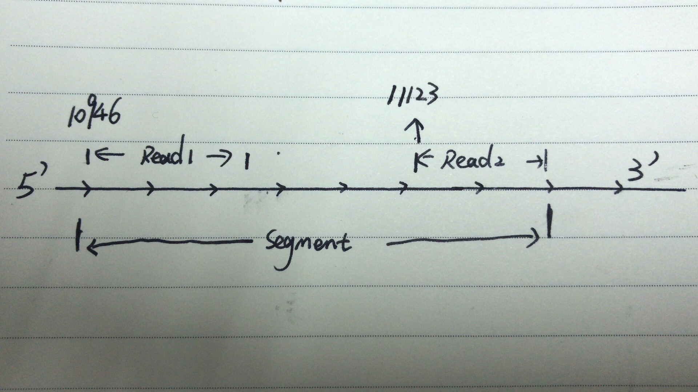{#fig-a-questions-16-20-014}  


**2. 如果使用FASTA文件作为input，第11列的质量值是否还有意义？为什么？**

```
没有意义，因为fasta文件信息不包含read的质量值，11列的质量值本身是测序质量值，所以没有参考意义。
```

**3. 有没有可能通过SAM文件，提取里面的序列信息并转换成FASTQ格式的文件？如果可能，请你写出程序思路。**

```
samtools view -b -h -S filter_MAPQ20.sam > filter_MAPQ20.bam
samtools bam2fq filter_MAPQ20.bam > filter_MAPQ20.fastq

# [M::bam2fq_mainloop] processed 629 reads
```
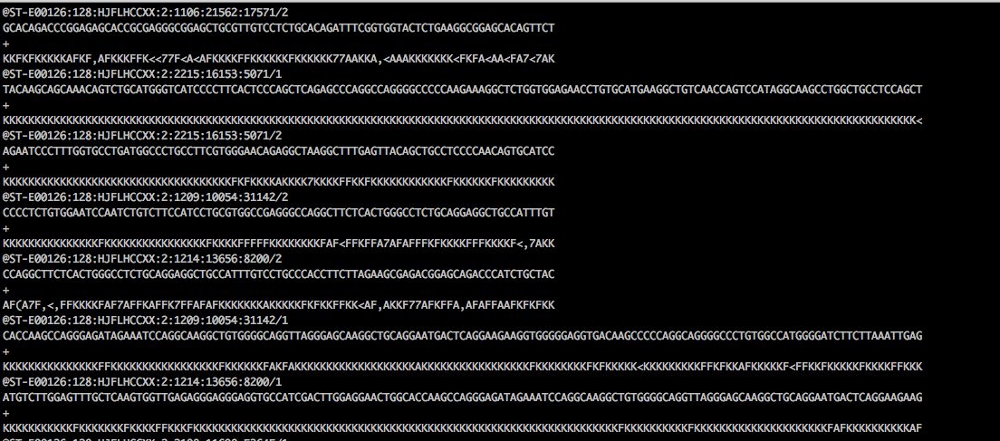{#fig-a-questions-16-20-015}    
 

[该问题参考资料](http://www.metagenomics.wiki/tools/samtools/converting-bam-to-fastq)

### 知识问答 21：SAM 可选字段 {#question-21-3}

#### 问题描述 {#question-21-5}


Hello大家好！我们今天又见面了！

今天是第21题，我们接着之前的题目，继续学习与SAM/BAM有关的内容。今天要学习的内容是SAM/BAM文件的附加信息。

**1. 基础导引部分**  

我们先给大家举个例子，这是一个human的全基因组测序比对的SAM文件的11列以后的信息。第11列之前学习过了是reads的质量值，那么后面的若干标记比如MD:Z:145等等这些符号是什么意思呢？

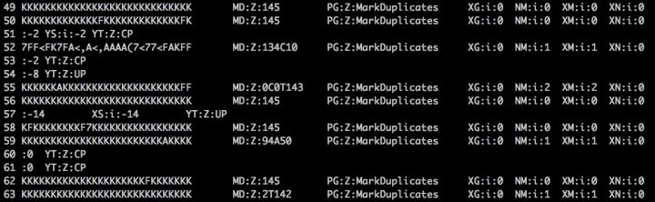{#fig-a-questions-21-25-001}  

图1 SAM文件的11列以后的信息截图   
 
我把上面图中的部分行的信息放到这里，供大家查阅（11列以后的内容要一直向右拖拽) 

```
ST-E00126:128:HJFLHCCXX:2:1206:8105:9730	99	chr1	11670	1	145M	=	11898	315 AGGTGAAGCCCTGGAGATTCTTATTAGTGATTTGGGCTGGGGCCTGGCCATGTGTATTTTTTTAAATTTCCACTGATGATTTTGCTGCATGGCCGGTGTTGAGAATGACTGCGCAAATTTGCCGGATTTCCTTTGCTGTTCCTGC	KKKKKKKKKKKKKKKKKKKKKKKKKKKKKKKKKKKKKKKKKKKKKKFKKKKKKKKKKKKKKKKKKKKKKKKKKKKKKKKKKKKKKKKKKKKFKKFKKKKKKKKKKKKKKKKKKKFFKKKKKKKKKKFKKKKKKKKKKKKKKKFAK	MD:Z:145	PG:Z:MarkDuplicates	XG:i:0	NM:i:0	XM:i:0	XN:i:0	XO:i:0	AS:i:0	XS:i:0	YS:i:0	YT:Z:CP
ST-E00126:128:HJFLHCCXX:2:2107:22820:18520	99	chr1	11682	1	145M	=	11920	325	GGAGATTCTTATTAGTGATTTCGGCTGGTGCCTGGCCATGTGTATTTTTTTAAATTTCCACTGATGATTTTGCTGCATGGCCGGTGTTGAGAATGACTGCGCAAATTTGCCGGATTTCCTTTGCTGTTCCTGCATGTAGTTTAAA	KKKKAAKKAFFKKKKKKFKFKKKFKKKKKKKKKKFKFKKKKKKKKKKKKKKFKFFKKKKKKFAAKAKKKKKKKKKKKKFFKKKFFFKKFKFFKKKKKKKKFFFFFKKKKKKK7<FFKKKKKKAFK<F<<7<AA,,7AA<7F7AA<	MD:Z:21G6G116	PG:Z:MarkDuplicates	XG:i:0	NM:i:2	XM:i:2	XN:i:0	XO:i:0	AS:i:-12	XS:i:-12	YS:i:-6	YT:Z:CP
ST-E00126:128:HJFLHCCXX:2:1210:9110:60026	163	chr1	11703	1	87M	=	11840	282	GGGCTGGGGCCTGGCCATGTGTATTTTTTTAAATTTCCACTGATGATTTTGCTGCATGGCCGGTGTTGAGAATGACTGTGCAAATTT	7FKAFKFKFFFKKF<FKKKFKKKFKK7F<KFFKFKKKKKKKFFFF,FKKKKKKKFFKKKKK(7<,AAK<F7AAFKKFKFKFF<A<7<	MD:Z:78C8	PG:Z:MarkDuplicates	XG:i:0	NM:i:1	XM:i:1	XN:i:0	XO:i:0	AS:i:-5	XS:i:-5	YS:i:-33	YT:Z:CP
ST-E00126:128:HJFLHCCXX:2:2101:7425:68324	99	chr1	11708	1	145M	=	11923	302	GGGGCCTGGCCATGTGTATTTTTTTAAATTTCCACTGATGATTTTGCTGCATGGCCGGTGTTGAGAATGACTGCGCAAATTTGCCGGATTTCCTTTGCTGTTCCTGCATGTAGTTTAAACGAGATTGCCAGCACCGGGTATCATT	KKKKKKKKKKKKKKKKKKKKKKKKKKKKKKKKKKKKKKKKKKKKKKKKKKKKKKKKKK<FKKKKKKKKKKKKKKKKKKKKKKKKKKKKKKAKKKKK<FKKKKFKKKKKKKKK7<AKFFAFKFF<KKKKKFKK<FK<7F,AFKFFA	MD:Z:145	PG:Z:MarkDuplicates	XG:i:0	NM:i:0	XM:i:0	XN:i:0	XO:i:0	AS:i:0	XS:i:0	YS:i:0	YT:Z:CP
ST-E00126:128:HJFLHCCXX:2:2210:15382:54752	163	chr1	11714	1	87M	=	11866	297	TGGCCATGTGTATTTTTTTAAATTTCCACTGATGATTTTGCTGCATGGCCGGTGTTGAGAATGACTGCGCAAATTTGCCGGATTTCC	KKKKKKKKKKKKKKKKKKKKKKKKKKKKKKKKKKKKKKKKKKKKKFKKKKKKKKKKKKKKKKKKKKKKKKKKKKKKKKKKKKKKKKK	MD:Z:87	PG:Z:MarkDuplicates	XG:i:0	NM:i:0	XM:i:0	XN:i:0	XO:i:0	AS:i:0	XS:i:0	YS:i:-5	YT:Z:CP  
```


一般呢，我们都把11列以后的内容称为可选择区域（optional fields），这个区域所有的格式都必须是TAG:TYPE:VALUE的形式，比如MD:Z:145就是一个符合规范的可选区域的值。

根据SAM格式官方文档的信息，我们需要记住以下内容：

```
1. 所有的TAG都是2个字母，一般情况下都是大写字母。并且TAG在1行的比对结果中只能出现1次。
2. 所有的TYPE都是单字母，大小写敏感，它是用来定义后面VALUE的类型；
3. VALUE可长可短，但是需要和之前的TYPE相呼应。  

```
关于TYPE不同字母对应的不同数据类型，把SAM的官方文档贴一下，共大家参考。其中，最常用的就是i（带符号的数字）；Z（可直接输出字符串，可以包含空格）；  


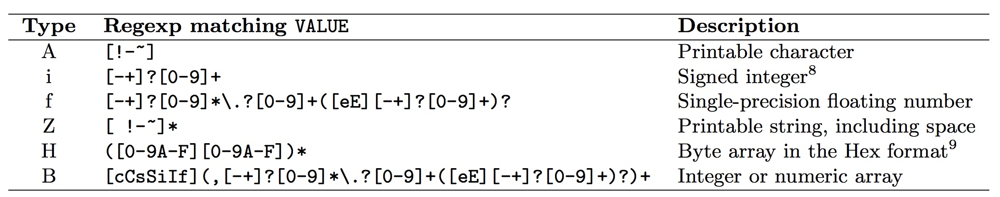{#fig-a-questions-21-25-002}  

图2 TYPE的字母与不同数据类型之间的对应关系
 
    
  
**2.常用的TAG**  

那么常用的TAG都有哪些，都代表什么含义呢？要知道，不同的比对软件可能会在SAM文件的后面加上不同的TAG，所以我们在查询TAG含义的时候一定要从所用比对软件的官方文档中去查找。而SAM文件的header部分又包含了@PG字符段可以帮助我们还原比对软件的参数设置，因此我们拿到一个SAM文件就可以通过查阅文档的方式了解TAG的基本信息。

```
使用samtools可以查看sam文件的header部分
samtools view -H test.sam
```
比如，我们这里的@PG内容如下 

```
@PG	ID:bowtie2-5DEB9F7A	PN:bowtie2	VN:2.2.5	CL:"/home/biotools/bowtie2-2.2.5/bowtie2-align-s --wrapper basic-0 -p 4 --phred33 -x /lustre/user/reference/hg19/hg19_combine -S ./tmp.data/fastq/genome-sequence.sam -1 ./tmp.data/fastq/genome-sequence_L3_1_trim5.fastq -2 ./tmp.data/fastq/genome-sequence_L3_2_trim5_92.fastq"
```


#### 3. 提问环节 {#question-21-72}

**我们今天的问题很简单，请根据bowtie2的官方文档，解释下面的比对信息：**

```
ST-E00126:128:HJFLHCCXX:2:2107:22820:18520	99	chr1	11682	1	145M	=	11920	325	GGAGATTCTTATTAGTGATTTCGGCTGGTGCCTGGCCATGTGTATTTTTTTAAATTTCCACTGATGATTTTGCTGCATGGCCGGTGTTGAGAATGACTGCGCAAATTTGCCGGATTTCCTTTGCTGTTCCTGCATGTAGTTTAAA	KKKKAAKKAFFKKKKKKFKFKKKFKKKKKKKKKKFKFKKKKKKKKKKKKKKFKFFKKKKKKFAAKAKKKKKKKKKKKKFFKKKFFFKKFKFFKKKKKKKKFFFFFKKKKKKK7<FFKKKKKKAFK<F<<7<AA,,7AA<7F7AA<	MD:Z:21G6G116	XG:i:0	NM:i:2	XM:i:2	XN:i:0	XO:i:0	AS:i:-12	XS:i:-12	YS:i:-6	YT:Z:CP

```
**Anwser**

```
1. ST-E00126:128:HJFLHCCXX:2:2107:22820:18520
> 序列名称，比对片段的编号，通常包括测序平台的信息

2. 99
> Flag值

3. chr1
> 回帖到的染色体名称

4. 11682
> 比对到染色体上的具体位置（比对到正链最左边bp的位置点）

5. 1
> 比对的质量值，叫做MAPQ，MAPQ=-10 * log10{mapping出错的概率}

6. 145M
> CIGAR值，描述具体的比对情况

7. =
> pair reads中与该序列配对的read所mapping到的参考序列，如果没有mapping到同一条参考序列上，则用“*”代替。

8. 11920
> pair reads中与该序列配对的read所mapping到的参考序列的具体位置

9. 325
> 通过分析pair reads mapping到同一条参考序列上位置的推断得到fragment的长度

10. GGAGA....TTAAA
> read序列信息
11. KKKKA....F7AA<
> read序列测序每一bp的质量值
12. MD:Z:21G6G116
> MD:Z:表示在比对过程中有mismatch的情况，后面字符串表示mismatch的具体位置
13. XG:i:0
> XG:i有gap的存在，后面数字表示gap的总长度（read和reference上的都计算在内）
14. NM:i:2
> 编辑距离，为了将read map到reference上，对read进行单核苷酸编辑（替换、插入以及删除）的最小长度
15. XM:i:2
> mismatche的具体数目
16. XN:i:0
> 序列覆盖区的参考基因组上不确定的base数
17. XO:i:0
> gap的具体数目

18. AS:i:-12
> 比对分数，允许负值，局部比对最终可以大于0，但是全局比对中不会

19. XS:i:-12
> 比对过程中出现的比最终报告分数（AS:i:-12）高的比对值，同样允许负值，局部比对最终可以大于0，但是全局比对中不会。当一条序列能够同时比对到多个位点，且出现连续局部相似度极高的情况下会出现这种情况。
20. YS:i:-6
> 与该序列配对的pair read的比对分数
	
21. YT:Z:CP
> YT:Z:代表pair-read的比对情况，“UU”代表没有配对的read； "CP"代表序列为pair reads之一，pair align cordantly；"DP"表序列为pair reads之一，pair align discordantly；"UP"代表序列为pair reads之一，但是pair没有比对到参考基因组上。

```
参考资料：  

1.  [Bowtie 2-官方使用手册-SAM output部分](https://link.zhihu.com/?target=http%3A//bowtie-bio.sourceforge.net/bowtie2/manual.shtml%23sam-output)

2. [SAM Format](https://link.zhihu.com/?target=http%3A//www.samformat.info/sam-format-alignment-tags)

### 知识问答 22：SAM/BAM 操作练习 {#question-21-145}

#### 问题描述 {#question-21-146}


Hello 大家好！

前面的若干问题，我们一直在围绕着SAM文件的记录格式做了详细地讨论，我相信大家通过我们的问题，跟随我们学习的思路已经掌握了SAM文件作为标准的比对格式的合理性以及相关特点。


#### 1. 背景介绍和数据下载 {#question-21-152}


SAM文件不但记录了reads详细的mapping信息，还记录了reads的原始信息，内容很是全面。这样很好，但也存在很多问题：

比如我的原始FASTQ文件是100G，那么我的SAM文件一定是大于100G的，也就是占用了更多空间；
mapping的结果是没有排序，无论是按reads的name排序还是按在基因组上的位置排序，都没有。所以默认的SAM输出文件是乱序的，处理很不方便；
mapping的结果不能进行随机访问，什么是随机访问呢？举个例子就是说对于一个SAM文件我不能快速地访问比如chr1 10000 - 200000这个区域的所有reads的mapping情况。
基于以上这3个问题，BAM文件就出现了，并且完美解决了上面3个问题。为了方便我们今天的展示和说明，我为大家准备了1个很小的SAM文件，大约只有4MB，请大家下载下来并完成我们的相关问题。


#### SAM测试文件的baidu盘下载地址 {#question-21-161}

链接：https://pan.baidu.com/s/15gVVYPRu3VbF_uKbJUUGrA 密码：2drn
同时，我们今天要使用的工具是Linux下的samtools，请没有Linux的老铁去安装Linux（我们马上就会有教程出来）；请没有安装samtools软件的老铁使用conda安装需要软件，教程可以移步[（用Anaconda快速搭建生物信息学分析平台）](https://zhuanlan.zhihu.com/p/35711429)


#### 2. 思路讲解 {#question-21-165}


BAM文件是SAM文件的一种压缩格式，也是最常用的一种比对结果的压缩格式。它一般可以将SAM文件压缩到只有原来的20~30%大小，并且使用非常方便。

同时，对于BAM文件，我们一般还会进行排序，根据不同的需要，我们排序的方法一般有2种：第1种是按照mapping到的参考基因组的坐标上下游顺序来排序，是samtools的默认排序方法；第2种是按照reads name进行排序，需要增加一个-n参数。

对于一个已经排序好的BAM文件，我们通常会建立索引文件，后缀名一般是在BAM文件名的后面多个“.bai“。有了BAM以及索引文件的出现，我们就可以随机访问任意一段染色体区域的BAM文件。


#### 3. 提出问题 {#question-21-173}


那么我们今天的问题也很简单，就是使用samtools工具对我们的测试数据test.sam文件进行操作。具体要求如下：

**1. 使用samtools view 命令查看test.sam的header，请记录各条染色体的长度；同时告知这个test.sam文件是使用哪种mapping软件进行mapping的？** 

```
查看header中的@PG ID，显示使用的mapping软件是bowtie2，header中显示各条染色体的长度如下图：
``` 
  
 
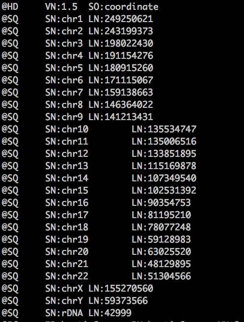{#fig-a-questions-21-25-003}    
 答1. 各条染色体的长度 

**2. 使用samtools view命令将test.sam文件转换成test.bam文件，并保留header区域，写出命令并记录test.sam，test.bam的文件大小。**  

```
使用的命令如下：( -b：输出文件为bam格式; -h,输出中包含header信息) 
samtools view -b -h test.sam > test.bam

结果显示test.sam文件大小是3.9M，而test.bam文件则是660K，bam文件会小很多；  
```
**3. 使用less命令分别查看test.sam，test.bam文件，为什么bam文件会输出乱码？使用samtools view命令再试试看？**

```
less命令可以正常查看sam文件，但是不能正常查看bam文件，因为bam文件是二进制文件，所以需要使用  
samtools view test.bam来查看bam文件。
```  

**4. 使用samtools sort命令对test.bam文件进行排序，输出文件名为test_sort.bam，并记录文件大小。**
首先解释一下samtools sort命令：  

```
sort命令的使用：

samtools sort [-l level] [-m maxMem] [-o out.bam] [-O format] [-n] [-T tmpprefix] [-@ threads]   
[in.sam|in.bam]  
参数：
   -l INT 设置输出文件压缩等级。0-9，0是不压缩，9是压缩等级最高。不设置此参数时，使用默认  
  压缩等级；
   -m INT 设置每个线程运行时的内存大小，可以使用K，M和G表示内存大小。
   -n 设置按照read名称进行排序；
   -o FILE 设置最终排序后的输出文件名；
   -T PREFIX 设置临时文件的前缀；
   -O FORMAT 设置最终输出的文件格式，可以是bam，sam或者cram，默认为bam；
   -@ INT 设置排序和压缩是的线程数量，默认是单线程。
```
```
对test.bam进行排序，不压缩，默认线程，设置最终输出名称为test_sort.bam，  
默认临时文件前缀，默认输出bam文件，默认单线程；
使用命令如下：
samtools sort -o test_sort.bam test.bam

结果显示  test.bam 660K; test_sort.bam 660K 也就是排序之后的bam文件大小不变。
```


**5. 使用samtools index 对test_sort.bam建立index，写出命令并记录其文件大小。**  

```
samtools index [-bc] [-m INT] <in.bam> [out.index]  
参数：
-b 创建bai索引文献(默认);
-c 创建csi索引文献;
-m INT 创建csi索引文献，最小间隔值2^INT;

> samtools index test_sort.bam    

> ls -hs   

结果： test_sort.bam.bai 4.0K
```


**6. 使用samtools tview使用下面的命令查看chr1:160000-160100区域的比对情况，并截图**  
 
```
使用的命令如下：
samtools tview -p chr1:160000-160100  test_sort.bam 
```  

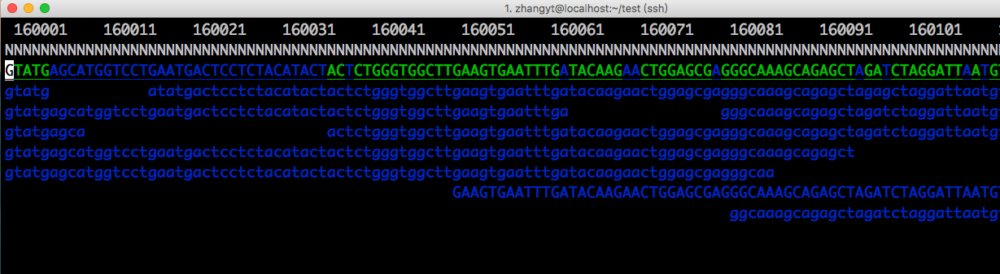{#fig-a-questions-21-25-004}     
   答2. chr1:160000-160100区域的比对情况 
 

#### 4. 参考资料 {#question-21-265}

资料1：本次主要是对samtools的一个应用，我建议大家直接看samtools的说明文档，比如对于view功能，直接在命令行敲击samtools view，再按回车就能出现说明文档，如下图所示

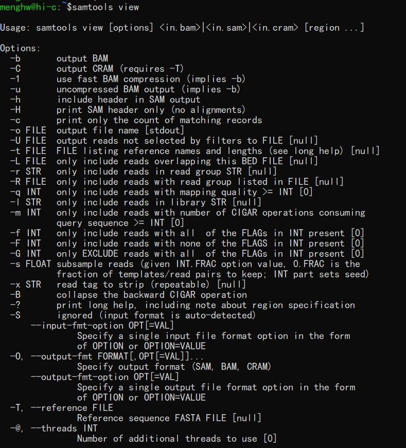{#fig-a-questions-21-25-005}  

 图1 samtools view的说明文档  

[资料2：samtools manual page](https://link.zhihu.com/?target=http%3A//www.htslib.org/doc/samtools.html)


#### 5. 多说几句话 {#question-21-279}

大家以后要用的软件种类非常多，不可能所有的软件你都学过，总有一个从不会到会的过程。在学习使用各种软件的过程中要学会类比，要学会推理，要想清楚我们的input是什么output是什么。不能乱搞一气，想不明白其中的道理，就像一个黑盒子，最后就是你不知道扔进去是什么，也不知道扔出来是什么，这不完蛋了？

至于软件使用方法的学习，一定要多看官方的说明文档！入门的时候看看别人的介绍或者是指导资料什么的尚可，但是一定有了一定基础以后一定要多阅读官方的说明文档，受益无穷的！

## 测序深度与复杂度 {#sec-04-07}

能区分数据量、有效信息量和覆盖不足。

#### 覆盖度估算 {#src-0070-WGS-9}

假设构建的基因组文库无区域偏好性，测序片段来自于基因组各个区域的概率均等，则我们可以估计特定建库方式下，一定的library size的序列所能覆盖的基因组区域

已知目标基因组的长度为$G$，测序片段长度（read size）为$S$，library size为$N$，则某一条read来自于一个长度为$L$的基因组区段的概率为$\frac{L}{G}$

此时，设随机变量：


$$
D=起始于一个长度为L的区段的reads数
$$ {#eq-04-quality-control-and-alignment-001}


则D服从二项分布：


$$
D \sim Binomial(N,\frac{L}{G})
$$ {#eq-04-quality-control-and-alignment-002}


令$L=S$，则起始于该长度为S的区段的reads，均覆盖该区段的最后一个碱基，即此时D就是该碱基位置的测序深度

我们知道，对于二项分布，当其实验次数$N\to \infty$，概率$P\to 0$时，二项分布近似于泊松分布，在这里，因为$S<<G$，则$P=\frac{S}{G} \to 0$，且$N$非常大，可以用泊松分布近似，即：


$$
D \sim Possion(\lambda), 其中\lambda=N\frac{S}{G}
$$ {#eq-04-quality-control-and-alignment-003}


因此，我们获得了全基因组各碱基位点的测序深度的概率分布（概率质量分布PMF）估计，如下图（以$\lambda=40$为例）：

{#fig-04-quality-control-and-alignment-038}

依据测序深度的概率分布，可以很容易推出测序深度大于指定阈值$d$的基因组区域比例：


$$
P(D\ge d) = \sum_{i=d,...,\infty}P(D=i)
$$ {#eq-04-quality-control-and-alignment-004}


不过实际的基因组测序深度分布与泊松分布并不完全一致，由于GC偏好性等因素的影响，之前推导过程中依据的全基因组来源等概率的假设并不完全成立，从而使实际的分布相对于理论分布，存在明显的overdispersion（即$Var(D) > E(D)$）


{#fig-04-quality-control-and-alignment-038-repeat-2}

 

Bentley et al, Nature, 2008


{#fig-04-quality-control-and-alignment-039}

 

Shen et al, Nature, 2008

::: {.callout-note title="待完善" collapse="true"}
先给直观例子，将较长推导放到扩展框。
:::

### 重复 reads 与文库复杂度

避免对所有实验套用同一去重复策略。

#### 去除bam文件中的PCR扩增冗余 {#src-0040-mapping-and-BAM-operation-433}

这一步，我们经常叫`remove duplication`。所谓的duplication一般是指构建测序文库的过程中，会有PCR扩增的步骤，这个步骤往往会对片段进行多次扩增。如果有来源于同一个原始片段的测序结果比对到了基因组上，有可能会对我们的下游分析造成一些影响。所以，某些情况下需要对bam文件进行冗余的去除，这里的冗余一般习惯上称为`duplication`。

去除duplication的方法一般有两种，1个是使用samtools rmdup命令，另一个是使用GATK/Picard工具中的MarkDuplicates。

```
samtools rmdup ERR188245_chrX.sorted.bam ERR188245_chrX.sorted.rmdup.bam

```
由于samtools的算法是针对单端测序的，故而在对双端测序的bam文件处理效果奇差无比，在处理双端测序的文件时，通常我们更推荐使用gatk或者Picard。

首先对duplicate进行标记

```
gatk MarkDuplicates -I ERR188245_chrX.sorted.bam -O ERR188245_chrX.sorted.mkdup.bam -M ERR188245_chrX.metrics --CREATE_INDEX

```

接着就是移除duplicate，但一般也只是标记不移除。

```
gatk MarkDuplicates REMOVE_DUPLICATES=true -I ERR188245_chrX.sorted.mkdup.bam -O ERR188245_chrX.sorted.rmdup.bam -M ERR188245_chrX.metrics

```

或者使用Picard一步进行上述GATK的两步过程：

```
java -jar picard.jar MarkDuplicates I=ERR188245_chrX.sorted.bam O=ERR188245_chrX.sorted.mkdup.bam M=ERR188245_chrX.metrics ASO=coordinate REMOVE_DUPLICATES=true
```

关于samtools的用法其实很多，但限于篇幅，我们只对最常用的几个命令进行了简单介绍，对于组学分析中的其他应用可以参考接下来各章的介绍。

#### SNV/SNP的数据前处理 {#src-0070-WGS-46}


##### 去除PCR重复 {#src-0070-WGS-48}


###### duplicate产生原因 {#src-0070-WGS-50}


{#fig-04-quality-control-and-alignment-040}

 

- **PCR duplicates（PCR重复）**

PCR扩增时，同一个DNA片段会产生多个相同的拷贝，第4步测序的时候，这些来源于同！一！个！拷贝的DNA片段会结合到Fellowcell的不同位置上，生成完全相同的测序cluster，然后被测序出来，这些相同的序列就是duplicate

- **Cluster duplicates**

生成测序cluster的时候，某一个cluster中的DNA序列可能搭到旁边的另一个cluster的生成位点上，又再重新长成一个相同的cluster，这也是序列duplicate的另一个来源，这个现象在Illumina HiSeq4000之后的Flowcell中会有这类Cluster duplicates

- **Optical duplicates（光学重复）**

某些cluster在测序的时候，捕获的荧光亮点由于光波的衍射，导致形状出现重影（如同近视散光一样），导致它可能会被当成两个荧光点来处理。这也会被读出为两条完全相同的reads

- **Sister duplicates**

它是文库分子的两条互补链同时都与Flowcell上的引物结合分别形成了各自的cluster被测序，最后产生的这对reads是完全反向互补的。比对到参考基因组时，也分别在正负链的相同位置上，在有些分析中也会被认为是一种duplicates。

###### 用泊松分布解释duplicate问题 {#src-0070-WGS-70}

求解duplicate rate，相当于是在问这样一个问题：

> 对于已经建好的测序文库，其中有N种序列片段，每条片段长度均为l，每种片段的拷贝数为$k_i(i=1,...,N)$，文库大小（library size）为M，即：
>
> 

$$
M=\sum_{i=1}^{N}k_i
$$ {#eq-04-quality-control-and-alignment-005}


>
> 现在，从这个文库M中随机抽取m条序列($m \ll M$)，进行测序
>
> 问：duplicate rate为多少？

先给大家一个结论：


$$
duplicate\,rate \approx 1-\frac{\lambda N}{M}
$$ {#eq-04-quality-control-and-alignment-006}


其中$\lambda=Ml/G$，当原始文库确定（即测序对象G确定，且片段长度l和总文库大小M确定）时，$\lambda/M$是一个常数，此时$duplicate\,rate \approx 1-kN$，即此时duplicate rate只与原始文库中序列片段的种类数$N$有关，且是负相关

具体的推导过程，请阅读以下部分

解：

下面采用逆向思维来完成这个推导过程

假设，我们可以知道这$m$条序列中总共有$n$种片段，则我们可以很容易地求出目标duplicate rate $d$为：


$$
d=1-\frac{n}{m}
$$ {#eq-04-quality-control-and-alignment-007}

<!-- Original equation tag: 1 -->


那么，这个$n$为多少呢？

现在问题变成了：

> 从这个文库$M$中随机抽取$m$条序列($m \ll M$)，理论上我们能抽中多少种片段？

对于原始文库中的任意一种片段$i$，设以下随机变量：


$$
X_i = \left\{ 
  \begin{array}{ll}
    1 & 该片段被至少抽中一次 \\
    0 & 该片段未被抽中
  \end{array}
\right.
$$ {#eq-04-quality-control-and-alignment-008}


注：当随机变量按照以上形式进行设定时，该随机变量的分布函数称为**示性函数**

则总共被抽中的片段种类为：


$$
n=\sum_{i=1}^{N}X_i
$$ {#eq-04-quality-control-and-alignment-009}

<!-- Original equation tag: 2 -->


我们需要求出$n$的期望，又


$$
E(n)=E(\sum_{i=1}^{N}X_i)=\sum_{i=1}^{N}E(X_i)
$$ {#eq-04-quality-control-and-alignment-010}

<!-- Original equation tag: 3 -->


则我们需要求出其中$E(X_i)$的通式

对于原始文库中的任意一种片段$i$，还可以设以下随机变量：


$$
\theta_i=该种片段被抽中的次数
$$ {#eq-04-quality-control-and-alignment-011}


则$\theta_i$服从二项分布：$\theta_i \sim Binomial(m, \frac{k_i}{M})$

又由于$\frac{k_i}{M} \to 0$，且$m$也比较大，所以$\theta_i$服从泊松分布，即：$\theta_i \sim Possion(\lambda_i)$，其中$\lambda_i=\frac{m\cdot k_i}{M}$

则


$$
\begin{aligned}
&\quad E(X_i) \\
&= P(X_i=1) \\
&= P(\theta_i\ge 1) \\
&= 1-P(\theta_i=0) \\
&= 1-e^{-\lambda_i} \\
&= 1-e^{-m\cdot k_i/M}
\end{aligned}
$$ {#eq-04-quality-control-and-alignment-012}

<!-- Original equation tag: 4 -->


这是我们在已知原始文库中该片段拷贝数$k_i$的情况下，能得出的结果，若我们不知道，则可以知道$k_i \sim Possion(\lambda)$，其中$\lambda=\frac{M\cdot l}{G}$，上式(4)就变成了


$$
E(X_i)=E(1-e^{-m\cdot k_i/M})=\sum_{k=0}^{\infty} (1-e^{-m\cdot k_i/M})\cdot p_k
$$ {#eq-04-quality-control-and-alignment-013}

<!-- Original equation tag: 5 -->


而且每种片段被抽中的可能性均满足(5)

所以


$$
E(n)=\sum_{i=1}^{N}E(X_i)=N\cdot E(X_i)=N\cdot \sum_{k=0}^{\infty} (1-e^{-m\cdot k_i/M})\cdot p_k
$$ {#eq-04-quality-control-and-alignment-014}

<!-- Original equation tag: 6 -->


所以


$$
\begin{aligned}
&\quad d \\
&=1-\frac{E(n)}{m} \\
&=1-\frac{N}{m}\sum_{k=0}^{\infty} (1-e^{-m\cdot k_i/M})\cdot p_k \\
&=1-\frac{N}{m}\sum_{k=0}^{\infty} (1-e^{-m\cdot k_i/M})\cdot \frac{\lambda^k}{k!}e^{-\lambda} \\
&=1-\frac{N}{m}+\frac{Ne^{-\lambda}}{m}\sum_{k=0}^{\infty} \frac{1}{k!}(\lambda e^{-m/M})^k
\end{aligned}
$$ {#eq-04-quality-control-and-alignment-015}

<!-- Original equation tag: 7 -->


上式(7)中的$\sum_{k=0}^{\infty} \frac{1}{k!}(\lambda e^{-m/M})^k$（其中$\lambda e^{-m/M} \to 0$）近似指数函数$e^x$在$(0, f(0))$处的泰勒展开式：


$$
e^x=\sum_{n=0}^{\infty} \frac{x^n}{n!}
$$ {#eq-04-quality-control-and-alignment-016}

<!-- Original equation tag: 8 -->


因此，可以得到


$$
\begin{aligned}
&\quad d \\
&=1-\frac{N}{m}+\frac{Ne^{-\lambda}}{m}\sum_{k=0}^{\infty} \frac{1}{k!}(\lambda e^{-m/M})^k \\
&\approx1-\frac{N}{m}+\frac{Ne^{-\lambda}}{m}\cdot e^{\lambda e^{-m/M}} \\
&=1-\frac{N}{m}\left(1-e^{-\lambda}\cdot e^{\lambda e^{-m/M}}\right) \\
&=1-\frac{N}{m}\left(1-e^{\lambda (e^{-m/M}-1)}\right)
\end{aligned}
$$ {#eq-04-quality-control-and-alignment-017}

<!-- Original equation tag: 9 -->


由于$m \ll M$，则$-m/M \to 0^-$，且由于$e^x$在$x=0$处的一阶泰勒公式为：$e^x=1+x+o(x)$，则此时$e^{-m/M} \approx 1-m/M$

则(9)可以化简为：


$$
\begin{aligned}
&\quad d \\
&\approx 1-\frac{N}{m}(1-e^{-\lambda m/M}) \\
&\approx 1-\frac{N}{m}[1-(1-\lambda m/M)] \\
&=1-\frac{N}{m}\frac{\lambda m}{M} \\
&=1-\frac{\lambda N}{M}
\end{aligned}
$$ {#eq-04-quality-control-and-alignment-018}

<!-- Original equation tag: 10 -->


故，最终得到


$$
d\approx 1-\frac{\lambda N}{M}
$$ {#eq-04-quality-control-and-alignment-019}


###### PCR bias的影响 {#src-0070-WGS-208}

1. DNA在打断的那一步会发生一些损失，主要表现是会引发一些碱基发生颠换变换（嘌呤-变嘧啶或者嘧啶变嘌呤），带来假的变异。PCR过程会扩大这个信号，导致最后的检测结果中混入了假的结果；

2. PCR反应过程中也会带来新的碱基错误。发生在前几轮的PCR扩增发生的错误会在后续的PCR过程中扩大，同样带来假的变异；

3. 对于真实的变异，PCR反应可能会对包含某一个碱基的DNA模版扩增更加剧烈（这个现象称为PCR Bias）。因此， 如果反应体系是对含有reference allele的模板扩增偏向强烈，那么变异碱基的信息会变小，从而会导致假阴。


{#fig-04-quality-control-and-alignment-041}


###### 操作 {#src-0070-WGS-218}


{#fig-04-quality-control-and-alignment-042}


**1. 排序（SortSam）**

- 对sam文件进行排序并生成bam文件，将sam文件中同一染色体对应的条目按照坐标顺序从小到大进行排序
- GATK4的排序功能是通过`picard SortSam`工具实现的。虽然`samtools sort`工具也可以实现该功能，但是在GATK流程中还是推荐用picard实现，因为SortSam会在输出文件的头信息部分添加一个SO标签用于说明文件已经被成功排序，且**这个标签是必须的**，GATK需要检查这个标签以保证后续分析可以正常进行
- `https://software.broadinstitute.org/gatk/documentation/tooldocs/current/picard_sam_SortSam.php`

```bash
# 使用GATK命令
$ gatk SortSam -I mapping/T.chr17.sam -O preprocess/T.chr17.sort.bam -R database/chr17.fa -SO coordinate --CREATE_INDEX
# 使用picard命令
$ java -jar picard.jar SortSam \
      I=input.bam \
      O=sorted.bam \
      SORT_ORDER=coordinate
```


{#fig-04-quality-control-and-alignment-043}


如何检查是否成功排序？

```bash
$ samtools view -H /path/to/my.bam
@HD     VN:1.0  GO:none SO:coordinate
@SQ     SN:1    LN:247249719
@SQ     SN:2    LN:242951149
@SQ     SN:3    LN:199501827
@SQ     SN:4    LN:191273063
@SQ     SN:5    LN:180857866
@SQ     SN:6    LN:170899992
@SQ     SN:7    LN:158821424
@SQ     SN:8    LN:146274826
@SQ     SN:9    LN:140273252
@SQ     SN:10   LN:135374737
@SQ     SN:11   LN:134452384
@SQ     SN:12   LN:132349534
@SQ     SN:13   LN:114142980
@SQ     SN:14   LN:106368585
@SQ     SN:15   LN:100338915
@SQ     SN:16   LN:88827254
@SQ     SN:17   LN:78774742
@SQ     SN:18   LN:76117153
@SQ     SN:19   LN:63811651
@SQ     SN:20   LN:62435964
@SQ     SN:21   LN:46944323
@SQ     SN:22   LN:49691432
@SQ     SN:X    LN:154913754
@SQ     SN:Y    LN:57772954
@SQ     SN:MT   LN:16571
@SQ     SN:NT_113887    LN:3994
...
```

若随后的比对记录中的contig那一列的顺序与头文件的顺序一致，且在头信息中包含`SO:coordinate`这个标签，则说明，该文件是排序过的

**2. 标记重复（Markduplicates）**

- 标记文库中的重复
- `https://software.broadinstitute.org/gatk/documentation/tooldocs/current/picard_sam_markduplicates_MarkDuplicates.php`

```bash
gatk MarkDuplicates -I preprocess/T.chr17.sort.bam -O preprocess/T.chr17.markdup.bam -M preprocess/T.chr17.metrics --CREATE_INDEX

```


{#fig-04-quality-control-and-alignment-044}


::: {.callout-note title="待完善" collapse="true"}
补 UMI 思路、处理适用条件及影响比较。
:::

### 知识问答 9：重复序列与文库复杂度 {#question-06-227}

#### 原题描述 {#question-06-228}

今天我们来详细聊聊duplicate问题。duplicate的产生主要是因为Illumina建库的过程中，一般会需要使用PCR来帮助扩增插入序列的浓度。在扩增的过程中，如果PCR扩增轮数过大，就会出现duplicate的问题，即产生一模一样的若干条序列。

FastQC中“Sequence Duplication Levels”图是用来刻画duplicate情况的。
 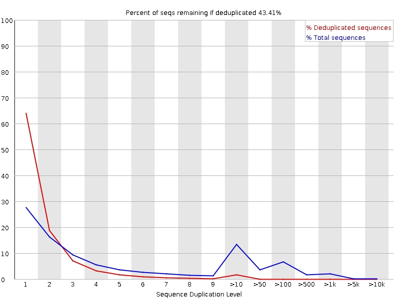{#fig-a-questions-06-10-010}
 
  图1 duplicate结果图


#### 参考答案 {#question-06-240}

**1.图1中的横坐标是什么意思，纵坐标是什么意思？**

```
横坐标代表序列重复水平；纵坐标代表重复水平序列占所有序列的百分比。
```
**2.图1中的红线和蓝线分别代表什么意思？**

```
红线代表去duplicate之后序列理论重复性分布（服从possion distribution 或者 binomial distribution）情况，
蓝线代表全部的序列重复性分布情况。
```
**3.图1中的duplicate是全部序列的duplicate的情况吗？还是随机筛选了一部分？为什么要这样做？**

```
是选择的每一个文件里前100,000条序列作为样本进行的计算，因为样本本身很大，前100,000已经能够代表样本的重复性。
```
**4.如果让你写程序，判断1个fastq文件中duplicate的比例，你的大概思路是什么？**

```
# Python风格的伪代码：

# 第1步对序列进行排序	
sort the FASTQ file by the sequence, and names as sorted_file;

# 第2步对排序的序列统计是否为duplicate
total_num = 1
duplication_num = 0

reads_1 = sorted_file.readline()
for reads_2 in sorted_file
    if reads_1 == reads_2
        duplication_num = duplication_num +1
    else 
        reads_1 = reads_2
    total_num = total_num +1
print total_num 
print duplication_num
```


#### 能力扩展题： {#question-06-280}

**5.既然谈到了duplicate的问题，那就存在remove duplicate的问题，什么情况下应该去duplicate，什么情况下不去除？ （仅需要思考一下，以后我们会有专题讨论这个问题）**

```
DNA-Seq中序列如果是随机打断需要考虑deduplicaion；酶切的样本一般不需要考虑这个问题；
RNA-Seq一般不考虑remove duplication（有paper专门讨论过这个问题）；
单细胞测序需要建库过程中需要添加random barcode，且必须考虑duplication。
```

## IGV {#sec-04-08}

确认数据足以支持目标分析，并发现流程中的明显错误。

### IGV可视化查看比对结果 {#src-0040-mapping-and-BAM-operation-467}

虽然使用samtools的flagstat或者qualimap2可以从一个总体的情况得知整个fq的比对情况，但有时候，我们可能只是想看染色体上某一段区域，又或者还想直观的看编码区之类的比对情况，那这个时候就需要一个可视化的基因浏览器---IGV（Integrative Genomics Viewer）。
首先国际惯例，如何找到这个软件

打开bing，搜索IGV


{#fig-04-quality-control-and-alignment-025}


本次以桌面版为例


{#fig-04-quality-control-and-alignment-026}


{#fig-04-quality-control-and-alignment-027}


而后按照指示安装完成之后，我们来处理一下我们的bam文件，为导入到IGV里做准备

```
#如果还没对序列排序，记得先排序
samtools sort -@ 2 -o ERR188044_chrX.sorted.bam ERR188044_chrX.bam

#排好序之后，对bam文件建立index
samtools index -@ 2 ERR188044_chrX.sorted.bam ERR188044_chrX.sorted.bai

```

而后我们打开安装好的IGV，可以看到如下界面


{#fig-04-quality-control-and-alignment-028}


选择File--> Load from File--->加载想要查看的bam文件

导入成功后，可以选择染色体，由于我们的测序只测了chrX，故而选择chrX


{#fig-04-quality-control-and-alignment-029}


{#fig-04-quality-control-and-alignment-030}


{#fig-04-quality-control-and-alignment-031}


不断双击想查看的位置，即可放大该位置


{#fig-04-quality-control-and-alignment-032}


IGV工具是可视化bam文件的一个非常好的方法，好好利用可以事半功倍地帮助我们检查bam文件中的比对问题，更好地展示结果。

::: {.callout-note title="待完善" collapse="true"}
新增统一 QC 检查表；专题特异指标留到对应章展开。
:::

## 下载公共数据进行分析 {#sec-04-09}

能将论文中的数据编号转化为清晰的分析输入。

待完善
