# 测序结果的比对 {#sec-ch04}

::: {.hero-book .book-chapter-summary}

## 本章提要 {#chapter-summary-04 .unnumbered}

本章从参考基因组、参考转录本和基因注释出发，理解序列为什么能够定位到参考资源，以及怎样选择合适的比对策略。我们会介绍双序列比对、mapping 和 BLAST 等概念，练习 SAM/BAM 的查看、转换、排序与过滤，再讨论测序深度、文库复杂度和 IGV 中的结果检查。最后从公共数据库获取数据，把参考资源与实际输入对应起来。学习的重点是理解文件、参数和处理结果之间的联系。

:::

## 概览 {#sec-04-01}

经过上一章的质控，我们手上已经有了干净的测序数据（clean reads）。本章的核心任务用一句话概括：**把处理后的 clean reads 通过比对放回参考基因组，得到记录每条 read 位置与比对情况的 BAM 文件**。围绕这条主线，我们依次认识参考基因组与常用注释（比对的“地图”），学习序列比对的算法原理（双序列比对、BLAST、哈希表与 BWT），根据数据特点选择比对软件并实际操作，把结果保存成 SAM/BAM 文件，做排序、过滤与统计，用 IGV 目视检查，最后把公共数据库的数据下载下来作为练习输入。本章就沿着这条主线展开：先认识参考基因组与常用注释（它们是比对的“地图”），再学习序列比对的算法原理（双序列比对、BLAST、哈希表与 BWT），然后根据数据特点选择比对软件并实际操作，把结果保存成 SAM/BAM 文件，做排序、过滤与统计，用 IGV 目视检查，最后把公共数据库的数据下载下来作为练习输入。

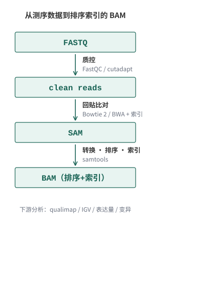{#fig-a-questions-16-20-001}

如 @fig-a-questions-16-20-001 所示，从 FASTQ 到 SAM 的每一步都有明确的输入和输出。看清楚每一步“进去的是什么、出来的是什么”，是本章反复强调的阅读方式，也是全书训练判断力的方式。

## 参考基因组 {#sec-04-02}

选取相互兼容的参考资源并理解注释差异。

比对的第一件事不是选软件，而是确定比对的“地图”：参考基因组。它是一份由多家研究机构共同维护、尽可能准确和完整的物种 DNA 序列，以 FASTA 格式发布。我们在第 3 章见过 FASTA，这里要强调的是**版本**。

- 人类参考基因组最常用的两个版本是 GRCh37（UCSC 称为 hg19，2009 年发布）和 GRCh38（hg38，2013 年发布）；2022 年发布的 T2T-CHM13 进一步补全了末端的重复区域。版本越新不代表“更适合所有分析”——大量已有工具、注释和教程仍基于 GRCh37/hg19，本书的教学示例也使用 hg19。关键是**全流程保持同一个版本**：参考 FASTA、注释文件、软件索引必须来自同一版本，混用会导致坐标错位。
- 常用的下载来源有 UCSC Genome Browser、Ensembl 与 NCBI RefSeq。它们发布的序列基本一致，但染色体命名有细微差别（例如 Ensembl 用 `1`，UCSC 用 `chr1`），注释的基因集合也不完全相同，后一小节会展开。
- 本书各链接均于 2026 年 10 月核对可访问。网站界面会随版本更新调整，按钮位置可能变化，但操作逻辑是一致的：进入官网，找到下载入口，选好物种与版本，再选格式（FASTA 或 GTF/GFF）。

参考基因组长什么样？ @tbl-04-hg38-chrom-lengths 列出了 hg38 每条染色体的长度（数据取自 UCSC hg38 chromInfo，2026 年 10 月核对）。几个值得留意的数字：

- 22 条常染色体加两条性染色体共约 3.09 Gb；最长的 chr1 约 2.49 亿碱基，最短的 chr21 约 4,670 万。
- chrM 只有 16,569 bp，是线粒体基因组：它独立于核基因组、完全来自母系，细胞里拷贝数又极高，比对时 reads 数常常异常多，分析中一般要单独对待（第 7 章 WGS 还会遇到它）。
- 表中的长度包含大量 **N**：N 代表尚未确定的碱基（着丝粒、端粒附近的高度重复区域），并不是真实的 A/T/C/G。这也解释了为什么参考基因组会不断推出新版本——补全这些区域正是 T2T-CHM13 的主要贡献。

| 染色体 | 长度（bp） | 染色体 | 长度（bp） |
| --- | ---: | --- | ---: |
| chr1 | 248,956,422 | chr13 | 114,364,328 |
| chr2 | 242,193,529 | chr14 | 107,043,718 |
| chr3 | 198,295,559 | chr15 | 101,991,189 |
| chr4 | 190,214,555 | chr16 | 90,338,345 |
| chr5 | 181,538,259 | chr17 | 83,257,441 |
| chr6 | 170,805,979 | chr18 | 80,373,285 |
| chr7 | 159,345,973 | chr19 | 58,617,616 |
| chr8 | 145,138,636 | chr20 | 64,444,167 |
| chr9 | 138,394,717 | chr21 | 46,709,983 |
| chr10 | 133,797,422 | chr22 | 50,818,468 |
| chr11 | 135,086,622 | chrX | 156,040,895 |
| chr12 | 133,275,309 | chrY | 57,227,415 |
| chrM | 16,569 | | |

: hg38（GRCh38）各染色体的长度（含 N 碱基） {#tbl-04-hg38-chrom-lengths}

那有多少物种已经有了参考基因组？以 NCBI 为例，其 Assembly 数据库 2021 年就突破了 100 万个基因组装配，如今仅原核生物的归档就超过 200 万个，覆盖数万个物种[^ncbi-assembly-counts]；真核生物方面，2024 年的统计是已有超过 41,000 个装配、覆盖约 2,300 个已命名物种，且仍在快速增长[^eukaryotic-assemblies-2024]。对初学者更重要的是另一个事实：人、小鼠、大鼠、鸡、拟南芥、斑马鱼、酵母等常用模式生物都有维护良好的参考基因组，直接下载即可使用。

### 构建参考基因组索引 {#src-0050-RNA-seq-210}

获取到 clean reads 之后，需要把它们**回贴（mapping）**到参考基因组上——也就是确定每条 read 在参考基因组上的来源位置（alignment 与 mapping 的概念辨析见 4.4.1）。这一步是几乎所有有参考基因组分析的起点，后续 RNA-Seq、ChIP-Seq、WGS 都要用到同样的操作。

但 mapping 面临一个现实问题：输入常常是上千万条 reads，参考基因组又有约 30 亿碱基，逐条做精确比对运算量完全不可行（4.4.2 会算这笔账）。解决之道就是**先给参考基因组建立一个索引**：把基因组预处理成一套方便快速查询的数据结构，就像给一本 30 亿字的书先编好目录，之后每条 read 的定位都能在瞬间完成。建索引只需要做一次，之后可以反复使用。

常用的 mapping 软件各有自己的索引格式，但都遵循“建索引一次、比对多次”的套路：

- 二代短读长：**BWA**[^alignment-bwa]、**Bowtie**[^alignment-bowtie]、**Bowtie2**、**HISAT2**（RNA-Seq 剪接比对，见 4.5）；
- 三代长读长：早期常用 BLASR（用 `sawriter` 建库、`blasr` 比对），当前的事实标准是 **minimap2**，PacBio 官方流程中的 pbmm2 也是基于它实现的。

软件会更新换代，但“为参考序列建索引、再把 reads 定位上去”的逻辑没有变。以 Bowtie2 为例，建立 index 的输入是参考基因组序列（FASTA 格式）和 1 个我们指定的 index 名称，输出是若干个以该名称为开头的 index 文件：

```{.bash data-book-role="code"}
bowtie2-build hg19_only_chromosome.fa  hg19_only_chromosome
```

其中 `bowtie2-build` 为建立 index 的命令；`hg19_only_chromosome.fa` 为参考基因组（FASTA 格式）；`hg19_only_chromosome` 是我们指定的 index 名称。执行完成后会生成以它为前缀的 6 个 `.bt2` 索引文件（形如 `hg19_only_chromosome.1.bt2` 到 `hg19_only_chromosome.rev.2.bt2`），调用 index 时使用的名字就是 `hg19_only_chromosome`。

为什么 bowtie、bowtie2、bwa 的索引能做到又小又快？靠的正是 **BWT/FM 索引**——具体算法推导在本章 4.4.6 一节，这里先记住结论：有了索引，比对软件可以把序列定位问题的时间复杂度降到对数级别。

::::: {.callout-tip .book-example title="示例与练习｜为什么要建索引？参考转录组的 U 要不要换成 T？"}

**问题 1**：为什么 FASTQ 文件的快速比对需要建立 index？

**参考解答**：主要是为了加快比对速度。Index 简单来说就是若干个文件，方便程序快速地访问及搜索基因组；在 Index 的帮助下，比对软件可以把序列比对问题的时间复杂度大大降低。

**问题 2**：如果从网站上下载的是一个物种的**参考转录组**序列，其中包含 A、U、C、G 碱基；而我的 FASTQ 是该物种转录组测序的结果，用 A、T、C、G 四种碱基表示。那么建 index 之前，需要把参考转录组中的 U 全部换成 T 吗？

**参考解答**：需要转化，因为比对程序并不能将 U 直接识别为 T。

:::::

::::: {.callout-tip .book-example title="示例与练习｜下载 chr1 并建立索引"}

请在 Linux 环境下，下载 human genome 19 参考基因组的 1 号染色体序列，并使用 bowtie2 建立 index。

**参考解答**：

- 下载 1 号染色体序列（该链接 2026 年 10 月核对可访问）：

```{.bash data-book-role="code"}
wget -c -P ./test https://hgdownload.soe.ucsc.edu/goldenPath/hg19/chromosomes/chr1.fa.gz &
# -P，将文件下载到指定目录中
# -c，断点续传
# &，后台运行
```

- 下载得到的文件为 chr1.fa.gz，是 gzip 压缩格式，先解压：

```{.bash data-book-role="code"}
gzip -d ./test/chr1.fa.gz
```

- 解压得到 chr1.fa，下一步建立 index：

```{.bash data-book-role="code"}
bowtie2-build ./test/chr1.fa ./test/chr1_bowtie2_index
```

- 得到以 `chr1_bowtie2_index` 为前缀的 6 个 `.bt2` 文件，注意调用 index 时使用的名字为 `chr1_bowtie2_index`。

:::::

[]{#src-0050-RNA-seq-241}

## 参考转录本与基因注释 {#sec-04-03}

### 为什么需要基因注释 {#sec-04-03-why-annotation}

有了参考基因组这张“地图”，还需要一张“标注图”：告诉分析软件哪里是基因、哪里是外显子——这就是基因注释文件的用处。

我们的基因在基因组上的结构不是连续的，而是被 exon-intron-exon（exon=外显子，intron=内含子）分隔开的。基因要表达，首先会转录出包含 intron 的 pre-mRNA，再经过可变剪接、加 5' 帽子、3' PolyA 尾巴等加工过程，才形成成熟的 mRNA（ @fig-a-questions-21-25-008 ）。

{#fig-a-questions-21-25-008}

正因为 mRNA 由外显子拼接而来，在转录组比对中经常要处理**跨越两个外显子的 reads**：它对应的基因组序列中间隔着内含子。这时就需要基因注释告诉比对软件哪里是 exon、哪里是 intron。所以基因注释文件的核心内容就是一大堆基因（以及转录本、外显子、编码区）在基因组上的坐标，加上这些特征的属性。

### GTF 与 GFF 文件 {#src-0050-RNA-seq-218}

基因注释文件最常见的两种格式是 GTF（Gene Transfer Format）和 GFF（General Feature Format）。GFF 有若干版本，一般认为 GTF 就是 GFF 2.0 版本；两者只是格式细节不同，信息内容完全可以等价，很多工具可以互相转换。

一个标准的 GTF/GFF2.0 文件每行 9 列、以 TAB 分隔。与其抽象地背定义，不如直接看一段真实的注释（人类 SGIP1 基因在 hg19 上的部分注释行， @fig-a-questions-21-25-009 是同样内容的截图）：

```{.text data-book-role="data" data-code-title="GTF 数据（SGIP1 基因节选）"}
chr1	hg19_ncbiRefSeq	exon	66999252	66999355	0.000000	+	.	gene_id "SGIP1"; transcript_id "NM_001308203.1";
chr1	hg19_ncbiRefSeq	exon	66999929	67000051	0.000000	+	.	gene_id "SGIP1"; transcript_id "NM_001308203.1";
chr1	hg19_ncbiRefSeq	start_codon	67000042	67000044	0.000000	+	.	gene_id "SGIP1"; transcript_id "NM_001308203.1";
chr1	hg19_ncbiRefSeq	CDS	67000042	67000051	0.000000	+	0	gene_id "SGIP1"; transcript_id "NM_001308203.1";
chr1	hg19_ncbiRefSeq	CDS	67091530	67091593	0.000000	+	2	gene_id "SGIP1"; transcript_id "NM_001308203.1";
chr1	hg19_ncbiRefSeq	stop_codon	67208776	67208778	0.000000	+	.	gene_id "SGIP1"; transcript_id "NM_001308203.1";
```

{#fig-a-questions-21-25-009}

对着上面的真实文件，逐列看每一列是什么意思：

- **第 1 列 seqname**：`chr1`，序列名，一般为染色体名，**必须与参考 FASTA 里的名称一致**——一个用 `chr1`、另一个用 `1` 或 `Chr1` 都会造成注释对不上。
- **第 2 列 source**：`hg19_ncbiRefSeq`，注释来源，通常是数据库名或软件名；没有则用 `.`。
- **第 3 列 feature**：`exon`、`CDS`、`start_codon`、`stop_codon`，这一行记录的特征类型；常见的还有 gene、mRNA 等。
- **第 4、5 列 start、end**：该特征在染色体上的起止坐标，**从 1 开始计数、双端都包含**。例如第一行 exon 是 66999252 到 66999355，长度就是 66999355-66999252+1=104 bp。
- **第 6 列 score**：该条注释可信度的打分，下载的官方注释文件里一般是 `0.000000` 或 `.`。
- **第 7 列 strand**：`+` 正链、`-` 负链。注意**无论基因在正链还是负链，start 都小于 end**（坐标永远按基因组正方向书写）。
- **第 8 列 frame**：读码框，只有 CDS、start_codon、stop_codon 行有意义，取值 0/1/2，表示要跳过几个碱基才遇到完整密码子的第一位（0 即该特征第 1 个碱基就是密码子第 1 位）；其他类型用 `.`。
- **第 9 列 attribute**：属性，格式为 `tag=value`，多个属性以分号分隔；最关键的是 `gene_id` 与 `transcript_id`——程序处理时会把相同 gene_id 的行汇总为同一个基因。

再看两条全局规则：9 列一律用 TAB 分隔；前 8 列必须有值，表达“空”用 `.`，第 9 列内容可长可短。

::::: {.callout-warning .book-warning title="注意｜坐标与列的三个易错点"}

1. seqname 与参考 FASTA 的染色体命名必须一致（`chr1` vs `1` 是最常见的坑）；
2. 无论正链负链，start 一律小于 end，负链基因并不是“倒着写坐标”；
3. frame 只对编码特征（CDS、start_codon、stop_codon）有意义，其他行是 `.`。

:::::

### 坐标的起点与区间边界 {#sec-04-03-coordinate-systems}

把一种文件里的区间拿到另一种工具中使用之前，要同时核对参考版本、染色体名称、坐标起点和区间边界，这四件事只要有一件对不上，同一串数字代表的就不是同一段序列。

::::: {.callout-warning .book-warning title="注意｜先核对坐标体系"}

SAM 文本中的 POS 从 1 开始计数，并且区间两端都包含；BED 通常使用从 0 开始、右端不包含（half-open）的区间。因此 BED 的 `99` 与 GTF 的 `100` 可能指同一个碱基。相同的数字不一定表示同一段序列。

:::::

以一条染色体上第 100 到第 108 个碱基的区段为例，两种体系的写法对比见 @tbl-04-coordinate-systems 。

| 坐标体系 | 起点 | 终点 | 区段宽度 |
| --- | ---: | ---: | ---: |
| GTF/GFF、SAM（1-based，双端包含） | 100 | 108 | 9 |
| BED（0-based，右端不包含） | 99 | 108 | 9 |

: 同一段序列在不同坐标体系中的写法 {#tbl-04-coordinate-systems}

系统示例与转换练习待补充。规范来源：[SAM/BAM 格式规范](https://samtools.github.io/hts-specs/SAMv1.pdf)。

[]{#question-21-351}

[]{#question-21-353}

[]{#question-21-359}

[]{#question-21-372}

[]{#question-21-421}

[]{#question-21-506}

[]{#question-21-508}

[]{#question-21-530}

[]{#question-21-540}

[]{#question-21-655}

### 从公共数据库下载注释文件 {#sec-04-03-download-annotations}

针对已经完成基因组测序计划的物种，数据库一般会同时提供参考基因组序列（FASTA）与转录组注释（GTF/GFF）。 @fig-a-questions-21-25-011 是 Ensembl 展示的已公布参考基因组的哺乳动物系统发生树——常用的模式生物（人、小鼠、大鼠、鸡、拟南芥等）都已经有非常好的注释资源，直接到网站上下载即可。下载下来的 FASTA 就是参考基因组（用于建索引），GTF 是转录组注释（一般在计算表达量时提供）。

{#fig-a-questions-21-25-011}

下载 GTF/GFF 最常用的两个网站是 UCSC Genome Browser（<https://genome.ucsc.edu>）和 Ensembl（<https://www.ensembl.org>）；注意植物要使用 Ensembl 的专门站点 Ensembl Plants（<https://plants.ensembl.org>）。

**小提示**：以下操作截图摄于 2018 年前后（本书资料整理时期），2026 年 10 月核对各网站与链接仍可访问。网站界面会随版本更新调整，按钮位置可能变化，但操作逻辑是一致的：进入网站，找到数据入口，选好物种与版本，再选择注释格式下载。

#### 从 UCSC Table Browser 下载 human 的 GTF

1. 打开 UCSC Genome Browser 网站（ @fig-a-questions-21-25-012 ）。
2. 在 Tools 里选择 Table Browser（ @fig-a-questions-21-25-013 ）。
3. 打开 Table Browser 以后，设置需要的内容（ @fig-a-questions-21-25-014 ）：clade 选 Mammal，genome 选 Human，assembly 选 hg19，track 选 RefSeq Genes。hg19 = human genome 19，是常用的 human 参考基因组版本号；RefSeq Genes 是 NCBI RefSeq 维护、经过一定程度人工审核的基因注释。
4. 点击 get output 即可下载。

{#fig-a-questions-21-25-012}

{#fig-a-questions-21-25-013}

{#fig-a-questions-21-25-014}

#### 从 Ensembl 下载 human 的 GTF

- 动物相关的信息访问 Ensembl 主站：<https://www.ensembl.org>
- 植物相关的信息访问 Ensembl 植物站：<https://plants.ensembl.org>

以下载 human hg19 版本的 GTF 为例：

1. 登录 Ensembl 网站，并跳转到 hg19 版本界面（ @fig-a-questions-21-25-015 ）。
2. 继续选择跳转到 hg19 版本界面（ @fig-a-questions-21-25-016 ）。
3. 在 hg19 版本的 Ensembl 界面中选择 download（ @fig-a-questions-21-25-017 ）。
4. 在 download 页面中选择 Download a sequence or region（ @fig-a-questions-21-25-018 ）。
5. 在左边栏选择 FTP download，然后选择下载 GTF 文件（ @fig-a-questions-21-25-018 ）。
6. 选择注释好的 GTF 进行下载（ @fig-a-questions-21-25-019 ）。

{#fig-a-questions-21-25-015}

{#fig-a-questions-21-25-016}

{#fig-a-questions-21-25-017}

{#fig-a-questions-21-25-018}

{#fig-a-questions-21-25-019}

::::: {.callout-tip .book-example title="示例与练习｜下载并比较 UCSC 与 Ensembl 的 GTF"}

请分别从 UCSC Genome Browser 和 Ensembl 下载 hg19 的转录组注释 GTF 文件，然后回答下面的问题。

**问题 1**：下载的两个文件解压后的大小差异大吗？

**参考解答**：差异较大。解压之后 UCSC 的 hg19_RefSeq_GTF 约 126M，Ensembl 的 Homo_sapiens.GRCh37.87.chr.gtf 约 1.2G（ @fig-a-questions-21-25-020 ）。

**问题 2**：用 `less` 打开两个文件，比较 transcript_id 与 gene_id 是否相同，还有哪些不同？

**参考解答**：两者的编号体系完全不同。Ensembl 的 transcript_id 以 ENST 开头、gene_id 以 ENSG 开头（全称分别是 Ensembl Transcript ID 和 Ensembl Gene ID）；UCSC（RefSeq）的两者均以 NM 开头。此外 UCSC 的注释非常简练，Ensembl 的注释信息更全面但也更冗余；RefSeq 经过人工审核的比例更大。使用策略上可以先用 UCSC 的 GTF 筛选目标基因，再用 Ensembl 的 GTF 查详细注释。

Ensembl GTF 文件示例：

```{.text data-book-role="data"}
1       havana  exon    12613   12721   .       +       .       gene_id "ENSG00000223972"; gene_version "4"; transcript_id "ENST00000456328"; transcript_version "2"; exon_number "2"; gene_name "DDX11L1"; gene_source "ensembl_havana"; gene_biotype "pseudogene"; transcript_name "DDX11L1-002"; transcript_source "havana"; transcript_biotype "processed_transcript"; havana_transcript "OTTHUMT00000362751"; havana_transcript_version "1"; exon_id "ENSE00003582793"; exon_version "1"; tag "basic";
```

UCSC GTF 文件示例：

```{.text data-book-role="data"}
chr1    hg19_ncbiRefSeq exon    66999929        67000051        0.000000        +       .       gene_id "NM_001308203.1"; transcript_id "NM_001308203.1";
```

{#fig-a-questions-21-25-020}

:::::

::::: {.callout-note .book-extension title="拓展阅读｜拼装转录本与注释修正" collapse="true"}

在转录组分析中经常听到“用 XX 软件拼装转录本”，不是说有了参考转录组还要再拼一个，而是两种场景：

1. **无参考基因组的物种**：需要先用 RNA-Seq 数据自己拼出参考转录组（包括注释信息），再做下游分析；
2. **注释非常好的物种（如 human）**：不同细胞系的转录组存在结构变异和转录本差异（比如同一个基因在参考注释中从 chr1:1000~15000 转录，在某个细胞系中实际是 chr1:980~15050），有时需要根据已知注释和测序数据做修正，常用软件有 StringTie 等（cufflinks 是更早期的工具，现在已较少使用）。

不过对于有参考转录组的物种，一般建议不要自己拼转录本、也不要做修正，意义不大——除非研究的体系非常特殊。

:::::

::::: {.callout-tip .book-example title="示例与练习｜GTF/GFF 的格式设计合理吗？"}

这是一个偏理论的讨论题：你认为 GTF/GFF 的文件格式设计合理吗？为什么？

**参考解答**：并不是非常合理。这种格式虽然包括了注释需要的全部信息，但**同一个基因的不同 elements 分散在不同行**，程序统计一个基因包含哪些元件时，需要逐行循环判断该行是否属于同一个基因，比较耗费 CPU 和内存。如果不选 GTF，而是用 UCSC Table Browser 的“all fields from selected table”文件（ @fig-a-questions-21-25-010 ），它以**一个基因为一行**，把各个元件集中在同一行里，处理起来更便捷——当然代价是丢失了逐行注释的通用性，这也是 GTF 至今仍是标准的原因。

{#fig-a-questions-21-25-010}

all fields from selected table 文件内容示例：

```{.text data-book-role="data"}
#bin	name	chrom	strand	txStart	txEnd	cdsStart	cdsEnd	exonCount	exonStarts	exonEnds	score	name2	cdsStartStat	cdsEndStat	exonFrames
1251	NM_004261.4	chr1	-	87328127	87380048	87329156	87379794	5	87328127,87333735,87346344,87368963,87379710,	87329288,87333785,87346408,87369131,87380048,	0	SELENOF	cmpl	cmpl	0,1,0,0,0,
```

:::::

::::: {.callout-tip .book-example title="示例与练习｜转录本坐标换算成基因组坐标"}

已知 transcript_id 为 NM_001308203.1、gene_id 为 SGIP1，某片段在**转录本上**的坐标是 101，它对应的**基因组**坐标是多少？注释信息如下（节选）：

```{.text data-book-role="data"}
chr1	hg19_ncbiRefSeq	exon	66999252	66999355	0.000000	+	.	gene_id "SGIP1"; transcript_id "NM_001308203.1";
chr1	hg19_ncbiRefSeq	start_codon	67000042	67000044	0.000000	+	.	gene_id "SGIP1"; transcript_id "NM_001308203.1";
chr1	hg19_ncbiRefSeq	CDS	67000042	67000051	0.000000	+	0	gene_id "SGIP1"; transcript_id "NM_001308203.1";
chr1	hg19_ncbiRefSeq	exon	66999929	67000051	0.000000	+	.	gene_id "SGIP1"; transcript_id "NM_001308203.1";
chr1	hg19_ncbiRefSeq	CDS	67091530	67091593	0.000000	+	2	gene_id "SGIP1"; transcript_id "NM_001308203.1";
chr1	hg19_ncbiRefSeq	exon	67091530	67091593	0.000000	+	.	gene_id "SGIP1"; transcript_id "NM_001308203.1";
```

**参考解答**：思路是按注释算出各 exon 的分布与长度，转录本坐标代表该位置之前各 exon 的累计长度。chr1 上该基因第一个 exon 是 66999252 到 66999355，长度 66999355-66999252+1=104；转录本坐标 101 不超过 104，说明该片段就落在第一个 exon 上，对应基因组坐标 66999252+101-1=66999352。

:::::

## 序列比对算法 {#sec-04-04}

理解速度、灵敏度与唯一定位之间的权衡。

[]{#src-0040-mapping-and-BAM-operation-8}

[]{#mapping_and_BAM}

### alignment 与 mapping {#src-0040-mapping-and-BAM-operation-10}

先统一两个贯穿本章的术语。

**比对（alignment）** 通常特指低通量的序列之间的比较：比如 10 条序列做多序列比对（multiple alignment），或者 2 条序列做双序列比对（pairwise alignment）。

**回贴（mapping）** 一般指高通量数据寻找基因组位置：比如测序得到 10M 对 read pair，要确定它们在基因组上的位置，这就是典型的 mapping 问题。

两者密切相关：所有 mapping 软件的核心思想，都是从低通量的精确比对逐步改进而来的。本节就沿着“精确比对（双序列比对）→ 启发式检索（BLAST/BLAT）→ 高通量算法（哈希表/BWT）”这条演进线，把比对算法讲清楚。

### 双序列比对：Needleman-Wunsch 与 Smith-Waterman {#src-0040-mapping-and-BAM-operation-12}

双序列比对是一切比对问题的基础：找到两条序列最佳的匹配方式。经典算法有两种：Needleman-Wunsch 算法（全局比对）和 Smith-Waterman 算法（局部比对），它们都用**动态规划（dynamic programming）**填一张打分表格：每个格子的值由左、上、左上三个邻居决定，填完整个表格后回溯，就得到最优比对。

### BLAST：启发式检索 {#src-0040-mapping-and-BAM-operation-24}

当我们在鉴定一些未知物种的时候，常规的分子生物学操作是：提取物种 DNA，用通用引物 PCR 扩增，送公司做 sanger 测序，再把序列提交到 NCBI 检索，从分子层面完成物种鉴定。在检索的过程中，面对上亿条序列的数据库，逐一做精确比对显然不现实——于是 NCBI 采用了启发式的检索工具 BLAST（Basic Local Alignment Search Tool）。

[]{#question-11-158}

[]{#question-11-160}

[]{#question-11-answer}

学习这部分内容推荐结合北京大学高歌老师《生物信息学：导论与方法》的课程视频（以下链接 2026 年 10 月核对可访问）：

1. [序列比对中的基本概念](https://www.bilibili.com/video/av10042290/?p=5)
2. [利用动态规划进行全局比对](https://www.bilibili.com/video/av10042290/?p=6)
3. [从全局比对到局部比对](https://www.bilibili.com/video/av10042290/?p=7)

我们用一个贯穿的小例子把两种算法都算一遍。假设打分规则如 @fig-a-questions-11-15-005 所示：match 得 5 分，mismatch 扣 4 分，空位罚分 $d=-5$（每个空位扣 5 分）；要比对的序列是 seq1 = AAGT 和 seq2 = AGCT，需要填写 @fig-a-questions-11-15-006 的动态规划表格。

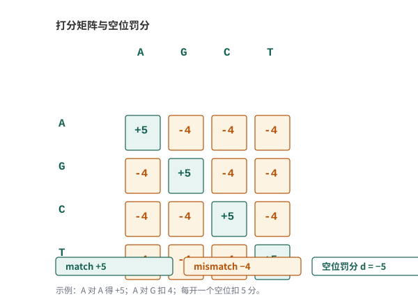{#fig-a-questions-11-15-005}

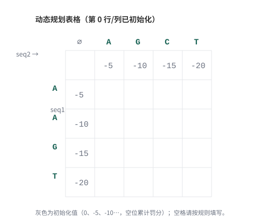{#fig-a-questions-11-15-006}

**Needleman-Wunsch（全局比对）**：从左上角出发，第 0 行第 0 列按空位数初始化（0、-5、-10……），其余每格取“对角线+匹配得分、上方-空位罚分、左方-空位罚分”三者最大值，右下角的值就是全局最优得分。填表结果见 @fig-a-questions-11-15-007 ：最优得分 5，回溯路径（图中箭头）给出最优比对。本例并列两个最优结果（得分都是 5）：

```{.text data-book-role="data"}
A A G - T        A A G - T
- A G C T        A - G C T
```

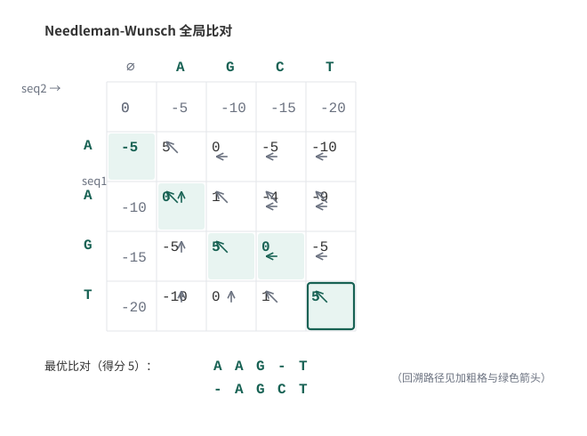{#fig-a-questions-11-15-007}

**Smith-Waterman（局部比对）**：与全局比对的差别有两点——第 0 行第 0 列全为 0；每个格子算完后如果为负就记 0。填表结果见 @fig-a-questions-11-15-009 ：矩阵最高分是 10，回溯**从得分最高的单元格开始、遇到 0 停止**（注意不是“从第一个非零的格子开始”，那是初学时常见的错误）。本例最高分 10 对应两个并列的最优局部比对：

```{.text data-book-role="data"}
A G              A G - T
A G              A G C T
```

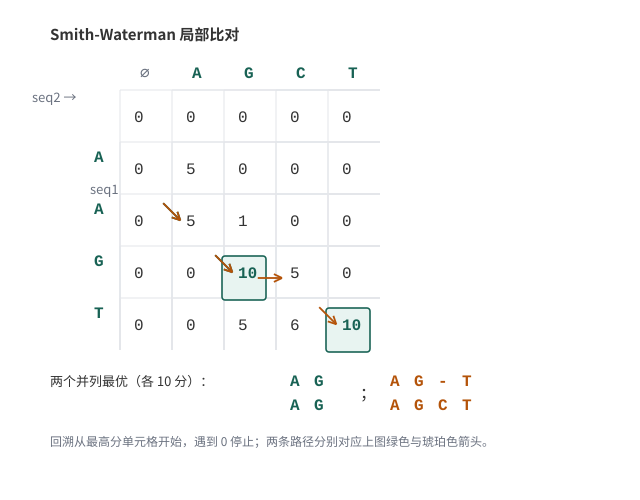{#fig-a-questions-11-15-009}

::::: {.callout-tip .book-example title="示例与练习｜亲手填出 NW 与 SW 两张表"}

拿一张纸，按 @fig-a-questions-11-15-005 的打分规则，把 @fig-a-questions-11-15-006 的空表分别用 Needleman-Wunsch 和 Smith-Waterman 填一遍，写出最终的比对结果，再对照上文两张填好的表格检查。

**检验点**：NW 右下角应为 5（两个并列最优比对）；SW 最高分应为 10（同样是两个并列最优）。如果 SW 填出了 5 分的“A/A、AAG/A-G、T/T”，说明回溯起点错了——那三个是次优结果。

:::::

::::: {.callout-tip .book-example title="示例与练习｜什么时候用全局比对，什么时候用局部比对？"}

全局比对从头到尾对序列的每一个碱基都进行比对，找两条序列整体的最优解；局部比对只找两条序列中最相似的部分，最优结果可以有多个。全局比对用处自不必说，这里单独说说局部比对的意义。随着序列信息越来越多，人们发现：

1. 某些蛋白序列虽然整体相差很大，但对某些特殊的功能域却有着极高的相似性；
2. 这些功能域在不同物种中序列和功能都相当保守，这在全局比对中很难发现；
3. 20 世纪 70 年代内含子被发现后，比对算法还必须能处理由内含子导致的大片段差异。

这也是后面 BLAST 选择“局部比对+启发式”的思想来源。

:::::

[]{#question-11-253}

[]{#question-11-255}

BLAST 为什么快？我们先算一笔账（ @fig-a-questions-11-15-010 ）。假设有 1 条 100bp 的序列 SeqA（不算长），想在核酸库中找相似序列：以 2017 年前后的 NCBI 非冗余核酸库（nt）为参照，当时库里有约 47,193,206 条序列、平均长度按 0.1Mbp 计，用精确的局部比对逐条比较至少需要 100bp × 0.1Mbp × 47,193,206 ≈ 4.7×10^14 次运算；按单核每秒约 3×10^9 次、20 个核心计算，大约需要 130 分钟——序列变成 1000bp 就是 1300 分钟。为找一个相似性花两个小时，显然不划算。

{#fig-a-questions-11-15-010}

BLAST 的解法是**启发式的 seed-and-extend**：把查询序列切成短的种子序列（word），用种子在数据库中快速定位候选区域，再只对候选区域做局部比对延伸，从而避免对全库做精确动态规划，把这类任务的运行时间缩短到了 1 分钟以内。

读懂 BLAST 结果需要两个指标：

- **S 值（bit score）**：两条序列比对的相似程度，与打分系统和序列长度有关，分值越高越相似，**没有上限**；结果中的 Identities 百分比才最高是 100%，两者不要混淆。
- **E 值**：可靠性的评价，表示随机情况下出现这种相似度的序列条数期望。E 值越小越好，注意 E 值有可能大于 1。

::::: {.callout-tip .book-example title="示例与练习｜如何降低 BLAST 的假阳性？"}

BLAST 提高速度靠启发式，代价是可能混入假阳性。想一想有哪些办法可以降低假阳性？

**参考解答**：

- Word size 的选择：BLAST 将查询序列分割成一系列固定长度的小序列进行数据库搜索，此值越小得到的搜索结果越多，假阳性也就越多；
- 根据序列长度调整 E 值：检索序列较短时可适当提高 E 值（短序列随机命中更容易得到低 E 值），反之可降低 E 值；
- 空位罚分的选择：严谨的罚分会让相似度高的序列错过，而松弛的罚分会使检索结果过多；
- 序列检索前将低复杂度的序列先去除，尤其是 DNA 序列中的重复片段。

:::::

::::: {.callout-tip .book-example title="示例与练习｜这条蛋白序列来自哪个物种？"}

把下面的蛋白序列提交 BLAST，看相似度最高的命中来自哪个物种。

```{.text data-book-role="data"}
>Protein Sequence
MVRAPCCEKMGLKKGPWTPEEDQILISYIQSNGHG
NWRALPKLAGLLRCGKSCRLRWTNYLRPDIKRGNF
TREEEDSIIQLHEMLGNRWSAIAARLPGRTDNEIK
NVWHTHLKKRLKNYQPPQSSKRHSKNKDSKAPCTS
QIALKSSNNFSNIKEDGPGLGSGPNSPQLSSSEMS
TVTADSLAVTMDISNSNDQIDSSENFIPEIDESFW
TDGLSTSGGGEELQVQFPFHDMKQENVEKDVGAKL
EDDMDFWYSVFIKSGDLLELPEF
```

使用网站与参数：BLAST <https://blast.ncbi.nlm.nih.gov>（2026 年 10 月核对可访问）；Database 选 Non-redundant protein sequences (nr)；Algorithm 选 blastp；Word size 3；Matrix BLOSUM62；Gap Costs Existence 11 / Extension 1；其他参数默认。

**参考解答**：如 @fig-a-questions-11-15-011 所示，相似度最高的物种是 Solanum lycopersicum（番茄）。

{#fig-a-questions-11-15-011}

:::::

[]{#question-11-341}

[]{#question-11-343}

[]{#question-11-341-answer}

### BLAT：单基因组快速定位 {#sec-04-04-blat}

第一次看到 BLAT 这个名字可能会疑惑：不是 BLAST 吗，怎么少了个 S？从名字就能看出分工：

- BLAST = Basic Local Alignment Search **Tool**：在**所有物种**的非冗余数据库里找相似序列，优点是全，缺点是输出冗余；
- BLAT = BLAST-**like** alignment tool：只在**某一个指定基因组**上快速定位一条序列，比如“这条 SeqA 在 human genome 的哪里”。

在线 BLAT 工具地址是 <https://genome.ucsc.edu/cgi-bin/hgBlat>，也可以通过 UCSC Genome Browser 的 Tools 菜单打开（2026 年 10 月核对可访问）。

{#fig-a-questions-11-15-012}

{#fig-a-questions-11-15-013}

使用很简单：第 1 行选择基因组版本（比如常用的 hg19），下面的白框粘贴标准 FASTA 格式的序列，点 submit 即可。

::::: {.callout-tip .book-example title="示例与练习｜两条 miRNA 为什么霸占百万 reads？"}

这是一个来自真实数据分析的问题。一个小 RNA 测序结果（reads 平均长度小于 200bp）比对到 miRNA 序列库后，出现怪现象：只有 2 条 miRNA 各自霸占了海量 reads，其余 1800 种 miRNA 总共才比对上 10000 条：

```{.text data-book-role="data"}
hsa-mir-7641-2    2000000
hsa-mir-7641-1      50000
```

通过 miRBase 查到这两条序列：

```{.text data-book-role="data"}
>hsa-mir-7641-2
GUUUGAUCUCGGAAGCUAAGCAGGGUCGGGCCUGGUUAGUACUUGGAUGGGAG

>hsa-mir-7641-1
UCUCGUUUGAUCUCGGAAGCUAAGCAGGGUUGGGCCUGGUUAGUACUUGGAUGGGAAACUU
```

请使用 BLAT 与双序列比对工具（推荐 EMBL-EBI 的 [EMBOSS Water](https://www.ebi.ac.uk/Tools/psa/emboss_water/)，2026 年 10 月核对可访问）探索并解释原因。

**参考解答**：

1. 先用 BLAT 查这两条序列定位在哪里（ @fig-a-questions-11-15-014 、 @fig-a-questions-11-15-015 ）：两条序列都比对到了 5S rRNA 中间的一段序列上；
2. 再用 EMBOSS Water 做局部双序列比对：两条 miRNA 与 5S RNA 高度重合（ @fig-a-questions-11-15-016 、 @fig-a-questions-11-15-017 ），两条 miRNA 之间也高度相似（ @fig-a-questions-11-15-018 ）；
3. 结论：小 RNA 建库时核糖体 RNA 不可能完全去除，5S rRNA 片段被当作小 RNA 测了出来，于是“冒充”miRNA 霸占了比对结果。这个案例也提醒我们：比对结果异常时，先怀疑实验与建库，再用工具求证。

{#fig-a-questions-11-15-014}

{#fig-a-questions-11-15-015}

{#fig-a-questions-11-15-016}

{#fig-a-questions-11-15-017}

{#fig-a-questions-11-15-018}

:::::

[]{#src-0040-mapping-and-BAM-operation-31}

### 基于哈希表的比对算法 {#src-0040-mapping-and-BAM-operation-36}

说回到我们手上的高通量数据，类比 blast 查询：fq 文件就是我们要检索的序列，reference genome 就是我们手上的数据库，要做的事情就是把 fq 里面的序列全部在 reference genome 上找位置。与 BLAST 不同的是，这回面对的是成千上万条序列的检索，而数据库相对小了很多，检索序列也比传统 sanger 读长短得多。按核心算法不同，高通量比对软件大致分成两大阵营：**哈希表（hash-table）**与 **BWT/FM 索引**，本小节讲前者，下一小节讲后者（ @fig-04-quality-control-and-alignment-001 概括了测序技术与比对算法的对应关系，图片引自 Alser 等人的综述[^alser-2020-review]）。

{#fig-04-quality-control-and-alignment-001}

哈希表是通过把关键码值（key value） 映射到表中的具体位置来进行访问，从而加快数据的查询速度。其核心思想就是采用种子序列定位及延伸算法（seed-and-extend algorithm）。

根据索引构建对象的不同，可以将软件分为两类：基于参考基因组索引的延伸比对软件与基于短序列数据集索引的延伸比对软件。

基于参考基因组索引构建哈希表数据结构的软件代表有PASS跟GASSST，其工作原理就是通过查询短序列在参考基因组的可能检索位点来定位序列可能存在的位置；基于短序列数据集构建索引的则刚好与之相反，此种索引构建方法为大部分哈希表比对软件所采用，代表软件诸如SOAP,SeqMap等等。

而根据哈希表所采用的比对策略不同，又可以分为连续种子序列（contiguous seed）策略与间隔种子（spaced seed）策略。
在了解这两种不同的比对策略之前，让我们先来实际看看哈希表是大概怎么构建的。

#### 哈希表的构建 {#src-0040-mapping-and-BAM-operation-46}

了解哈希表之前，我们需要补充一个概念k-mer：所谓k-mer，就是将一段序列拆分成包含k个碱基的迭代子序列，即从一条母序列中迭代的选取长度为K个碱基的序列，若母序列的长度为L，k-mer长度为K，那么就可以得到$L-K+1$个k-mer。

DNA序列是由A,T,C,G四种碱基排序而成，我们可以按四进制给序列进行计数，而后转换为十进制作为哈希表的关键码值生成函数H（x），编码方式见 @fig-04-quality-control-and-alignment-002 。

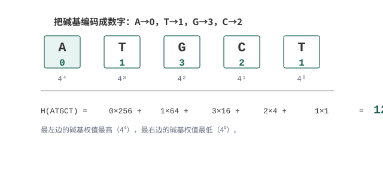{#fig-04-quality-control-and-alignment-002}


举个例子，如果某个子序列为ATGCT，其中我们设定A->0, T->1, C->2, G->3，并把序列末端的碱基当作最低位，则H(ATGCT) = 1 x 4^0 + 2 x 4^1 + 3 x 4^2 + 1 x 4^3 + 0 x 4^4 = 121，这样我们就得到了5-mer序列在哈希表中的关键码值。将上面的方法进一步推广，即可得到长度为n的序列的通用公式：H(X) = I(n) x 4^(n-1) + I(n-1) x 4^(n-2) + ... + I(1) x 4^0。
  
把参考基因组所有 k-mer 的位置都存进哈希表（ @fig-04-quality-control-and-alignment-003 以 k=5 为例），我们就相当于知道了所有 seed 序列的位置，在检索输入序列后，即可快速进行比对反馈，而后进行延伸就得到了序列所在位置。

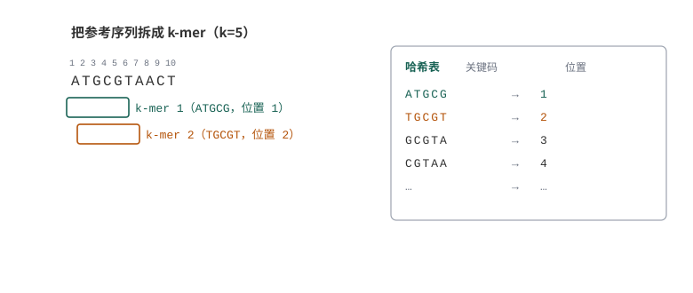{#fig-04-quality-control-and-alignment-003}


#### 连续种子序列策略 {#src-0040-mapping-and-BAM-operation-59}

连续种子序列策略是将短序列拆分成k-mer长的子序列，而后查看由基因组k-mer的子序列所构建的哈希表数据结构进行匹配，从而完成整个回溯过程。
  
  这种算法的缺点是显而易见的，即不允许mismatch的存在，如果序列中出现了至少一个位点的突变，则该位点就会被过滤掉。为了弥补这种缺陷，软件设计者们采用了鸽洞原理（pigeonhole principle）对算法进行了修正：首先，将短序列分割成等长的多段子序列，进行定位时，如果完全match上，则证明序列定位成功，如果存在mismatch，只要不超过设定的某个mismatch数目，则将该序列设定为候选序列，在所有候选序列汇总后选出最少的mismatch作为回溯序列。而后又陆续推出了一系列的修正算法，如q-gram过滤算法，但由于本书重点不在算法解释，仅作简单介绍，有兴趣的读者可以自行查阅相关文献。
  


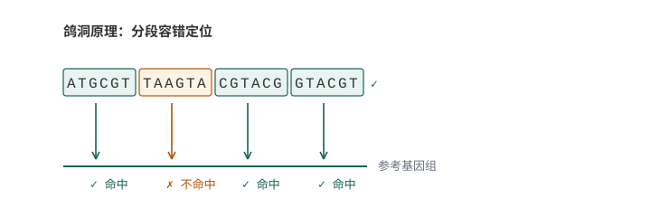{#fig-04-quality-control-and-alignment-004}


#### 间隔种子序列策略 {#src-0040-mapping-and-BAM-operation-66}

所谓的间隔种子序列策略，就是种子序列中间允许存在若干个不确定的碱基，即在比对过程中允许mismatch的存在。举个例子，间隔种子序列AGxCGTAA，既可以跟AGGCGTAA匹配，也可以跟AGCCGTAA匹配。这样做的优势就是明显增加了比对算法的灵敏度，但反过来，比对所消耗的时间复杂度明显增加。

### BWT 与 FM 索引 {#src-0040-mapping-and-BAM-operation-69}

无论采用的是连续种子策略还是间隔种子策略，两者都存在共同的问题，即面对高重复序列的真核生物基因组时，比对效果会比较差，究其原因就是因为k-mer分割所导致的。为了解决这个问题，软件设计者们把目光投向了另一类索引结构：后缀树与后缀数组。后缀树把参考序列的所有后缀组织成一棵树，查询很快，但把所有后缀完整存下来非常吃内存；后缀数组省得多，但对人类基因组来说仍然不小。这一方向真正的突破在于：**不需要真的存下整棵树或整个数组，只需要存下参考序列的 BWT 字符串和少量辅助数组，就能模拟在后缀数组上的查找**，这就是 FM 索引（FM-index）。bowtie、bwa 这类软件正是靠它做到了既省内存又快速定位。

所谓BWT (Burrows-Wheeler Transform)数据转换算法，原本是用于文本压缩的一种变换（压缩工具 bzip2 就使用了它），其大致原理是将原来的文本转换为一个相似的文本，转换后使得相同的字符位置连续或者相邻，再通过其他手段对文本进行压缩。

构建BWT的步骤大致如下：

(1) 给定一个子序列，譬如：ACAACG，在其末尾加入一个只会出现在结尾的特殊符号$，然后写出它全部 7 个循环旋转（rotation），见 @fig-04-quality-control-and-alignment-005 。

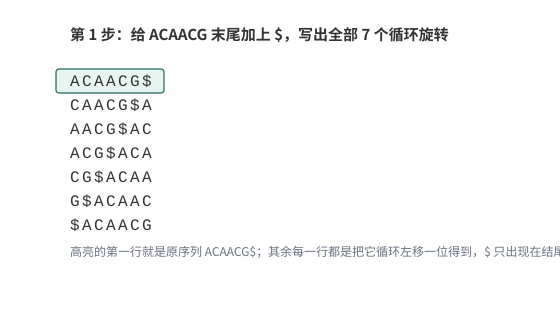{#fig-04-quality-control-and-alignment-005}

(2) 将所有旋转按字符顺序（ASCII 顺序，$ 最小）排序，得到排序后的旋转矩阵，见 @fig-04-quality-control-and-alignment-006 。

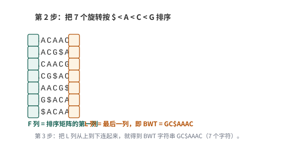{#fig-04-quality-control-and-alignment-006}

(3) 取排序矩阵每一行的最后一个字符，按行连成一个序列，即得到 BWT = `GC$AAAC`。矩阵第一列记为 F 列（排好序的），最后一列记为 L 列（就是 BWT 本身）。

构建完一个BWT之后，把序列找回来的过程（回溯）其实就是一个解码过程。解码依据的是两条性质：

(1) L 列的第一个元素（G）是原始序列的最后一个字符——因为排序后第一行是 `$ACAACG`，它就是原始序列本身，其结尾的 G 正是原序列最后一个字符。
(2) 同一行中，L 列的字符在原序列中紧挨在 F 列字符的前面。利用这一对应关系（LF 映射），从 L 走回 F，就能一步一步把原序列从后往前还原出来。

以 `GC$AAAC` 为例，解码过程如下：

- 第 1 步（ @fig-04-quality-control-and-alignment-007 ）：确定原序列的最后一个字符是 G，目前的还原结果是 `G`。

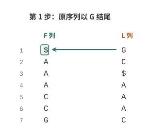{#fig-04-quality-control-and-alignment-007}

- 第 2 步（ @fig-04-quality-control-and-alignment-008 ）：沿着 LF 映射走一步，G 的前一个字符是 C，目前的还原结果是 `GC`。

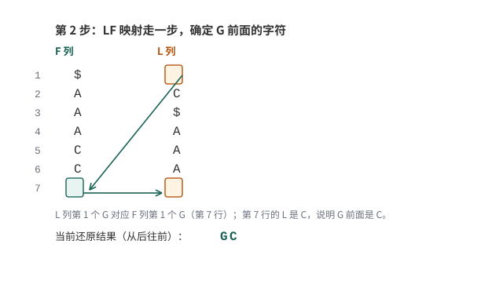{#fig-04-quality-control-and-alignment-008}

- 第 3 步（ @fig-04-quality-control-and-alignment-009 ）：继续沿 LF 映射，C 的前一个字符是 A，目前的还原结果是 `GCA`。

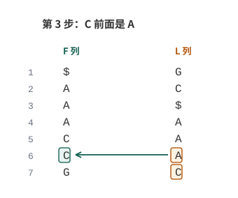{#fig-04-quality-control-and-alignment-009}

- 后面依次类推（ @fig-04-quality-control-and-alignment-010 ），依次得到 `GCAA`、`GCAAC`、`GCAACA`。把 `GCAACA` 反过来读，就是原序列 `ACAACG`，说明解码成功。

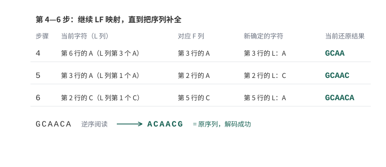{#fig-04-quality-control-and-alignment-010}

有了上面的推导再回头看 4.2.1 的建索引：**目前 bwa、bowtie、bowtie2 的核心用的都是 BWT/FM 索引**——把人类基因组的 BWT 字符串和少量辅助数组存下来，就能既省内存、又以对数级时间完成海量 reads 的定位，这正是它们能“秒级”完成上千万条 reads 比对的底层原因。


::: {.book-placeholder}
本节内容待补充。
:::

## 根据数据选择比对策略 {#sec-04-05}

能为 DNA 与 RNA 选择合适策略并解释未比对或多重比对。

### 常用比对软件与选择 {#src-0040-mapping-and-BAM-operation-98}

现在最为流行的二代测序比对软件基本都是基于 BWT/FM 索引的，例如最早的 bowtie 与 bwa；bowtie2 是它们的同族后继版本，支持空位与局部比对；在 RNA-Seq 方向，TopHat2（已停止维护）曾经流行，如今的主流是 HISAT2 与 STAR 等剪接比对软件。需要说明的是：TopHat2 内部调用 bowtie2 做比对，而 HISAT2 是独立的实现，使用的是层次化 FM 索引（图 FM 索引），并不是"基于 bowtie2 改进"而来。软件会更新换代，但底层索引思想都来自本章前面讲的 BWT。

面对一个具体项目，可以按数据类型先做一轮初筛（ @tbl-04-aligner-choices ；表中软件均收录于 bioconda，2026 年 10 月核对可安装）：

| 数据类型 | 常用软件 | 选择理由 |
| --- | --- | --- |
| DNA 测序（WGS/WES/ChIP 等） | bwa mem、bowtie2 | 读长中等、需要唯一定位与空位支持 |
| 剪接数据（mRNA 的 RNA-Seq） | HISAT2、STAR | reads 可能跨越内含子，需要剪接感知比对 |
| small RNA（miRNA 等，18–30nt） | bowtie（v1） | 序列很短，不允许空位的严格全局比对更合适 |
| 长读长（PacBio/ONT） | minimap2（pbmm2 基于它） | 为长读段错误模式设计 |

: 按数据类型初选比对软件 {#tbl-04-aligner-choices}

本章仅对 bwa、bowtie 以及 bowtie2 做深入比较，方便读者在科研工作中选择。

首先说一下bwa，其优势在于提供了更多的比对模式选择，可以根据基因组大小进行比对模式选择，也可以根据序列长短进行比对模式选择，同时mem模式对长序列提供了更好的支持，可以处理三代测序数据，更常见于重测序数据的处理。

bowtie与bowtie2，其实bowtie2更像是对bowtie的一个升级。比起bowtie，bowtie2支持了gap，也支持了局部比对，在中长序列（50-1000bp）的处理上更具速度与准确性。但在面对small RNA等短序列的时候，不允许gap的bowtie更具优势，究其原因就是比对上更为严格，仅支持全局最优的序列作为比对成功序列。

至于bwa与bowtie2在处理转录组数据时谁更具备优势，其实很难界定，更多是看个人的工具使用倾向。真正针对"reads 跨外显子"这一问题的，是表中的剪接比对软件；HISAT2 在 2019 年下半年的大版本更新后性能有明显提升，在许多研究中被越来越多地使用。

### bowtie2 实操 {#src-0040-mapping-and-BAM-operation-108}

下面本书就以bowtie2的安装与使用为例，讲解在使用过程中应该注意的事项。

#### bowtie2 的安装 {#src-0040-mapping-and-BAM-operation-111}

由于bowtie2有将安装包放进conda的channel--bioconda里面，故而最为方便的安装方式是直接使用conda进行安装。可以直接访问 bioconda 的软件页面（<https://anaconda.org/bioconda/bowtie2>，2026 年 10 月核对可访问），也可以按下图在 Anaconda 云端检索（以下截图摄于 2019 年前后，界面可能已有调整，操作逻辑一致：搜索软件名，进入软件页，复制安装命令）。

首先，如果我们在不知道具体哪个channel的情况下，可以在浏览器中输入“conda cloud”进行检索（以必应为例）


{#fig-04-quality-control-and-alignment-011}


点进去即可搜索bowtie2


{#fig-04-quality-control-and-alignment-012}


搜索结果如下


{#fig-04-quality-control-and-alignment-013}


点进入即可看到安装命令行


{#fig-04-quality-control-and-alignment-014}


```{.bash data-book-role="code"}
conda install -c bioconda bowtie2
#在软件检索完成之后，按照提示输入y即可按照完成
```


{#fig-04-quality-control-and-alignment-015}


按照完成后即可在命令行中敲出bowtie2，连按tab键补齐三下即可看到所有bowtie2开头的命令


{#fig-04-quality-control-and-alignment-016}


这种按照方法较为简单，推荐刚入门的新手使用，而对于已经熟悉了的读者，则可以自行下载，并配置全局调用，此处简单介绍，各位以后想自己安装了就可以自行尝试

首先在搜索引擎上搜索bowtie2


{#fig-04-quality-control-and-alignment-017}


进入官网，即可看到每个版本修复的问题，而在右下角提供的github链接则为我们要下载的源码地址


{#fig-04-quality-control-and-alignment-018}


点击绿色的clone按键，在window的用户可以下载为zip而后解压传输到服务器上，如果服务器网络较好，也可以通过clone的方式下载到服务器上


{#fig-04-quality-control-and-alignment-019}


```{.bash data-book-role="code"}
git clone https://github.com/BenLangmead/bowtie2.git
```


{#fig-04-quality-control-and-alignment-020}


```{.bash .numberLines data-book-role="code"}
#由于bowtie2是无需编译的，下载完成后，即可立即使用

#进入下载后的文件夹，不知道文件夹全名是什么可以ls一下，即可看到当前目录的所有文件跟文件夹，选择进入
cd bowtie2 

#看到bowtie2文件夹内的所有文件
ls 

#选择当前文件夹内的程序使用./+文件名，-h即打开说明书，回车一下即可看到bowtie2的使用说明
./bowtie2 -h 

#获取当前的全路径，并复制
pwd 

#打开环境配置的文件，按i进入编辑模式,去到最后一行输入下一列内容
vim ~/.bashrc 

#从home到bowtie2这一段为刚刚pwd复制的全路径
export PATH="$PATH:/home/Alfred/biosoft/bowtie2/bowtie2-2.3.5.1-linux-x86_64/" 

#ESC键退出编辑模式，并按:wq，退出并保存
source ~/.bashrc #更新当前环境
```

考虑到阅读本书的多是刚入门的读者，不推荐一开始就自行下载、更新环境，能用conda解决就用conda解决，等熟悉了Linux的操作逻辑再自行翻阅尝试即可。

#### bowtie2 的使用 {#src-0040-mapping-and-BAM-operation-188}

作为一名生信从业的科研人员，我们面对不熟悉的软件，第一件事并不是火急火燎的去乱问别人，而是应该秉承着先检索前人使用经验与阅读说明书的原则去熟悉一个新软件，在GitHub的下载页面下面即有bowtie2的使用简要说明


{#fig-04-quality-control-and-alignment-021}


下面由我跟大家用实际例子做个介绍

首先，我们需要下载参考基因组：本例使用人的 X 染色体（chrX），可以从 UCSC 的 hg19 下载目录获取（<https://hgdownload.soe.ucsc.edu/goldenPath/hg19/chromosomes/>，2026 年 10 月核对可访问），下载完成之后即为一个 fa 文件。

{#fig-04-quality-control-and-alignment-022}


我们使用bowtie2做的第一件事就是对这个参考基因组构建一个索引，这一步的目的就是上文提到构建索引表，供后续比对检索回帖


```{.bash data-book-role="code"}
bowtie2-build chrX.fa chrX.fa
# bowtie2-build命令为构建索引的命令
# 第一个chrX.fa代表输入的参考序列
# 第二个chrX.fa代表输出的索引文件前缀
# 产生以 chrX.fa 为前缀的六个 .bt2 索引文件
```


{#fig-04-quality-control-and-alignment-023}


接着就是拿我们在上一个步骤处理干净的clean data进行回帖操作，这一步可以理解为将所有短序列在参考基因组上找回他们对应的位置，下面我们对bowtie2的参数进行一个大概的认知。


```{.text data-book-role="data" data-code-title="bowtie2 常用参数速查"}
#必选参数
# -x <bt2-idx>   索引前缀，即刚刚由 bowtie2-build 生成的 chrX.fa
# -1 <m1>        双端测序对应的 R1.fastq，可为多个文件并用逗号分开，需与 -2 的文件一一对应
# -2 <m2>        双端测序对应的 R2.fastq
# -U <r>         单端测序对应的 fastq，可为多个文件并用逗号分开
# -S <sam>       指定输出的 SAM 文件名
#常用可选参数
# -p/--threads <num>  设置线程数，默认为1
# --reorder           配合-p使用，使比对结果顺序与fq的reads顺序一致
# --seed <int>        设置随机种子
# --no-unal           不记录没比对上的reads
# --un-gz <path>      将unpaired的未比对reads输出到<path>并以gzip压缩
# --al-gz <path>      将至少能比对1次以上的unpaired reads写入<path>并以gzip压缩
# -5/--trim5 <int>    剪掉5'端<int>个碱基再比对
# -3/--trim3 <int>    剪掉3'端<int>个碱基再比对
#比对参数
# -N <int>       种子区域内允许的mismatch数目（默认0），除非是跨物种比对，一般不更改
# -L <int>       设置比对时reads种子的长度
# -i <func>      设置两个相邻种子间的间隔函数
# --n-ceil <func>  设置reads中允许含有的N碱基数目
# --gbar <int>   设置头尾<int>个碱基内不允许出现gap
# --end-to-end   全局比对，为默认模式
# --local        局部比对，read两端的碱基可以不参与比对罚分
#罚分参数
# --ma <int>     设置匹配得分，仅在--local时生效，默认为2，全局比对时匹配不加分
# --mp MX,MN     设置错配罚分，MX为最高罚分，MN为最低罚分，默认为MX=6，MN=2；设置--ignore-qual时每次错配罚MX
# --np <int>     当匹配到N时的罚分，默认为1
# --rdg <int1>,<int2>  设置read上打开gap罚分<int1>、延长gap罚分<int2>，默认为5,3
# --rfg <int1>,<int2>  设置reference上打开gap罚分<int1>、延长gap罚分<int2>，默认为5,3
# --score-min <func>   设置有效比对的最小分值函数，全局比对默认为L,-0.6,-0.6，局部比对默认为G,20,8
#双端比对参数
# -I/--minins <int>  设置允许插入片段最小长度，默认为0
# -X/--maxins <int>  设置允许插入片段最大长度，默认为500
```

看到这么多参数可能会觉得头晕目眩，其实在我们正常使用中，仅仅是选择必须参数与多线程即可，在比对完成后查看结果再进行调整。


```{.bash data-book-role="code"}
bowtie2 -p 10 -x chrX.fa -1 ERR188245_chrX_1.fastq.gz -2 ERR188245_chrX_2.fastq.gz -S ERR188245.sam &
```

#### 比对结果检查 {#src-0040-mapping-and-BAM-operation-256}

在比对完成之后，bowtie2会输出一段log文件，记录着比对情况，但那只是粗略的比对情况，简单的检查可以用；如果要查看每个染色体的比对情况，则推荐用qualimap2进行检查。该软件的安装使用conda即可（注意：qualimap bamqc 的输入是排序后的 BAM 文件，SAM 或未排序的 BAM 需要先转换排序，下一节会讲到）。


```{.bash data-book-role="code"}
conda install -c bioconda qualimap
```

而后进行质检也非常简单，选择bamqc即可：


```{.bash data-book-role="code"}
qualimap bamqc -bam ERR188245_chrX.sorted.bam -outdir bamqc_result -outformat PDF:HTML
```

如果想看注释的区域也可以加上gff文件的参数：


```{.bash data-book-role="code"}
qualimap bamqc -bam ERR188245_chrX.sorted.bam -gff chrX.gff -outdir bamqc_result -outformat PDF:HTML
```
[]{#question-16-2}

[]{#question-16-3}

[]{#question-16-66}

[]{#question-16-244}

[]{#question-16-245}

[]{#question-16-291}

## 比对结果：SAM/BAM 文件的操作与过滤 {#sec-04-06}

能把比对结果转换成适合下游分析的输入。

先记住本章这一段的核心：**比对结果文件（SAM/BAM）记录的就是每条 read 在基因组上的位置和比对情况**——哪条 read、比对到哪条染色体的哪个位置、质量如何、序列本身是什么。理解了这一句，本节所有内容都是在展开它的细节。

### SAM 与 BAM 总览 {#src-0040-mapping-and-BAM-operation-278}

SAM 的全称是 Sequence Alignment Map，设计之初就是为了存储 mapping 结果。BAM 是 SAM 的二进制压缩版本：内容完全等价，体积小得多，排好序后还能随机访问。一个标准的 SAM 文件由两部分组成：第 1 部分是以 `@` 开头的头部；第 2 部分是紧跟在头部后面的比对结果。

经过 bowtie2 比对之后，会生成一个后缀是 sam 的结果文件。下面我们使用 less 指令查看这个文件（ @fig-04-quality-control-and-alignment-024 ； @fig-a-questions-16-20-002 是另一份文件的完整视图）：

```{.bash data-book-role="code"}
less ERR188245.sam
```

{#fig-04-quality-control-and-alignment-024}

{#fig-a-questions-16-20-002}

头部信息我们已经在图里见过：@HD 说明版本与是否排序（SO:coordinate 表示已按坐标排序），@SQ 列出每条参考序列的名称和长度，@PG 记录产生该文件的程序与命令行。真正承载数据的是头文件下面的比对结果：**每行一条 read，共 11 个必需列**，各列含义汇总见 @tbl-04-sam-columns ，下一小节结合实例逐列展开。

| 列 | 字段 | 含义 |
| --- | --- | --- |
| 1 | QNAME | read 的编号，来自 FASTQ 第一行 |
| 2 | FLAG | 位标识，多种比对情况的数值之和 |
| 3 | RNAME | 比对到的参考序列（染色体）名，未比对上为 `*` |
| 4 | POS | 比对起点位置，1-based；未比对上为 0 |
| 5 | MAPQ | 比对质量，255 表示不可用 |
| 6 | CIGAR | 比对情况表达式（匹配、错配、插入、缺失等） |
| 7 | RNEXT | 配对 read 比对到的参考序列名，同一参考序列为 `=` |
| 8 | PNEXT | 配对 read 比对到的位置，不可用为 0 |
| 9 | TLEN | 模板长度：左端为正、右端为负，不可用为 0 |
| 10 | SEQ | read 的序列信息 |
| 11 | QUAL | read 的碱基质量，编码方式同 FASTQ |

: SAM 文件比对结果的 11 个必需列 {#tbl-04-sam-columns}

### 逐列读懂比对结果 {#src-0040-mapping-and-BAM-operation-276}

第一列即ERR开头的这些表示的是read的编号，即fq文件的第一行。
第二列是一列数字，这列数字叫做flag，即位标识，表示的是比对上的情况，是下面这些情况的数值之和：


```{.text data-book-role="data" data-code-title="常用 FLAG 位（可组合相加）"}
0   ：未设置任何特殊位（如单端、比对到正链）
1   ：是 paired-end 或 mate pair 中的一条
2   ：同一模板的各片段满足比对软件定义的正确配对条件（proper pair）
4   ：没有比对到参考序列上
8   ：另一片段（mate）未比对到参考序列
16  ：比对到参考序列的负链上
32  ：双末端 reads 的另一条（mate）比对到参考序列的负链上
64  ：这条 read 是 mate 1
128 ：这条 read 是 mate 2
# 后续根据比对情况进行过滤就会用到这些数字
```

第三列、第四列分别是比对到的参考序列（染色体）名与具体起点位置（1-based 计数），表格中已有汇总，这里不再逐列重复。

**第五列 MAPQ（比对质量）**值得单独展开。回想 FASTQ 的第 4 行记录每个碱基的测序质量（phred 值），MAPQ 则回答“这条 read 放在这个位置有多可信”。为什么需要它？举个例子（ @fig-a-questions-16-20-006 ）：一条 readA 既能比对到 1 号染色体 100000 处（含 1 个错配），也能比对到 2 号染色体 200000 处（含 2 个错配），那它到底该算哪里？这时就需要一个度量值帮我们做判断、选择最好的那个作为最终结果（研究特殊问题时也可以把相似的结果都输出），这个度量值就是 MAPQ。

根据 SAM 官方规范的定义：

> MAPQ: Mapping Quality. It equals -10 log10 Pr{mapping position is wrong}, rounded to the nearest integer. A value 255 indicates that the mapping quality is not available.

翻译过来：MAPQ 的计算方法与 FASTQ 的质量值同源，

$$
\mathrm{MAPQ}=-10\log_{10}\Pr\{\text{mapping出错}\}
$$ {#eq-mapq-definition}

当 MAPQ=255 时，代表该值不可用，只是一个占位符。至于“mapping 出错的概率”怎么算：各软件结合比对情况与碱基测序质量评估——核心思想是低质量碱基若发生错配，很可能是测序错误，不应重罚；低质量碱基即使完美匹配，置信度也不高。

{#fig-a-questions-16-20-006}

下游分析通常会把 MAPQ 过低的 reads 去掉。阈值没有统一规定，按分析目的选择：粗略统计常用 MAPQ≥10，常规过滤常用 MAPQ≥20，寻找 somatic mutation 这类高置信度要求的分析常用 MAPQ≥30。不同软件的 MAPQ 计算体系不同，不能跨软件直接比较（见下面的练习）。

::::: {.callout-warning .book-warning title="注意｜MAPQ 阈值不是通用保证"}

MAPQ 用 Phred 标度表达比对位置错误的概率。SAM 规范并未将取值限制为 0—60；255 表示没有可用的比对质量。具体算法、上限和过滤阈值依赖比对软件及分析目的，不能把 MAPQ≥20 当作普遍的可信保证。

:::::


**第六列 CIGAR** 是比对的简明描述，用一个很好记的名字叫 CIGAR（Concise Idiosyncratic Gapped Alignment Report，出自 SAM 官方规范）。它由数字加字母组成，字母对应比对中发生的事件：

::::: {.callout-note .book-core title="核心知识｜CIGAR 的含义"}

CIGAR 用“数字+操作符”串描述一条 read 与参考的比对情况：`M` 比对（同时包含匹配与错配）、`I` 相对参考的插入、`D` 相对参考的缺失、`N` 跳过参考区域（如内含子）、`S` 软剪切、`H` 硬剪切、`P` 填充、`=`/`X` 显式的匹配/错配。例如 `3S38M432N38M` 表示：先软剪切 3 个碱基，比对 38 个碱基，跳过参考上 432 个碱基（内含子），再比对 38 个碱基。实际数据中主要出现前 7 个操作符，`=` 与 `X` 多数软件不输出。完整的操作符列表见 @tbl-04-cigar-ops 。

| 符号 | 含义 |
| --- | --- |
| M | 比对（alignment match，包含 match 与 mismatch） |
| I | 插入到参考序列（read 有、参考没有） |
| D | 从参考序列缺失（参考有、read 没有） |
| N | 跳过参考序列上的区域（如内含子） |
| S | 软剪切（soft clipping），被剪掉的序列仍保留在 SEQ 列 |
| H | 硬剪切（hard clipping），被剪掉的序列不保留在 SEQ 列 |
| P | 填充（padding，很少用到） |
| = | 序列匹配（match） |
| X | 序列不匹配（mismatch） |

: CIGAR 标记符号及其含义（依据 SAM 规范） {#tbl-04-cigar-ops}

:::::


**第七、八列 RNEXT、PNEXT** 是双端测序专用：配对的另一条 read（mate）比对到的参考序列名和位置；同一参考序列记为 `=`，没有则为 `*` 或 0。

**第九列 TLEN**（template length）可以理解为这一对 read 覆盖区域从上游第一个碱基到下游最后一个碱基的距离：上游 read 取正值、下游 read 取负值，单端或不可用时为 0（具体计算见下面的练习）。

**第十、十一列 SEQ、QUAL** 就是这条 read 的序列与碱基质量，编码方式同 FASTQ——SAM 不仅记录比对，还把 reads 的原始信息完整保留了下来。

看到这里你可能觉得头晕晕的，但其实可以不用记得这么仔细：记住本节开头的核心句——**SAM 记录的就是每条 read 在基因组上的位置和比对情况**——到真的需要过滤时再回来查具体列的含义即可。

[]{#question-16-111}

[]{#question-16-112}

[]{#question-16-188}

::::: {.callout-tip .book-example title="示例与练习｜FLAG=83 是什么意思？"}

 @fig-a-questions-16-20-004 是一份真实 SAM 文件的前 4 列（最前面的行号是截图时加的，不在文件里）。请解释标号 38 那行 FLAG=83 的比对含义。

{#fig-a-questions-16-20-004}

**参考解答**：可以手工分解，FLAG 是各二进制位之和：$\mathrm{FLAG}=1+2+16+64=83$。也可以用 Picard 的 [Explain SAM Flags 工具](https://broadinstitute.github.io/picard/explain-flags.html)（2026 年 10 月核对可访问），输入 83 即可得到分解（ @fig-a-questions-16-20-005 ）。FLAG=83 表示：

1. 序列是双端测序的结果；
2. 满足正确配对条件（proper pair）；
3. read 比对到了参考基因组的负链上；
4. 此 read 是 read1。

{#fig-a-questions-16-20-005}

:::::

[]{#question-16-329}

[]{#question-16-330}

[]{#question-16-381}

::::: {.callout-tip .book-example title="示例与练习｜解析 CIGAR：150M 有没有错配？跨越内含子怎么写？clip 是什么？"}

**问题 1**：M、I、D、N 分别是什么意思？如果一条序列的 CIGAR=`150M`，能不能说这 150bp 区域中没有错配？

**参考解答**：M 表示比对（同时包含匹配与错配），I 表示相对参考序列的插入，D 表示相对参考序列的缺失，N 表示跳过参考上的区域。CIGAR=`150M` **不能**说明没有错配：无论匹配还是错配都记为 M；想知道具体哪里有错配，要看 MD 标签（见下一小节）。

**问题 2**：一条来自成熟 mRNA 的序列比对到基因组时会遇到什么问题？如果它中间正好跨过 200bp 的内含子、前后各有 75bp 比对到外显子上，CIGAR 应该怎么写？

**参考解答**：成熟 mRNA 不含内含子，比对到基因组时会“跳过”内含子区域，对应操作符 N。该条序列的 CIGAR 为 `75M200N75M`。

**问题 3**：结合 @fig-a-questions-16-20-010 理解 clip 的含义（soft clip 与 hard clip）。该图依据 SAM 规范中的官方示例绘制。

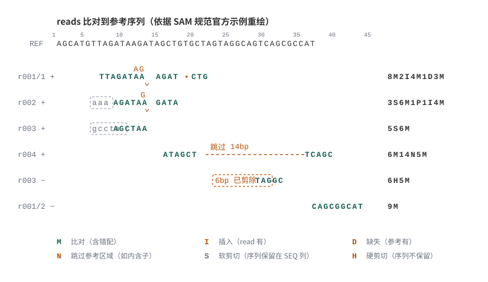{#fig-a-questions-16-20-010}

**参考解答**：以 r003 为例，它是嵌合比对（chimeric read），有两条记录：代表比对是 `5S6M`（前 5bp 软剪切），补充比对是 `6H5M`（前 6bp 硬剪切）。两条记录里 SEQ 列的长度分别是 11bp 和 5bp——软剪切时被剪掉的序列仍保留在 BAM 文件中，硬剪切时被剪掉的序列则不会出现在 SEQ 列里。图中 r004 的 `6M14N5M` 演示了跳过（N）内含子区域的 split alignment。

:::::

[]{#question-16-426}

[]{#question-16-427}

[]{#question-16-465}

::::: {.callout-tip .book-example title="示例与练习｜算一算 TLEN"}

 @fig-a-questions-16-20-012 是一份包含 11 列的 SAM 文件截图。第 20 行第 9 列记录了 TLEN 值，请列出算式计算它。

{#fig-a-questions-16-20-012}

**参考解答**：该 read 对中下游 read 起点为 11123，上游 read 起点为 10946、read 长 145bp，覆盖区总长 $11123-10946+145=322$；下游 read 的 TLEN 取负值：

$$
-(11123-10946+145)=-322
$$ {#eq-tlen-example}

计算过程见 @fig-a-questions-16-20-014 。

{#fig-a-questions-16-20-014}

:::::

::::: {.callout-tip .book-example title="示例与练习｜FASTA 输入时，MAPQ 与第 11 列还有意义吗？"}

**问题 1**：如果 mapping 时输入的是 FASTA 文件（而不是 FASTQ），第 5 列 MAPQ 还有意义吗？第 11 列 QUAL 呢？

**参考解答**：都没有意义。FASTA 不包含测序质量信息：MAPQ 无法结合碱基质量计算，常用 255 占位；第 11 列本身是测序质量值，同样无从谈起。

**问题 2**：不同的比对软件（比如 bwa 与 bowtie2）计算出来的 MAPQ 意义相同吗？

**参考解答**：不能直接比较。BWA 与 Bowtie2 的核心索引思想相同，但比对策略和评价体系不同。不能认为 BWA 的 MAPQ=42 就好于 Bowtie2 的 MAPQ=40，反之亦然。

:::::

### TAG 可选字段 {#sec-04-06-tags}

[]{#question-21-3}

[]{#question-21-5}

[]{#question-21-72}

11 列之后的内容称为可选字段（optional fields），不同比对软件会附加不同的标签。所有可选字段的格式必须是 `TAG:TYPE:VALUE`——比如 `MD:Z:145` 就是一个符合规范的值。三条规则：

1. 所有的 TAG 都是 2 个字母，一般为大写，且在一行比对结果中只能出现 1 次；
2. 所有的 TYPE 都是单字母、大小写敏感，定义后面 VALUE 的类型（ @fig-a-questions-21-25-002 是官方文档的类型对照，最常用的是 i 带符号整数和 Z 可含空格的字符串）；
3. VALUE 可长可短，但必须与 TYPE 对应。

{#fig-a-questions-21-25-002}

查询 TAG 含义一定要从所用比对软件的官方文档中查找：SAM 文件头部的 @PG 字段记录了产生文件的软件与命令行，用 `samtools view -H` 就能看到。比如下面这个 @PG 说明文件由 bowtie2 2.2.5 产生：

```{.text data-book-role="data"}
@PG	ID:bowtie2-5DEB9F7A	PN:bowtie2	VN:2.2.5	CL:"/home/biotools/bowtie2-2.2.5/bowtie2-align-s --wrapper basic-0 -p 4 --phred33 -x /lustre/user/reference/hg19/hg19_combine -S ./tmp.data/fastq/genome-sequence.sam -1 ./tmp.data/fastq/genome-sequence_L3_1_trim5.fastq -2 ./tmp.data/fastq/genome-sequence_L3_2_trim5_92.fastq"
```

::::: {.callout-tip .book-example title="示例与练习｜逐项解读一条完整比对记录"}

下面是一条 bowtie2 产生的真实比对记录（human 全基因组比对，@fig-a-questions-21-25-001 是它在文件中的样子）。请对照 [bowtie2 官方手册的 SAM output 一节](http://bowtie-bio.sourceforge.net/bowtie2/manual.shtml#sam-output)（2026 年 10 月核对可访问），解释每个字段与标签。

```{.text data-book-role="data"}
ST-E00126:128:HJFLHCCXX:2:2107:22820:18520	99	chr1	11682	1	145M	=	11920	325	GGAGATTCTTATTAGTGATTTCGGCTGGTGCCTGGCCATGTGTATTTTTTTAAATTTCCACTGATGATTTTGCTGCATGGCCGGTGTTGAGAATGACTGCGCAAATTTGCCGGATTTCCTTTGCTGTTCCTGCATGTAGTTTAAA	KKKKAAKKAFFKKKKKKFKFKKKFKKKKKKKKKKFKFKKKKKKKKKKKKKKFKFFKKKKKKFAAKAKKKKKKKKKKKKFFKKKFFFKKFKFFKKKKKKKKFFFFFKKKKKKK7<FFKKKKKKAFK<F<<7<AA,,7AA<7F7AA<	MD:Z:21G6G116	XG:i:0	NM:i:2	XM:i:2	XN:i:0	XO:i:0	AS:i:-12	XS:i:-12	YS:i:-6	YT:Z:CP
```

{#fig-a-questions-21-25-001}

**参考解答**：

1. `ST-E00126:...:18520`：read 名称，通常含测序平台信息；
2. `99`：FLAG（=1+2+32+64：双端、正确配对、mate 在负链、read1）；
3. `chr1`、`11682`：比对到的染色体与位置；
4. `1`：MAPQ；
5. `145M`：CIGAR；
6. `=`、`11920`：mate 比对到同一染色体及其位置；
7. `325`：TLEN；
8. 序列与质量值（第 10、11 列）；
9. `MD:Z:21G6G116`：比对中发生编辑的位置串——前 21bp 匹配，第 22 位 read 为 G（与参考不同），随后 6bp 匹配，再一位为 G，最后 116bp 匹配；
10. `XG:i:0`：gap 延长次数（与 XO 的 gap 打开次数配合）；
11. `NM:i:2`：编辑距离（把 read 比对到参考所需的最少编辑次数）；
12. `XM:i:2`：错配数目；
13. `XN:i:0`：覆盖区内参考上不确定碱基（N）的数目；
14. `XO:i:0`：gap 打开次数；
15. `AS:i:-12`：本条比对得分（bowtie2 全局模式得分常为负，local 模式不小于 0）；
16. `XS:i:-12`：除本条外最佳候选比对的得分（second-best，通常小于等于 AS；AS 与 XS 接近说明比对位置存在歧义）；
17. `YS:i:-6`：配对 read 的比对得分；
18. `YT:Z:CP`：配对类型：`UU` 未配对、`CP` concordant、`DP` discordant、`UP` 配对的另一条未比对上。

:::::

### samtools 常用操作 {#src-0040-mapping-and-BAM-operation-330}

在 Linux 中查看和处理 SAM/BAM 最好用的工具是 samtools（可用 `conda install -c bioconda samtools` 安装）。查看 SAM 文件的常用操作：

```{.bash .numberLines data-book-role="code"}
# 假设SAM文件的文件名是 test.sam

# 1.只查看头部
samtools view -H test.sam

# 2.只查看内容，不查看头部
samtools view test.sam

# 3.头部和内容一起查看
samtools view -h test.sam

# 4.查看帮助文档
samtools view
```

#### SAM 与 BAM 互转 {#sec-04-06-sam-bam-convert}

由于我们的sam文件是文本类的文件，这就导致比对所产生的结果文件动辄大几G，对我们硬盘的造成了很大存储压力，如果压缩则能够减小很多体积，而直接转成二进制文件则更为节约体积，故而就诞生了一种二进制格式bam来对比对结果进行存储，除了是二进制以外其存储的内容与sam文件无异。怎么区分这两个呢，我觉得用英文区分就很简单可以区分开，s是string的意思，字符，文本的意思，b是binary的意思，二进制的意思，一下子就知道两者的区别了。

那么转成二进制文件之后，要怎么打开呢？很明显使用less这种打开文本文件的是不适合的了。这个时候就要提到bwa之父李恒大神为sam与bam开发的一个处理利器samtools。首先是国际惯例，安装


```{.bash data-book-role="code"}
conda install -c bioconda samtools
```

安装完毕之后就可以在命令行上使用了，首先是将sam文件转换为bam文件：


```{.bash data-book-role="code"}
# 将sam文件转换为bam文件
samtools view -b ERR188245.sam > ERR188245.bam

# 同样的，我们可以把bam文件转为sam文件
samtools view -h ERR188245.bam > ERR188245.sam
```

那么问题来了，转为bam文件之后，怎么用samtools查看？我们可以将bam转为sam，然后再利用管道符用less查看：


```{.bash .numberLines data-book-role="code"}
# 查看完整的bam文件
samtools view -h ERR188245_chrX.bam | less -S

#如果只想查看头文件
samtools view -H ERR188245_chrX.bam

#如果想跳过头文件
samtools view ERR188245_chrX.bam  | less -S
```

#### BAM文件的排序 {#src-0040-mapping-and-BAM-operation-364}

如果我们是做全基因组测序，那么在进行下游分析之前，需要对bam文件进行一个排序，这个功能可以用samtools，也可以用Picard或者gatk做到。

使用samtools对bam文件进行排序：


```{.bash .numberLines data-book-role="code"}
samtools sort -@ 20 -m 8G -O bam -o ERR188245_chrX.sorted.bam ERR188245_chrX.bam
# @：指定线程数
# m：每个线程分配的最大内存
# O：输出文件格式
# o：输出文件的名字
# 输入文件放在最后
```

如果是picard的话，可以参考下面的命令：

```{.bash data-book-role="code"}
java -jar picard.jar SortSam I=ERR188245_chrX.bam  O=ERR188245_chrX.sorted.bam  SORT_ORDER=coordinate
```

如果使用GATK工具，对bam文件进行排序，可以参考：


```{.bash .numberLines data-book-role="code"}
#如果是gatk的话, 先建立index与dict
samtools faidx chrX.fa
gatk CreateSequenceDictionary -R chrX.fa -O chrX.dict

#再使用gatk进行排序
gatk SortSam -I ERR188245_chrX.bam -O ERR188245_chrX.sorted.bam -R chrX.fa -SO coordinate --CREATE_INDEX
```

#### BAM文件的index的建立 {#src-0040-mapping-and-BAM-operation-396}

经过排序之后的bam文件，就可以建立索引，如果不排序则会报错。建立bam文件的索引文件，是为了更方便地


```{.bash data-book-role="code"}
samtools index ERR188245_chrX.sorted.bam
```

运行完上面的命令，即可在文件夹中获得一个index文件，一般情况下默认的文件名为bam文件名后面增加`.bai`后缀。比如这里就会生成`ERR188245_chrX.sorted.bam.bai`文件。我们在对排序完的bam文件进行一些特殊的操作时，一般都需要index文件和bam文件在同一文件夹中，否则可能会出现报错的现象。

#### 对比对结果进行过滤 {#src-0040-mapping-and-BAM-operation-406}

果然想通过mapping质量或者比对情况进行过滤，那samtools一定是处理代码最为简洁的。


```{.bash .numberLines data-book-role="code"}
samtools view -h -b -q 20 -F 260 ERR188245_chrX.sorted.bam > ERR188245_chrX.q1F4F260.sorted.bam

# -f INT 只保留满足这些 FLAG 位的 reads（本例未使用）
# -F INT 过滤掉满足这些 FLAG 位的 reads：260 = 4 + 256，
#         即去掉“没比对上（4）”与“次优比对（256）”的记录
# -q INT 过滤掉 MAPQ 低于该阈值的记录
# -h 输出中包含 header
# -b 输出格式设定为 BAM
```

注意：`-F` 只应出现一次；要同时过滤多个 FLAG 位，就把数值相加成一个数（例如 4+256=260）传入，前后写两个 `-F` 并不能自动合并。

#### 对比对结果进行统计 {#src-0040-mapping-and-BAM-operation-421}

如果想对bam文件进行一些基础的统计分析，比如测序片段的数目，整体的突变情况，基因组测序结果的覆盖度等等，都可以用下面的命令生成报告。


```{.bash data-book-role="code"}
samtools flagstat ERR188245_chrX.sorted.bam
```

结果文件统计bam文件中reads的比对情况，如多少reads比对上等信息，其中的结果比较丰富，但是需要再使用R或者Python编程进行生成图表。所以，当不追求速度的情况下还是建议用qualimap2软件。

顺带一提，SAM 不仅记录比对，还保留了 reads 的原始序列，所以也能反向提取 FASTQ：

```{.bash data-book-role="code"}
samtools view -b -h filter_MAPQ20.sam > filter_MAPQ20.bam
samtools bam2fq filter_MAPQ20.bam > filter_MAPQ20.fastq
```

::::: {.callout-tip .book-example title="示例与练习｜samtools 六连操作"}

[]{#question-21-145}

[]{#question-21-146}

[]{#question-21-152}

[]{#question-21-161}

[]{#question-21-165}

[]{#question-21-173}

[]{#question-21-265}

[]{#question-21-279}

准备一个很小的测试文件 test.sam（约 4MB，可从[百度网盘](https://pan.baidu.com/s/15gVVYPRu3VbF_uKbJUUGrA)下载，密码 2drn；分享链接若失效，可按 4.2.1 的方法自行比对生成小数据），然后用 samtools 完成下面的操作。

**问题 1**：用 `samtools view` 查看 test.sam 的 header，记录各条染色体的长度；这个文件是用哪种 mapping 软件产生的？

**参考解答**：查看 header 中的 @PG ID，显示使用的软件是 bowtie2；各条染色体的长度见 @fig-a-questions-21-25-003 。

{#fig-a-questions-21-25-003}

**问题 2**：把 test.sam 转换成 test.bam（保留 header），写出命令并比较两个文件的大小。

**参考解答**：`samtools view -b -h test.sam > test.bam`（`-b` 输出 BAM 格式，`-h` 包含 header）。结果显示 test.sam 约 3.9M，test.bam 约 660K，BAM 小很多。

**问题 3**：用 less 分别打开 test.sam 和 test.bam，为什么 BAM 文件是乱码？再用 samtools view 试试。

**参考解答**：less 只能正常查看文本；BAM 是二进制文件，需要 `samtools view test.bam` 查看。

**问题 4**：用 `samtools sort` 对 test.bam 排序，输出 test_sort.bam，并记录文件大小。

**参考解答**：`samtools sort -o test_sort.bam test.bam`。排序前后文件大小基本不变（约 660K）。sort 的常用参数：`-l INT` 压缩等级 0-9；`-m INT` 每线程内存（可用 K/M/G）；`-n` 按 read 名称排序；`-o FILE` 输出文件名；`-T PREFIX` 临时文件前缀；`-O FORMAT` 输出格式（bam/sam/cram，默认 bam）；`-@ INT` 线程数。

**问题 5**：用 `samtools index` 给 test_sort.bam 建立索引，写出命令并记录索引文件大小。

**参考解答**：`samtools index test_sort.bam`，生成 `test_sort.bam.bai`（约 4.0K）。

**问题 6**：用 `samtools tview` 查看 chr1:160000-160100 区域的比对情况。

**参考解答**：

```{.bash data-book-role="code"}
samtools tview -p chr1:160000-160100  test_sort.bam
```

{#fig-a-questions-21-25-004}

小技巧：想查某个子命令的用法，直接在命令行敲 `samtools view` 回车就会打印说明（ @fig-a-questions-21-25-005 ）；完整手册见 [samtools manual page](https://www.htslib.org/doc/samtools.html)（2026 年 10 月核对可访问）。

{#fig-a-questions-21-25-005}

:::::

::::: {.callout-note .book-extension title="拓展阅读｜继续学习软件的方法" collapse="true"}

大家以后要用的软件种类非常多，不可能所有软件都学过，总有一个从不会到会的过程。学习各种软件时要学会类比和推理，想清楚 input 是什么、output 是什么——想不明白其中的道理，工具就只是黑盒子。软件用法的学习，入门时看别人的介绍尚可，有了一定基础后一定要多读官方文档，受益无穷。

:::::

## 测序深度与复杂度 {#sec-04-07}

能区分数据量、有效信息量和覆盖不足。

### 覆盖度估算 {#src-0070-WGS-9}

假设构建的基因组文库无区域偏好性，测序片段来自于基因组各个区域的概率均等，则我们可以估计特定建库方式下，一定的library size的序列所能覆盖的基因组区域

已知目标基因组的长度为$G$，测序片段长度（read size）为$S$，library size为$N$，则某一条read来自于一个长度为$L$的基因组区段的概率为$\frac{L}{G}$

此时，设随机变量：


$$
D=\text{起始于一个长度为}L\text{的区段的reads数}
$$ {#eq-04-quality-control-and-alignment-001}


则D服从二项分布：


$$
D \sim Binomial(N,\frac{L}{G})
$$ {#eq-04-quality-control-and-alignment-002}


令$L=S$，则起始于该长度为S的区段的reads，均覆盖该区段的最后一个碱基，即此时D就是该碱基位置的测序深度

我们知道，对于二项分布，当其实验次数$N\to \infty$，概率$P\to 0$时，二项分布近似于泊松分布，在这里，因为$S<<G$，则$P=\frac{S}{G} \to 0$，且$N$非常大，可以用泊松分布近似，即：


$$
D \sim \text{Poisson}(\lambda), \quad \lambda=N\frac{S}{G}
$$ {#eq-04-quality-control-and-alignment-003}


因此，我们获得了全基因组各碱基位点的测序深度的概率分布（概率质量分布PMF）估计，如下图（以$\lambda=40$为例）：


{#fig-04-quality-control-and-alignment-038}


依据测序深度的概率分布，可以很容易推出测序深度大于指定阈值$d$的基因组区域比例：


$$
P(D\ge d) = \sum_{i=d,...,\infty}P(D=i)
$$ {#eq-04-quality-control-and-alignment-004}


不过实际的基因组测序深度分布与泊松分布并不完全一致：由于GC偏好性等因素的影响，“全基因组各区域来源等概率”的假设并不完全成立，实际分布相对于理论分布存在明显的过度离散（overdispersion，即 $Var(D) > E(D)$）。实测深度分布见 @fig-04-quality-control-and-alignment-039 ：实测分布（柱）比同均值的泊松分布（线）更“胖”，说明有些区域深度远高于预期、有些远低于预期。以 Bentley 等人 2008 年的整基因组测序数据为例，实测方差约为同均值泊松分布的 2.26 倍[^bentley-2008]。

{#fig-04-quality-control-and-alignment-039}

该图引自 Shen 等人 2008 年提出的 SNP 检测方法中的分析[^shen-2008]。

::: {.book-placeholder}
本节内容待补充。
:::

### 重复 reads 与文库复杂度 {#sec-04-07-duplicates-and-complexity}

避免对所有实验套用同一去重复策略。

#### duplicate 的来源 {#src-0070-WGS-50}

duplicate 主要来自建库与测序过程，常见来源有四种，图示见 @fig-04-quality-control-and-alignment-040 。

{#fig-04-quality-control-and-alignment-040}

- **PCR duplicates（PCR重复）**：PCR 扩增时，同一个 DNA 片段会产生多个相同的拷贝；测序时，这些来源于同一个模板分子的片段会结合到 Flowcell 的不同位置上，生成序列完全相同的 cluster 被测出来，这些相同的序列就是 duplicate。

- **Cluster duplicates**：生成测序 cluster 的时候，某一个 cluster 中的 DNA 序列可能搭到旁边的另一个位点上，又重新长成一个相同的 cluster。使用图案化 Flowcell（patterned flowcell）的机型（如 HiSeq 4000 之后与 NovaSeq 系列）更容易出现这类 duplicate。

- **Optical duplicates（光学重复）**：来自同一模板分子的两个片段恰好结合在 Flowcell 上非常接近的位置，形成相邻的两个 cluster；由于它们在成像坐标上紧挨着，可由坐标邻近性识别，因而得名“光学”重复。

- **Sister duplicates**：文库分子的两条互补链同时与 Flowcell 上的引物结合，分别形成各自的 cluster 被测序，产生的这对 reads 完全反向互补；比对到参考基因组时位于正负链的相同位置，在有些分析中也会被认作 duplicate。

[]{#question-06-227}

[]{#question-06-228}

[]{#question-06-240}

[]{#question-06-280}

::::: {.callout-tip .book-example title="示例与练习｜读懂 FastQC 的重复水平图，并估算 duplicate 比例"}

duplicate 的产生主要是因为 Illumina 建库过程中一般会使用 PCR 来扩增文库：如果 PCR 扩增轮数过大，同一个模板分子就会产生一模一样的若干条序列（来源见上一小节）。FastQC 的“Sequence Duplication Levels”模块（ @fig-a-questions-06-10-010 ）就是用来刻画 duplicate 情况的。

{#fig-a-questions-06-10-010}

**问题 1**：图中横坐标、纵坐标分别是什么意思？

**参考解答**：横坐标代表序列重复水平（一条序列在文件中出现的份数）；纵坐标代表各重复水平的序列占全部序列的百分比。

**问题 2**：红线和蓝线分别代表什么意思？

**参考解答**：蓝线代表全部序列的重复性分布；红线代表去除 duplicate 之后的分布。

**问题 3**：图中的 duplicate 是对全部序列统计的吗？还是抽了一部分？为什么这样做？

**参考解答**：是抽样计算的：旧版 FastQC 取每个文件最前面的 100,000 条序列，新版改为随机抽样（具体数目随版本调整）。样本已经足以代表整个文件的重复性，全量计算反而太慢。

**问题 4**：如果让你写程序判断一个 fastq 文件中 duplicate 的比例，思路是什么？

**参考解答**：先按序列排序，再顺序统计相邻相同的序列。伪代码：

```{.text data-book-role="pseudocode"}
# Python风格的伪代码：

# 第1步对序列进行排序
sort the FASTQ file by the sequence, and save as sorted_file;

# 第2步对排序后的序列统计是否为duplicate
total_num = 0
duplication_num = 0

reads_1 = sorted_file.readline()
total_num = total_num + 1
for reads_2 in sorted_file:
    if reads_1 == reads_2:
        duplication_num = duplication_num + 1
    else:
        reads_1 = reads_2
    total_num = total_num + 1
print(total_num)
print(duplication_num)
```

:::::

#### 去除 duplicate：MarkDuplicates 实操 {#src-0040-mapping-and-BAM-operation-433}

这一步，我们经常叫`remove duplication`。所谓的duplication一般是指构建测序文库的过程中，会有PCR扩增的步骤，这个步骤往往会对片段进行多次扩增。如果有来源于同一个原始片段的测序结果比对到了基因组上，有可能会对我们的下游分析造成一些影响。所以，某些情况下需要对bam文件进行冗余的去除，这里的冗余一般习惯上称为`duplication`。

去除duplication的常用工具是 GATK/Picard 的 MarkDuplicates（按坐标排序后运行）。早期常用 `samtools rmdup`，但它对双端数据表现不佳，已在 samtools 1.14 起被移除；新版 samtools 的替代流程是 `samtools collate` + `samtools fixmate` + `samtools markdup`，本书以 GATK 为例。

MarkDuplicates 最常见的用法是**只标记、不删除**：duplicate 会被打上 FLAG 1024，供后续步骤按需过滤（这是推荐做法，保留的信息最完整）：


```{.bash data-book-role="code"}
gatk MarkDuplicates -I ERR188245_chrX.sorted.bam -O ERR188245_chrX.sorted.mkdup.bam -M ERR188245_chrX.metrics --CREATE_INDEX
```

如果确有必要直接删除 duplicate，在同一条命令里加 `REMOVE_DUPLICATES=true` 即可（注意不要对已标记过的文件重复运行 MarkDuplicates，二次运行会重复计数）：


```{.bash data-book-role="code"}
gatk MarkDuplicates REMOVE_DUPLICATES=true -I ERR188245_chrX.sorted.bam -O ERR188245_chrX.sorted.rmdup.bam -M ERR188245_chrX.metrics
```

也可以使用Picard完成同样的工作：


```{.bash data-book-role="code"}
java -jar picard.jar MarkDuplicates I=ERR188245_chrX.sorted.bam O=ERR188245_chrX.sorted.mkdup.bam M=ERR188245_chrX.metrics ASO=coordinate REMOVE_DUPLICATES=true
```

关于samtools的用法其实很多，但限于篇幅，我们只对最常用的几个命令进行了简单介绍，对于组学分析中的其他应用可以参考接下来各章的介绍。

[]{#src-0070-WGS-46}

[]{#src-0070-WGS-48}


#### GATK 去重复实操 {#src-0070-WGS-218}


{#fig-04-quality-control-and-alignment-042}


**1. 排序（SortSam）**

- 对sam文件进行排序并生成bam文件，将sam文件中同一染色体对应的条目按照坐标顺序从小到大进行排序。
- 排序本身用上一节讲过的 `samtools sort` 也可以完成，两种工具都会在头信息里写入 `SO:coordinate` 标签说明文件已按坐标排序；GATK 流程推荐统一用 Picard/GATK 的 SortSam，主要是为了与后续 GATK 工具链保持一致。
- 工具文档：[Picard/GATK SortSam](https://broadinstitute.github.io/picard/command-line-overview.html#SortSam)（2026 年 10 月核对可访问；也可在 [gatk.broadinstitute.org](https://gatk.broadinstitute.org) 的 Tool Documentation 中查找同名工具）。


```{.bash .numberLines data-book-role="code"}
# 使用GATK命令
gatk SortSam -I mapping/T.chr17.sam -O preprocess/T.chr17.sort.bam -SO coordinate --CREATE_INDEX
# 使用picard命令
java -jar picard.jar SortSam \
      I=input.bam \
      O=sorted.bam \
      SORT_ORDER=coordinate
```


{#fig-04-quality-control-and-alignment-043}


如何检查是否成功排序？


```{.bash data-book-role="code"}
samtools view -H /path/to/my.bam
```

这份示例来自一份较早参考版本的文件，部分染色体长度与 hg19/GRCh37 的标准值不同（例如 GRCh37 的 chr1 长度是 249,250,621）；查看自己的文件时，以 header 实际内容为准：

```{.text data-book-role="data"}
@HD     VN:1.0  GO:none SO:coordinate
@SQ     SN:1    LN:247249719
@SQ     SN:2    LN:242951149
@SQ     SN:3    LN:199501827
@SQ     SN:4    LN:191273063
@SQ     SN:5    LN:180857866
@SQ     SN:6    LN:170899992
@SQ     SN:7    LN:158821424
@SQ     SN:8    LN:146274826
@SQ     SN:9    LN:140273252
@SQ     SN:10   LN:135374737
@SQ     SN:11   LN:134452384
@SQ     SN:12   LN:132349534
@SQ     SN:13   LN:114142980
@SQ     SN:14   LN:106368585
@SQ     SN:15   LN:100338915
@SQ     SN:16   LN:88827254
@SQ     SN:17   LN:78774742
@SQ     SN:18   LN:76117153
@SQ     SN:19   LN:63811651
@SQ     SN:20   LN:62435964
@SQ     SN:21   LN:46944323
@SQ     SN:22   LN:49691432
@SQ     SN:X    LN:154913754
@SQ     SN:Y    LN:57772954
@SQ     SN:MT   LN:16571
@SQ     SN:NT_113887    LN:3994
...
```

若随后的比对记录中的contig那一列的顺序与头文件的顺序一致，且在头信息中包含`SO:coordinate`这个标签，则说明，该文件是排序过的

**2. 标记重复（Markduplicates）**

- 标记文库中的重复。
- 工具文档：[Picard/GATK MarkDuplicates](https://broadinstitute.github.io/picard/command-line-overview.html#MarkDuplicates)（2026 年 10 月核对可访问）。


```{.bash data-book-role="code"}
gatk MarkDuplicates -I preprocess/T.chr17.sort.bam -O preprocess/T.chr17.markdup.bam -M preprocess/T.chr17.metrics --CREATE_INDEX
```


{#fig-04-quality-control-and-alignment-044}


#### 用泊松分布解释 duplicate rate {#src-0070-WGS-70}

求解 duplicate rate，相当于回答这样一个问题：

> 对于已经建好的测序文库，其中有 N 种序列片段，每条片段长度均为 l，每种片段的拷贝数为 $k_i(i=1,...,N)$，文库大小（library size）为 M，即 $M=\sum_{i=1}^{N}k_i$。现在从这个文库中随机抽取 $m$ 条序列（$m \ll M$）进行测序，问 duplicate rate 是多少？

先给结论：

$$
duplicate\,rate \approx 1-\frac{\lambda N}{M}
$$ {#eq-04-quality-control-and-alignment-006}

其中 $\lambda=Ml/G$。当测序对象 G、片段长度 l 和总文库大小 M 都确定时，$\lambda/M$ 是常数，此时 duplicate rate 只与原始文库中序列片段的种类数 N 有关，且是负相关——**文库复杂度越高（N 越大），duplicate rate 越低**。这个结论与直觉一致：文库越复杂，随机抽到同一条片段的概率越小。

完整推导过程较长，放在下面的拓展阅读中，有兴趣的读者可以展开验证。

::::: {.callout-note .book-extension title="拓展阅读｜duplicate rate 泊松近似的完整推导" collapse="true"}

采用逆向思维：假设 m 条序列中总共有 n 种片段，则 duplicate rate $d=1-\frac{n}{m}$。问题转化为“从 M 条中抽 m 条，理论上能抽中多少种片段”。

对于原始文库中的任意一种片段 i，设随机变量

$$
X_i = \left\{
  \begin{array}{ll}
    1 & 该片段被至少抽中一次 \\
    0 & 该片段未被抽中
  \end{array}
\right.
$$ {#eq-04-quality-control-and-alignment-008}

（按这种形式设定的随机变量称为**示性函数**。）则总共被抽中的片段种类数 $n=\sum_{i=1}^{N}X_i$，见 @eq-04-quality-control-and-alignment-009 。

$$
n=\sum_{i=1}^{N}X_i
$$ {#eq-04-quality-control-and-alignment-009}

<!-- Original equation tag: 2 -->

我们需要 $n$ 的期望，由期望的线性性质，见 @eq-04-quality-control-and-alignment-010 ：

$$
E(n)=E(\sum_{i=1}^{N}X_i)=\sum_{i=1}^{N}E(X_i)
$$ {#eq-04-quality-control-and-alignment-010}

<!-- Original equation tag: 3 -->

于是只需求 $E(X_i)$ 的通式。再设 $\theta_i=$ 该种片段被抽中的次数，则 $\theta_i \sim Binomial(m, \frac{k_i}{M})$；由于 $\frac{k_i}{M} \to 0$、m 较大，可用泊松分布近似：$\theta_i \sim \text{Poisson}(\lambda_i)$，其中 $\lambda_i=\frac{m\cdot k_i}{M}$。于是

$$
\begin{aligned}
&\quad E(X_i) \\
&= P(X_i=1) \\
&= P(\theta_i\ge 1) \\
&= 1-P(\theta_i=0) \\
&= 1-e^{-\lambda_i} \\
&= 1-e^{-m\cdot k_i/M}
\end{aligned}
$$ {#eq-04-quality-control-and-alignment-012}

<!-- Original equation tag: 4 -->

这是已知拷贝数 $k_i$ 时的结果；若不知道 $k_i$，可设 $k_i \sim \text{Poisson}(\lambda)$，其中 $\lambda=\frac{M\cdot l}{G}$， @eq-04-quality-control-and-alignment-012 就变成了对 k 求期望，见 @eq-04-quality-control-and-alignment-013 ：

$$
E(X_i)=E(1-e^{-m\cdot k_i/M})=\sum_{k=0}^{\infty} (1-e^{-m\cdot k_i/M})\cdot p_k
$$ {#eq-04-quality-control-and-alignment-013}

<!-- Original equation tag: 5 -->

每种片段被抽中的可能性都满足 @eq-04-quality-control-and-alignment-013 ，所以

$$
E(n)=\sum_{i=1}^{N}E(X_i)=N\cdot E(X_i)=N\cdot \sum_{k=0}^{\infty} (1-e^{-m\cdot k_i/M})\cdot p_k
$$ {#eq-04-quality-control-and-alignment-014}

<!-- Original equation tag: 6 -->

把 $d=1-\frac{E(n)}{m}$ 代入展开，见 @eq-04-quality-control-and-alignment-015 ：

$$
\begin{aligned}
&\quad d \\
&=1-\frac{E(n)}{m} \\
&=1-\frac{N}{m}\sum_{k=0}^{\infty} (1-e^{-m\cdot k_i/M})\cdot p_k \\
&=1-\frac{N}{m}\sum_{k=0}^{\infty} (1-e^{-m\cdot k_i/M})\cdot \frac{\lambda^k}{k!}e^{-\lambda} \\
&=1-\frac{N}{m}+\frac{Ne^{-\lambda}}{m}\sum_{k=0}^{\infty} \frac{1}{k!}(\lambda e^{-m/M})^k
\end{aligned}
$$ {#eq-04-quality-control-and-alignment-015}

<!-- Original equation tag: 7 -->

 @eq-04-quality-control-and-alignment-015 中的 $\sum_{k=0}^{\infty} \frac{1}{k!}(\lambda e^{-m/M})^k$（其中 $\lambda e^{-m/M} \to 0$）正是指数函数 $e^x$ 的泰勒展开式，见 @eq-04-quality-control-and-alignment-016 ：

$$
e^x=\sum_{n=0}^{\infty} \frac{x^n}{n!}
$$ {#eq-04-quality-control-and-alignment-016}

<!-- Original equation tag: 8 -->

因此可以得到

$$
\begin{aligned}
&\quad d \\
&=1-\frac{N}{m}+\frac{Ne^{-\lambda}}{m}\sum_{k=0}^{\infty} \frac{1}{k!}(\lambda e^{-m/M})^k \\
&\approx1-\frac{N}{m}+\frac{Ne^{-\lambda}}{m}\cdot e^{\lambda e^{-m/M}} \\
&=1-\frac{N}{m}\left(1-e^{-\lambda}\cdot e^{\lambda e^{-m/M}}\right) \\
&=1-\frac{N}{m}\left(1-e^{\lambda (e^{-m/M}-1)}\right)
\end{aligned}
$$ {#eq-04-quality-control-and-alignment-017}

<!-- Original equation tag: 9 -->

由于 $m \ll M$，则 $-m/M \to 0^-$，且 $e^x$ 在 $x=0$ 处的一阶泰勒展开为 $e^x=1+x+o(x)$，故 $e^{-m/M} \approx 1-m/M$。 @eq-04-quality-control-and-alignment-017 可以化简为：

$$
\begin{aligned}
&\quad d \\
&\approx 1-\frac{N}{m}(1-e^{-\lambda m/M}) \\
&\approx 1-\frac{N}{m}[1-(1-\lambda m/M)] \\
&=1-\frac{N}{m}\frac{\lambda m}{M} \\
&=1-\frac{\lambda N}{M}
\end{aligned}
$$ {#eq-04-quality-control-and-alignment-018}

<!-- Original equation tag: 10 -->

故最终得到

$$
d\approx 1-\frac{\lambda N}{M}
$$ {#eq-04-quality-control-and-alignment-019}

:::::

#### PCR bias 的影响 {#src-0070-WGS-208}

1. DNA 在打断等实验步骤中会发生损伤与化学修饰（例如脱氨），带来假的变异信号；PCR 过程会放大这些信号，使最后的检测结果混入假阳性。

2. PCR 反应过程本身也会引入新的碱基错误，且发生在前几轮的 PCR 错误会在后续扩增中被放大。

3. 对真实的变异，PCR 可能对包含某个等位基因的模板扩增更剧烈（PCR bias）。如果反应体系对含 reference allele 的模板扩增偏向强烈，变异碱基的支持 reads 会变少，从而导致假阴性。

{#fig-04-quality-control-and-alignment-041}

::::: {.callout-tip .book-example title="示例与练习｜什么情况该去 duplicate，什么情况不该？"}

先自己想一想，再看参考解答（后续章节还会专题讨论）。

**参考解答**：

- DNA-Seq 中随机打断建库的样本需要考虑 deduplication；酶切建库的样本一般不需要考虑这个问题；
- RNA-Seq 一般不考虑 remove duplication（有专门论文讨论过这个问题）；
- 单细胞测序建库过程中会添加 random barcode（UMI），必须结合 barcode 考虑 duplication。

:::::

## IGV 可视化查看比对结果 {#sec-04-08}

确认数据足以支持目标分析，并发现流程中的明显错误。

### IGV 工具的介绍 {#src-0040-mapping-and-BAM-operation-467}

samtools 的 flagstat 或 qualimap2 能告诉我们**总体**的比对情况，但有时候我们只想看染色体上某一段区域，或者想直观地看某个编码区的比对细节——这时就需要一个可视化的基因组浏览器：IGV（Integrative Genomics Viewer）。它把 BAM 里每条 read 的位置、正负链、错配、插入缺失都画在基因组坐标上，是检查比对问题、准备组会/论文配图的利器。

### IGV 的下载与安装 {#sec-04-08-download}

老规矩，先找到软件：在搜索引擎搜索 IGV，进入官网（ @fig-04-quality-control-and-alignment-025 ；官网地址 <https://igv.org>，2026 年 10 月核对可访问）。本次以**桌面版**为例（ @fig-04-quality-control-and-alignment-026 ），按提示安装即可（ @fig-04-quality-control-and-alignment-027 ；以下截图摄于 2019 年前后，官网界面可能已有调整，但下载桌面版安装包的逻辑不变）。

{#fig-04-quality-control-and-alignment-025}

{#fig-04-quality-control-and-alignment-026}

{#fig-04-quality-control-and-alignment-027}

### 使用 IGV 载入 BAM 文件 {#sec-04-08-load-bam}

IGV 载入 BAM 的前提是**已排序、已建索引**（4.6.4 已经做过；如果还没有，先补上）：

```{.bash data-book-role="code"}
#如果还没对序列排序，记得先排序
samtools sort -@ 2 -o ERR188245_chrX.sorted.bam ERR188245_chrX.bam

#排好序之后，对bam文件建立index
samtools index -@ 2 ERR188245_chrX.sorted.bam ERR188245_chrX.sorted.bai
```

打开安装好的 IGV（ @fig-04-quality-control-and-alignment-028 ），选择 File --> Load from File 加载想要查看的 bam 文件（ @fig-04-quality-control-and-alignment-029 ）。导入成功后选择染色体——我们的测序只测了 chrX，故而选择 chrX（ @fig-04-quality-control-and-alignment-030 、 @fig-04-quality-control-and-alignment-031 ）。

{#fig-04-quality-control-and-alignment-028}

{#fig-04-quality-control-and-alignment-029}

{#fig-04-quality-control-and-alignment-030}

{#fig-04-quality-control-and-alignment-031}

不断双击想查看的位置，即可放大到 reads 级视图（ @fig-04-quality-control-and-alignment-032 ）：每条 read 一行，与参考一致的碱基不显示颜色，错配会标出彩色字母，插入缺失也有对应标记。

{#fig-04-quality-control-and-alignment-032}

### 使用 IGV 进行截图 {#sec-04-08-screenshot}

检查中发现值得保存的画面，可以直接在 IGV 里导出图片：菜单选择 **File --> Save PNG Image...**（部分版本在视图右键菜单中也有 Save Image），把当前视图保存为 PNG。几个实用建议：

- 导出前先用上方的缩放控件调好视野：组会汇报适合基因级视图（含基因模型 track），核查具体 read 适合 reads 级视图；
- 截图里保留坐标轴与基因 track，让读者知道位置；多个样本比较时把各样本 BAM 依次载入、对齐同一坐标再导出；
- PNG 适合日常记录与幻灯片；如期刊要求矢量图，可选 Save SVG Image。

IGV 是可视化 BAM 文件的利器，用好它可以事半功倍地检查比对问题、展示结果。

## 项目实战：下载公共数据进行分析 {#sec-04-09}

能将论文中的数据编号转化为清晰的分析输入。

::: {.book-placeholder}
本节内容待补充。
:::

[^alignment-bwa]: Heng Li、Richard Durbin. [Fast and accurate short read alignment with Burrows-Wheeler transform](https://pubmed.ncbi.nlm.nih.gov/19451168/). Bioinformatics, 2009.

[^alignment-bowtie]: Ben Langmead、Cole Trapnell、Mihai Pop、Steven L Salzberg. [Ultrafast and memory-efficient alignment of short DNA sequences to the human genome](https://pubmed.ncbi.nlm.nih.gov/19261174/). Genome Biology, 2009.

[^ncbi-assembly-counts]: NCBI Insights（2021-04-30）：Assembly 数据库装配数突破 100 万（<https://ncbiinsights.ncbi.nlm.nih.gov/2021/04/30/assembly-surpasses-one-million/>）；NCBI 帮助文档记载原核基因组归档已超 200 万（<https://support.nlm.nih.gov/kbArticle/?pn=KA-03578>）。均于 2026 年 10 月核对可访问。

[^eukaryotic-assemblies-2024]: Hjelmen CE. Genome size and chromosome number are critical metrics for accurate genome assembly assessment in Eukaryota. Genetics, 2024. [PubMed 38869251](https://pubmed.ncbi.nlm.nih.gov/38869251/)。

[^alser-2020-review]: Mohammed Alser、Jeremy Rotman、Dhrithi Deshpande、Kayla Taylor、Sriram P Chockalingam、Onur Mutlu. [Technology dictates algorithms: recent developments in read alignment](https://doi.org/10.1186/s13059-020-02160-9). Genome Biology, 2020.

[^bentley-2008]: D R Bentley 等. [Accurate whole human genome sequencing using reversible terminator chemistry](https://doi.org/10.1038/nature07517). Nature, 2008. 实测方差约为泊松分布 2.26 倍的结论出自该文。

[^shen-2008]: Yufeng Shen 等. [A SNP discovery method to assess variant allele probability from next-generation resequencing data](https://pmc.ncbi.nlm.nih.gov/articles/PMC2555370/). Genome Research, 2008.（原稿将出处误记为 Nature 2008，已按论文实际发表信息更正。）
