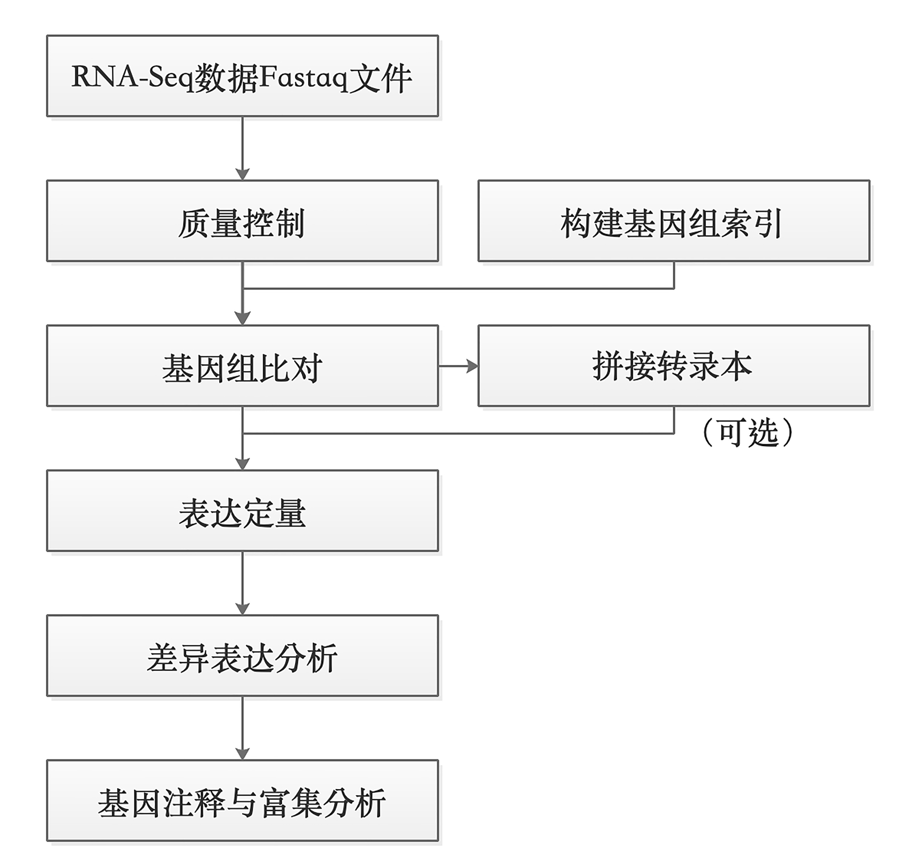
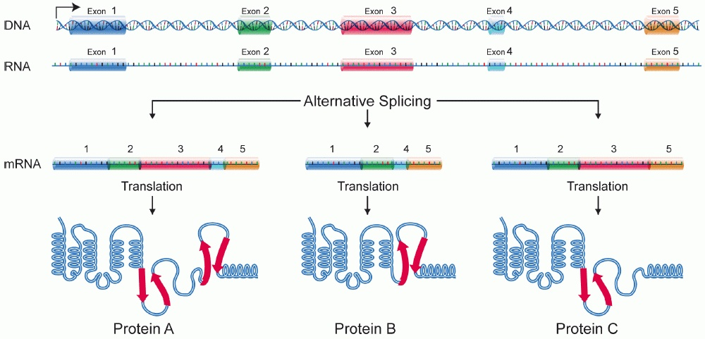
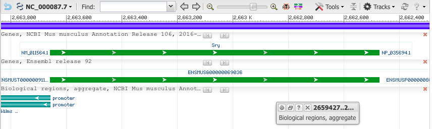
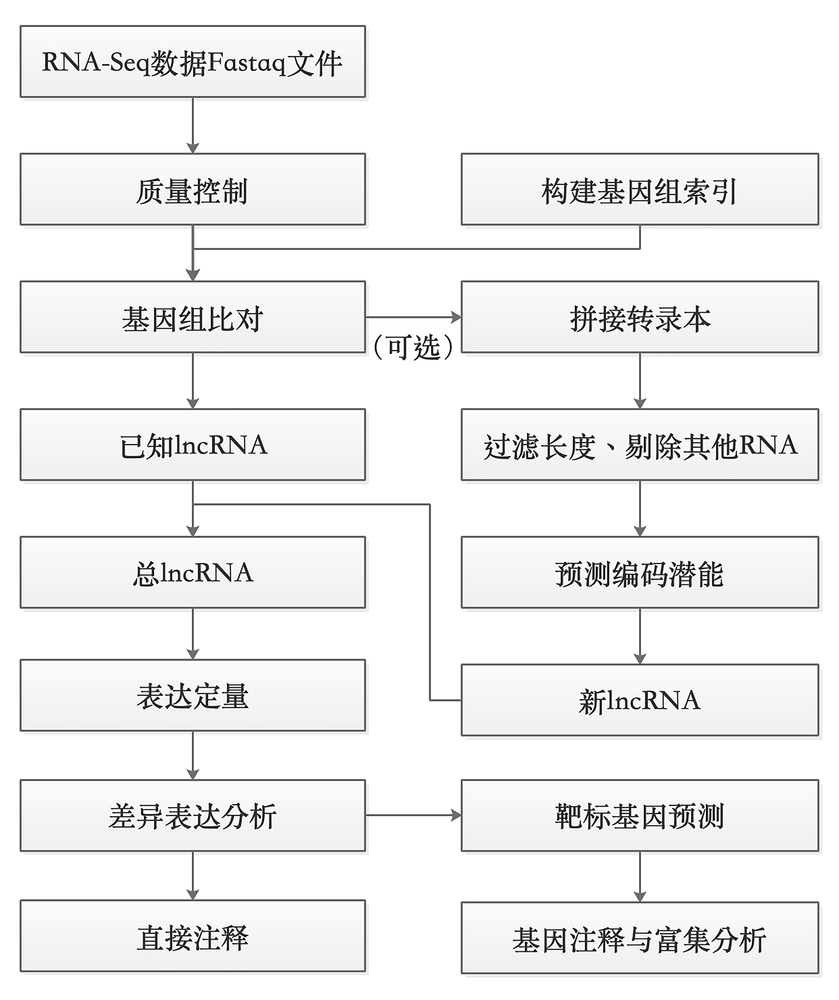
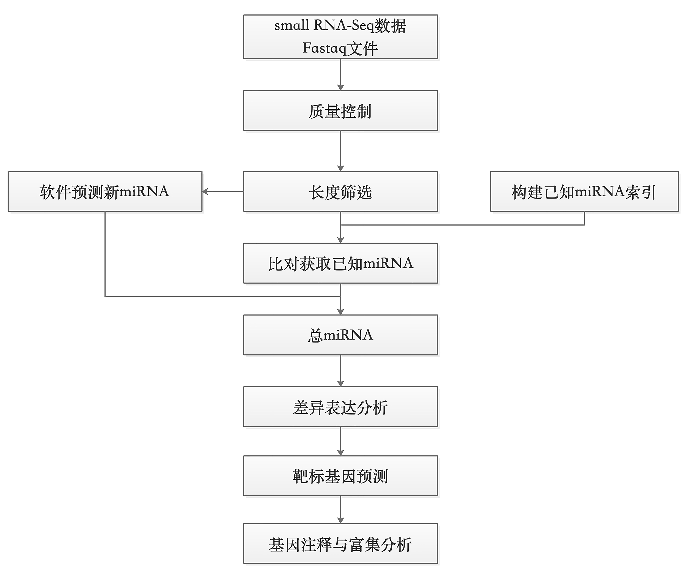
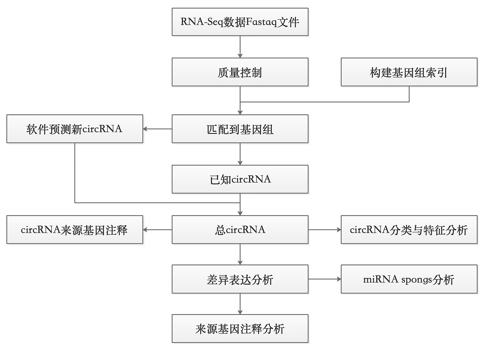
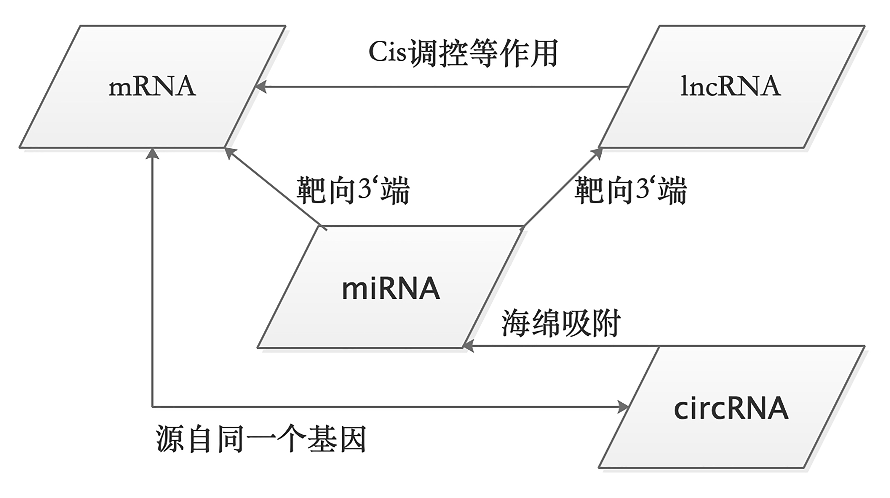

# RNA-seq：从表达定量到差异表达 {#sec-ch05}

## 本章提要 {#chapter-summary-05 .unnumbered}

本章围绕一个 bulk RNA-seq 研究问题，依次组织样本与建库信息、示例项目、质控和剪接感知比对、表达定量、样本探索、差异表达及功能解释。你需要知道 counts、TPM 等数据表示的用途，能检查样本顺序和比较方向，并说明图表支持的结论及其局限。所需统计概念会在分析步骤中给出简要解释，系统学习可回看第 11 章。最终目标是一份包含数据来源、质量判断、结果和方法说明的分析报告。

## 研究问题、建库策略与分析对象 {#sec-05-01}

明确样本中的RNA如何进入文库，以及最终要估计什么。

### 转录组数据分析 {#src-0050-RNA-seq-1}

[]{#RNA_Seq}

RNA测序（RNA sequencing，RNA-Seq）是一种非常成熟的研究转录组学的技术，是目前使用最广泛的高通量测序技术之一。一个细胞所蕴含的全部遗传物质（DNA）即基因组，根据中心法则[^rna-ref-1]，遗传信息由DNA通过转录作用流向RNA，这些RNA的总和被称为转录组 （transcriptome），研究转录组的方式方法及相关技术即转录组学（transcriptomics）。通过转录组测序可以解决多种生物学问题，例如寻找实验组和对照组的差异表达基因、目标研究对象在不同发育或者生物学过程中的基因表达时序性变化等。

### 什么是RNA-Seq？ {#src-0050-RNA-seq-5}

RNA可以分为能够编码蛋白基因的信使RNA（mRNA）[^rna-ref-2]和非蛋白编码RNA （non-coding RNA, ncRNA），例如人类基因组，含有约20000个蛋白编码基因和7000个非蛋白编码RNA基因。随着研究的深入，生命科学研究者对RNA的认识逐渐全面，陆续发现了生物体中多种类型的非编码RNA，有持家非编码RNA（house-keeping non-coding RNA）：在翻译过程中起转运作用的tRNA[^rna-ref-3]、核糖体的组成成分rRNA[^rna-ref-4] 、参与mRNA剪接的snRNA（small nuclear RNA）[^rna-ref-5]等；还有能够起到调控作用的非编码RNA：长非编码RNA（long non-coding RNA, lncRNA）、miRNA（mircoRNA）[^rna-ref-6]、小干扰RNA（small interfering RNA, siRNA）和环状RNA（circRNA）等。

研究人员通常会对mRNA和一些调控非编码RNA感兴趣，针对不同类型的RNA，采取的测序手段也不同，主要表现为样本建库策略的不同。测序仪通常只能对DNA序列进行测序，测序之前对样品里的目标待测RNA进行处理的过程称为“文库的制备”，简称建库（@fig-06-rna-seq-001 ）。 
	


{#fig-06-rna-seq-001}


用富集polyA方式可以获得mRNA的表达信息、也可以获得部分lncRNA（含有polyA 的lncRNA）的表达信息；通过去rRNA方式建库可以检测到mRNA、全部lncRNA、circRNA的表达信息；去线性建库则是专门为了检测circRNA的表达；短片端建库能够获得以miRNA为主的小RNA表达信息。选用何种建库方式，应结合研究目的来进行实验设计。

#### 对mRNA测序 {#src-0050-RNA-seq-15}

研究蛋白编码基因表达应采用富集poly-A的方式进行建库测序（@fig-06-rna-seq-001 ）。利用多数真核 mRNA 具有 poly(A) 尾的特性，对样本中含有poly-A的RNA进行富集。需要注意的是，部分lncRNA也含有poly-A结构，所以采取这一方式建库也可以检测到这部分lncRNA的表达。mRNA测序一般采取双端测序，测序读长150bp，数据量要求在6G clean reads左右。

建库分为多个步骤：

1. 用磁珠捕获含有poly-A结构的RNA；
2. 将RNA片段化，这是由于二代测序技术的限制只能对最长数百bp的DNA进行测序，而mRNA的长度平均为数千bp；
3. RNA反转录为小片段的双链cDNA，因为单链RNA的稳定性太差，且测序仪是针对DNA测序的；
4. 对cDNA的3'端加A，使之成为粘性末端，然后链接上barcode序列和统一的接头序列，在测序过程中是对多个样本同时测序，为了区分开来需要给不同的样品加上不同的barcode。

#### 长非编码RNA-seq {#src-0050-RNA-seq-26}

长非编码RNA是一类长度大于200 nt的长非编码RNA，在不同物种中的保守性较差，曾经被认为是无用的RNA，目前被发现广泛参与基因表达调控的多种过程[^rna-ref-7]。可根据其在基因组上的位置分为四类：

1. 与编码基因有重叠且转录方向一致的同义长非编码RNA（sense lncRNA）；
2. 与编码基因有重叠但在反义链上的反义长非编码RNA（antisense lncRNA）；
3. 由编码基因内含子转录产生的内含子长非编码RNA（intronic lncRNA）；
4. 以及位于两个编码基因之间非编码区的基因间区长非编码RNA（intergenic lncRNA, lincRNA）。

lncRNA的发挥多种调控功能，扮演信号分子、诱导因子、引导分子、支架分子等多种角色[^rna-ref-8]。

对lncRNA 进行测序需要采用去rRNA的方法建库，以最大限度地保留lncRNA（@fig-06-rna-seq-001 ）。与此同时，mRNA、snoRNA、snRNA、tRNA和cricRNA的表达也能在rRNA建库转录组测序中得到。与富集polyA方法不同的是，建库的第一步是去除样本中的rRNA，接下的步骤则与富集polyA方式建库差不多。lncRNA测序一般采取双端测序，测序读长150bp，数据量要求在10～12G clean reads。

#### small RNA-seq {#src-0050-RNA-seq-39}


::::: {.callout-note .book-core title="核心知识｜microRNA 与小 RNA 测序"}

microRNA广泛存在于动植中，是一类长度为22nt左右的小非编码RNA，通过抑制蛋白质翻译或者降解mRNA，在多种生物学过程中发挥调控作用。对microRNA测序需要做小RNA测序（small RNA-seq ），建库过程中需要回收小片段，这是与mRNA建库的主要不同之处。miRNA的功能涉及多种生物学过程，有潜力成为许多疾病包括癌症的标志物。建库起始样本可以用总RNA，也可以用分离纯化得到的small RNA。

:::::


1.基于small RNA本身对结构特征在3‘端和5’端连上接头序列，多数small RNA具有天然的磷酸化5‘端，且3‘端具有羟基基团，便于核酸序列的连接；
2.然后进行少量逆转录PCR扩增；
3.通过PAGE胶对特定大小的small RNA片段进行纯化，小RNA片段较短20～30nt，加上接头序列后长度在150bp左右；
4.对文库的片段大小、纯度和浓度进行质检。
5. 将得到的文库扩增后上机测序，测序读长50bp，数据量要求在10～20M clean reads。

#### circRNA-seq {#src-0050-RNA-seq-49}

通常情况下，DNA和RNA是以线性形式存在的，有时候也以环状的形式出现，例如线粒体DNA和细菌DNA、类病毒和一些RNA病毒的单链环状RNA基因组。近年研究发现，真核生物细胞普遍且稳定存在环状的RNA，是mRNA剪接过程中形成的，主要通过吸附miRNA来实现转录水平的调控。circRNA能够类似“海绵”一样竞 争性结合miRNA或RNA结合蛋白，从而可能在生理和疾病过程中 发挥重要的功能。

去rRNA的方式，是目前最常用的方法，可以捕捉环形RNA的信息；另外，也可以通过去线性RNA的方式建库测序，核糖核酸酶R从RNA的自由3'端向5'端方向逐一水解线性RNA，烟草酸性磷酸酶和终止子外切酶能够从5'端向3'端方向逐一水解RNA，而环形RNA没有3'与5‘端和poly(A)，因此不会被降解；还可以利用环形RNA与线性RNA电泳迁移速度的不同来实现对环形RNA的特异性捕获，因为环形RNA会比等长的线性RNA迁移速度快，并且凝胶交联程度越高这种差别就会越大[^rna-ref-9]。总的来说rRNA的方式建库具有更高的性价比，能够同时获得mRNA、lncRNA和circRNA的信息。

::: {.book-placeholder}
本节内容待补充。
:::
单细胞与空间转录组的技术背景和分析入口见[第 9 章](09-single-cell-and-spatial-omics.md)。

## 建立贯穿全章的示例项目 {#sec-05-02}

让后续各步骤对应同一批样本和同一个研究问题。

### RNA-seq的分析 {#src-0050-RNA-seq-101}

有参转录组分析一般包括：测序数据的质量控制、构建参考基因组索引、将read比对到参考基因组、拼接新的转录本（可选）、基因表达的定量、差异表达基因的分析，以及对目标基因群进行注释和富集分析（@fig-06-rna-seq-003 ）。	


{#fig-06-rna-seq-003}


转录组测序分析的常用软件如 @fig-06-rna-seq-004 所示。

测序原始数据的质量评估常用FastQC进行分析； 

Trimmomatic、Cutadapt、Fastx-toolkit用于去除低质量片段和接头序列等；

BWA、Bowtie、Bowtie2、HISAT、HISAT2、STAR等软件用于构建参考基因组和序列比对；

组装转录本是一个可选项，常用软件为Cufflinks、StringTie；

对转录本的常用定量软件有HTSeq、Cuffquant+Cuffnorm、featureCount；

差异表达分析有cuffdiff、DESeq/DESeq2、edgeR；

得到的差异基因需要注释起功能，常用软件为clusterprofer、DAVID网站、Metascape网站等。


{#fig-06-rna-seq-004}


### RNA-seq分析实例 {#src-0050-RNA-seq-392}

在转录组研究工作中，至少设置两组样本，对照组和实验组，获取与实验组相关的某种疾病、表型或生命活动过程中具有重要作用的miRNA种类，预测靶标基因及其生物学功能。最好每组样品设置3个及以上生物学重复，以降低样品特异性带来的误差。

#### 数据获取 {#src-0050-RNA-seq-396}

首先从网络下载RNA-Seq数据和人类基因组及基因组注释文件。

示例采用GEO数据库中的转录组数据GSM1502498，GSM1502499，GSM1502502，GSM1502503，其中前两者为实验组，后两者为对照组。数据下载可以直接点击网页链接，也可以在linux服务器上用wget+链接自动获取。

*方法一 从网页链接直接下载*

下载链接：

- GSM1502498（https://trace.ncbi.nlm.nih.gov/Traces/sra/?run=SRR1573494）
- GSM1502499（https://trace.ncbi.nlm.nih.gov/Traces/sra/?run=SRR1573495）
- GSM1502502（https://trace.ncbi.nlm.nih.gov/Traces/sra/?run=SRR1573498）
- GSM1502503（https://trace.ncbi.nlm.nih.gov/Traces/sra/?run=SRR1573499）

(网页截图)

*方法二，使用命令行下载*


```{.bash data-book-role="code"}
wget 
```

这里选用的是人类样本，因此需要下载人类基因组和基因组注释文件。基因组文件可以从UCSC genome browser （https://genome.ucsc.edu/index.html）和 Ensembl（http://asia.ensembl.org/index.html）网站上获取。

(网页截图)

::: {.book-placeholder}
本节内容待补充。
:::
## RNA-seq质控与剪接感知比对 {#sec-05-03}

确认文库特征和比对策略适合表达分析。

### 序列比对 {#src-0050-RNA-seq-247}

建立好参考基因组索引之后，测序得到的短reads可以据此进行基因组匹配，将高通量测序结果回溯基因组位置，这个过程叫做序列比对（reads mapping），将对象数量众多的reads（>100M reads pairs）比对到一条唯一且长度不短的参考基因组（>3Gbp），强调回溯的动作，需要较高的计算成本和巧妙的比对策略。这与在进化分析等工作中提到的双序列比对 （pairwise alignment）和多序列比对（multiple sequences alignment）不同，alignment的比对通量较低，更多的强调两条序列或者少数几条序列之间的比对。RNA比对用到的三种策略是Exon-first approach, seed-extend approach, Potential limitations of exon-first approaches。常用的算法是BWT算法和后缀树（Suffix tree），这一点我们在之前的章节已经有所介绍，这里就不再赘述了。

序列比对是获得每条测序片段在参考基因组上对应染色体上的位置坐标、正负链等信息。比对率能反映实验测序样品与参考基因组的相似关系，也反映了测序质量的高低。一般情况下，在80%以上，回帖多个位置的测序序列占总体百分比通常不超过10%。常用比对软件Tophat2、Bowtie2、STAR、HISAT2、RSEM等。

#### SAM文件与BAM文件 {#src-0050-RNA-seq-253}

序列比对文件采取SAM（The Sequence Alignment/Map format）文件、BAM文件格式。Heng Li等人完成了SAM文件、BAM文件的标准制定，并开发了初代对软件。SAM文件由两部分组成：头部区和主体区，头部区以“@”开始，提供比对的总体信息，例如SAM格式版本、比对参考序列、比对使用的命令等；主体区是比对结果，每一行储存一个比对结果，共11个主列和1个可选列。

关于SAM文件与BAM文件的详细介绍与基本操作，也请翻看前面的章节。我们这里再次提出这个标题，只是想反复为读者强调，这个文件的重要性，以及强调概念无论是DNA还是RNA的比对结果，都是可以保存成对应的SAM/BAM文件的。

#### 序列比对软件 {#src-0050-RNA-seq-259}

- Bowtie和Bowtie2

Bowtie（Ultrafast and memory-efficient alignment of short DNA sequences to the human genome）和Bowtie2都是常用的短序列比对软件，生成SAM格式的序列比对文件。Bowtie在小于50bp的reads比对中更精确更快，最长支持1000bp；而Bowtie2在大于50bp的reads比对中更精确更快，reads长度没有上限，支持空位比对、局部比对。

- BWA
BWA全称（Alignment with Burrows-Wheeler transform. Heng Li and Richard Burbin）。BWA有多个子命令，可以实现不同算法的比对。

上述3款软件都是针对DNA序列比对进行设计的，并不能直接应用于RNA-Seq的比对。一个最主要的原因就是因为真核生物的基因是间隔的，每两个外显子中间就会有一个内含子。最终成熟的mRNA是不包含内含子序列的，因此针对真核生物的RNA-Seq数据的比对，需要在上述3款软件的基础上加上一些限制条件与修正。最常用的有下面3款Tophat/Tophat2，HISAT/HISAT2, STAR。

- Tophat/Tophat2

Tophat的最新版Tophat2是基于Bowtie2的比对工具，与下游Cufflinks分析软件组合使用，优点是生成的文件内容丰富，不仅仅生成了比对结果，还对剪切位点等信息进行了输出。比对过程调用了Bowtie/Bowtie2, 大题策略是 先比对能比对上的reads，比对不上的reads根据可变剪切的方式拆开再比。该软件最大的缺点是处理不好假基因问题。(参考文献 TopHat: discovering splice junctions with RNA-Seq, TopHat2: accurate alignment of transcriptomes in the presence of insertions, deletions and gene fusions)。使用Tophat时，Bowtie或者Bowtie2，bowtie2-align, bowtie2-inspect, bowtie2-build和samtools，这些命令必须要在系统环境变量PATH中。Tophat能比对的最大reads长度时1024 bp，单端不能与双端混合，不同插入片段长度的双端不能混合。

- HISAT/HISAT2

HISAT（Hical Indexing for Spliced Alignment of Transcripts）和HISAT2(Graph-based genome alignment and genotyping with HISAT2 and HISAT-genotype, Daehwan Kim)是Tophat2的升级版本。利用数量众多的索引，覆盖整个基因组，使用小索引结合几种比对策略，以人类基因组为例，需要48,000个索引，每个索引代表～64，000 bp的基因组区域，从而实现高效比对，尤其是跨越多个外显子的比对，大大提升速度与index的构建方式。其下游分析软件为StringTie和Ballgown。HISAT2相比HISAT，考虑了SNP信息。

HISAT/HISAT2与Tophat/Tophat2出自同一个课题组，目前作者提倡使用HISAT2来替代之前的Tophat2流程。

- STAR

STAR(STAR: ultrafast universal RNA-Seq aligner，Alexander Dobin)的优势在于快，能够快速mapping，是ENCODE计划使用的比对软件。缺点在于占用内存比较大，以人类的参考基因组为例，比对时的运行内存需要28G~32G左右。STAR使用了Suffix Tree 的index：先把read切成若干小的seed，找到全基因组符合seed的位置；再通过打分算法，把邻近的全基因组符合的seed拼在一起，形成mapping结果。

如果比对任务非常多，数据量很大，我们推荐使用STAR这个比对软件得到最终的比对结果。

### 质量控制 {#src-0050-RNA-seq-423}

从GEO数据库下载的数据文件格式为SRA，需要使用官方提供的SRA Toolkit进行转换，将sra文件转换为fastq格式文件，软件下载链接： https://github.com/ncbi/sra-tools/wiki/02.-Installing-SRA-Toolkit。


```{.bash data-book-role="code"}
fastq-dump SRR1573494.sra
```

使用FastQC做质量控制：


```{.bash data-book-role="code"}
fastqc SRR1573494.fq
```

使用cutadapt去除接头序列，过滤数据质量：


```{.bash .numberLines data-book-role="code"}
cutadapt -j 6 --times 1 -e 0.1 -O 3 --quality-cutoff 25 -m 55 \
-a AGATCGGAAGAGCACACGTCTGAACTCCAGTCAC \
-A AGATCGGAAGAGCGTCGTGTAGGGAAAGAGTGTAGATCTCGGTGGTCGCCGTATCATT \
-o fix.fastq/test_R1_cutadapt.temp.fq.gz \
-p fix.fastq/test_R2_cutadapt.temp.fq.gz \
 raw.fastq/test_R1.fq.gz \
 raw.fastq/test_R2.fq.gz > fix.fastq/test_cutadapt.temp.log 2>&1 &
```

也可以使用fastx_toolkit去除接头序列，过滤数据质量：


```{.bash data-book-role="code"}
fastq_quality_filter -v -q 20 -p 80 -Q 33 -i SRR1573494.fastq -o SRR1573494_q20_p80.fq
```

### 建立参考基因组索引 {#src-0050-RNA-seq-455}


#### HISAT2 {#src-0050-RNA-seq-457}

使用`hisat2`构建基因组索引：


```{.bash data-book-role="code" data-focus-lines="3"}
hisat2_extract_splice_sites.py Homo_sapiens.GRCh38.101.gtf >genome.ss
hisat2_extract_exons.py Homo_sapiens.GRCh38.101.gtf >genome.exon
hisat2-build -p 20 Homo_sapiens.GRCh38.dna.toplevel.fa genome
hisat2-build -p 20 --exon genome.exon --ss genome.ss Homo_sapiens.GRCh38.dna.toplevel.fa genome_tran
hisat2-build ref_hg38.fa ref_hg38.fa > hisat2_build.log 2>&1 &
```

::: {.book-prose}

#download some resource  
##SNP  
http://hgdownload.cse.ucsc.edu/goldenPath/hg38/database/  

##GTF  


:::

```{.bash .numberLines data-book-role="code" data-focus-lines="11"}
#make exon 
hisat2_extract_exons.py hg38_refseq.gtf > hg38_refseq.exon &

#make splice site
hisat2_extract_splice_sites.py hg38_refseq.gtf > hg38_refseq.ss &

#make snp and haplotype
hisat2_extract_snps_haplotypes_UCSC.py ref_hg38.fa snp151Common.txt snp151Common &

#build index
hisat2-build -p 6 --snp snp151Common.snp --haplotype snp151Common.haplotype --exon hg38_refseq.exon  --ss hg38_refseq.ss ref_hg38.fa ref_hg38.fa.snp_gtf > hisat2_build.log 2>&1 & 

# hisat2-build——hisat2构建索引的命令

# -p——使用多少个核，20代表使用20个核心

# Homo_sapiens.GRCh38.dna.toplevel.fa——从Ensembl数据库下载的人类基因组文件

# genome——将索引命名为genome
```

参数解释：


::: {.book-prose}

-p &lt;int&gt; default: 1 设置多线程运行  
--snp &lt;path&gt; 输入一个包含SNP信息的文件，含5列数据：SNP ID、参考序列ID、SNP类型（single、deletion或insertion）、SNP位点（以第一个碱基位点为0计算）、变异碱基信息。  
--haplotype &lt;path&gt; 单倍型信息文件，表明--snp参数指定的某些变异位点子啊要分析的样品中是单倍型的，和气变异位点碱基信息一致。含5列数据：Haplotype ID、参考序列ID、起始位点（以第一个碱基位点为0计算）、结束位点、逗号分隔的多个SNP ID。  
--ss &lt;path&gt; 输入一个包含有剪接位点（Splicing Site）信息的文件。该文件可以利用HISAT2软件自带的hisat2_extract_splice_sites.py程序对编码蛋白基因结构注释GTF文件转换获得。  
--exon &lt;path&gt; 输入一个含有外显子信息的文件。利用HISAT2软件自带的hisat2_extract_exons.py程序对编码蛋白基因结构注释GTF文件转换获得该文件。  


:::

#### STAR {#src-0050-RNA-seq-505}

还可以使用STAR构建基因组索引：


```{.bash data-book-role="code"}
STAR --runThreadN 12 --runMode genomeGenerate \
--genomeDir /home/menghaowei/ngs_course/reference/STAR_index \
--genomeFastaFiles /home/menghaowei/ngs_course/reference/STAR_index/ref_hg38.fa \
--sjdbGTFfile /home/menghaowei/ngs_course/reference/gtf/hg38_refseq_from_ucsc.rm_XM_XR.fix_name.gtf \
--sjdbOverhang 150 & 
```

### 序列比对 {#src-0050-RNA-seq-518}


#### Tophat {#src-0050-RNA-seq-520}

使用Tophat将转录组数据的reads比对到参考基因组：


```{.bash data-book-role="code"}
tophat -r 50 -p 50 –G chrX.gtf  -o ERR188044 index/chrx.index ERR188044_chrX_1.fastq.fa ERR188044_chrX_2.fastq.fa
```

也使用Tophat2比对到参考基因组：


```{.bash data-book-role="code"}
tophat2 -o ./test_tophat2 -p 6 \
-G /home/menghaowei/ngs_course/reference/gtf/hg38_refseq_from_ucsc.rm_XM_XR.fix_name.gtf \
/home/menghaowei/ngs_course/reference/bowtie2_index/ref_hg38.fa \
./fix.fastq/test_R1_cutadapt.fq.gz \
./fix.fastq/test_R2_cutadapt.fq.gz > test_tophat2/test_tophat2.log 2>&1 & 
```

#### HISAT2 {#src-0050-RNA-seq-538}

也使用`hisat2`比对到参考基因组：


```{.bash .numberLines data-book-role="code"}
hisat2 -p 12 \
-x /home/menghaowei/ngs_course/reference/hisat2_index/ref_hg38.fa \
-1 ./fix.fastq/test_R1_cutadapt.fq.gz \
-2 ./fix.fastq/test_R2_cutadapt.fq.gz \
-S ./bam/test_hisat2.sam > ./bam/test_hisat2.log 2>&1 &

#mapping
hisat2 -p 6 \
-x /Users/meng/ngs_course/reference/hisat2_index/ref_hg38.fa.snp_gtf \
-1 ./fix.fastq/test_R1_cutadapt.fq.gz \
-2 ./fix.fastq/test_R2_cutadapt.fq.gz \
-S ./bam/test_hisat2.sam > ./bam/test_hisat2.log 2>&1 &
```


```{.bash data-book-role="code"}
hisat2 -x genome -u 1000000 -p 24 -I 0 -X 500 --fr --min-intronlen 20 --max-intronlen 4000 -1 reads.1.fastq -2 read.2.fastq -U single.fastq -S result.sam
```

参数：


::: {.book-prose}

-x &lt;hisat-idx&gt; 设置索引数据文件前缀  
-1 &lt;m1&gt; 双末端测序结果的第一个文件，若有多组数据，使用逗号将文件分隔，reads长度可以不一致  
-2 &lt;m2&gt; 双末端测序结果第二个文件，顺序和-1参数对应。  
-U &lt;r&gt; 单端数据文件，若有多组数据，使用逗号将文件分隔  
--sra-acc &lt;SRA accession number&gt; 输入SRA登录号。多组数据之间用逗号分隔，HISAT将自动下载数据并识别数据类型，进行比对。参数大正常使用需要安装NCBI-NGS toolkit  
-S &lt;hit&gt; 设置输出文件名。  


:::

#### STAR {#src-0050-RNA-seq-574}

也使用STAR比对到参考基因组：


```{.bash .numberLines data-book-role="code"}
STAR \
--genomeDir /home/menghaowei/ngs_course/reference/STAR_index \
--runThreadN 6 \
--readFilesIn ./fix.fastq/test_R1_cutadapt.fq.gz ./fix.fastq/test_R2_cutadapt.fq.gz \
--readFilesCommand zcat \
--outFileNamePrefix ./bam/test_STAR \
--outSAMtype BAM Unsorted \
--outSAMstrandField intronMotif \
--outSAMattributes All \
--outFilterIntronMotifs RemoveNoncanonical > ./bam/test_STAR.log 2>&1 & 
```

参数解释：


::: {.book-prose}

-b 默认输出SAM格式文件，该参数设置输出BAM格式  
-h 默认输出不带头部信息的SAM文件，参数设定输出SAM文件带头部信息  
-H 只输出头部信息  
-S 默认输入是BAW文件，若是输入SAM文件，最好加这个参数  


:::

#### samtools操作SAM/BAM文件 {#src-0050-RNA-seq-601}


```{.text data-book-role="data"}
samtools view [options] <in.bam> | <in.sam> [region1 [...]]
```

```{.bash data-book-role="code"}
samtools view -bS adc.sam >abc.bam
samtools view -b -S abc.sam -o abc.bam
```

::: {.book-prose}

提取比对到参考序列上的比对结果：  

:::

```{.bash data-book-role="code"}
samtools view -bF 4 abc.bam >abc.F.bam
```

::: {.book-prose}

提取paired reads中两条reads都比对到参考序列上的比对结果，只需要把两个4+8的值12作为过滤参数：  

:::

```{.bash data-book-role="code"}
samtools view -bf 4 abc.bam >abc.f.bam
```

::: {.book-prose}

提取BAM文件中比对到scaffold1上的比对结果，并保存到SAM文件格式：  

:::

```{.bash data-book-role="code"}
samtools view abc.bam scaffold1 >scaffold1.sam
```

::: {.book-prose}

提取能比对到scaffold1 30k到100 k区域到比对结果：  

:::

```{.bash data-book-role="code"}
samtools view abc.bam scaffold1:30000-10000 > scaffold1_30k-100k.sam
```

::: {.book-prose}

根据FASTA文件，将header加入到SAM或BAM文件中：  

:::

```{.bash data-book-role="code"}
samtools view -T genome.fasta -h scaffold1.bam >scaffold1.h.sam
```

::: {.book-placeholder}
本节内容待补充。
:::
### 知识问答 23：RNA 与 DNA 的比对差异 {#question-21-285}

#### 问题描述 {#question-21-286}


Hello大家好！我们今天又见面了！

我们通过前期的22个问题，从数据的简单质控，到测序数据的mapping，再到mapping后的SAM文件都有了一个比较清楚的认识。那么说了半天的mapping问题，一直都是在以DNA进行举例，RNA的比对我们都还没有谈。那么今天我们就来简单谈谈RNA序列的mapping，尤其是真核生物的RNA序列比对。


#### 1. RNA与DNA结构的不同 {#question-21-292}

一般来说，DNA的mapping比较容易，因为DNA在基因上是连续的，直接回贴到基因组就可以找到相应的定位。就比如我们常用的Whole Genome Sequence（WGS）即全基因组测序；或者是我们所说的ChIP-Seq即染色体免疫共沉淀测序都是直接对DNA进行建库测序，其测序结果都是FASTQ文件，直接用bowtie2，bwa比对到基因组就可以拿到标准的SAM文件。

但是RNA就不一样了，真核生物的RNA需要经过复杂的加工过程。在细胞中RNA层面的调控至少可以分成2个大的阶段co-transcription（转录的同时） 和 post-transcription（转录以后）其中的调控机制也有很多。

对我们mapping影响最大的因素是：真核生物转录出来的初步的mRNA都是带有intron（内含子）的，随后都需要在co-transcription（转录的同时） 或post-transcription（转录以后）阶段通过：1. alternative splicing（可变剪切）剪切掉intron；2.polyA尾巴； 3.加5'的帽子结构。这3个步骤，将不成熟的mRNA变为最终成熟的mRNA再转运出核，行使功能。


{#fig-a-questions-21-25-006}


 

#### 2.RNA比对的常用软件 {#question-21-307}

目前大家最常用的转录组比对软件有下面几个：

- tophat2，应用最广泛的比对软件，但是速度很慢，已经基本被淘汰了，大约需要4~5G内存就能运行；
- hisat2，tophat2的原班人马搞得新一代转录组比对软件，比对速度大大提高，我强烈推荐，大约需要4~5G内存就能运行；
- STAR，非常适合于大量数据的并行计算，速度非常快，对于同时有参考基因组和参考转录组的物种，比对的准确率很高，不过index很大，至少需要30G以上内存才能运行。  


#### 3.提出问题 {#question-21-314}


**问题1：如果你有一套标准的polyA捕获得到的RNA-Seq测序数据，对reads进行了前处理工作与质量控制工作，但是你的比对策略为：先尝试mapping，把能mapping到基因组上的reads都先mapping；然后把不能进行mapping的reads进行一定规则的拆分，再进行第二轮mapping，从而解决跨intron区域的问题（以上为tophat的mapping策略）。请问，这样mapping的最大问题是什么？（提示，需要知道一些假基因的概念！）**


::: {.book-prose}

首先解释一下假基因，假基因（Pseudogenes）是指是一类染色体上的基因片段。假基因的序列通常与  
对应的基因相似，但至少是丧失了  一部分功能，基因不能表达或其编码的蛋白质没有功能；这种基因  
在基因组上的分布非常普遍，那么在假基因普遍存在的情况下上述比对策略就会受到假基因的干扰，会有  
很多基因比对到假基因上。  

:::


**问题2：在human中，是不是所有的蛋白基因（protein coding gene）都含有intron？**  


::: {.book-prose}

并不是，SRY基因是人体Y染色体上的一段基因，该基因是决定男性睾丸发育的主要基因，存在于Y染色体  
的短臂末端上，该基因只有一个exon。  

:::

{#fig-a-questions-21-25-007}

   
 答2 SRY基因结构,没有intron.    

**问题3：在human中，是不是所有的蛋白基因的成熟mRNA都有polyA尾巴？**


::: {.book-prose}

并不是，组蛋白mRNA末端就没有polyA尾巴。  

:::

## 从reads到基因和转录本定量 {#sec-05-04}

理解计数由哪些归属规则产生。

### 转录本组装 {#src-0050-RNA-seq-286}

组装转录本是一个可选项，如果想挖掘测序数据中的新转录本，则需要做这一步分析。拼接软件根据参考基因组将测序处理得到的高质量测序片段比对到该参考基因组上，然后对比对上的片段进行转录本组装。Cufflinks、StringTie和Scripture都是常用的转录本组装软件。

Cufflinks可以依赖或者不依赖物种基因组注释文件进行转录本拼接。利用Tophat或HISAT2比对的结果来组装转录本。Cufflinks其实是一套软件，包括组装转录本的Cufflinks、合并gtf文件的Cuffcompare、比较转录本的Cuffcompare、定量转录本的Cuffquant、对多样本标准化的Cuffnorm，以及计算不同组差异表达的Cuffdiff。

（ Cufflinks套件示意图）

Cufflinks是根据Tophat或HISAT2比对结果，输入文件是排序后的BAM或SAM文件，据此进行序列分析，获得含有转录本序列信息和表达信息的GTF文件。但Cufflinks得到的GTF文件不包括起始密码子和终止密码子，是不标准的，称为transfrag转录片段。Cufflinks的输出文件包括表达量FPKM文件genes.fpkm_tracking、isoforms.fpkm_tracking，和GTF文件transcripts.gtf，包含序列名、来源、特征、起始坐标、终止坐标、得分、正负链、读码框、属性这九种信息。但Cufflinks命令只能对一个SAM/BAM文件进行分析，在处理多个样品时，可以使用cuffmerge将多个样品的transcripts.gtf文件合为一个更加全面的转录本注释文件。

StringTie是Cufflinks的升级版本，其下游常使用Ballgown软件分析差异表达。和 Cufflinks一样，输入文件是按坐标排序后的BAM文件，不能对具有多位点比对结果的reads进行过滤，否则会导致转录本序列不完整。进行转录本组装后可以用于基因测序或者与参考GTF/GFF3文件比较以寻找新转录本。但StringTie不直接提供表达量raw count文件，可以使用prepDE.py程序，根据GTF结果文件中的coverage信息，转换得到raw count数据，用于edgeR和DESeq2等其他差异表达软件的分析。

Scripture根据比对得到的spilce reads构建出连接图，采用统计法，分析连接序列与非连接序列比对区域的丰度信息，对可能的连接路径进行评分，依据得分情况选择可能的转录本，依据双端测序reads之间的距离，简介转录本或过滤非转录本。

#### 表达定量软件 {#src-0050-RNA-seq-349}

常用的表达定量软件有HTSeq、Cuffquant+Cuffnorm、featureCount。定量分析得到的Counts数据用于接下来的不同样品间的基因表达量差异分析。

HTSeq是用python编写的用于read计数的软件，用于有参考基因组的转录组测序数据的基因表达定量分析，需要SAM和基因组GTF文件。HTSeq软件根据SAM/BAM比对结果文件和基因结构注释GTF文件得到基因水平的counts表达量。HTSeq有有三种计算模式，ambigous表示read比对到多个基因上，no_feature表示read没有比对到基因组上。

（示意图）

Cuffquant是Cufflinks一套的基因表达定量软件，输入一个SAM/BAM文件进行表达量计算，生成一个二进制的结果文件。对多个 Cuffnorm 命令将多个二进制表达量结果进行标准化，给出count值或者FPKM值，与cuffdiff非常类似，但不进行差异化分析，结果可以用其他软件进行分析。

featureCount

### 转录组拼接  {#src-0050-RNA-seq-625}


#### Cufflinks {#src-0050-RNA-seq-627}

使用Cufflinks组装转录本：


```{.bash data-book-role="code"}
cufflinks -o ERR188044/cufflink ERR188044/accepted_hits_sorted.bam -p 50 -g chrX.gtf -b chrX.fa
```

使用Cuffmerge合并新的转录本:


```{.bash data-book-role="code" data-focus-lines="2,5"}
#使用cuffmerge:
cuffmerge -g Homo_sapiens.GRCh37.85.gtf -s hisat/human_genome.fa -p 40 -o merged.gtf assemblies.txt

#使用cuffcompare:
cuffcompare -r Homo_sapiens.GRCh38.85.gtf -i 1.txt -o cuffcmp01
```

#### StringTie {#src-0050-RNA-seq-647}

使用StringTie组装转录本：


Cufflinks输入的必须是排序后的BAM或SAM文件，对于剪接性比对结果，记录中要有XS标签。“XS:A:-”标签表明reads比对到了负义链上，使用HISAT2软件对非链特异性测序的RNA-seq数据进行比对时，一定要添加--dta-cufflinks参数，从而使跨过内含子的剪接性比对结果中含有XS标签，否则cufflinks命令不能正确处理结果。

cufflinks的输出结果有genes.fpkm_tracking, isoforms.fpkm_tracking, transcripts.gtf。前两个时表达量FPKM结果文件，第三个是GTF文件，用于描述基因在染色体上的结构信息：序列名、来源、特征、起始坐标、终止坐标、得分、正负链、读码框、属性。不包含起始密码子和终止密码子，因此GTF不是标准的


```{.bash data-book-role="code"}
cufflinks -p 4 -b genome.fasta -u -o sample1 -L sample1 tophat.ba。m
```


::: {.book-prose}

-o | --output-dir &lt;string&gt;  设置输出文件夹名称  
-p | --num-threads 设置CPU线程数  
-G | --GTF &lt;reference_annotation.gtf.gff&gt; 提供包含有基因结构信息的格式为GTF或GFF文件，计算文件中转录本的表达量。  
-g | --GTF-guide 提供GFF文件，以此知道转录本组装。  

:::

cufflinks命令只能对一个SAM/BAM文件进行表达量分析，不同样品表达量不同，为了获得全面的基因注释信息，用cuffmerge将cufflinks命令生成的多个transcripts.gtf文件融合为一个更全面的转录本注释结果。


```{.bash data-book-role="code"}
cuffmerge -o ./merged_asm -p 4 -s genome.fasta assembly_GTF_list.txt
```


::: {.book-prose}

-o | --output-dir &lt;string&gt;  设置输出文件夹名称  
-p | --num-threads 设置CPU线程数  
-s | --ref-sequence &lt;seq_dir&gt; 基因组DNA序列  

:::


::: {.book-prose}

对一个样品数据进行组装：  

:::

```{.bash data-book-role="code" data-focus-lines="1"}
stringtie sample.bam --rf -l sample1 -o sample1.gtf -p 4
```

::: {.book-prose}

对多个样本对GTF文件进行整合：  

:::

```{.bash data-book-role="code" data-focus-lines="1"}
stringtie --merge -o merge.gtf sample1.gtf sample2.gtf 
```

::: {.book-prose}

对一个样品的表达量进行分析  

:::

```{.bash data-book-role="code" data-focus-lines="1"}
stringtie sample1.demulpos.bam --rf -o sample1.gtf -p 8 -e -G genome.gtf
```

### 表达定量 {#src-0050-RNA-seq-692}


#### HTSeq {#src-0050-RNA-seq-694}

使用HTSeq对基因表达进行定量：


```{.bash .numberLines data-book-role="code"}
htseq-count -f bam -r pos \
--max-reads-in-buffer 1000000 \
--stranded no \
--minaqual 10 \
--type exon --idattr gene_id \
--mode union --nonunique none --secondary-alignments ignore --supplementary-alignments ignore \
--counts_output ./count_result/test_count.tsv \
--nprocesses 1 \
./bam/test_hisat2.sort.bam  ./reference/gtf/hg38_refseq_from_ucsc.rm_XM_XR.fix_name.gtf > ./count_result/test_count.HTSeq.log  2>&1 & 
```

#### featureCount {#src-0050-RNA-seq-710}

使用featureCount对基因表达进行定量：


```{.bash .numberLines data-book-role="code"}
featureCounts -t exon -g gene_id \
-Q 10 --primary -s 0 -p -T 1 \
-a ./reference/gtf/hg38_refseq_from_ucsc.rm_XM_XR.fix_name.gtf \
-o ./count_result/test_count.featureCounts \
./bam/test_hisat2.sort.bam \
./bam/test_hisat2.sort.2.bam > ./count_result/test_count.featureCounts.log  2>&1 & 
```

-a参数默认值为10，忽略掉比对到多个位置的reads信息，其结果有利于后续差异分析。输入的GTF文件不能包含可变剪接信息，否者HTSe会认为没个可变剪接都是单独的基因，导致能比对到多个可变剪接转录本傻姑娘的reads计算结果是ambiguous，不能计算到基因的count中。

ambigous表示read比对到多个基因上，no_feature表示read没有比对到基因组上。


```{.bash .numberLines data-book-role="code" data-focus-lines="2,5"}
# 非链特异性真核转录组测序数据
htseq-count -f sam -r name -s no -a 10 -t exon -i gene_id -m union hisat2.sam genome.gtf >counts_out.txt

# 链特异行真核转录测序数据
htseq-count -f sam -r name -s reverse -a 10 -t exon -i gene_id -m union hisat2.sam genome.gtf >count_out.gtf

# 非链特异原核生物转录组测序数据
htseq-count -f sam -r name -s no -a 10 -t exon -i gene_id -m intercextion-strict bowtie2.sam genome.gtf >counts_out.txt
```

参数说明：


::: {.book-prose}

-f | --format default:sam 设置输入文件格式，sam或者bam  
-r | --order default: name 设置输入文件排序方式，name或者pos。前者按reads名排，后者比对的参考基因组位置进行排序。当测序时间是双端测序是，输入文件按照pos排序，两端的比对结果在文件中不是紧邻的两行，程序会将reads对的第一个比对结果放入内存，知道读取到另一端read的比对结果，选pos可能会导致内存使用过多。其他表达量分析软件要求输入SAM/BAM文件是pos排序的，很多软件出处结果也是按照name排序，有所不同。  
-s | --stranded default:yes 设置是否链特异性测序。值可以为yes,no,reverse.分别代表：非链特异性测序;单端yes表示read比对到基因的正义链上，双端测序表示read1比对到正义链上，reads比对到负义链傻姑娘；reverse表示双端测序与yes值相反的结果。  
-a | --a default: 10 忽略比对质量低于此值的比对结果。  
-t | --type default: exon 程序会对该指定的feature(GTF/GFF文件第三列)进行表达量计算，而GTF/GFF文件中其它的feature都会被忽略  
-i | -idattr default:gene_id 设置feature ID 是由GTF/GFF文件第九列那个标签决定的，若GTF/GFF文件多行具有相同feature ID, 则它们来自同一个feature,程序会计算这些features的表达量之和赋给相应的feature ID。  
-m | --mode deault: union 设置表达量计算模式。参数的值可以有union，intersection-strict, intersection-nonempty。原核生物用intersection-strict,真核生物用union模式。  
-o | --samout 输出一个SAM文件，比对结果多一个XF标签，表示 read比对到了某个feature上。  
-q | --quiet 不输出程序运行的状态信息和警告信息  

:::

#### cuffquant {#src-0050-RNA-seq-752}

用于对一个SAM/BAM文件进行表达量计算，生成一个二进制的结果文件。这部分计算比较消耗计算资源。


```{.bash data-book-role="code"}
cuffquant -o sample1 -p 4 -b genome.fasta -u genome.gtf sample1.sam
```


::: {.book-prose}

-o | --output-dir &lt;string&gt;  设置输出文件夹名称  
-p | --num-threads 设置CPU线程数  
-b | --frag-bias-correct &lt;genome.fa&gt; 知道Cufflinks运行偏差检测和校正算法（bias detection and correction algorithm），提高转录子丰度计算的精确性。  
-u | --multi-read-coreect 让cufflinks更精确地比对到genome多个位点的reads  
-library-type default:fr-unstranded 设置是否为链特异测序或其种类，默认为非链特异性的RNA-seq  

:::

::: {.book-placeholder}
本节内容待补充。
:::
## counts、TPM与样本探索 {#sec-05-05}

为统计检验和可视化选择正确的数据表示。

### 表达定量 {#src-0050-RNA-seq-300}

通过前面的序列比对分析，获得了能够map到各个基因的reads数，也就是原始的count数。但原始的count数并不能完全表征基因的表达情况，因为不同基因的长度不同，不同批次数据的测序量也不同，所以需要通过计算矫正测序深度和基因长度带来的影响，即对基因的表达进行标准化定量（*Manuel Garber et.al., Nat Methods, 2011）。

#### 基因表达定量方式RPKM、FPKM、TPM {#src-0050-RNA-seq-304}

例如，在同一个样本中，基因A和基因B的count数都是1000，而基因A的长度分别为100 bp和200 bp，我们不能认为基因A和基因B的表达水平是一样的；再比如，基因A在样本1、2中的count数分别为1000和2000，此时无法判断基因A在样本2的表达水平是样本1中的两倍，因为在测序实验过程不同样品的测序量不是完全一致的；由于基因本身长度的不同、不同样本测序量的差异，不能使用原始的count数来表征基因的表达水平。

基因的表达进行标准化定量包括多种方式，包括：

1. RPKM（Reads Per Kilobase per Million mapped reads）（Measurement of mRNA abundance using RNA-Seq data: RPKM measure is inconsistent among samples）、FPKM（Fragments Per Kilobase per Million mapped reads）；
2. TPM（Transcripts Per Million）
3. RPM(Reads per million mapped reads)
4. CPM（counts per million mapped reads）等。

各自的适用范围和优缺点不同，了解各自的原理才能在分析过程中选择最适合的定量方式:

$$
\mathrm{RPM}\ \text{or}\ \mathrm{CPM}=\frac{\text{Number of reads mapped to gene}\times10^6}{\text{Total number of mapped reads}}
$$ {#eq-rpm-cpm-definition}

$$
\mathrm{RPKM}=\frac{\text{Number of reads mapped to gene}\times10^3\times10^6}{\text{Total number of mapped reads}\times\text{gene length in bp}}
$$ {#eq-rpkm-definition}


$$
\mathrm{FPKM}_i=\frac{F_i}{L_i\,(\mathrm{kb})\times N_F\,(\mathrm{million})}
$$ {#eq-06-rna-seq-001}


其中 $F_i$ 为分配到基因或转录本 $i$ 的 fragment 数，$N_F$ 为所采用统计口径下的总 fragment 数。

RPKM适用于单端测序。假设回贴到geneA 的 reads count为 CountA，geneA的exon总长度为Len(A) Kbp，总的测序量为D兆(million)reads，那么：

$$
\mathrm{RPKM}_{\mathrm{geneA}}=\frac{\mathrm{CountA}}{\mathrm{Len}(A)\,D}
$$ {#eq-rpkm-example}


::::: {.callout-warning .book-warning title="注意｜FPKM 与 RPKM 的计数单位"}

FPKM适用于双端测序。RPKM与FPKM唯一的不同之处在第一个单词，reads即测序得到的读长片段，fragment则是指在双端测序中read1和read2在参考基因组上确定的片段。FPKM 与 RPKM 的分子和分母使用不同的计数单位，不能普遍写成 $\mathrm{FPKM}=\mathrm{RPKM}/2$。若每个 fragment 的两端都被计为 reads，分子和分母都会同比变化。

:::::


目前，应用最广泛的Illumina测序平台主要采用的是双端测序，因此FPKM也是目前最常见的基因表达定量方式。FPKM能够矫正gene长度以及测序深度对gene表达定量的影响，但不同样本的FPKM总和是不一致的，解决这个问题，可以使用TPM定量方式。


::::: {.callout-warning .book-warning title="注意｜TPM 的含义与边界"}

TPM 先将计数除以长度，再使每个样本内的总和为 $10^6$。它描述样本内的相对丰度，不会自动消除组成偏差或批次效应，也不能替代差异表达模型所需的 counts。

:::::


$$
\mathrm{TPM}_i=10^6\frac{C_i/L_i}{\sum_j C_j/L_j}
$$ {#eq-06-rna-seq-002}


但RNA-Seq的定量有时候也会发生失败。例如，部分跨样本归一化方法依赖表达变化的总体分布，不能把下面两条当作所有 RNA-seq 方法都必须满足的统一前提：
1. 绝大多数的gene不发生表达量的变化；
2. 特别高表达的gene不发生表达量的变化。

而且，如果仔细思考，你会发现普通的RNA-Seq定量计算采取的方式是样本内相对定量，定量值取决于基因本身的表达量和样本的表达总量的比值。所以，当上述假设不成立时，RNA-Seq的定量就会发很大的偏差。这个时候TPM可能会带来比FPKM/RPKM更大的偏倚（bias），所以从这个角度来看，并不会存在绝对的好与绝对的坏的定量矫正方法。不能一味地，人云亦云地认为TPM就是比FPKM更好的矫正办法。

当不满足上述两条假设时，我们往往需要通过绝对定量进行解决。这个时候，我们可以利用绝对定量的内参(spike-ins)进行绝对定量。最常见的办法是在做RNA-Seq实验的过程中就加入已知绝对摩尔数的内参序列，最常用的是ERCC spike-in，随后就可以根据ERCC spike-in的绝对物质的量来对基因进行定量。

另一个解决策略是选用管家基因（Housekeeping gene）对表达量进行矫正。管家基因是在不同的组织、器官、在不同的外界刺激中均有表达、参与最基础的生理过程、维持细胞的基本生理状态的基因，其表达量总体一般不发生大的变化。针对不同样本间的管家基因，也可以做一条类似于spike-in的标准曲线，通过这条标准曲线可以矫正数据，随后就可以正常进行差异表达分析。

但是无论是参入spike-in还是使用管家基因进行矫正，都可能会引入新的差异（variation），关于这一点我们一定要有个清醒的认识。

::: {.book-placeholder}
本节内容待补充。
:::
## 差异表达模型与结果解释 {#sec-05-06}

完成正确的条件比较并读懂差异结果。

### 表达差异分析 {#src-0050-RNA-seq-360}

寻找差异表达的基本假设是样本中的大部分基因表达不变。基于这个假设，对样本中的基因表达做定量计算，寻找不同样本之间发生差异性表达的基因。而RNA-Seq定量的本质是相对定量，即测定指标的相对比例，如浓度、Fold change；这区别于绝对定量测定的是客观的数值等 ，例如温度、高度、长度等。

cuffdiff、cuffdiff2、DESeq、DESeq2 （Moderated estimation of fold change and dispersion for RNA-Seq data with DESeq2）、edgeR （Small-sample estimation of negative binomial dispersion, with applications to SAGE data）(edgeR: a Bioconductor package for differentical expression analysis of digital gene expression data) 都是常用的表达差异分析软件，此外imma::voom (voom: precision weights unlock linear model analysis tools for RNA-Seq read counts)也可用于差分析。

在差异表达分析过程中，常常会根据基因的差异表达情况绘制火山图：

（火山图）

针对差异表达基因，进行层次聚类（hierarchical clustering method），绘制聚类图：

（聚类图）

聚类采用两种思路，寻找最近的样本进行聚集，即聚类法 agglomerative；剥离出最远的样本的方法，即分割法divisive。

### 差异分析 {#src-0050-RNA-seq-768}


#### Cuffdiff {#src-0050-RNA-seq-770}

cuffdiff 用于基因表达差异性的显著性分析，若基因组较小可直接使用，基因组较大的可以先用cuffquant处理后再进行差异分析。


```{.bash data-book-role="code"}
cuffdiff -L lample1,sample2 -p 4 -u -b genome.fasta genome.gtf sample1_rep1.sam,sample2_rep2.sam sample2_rep1.sam,sample2_rep2.sam
```


::: {.book-prose}

-o | --output-dir &lt;string&gt; default: ./ 设置输出文件夹目录  
-L | --lables &lt;lable1,lable2,...,lableN&gt; default:q1,q2,...,qN 设置每一个样本的样品名  
-p | --num-threads 设置CPU线程数  
-T | --time-series  让cuffdiff按样品顺序进行比对  
-u | --multi-read-correct initial estimation，好精确衡量比对到genome多个位点的reads  
-b ｜ --frag-bias-correct 提供一个fasta文件来知道cufflinks运行的新的bias detection and correction algorithm。提高转录本丰度的计算。  

:::

使用cuffdiff进行差异分析：


```{.bash data-book-role="code"}
cuffdiff -o cuffdiff -p 50 -L male,female -u chrX.gtf ERR188044/accepted_hits_sorted.bam,ERR188104/accepted_hits_sorted.bam,ERR188454/accepted_hits_sorted.bam ERR188234/accepted_hits_sorted.bam,ERR188273/accepted_hits_sorted.bam,ERR204916/accepted_hits_sorted.bam
```

#### DEseq {#src-0050-RNA-seq-793}

使用R语言DEseq包进行差异分析：


```{.r .numberLines data-book-role="code" data-focus-lines="21,23,34"}
library(DESeq2)
# count table 
count_df <- read.table(file = "./03.code_and_data/out_table/293T-RNASeq-Ctrl_vs_KD.STAR.hg38.featureCounts.FixColName.tsv",header = T,sep = "\t")
# filter 
colnames(count_df)
count_df.filter <- count_df[rowSums(count_df) > 20 & apply(count_df,1,function(x){ all(x > 0) }),]
# condition table
sample_df <- data.frame(
  condition = c(rep("ctrl",2), rep("KD",2)),
  cell_line = "293T"
)
rownames(sample_df) <- colnames(count_df.filter)
deseq2.obj <- DESeqDataSetFromMatrix(countData = count_df.filter, colData = sample_df, design = ~condition)
deseq2.obj
# -------------------------------------------------------->>>>>>>>>>
# directly get test result 
# -------------------------------------------------------->>>>>>>>>>
deseq2.obj <- DESeqDataSetFromMatrix(countData = count_df.filter, colData = sample_df, design = ~condition)
deseq2.obj
# test 
deseq2.obj <- DESeq(deseq2.obj)
# get result
deseq2.obj.res <- results(deseq2.obj)
deseq2.obj.res.df <- as.data.frame(deseq2.obj.res)
# -------------------------------------------------------->>>>>>>>>>
# step by step get test result 
# -------------------------------------------------------->>>>>>>>>>
deseq2.obj <- DESeqDataSetFromMatrix(countData = count_df, colData = sample_df, design = ~condition)
deseq2.obj
# normalization 
deseq2.obj <- estimateSizeFactors(deseq2.obj)
sizeFactors(deseq2.obj)
# dispersion
deseq2.obj <- estimateDispersions(deseq2.obj)
dispersions(deseq2.obj)
# plot dispersion
plotDispEsts(deseq2.obj, ymin = 1e-4)
# test 
deseq2.obj <- nbinomWaldTest(deseq2.obj)
deseq2.obj.res <- results(deseq2.obj)
```

#### edgeR {#src-0050-RNA-seq-840}

使用R语言edgeR包进行差异分析：


```{.r .numberLines data-book-role="code" data-focus-lines="23,44,49"}
library(edgeR)

# -------------------------------------------------------->>>>>>>>>>
# make obj 
# -------------------------------------------------------->>>>>>>>>>
# count table 
count_df <- read.table(file = "./03.code_and_data/out_table/293T-RNASeq-Ctrl_vs_KD.STAR.hg38.featureCounts.FixColName.tsv",header = T,sep = "\t")

# filter 
colnames(count_df)
count_df.filter <- count_df[rowSums(count_df) > 20 & apply(count_df,1,function(x){ all(x > 0) }),]

# condition table
group_info = c(rep("ctrl",2), rep("KD",2))

dge.list.obj <- DGEList(counts = count_df.filter, group = group_info)
dge.list.obj

# -------------------------------------------------------->>>>>>>>>>
# Normalization
# -------------------------------------------------------->>>>>>>>>>
# Normalization method: "TMM","TMMwsp","RLE","upperquartile","none"
dge.list.obj <- calcNormFactors(dge.list.obj,method = "TMM")
dge.list.obj$samples

dge.list.obj <- calcNormFactors(dge.list.obj,method = "TMMwsp")
dge.list.obj$samples

dge.list.obj <- calcNormFactors(dge.list.obj,method = "upperquartile")
dge.list.obj$samples

dge.list.obj <- calcNormFactors(dge.list.obj,method = "RLE") # DESeq2, cuffdiff
dge.list.obj$samples

dge.list.obj <- calcNormFactors(dge.list.obj,method = "none")
dge.list.obj$samples

# raw data plot MDS
plotMDS(dge.list.obj)

# -------------------------------------------------------->>>>>>>>>>
# make design matrix
# -------------------------------------------------------->>>>>>>>>>
design.mat <- model.matrix(~group_info)

# -------------------------------------------------------->>>>>>>>>>
# estimate dispersion
# -------------------------------------------------------->>>>>>>>>>
dge.list.obj <- estimateDisp(dge.list.obj,design.mat)
dge.list.obj$common.dispersion
dge.list.obj$tagwise.dispersion

# 1st common dispersion
dge.list.obj <- estimateCommonDisp(dge.list.obj)

# 2nd tagwise dispersion
dge.list.obj <- estimateTagwiseDisp(dge.list.obj)

# plot dispersion
plotBCV(dge.list.obj, cex = 0.8)

# plot var and mean
plotMeanVar(dge.list.obj, show.raw=TRUE, show.tagwise=TRUE, show.binned=TRUE)

# -------------------------------------------------------->>>>>>>>>>
# test with likelihood ratio test
# -------------------------------------------------------->>>>>>>>>>
dge.list.res <- exactTest(dge.list.obj)
DEGs.res <- as.data.frame(topTags(dge.list.res,n=nrow(count_df.filter),sort.by = "logFC"))

# MA plot
select.sign.gene = decideTestsDGE(dge.list.res, p.value = 0.001) 
select.sign.gene_id = rownames(dge.list.res)[as.logical(select.sign.gene)]
plotSmear(dge.list.res, de.tags = select.sign.gene_id, cex = 0.5,ylim=c(-4,4)) 
abline(h = c(-2, 2), col = "blue")

# -------------------------------------------------------->>>>>>>>>>
# test with likelihood ratio test
# -------------------------------------------------------->>>>>>>>>>
fit <- glmFit(dge.list.obj, design.mat)
lrt <- glmLRT(fit, coef=2)
DEGs.res.lrt <- as.data.frame(topTags(lrt,n=nrow(count_df.filter),sort.by = "logFC"))
```

::: {.book-placeholder}
本节内容待补充。
:::
## 功能富集与结果展示 {#sec-05-07}

把差异结果转化为有边界的生物学解释。

### 基因注释 {#src-0050-RNA-seq-376}

GO数据库 (Gene Ontology, 基因本体论)是关于基因和蛋白质知识的标准词汇，对基因进行了三个维度的注释生物学过程 (Biological Process, BP)、分子功能 (Molecular Function, MF)和细胞成分(Cellular Component,CC),是所有基因的共有属性的描述。GO富集分析是常用的分析方法，它主要是给定一 个筛选后的gene集，对其进行功能注释，随后通过Fisher exact test或者Chi-Square test进行富集分析检验。

（有向无环图）

KEGG数据库是对基因进行信号通路、代谢等过程注释的数据库。

（代谢通路图）


::::: {.callout-note .book-core title="核心知识｜功能注释与富集分析"}

在上一步的RNA-seq分析中获得了差异表达基因。要了解差异表达基因的功能，一般会对基因进行GO和KEGG pathway注释。很多情况下，研究者希望得到的信息是一群基因主要集中在了那些功能上，则需要对基因集进行GO和KEGG pathway的富集注释。例如在某些胁迫活着药物处理下，引起了机体内大量基因的表达变化，KEGG pathway富集分析可以提示这种处理下，有哪些通路发生了大量的表达基因表达变化。所以基因注释和富集分析是不一样的，注释解释的是单个基因有哪些功能、参与了哪些通路，而富集分析研究某一基因集在某一通路或者其他注释信息（BP，MF，CC）中是否富集。气泡图是在富集分析中常用的图：

:::::


（气泡图）

R语言clusterProfiler包和在线软件DAVID注释网站都是常用的基因注释和富集分析工具。其中clusterProfiler工具包是由南方医科大学的余光创老师用心打造的一个工具包。该工具包已经成功运行若干年，更新及时，与时俱进，深受业内好评，可以作为富集分析的一个重要工具进行使用。

### 火山图与聚类图绘制 {#src-0050-RNA-seq-930}


#### 火山图 {#src-0050-RNA-seq-932}

使用R语言ggplot2包绘制火山图


```{.r .numberLines data-book-role="code" data-focus-lines="11,15"}
require(ggplot2)

bmp(filename="M3 volcan plot.bmp",width = 400,height = 300)

##Highlight genes that have an absolute fold change > 2 and a p-value < Bonferroni cut-off
a <- read.table("M3-vol.txt",header=T,sep="\t")
P.Value <- c(a$pvalue)
FC <- c(a$log2)
df <- data.frame(P.Value, FC)
 
df$threshold = as.factor(abs(df$FC) > 1 & df$P.Value < 0.05)
#df$color_flag <- ifelse(df$FC > 1, ifelse(df$FC < -0.5))

##Construct the plot object
g = ggplot(data=df, aes(x=FC, y=-log10(P.Value), colour=threshold)) +
  
  geom_point(alpha=0.4, size=1.75) +
  xlim(c(-20, 20)) + ylim(c(0, 5)) +
  theme_set(theme_bw())+
  theme(panel.grid.major=element_line(colour=NA))+
  xlab("log2 fold change") + ylab("-log10 p-value")
g
dev.off()

rm(list=ls())
```

输入文件格式为：


```{.text data-book-role="data"}
log2	pvalue
2.04705	5.00E-05
1.17727	2.25E-03
2.08625	3.11E-02
1.66692	3.58E-02
-1.72558	4.24E-02
2.44106	4.26E-02
...`...
... ...
... ...
```

#### 聚类图 {#src-0050-RNA-seq-979}

使用R语言gplots包绘制火山图


```{.r .numberLines data-book-role="code" data-focus-lines="5"}
library("gplots")

est <- read.table(file = "DEgene.txt", header = T, row.names=1)
tiff("DEgene.tiff", width = 1000, height = 1000, units = "px", res=80)
heatmap.2(as.matrix(est),  margins = c(13, 13),col=redgreen(100), scale = "row", dendrogram = "column",
         key = T, keysize=0.8, symkey = T, density.info = "none", trace = "none")
dev.off()

est <- read.table(file = "heatmap.txt", header = T, row.names=1)
svg(file="e3.svg", width = 100, height = 100)
heatmap.2(as.matrix(est),  margins = c(13, 13),col=redgreen(100), scale = "row", dendrogram = "column",
          key = T, keysize=0.8, symkey = T, density.info = "none", trace = "none")
dev.off()
```

输入文件格式为：


```{.text data-book-role="data"}
hsa-miR-6087	4.835286667	2.680141333
hsa-miR-663a	5.537003333	3.407306667
hsa-miR-6821-5p	3.699006667	2.02985
hsa-miR-1469	6.229766667	4.79053
hsa-miR-3665	4.710016667	3.276396667
hsa-miR-2861	4.070266667	2.670983333
hsa-miR-4466	3.904726667	2.54759
hsa-miR-1915-3p	3.367876667	2.018898
hsa-miR-6090	5.80658	4.459086667
...	...	...
...	...	...
...	...	...
```

#### GO注释 {#src-0050-RNA-seq-1018}

使用R语言clusterProfiler包进行GO注释:


```{.r .numberLines data-book-role="code" data-focus-lines="36,45,72"}
# ---------------------------------------------------------------------->>>>>>>
# GO analysis
# ---------------------------------------------------------------------->>>>>>>
rm(list=ls())

library(clusterProfiler)
library(tidyverse)

# laod table 
cuffdiff_res <- read_tsv("./03.code_and_data/cuffdiff_result/gene_exp.diff")

# rename colname
colnames(cuffdiff_res)
colnames(cuffdiff_res)[10] = "log2FC"
colnames(cuffdiff_res)

# filter 
cuffdiff_res.filter <- filter(cuffdiff_res, status == "OK")

# real sign
real_sign = rep("no",nrow(cuffdiff_res.filter))

select.FPKM <- (cuffdiff_res.filter$value_1 > 1 | cuffdiff_res.filter$value_2 > 1)
table(select.FPKM)

select.log2FC <- abs(cuffdiff_res.filter$log2FC) > 1
table(select.log2FC)

select.qval <- (cuffdiff_res.filter$q_value < 0.05)
table(select.qval)

real_sign[select.FPKM & select.log2FC & select.qval] <- "yes"
table(real_sign)

# select sign DEGs
cuffdiff_res.filter.DEG <- cuffdiff_res.filter[select.FPKM & select.log2FC & select.qval,]

# load annotation file
# BiocManager::install("org.Hs.eg.db")
library(org.Hs.eg.db)

# GO 
DEG.gene_symbol = as.character(cuffdiff_res.filter.DEG$gene_id)

erich.go.BP = enrichGO(gene = DEG.gene_symbol,
                       OrgDb = org.Hs.eg.db,
                       keyType = "SYMBOL",
                       ont = "BP",
                       pvalueCutoff = 0.5,
                       qvalueCutoff = 0.5)

erich.go.CC = enrichGO(gene = DEG.gene_symbol,
                       OrgDb = org.Hs.eg.db,
                       keyType = "SYMBOL",
                       ont = "CC",
                       pvalueCutoff = 0.5,
                       qvalueCutoff = 0.5)

erich.go.MF = enrichGO(gene = DEG.gene_symbol,
                       OrgDb = org.Hs.eg.db,
                       keyType = "SYMBOL",
                       ont = "MF",
                       pvalueCutoff = 0.5,
                       qvalueCutoff = 0.5)


dotplot(erich.go.CC)
dotplot(erich.go.BP)
dotplot(erich.go.MF)

# save image to file
pdf(file="./03.code_and_data/out_image/20200926-enrich.go.BP.Dotplot.pdf",width = 10,height = 6)
dotplot(erich.go.BP)
dev.off()
```

#### 4. KEGG注释 {#src-0050-RNA-seq-1100}

使用R语言clusterProfiler包进行KEGG注释:


```{.r .numberLines data-book-role="code" data-focus-lines="6,11"}
# ---------------------------------------------------------------------->>>>>>>
# KEGG analysis
# ---------------------------------------------------------------------->>>>>>>
# convert id
DEG.entrez_id = mapIds(x = org.Hs.eg.db,
                       keys = DEG.gene_symbol,
                       keytype = "SYMBOL",
                       column = "ENTREZID")

erich.kegg.res <- enrichKEGG(gene = DEG.entrez_id,
                             organism = "hsa",
                             keyType = "kegg")

barplot(erich.kegg.res)
```

::: {.book-placeholder}
本节内容待补充。
:::
## 完整交付、错误案例与拓展入口 {#sec-05-08}

独立完成分析，并能解释结果是否可信。

### 其他RNA测序的分析简述 {#src-0050-RNA-seq-1122}

其他RNA测序的数据分析与普通RNA测序数据分析类似，例如质量检测、序列比对、表达定量和差异表达分析是所有RNA测序都需要做的分析。不同的地方在于鉴定是否属于这一类RNA的手段、定量的方法和一些下游分析，例如miRNA需要分析其靶基因，circRNA需要分析能够与之互作的miRNA。此外，单细胞RNA-seq的分析自基因表达矩阵后，与RNA-seq的分析会有较大的差异，一般会侧重于细胞的分群、分类、演化等分析。

#### 长非编码RNA测序分析 {#src-0050-RNA-seq-1126}

去rRNA建库方式和富集polyA方式建库，这两种方式的RNA测序都能检测到长非编码RNA，前者能够获得全面的数据，而后者只能获得一部分的长非编码RNA数据，即含有polyA尾巴的类mRNA的lncRNA。

已知lncRNA的分析与mRNA是类似的，可以从基因组注释文件中获取已知lncRNA。也可以通过与长非编码RNA数据库比较，获得已知的lncRNA转录本。lncRNA相关的数据库有lncRNAdb、NONCODE、NRED、LNCIPedia等。lncRNAdb（http://www.lncrnadb.org/）只收录已经被实验验证的真核生物lncRNAs数据库；NONCODE（http://www.noncode.org/）是ncRNA相关注释数据库；NRED收录人和鼠的长非编码RNA数据；LNCipdedia（https://lncipedia.org/）是人类LincRNA转录序列和结构注释数据库。


{#fig-06-rna-seq-005}


而新lncRNA的预测分析则需要预测转录本的编码潜能和序列同源性等指标，主要包括：
1. 在拼接好的转录本中提取长度大于200nt的转录本；
2. 与其他非编码RNA数据库比对去除其他非编码RNA；
3. 与已知蛋白质序列比对去除与之高度相似的转录本；
4. 利用lncRNA鉴定软件评估潜在lncRNA转录本的编码能力，常用预测软件有PhyloCSF、CNCI、CPC、COME、PLEK、lncRNA-MFDl等；
5. 获取可能的新lncRNA转录本。

lncRNA数据分析中，表达定量和差异表达分析和mRNA的分析方法是类似的，但功能注释方法不同。包括直接注释和通过靶标基因注释两种方式：

1. 直接注释可以基于一些收录lncRNA功能信息的数据库进行注释分析，例如LncRNADisease（http://www.cuilab.cn/lncrnadisease）收录了人类疾病lncRNA数据、真核生物的LincRNA综合数据库LncRNAdb（http://www.lncrnadb.org/）收录了包括亚细胞定位和功能疾病等在内的系列结果信息、NONCODE（http://www.noncode.org/）数据库提供了 LincRNA的注释信息；
2. lncRNA一般通过调控蛋白编码基因的表达来发挥作用，主要有Cis调控和trans作用，Cis调控是指lncRNA可能会调控基因组上相邻位置的基因，trans作用可以预测其碱基互补，可以基于lncRNA在基因组上的位置特性进行预测。

（功能分析图）

#### small RNA-seq {#src-0050-RNA-seq-1148}

small RNA-seq一般是为了获取miRNA的表达信息，miRNA广泛存在于动植物中，通过抑制蛋白质翻译或降解mRNA，在多种生物学过程中发挥着重要的调控作用。


{#fig-06-rna-seq-006}


small RNA-seq原始数据的处理与RNA-seq有所不同：
1. 在对原始数据进行质量控制后，基于miRNA的长度特性，利用Fastx-toolkit等工具对reads进行长度筛选；
2. 从miRBase中获取已知的miRNA成熟体及前体序列，用Bowtie等工具构建miRNA索引；
3. 将筛选后的reads比对到构建好的miRNA索引获取已知的miRNA；
4. 利用预测软件根据miRNA前体的二级结构特征预测潜在的新miRNA，例如待预测miRNA前体能否形成发卡结构，结构是否稳定等；
5. 得到所有miRNA的count表达矩阵后，差异表达分析就与前面的RNA-seq方法类似了。此外，mirDeep2工具提供了成套的新miRNA预测、miRNA定量等功能。

获得差异表达miRNA后，需要对这些miRNA的靶标基因进行预测。miRNA靶标基因预测软件有miRanda（http://www.microrna.org/microrna/home.do），Pictar，psRNATarget（ http://plantgrn.noble.org/psRNATarget/?function= 1），PITA，TargetScan, RNAHybrid，Tarbase，miRecords，MMIA等。此外，miRNA与靶基因的交互作用和通路内miRNA的协同与竞争作用收到较多的关注与研究

#### circRNA测序分析 {#src-0050-RNA-seq-1163}

cirRNA常被认为是前体mRNA不正常剪接的结果，因此序列常包括两个以上的外显子。环状RNA断裂成线装RNA，测序会发现不能直接比对到基因组上，会跨越一个剪接信号GTAG，信号前后会比对到基因组上的不同位置。利用Tophat2、Bowtie1、 Bowtie2、 Samtools进行比对。


{#fig-06-rna-seq-007}


circBase （ http://www.circbase.org/）是一个通过收集和整合已经发布的circRNA数据构建的数据库，包括6个物种：人 (hg19)、小鼠(mm9) 、秀丽线虫(ce6)、黑腹果蝇 (dm3)、非洲 矛尾鱼 (latCha1)、印尼矛尾鱼 (latCha1)。circRNADb （ http://202.195.183.4:8000/circrnadb/circRNADb.php）是一个蛋白质编码注释的人类环状RNAs的综合数据库。CIRCpedia（ http://www.picb.ac.cn/rnomics/circpedia/）对人和小鼠组织和细胞系样品中环状RNA分子的可变反向剪接(可变环化)和可变剪接进行了归类。

#### ceRNA分析 {#src-0050-RNA-seq-1171}

ceRNA并不是一种新发现的RNA，而是由于体内多种RNA之间的相互作用形成的一种现象，称为内源竞争性RNA。例如circRNA能够吸附miRNA，而miRNA能够作用于mRNA，此时circRNA与mRNA就形成了一种竞争的关系，这种RNA直接的竞争称为内源竞争RNA（ceRNA）。


{#fig-06-rna-seq-008}


1. miRNA是内源竞争RNA争夺的目标，除了mRNA和circRNA，部分具有类mRNA结构的lncRNA也能够与miRNA进行结合lncRNA与miRNA之间的作用，是miRNA与lncRNA的3‘非编码区结合，类似与miRNA与mRNA之间的作用。 miRcode（ Transcriptome-wide microRNA target prediction including lncRNAs，http://www.mircode.org/，Human）。
2. lncRNA与基因之间还有着Cis调控和反式作用等作用。（3）circRNA除了能与miRNA进行作用，与其宿主基因之间表达关系，与宿主基因转录的mRNA则源自同一个基因。

可见，生物体内的RNA之间有着千丝万缕的联系，有时候会竞争，有时候会协同作用。

::: {.book-placeholder}
本节内容待补充。
:::
[^rna-ref-1]: 原稿文献编号 1；完整书目信息待完善。

[^rna-ref-2]: 原稿文献编号 2；完整书目信息待完善。

[^rna-ref-3]: 原稿文献编号 3；完整书目信息待完善。

[^rna-ref-4]: 原稿文献编号 4；完整书目信息待完善。

[^rna-ref-5]: 原稿文献编号 5；完整书目信息待完善。

[^rna-ref-6]: 原稿文献编号 6；完整书目信息待完善。

[^rna-ref-7]: 原稿文献编号 7；完整书目信息待完善。

[^rna-ref-8]: 原稿文献编号 8；完整书目信息待完善。

[^rna-ref-9]: 原稿文献编号 9；完整书目信息待完善。
