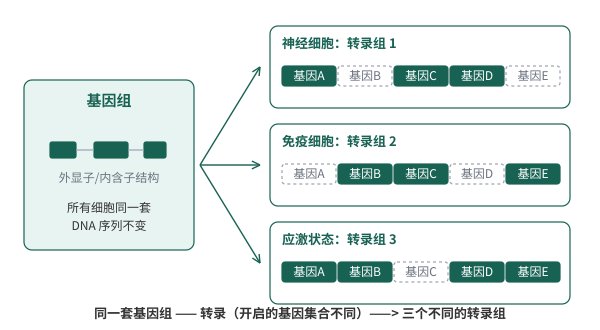
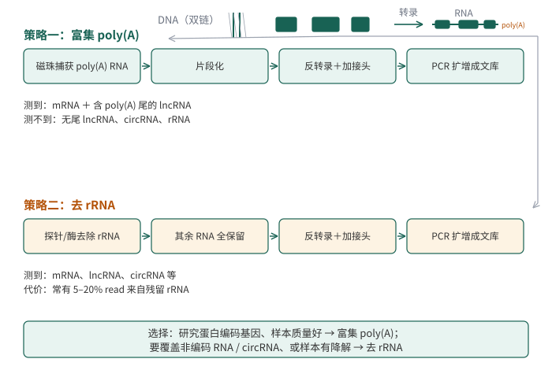
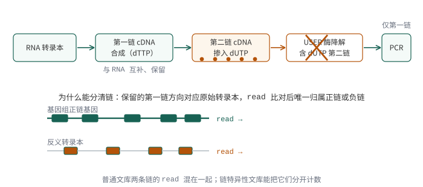
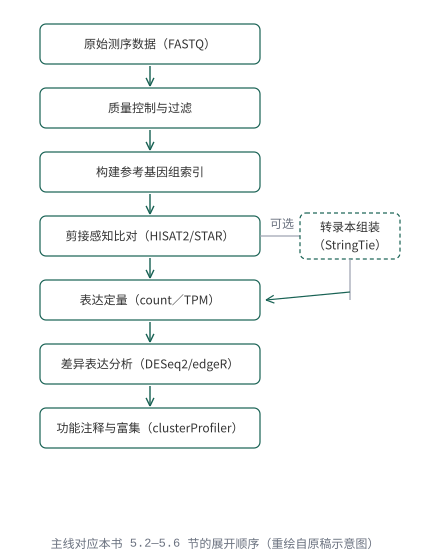
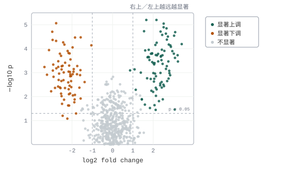
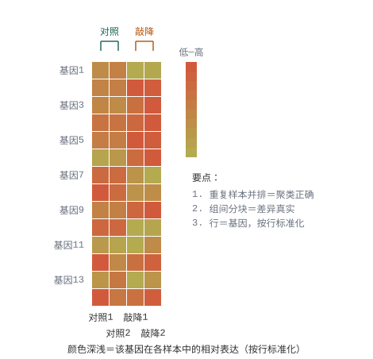
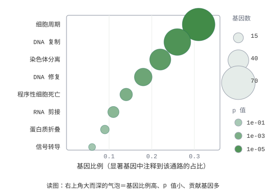
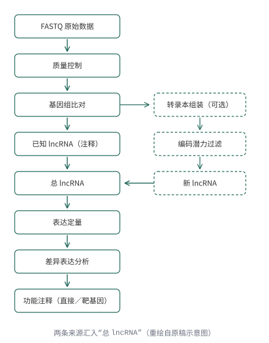
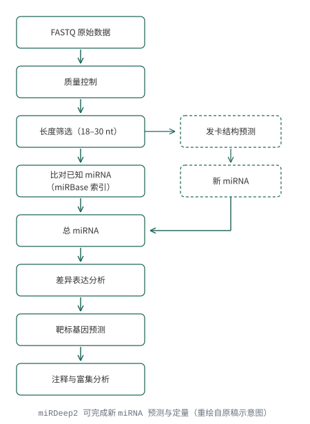
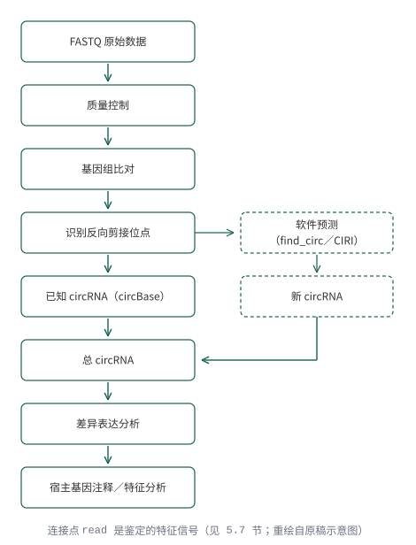

# RNA-seq：从表达定量到差异表达 {#sec-ch05}

::: {.hero-book .book-chapter-summary}

## 本章提要 {#chapter-summary-05 .unnumbered}

本章围绕一个 bulk RNA-seq 研究问题，依次组织样本与建库信息、示例数据、质控和剪接感知比对、表达定量、样本质量检查、差异表达及功能解释。你需要知道 counts、TPM 等数据表示的用途，能检查样本顺序和比较方向，并说明图表支持的结论及其局限。所需统计概念会在分析步骤中给出简要解释，系统学习可回看第 11 章。

:::

## 转录组的研究问题、分析对象与建库策略 {#sec-05-01}

明确样本中的RNA如何进入文库，以及最终要估计什么。

### 转录组与 RNA 的种类 {#src-0050-RNA-seq-1}

[]{#src-0050-RNA-seq-5}
[]{#RNA_Seq}

RNA测序（RNA sequencing，RNA-Seq）是一种非常成熟的研究转录组学的技术，是目前使用最广泛的高通量测序技术之一。一个细胞所蕴含的全部遗传物质（DNA）即基因组，根据中心法则[^rna-ref-1]，遗传信息由DNA通过转录作用流向RNA，这些RNA的总和被称为转录组 （transcriptome），研究转录组的方式方法及相关技术即转录组学（transcriptomics）。通过转录组测序可以解决多种生物学问题，例如寻找实验组和对照组的差异表达基因、目标研究对象在不同发育或者生物学过程中的基因表达时序性变化等。
RNA可以分为能够编码蛋白基因的信使RNA（mRNA）[^rna-ref-2]和非蛋白编码RNA （non-coding RNA, ncRNA），例如人类基因组，含有约20000个蛋白编码基因和7000个非蛋白编码RNA基因。随着研究的深入，生命科学研究者对RNA的认识逐渐全面，陆续发现了生物体中多种类型的非编码RNA，有持家非编码RNA（house-keeping non-coding RNA）：在翻译过程中起转运作用的tRNA[^rna-ref-3]、核糖体的组成成分rRNA[^rna-ref-4] 、参与mRNA剪接的snRNA（small nuclear RNA）[^rna-ref-5]等；还有能够起到调控作用的非编码RNA：长非编码RNA（long non-coding RNA, lncRNA）、miRNA（microRNA）[^rna-ref-6]、小干扰RNA（small interfering RNA, siRNA）和环状RNA（circRNA）等。各类 RNA 在细胞总 RNA 中的占比与代表性结构见 @fig-05-rna-classes ：rRNA 与 tRNA 占了绝大头，编码蛋白的 mRNA 只占百分之几，测序建库的策略正是围绕“如何处理这些占比”设计的。

![细胞总 RNA 的主要类型：占比与代表性结构（示意图，占比为典型培养细胞的数量级口径[^rna-ref-abundance]）](../assets/06-rna-seq/svg/rna-classes.svg){#fig-05-rna-classes}

::::: {.callout-note .book-core title="核心知识｜转录组与基因组的关系"}

一个细胞所携带的全部遗传物质（DNA）称为基因组；某一特定条件下细胞中全部 RNA 转录产物的总和称为转录组。同一生物体的几乎所有细胞共享同一套基因组，但不同类型、不同状态细胞开启表达的基因集合不同，转录组因此随细胞类型、发育阶段与处理条件而变化——这正是转录组测序能够反映生物学状态的原因。

:::::

{#fig-05-genome-transcriptome}

### mRNA 与全转录组建库 {#topic-05-lib-strategies}

研究人员通常会对mRNA和一些调控非编码RNA感兴趣，针对不同类型的RNA，采取的测序手段也不同，主要表现为样本建库策略的不同。测序仪通常只能对DNA序列进行测序，测序之前对样品里的目标待测 RNA 进行处理的过程称为“文库的制备”，简称建库（@fig-06-rna-seq-001 ）。 
	

{#fig-06-rna-seq-001}

用富集polyA方式可以获得mRNA的表达信息、也可以获得部分lncRNA（含有polyA 的lncRNA）的表达信息；通过去rRNA方式建库可以检测到mRNA、全部lncRNA、circRNA的表达信息；去线性建库则是专门为了检测circRNA的表达；短片端建库能够获得以miRNA为主的小RNA表达信息。本节先讲最常用的两种——富集 poly(A) 与去 rRNA（@fig-05-lib-compare），小 RNA 与环状 RNA 文库放在下一小节。

#### 富集 poly(A) 的 mRNA 测序 {#src-0050-RNA-seq-15}

研究蛋白编码基因表达应采用富集poly-A的方式进行建库测序（@fig-06-rna-seq-001 ）。利用多数真核 mRNA 具有 poly(A) 尾的特性，对样本中含有poly-A的RNA进行富集。需要注意的是，部分lncRNA也含有poly-A结构，所以采取这一方式建库也可以检测到这部分lncRNA的表达。mRNA测序一般采取双端测序，测序读长150bp，数据量约 6 G clean bases。

建库分为多个步骤：

1. 用磁珠捕获含有poly-A结构的RNA；
2. 将RNA片段化，这是由于二代测序技术的限制只能对最长数百bp的DNA进行测序，而mRNA的长度平均为数千bp；
3. RNA反转录为小片段的双链cDNA，因为单链RNA的稳定性太差，且测序仪是针对DNA测序的；
4. 对cDNA的3'端加A，使之成为粘性末端，然后链接上barcode序列和统一的接头序列，在测序过程中是对多个样本同时测序，为了区分开来需要给不同的样品加上不同的barcode。

从分析的角度看，富集 poly(A) 有两个直接后果。其一，文库干净：没有 poly(A) 尾的 RNA（绝大部分 rRNA、tRNA、不带尾的 lncRNA 与复制型组蛋白 mRNA）不会进入文库，有效数据占比高。其二，对降解敏感：RNA 降解时，poly(A) 尾所在的 3′ 端更容易保留，部分降解的样本会表现出明显的 3′ 偏倚。因此，完整性（RIN）不足的样本，或研究目标是 circRNA、前体 RNA 的项目，都不适合只依赖这一种策略。

#### 去 rRNA 的全转录组测序 {#src-0050-RNA-seq-26}

长非编码RNA（lncRNA）是一类长度大于 200 nt 的非编码 RNA，在不同物种中的保守性较差，曾经被认为是无用的RNA，目前被发现广泛参与基因表达调控的多种过程[^rna-ref-7]。可根据其在基因组上的位置分为四类：

1. 与编码基因有重叠且转录方向一致的同义长非编码RNA（sense lncRNA）；
2. 与编码基因有重叠但在反义链上的反义长非编码RNA（antisense lncRNA）；
3. 由编码基因内含子转录产生的内含子长非编码RNA（intronic lncRNA）；
4. 以及位于两个编码基因之间非编码区的基因间区长非编码RNA（intergenic lncRNA, lincRNA）。

lncRNA 发挥多种调控功能，扮演信号分子、诱导因子、引导分子、支架分子等多种角色[^rna-ref-8]。

对lncRNA 进行测序需要采用去rRNA的方法建库，以最大限度地保留lncRNA（@fig-06-rna-seq-001 ）。与此同时，mRNA、snoRNA、snRNA、tRNA 和 circRNA 的表达信息也能在去 rRNA 文库中获得。与富集polyA方法不同的是，建库的第一步是去除样本中的rRNA，接下的步骤则与富集polyA方式建库差不多。lncRNA测序一般采取双端测序，测序读长150bp，数据量约 10–12 G clean bases。

去 rRNA 不依赖 poly(A) 尾，而是用探针杂交或核酸酶特异性地把占总 RNA 80%–90% 的 rRNA 移除，保留其余全部 RNA，因此信息面比富集 poly(A) 宽得多，也能用在部分降解的样本上。代价是去除效率因试剂盒与样本质量而异：数据里常有 5%–20% 的 read 仍来自残留 rRNA，分析前值得用 FastQC 或比对统计评估一下这部分占比。

两种策略的选择可以一句话概括：研究蛋白编码基因、样本质量好，用富集 poly(A)；要覆盖非编码 RNA、circRNA 或样本有降解，用去 rRNA。

{#fig-05-lib-compare}

### 其他 RNA 文库 {#topic-05-other-rna-lib}

除两类主力策略外，针对特定 RNA 类型的文库用得较少但不可替代：小 RNA 文库捕获短片段，环状 RNA 文库通过去掉线性 RNA 富集环状分子。

#### 小 RNA 测序 {#src-0050-RNA-seq-39}

::::: {.callout-note .book-core title="核心知识｜microRNA 与小 RNA 测序"}

microRNA 广泛存在于动植物中，是一类长度为22nt左右的小非编码RNA，通过抑制蛋白质翻译或者降解mRNA，在多种生物学过程中发挥调控作用。对microRNA测序需要做小RNA测序（small RNA-seq ），建库过程中需要回收小片段，这是与mRNA建库的主要不同之处。miRNA的功能涉及多种生物学过程，有潜力成为许多疾病包括癌症的标志物。建库起始样本可以用总RNA，也可以用分离纯化得到的small RNA。

:::::

1.基于small RNA本身对结构特征在3‘端和5’端连上接头序列，多数small RNA具有天然的磷酸化5‘端，且3‘端具有羟基基团，便于核酸序列的连接；
2.然后进行少量逆转录PCR扩增；
3.通过PAGE胶对特定大小的small RNA片段进行纯化，小RNA片段较短20～30nt，加上接头序列后长度在150bp左右；
4.对文库的片段大小、纯度和浓度进行质检。
5. 将得到的文库扩增后上机测序，测序读长50bp，数据量约 10–20 M reads。

#### 环状 RNA 测序 {#src-0050-RNA-seq-49}

通常情况下，DNA和RNA是以线性形式存在的，有时也以环状的形式出现，例如线粒体DNA和细菌DNA、类病毒和一些RNA病毒的单链环状RNA基因组。近年研究发现，真核生物细胞普遍且稳定存在环状的RNA，是mRNA剪接过程中形成的，主要通过吸附miRNA来实现转录水平的调控。circRNA 能像“海绵”一样竞争性结合 miRNA 或 RNA结合蛋白，从而可能在生理和疾病过程中发挥重要功能。

去rRNA的方式，是目前最常用的方法，可以捕捉环形RNA的信息；另外，也可以通过去线性RNA的方式建库测序，核糖核酸酶R从RNA的自由3'端向5'端方向逐一水解线性RNA，烟草酸性磷酸酶和终止子外切酶能够从5'端向3'端方向逐一水解RNA，而环形RNA没有3'与5‘端和poly(A)，因此不会被降解；还可以利用环形RNA与线性RNA电泳迁移速度的不同来实现对环形RNA的特异性捕获，因为环形RNA会比等长的线性RNA迁移速度快，并且凝胶交联程度越高这种差别就会越大[^rna-ref-9]。总的来说，去 rRNA 的方式建库具有更高的性价比，能够同时获得mRNA、lncRNA和circRNA的信息。

四种建库策略的检测范围与典型参数汇总见 @tbl-05-lib-strategies 。

| 建库策略 | 能测到的 RNA | 典型读长与数据量 | 适用问题 |
| --- | --- | --- | --- |
| 富集 poly(A) | mRNA、含 poly(A) 尾的 lncRNA | 双端 150 bp，约 6 G clean bases | 蛋白编码基因表达 |
| 去 rRNA | mRNA、lncRNA、circRNA 等 | 双端 150 bp，约 10–12 G clean bases | 全转录组、非编码 RNA |
| 小 RNA 文库 | 以 miRNA 为主的小 RNA | 单端 50 bp，约 10–20 M reads | miRNA 表达与靶基因 |
| 去线性（RNase R 处理） | circRNA | 视实验设计而定 | 环状 RNA 专项研究 |

: 四种 RNA 测序建库策略的对比 {#tbl-05-lib-strategies}

::::: {.callout-warning .book-warning title="注意｜建库策略决定了下游能分析什么"}

建库时没有进入文库的 RNA，后续分析无法找回：富集 poly(A) 的文库测不到不含 poly(A) 尾的 lncRNA、circRNA 与 rRNA；去 rRNA 文库覆盖面广，但要评估 rRNA 残留比例；小 RNA 文库只保留了小片段信息。比较不同研究的数据之前，先确认建库策略一致，再比较表达量。

:::::

### 链特异性建库 {#topic-05-stranded-lib}

以上建库流程都没有保留“RNA 来自基因组哪条链”的信息：随机引物反转录出的 cDNA 双链，看不出原来那条 RNA 是正链基因还是反义转录本转录来的。链特异性建库（stranded library prep）在常规流程里加了一步标记，最常用的是 dUTP 法：合成第二链 cDNA 时用 dUTP 替代 dTTP，接头连接后再用专门识别含尿嘧啶 DNA 的酶（如 USER）把第二链降解掉，只留下与原始 RNA 互补的第一链进入 PCR（@fig-05-stranded-lib）[^rnaseq-stranded-dutp]。这样每条 read 相对原始转录本的方向是确定的，比对回基因组后能唯一归属到正链或负链。

{#fig-05-stranded-lib}

为什么需要它？基因组上大量座位同时存在反义转录本，普通文库里正反两个方向的 read 混在一起，计数会互相污染；链特异性文库把 read 归属到正确的链，反义 lncRNA 的定量、重叠基因的分辨都依赖这一点。分析端的对应参数是 htseq-count 的 `-s` 与 featureCounts 的 `-s`（见 5.4 节）。

::::: {.callout-warning .book-warning title="注意｜链特异性设置错用会让一半 read 归错基因"}

链特异性文库若被当作非链特异数据处理（`-s no`），源自正反两个方向的 read 会被合并计数，反义转录本与重叠基因的计数互相污染，约一半的 read 可能落入错误的 feature。拿到数据先向测序方确认建库类型；TruSeq 系列链特异性文库通常对应 `htseq-count -s reverse`。

:::::

单细胞与空间转录组的技术背景和分析入口见[第 9 章](09-single-cell-and-spatial-omics.md)。

## 本章示例数据下载与说明 {#sec-05-02}

让后续各步骤对应同一批样本和同一个研究问题。

### 研究问题与样本设计 {#topic-05-sample-design}

[]{#src-0050-RNA-seq-392}
在转录组研究工作中，至少设置两组样本——对照组和实验组；每组最好设置 3 个及以上生物学重复，以降低样品特异性带来的误差。

本章的示例问题是：敲降 RNA 甲基转移酶 METTL3 后，HEK293T 细胞的基因表达发生了哪些变化？样本信息见 @tbl-05-samples （元数据取自 GEO 样本页面，2026 年 10 月核对）。

| 样本（GSM） | Run（SRR） | 分组 | 细胞系 | 文库与平台 |
| --- | --- | --- | --- | --- |
| GSM1502498 | SRR1573494 | 对照 rep1 | HEK293T | TruSeq 链特异性 mRNA，HiSeq 2000 PE100 |
| GSM1502499 | SRR1573495 | 对照 rep2 | HEK293T | 同上 |
| GSM1502502 | SRR1573498 | METTL3 敲降 rep1 | HEK293T | 同上 |
| GSM1502503 | SRR1573499 | METTL3 敲降 rep2 | HEK293T | 同上 |

: 本章示例数据的样本信息 {#tbl-05-samples}

这套数据是链特异性 mRNA 文库——5.1 节的建库策略、5.4 节 htseq-count 的 `-s` 参数都会用到这个事实。后续命令中的 `test_R1/test_R2` 文件名即对应这套数据经质控过滤后的双端 FASTQ。

### 从 GEO 与 SRA 下载数据 {#src-0050-RNA-seq-396}

本章示例采用 GEO 数据库的一套人类转录组数据（2026 年 10 月核对）：HEK293T 细胞的 METTL3 敲降（实验组）与野生型对照各两个生物学重复，链特异性 mRNA 文库、HiSeq 2000 双端 100 bp。**注意分组方向：GSM1502498、GSM1502499 是对照组，GSM1502502、GSM1502503 是 METTL3 敲降组**——下载链接见下方列表，样本信息表见上一小节。

*方法一 从网页链接直接下载*

下载链接：

- GSM1502498（[SRR1573494](https://trace.ncbi.nlm.nih.gov/Traces/sra/?run=SRR1573494)）
- GSM1502499（[SRR1573495](https://trace.ncbi.nlm.nih.gov/Traces/sra/?run=SRR1573495)）
- GSM1502502（[SRR1573498](https://trace.ncbi.nlm.nih.gov/Traces/sra/?run=SRR1573498)）
- GSM1502503（[SRR1573499](https://trace.ncbi.nlm.nih.gov/Traces/sra/?run=SRR1573499)）

::::: {.callout-note .book-core title="核心知识｜GSE、GSM 与 SRR 的关系"}

GEO 的层级是：一个研究项目是一个系列（GSE），其中每个样本是一个 GSM（Sample），每个样品的一次测序是一个 Run（SRR）。一篇论文对应一个 GSE，里面常常混着多种文库类型——下载前要点进每个 GSM 页面核对“文库策略、是否链特异性、读长与平台”，只挑符合分析计划的那几个 Run。

:::::

网页下载：打开上面任一链接，在 Run 浏览器页面找到 Data access 区域的 FASTA/FASTQ 链接即可保存。命令行下载更常用（服务器环境）：

```{.bash .numberLines data-book-role="code"}
# prefetch 把 Run 数据从 SRA 缓存到本地
prefetch SRR1573494

# fasterq-dump 转成 FASTQ：--split-files 拆分双端，--outdir 指定输出目录
fasterq-dump SRR1573494 --split-files --outdir raw.fastq/
```

::::: {.callout-warning .book-warning title="注意｜`fastq-dump` 已被 `fasterq-dump` 取代"}

旧教程里常见的 `fastq-dump` 是单线程实现，速度慢且已不再推荐；SRA Toolkit 现行版本用 `fasterq-dump`（多线程，通常快一个数量级），配合 `prefetch` 使用。早期章节如遇 `fastq-dump` 示例，按同样参数迁移即可。

:::::

::::: {.callout-tip .book-example title="示例与练习｜从 GEO 页面找到 SRR 号"}

打开 [GSM1502498 的样本页面](https://www.ncbi.nlm.nih.gov/sra?term=GSM1502498)，找到它的 Run 号与“文库策略（Library strategy）”“文库选择（Library selection）”字段，记下这两个值；再回答：这套数据要不要按链特异性处理？答案对应 5.4 节 htseq-count 的哪个 `-s` 取值？

:::::

### 参考基因组与注释文件 {#topic-05-reference-files}

这里选用的是人类样本，因此需要下载人类基因组和基因组注释文件。参考基因组与注释文件的含义、下载渠道及其编号体系差异（RefSeq 的 `NM_`/`NR_`、Ensembl 的 `ENSG` 等）见 5.2 节，FASTA/GTF 的基本概念与下载操作见[第 4 章](04-sequence-alignment.md#sec-04-02)。常用入口：[UCSC Genome Browser](https://genome.ucsc.edu/) 与 [Ensembl](https://www.ensembl.org/)（2026 年 10 月核对）。FASTA/GTF 文件本身的格式在第 4 章已经讲过（[参考基因组](04-sequence-alignment.md#sec-04-02)、[基因注释](04-sequence-alignment.md#sec-04-03)），这里聚焦 RNA-seq 分析绕不开的问题：**同一套 hg38，不同机构的注释并不通用，编号体系也不同**。

三个主要来源的编号体系与分工见 @tbl-05-annotation-sources 。最常被混淆的是两套基因编号：RefSeq 的转录本编号以 `NM_`（成熟 mRNA）、`NR_`（非编码 RNA）开头，`XM_`/`XR_` 开头的是计算预测模型（未经人工核对），蛋白对应 `NP_`/`XP_`；Ensembl 与 GENCODE 则用 `ENSG`（基因）、`ENST`（转录本）、`ENSP`（蛋白），小鼠加物种前缀如 `ENSMUSG`。两套体系的基因 ID 不能互相直译，同一样本定量出的 ID 类型取决于建库用的 GTF。

| 来源 | 维护方 | 基因/转录本编号 | 特点 |
| --- | --- | --- | --- |
| RefSeq | NCBI | NM_/NR_（人工核对）、XM_/XR_（预测） | 保守、质量优先，版本按 accession 后缀 .1/.2 区分 |
| Ensembl | EMBL-EBI | ENSG/ENST | 基因组注释与版本发布频繁，覆盖物种最广 |
| GENCODE | Ensembl/GENCODE 联盟 | 与 Ensembl 同（ENSG/ENST） | 人类/小鼠的深度注释，RNA-seq 常用 M 系列版本 |

: 三个参考注释来源的对比 {#tbl-05-annotation-sources}

UCSC Table Browser 提供的是以上注释的镜像（knownGene 是 UCSC 自建集），下载格式常为 bed/gtf。本章命令里的 GTF 文件名 `hg38_refseq_from_ucsc.rm_XM_XR.fix_name.gtf` 就体现了实际项目里常见的两步处理：从 UCSC 取 RefSeq 注释、再把 `XM_/XR_` 预测模型剔除，只留人工核对转录本。

::::: {.callout-warning .book-warning title="注意｜索引、比对与定量必须同源"}

比对索引的 FASTA、定量的 GTF 必须来自同一来源、同一版本的基因组装配（例如都基于 hg38 的 RefSeq，或都基于 GENCODE v44）。混用的典型后果：坐标对不上、大量 read 落入 no_feature、基因名对不回计数表。RefSeq 与 Ensembl 的 ID 体系互不相认，中途换注释等于推倒重来。

:::::

### 本章分析路线与工具地图 {#src-0050-RNA-seq-101}

有参转录组分析一般包括：测序数据的质量控制、构建参考基因组索引、将read比对到参考基因组、拼接新的转录本（可选）、基因表达的定量、差异表达基因的分析，以及对目标基因群进行注释和富集分析（@fig-06-rna-seq-003 ）。	

{#fig-06-rna-seq-003}

全书链接与工具版本均于 2026 年 10 月核对。各分析阶段常用的软件与本章用法汇总见 @tbl-05-tool-map ，后续小节将依次展开：[质控与比对](#sec-05-03)、[定量](#sec-05-04)、[差异分析](#sec-05-06)、[富集与展示](#sec-05-07)。

| 分析阶段 | 常用软件 | 本章用法 |
| --- | --- | --- |
| 测序质量评估 | FastQC、MultiQC | 5.3 节 |
| 去接头与质量过滤 | Cutadapt、Trimmomatic | 5.3 节 |
| 构建索引与比对 | HISAT2、STAR（TopHat2 已被取代；Bowtie 2、BWA 面向 DNA 场景） | 5.3 节 |
| 转录本组装 | StringTie（可选） | 5.4 节 |
| 基因水平定量 | featureCounts、htseq-count | 5.4 节 |
| 转录本水平定量 | RSEM、Cufflinks 套件 | 5.4 节 |
| 差异表达分析 | DESeq2、edgeR、cuffdiff | 5.5 节 |
| 功能注释与富集 | clusterProfiler、DAVID、Metascape | 5.6 节 |

: RNA-seq 分析各阶段的常用软件 {#tbl-05-tool-map}

[]{#fig-06-rna-seq-004}

## RNA-seq 数据的质控与比对 {#sec-05-03}

确认文库特征和比对策略适合表达分析。

### 原始数据质控与过滤 {#src-0050-RNA-seq-423}

从GEO数据库下载的数据文件格式为SRA，需要使用官方提供的 SRA Toolkit 进行转换，将 SRA 文件转换为 FASTQ 格式，安装说明见 [sra-tools 官方文档](https://github.com/ncbi/sra-tools/wiki/02.-Installing-SRA-Toolkit)（2026 年 10 月核对）。

```{.bash data-book-role="code"}
fastq-dump SRR1573494.sra

```

使用FastQC做质量控制：

```{.bash data-book-role="code"}
fastqc SRR1573494.fq

```

使用cutadapt去除接头序列，过滤数据质量：

```{.bash .numberLines data-book-role="code"}
cutadapt -j 6 --times 1 -e 0.1 -O 3 --quality-cutoff 25 -m 55 \
-a AGATCGGAAGAGCACACGTCTGAACTCCAGTCAC \
-A AGATCGGAAGAGCGTCGTGTAGGGAAAGAGTGTAGATCTCGGTGGTCGCCGTATCATT \
-o fix.fastq/test_R1_cutadapt.temp.fq.gz \
-p fix.fastq/test_R2_cutadapt.temp.fq.gz \
 raw.fastq/test_R1.fq.gz \
 raw.fastq/test_R2.fq.gz > fix.fastq/test_cutadapt.temp.log 2>&1 &

```
早期教程中还常见 fastx-toolkit，该工具已长期停止维护，新项目不再推荐使用。

### 为什么 RNA 比对与 DNA 不同 {#topic-05-rna-vs-dna-align}

[]{#question-21-285}
[]{#question-21-292}
[]{#src-0050-RNA-seq-247}
测序得到的短 reads 需要比对回参考基因组，确定每条 read 的来源位置，这个过程叫做序列比对（reads mapping）。把数量庞大的 reads（上亿对）回溯到一条长度以 Gbp 计的参考基因组上，需要较高的计算成本和巧妙的比对策略。这与在进化分析等工作中提到的双序列比对 （pairwise alignment）和多序列比对（multiple sequences alignment）不同，alignment的比对通量较低，更多的强调两条序列或者少数几条序列之间的比对。RNA 比对策略主要有两大类：exon-first（先把能连续比对的 read 比上，再拆开剩余 read 跨剪接位点重比）与 seed-extend（把 read 切成种子段伸展），前者的局限会在下面的练习中看到。它们依赖的索引算法（BWT 与后缀树）已在[第 4 章](04-sequence-alignment.md#sec-04-04)介绍，不再展开。
一般来说，DNA的mapping比较容易，因为DNA在基因上是连续的，直接回贴到基因组就可以找到相应的定位。就比如我们常用的Whole Genome Sequence（WGS）即全基因组测序；或者是我们所说的ChIP-Seq即染色体免疫共沉淀测序都是直接对DNA进行建库测序，其测序结果都是FASTQ文件，直接用 Bowtie 2、BWA 比对到基因组就可以得到标准的 SAM 文件。

但是RNA就不一样了，真核生物的RNA需要经过复杂的加工过程。在细胞中RNA层面的调控至少可以分成2个大的阶段co-transcription（转录的同时） 和 post-transcription（转录以后）其中的调控机制也有很多。

对我们mapping影响最大的因素是：真核生物转录出来的初步的mRNA都是带有intron（内含子）的，随后都需要在co-transcription（转录的同时） 或post-transcription（转录以后）阶段通过：1. alternative splicing（可变剪切）剪切掉intron；2.polyA尾巴； 3.加5'的帽子结构。这3个步骤，将不成熟的mRNA变为最终成熟的mRNA再转运出核，行使功能。

 条目）](../assets/a-questions-21-25/006-23-1.jpg){#fig-a-questions-21-25-006}

::::: {.callout-note .book-core title="核心知识｜为什么比对软件需要针对可变剪接问题特殊优化？"}

成熟的 mRNA 不含内含子，而参考基因组上外显子之间隔着长长的内含子。因此跨过剪接位点的 read 在基因组上并不连续：它的两半分别对应两个外显子，中间隔着可能上千 bp 的内含子。普通 DNA 比对软件默认 read 与基因组连续对齐，会把这类 read 判为低质量或不匹配；剪接感知比对软件则允许 read 分成两段、分别落到两个外显子上，并利用剪接位点信号（GT…AG）辅助判断。这就是 RNA-seq 比对需要专用软件的根本原因。

:::::

::::: {.callout-tip .book-example title="示例与练习｜假基因为什么干扰 exon-first 比对"}

**问题**：如果有一套 poly(A) 富集的 RNA-seq 数据，比对策略是先把能比对到基因组的 read 全部比对上，再把比对不上的 read 按一定规则拆开做第二轮比对，以解决跨内含子的问题（exon-first 策略，TopHat 的做法）。这样比对的最大问题是什么？

**参考解答**：假基因（pseudogene）是基因组上与功能基因高度相似的片段。它们来自基因的复制或返座插入，不能正常表达或编码无功能的蛋白质，在基因组中分布非常普遍。假基因保留了与原基因相似的外显子结构，却没有内含子——这正是 exon-first 策略的软肋：一条跨内含子的 read 先拿去连续比对，会优先比对到"已经没有内含子"的假基因上，而不是需要拆开才能比上的真基因，导致大量 read 被错误分配。

:::::

[]{#question-21-314}
[]{#question-21-286}

::::: {.callout-tip .book-example title="示例与练习｜所有蛋白基因都有内含子和 poly(A) 尾吗"}

**问题一**：在人类中，是不是所有蛋白编码基因都含有内含子？

**参考解答**：并不是。SRY 基因位于 Y 染色体短臂末端，是决定男性睾丸发育的关键基因，它只有一个外显子、没有内含子（见下图，以小鼠 Sry 基因的基因组浏览器视图为例，转录本是一个连续的方块）。

{#fig-a-questions-21-25-007}

**问题二**：在人类中，是不是所有蛋白编码基因的成熟 mRNA 都有 poly(A) 尾？

**参考解答**：也不是。复制型组蛋白（replication-dependent histone）基因的成熟 mRNA 末端没有 poly(A) 尾，而是以茎环结构结尾。这类基因平时在细胞中大量表达，是"多数规则"之外的典型例外。

:::::

### 剪接感知比对器：HISAT2 与 STAR {#src-0050-RNA-seq-259}

#### Bowtie 与 Bowtie 2 {#rnaseq-aligners-bowtie}

**Bowtie**[^rnaseq-bowtie] 和 **Bowtie2**都是常用的短序列比对软件，生成SAM格式的序列比对文件。Bowtie在小于50bp的reads比对中更精确更快，最长支持1000bp；而Bowtie2在大于50bp的reads比对中更精确更快，reads长度没有上限，支持空位比对、局部比对。

#### BWA {#rnaseq-aligners-bwa}

**BWA**[^rnaseq-bwa] 有多个子命令，可以实现不同算法的比对。

上述3款软件都是针对DNA序列比对进行设计的，并不能直接应用于RNA-Seq的比对。一个最主要的原因就是因为真核生物的基因是间隔的，每两个外显子中间就会有一个内含子。最终成熟的mRNA是不包含内含子序列的，因此针对真核生物的RNA-Seq数据的比对，需要在上述3款软件的基础上加上一些限制条件与修正。最常用的有下面3款Tophat/Tophat2，HISAT/HISAT2, STAR。

[]{#src-0050-RNA-seq-520}
TopHat[^rnaseq-tophat] 与 TopHat2[^rnaseq-tophat2] 是第一代广泛使用的剪接感知比对软件，采用的正是 exon-first 策略：先整体比对，再把剩余 read 按剪接方式拆开重比。它对假基因的处理不好（见前一个练习框），速度也慢，开发团队已明确建议改用同组的 HISAT2——HISAT2 官方说明中写道"HISAT2 是 HISAT 与 TopHat2 的后继者，建议两者用户切换到 HISAT2"[^rnaseq-hisat2-notice]。[]{#rnaseq-aligners-tophat}

#### HISAT2 {#rnaseq-aligners-hisat}

HISAT（Hierarchical Indexing for Spliced Alignment of Transcripts）和 **HISAT2**[^rnaseq-hisat2]是Tophat2的升级版本。利用数量众多的索引，覆盖整个基因组，使用小索引结合几种比对策略，以人类基因组为例，全基因组被分成约 48,000 个局部索引、每个覆盖约 64,000 bp，跨外显子比对因此又快又省内存。其下游分析软件为StringTie和Ballgown。HISAT2 相比 HISAT 还引入了 SNP 与单倍型信息，比对时可以区分参考等位与替代等位。

HISAT/HISAT2 与 TopHat/TopHat2 出自同一个课题组。

#### STAR {#rnaseq-aligners-star}

**STAR**[^rnaseq-star] 的优势在于快，是 ENCODE 计划采用的比对软件。缺点在于占用内存比较大，以人类的参考基因组为例，比对时的运行内存需要28G~32G左右。STAR使用了Suffix Tree 的index：先把read切成若干小的seed，找到全基因组符合seed的位置；再通过打分算法，把邻近的全基因组符合的seed拼在一起，形成mapping结果。

比对任务多、数据量大时，推荐用 STAR 得到最终比对结果；常规规模用 HISAT2 更省资源。

资源对照与选型：HISAT2 内存需求低，普通服务器即可运行全流程，适合多数场景；TopHat2 速度慢且已被官方弃用，仅见于历史文献，新项目不要再选用。[]{#question-21-307}

### 建立参考基因组索引 {#src-0050-RNA-seq-455}

#### 用 HISAT2 构建索引 {#src-0050-RNA-seq-457}

使用`hisat2`构建基因组索引：

```{.bash data-book-role="code"}
hisat2_extract_splice_sites.py Homo_sapiens.GRCh38.101.gtf >genome.ss
hisat2_extract_exons.py Homo_sapiens.GRCh38.101.gtf >genome.exon
hisat2-build -p 20 Homo_sapiens.GRCh38.dna.toplevel.fa genome
hisat2-build -p 20 --exon genome.exon --ss genome.ss Homo_sapiens.GRCh38.dna.toplevel.fa genome_tran

```

加入 SNP 与单倍型信息所需的资源文件可从 UCSC 下载（hg38 对应目录：`https://hgdownload.soe.ucsc.edu/goldenPath/hg38/database/`，其中 `snp151Common.txt` 是常用的人类常见 SNP 集合）；基因结构注释 GTF 的来源与选择见本章 5.2 节。

下面演示另一套以本地参考文件 `ref_hg38.fa` 为基准、并加入 SNP 与单倍型信息的构建方式：

```{.bash .numberLines data-book-role="code"}
#make exon 

hisat2_extract_exons.py hg38_refseq.gtf > hg38_refseq.exon &

#make splice site

hisat2_extract_splice_sites.py hg38_refseq.gtf > hg38_refseq.ss &

#make snp and haplotype

hisat2_extract_snps_haplotypes_UCSC.py ref_hg38.fa snp151Common.txt snp151Common &

#build index

hisat2-build -p 6 --snp snp151Common.snp --haplotype snp151Common.haplotype --exon hg38_refseq.exon  --ss hg38_refseq.ss ref_hg38.fa ref_hg38.fa.snp_gtf > hisat2_build.log 2>&1 & 

# hisat2-build——hisat2构建索引的命令

# -p——使用多少个线程，数字代表线程数

# Homo_sapiens.GRCh38.dna.toplevel.fa——从Ensembl数据库下载的人类基因组文件

# genome——将索引命名为genome

```

参数解释：

| 参数 | 含义 |
| --- | --- |
| -p | default: 1 设置多线程运行 |
| --snp | 输入一个包含SNP信息的文件，含5列数据：SNP ID、参考序列ID、SNP类型（single、deletion或insertion）、SNP位点（以第一个碱基位点为0计算）、变异碱基信息。 |
| --haplotype | 单倍型信息文件，说明 --snp 指定的某些变异位点在要分析的样品中连锁为单倍型，与对应变异位点碱基信息一致。含5列数据：Haplotype ID、参考序列ID、起始位点（以第一个碱基位点为0计算）、结束位点、逗号分隔的多个SNP ID。 |
| --ss | 输入一个包含有剪接位点（Splicing Site）信息的文件。该文件可以利用HISAT2软件自带的hisat2_extract_splice_sites.py程序对编码蛋白基因结构注释GTF文件转换获得。 |
| --exon | 输入一个含有外显子信息的文件。利用HISAT2软件自带的hisat2_extract_exons.py程序对编码蛋白基因结构注释GTF文件转换获得该文件。 |

#### 用 STAR 构建索引 {#src-0050-RNA-seq-505}

还可以使用STAR构建基因组索引：

```{.bash data-book-role="code"}
STAR --runThreadN 12 --runMode genomeGenerate \
--genomeDir /home/menghaowei/ngs_course/reference/STAR_index \
--genomeFastaFiles /home/menghaowei/ngs_course/reference/STAR_index/ref_hg38.fa \
--sjdbGTFfile /home/menghaowei/ngs_course/reference/gtf/hg38_refseq_from_ucsc.rm_XM_XR.fix_name.gtf \
--sjdbOverhang 150 & 

```

### 比对实操与结果检查 {#src-0050-RNA-seq-518}

概念已经清楚，以下命令以本章示例项目的文件命名为主线；个别例子来自工具官方教程数据（如 chrX 测试集），会明确标注。

#### 用 HISAT2 比对 {#src-0050-RNA-seq-538}

用 `hisat2` 比对到参考基因组（第一条使用普通索引，第二条使用上一步构建的 SNP 索引 `ref_hg38.fa.snp_gtf`）：

```{.bash .numberLines data-book-role="code"}
hisat2 -p 12 \
-x /home/menghaowei/ngs_course/reference/hisat2_index/ref_hg38.fa \
-1 ./fix.fastq/test_R1_cutadapt.fq.gz \
-2 ./fix.fastq/test_R2_cutadapt.fq.gz \
-S ./bam/test_hisat2.sam > ./bam/test_hisat2.log 2>&1 &

#mapping

hisat2 -p 6 \
-x /Users/meng/ngs_course/reference/hisat2_index/ref_hg38.fa.snp_gtf \
-1 ./fix.fastq/test_R1_cutadapt.fq.gz \
-2 ./fix.fastq/test_R2_cutadapt.fq.gz \
-S ./bam/test_hisat2.sam > ./bam/test_hisat2.log 2>&1 &

```

```{.bash data-book-role="code"}
hisat2 -x genome -u 1000000 -p 24 -I 0 -X 500 --fr --min-intronlen 20 --max-intronlen 4000 -1 reads.1.fastq -2 read.2.fastq -U single.fastq -S result.sam

```
参数：

| 参数 | 含义 |
| --- | --- |
| -x | 设置索引数据文件前缀 |
| -1 | 双末端测序结果的第一个文件，若有多组数据，使用逗号将文件分隔，reads长度可以不一致 |
| -2 | 双末端测序结果第二个文件，顺序和-1参数对应。 |
| -U | 单端数据文件，若有多组数据，使用逗号将文件分隔 |
| --sra-acc | 输入SRA登录号。多组数据之间用逗号分隔，HISAT将自动下载数据并识别数据类型，进行比对。参数大正常使用需要安装NCBI-NGS toolkit |
| -S | 设置输出文件名。 |

#### 用 STAR 比对 {#src-0050-RNA-seq-574}

也使用STAR比对到参考基因组：

```{.bash .numberLines data-book-role="code"}
STAR \
--genomeDir /home/menghaowei/ngs_course/reference/STAR_index \
--runThreadN 6 \
--readFilesIn ./fix.fastq/test_R1_cutadapt.fq.gz ./fix.fastq/test_R2_cutadapt.fq.gz \
--readFilesCommand zcat \
--outFileNamePrefix ./bam/test_STAR \
--outSAMtype BAM Unsorted \
--outSAMstrandField intronMotif \
--outSAMattributes All \
--outFilterIntronMotifs RemoveNoncanonical > ./bam/test_STAR.log 2>&1 & 

```

#### 比对结果的格式与检查 {#src-0050-RNA-seq-601}

[]{#src-0050-RNA-seq-253}
比对结果保存为 SAM（Sequence Alignment/Map format）或其压缩的二进制格式 BAM。二者由 Heng Li 等人制定标准并实现了第一代工具。SAM文件由两部分组成：头部区和主体区，头部区以“@”开始，提供比对的总体信息，例如SAM格式版本、比对参考序列、比对使用的命令等；主体区是比对结果，每一行储存一个比对结果，共11个主列和1个可选列。

SAM/BAM 的列结构、排序与 samtools 基本操作在[第 4 章](04-sequence-alignment.md#sec-04-06)已系统介绍，这里不再重复；无论 DNA 还是 RNA 的比对结果，都保存为同样的 SAM/BAM 格式。
序列比对是获得每条测序片段在参考基因组上对应染色体上的位置坐标、正负链等信息。比对率反映样品与参考基因组的匹配程度和测序质量：人 RNA-seq 数据比对率一般应有 80% 以上；比对到多个位置的 read 占比通常不超过 10%，多定位 read 过多往往提示 rRNA 残留或注释不当。常用比对软件为 HISAT2 与 STAR（RSEM 是定量软件，不属于比对器，见 5.4 节）。这些经验值可参考 RNA-seq 分析最佳实践综述[^rnaseq-best-practices]。

::: {.book-prose}

用 `samtools` 抽查比对结果（`view` 的完整用法见[第 4 章](04-sequence-alignment.md#sec-04-06)）。提取比对到参考序列上的结果：

:::

```{.bash data-book-role="code"}
samtools view -bF 4 abc.bam >abc.F.bam

```

::: {.book-prose}

提取比对到某条染色体上一段区域的结果，用于在基因组浏览器中快速查看局部：

:::

```{.bash data-book-role="code"}
samtools view abc.bam scaffold1:30000-100000 > scaffold1_30k-100k.sam

```

## 从比对到转录本定量 {#sec-05-04}

理解计数由哪些归属规则产生。

### 计数归属：从比对到计数矩阵 {#src-0050-RNA-seq-349}

常用的表达定量软件有 HTSeq（htseq-count）、featureCounts 与 Cufflinks 套件中的 Cuffquant/Cuffnorm。定量得到的 count 数据用于接下来的样本间差异表达分析。

HTSeq 是用 Python 编写的 read 计数工具，根据 SAM/BAM 比对结果和基因结构注释 GTF 得到基因水平的 count。归属模式的细节见上面的核心知识框。

::::: {.callout-note .book-core title="核心知识｜计数归属与 union／intersection 模式"}

基因水平计数的核心问题是 read 归属：只有明确落在某个基因外显子区域的 read 才能计入该基因。常见三种归属模式：`union` 把一个基因的所有外显子合并成整体，read 与之有重叠就计入；`intersection-strict` 只统计完全落入单个 feature 的 read；`intersection-nonempty` 统计与任一 feature 至少部分重叠的 read。当基因之间存在重叠（例如反义转录本共用一段基因组、或两个基因的外显子区交叉），或一条 read 比对到多个基因时，无法唯一归属的 read 会计入 ambiguous；不落在任何注释 feature 上的 read 记为 no_feature。HTSeq 与 featureCounts 都实现了类似的归属规则，只是参数名不同。

:::::

### 基因水平计数：featureCounts 与 htseq-count {#src-0050-RNA-seq-692}

#### 用 htseq-count 计数 {#src-0050-RNA-seq-694}

使用HTSeq对基因表达进行定量：

```{.bash data-book-role="code"}
htseq-count -f bam -r pos -s no -a 10 -t exon -i gene_id -m union \
  ./bam/test_hisat2.sort.bam ./reference/gtf/hg38_refseq_from_ucsc.rm_XM_XR.fix_name.gtf \
  > ./count_result/test_count.tsv 2> ./count_result/test_count.HTSeq.log

```

```{.bash .numberLines data-book-role="code"}
# 非链特异性真核转录组测序数据

htseq-count -f sam -r name -s no -a 10 -t exon -i gene_id -m union hisat2.sam genome.gtf >counts_out.txt

# 链特异性真核转录组测序数据

htseq-count -f sam -r name -s reverse -a 10 -t exon -i gene_id -m union hisat2.sam genome.gtf >count_out.gtf

```
参数说明：

| 参数 | 含义 |
| --- | --- |
| -f | --format default:sam 设置输入文件格式，sam或者bam |
| -r | --order default: name 设置输入文件排序方式，name 或 pos。前者按 read 名排序，后者按比对位置排序。双端数据按 pos 排序时，read 两端的比对结果在文件中不相邻，程序需把第一端缓存在内存直到读到另一端，因此选 pos 可能占用更多内存。 |
| -s | --stranded default:yes 设置是否链特异性测序。值可以为yes,no,reverse.yes 表示非链特异性数据；reverse 表示链特异性文库中 read1 比对到反义链（与 yes 判断相反）。 |
| -a | --a default: 10 忽略比对质量低于此值的比对结果。 |
| -t | --type default: exon 程序会对该指定的feature(GTF/GFF文件第三列)进行表达量计算，而GTF/GFF文件中其它的feature都会被忽略 |
| -i | -idattr default:gene_id 设置feature ID 是由GTF/GFF文件第九列那个标签决定的，若GTF/GFF文件多行具有相同feature ID, 则它们来自同一个feature,程序会计算这些features的表达量之和赋给相应的feature ID。 |
| -m | --mode deault: union 设置表达量计算模式。参数的值可以有union，intersection-strict, intersection-nonempty。原核生物用intersection-strict,真核生物用union模式。 |
| -o | --samout 输出一个SAM文件，比对结果多一个XF标签，表示 read比对到了某个feature上。 |
| -q | --quiet 不输出程序运行的状态信息和警告信息 |

#### 用 featureCounts 计数 {#src-0050-RNA-seq-710}

使用featureCount对基因表达进行定量：

```{.bash .numberLines data-book-role="code"}
featureCounts -t exon -g gene_id \
-Q 10 --primary -s 0 -p -T 1 \
-a ./reference/gtf/hg38_refseq_from_ucsc.rm_XM_XR.fix_name.gtf \
-o ./count_result/test_count.featureCounts \
./bam/test_hisat2.sort.bam \
./bam/test_hisat2.sort.2.bam > ./count_result/test_count.featureCounts.log  2>&1 & 

```

`-Q 10` 过滤低质量比对，`--primary` 只统计每条 read 的最佳比对，`-s 0` 表示非链特异性文库，`-p` 表示按片段（fragment）统计双端数据。输入的 GTF 注释必须与建索引用的参考基因组同源，否则外显子坐标对不上，大量 read 会落入 no_feature；混用 RefSeq 与 Ensemble 编号体系也会让定量无法对应回基因名（见 5.2 节）。

::::: {.callout-warning .book-warning title="注意｜`-a` 在 htseq-count 与 featureCounts 中含义不同"}

`htseq-count -a` 设置的是最低比对质量（minaqual，默认 10，低于该值的比对不计入）；`featureCounts -a` 指定的却是注释文件（GTF/GFF）路径。两个工具的参数不能混抄，查阅时以各自官方文档为准。

:::::

### 转录本水平的定量：StringTie、RSEM 与 Cufflinks {#src-0050-RNA-seq-286}

[]{#src-0050-RNA-seq-625}
组装转录本是一个可选项，如果想挖掘测序数据中的新转录本，则需要做这一步分析。拼接软件根据参考基因组将测序处理得到的高质量测序片段比对到该参考基因组上，然后对比对上的片段进行转录本组装。Cufflinks、StringTie和Scripture都是常用的转录本组装软件。

::::: {.callout-note .book-core title="核心知识｜一个基因可以产生多个转录本"}

真核生物的大多数基因通过可变剪接产生不止一种成熟 mRNA（见图 5.3 节的可变剪切示意图）：外显子的取舍不同，得到的转录本（isoform）就不同，编码的蛋白也可能不同。因此"基因的表达量"有两种口径——把落在该基因所有外显子上的 read 全部计入该基因，得到基因水平计数；把 read 分派到具体的转录本上，得到转录本水平丰度。两者的算法难度完全不同：前者只需判断 read 属于哪个基因，后者要把模糊的 read 在同一基因的多个转录本之间分配，这正是 StringTie、RSEM 与 Cufflinks 各自要解决的问题。

:::::

#### 转录本组装：StringTie {#src-0050-RNA-seq-647}

StringTie 出自 Cufflinks 用户的同一迁移路线，速度快且精度更高，其下游常配合 Ballgown 或 prepDE.py 使用。和 Cufflinks一样，输入文件是按坐标排序后的BAM文件，不能对具有多位点比对结果的reads进行过滤，否则会导致转录本序列不完整。进行转录本组装后可以用于基因测序或者与参考GTF/GFF3文件比较以寻找新转录本。但StringTie不直接提供表达量raw count文件，可以使用prepDE.py程序，根据GTF结果文件中的coverage信息，转换得到raw count数据，用于edgeR和DESeq2等其他差异表达软件的分析。
Scripture 则根据剪接 reads 构建连接图，用统计模型为候选转录本路径打分，并利用双端 read 的片段长度分布过滤不合理的转录本，现在已较少使用。

::: {.book-prose}

对一个样品数据进行组装：  

:::

```{.bash data-book-role="code"}
stringtie sample.bam --rf -l sample1 -o sample1.gtf -p 4

```
::: {.book-prose}

对多个样本的 GTF 文件进行整合：  

:::

```{.bash data-book-role="code"}
stringtie --merge -o merge.gtf sample1.gtf sample2.gtf 

```

::: {.book-prose}

以参考注释为基础，直接统计已知转录本的表达量（-e 只估计已知转录本）  

:::

```{.bash data-book-role="code"}
stringtie sample1.demulpos.bam --rf -o sample1.gtf -p 8 -e -G genome.gtf

```

#### 转录本丰度估计：RSEM {#topic-05-rsem}

回看上面的核心知识框：一条 read 常常同时兼容同一基因的多个转录本，基因水平计数可以整 gene 合并，转录本水平却必须把它们分开。RSEM（RNA-Seq by Expectation-Maximization）[^rnaseq-rsem] 用期望最大化迭代解决这个分摊问题：先假设各转录本丰度均一，按当前丰度把模糊 read 按概率分摊给各转录本，再用分摊结果更新丰度，反复迭代直到收敛。输出每个转录本的期望计数（expected count）与 TPM，同时汇总出基因水平结果。

典型流程两步：`rsem-prepare-reference` 把 GTF 与基因组 FASTA 转成转录本序列集合并建索引；`rsem-calculate-expression` 完成比对与定量（可内嵌调用 STAR 或 Bowtie 2，也可读入现成 BAM）：

```{.bash .numberLines data-book-role="code"}
# 准备参考：从 GTF 提取转录本序列并建索引
rsem-prepare-reference --gtf genome.gtf genome.fa rsem_ref/hg38

# 双端定量：--aligner 指定内嵌比对器，输出到 count_result/test
rsem-calculate-expression --paired-end -p 8 --aligner STAR \
  fix.fastq/test_R1_cutadapt.fq.gz fix.fastq/test_R2_cutadapt.fq.gz \
  rsem_ref/hg38 count_result/test
```

结果文件 `test.isoforms.results` 逐转录本给出 length、expected_count、TPM 与 FPKM；`test.genes.results` 是基因水平汇总。与 StringTie 的分工：StringTie 长于组装发现新转录本，RSEM 长于在已知注释集上做严谨的丰度估计——它不发现新转录本，只把 read 分摊到给定集合。转录本水平的差异表达（5.5 节）正是拿 RSEM 的 isoform 计数往下走。

#### Cufflinks 套件 {#src-0050-RNA-seq-627}

Cufflinks 可以依赖或不依赖物种基因组注释文件进行转录本组装，输入是 TopHat 或 HISAT2 的比对结果。Cufflinks 是一套软件：组装转录本的 cufflinks、合并 GTF 的 cuffmerge、比较转录本的 cuffcompare、定量转录本的 cuffquant、多样本标准化的 cuffnorm，以及做差异检验的 cuffdiff。
其输入文件是排序后的 BAM/SAM 文件，据此进行序列分析，获得含有转录本序列信息和表达信息的GTF文件。Cufflinks 组装得到的 GTF 不含起始/终止密码子信息，产物称为转录片段（transfrag），不是完全标准的基因注释。Cufflinks的输出文件包括表达量FPKM文件genes.fpkm_tracking、isoforms.fpkm_tracking，和GTF文件transcripts.gtf，包含序列名、来源、特征、起始坐标、终止坐标、得分、正负链、读码框、属性这九种信息。但Cufflinks命令只能对一个SAM/BAM文件进行分析，在处理多个样品时，可以使用cuffmerge将多个样品的transcripts.gtf文件合为一个更加全面的转录本注释文件。
使用 Cufflinks 组装转录本（chrX 为工具官方示例数据）：

```{.bash data-book-role="code"}
cufflinks -o ERR188044/cufflink ERR188044/accepted_hits_sorted.bam -p 50 -g chrX.gtf -b chrX.fa

```

再合并多个样本的转录本：

```{.bash data-book-role="code"}
# 使用 cuffmerge 合并多个转录本注释：

cuffmerge -g Homo_sapiens.GRCh38.85.gtf -s hisat/human_genome.fa -p 40 -o merged.gtf assemblies.txt

# 使用 cuffcompare 与参考注释比较：

cuffcompare -r Homo_sapiens.GRCh38.85.gtf -i 1.txt -o cuffcmp01

```

Cufflinks 的输入必须是排序后的 BAM/SAM；对剪接比对结果还要求记录带有 `XS` 标签（链方向）。用 HISAT2 比对非链特异性 RNA-seq 数据时，须加 `--dta-cufflinks` 参数，让跨内含子的比对带上 `XS` 标签，否则 cufflinks 无法正确处理。

cufflinks的输出结果有genes.fpkm_tracking, isoforms.fpkm_tracking, transcripts.gtf。前两个时表达量FPKM结果文件，第三个是GTF文件，用于描述基因在染色体上的结构信息：序列名、来源、特征、起始坐标、终止坐标、得分、正负链、读码框、属性。不包含起始密码子和终止密码子，因此GTF不是标准的

```{.bash data-book-role="code"}
cufflinks -p 4 -b genome.fasta -u -o sample1 -L sample1 tophat.bam

```

| 参数 | 含义 |
| --- | --- |
| -o | --output-dir &lt;string&gt;  设置输出文件夹名称 |
| -p | --num-threads 设置CPU线程数 |
| -G | --GTF &lt;reference_annotation.gtf.gff&gt; 提供包含有基因结构信息的格式为GTF或GFF文件，计算文件中转录本的表达量。 |
| -g | --GTF-guide 提供参考注释，以此指导转录本组装。 |

cufflinks 命令一次只能处理一个样本；对多个样本分别运行后，用 cuffmerge 把各样本的 transcripts.gtf 融合为一个更全面的转录本注释：

```{.bash data-book-role="code"}
cuffmerge -o ./merged_asm -p 4 -s genome.fasta assembly_GTF_list.txt

```

| 参数 | 含义 |
| --- | --- |
| -o | --output-dir &lt;string&gt;  设置输出文件夹名称 |
| -p | --num-threads 设置CPU线程数 |
| -s | --ref-sequence &lt;seq_dir&gt; 基因组DNA序列 |

[]{#src-0050-RNA-seq-752}
Cuffquant 是 Cufflinks 套件中的定量组件：读入一个 BAM 计算表达量，生成二进制中间文件；随后 Cuffnorm 对多个样本的结果做标准化，给出 count 或 FPKM 值——与 cuffdiff 类似但不做差异检验，结果可交给其他工具继续分析。
cuffquant 的定量计算比较消耗资源，基因组大的物种可先用它处理再进入差异分析：

```{.bash data-book-role="code"}
cuffquant -o sample1 -p 4 -b genome.fasta -u genome.gtf sample1.sam

```
| 参数 | 含义 |
| --- | --- |
| -o | --output-dir &lt;string&gt;  设置输出文件夹名称 |
| -p | --num-threads 设置CPU线程数 |
| -b | --frag-bias-correct &lt;genome.fa&gt; 提供基因组序列，让 Cufflinks 运行偏差检测与校正算法（bias detection and correction），提高转录本丰度估计的准确性。 |
| -u | --multi-read-correct 对比对到基因组多个位点的 reads 做加权校正 |
| -library-type | default:fr-unstranded 设置是否为链特异测序或其种类，默认为非链特异性的RNA-seq |

::::: {.callout-warning .book-warning title="注意｜TopHat2 与 Cufflinks 套件已停止积极维护"}

TopHat2 的官方建议是切换到 HISAT2[^rnaseq-hisat2-notice]；Cufflinks 套件的最后一次发布停留在 2014 年（v2.2.1），此后不再更新[^rnaseq-cufflinks-repo]。两者如今主要出现在历史文献和旧教程中。同一团队路线的后继组合是 HISAT2＋StringTie；主流的定量与差异分析路线则是 featureCounts/htseq-count＋DESeq2/edgeR。本书仍保留 Cufflinks 套件的用法：它的 GTF 输入、FPKM 定量与转录本比较思路，是理解转录本水平分析的好材料，旧文献中也大量遇到。

:::::

### 表达值的标准化：从 count 到可比的量 {#src-0050-RNA-seq-304}

[]{#src-0050-RNA-seq-300}
为统计检验和可视化选择正确的数据表示。
通过前面的序列比对分析，获得了能够map到各个基因的reads数，也就是原始的count数。但原始的count数并不能完全表征基因的表达情况，因为不同基因的长度不同，不同批次数据的测序量也不同，所以需要校正测序深度和基因长度的影响，即对表达量做标准化定量[^rnaseq-quantification]。
例如，同一个样本中基因 A 和基因 B 的 count 都是 1000，而两者长度分别为 100 bp 和 200 bp，不能认为它们的表达水平一样；再比如，基因 A 在样本 1、2 中的 count 分别为 1000 和 2000，也不能断定它在样本 2 中表达翻倍——两次测序的总量并不一致；由于基因本身长度的不同、不同样本测序量的差异，不能使用原始的count数来表征基因的表达水平。

基因的表达进行标准化定量包括多种方式，包括：

1. **RPKM**（Reads Per Kilobase per Million mapped reads）[^rnaseq-rpkm]、**FPKM**（Fragments Per Kilobase per Million mapped reads）；
2. TPM（Transcripts Per Million）
3. RPM(Reads per million mapped reads)
4. CPM（counts per million mapped reads）等。

各自的适用范围和优缺点不同，了解各自的原理才能在分析过程中选择最适合的定量方式:

$$
\mathrm{RPM}\ \text{or}\ \mathrm{CPM}=\frac{\text{Number of reads mapped to gene}\times10^6}{\text{Total number of mapped reads}}
$$ {#eq-rpm-cpm-definition}

$$
\mathrm{RPKM}=\frac{\text{Number of reads mapped to gene}\times10^3\times10^6}{\text{Total number of mapped reads}\times\text{gene length in bp}}
$$ {#eq-rpkm-definition}

$$
\mathrm{FPKM}_i=\frac{F_i}{L_i\,(\mathrm{kb})\times N_F\,(\mathrm{million})}
$$ {#eq-06-rna-seq-001}

其中 $F_i$ 为分配到基因或转录本 $i$ 的 fragment 数，$N_F$ 为所采用统计口径下的总 fragment 数。

RPKM适用于单端测序。假设回贴到geneA 的 reads count为 CountA，geneA的exon总长度为Len(A) Kbp，总的测序量为D兆(million)reads，那么：

$$
\mathrm{RPKM}_{\mathrm{geneA}}=\frac{\mathrm{CountA}}{\mathrm{Len}(A)\,D}
$$ {#eq-rpkm-example}

::::: {.callout-warning .book-warning title="注意｜FPKM 与 RPKM 的计数单位"}

FPKM适用于双端测序。RPKM与FPKM唯一的不同之处在第一个单词，reads即测序得到的读长片段，fragment则是指在双端测序中read1和read2在参考基因组上确定的片段。FPKM 与 RPKM 的分子和分母使用不同的计数单位，不能普遍写成 $\mathrm{FPKM}=\mathrm{RPKM}/2$。若每个 fragment 的两端都被计为 reads，分子和分母都会同比变化。

:::::

目前，应用最广泛的Illumina测序平台主要采用的是双端测序，因此FPKM也是目前最常见的基因表达定量方式。FPKM能够矫正gene长度以及测序深度对gene表达定量的影响，但不同样本的FPKM总和是不一致的，解决这个问题，可以使用TPM定量方式。

::::: {.callout-warning .book-warning title="注意｜TPM 的含义与边界"}

TPM 先将计数除以长度，再使每个样本内的总和为 $10^6$。它描述样本内的相对丰度，不会自动消除组成偏差或批次效应，也不能替代差异表达模型所需的 counts。

:::::

$$
\mathrm{TPM}_i=10^6\frac{C_i/L_i}{\sum_j C_j/L_j}
$$ {#eq-06-rna-seq-002}

RNA-seq 的定量有时也会失败。例如，部分跨样本归一化方法依赖表达变化的总体分布，不能把下面两条当作所有 RNA-seq 方法都必须满足的统一前提：
1. 绝大多数的gene不发生表达量的变化；
2. 特别高表达的gene不发生表达量的变化。

而且，如果仔细思考，你会发现普通的RNA-Seq定量计算采取的方式是样本内相对定量，定量值取决于基因本身的表达量和样本的表达总量的比值。当这些假设不成立时，TPM 带来的偏倚可能比 FPKM/RPKM 更大。从这个角度看，不存在绝对好或绝对坏的标准化方法，不能想当然地认为 TPM 一定优于 FPKM。

当上述假设不成立时，需要借助外部参照做绝对定量。最常见的做法是在建库时加入已知摩尔数的内参序列（如 ERCC spike-in），事后根据内参的实测计数反推每个样本的绝对摩尔数。

另一种策略是利用管家基因：它们在多数组织与条件下稳定表达，可以像 spike-in 一样拟合标准曲线来校正数据，再进行差异分析。

无论加入 spike-in 还是使用管家基因，都可能引入新的变异（variation），在解读绝对定量结果时同样要有清醒认识。

### 该用哪种定量值 {#topic-05-quant-choice}

面对不同用途，按 @tbl-05-quant-choice 选择合适的定量值，不要用一种数值包打天下。

| 用途 | 推荐使用的值 | 原因 |
| --- | --- | --- |
| 差异表达分析（DESeq2、edgeR） | 原始 count | 模型针对计数数据设计，自带文库大小校正 |
| 样本内基因间比较、展示 | TPM | 长度校正后样本内总和一致 |
| 与旧文献/旧结果对照 | FPKM/RPKM | 历史结果的标准格式 |
| 质控粗看文库构成 | RPM/CPM | 只校正测序深度，计算最简单 |

: 定量值的选择 {#tbl-05-quant-choice}

## 基因的差异表达分析 {#sec-05-06}

完成正确的条件比较并读懂差异结果。

### 差异分析的总体思路 {#src-0050-RNA-seq-360}

寻找差异表达的基本假设是样本中的大部分基因表达不变。基于这个假设，对样本中的基因表达做定量计算，寻找不同样本之间发生差异性表达的基因。而RNA-Seq定量的本质是相对定量，即测定指标的相对比例，如浓度、Fold change；这区别于绝对定量测定的是客观的数值等 ，例如温度、高度、长度等。
**cuffdiff**、**cuffdiff2**、**DESeq**、**DESeq2**[^rnaseq-deseq2]、**edgeR**[^rnaseq-edger-dispersion][^rnaseq-edger] 都是常用的表达差异分析软件。此外，`limma::voom`[^rnaseq-voom] 也可用于差异分析。

::::: {.callout-note .book-core title="核心知识｜差异表达分析的基本假设"}

差异分析默认"样本中绝大多数基因的表达量不发生变化"。标准化方法（如中位数比值、TMM）正是利用这个多数不变的背景来估计文库大小的差异。如果实验处理真的改变了全局转录输出（例如整体上调），这一假设被破坏，常规标准化会产生系统性偏移——这时需要 spike-in 等外部参照（见 5.4 节）。

:::::

### 差异前的样本质量检查 {#topic-05-sample-qc}

差异检验假设“重复是同质的”。进入模型前，先用无监督方法检查样本关系是否符合设计：重复样本应聚在一起，组间应分离；出现离群样本或明显批次效应时要先处理（补测、剔除或建模批次因子），否则差异检验会把组内变异误判成组间差异。

DESeq2 自带主成分分析（PCA），一行代码即可：

```{.r .numberLines data-book-role="code"}
vsd <- vst(deseq2.obj)
plotPCA(vsd, intgroup = "condition")
```

样本相关性热图给出另一视角（对 4 个样本的二维 PCA 更稳健）：

```{.r .numberLines data-book-role="code"}
library(pheatmap)
cm <- cor(counts(deseq2.obj, normalized = TRUE), method = "spearman")
pheatmap(cm, display_numbers = TRUE)
```

判读要点：组内相关性应明显高于组间；PCA 图上同一分组聚成一簇、两簇之间有明确间隔。edgeR 的 `plotMDS`（见下节代码）画的是另一种降维投影，结论应当一致。若某个对照重复落进了敲降组，先回查建库记录与 FastQC 报告，确认是样本错配、污染还是真实生物学变异，再决定处理方式。

### 用 DESeq2 做差异分析 {#src-0050-RNA-seq-793}

用 R 语言 DESeq2 包进行差异分析（先一步到位，再逐步拆解同样的计算）：

```{.r .numberLines data-book-role="code"}
library(DESeq2)
# count table 

count_df <- read.table(file = "./03.code_and_data/out_table/293T-RNASeq-Ctrl_vs_KD.STAR.hg38.featureCounts.FixColName.tsv",header = T,sep = "\t")
# filter 

colnames(count_df)
count_df.filter <- count_df[rowSums(count_df) > 20 & apply(count_df,1,function(x){ all(x > 0) }),]
# condition table

sample_df <- data.frame(
  condition = c(rep("ctrl",2), rep("KD",2)),
  cell_line = "293T"
)
rownames(sample_df) <- colnames(count_df.filter)
deseq2.obj <- DESeqDataSetFromMatrix(countData = count_df.filter, colData = sample_df, design = ~condition)
# -------------------------------------------------------->>>>>>>>>>
# directly get test result 
# -------------------------------------------------------->>>>>>>>>>

deseq2.obj <- DESeqDataSetFromMatrix(countData = count_df.filter, colData = sample_df, design = ~condition)
deseq2.obj
# test 

deseq2.obj <- DESeq(deseq2.obj)
# get result

deseq2.obj.res <- results(deseq2.obj)
deseq2.obj.res.df <- as.data.frame(deseq2.obj.res)
# -------------------------------------------------------->>>>>>>>>>
# step by step get test result 
# -------------------------------------------------------->>>>>>>>>>

deseq2.obj <- DESeqDataSetFromMatrix(countData = count_df, colData = sample_df, design = ~condition)
deseq2.obj
# normalization 

deseq2.obj <- estimateSizeFactors(deseq2.obj)
sizeFactors(deseq2.obj)
# dispersion

deseq2.obj <- estimateDispersions(deseq2.obj)
dispersions(deseq2.obj)
# plot dispersion

plotDispEsts(deseq2.obj, ymin = 1e-4)
# test 

deseq2.obj <- nbinomWaldTest(deseq2.obj)
deseq2.obj.res <- results(deseq2.obj)

```

### 用 edgeR 做差异分析 {#src-0050-RNA-seq-840}

使用R语言edgeR包进行差异分析：

```{.r .numberLines data-book-role="code"}
library(edgeR)

# -------------------------------------------------------->>>>>>>>>>
# make obj 
# -------------------------------------------------------->>>>>>>>>>
# count table 

count_df <- read.table(file = "./03.code_and_data/out_table/293T-RNASeq-Ctrl_vs_KD.STAR.hg38.featureCounts.FixColName.tsv",header = T,sep = "\t")

# filter 

colnames(count_df)
count_df.filter <- count_df[rowSums(count_df) > 20 & apply(count_df,1,function(x){ all(x > 0) }),]

# condition table

group_info = c(rep("ctrl",2), rep("KD",2))

dge.list.obj <- DGEList(counts = count_df.filter, group = group_info)
dge.list.obj

# -------------------------------------------------------->>>>>>>>>>
# Normalization
# -------------------------------------------------------->>>>>>>>>>
# Normalization method: "TMM","TMMwsp","RLE","upperquartile","none"

dge.list.obj <- calcNormFactors(dge.list.obj,method = "TMM")
dge.list.obj$samples

dge.list.obj <- calcNormFactors(dge.list.obj,method = "TMMwsp")
dge.list.obj$samples

dge.list.obj <- calcNormFactors(dge.list.obj,method = "upperquartile")
dge.list.obj$samples

dge.list.obj <- calcNormFactors(dge.list.obj,method = "RLE") # DESeq2, cuffdiff
dge.list.obj$samples

dge.list.obj <- calcNormFactors(dge.list.obj,method = "none")
dge.list.obj$samples

# raw data plot MDS

plotMDS(dge.list.obj)

# -------------------------------------------------------->>>>>>>>>>
# make design matrix
# -------------------------------------------------------->>>>>>>>>>

design.mat <- model.matrix(~group_info)

# -------------------------------------------------------->>>>>>>>>>
# estimate dispersion
# -------------------------------------------------------->>>>>>>>>>

dge.list.obj <- estimateDisp(dge.list.obj,design.mat)
dge.list.obj$common.dispersion
dge.list.obj$tagwise.dispersion

# 1st common dispersion

dge.list.obj <- estimateCommonDisp(dge.list.obj)

# 2nd tagwise dispersion

dge.list.obj <- estimateTagwiseDisp(dge.list.obj)

# plot dispersion

plotBCV(dge.list.obj, cex = 0.8)

# plot var and mean

plotMeanVar(dge.list.obj, show.raw=TRUE, show.tagwise=TRUE, show.binned=TRUE)

# -------------------------------------------------------->>>>>>>>>>
# test with exact test（适用于单因素两组比较）
# -------------------------------------------------------->>>>>>>>>>

dge.list.res <- exactTest(dge.list.obj)
DEGs.res <- as.data.frame(topTags(dge.list.res,n=nrow(count_df.filter),sort.by = "logFC"))

# MA plot

select.sign.gene = decideTestsDGE(dge.list.res, p.value = 0.001) 
select.sign.gene_id = rownames(dge.list.res)[as.logical(select.sign.gene)]
plotSmear(dge.list.res, de.tags = select.sign.gene_id, cex = 0.5,ylim=c(-4,4)) 
abline(h = c(-2, 2), col = "blue")

# -------------------------------------------------------->>>>>>>>>>
# test with likelihood ratio test
# -------------------------------------------------------->>>>>>>>>>

fit <- glmFit(dge.list.obj, design.mat)
lrt <- glmLRT(fit, coef=2)
DEGs.res.lrt <- as.data.frame(topTags(lrt,n=nrow(count_df.filter),sort.by = "logFC"))

```

### 用 cuffdiff 做差异分析 {#src-0050-RNA-seq-770}

[]{#src-0050-RNA-seq-768}
cuffdiff 用于检验两组样本间的表达差异；基因组较大时可先用 cuffquant 计算再进入差异检验。以下第一条命令为参数示例，第二条为工具官方教程的 chrX 测试数据示例：

```{.bash data-book-role="code"}
cuffdiff -L sample1,sample2 -p 4 -u -b genome.fasta genome.gtf sample1_rep1.sam,sample1_rep2.sam sample2_rep1.sam,sample2_rep2.sam

```
| 参数 | 含义 |
| --- | --- |
| -o | --output-dir &lt;string&gt; default: ./ 设置输出文件夹目录 |
| -L | --labels &lt;label1,label2,...,labelN&gt; default: q1,q2,...,qN 设置每个分组的名称 |
| -p | --num-threads 设置CPU线程数 |
| -T | --time-series  让cuffdiff按样品顺序进行比对 |
| -u | --multi-read-correct 通过迭代估计，更准确地处理比对到基因组多个位点的 reads |
| -b | --frag-bias-correct 提供基因组 FASTA，运行偏差检测与校正算法，提高转录本丰度估计的准确性。 |

使用cuffdiff进行差异分析：

```{.bash data-book-role="code"}
cuffdiff -o cuffdiff -p 50 -L male,female -u chrX.gtf ERR188044/accepted_hits_sorted.bam,ERR188104/accepted_hits_sorted.bam,ERR188454/accepted_hits_sorted.bam ERR188234/accepted_hits_sorted.bam,ERR188273/accepted_hits_sorted.bam,ERR204916/accepted_hits_sorted.bam

```

### 转录本水平的差异表达 {#topic-05-transcript-de}

基因水平显著，不代表它的某个转录本显著；反之亦然。两种典型情况：一是 isoform 切换（isoform switching）——基因总表达量不变，但长短两个转录本的比例改变了，功能上可能完全不同；二是检测效力——短的、低表达转录本计数少，检验功效低，基因水平汇总反而更容易显著。回答“哪个转录本变了”需要转录本水平的检验。

实操上有两条路。其一，把 RSEM 输出的 `isoforms.results` 中的 expected_count 作为计数矩阵，直接走 5.5 节的 DESeq2/edgeR 流程（行是转录本而不是基因）；配套的 EBSeq 包是转录本水平检验的经典工具，其 posterior probability（PPDE）输出对多重校正更稳健。其二，cuffdiff 本身同时检验基因与转录本，结果目录里的 `isoform.diff` 就是转录本水平检验表。两条路都要求注释一致、并留意同一基因的转录本之间计数不独立这一统计特点——严格分析中还有 DEXSeq 这类外显子水平工具作为补充。

### 结果解读与常见陷阱 {#topic-05-de-reading}

DESeq2 的 `results()` 输出每行一个基因，各列含义见 @tbl-05-deseq2-columns 。

| 列 | 含义 |
| --- | --- |
| baseMean | 两组的标准化计数均值（尺寸因子校正后），反映表达量基数 |
| log2FoldChange | 对照组的倍数变化取 log2，符号由因子顺序决定 |
| lfcSE | log2FoldChange 的标准误，衡量估计的不确定度 |
| stat | Wald 检验统计量 |
| pvalue | 名义 p 值 |
| padj | 多重校正后的 p 值（Benjamini–Hochberg FDR） |

: DESeq2 结果表各列的含义 {#tbl-05-deseq2-columns}

常用阈值是 padj &lt; 0.05 且 &#124;log2FoldChange&#124; &gt; 1（两倍变化），再按 baseMean 过滤低表达基因。下面三个陷阱占了初学者错误的大多数。

::::: {.callout-warning .book-warning title="注意｜比较方向取决于因子顺序"}

R 的因子按字母顺序排级别：`condition = c("ctrl","KD")` 中 ctrl 是参考水平，log2FoldChange 的正数表示 KD 组升高。想让“敲降相对对照”就先 `sample_df$condition <- relevel(sample_df$condition, ref = "ctrl")`。火山图正负方向的解释务必先确认这一点，否则上调控错成下调。

:::::

::::: {.callout-warning .book-warning title="注意｜样本表与计数矩阵列错配"}

`DESeqDataSetFromMatrix` 要求 colData 的行名与 count 矩阵的列名一致且同序。手工整理表格时最常见的错误是列顺序对调了两个样本——代码不报错，模型却把两个组各污染了一个样本，差异基因大幅缩水。构建对象后打印 `colnames(deseq2.obj)` 与分组表逐一对一遍，再用上一小节的 PCA 复核。

:::::

::::: {.callout-tip .book-example title="示例与练习｜读一行 DESeq2 结果表"}

某基因一行结果：baseMean = 542.3，log2FoldChange = -2.14，lfcSE = 0.31，padj = 3.2e-06（对照为参考水平）。请回答：这个基因变化了几倍？方向如何？是否达标（padj &lt; 0.05 且 &#124;log2FC&#124; &gt; 1）？基数是否足够支撑这个结论？

**参考解答**：2 的 2.14 次方约 4.4 倍，log2FC 为负即实验组（敲降）相对对照降低约 4.4 倍；padj 远小于 0.05、&#124;log2FC&#124; &gt; 1，两项阈值都达标；baseMean 超过 500，不是低计数噪声，结论可靠。

:::::

## 功能富集分析与结果展示 {#sec-05-07}

把差异结果转化为有边界的生物学解释。

### 基因注释与富集分析的区别 {#src-0050-RNA-seq-376}

GO（Gene Ontology，基因本体论）是描述基因和蛋白质属性的标准词汇体系，从三个维度注释基因：生物学过程（Biological Process，BP）、分子功能（Molecular Function，MF）与细胞成分（Cellular Component，CC）。GO富集分析是常用的分析方法，给定一个筛选后的基因集，先做功能注释，再通过 Fisher 精确检验或卡方检验判断各条目是否富集。
KEGG数据库是对基因进行信号通路、代谢等过程注释的数据库。

::::: {.callout-note .book-core title="核心知识｜功能注释与富集分析"}

在上一步的RNA-seq分析中获得了差异表达基因。要了解差异表达基因的功能，一般会对基因进行GO和KEGG pathway注释。很多情况下，研究者希望得到的信息是一群基因主要集中在了那些功能上，则需要对基因集进行GO和KEGG pathway的富集注释。例如在胁迫或药物处理引起大量基因表达变化时，KEGG pathway 富集分析可以提示哪些通路发生了成规模的表达变化。基因注释与富集分析是两回事：注释回答“单个基因有哪些功能、参与哪些通路”，富集分析回答“某个基因集是否在特定通路或注释条目中过度出现”。气泡图是富集结果最常用的展示方式，见本章后面的结果图小节。

:::::

R 语言 clusterProfiler 包与 DAVID、Metascape 等在线工具都常用于注释与富集分析。clusterProfiler 由南方医科大学余光创团队开发，多年持续更新，是国内使用最广的富集分析工具之一。

### clusterProfiler 实操：GO 与 KEGG {#topic-05-clusterprofiler}

任何差异分析工具得到的基因列表都可以作为 `clusterProfiler` 的输入。上一节 DESeq2 的结果取显著基因只要三行：

```{.r .numberLines data-book-role="code"}
res <- as.data.frame(results(deseq2.obj))
de_genes <- rownames(res)[res$padj < 0.05 & abs(res$log2FoldChange) > 1]
de_genes <- na.omit(de_genes)
```

以下示例读入 cuffdiff 的输出（`gene_exp.diff`），思路与上面完全一致：

#### GO 富集分析 {#src-0050-RNA-seq-1018}

用 clusterProfiler 做 GO 富集分析：

```{.r .numberLines data-book-role="code"}
# ---------------------------------------------------------------------->>>>>>>
# GO analysis
# ---------------------------------------------------------------------->>>>>>>

rm(list=ls())

library(clusterProfiler)
library(tidyverse)

# load table

cuffdiff_res <- read_tsv("./03.code_and_data/cuffdiff_result/gene_exp.diff")

# rename colname

colnames(cuffdiff_res)
colnames(cuffdiff_res)[10] = "log2FC"
colnames(cuffdiff_res)

# filter 

cuffdiff_res.filter <- filter(cuffdiff_res, status == "OK")

# real sign

real_sign = rep("no",nrow(cuffdiff_res.filter))

select.FPKM <- (cuffdiff_res.filter$value_1 > 1 | cuffdiff_res.filter$value_2 > 1)
table(select.FPKM)

select.log2FC <- abs(cuffdiff_res.filter$log2FC) > 1
table(select.log2FC)

select.qval <- (cuffdiff_res.filter$q_value < 0.05)
table(select.qval)

real_sign[select.FPKM & select.log2FC & select.qval] <- "yes"
table(real_sign)

# select sign DEGs

cuffdiff_res.filter.DEG <- cuffdiff_res.filter[select.FPKM & select.log2FC & select.qval,]

# load annotation file
# BiocManager::install("org.Hs.eg.db")

library(org.Hs.eg.db)

# GO 

DEG.gene_symbol = as.character(cuffdiff_res.filter.DEG$gene_id)

erich.go.BP = enrichGO(gene = DEG.gene_symbol,
                       OrgDb = org.Hs.eg.db,
                       keyType = "SYMBOL",
                       ont = "BP",
                       pvalueCutoff = 0.5,
                       qvalueCutoff = 0.5)

erich.go.CC = enrichGO(gene = DEG.gene_symbol,
                       OrgDb = org.Hs.eg.db,
                       keyType = "SYMBOL",
                       ont = "CC",
                       pvalueCutoff = 0.5,
                       qvalueCutoff = 0.5)

erich.go.MF = enrichGO(gene = DEG.gene_symbol,
                       OrgDb = org.Hs.eg.db,
                       keyType = "SYMBOL",
                       ont = "MF",
                       pvalueCutoff = 0.5,
                       qvalueCutoff = 0.5)

dotplot(erich.go.CC)
dotplot(erich.go.BP)
dotplot(erich.go.MF)

# save image to file

pdf(file="./03.code_and_data/out_image/20200926-enrich.go.BP.Dotplot.pdf",width = 10,height = 6)
dotplot(erich.go.BP)
dev.off()

```

#### KEGG 富集分析 {#src-0050-RNA-seq-1100}

用 clusterProfiler 做 KEGG 富集分析：

```{.r .numberLines data-book-role="code"}
# ---------------------------------------------------------------------->>>>>>>
# KEGG analysis
# ---------------------------------------------------------------------->>>>>>>
# convert id

DEG.entrez_id = mapIds(x = org.Hs.eg.db,
                       keys = DEG.gene_symbol,
                       keytype = "SYMBOL",
                       column = "ENTREZID")

erich.kegg.res <- enrichKEGG(gene = DEG.entrez_id,
                             organism = "hsa",
                             keyType = "kegg")

barplot(erich.kegg.res)

```

### 常用结果图：火山图、聚类热图与气泡图 {#src-0050-RNA-seq-930}

聚类采用两种思路，寻找最近的样本进行聚集，即聚类法 agglomerative；剥离出最远的样本的方法，即分割法divisive。

#### 火山图 {#src-0050-RNA-seq-932}

火山图横轴是 log2 倍数变化、纵轴是 -log10(p)，每个点是一个基因（@fig-05-volcano-demo）。

{#fig-05-volcano-demo}

用 ggplot2 绘制火山图：

```{.r .numberLines data-book-role="code"}
require(ggplot2)

bmp(filename="volcano_plot.bmp", width = 400, height = 300)

##Highlight genes that have an absolute fold change > 2 and a p-value < Bonferroni cut-off

a <- read.table("M3-vol.txt",header=T,sep="\t")
P.Value <- c(a$pvalue)
FC <- c(a$log2)
df <- data.frame(P.Value, FC)
 
df$threshold = as.factor(abs(df$FC) > 1 & df$P.Value < 0.05)
#df$color_flag <- ifelse(df$FC > 1, ifelse(df$FC < -0.5))

##Construct the plot object

g = ggplot(data=df, aes(x=FC, y=-log10(P.Value), colour=threshold)) +
  
  geom_point(alpha=0.4, size=1.75) +
  xlim(c(-20, 20)) + ylim(c(0, 5)) +
  theme_set(theme_bw())+
  theme(panel.grid.major=element_line(colour=NA))+
  xlab("log2 fold change") + ylab("-log10 p-value")
g
dev.off()

rm(list=ls())

```
输入文件格式为：

```{.text data-book-role="data"}
log2	pvalue
2.04705	5.00E-05
1.17727	2.25E-03
2.08625	3.11E-02
1.66692	3.58E-02
-1.72558	4.24E-02
2.44106	4.26E-02
... ...
... ...
... ...

```

#### 聚类热图 {#src-0050-RNA-seq-979}

聚类热图把显著基因按行标准化后着色，样本列经层次聚类排布——健康的重复会并排出现（@fig-05-heatmap-demo）。

{#fig-05-heatmap-demo}

用 gplots 的 `heatmap.2` 绘制聚类热图：

```{.r .numberLines data-book-role="code"}
library("gplots")

est <- read.table(file = "DEgene.txt", header = T, row.names=1)
tiff("DEgene.tiff", width = 1000, height = 1000, units = "px", res=80)
heatmap.2(as.matrix(est),  margins = c(13, 13),col=redgreen(100), scale = "row", dendrogram = "column",
         key = T, keysize=0.8, symkey = T, density.info = "none", trace = "none")
dev.off()

est <- read.table(file = "heatmap.txt", header = T, row.names=1)
svg(file="e3.svg", width = 100, height = 100)
heatmap.2(as.matrix(est),  margins = c(13, 13),col=redgreen(100), scale = "row", dendrogram = "column",
          key = T, keysize=0.8, symkey = T, density.info = "none", trace = "none")
dev.off()

```
输入文件格式为：

```{.text data-book-role="data"}
hsa-miR-6087	4.835286667	2.680141333
hsa-miR-663a	5.537003333	3.407306667
hsa-miR-6821-5p	3.699006667	2.02985
hsa-miR-1469	6.229766667	4.79053
hsa-miR-3665	4.710016667	3.276396667
hsa-miR-2861	4.070266667	2.670983333
hsa-miR-4466	3.904726667	2.54759
hsa-miR-1915-3p	3.367876667	2.018898
hsa-miR-6090	5.80658	4.459086667
...	...	...
...	...	...
...	...	...

```

#### 富集气泡图 {#topic-05-bubble-plot}

富集结果的气泡图（如 clusterProfiler 的 `dotplot`）把每个通路画成一个气泡：横轴是基因比例（显著基因中注释到该通路的占比），纵轴按富集程度排序的通路名，气泡大小代表显著基因个数，颜色代表 p 值（或 padj）。

{#fig-05-bubble-demo}

读图先看颜色最深、气泡最大的右上角条目：它们是基因比例高、p 值小、贡献基因多的通路，构成差异结果的主要生物学线索；再看顶部细小的条目，谨慎解读——基因数少的条目统计上不稳定。`enrichGO` 代码里的 `dotplot()` 调用即可生成此图。

## 其它 RNA 测序的分析 {#sec-05-08}

把前文的 bulk RNA-seq 分析思路扩展到其他 RNA 类型。
[]{#src-0050-RNA-seq-1122}
其他RNA测序的数据分析与普通RNA测序数据分析类似，例如质量检测、序列比对、表达定量和差异表达分析是所有RNA测序都需要做的分析。不同的地方在于鉴定是否属于这一类RNA的手段、定量的方法和一些下游分析，例如miRNA需要分析其靶基因，circRNA需要分析能够与之互作的miRNA。此外，单细胞RNA-seq的分析自基因表达矩阵后，与RNA-seq的分析会有较大的差异，一般会侧重于细胞的分群、分类、演化等分析。

### lncRNA 测序分析 {#src-0050-RNA-seq-1126}

去 rRNA 与富集 poly(A) 两种文库都能检测到 lncRNA：前者数据全面，后者只能获得含 poly(A) 尾的类 mRNA 型 lncRNA。

已知lncRNA的分析与mRNA是类似的，可以从基因组注释文件中获取已知lncRNA。也可以通过与长非编码RNA数据库比较，获得已知的lncRNA转录本。常用数据库有 NONCODE、LNCipedia、lncRNAdb 与 NRED 等：[NONCODE](http://www.noncode.org/) 是综合的 ncRNA 注释数据库，[LNCipedia](https://lncipedia.org/) 提供人类 lncRNA 的序列与结构注释（两者均于 2026 年 10 月核对），lncRNAdb 与 NRED 收录实验验证或人鼠长非编码 RNA 数据，网站近年已不稳定，需要时可经原始论文检索其数据。

{#fig-06-rna-seq-005}

而新lncRNA的预测分析则需要预测转录本的编码潜能和序列同源性等指标，主要包括：
1. 在拼接好的转录本中提取长度大于200nt的转录本；
2. 与其他非编码RNA数据库比对去除其他非编码RNA；
3. 与已知蛋白质序列比对去除与之高度相似的转录本；
4. 利用lncRNA鉴定软件评估潜在lncRNA转录本的编码能力，常用预测软件有PhyloCSF、CNCI、CPC、COME、PLEK、lncRNA-MFDl等；
5. 获取可能的新lncRNA转录本。

lncRNA数据分析中，表达定量和差异表达分析和mRNA的分析方法是类似的，但功能注释方法不同。包括直接注释和通过靶标基因注释两种方式：

1. 直接注释可以基于一些收录lncRNA功能信息的数据库进行注释分析，例如[LncRNADisease](http://www.cuilab.cn/lncrnadisease) 收录人类疾病相关 lncRNA；NONCODE 也提供 lncRNA 注释信息（2026 年 10 月核对）；
2. lncRNA 多通过调控蛋白编码基因发挥作用：cis 调控指影响基因组上相邻位置的基因；trans 作用指远离转录位点、通过碱基互补等方式作用于其他分子，可借助位置特征与序列互补性预测。

::::: {.callout-note .book-extension title="拓展阅读｜编码潜力预测工具怎么看" collapse="true"}

新 lncRNA 鉴定中评估编码潜力的常用工具有 PhyloCSF、CPC2、CNCI、COME、PLEK、lncRNA-MFDL 等。它们的判断依据主要有三类：是否存在有意义的开放阅读框（ORF）、与已知蛋白序列的同源性、以及编码与非编码序列在核苷酸组成上的统计差异。不同工具的假阳性模式不同，实践中一般要求至少两种原理不同的工具同时判定为非编码。

:::::

### small RNA 与 miRNA 测序分析 {#src-0050-RNA-seq-1148}

small RNA-seq一般是为了获取miRNA的表达信息，miRNA 广泛存在于动植物中，通过抑制翻译或降解 mRNA 发挥调控作用。

{#fig-06-rna-seq-006}

small RNA-seq原始数据的处理与RNA-seq有所不同：
1. 在对原始数据进行质量控制后，基于miRNA的长度特性，利用Fastx-toolkit等工具对reads进行长度筛选；
2. 从 [miRBase](https://mirbase.org/) 获取已知 miRNA 的成熟体与前体序列，用 Bowtie 等工具构建 miRNA 索引（2026 年 10 月核对）；
3. 将筛选后的reads比对到构建好的miRNA索引获取已知的miRNA；
4. 利用预测软件根据miRNA前体的二级结构特征预测潜在的新miRNA，例如待预测miRNA前体能否形成发卡结构，结构是否稳定等；
5. 得到所有miRNA的count表达矩阵后，差异表达分析就与前面的RNA-seq方法类似了。此外，mirDeep2工具提供了成套的新miRNA预测、miRNA定量等功能。

获得差异表达的 miRNA 后，需要预测其靶标基因。常用工具包括 TargetScan、miRanda、PITA、RNAHybrid、TarBase，植物中常用 psRNATarget（Dai 与 Zhao 2018 年发表于 Nucleic Acids Research）。注意：miRanda 的配套网站 microrna.org 已于 2018 年停止服务，Pictar 等早期网站也已不可用，新分析建议以仍在维护的 TargetScan、miRDB 等资源为准。此外，miRNA 与靶基因的交互网络、通路内 miRNA 的协同与竞争也是活跃的研究方向。

### circRNA 测序分析 {#src-0050-RNA-seq-1163}

circRNA 由 mRNA 前体的反向剪接（back-splicing）产生：一个外显子的 3′ 端与另一个外显子的 5′ 端首尾相连成环。来自连接点的 read 在参考基因组上找不到连续的对应位置——它两端对应的序列在基因组上并不相邻，这正是鉴定 circRNA 的特征信号。常用鉴定工具如 find_circ（利用 STAR 的嵌合比对结果）和 CIRI（在 BWA 比对结果上扫描候选连接点）都围绕这一信号工作[^rnaseq-find-circ][^rnaseq-ciri]。

{#fig-06-rna-seq-007}

[circBase](http://www.circbase.org/) 收集整合已发表的 circRNA 数据，覆盖人（hg19）、小鼠（mm9）、秀丽线虫（ce6）、黑腹果蝇（dm3）与腔棘鱼（latCha1、latMen2）六个物种（2026 年 10 月核对）。CIRCpedia 系列对人和小鼠组织中 circRNA 的可变反向剪接进行了归类，旧版网址已下线，可经其论文（CIRCpedia v2，2018）检索最新版本；circRNADb 的原始网址（高校 IP 直连）现已不可访问。

### ceRNA：RNA 分子间的竞争关系 {#src-0050-RNA-seq-1171}

ceRNA 并不是一类新发现的 RNA，而是多种 RNA 相互作用形成的现象，称为内源竞争性 RNA。例如 circRNA 吸附 miRNA、miRNA 抑制 mRNA，circRNA 与 mRNA 之间便形成了对同一批 miRNA 的竞争关系。

::::: {.callout-note .book-core title="核心知识｜ceRNA 现象"}

ceRNA（competing endogenous RNA，内源竞争性 RNA）不是一类新的 RNA 分子，而是一种调控现象：mRNA、lncRNA、circRNA 等都带有能与同一批 miRNA 结合的位点，彼此竞争"吸附"这些 miRNA，从而间接影响对方的有效 miRNA 浓度与翻译抑制强度。海绵样吸附使 ceRNA 网络成为基因表达调控的重要一层。

:::::

{#fig-06-rna-seq-008}

1. miRNA 是内源竞争 RNA 争夺的目标。除 mRNA 与 circRNA 外，具有类 mRNA 结构的 lncRNA 也能通过 3′ 非翻译区与 miRNA 结合，作用方式类似 miRNA 与 mRNA。miRcode 曾提供全转录组水平的 lncRNA miRNA 结合位点预测，其网站现已下线，可经原始论文检索数据。
2. lncRNA 与基因之间还存在 cis 调控与 trans 作用等关系；circRNA 除结合 miRNA 外，与宿主基因的表达也存在关联——它的序列本就来自宿主基因的外显子。

可见，生物体内的 RNA 之间有着千丝万缕的联系：有时竞争，有时协同。

[^rna-ref-1]: Crick F. [Central dogma of molecular biology](https://pubmed.ncbi.nlm.nih.gov/4913914/). Nature, 1970.

[^rna-ref-2]: Jacob F, Monod J. [Genetic regulatory mechanisms in the synthesis of proteins](https://pubmed.ncbi.nlm.nih.gov/13718526/). Journal of Molecular Biology, 1961.

[^rna-ref-3]: Holley RW 等. [Structure of a ribonucleic acid](https://pubmed.ncbi.nlm.nih.gov/14325076/). Science, 1965（首个测序的 tRNA）。

[^rna-ref-4]: Ban N 等. [The complete atomic structure of the large ribosomal subunit at 2.4 Å resolution](https://pubmed.ncbi.nlm.nih.gov/10992104/). Science, 2000.

[^rna-ref-5]: Will CL, Lührmann R. [Spliceosome structure and function](https://pubmed.ncbi.nlm.nih.gov/21441581/). Cold Spring Harbor Perspectives in Biology, 2011.

[^rna-ref-6]: Lee RC, Feinbaum RL, Ambros V. [The C. elegans heterochronic gene lin-4 encodes small RNAs with antisense complementarity to lin-14](https://pubmed.ncbi.nlm.nih.gov/8252621/). Cell, 1993.

[^rna-ref-7]: Rinn JL, Chang HY. [Genome regulation by long noncoding RNAs](https://pubmed.ncbi.nlm.nih.gov/22655235/). Annual Review of Biochemistry, 2012.

[^rna-ref-8]: Wang KC, Chang HY. [Molecular mechanisms of long noncoding RNAs](https://pubmed.ncbi.nlm.nih.gov/22164030/). Molecular Cell, 2011（信号、诱饵、引导、支架四角色框架）。

[^rna-ref-9]: Jeck WR, Sharpless NE. [Detecting and characterizing circular RNAs](https://pubmed.ncbi.nlm.nih.gov/25159020/). Nature Biotechnology, 2014.

[^rnaseq-bowtie]: [Ultrafast and memory-efficient alignment of short DNA sequences to the human genome](https://pubmed.ncbi.nlm.nih.gov/19261174/). 2009.

[^rnaseq-bwa]: Heng Li、Richard Durbin. [Fast and accurate short read alignment with Burrows-Wheeler transform](https://pubmed.ncbi.nlm.nih.gov/19451168/). 2009.

[^rnaseq-tophat]: [TopHat: discovering splice junctions with RNA-Seq](https://pubmed.ncbi.nlm.nih.gov/19289445/). 2009.

[^rnaseq-tophat2]: [TopHat2: accurate alignment of transcriptomes in the presence of insertions, deletions and gene fusions](https://pubmed.ncbi.nlm.nih.gov/23618408/). 2013.

[^rnaseq-hisat2]: Daehwan Kim 等. [Graph-based genome alignment and genotyping with HISAT2 and HISAT-genotype](https://pubmed.ncbi.nlm.nih.gov/31375807/). 2019.

[^rnaseq-star]: Alexander Dobin 等. [STAR: ultrafast universal RNA-seq aligner](https://pubmed.ncbi.nlm.nih.gov/23104886/). 2013.

[^rnaseq-quantification]: Manuel Garber 等. [Computational methods for transcriptome annotation and quantification using RNA-seq](https://pubmed.ncbi.nlm.nih.gov/21623353/). Nature Methods, 2011.

[^rnaseq-rpkm]: [Measurement of mRNA abundance using RNA-seq data: RPKM measure is inconsistent among samples](https://pubmed.ncbi.nlm.nih.gov/22872506/). 2012.

[^rnaseq-deseq2]: [Moderated estimation of fold change and dispersion for RNA-seq data with DESeq2](https://pubmed.ncbi.nlm.nih.gov/25516281/). 2014.

[^rnaseq-edger-dispersion]: [Small-sample estimation of negative binomial dispersion, with applications to SAGE data](https://pubmed.ncbi.nlm.nih.gov/17728317/). 2008.

[^rnaseq-edger]: [edgeR: a Bioconductor package for differential expression analysis of digital gene expression data](https://pubmed.ncbi.nlm.nih.gov/19910308/). 2010.

[^rnaseq-voom]: [voom: Precision weights unlock linear model analysis tools for RNA-seq read counts](https://pubmed.ncbi.nlm.nih.gov/24485249/). 2014.

[^rnaseq-hisat2-notice]: HISAT2 官方说明：[HISAT2 is a successor to both HISAT and TopHat2](https://daehwankimlab.github.io/hisat2/)（2026 年 10 月核对）。

[^rnaseq-cufflinks-repo]: Cufflinks 项目仓库：[cole-trapnell-lab/cufflinks](https://github.com/cole-trapnell-lab/cufflinks)，最后发布 v2.2.1（2014 年）。

[^rnaseq-find-circ]: Memczak S. 等. [Circular RNAs are a large class of animal RNAs with regulatory potency](https://pubmed.ncbi.nlm.nih.gov/23446348/). Nature, 2013.

[^rnaseq-ciri]: Gao Y. 等. [CIRI: an efficient and unbiased algorithm for de novo circular RNA identification](https://pubmed.ncbi.nlm.nih.gov/25402085/). Genome Biology, 2015.

[^rna-ref-abundance]: 总 RNA 构成取常用教学口径：rRNA 约 80%–90%、tRNA 约 10%–15%、mRNA 约 3%–7%（数量级因细胞类型与生长状态而异）。

[^rnaseq-rsem]: Li B, Dewey CN. [RSEM: accurate transcript quantification from RNA-Seq data with or without a reference genome](https://pubmed.ncbi.nlm.nih.gov/21816040/). BMC Bioinformatics, 2011.

[^rnaseq-stranded-dutp]: Levin JZ 等. [Comparative analysis of RNA sequencing methods for degraded or low-input samples](https://pubmed.ncbi.nlm.nih.gov/20920232/). BMC Genomics, 2010（dUTP 等链特异性方法的系统比较）。

[^rnaseq-best-practices]: Conesa A 等. [A survey of best practices for RNA-seq data analysis](https://pubmed.ncbi.nlm.nih.gov/26813401/). Genome Biology, 2016（比对率等质控经验值的常用参考）。)
