# ChIP-seq与ATAC-seq：从富集信号到差异分析 {#sec-ch06}

::: {.hero-book .book-chapter-summary}

## 本章提要 {#chapter-summary-06 .unnumbered}

本章把 ChIP-seq 与 ATAC-seq 放在同一个"区域信号分析"框架中：先区分蛋白结合、组蛋白修饰与染色质可及性三类信号各自的生物学含义与实验设计，再沿两条完整案例走一遍分析流程——NRF1 转录因子的 ChIP-seq（野生型与 DNA 甲基化缺失的小鼠胚胎干细胞），以及 Irf8 敲除小鼠造血干细胞的 ATAC-seq。内容覆盖数据下载与校验、质量控制、比对、peak calling、重复一致性（IDR）、统一峰集合与计数、差异结合与差异可及性，最后是注释、motif 与可视化。阅读时请始终带着三个问题：信号相对什么的背景而言是"富集"？每一步处理在控制什么偏差？一组峰最终能支持什么结论、不能支持什么结论？

:::

## 蛋白结合、组蛋白修饰与染色质可及性 {#sec-06-01}

[]{#src-0060-ChIP-seq-20}[]{#ChIP_seq}

转录调控研究常问三类问题：某个转录因子结合在基因组哪些位置？某种组蛋白修饰标记了哪些区域？哪些区域的染色质是开放的、可供调控蛋白接触的？ChIP-seq 回答前两类问题，ATAC-seq 回答第三类。三者测量的对象不同、对照的设计不同、信号形态也不同，但分析流程高度相似——都要经历质量控制、比对、寻找富集区域、跨样本比较这条主线。本章先分别认识这三类信号，再沿两条真实的分析案例把流程走通。

### ChIP-seq：用抗体富集蛋白结合的 DNA {#topic-06-chip-principle}

[]{#src-0060-ChIP-seq-22}

::::: {.callout-note .book-core title="核心知识｜ChIP-seq 测量什么"}

**ChIP-seq**（chromatin immunoprecipitation followed by high-throughput sequencing，染色质免疫共沉淀高通量测序）把免疫沉淀实验与二代测序结合：用针对目标蛋白的抗体，从打断的染色质中"拉出"与该蛋白结合的 DNA 片段，再对这些片段测序。于是测序 reads 在基因组上的分布，就反映了目标蛋白的结合位置——转录因子结合在哪里、组蛋白修饰富集在哪些区域。它是研究转录调控机制的核心工具。

:::::

[]{#src-0060-ChIP-seq-26}

ChIP-seq 实验主要包括以下步骤（测序技术的背景见 [第 3 章](03-sequencing-technologies.md#sec-ch03)）：

1. **甲醛交联**：用甲醛把蛋白与 DNA"锁"在当前的结合状态。交联时间因物种、组织、细胞类型而异：时间太短，蛋白-DNA 复合物松散；时间过长，复合物过于紧密，后续片段化和解交联都会困难。
2. **染色质片段化**：用超声波或酶切把染色质随机打断到约 200–600 bp。片段长度上限来自二代测序的读长——太长的片段只有两端能被测到。
3. **免疫沉淀**：用特异性抗体沉淀目标蛋白-DNA 复合物，解交联后纯化 DNA。这一步的特异性完全取决于抗体（见 [6.2 节](#sec-06-02)关于抗体质量的讨论）。
4. **文库构建与测序**：末端修复、连接接头、PCR 扩增后上机。PCR 扩增是偏差的来源之一，循环数应尽量低。

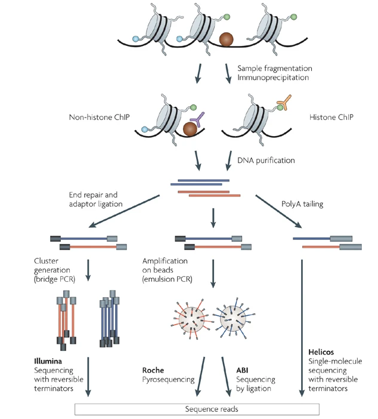{#fig-07-chip-seq-and-atac-seq-001 width=72%}

@fig-07-chip-seq-and-atac-seq-001 概括了从样本到测序数据的路径（图源：Park PJ. *Nature Reviews Genetics* 10:669–680（2009）[^ch06-park2009]）。图中没有画出、但对分析同样关键的是**对照**：没有对照的"富集"无从谈起，这是下一节的主题。

### CUT&RUN 与 CUT&Tag：不需要交联的替代方案 {#topic-06-cut-run-tag}

[]{#src-0060-ChIP-seq-44}[]{#src-0060-ChIP-seq-46}

ChIP-seq 需要交联和大量细胞，这两点在实践中都常成为瓶颈。**CUT&RUN**（cleavage under targets and release using nuclease）[^ch06-cutrun-paper]提供了另一条路线：不交联，把细胞核固定在磁珠上，让目标蛋白的抗体引导微球菌核酸酶（pA-MNase）到结合位点附近精确切割，只回收切割下来的 DNA 片段。因为反应在完整的细胞核内原位进行，背景信号远低于 ChIP-seq，通常十分之一的测序深度就能获得可比的质量；需要的细胞量也少得多。

**CUT&Tag**（cleavage under targets and tagmentation）[^ch06-cuttag-paper]把切割换成了与蛋白 A 融合的 Tn5 转座酶（pA-Tn5）：Tn5 在切下邻近 DNA 的同时直接连上测序接头，省去了建库步骤。它同样不需要交联、背景低、可用很少的细胞（数百到数千个）完成实验，近年来在低细胞量与单细胞层面的应用中大量取代 ChIP-seq。

::: {.callout-note .book-extension title="拓展阅读｜三种技术怎么选" collapse="true"}

- **ChIP-seq**：需要交联，通常需要百万级细胞；抗体选择面最广，公共数据积累最多，分析工具链最成熟。
- **CUT&RUN**：不交联、背景低、深度需求约为 ChIP-seq 的十分之一；切割窗口小，峰形更锐利。
- **CUT&Tag**：不交联、pA-Tn5 一步完成切割加接头，细胞量需求最低；常配合大肠杆菌 spike-in 做归一化。

三者的数据处理流程与 ChIP-seq 高度相似（质控、比对、找峰），但峰形、背景模型和归一化策略有差异。本章以 ChIP-seq 的流程为主线，这些原则同样适用于另外两种技术。

:::

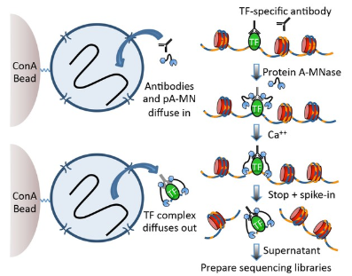{#fig-07-chip-seq-and-atac-seq-002}

### ATAC-seq：用转座酶读出开放的染色质 {#topic-06-atac-principle}

**ATAC-seq**（assay for transposase-accessible chromatin using sequencing）回答的是另一类问题：哪些染色质区域是**开放**的。它不用任何抗体，也不交联：把连好测序接头的 Tn5 转座酶直接加入细胞核，Tn5 会优先插入没有核小体占据、可以被接触的 DNA 区域——它在切割的同时完成接头连接，一步建库[^ch06-atac-paper]。

由此带来几个与 ChIP-seq 本质不同的性质：

- **测的是可及性，不是某个蛋白的位置**。开放区域可能被多种转录因子和调控蛋白占据；ATAC-seq 告诉你"这里开着门"，但不直接说"谁在里面"。
- **不需要抗体，也就没有 input 对照**。ChIP-seq 的对照是为了扣除背景分布；ATAC-seq 的背景由 Tn5 的插入偏好决定，用另外的方式校正（见 [6.5 节](#sec-06-05)）。
- **插入片段本身携带信息**。无核小体区（<100 bp）、单核小体（约 200 bp）、多核小体片段的长度分布，直接反映染色质的组织状态。
- **需要的细胞量少**（数百到五万个），实验流程最简单。

早期的开放染色质测定靠 DNase-seq 和 MNase-seq，ATAC-seq 因其简便和低细胞量需求成为现在的主流；三者测的都是"可接触性"，数据形态与分析方法相通。

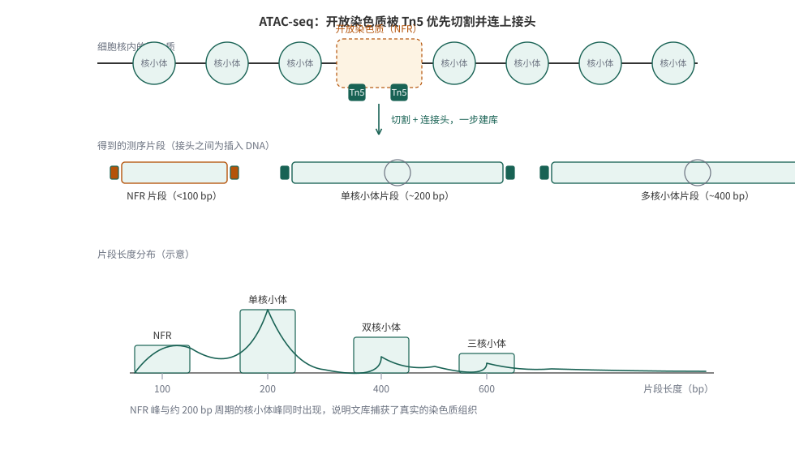{#fig-06-atac-principle}

@fig-06-atac-principle 概括了从开放染色质到测序文库的转换，以及片段长度与核小体组织的对应关系——这个对应关系正是 6.5 节质控指标的来源。

### 三类信号放在一起看 {#topic-06-three-signals}

| | 转录因子 ChIP-seq | 组蛋白修饰 ChIP-seq | ATAC-seq |
| :--- | :--- | :--- | :--- |
| 测量对象 | 特定蛋白的结合位置 | 修饰标记的区域 | 开放染色质 |
| 是否需要抗体 | 是（成败关键） | 是 | 否 |
| 对照 | input（必需） | input（必需） | 无 input；用 Tn5 偏好校正 |
| 典型信号形态 | 窄而尖的峰 | 宽而平的峰（视修饰而定） | 开放位点处的峰 |
| 建议测序深度（ENCODE 现行） | 每重复 2000 万可用片段 | 窄峰型 2000 万 / 宽峰型 4500 万 | 每重复 2500 万条去重后非线粒体 reads |

: 三类区域信号实验的对比（深度标准引自 ENCODE 现行标准，见 [6.2 节](#topic-06-depth-reps)） {#tbl-06-three-signals}

@tbl-06-three-signals 三列对应本章的三个分析对象：6.2—6.4 节以转录因子 NRF1 的 ChIP-seq 为主线（组蛋白修饰 H3K27ac 作为宽峰对照），6.5 节引入 ATAC-seq 案例，6.6—6.8 节把两类数据汇入同一套统计与解释框架。

## 实验对照、重复与主案例设计 {#sec-06-02}

### 对照设计：input、IgG 与组蛋白泛抗体 {#topic-06-controls}

[]{#src-0060-ChIP-seq-52}[]{#src-0060-ChIP-seq-54}

要识别 ChIP 样本中的富集区域，必须知道"如果不做免疫沉淀，reads 会怎样分布"——也就是背景分布。**Input 对照**是最常用的答案：取打断后的染色质，在加抗体免疫沉淀**之前**直接建库测序。它经历了与 ChIP 样本相同的片段化、建库过程，因此能同时反映打断偏好、GC 偏好和拷贝数差异。

其他对照策略各有局限：

- **模拟 IP（mock IP）**：走完全部流程但不加抗体；
- **非特异性抗体（如 IgG）**：用不结合染色质的抗体。

这两种对照得到的 DNA 量少、复杂度低，并不能真实反映背景分布，一般不推荐作为主对照。研究组蛋白修饰时，识别 H3 或 H4 的**泛抗体**是另一种常用对照——它在捕获修饰的同时也捕获了核小体的整体分布。

[]{#src-0060-ChIP-seq-58}

为什么背景这么重要？因为多条偏差来源都会让某些区域"看起来富集"：

1. **打断不均**：致密的异染色质比开放的常染色质更难打断，即使 input 样本中其覆盖也偏低；
2. **GC 与 PCR 偏好**：GC 含量高的片段扩增效率不同，背景分布与基因组 GC 含量相关，哺乳动物常染色质区的 CpG 岛尤其明显；
3. **比对偏好**：重复区域的 reads 难以唯一定位，覆盖天然偏低（见 [第 4 章](04-sequence-alignment.md#sec-04-05)）；
4. **拷贝数变化**：肿瘤样本或细胞系中扩增的区域会产生更多 reads，看似"富集"，实为基因组本身的差异。

::::: {.callout-warning .book-warning title="注意｜对照控制了什么、没控制什么"}

input 对照能扣除打断、GC、建库带来的系统性偏差，但它**不能**创造信噪比——抗体不好，ChIP 信号本身就弱，任何对照都救不回来。同样，input 也不能修正拷贝数变化的全部影响。判断一个 ChIP-seq 数据是否可信，要从对照、抗体、重复三个维度一起看。

:::::

### 抗体质量：实验成败的第一道关 {#topic-06-antibody}

[]{#src-0060-ChIP-seq-66}

ChIP-seq 的特异性完全依赖抗体。系统性评估的结果并不乐观：modENCODE 项目检测了 147 种商品化组蛋白修饰抗体，约 22% 未通过 ChIP 特异性检验，其中大部分还标称为 "ChIP 级"[^ch06-egelhofer]。同一蛋白的不同抗体可能识别不同表位，在基因组不同位置的暴露程度不同，可能给出不一致的富集图谱（单克隆抗体尤其如此）。

实际选择抗体时，核验这几件事：厂商是否提供 ChIP 或 ChIP-seq 应用层面的验证数据；能否用 Western blot 确认条带特异；有条件时用敲低或敲除样本验证信号消失。ENCODE 的抗体验证标准（genetic, orthogonal, independent）可以作为参考框架。

[^ch06-egelhofer]: Egelhofer L, et al. An assessment of histone-modification antibody quality. *Nature Structural & Molecular Biology* 17:662–664（2010）。[PMC 全文](https://pmc.ncbi.nlm.nih.gov/articles/PMC3017233/)。

### 测序深度、文库与重复设置 {#topic-06-depth-reps}

[]{#src-0060-ChIP-seq-70}[]{#src-0060-ChIP-seq-74}[]{#src-0060-ChIP-seq-78}

**需要多少 reads？** 这取决于基因组大小和信号类型：窄峰（转录因子）与宽峰（多数组蛋白修饰）需要的深度不同。ENCODE 现行标准以"可用片段"（去除重复与低质量后的 fragments）计：转录因子 ChIP-seq 每个重复建议 2000 万，窄峰型组蛋白修饰 2000 万，宽峰型（如 H3K27me3、H3K36me3）4500 万[注：ENCODE 数据标准页](https://www.encodeproject.org/chip-seq/transcription_factor/)。这比本书上一版教程引用的"哺乳动物转录因子 3000 万、组蛋白修饰 6000 万 raw reads"（当时按原始 reads 计）口径更新——行业从"数原始 reads"转向"数可用片段"。input 对照建议测序到与 ChIP 样本相当的深度。

**单端还是双端？** 对大多数 ChIP-seq，50 bp 单端测序已足以定位结合位点；较长的 reads 与双端测序能提高唯一比对率，在研究重复区域结合时才成为必要。早期文献"必须双端"的说法针对的是当时的技术条件。

**生物学重复是必需的。** 技术重复（同一文库再测序）只能评估测序环节的变异；要评估生物变异、并让 6.6 节的重复一致性检验有据可依，需要的是**生物学重复**（不同的培养物或个体）。每个条件至少两次重复是底线，三次及以上更稳妥；input 至少一次。重复之间的不一致会在下游分析中直接暴露（见 [6.6 节](#sec-06-06)），这是 ChIP-seq 质控的重要防线。

### 主案例：NRF1 与 DNA 甲基化的竞争 {#topic-06-nrf1-case}

本章第一条例线来自一个具体的生物学问题：**DNA 甲基化是否阻挡转录因子的结合？** 如果某些转录因子不能结合甲基化的 DNA，那么在去除甲基化的细胞里，它们应该出现新的结合位点。NRF1 就是这样的因子[^ch06-nrf1-paper]。

实验设计：野生型小鼠胚胎干细胞（WT）与 DNA 甲基转移酶三敲除细胞系（Dnmt1/3a/3b triple knockout，TKO）中，分别做 NRF1 的 ChIP-seq（各两个生物学重复）、组蛋白修饰 H3K27ac 的 ChIP-seq（各两个重复），并各配一个 input。论文还配套了 DNase-seq（开放的染色质区域）与 RNA-seq——多组数据互相印证正是这类研究的常见做法。

[]{#src-0060-ChIP-seq-229}

这 10 个样本的原始数据公开在 GEO（系列号 **GSE67867**）与 ENA（项目 **PRJNA281090**）：

| 样本 | GEO 编号 | SRA 编号 | 原始 reads |
| :--- | :--- | :--- | ---: |
| NRF1_CHIP_WT1 | GSM1891641 | SRR2500883 | 40,570,927 |
| NRF1_CHIP_WT_2 | GSM1891642 | SRR2500884 | 40,365,286 |
| H3K27AC_CHIP_WT1 | GSM1891651 | SRR2500893 | 41,972,346 |
| H3K27AC_CHIP_WT2 | GSM1891652 | SRR2500894 | 40,822,025 |
| NRF1_INPUT_WT | GSM1891643 | SRR2500885 | 22,773,779 |
| NRF1_CHIP_TKO_1 | GSM1891644 | SRR2500886 | 32,306,980 |
| NRF1_CHIP_TKO_2 | GSM1891645 | SRR2500887 | 45,342,909 |
| H3K27AC_CHIP_TKO_1 | GSM1891653 | SRR2500895 | 50,829,570 |
| H3K27AC_CHIP_TKO_2 | GSM1891654 | SRR2500896 | 45,485,455 |
| NRF1_INPUT_TKO | GSM1891646 | SRR2500888 | 24,937,026 |

: 本章 ChIP-seq 案例使用的 10 个样本（全部为单端测序；编号已于 2026-10 核对） {#tbl-06-chip-seq-and-atac-seq-01}

@tbl-06-chip-seq-and-atac-seq-01 可以读出实验设计的对称性：因子（NRF1/H3K27ac）× 基因型（WT/TKO）× 重复，再加两个 input。本章教程实际下载并分析了其中 WT 侧的三个样本（NRF1 两个重复与 input），TKO 侧的分析命令完全同构。

### 下载原始数据 {#topic-06-download}

第 5 章已经介绍过从 GEO/SRA 获取数据的基本流程（GSE/GSM/SRR 的层级关系、SRA Toolkit 的用法，见 [5.2 节](05-rna-seq.md#sec-05-02)）。这里补充一个对批量下载很好用的在线工具，以及一个重要的校验习惯。

**SRA Explorer**（[sra-explorer.info](https://sra-explorer.info/)）可以把一个 GSE/SRP 号展开成所有样本的下载清单，并为每种下载方式生成现成的链接或命令。注意：网站首页搜索框里预置的示例编号（GSE30567、PRJEB8073 等）只是演示用的**别人的数据**，检索自己的数据请输入本章的 GSE67867。

把 GSE67867 输入搜索并勾选本章 10 个 SRR 样本后，网站可以生成多种输出：

- **FASTQ 下载链接清单**：ENA 上每个 run 的直链；
- **curl/wget 批量下载脚本**：逐个下载全部 FASTQ；
- **Aspera（ascp）下载脚本**：走高速传输协议，大批量时明显更快；
- 带友好文件名的清单、bcbio 项目文件等其他格式。

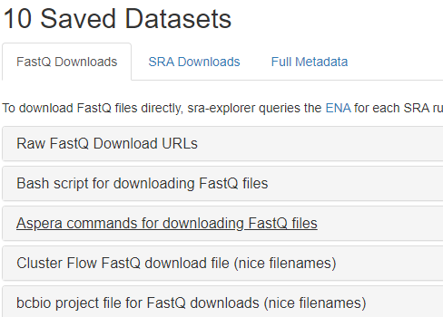{#fig-07-chip-seq-and-atac-seq-004}

@fig-07-chip-seq-and-atac-seq-004 是勾选样本后的列表。以其中的 Aspera 方式为例，生成的命令形如：

```{.bash .numberLines data-book-role="code"}
ascp -QT -l 300m -P33001 -i ~/.aspera/connect/etc/asperaweb_id_dsa.openssh \
  era-fasp@fasp.sra.ebi.ac.uk:vol1/fastq/SRR250/005/SRR2500885/SRR2500885.fastq.gz .
ascp -QT -l 300m -P33001 -i ~/.aspera/connect/etc/asperaweb_id_dsa.openssh \
  era-fasp@fasp.sra.ebi.ac.uk:vol1/fastq/SRR250/003/SRR2500883/SRR2500883.fastq.gz .
ascp -QT -l 300m -P33001 -i ~/.aspera/connect/etc/asperaweb_id_dsa.openssh \
  era-fasp@fasp.sra.ebi.ac.uk:vol1/fastq/SRR250/003/SRR2500884/SRR2500884.fastq.gz .
```

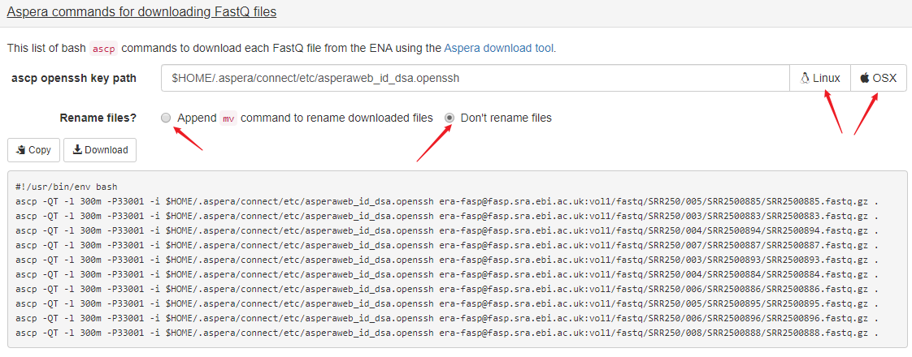{#fig-07-chip-seq-and-atac-seq-007}

如果不用 Aspera，ENA 的 https 直链也可以直接下载。ENA 的 FASTQ 路径有固定规律，本章三个 WT 侧样本：

```{.bash .numberLines data-book-role="code"}
# WT 侧三个样本：NRF1 重复 1、2 与 input
wget -c https://ftp.sra.ebi.ac.uk/vol1/fastq/SRR250/003/SRR2500883/SRR2500883.fastq.gz
wget -c https://ftp.sra.ebi.ac.uk/vol1/fastq/SRR250/004/SRR2500884/SRR2500884.fastq.gz
wget -c https://ftp.sra.ebi.ac.uk/vol1/fastq/SRR250/005/SRR2500885/SRR2500885.fastq.gz
```

路径规则是 `vol1/fastq/<SRR 前六位>/<三位零填充的尾号>/<SRR 号>/<SRR 号>.fastq.gz`（更长的编号会有两级填充，直接用 SRA Explorer 生成最稳妥）。批量下载可以写成循环：

```{.bash .numberLines data-book-role="code"}
#!/usr/bin/env bash
cat SRR.list | while read id
do
  wget -c https://ftp.sra.ebi.ac.uk/vol1/fastq/${id:0:6}/00${id: -1}/$id/${id}.fastq.gz
done
```

::::: {.callout-warning .book-warning title="注意｜下载完成先校验，再看文件大小"}

本书写作时的真实经历：分段并行下载时，两个 FASTQ 文件**字节数与服务器报告完全一致**，`gzip -t` 却报 CRC 错误——下载过程中内容被损坏，大小检查根本发现不了。ENA 为每个文件提供官方 md5（run 页面的 fastq_md5 字段），下载后应当核对：

```{.bash data-book-role="code"}
# 示例：核对 SRR2500883（期望值来自 ENA run 页面）
md5sum SRR2500883.fastq.gz   # macOS 为 md5 -q
gzip -t SRR2500883.fastq.gz && echo OK
```

大小正确不等于内容正确；校验和通过才算拿到数据。

:::::

## ChIP-seq 预处理与质量评估 {#sec-06-03}

### 分析流程总览 {#topic-06-overview}

[]{#src-0060-ChIP-seq-82}

ChIP-seq 的计算分析可以概括成下面的流程（图见下）：

1. **原始数据质控**：检查测序质量、接头污染、GC 分布（见 [3.7 节](03-sequencing-technologies.md#sec-03-07)）；
2. **修剪与过滤**：去接头、去低质量碱基（见 [3.8 节](03-sequencing-technologies.md#sec-03-08)）；
3. **比对**：把 reads 定位到参考基因组（见 [第 4 章](04-sequence-alignment.md#sec-ch04)）；
4. **比对后处理与质控**：过滤低质量比对、检查比对率与复杂度；
5. **peak calling**：寻找相对 input 显著富集的区域（见 [6.4 节](#sec-06-04)）；
6. **重复一致性检验**：IDR（见 [6.6 节](#sec-06-06)）；
7. **差异分析与下游解释**：统一峰集合、计数、注释与 motif（见 [6.7 节](#sec-06-07)与 [6.8 节](#sec-06-08)）。

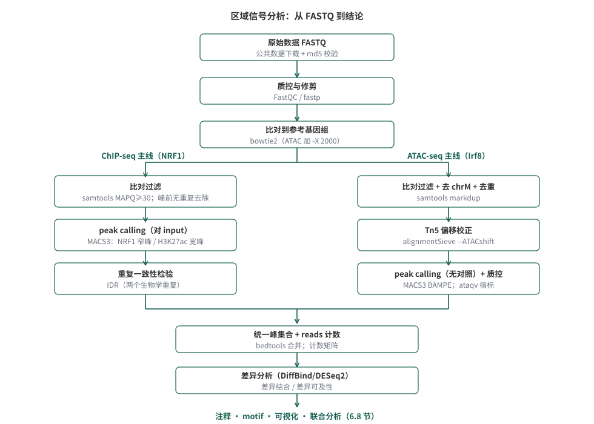{#fig-07-chip-seq-and-atac-seq-003}

如 @fig-07-chip-seq-and-atac-seq-003 所示，两条主线共用质控与比对，在专属处理环节分叉后汇入同一套统计框架；其中第 1—3 步对所有高通量测序数据都是共通的，本章只讲与 ChIP-seq/ATAC-seq 相关的判断点；第 5 步起才是区域信号分析特有的内容。

### 准备分析环境 {#topic-06-environment}

[]{#src-0060-ChIP-seq-100}

第 2 章安装过 conda/mamba（见 [2.2 节](02-environment-and-programming.md#sec-02-02)的软件环境配置）。本章全部命令行工具可以用一个环境装齐。把下面的内容存为 `ch06_env.yaml`，然后 `micromamba create -n ch06 -f ch06_env.yaml`（conda 用户用 `conda env create`）：

```{.yaml .numberLines data-book-role="data" data-code-title="环境定义 ch06_env.yaml"}
name: ch06
channels:
  - conda-forge
  - bioconda
dependencies:
  - python=3.10
  - bowtie2=2.5
  - samtools=1.21
  - bedtools=2.31
  - macs=3        # 提供 macs3 命令
  - fastp
  - fastqc
  - multiqc
  - deeptools
  - ataqv
  - idr
  - pybedtools
  - "numpy<1.24"  # IDR 2.0.4 依赖旧版 numpy 的 np.int；不固定会报错
```

::: {.callout-warning .book-warning title="注意｜两个版本坑"}

- **IDR 与 numpy**：bioconda 的 IDR 2.0.4 与 numpy≥1.24 不兼容（运行时报 `numpy has no attribute 'int'`），环境里必须固定 `numpy<1.24`，或为 IDR 单独建环境。
- **FastQC 0.13**：FastQC 新版为 Python 重写，命令行参数以长参数为准（`--outdir`、`--threads`）；旧脚本的 `-o`、`-t` 短参数不再可用。本文统一用长参数。

:::

R 侧差异分析用 Bioconductor 的 **DiffBind**（`micromamba create -n ch06r -c conda-forge -c bioconda bioconductor-diffbind`，会一并装好 R）；注意 conda 渠道的 DiffBind 可能需要补装 `bioconductor-genomeinfodb` 才能启用黑名单功能。

### 原始数据质控：FastQC 与 MultiQC {#topic-06-qc}

[]{#src-0060-ChIP-seq-311}[]{#src-0060-ChIP-seq-317}

FastQC 的通用指标（每碱基质量、接头含量等）已在 [3.7 节](03-sequencing-technologies.md#sec-03-07)讲过。对 ChIP-seq，**每条 reads 的 GC 含量分布**值得单独看：复杂度高的文库中 reads 来自大量随机片段，GC 分布应接近正态；偏离往往提示扩增偏好或污染。但也要结合实验对象判断——

::::: {.callout-warning .book-warning title="注意｜GC 分布要结合实验对象解读"}

富集的 DNA 片段反映目标蛋白的序列偏好。如果转录因子偏好结合 CpG 岛或低复杂度区域，GC 分布本来就会偏离"标准正态"；先看过表达序列（接头二聚体、 adapters）再看 GC，过滤后复查，不要孤立下结论。

:::::

[]{#src-0060-ChIP-seq-345}[]{#src-0060-ChIP-seq-351}[]{#src-0060-ChIP-seq-356}

过滤用 **fastp**（自动检测接头、按质量修剪、支持多线程）：

```{.bash .numberLines data-book-role="code"}
#!/usr/bin/env bash
mkdir -p clean_data
for r in SRR2500883 SRR2500884 SRR2500885
do
  fastp --thread 8 \
    -i ${r}.fastq.gz -o clean_data/${r}.clean.fastq.gz \
    -h clean_data/${r}.fastp.html -j clean_data/${r}.fastp.json
done
```

fastp 生成的 HTML 报告包含过滤前后全部指标。本书实际运行（每个样本取前 100 万条 reads 的小子集）的结果：

```{.text data-book-role="output"}
SRR2500883: 1,000,000 -> 967,181 reads（保留 96.7%），q30 比率 0.981
SRR2500884: 1,000,000 -> 968,212 reads（保留 96.8%），q30 比率 0.981
SRR2500885: 1,000,000 -> 965,541 reads（保留 96.6%），q30 比率 0.981
```

这批公共数据质量很好（可能是作者上传前已过滤的版本），过滤前后差异不大；自己的新数据上这一步的差异通常更明显。过滤后用 FastQC 复查：

```{.bash .numberLines data-book-role="code"}
cd clean_data
fastqc --threads 4 --outdir QC *.clean.fastq.gz
multiqc .          # 汇总所有报告，输出 multiqc_report.html
```

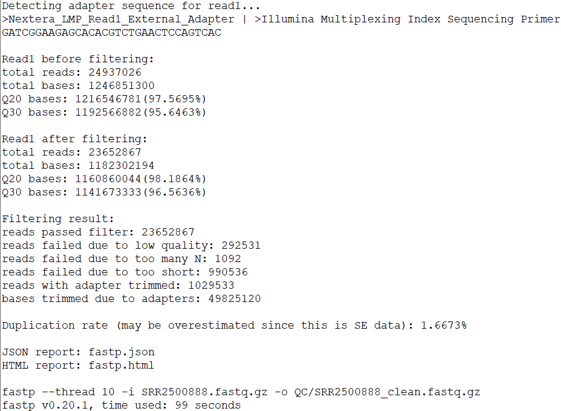{#fig-07-chip-seq-and-atac-seq-010}

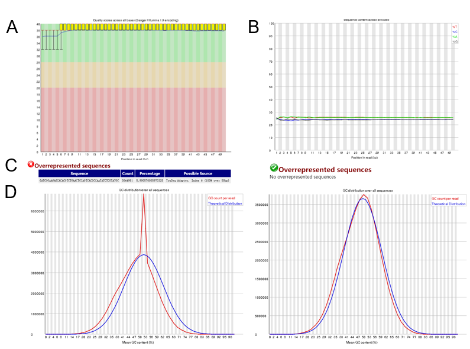{#fig-07-chip-seq-and-atac-seq-011}

@fig-07-chip-seq-and-atac-seq-011 从上到下：每碱基质量值分布、碱基组成、过表达序列（左：过滤前，右：过滤后）、GC 含量分布（左：过滤前，右：过滤后）。GC 异常与过表达序列常常是同一个来源——接头或引物污染，过滤后一起恢复正常。

### 比对与比对结果检查 {#topic-06-align}

[]{#src-0060-ChIP-seq-404}[]{#src-0060-ChIP-seq-409}[]{#src-0060-ChIP-seq-417}[]{#src-0060-ChIP-seq-423}

比对的算法原理（种子扩展、BWT/FM 索引）与工具选择已在 [第 4 章](04-sequence-alignment.md#sec-04-04)展开。ChIP-seq 的 reads 来自随机打断的基因组 DNA，用 Bowtie 2 或 BWA 这类短序列比对工具即可；这里只讲本章链条里需要的几个决定。

**参考基因组**：用与研究匹配的版本。本章案例是小鼠数据，用 UCSC 的 mm10（[4.2 节](04-sequence-alignment.md#sec-04-02)讨论过参考基因组的来源与版本问题）：

```{.bash .numberLines data-book-role="code"}
# 下载 mm10 基因组（约 900 MB）
wget -c https://hgdownload.soe.ucsc.edu/goldenPath/mm10/bigZips/mm10.fa.gz
gunzip mm10.fa.gz
# 建索引（28 核约 25 分钟；索引文件以指定前缀命名）
bowtie2-build --threads 24 mm10.fa mm10
```

构建完成后得到 6 个以 `mm10` 为前缀的 `.bt2` 文件；比对时用 `-x` 指定这个前缀。

**MAPQ 阈值**：[4.6 节](04-sequence-alignment.md#sec-04-06)介绍过 MAPQ 的含义。ChIP-seq 惯例是只保留唯一比对的 reads，实践中用 `samtools view -q 30` 过滤（Bowtie 2 中 MAPQ 30 通常对应唯一比对）。**过滤值要与后文报告口径一致**——正文说 30，命令就是 `-q 30`。

**比对模式**：Bowtie 2 默认的 end-to-end（全局）模式要求整条 reads 都参与比对，不做修剪；`--local`（局部）模式会把 reads 两端低质量部分剪掉换取更高得分。

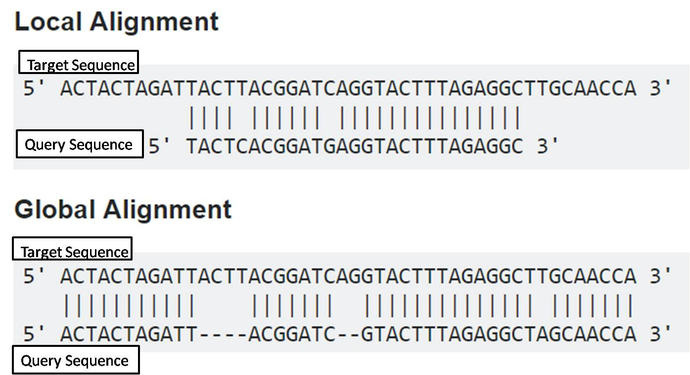{#fig-07-chip-seq-and-atac-seq-012}

对随机打断、质量不错的 ChIP-seq 数据，**默认的 end-to-end 即可**；local 模式更适合 reads 质量差或期望存在融合/重排的场景[注：图示来自 Bowtie 2 手册](http://bowtie-bio.sourceforge.net/bowtie2/manual.shtml)。

[]{#src-0060-ChIP-seq-456}

比对加过滤一条命令完成（单端数据）：

```{.bash .numberLines data-book-role="code"}
#!/usr/bin/env bash
for r in SRR2500883 SRR2500884 SRR2500885
do
  bowtie2 -x mm10 -p 12 -U clean_data/${r}.clean.fastq.gz 2> ${r}.bt2.log \
    | samtools view -h -@ 6 -bS -q 30 \
    | samtools sort -@ 6 -o align/${r}.q30.bam
  samtools index align/${r}.q30.bam
  samtools flagstat align/${r}.q30.bam > align/${r}.flagstat.txt
done
```

`-x mm10` 指索引前缀；`-U` 表示单端输入（双端用 `-1/-2`）；`samtools view -q 30` 丢弃 MAPQ<30 的比对，`-h` 保留头部信息，排序后建索引以便快速按区域读取。本书实际运行（小子集）的比对率：

```{.text data-book-role="output"}
SRR2500883 (NRF1 ChIP WT1):  96.44% overall alignment rate
SRR2500884 (NRF1 ChIP WT2):  96.16% overall alignment rate
SRR2500885 (input):          98.69% overall alignment rate
```

拿到 BAM 后，先做三件事再进入找峰环节：

1. **看比对率**：`grep "overall alignment rate" *.bt2.log`。通常应 >70%；低于 50% 要停下来查原因（污染、参考基因组选错、读取质量）——6.5 节的 ATAC 案例里就有这样一个真实样本。
2. **看唯一比对比例**：ChIP 样本因富集而略低于 input 是正常现象（被富集的 reads 聚集在特定位置，重复比对随之增加）；过低提示文库复杂度问题。
3. **看冗余率**：MACS 运行日志会报告（见下节），过高说明 PCR 过度扩增或起始量不足。

[]{#src-0060-ChIP-seq-622}

## Peak calling 原理与参数 {#sec-06-04}

### 信号类型决定找峰策略 {#topic-06-signal-types}

[]{#src-0060-ChIP-seq-630}[]{#src-0060-ChIP-seq-634}

peak calling 的目标，是在全基因组上找出 ChIP 信号相对背景显著富集的区域。**目标蛋白的类型决定了信号的形态**：

- **转录因子：窄而尖（sharp/narrow）**。转录因子识别特定序列基序，富集片段集中在基序周围。由于测序 reads 只来自片段两端，正负链的 reads 在结合位点两侧形成特征性的**双峰分布**，两峰之间的距离近似片段长度。
- **组蛋白修饰：多数宽而平（broad）**。修饰覆盖整个核小体甚至跨越多个核小体，信号表现为成百上千 bp 的宽区域。
- **RNA 聚合酶 II：混合形态（mixed）**。启动子处的暂停信号是窄峰，基因内部的延伸信号是宽峰。

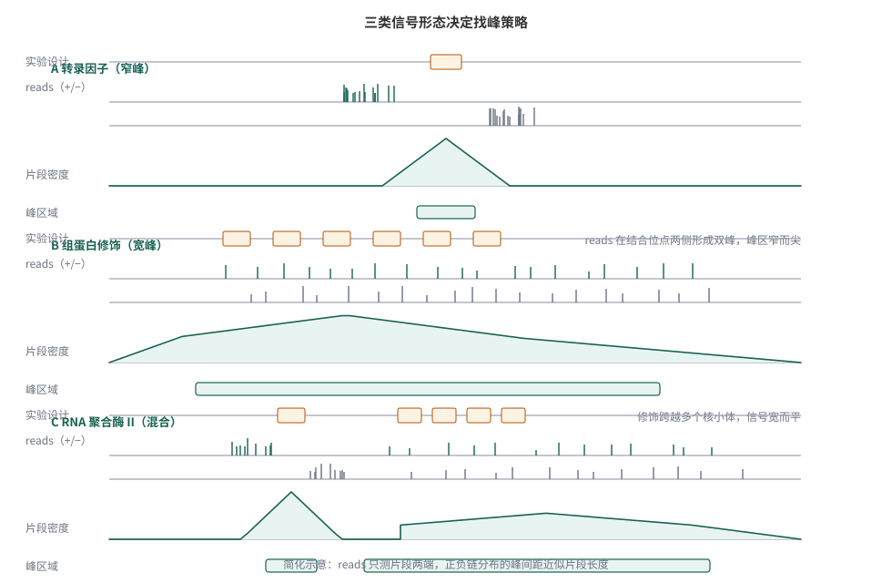{#fig-07-chip-seq-and-atac-seq-013}

@fig-07-chip-seq-and-atac-seq-013 从上到下展示了三类信号：最上层是真实的结合设计，中间是正负链 reads 的分布（注意窄峰信号的双峰结构），最下层是片段密度与最终被识别的峰区域。

**并非所有组蛋白修饰都是宽峰**。ENCODE 对组蛋白修饰的分类：

| 信号类型 | 典型修饰 |
| :--- | :--- |
| 窄峰（narrow） | H3K4me3、H3K27ac、H3K9ac |
| 宽峰（broad） | H3K27me3、H3K36me3、H3K9me3 |

: 组蛋白修饰的峰类型（整理自 ENCODE 组蛋白 ChIP-seq 标准） {#tbl-06-peak-types}

窄峰修饰标记活跃的启动子/增强子，宽峰修饰标记大范围的抑制或转录区域——峰形态本身就承载生物学含义。这也直接影响工具与参数的选择：窄峰用点式找峰，宽峰用区域式找峰（MACS 的 `--broad`，见下文）。

### Peak calling 的一般逻辑 {#topic-06-calling-logic}

[]{#src-0060-ChIP-seq-650}

::::: {.callout-note .book-core title="核心知识｜Peak calling 的基本思路"}

多数 peak caller 遵循同一框架：沿基因组滑动窗口，计算 ChIP 样本相对 input 背景的 reads 富集程度，用统计模型评估显著性，再对全基因组成千上万个窗口做多重检验校正。

:::::

[]{#src-0060-ChIP-seq-683}[]{#src-0060-ChIP-seq-687}[]{#src-0060-ChIP-seq-690}[]{#src-0060-ChIP-seq-693}

具体拆开是四步：

1. **富集计算**：窗口大小通常取估计片段长度的两倍；ChIP 与 input 的 reads 数各自按文库总量归一化后比较。
2. **显著性**：用泊松或负二项分布把观测 reads 数与背景模型的期望比较，得到 p 值。模型不必复杂——简单模型在这类数据上的表现并不差。
3. **多重检验校正**：基因组上检验了数万个窗口，总有一些 p 值"碰巧"很小；用 FDR（q 值）控制假发现。有 input 时还可以交换 ChIP 与 input"反向找峰"来估计经验 FDR。
4. **阈值选择**：p/q 值阈值决定喊多少峰。宽松的阈值多喊（利于 6.6 节的重复检验），严格的阈值少而准（利于最终报告）。重要的是：**阈值选择本身就是分析决定，报告结果时应同时说明所用阈值**；单纯比较两个不同阈值下的峰数量没有意义。

### MACS3 实操：NRF1 窄峰与 H3K27ac 宽峰 {#topic-06-macs3}

[]{#src-0060-ChIP-seq-721}[]{#src-0060-ChIP-seq-717}[]{#src-0060-ChIP-seq-709}[]{#src-0060-ChIP-seq-701}

**MACS** 是使用最广的 peak caller[^ch06-macs-paper]，现行版本为 MACS3[注：项目主页](https://github.com/macs3-project/MACS)，基础 `callpeak` 语法与 MACS2 一致。对窄峰数据：

```{.bash .numberLines data-book-role="code"}
# NRF1 WT 两个重复，各自对 input 找峰（窄峰）
macs3 callpeak \
  -t align/SRR2500883.q30.bam -c align/SRR2500885.q30.bam \
  -f BAM -g mm -n NRF1_WT1 -q 0.05 --outdir peaks
macs3 callpeak \
  -t align/SRR2500884.q30.bam -c align/SRR2500885.q30.bam \
  -f BAM -g mm -n NRF1_WT2 -q 0.05 --outdir peaks
```

`-t` 是 ChIP 样本，`-c` 是 input 对照，`-g mm` 告诉 MACS 基因组大小（小鼠有效基因组约 1.87 Gb），`-q 0.05` 为 FDR 阈值，`-n` 指定输出前缀。本书实际运行（WT 侧三个样本全量数据）：

```{.text data-book-role="output"}
NRF1_WT1: 10,027 个峰（q<0.05）
NRF1_WT2: 15,306 个峰（q<0.05）
```

两个重复各自的峰数量不同是正常的（深度、信噪比有差异），重复间一致性的判断交给 6.6 节的 IDR，而不是直接比较数量。

MACS 运行日志里的两个数字值得留意：

```{.text data-book-role="output"}
#1 filter out redundant tags at the same location by allowing at most 1 tag(s)
#1  Redundant rate of treatment: 0.10
#1  Redundant rate of control: 0.02
```

**MACS 默认每个位置最多保留 1 条 read（`--keep-dup 1`）**，日志会报告因此去掉的冗余率（本例 ChIP 10%、input 2%）。这不是"删除所有重复"——`--keep-dup all` 可以全部保留，`--keep-dup auto` 让 MACS 按二项分布自估。测序深度高的今天，同一位置的 reads 也可能来自真实的不同片段；对复杂度好的文库，是否去重、去多少，是应当显式记录的分析决定（ENCODE 流程会做重复标记，6.5 节的 ATAC 数据则常规去重）。

对宽峰数据加 `--broad`：

```{.bash .numberLines data-book-role="code"}
# H3K27ac 宽峰示例（TKO 侧样本同理）
macs3 callpeak \
  -t align/H3K27AC_CHIP_WT1.q30.bam -c align/NRF1_INPUT_WT.q30.bam \
  -f BAM -g mm -n H3K27ac_WT1 --broad --outdir peaks
```

主要输出文件是 `NRF1_WT1_peaks.narrowPeak`（窄峰）或 `*_peaks.broadPeak`（宽峰），BED 兼容格式，每行一个峰：染色体、起点、终点、名称、得分（积分越高越显著）、链、fold enrichment、`-log10(p)`、`-log10(q)`、相对峰顶位置。

::: {.callout-note .book-extension title="拓展阅读｜其他 peak caller" collapse="true"}

- **SPP**：ENCODE 转录因子流程长期使用的 R 包；
- **Peakzilla**：为高分辨率转录因子数据设计，仍可用但社区使用已少；
- **HOMER findPeaks**、**GEM**：与其注释/motif 工具链一体的方案。

工具版图会变，"窗口—背景—显著性—校正"的框架不变；换工具时重点核对它对重复 reads、片段长度估计和背景模型的处理。

:::

### 峰的过滤与质量评估 {#topic-06-peak-qc}

[]{#src-0060-ChIP-seq-697}[]{#src-0060-ChIP-seq-705}[]{#src-0060-ChIP-seq-713}[]{#src-0060-ChIP-seq-727}

拿到峰之后、下结论之前，还有两类清理与检查。

**黑名单区域**：ENCODE 敟计了各物种中在任何 ChIP-seq 数据（包括 input）里都异常高信号的区域——多在着丝粒、端粒附近的人工富集区——并发布为 blacklist 文件[注：下载地址](https://github.com/ENCODE-DCC/kundaje-lab-blacklists)。落在黑名单里的峰应直接剔除，线粒体染色体（chrM）上的峰同理：

```{.bash .numberLines data-book-role="code"}
# 下载 mm10 黑名单后
bedtools intersect -v -a peaks/NRF1_WT1_peaks.narrowPeak \
  -b mm10.blacklist.bed > peaks/NRF1_WT1.clean.narrowPeak
# 去掉 chrM（黑名单通常已含，双保险）
grep -v "^chrM" peaks/NRF1_WT1.clean.narrowPeak > peaks/NRF1_WT1.final.narrowPeak
```

**饱和度检查**：把 reads 逐步下采样、分别找峰，画出"reads 数—峰数"曲线。曲线进入平台期说明深度足够再挖峰；仍在增长则说明还有峰没被发现。本书案例在 2000 万 reads 处已接近饱和（原教程结果）。

**浅数据的教训**：本书对小子集（100 万 reads）试跑宽松阈值（`-p 1e-2`）时，MACS 喊出了 30 多万个"峰"——reads 太少、背景太薄时，大量随机波动都能"显著"。这直接说明：**找峰结果的质量受深度约束，重复检验（IDR）和饱和度分析比单看峰数量更可靠**。

## ATAC-seq 专属处理与质控 {#sec-06-05}

前四节的框架对 ATAC-seq 同样适用，但有几个环节**不能照搬** ChIP-seq 的做法。本节讲清楚差异，并完成第二条案例线。

### 与 ChIP-seq 流程的同与不同 {#topic-06-atac-diff}

| 环节 | ChIP-seq | ATAC-seq |
| :--- | :--- | :--- |
| 质控与修剪 | 通用 | 通用，但接头是 nextera 型 |
| 比对 | bowtie2/BWA | 相同工具，参数加 `-X 2000` |
| 对照 | input 必需 | **无 input** |
| 重复 reads | 视深度保留 | **常规去重**（插入位点水平） |
| 线粒体 | 一般不管 | **必须处理**（Tn5 切割无核基因组，线粒体 reads 可占很高比例） |
| Tn5 偏置 | 无 | 需要 +4/−5 偏移校正 |
| 片段信息 | 信号来源 | **本身携带核小体信息** |

: ATAC-seq 与 ChIP-seq 处理环节对比 {#tbl-06-atac-vs-chip}

### 示例数据：Irf8 敲除小鼠的造血干细胞 {#topic-06-atac-data}

第二条案例线来自另一个转录因子故事：**Irf8 编码的转录因子对造血干细胞（LT-HSC）的染色质可及性有什么影响？** 数据为 Irf8 野生型（+/+）与敲除（−/−）小鼠 LT-HSC 的 ATAC-seq，各两个生物学重复，双端测序[^ch06-irf8-data]：

| 样本 | SRA 编号 | 分组 | reads（对） |
| :--- | :--- | :--- | ---: |
| Irf8+/+ rep1 | SRR5852294 | WT | 18,739,382 |
| Irf8+/+ rep2 | SRR5852295 | WT | 9,616,556 |
| Irf8−/− rep1 | SRR5852296 | KO | 6,317,121 |
| Irf8−/− rep2 | SRR5852297 | KO | 13,687,924 |

: ATAC-seq 案例样本（NextSeq 500，双端 2×75） {#tbl-06-atac-samples}

下载方式与 6.2 节相同（ENA 直链或 SRA Explorer），双端数据每个样本有 `_1`/`_2` 两个文件：

```{.bash data-book-role="code"}
wget -c https://ftp.sra.ebi.ac.uk/vol1/fastq/SRR585/004/SRR5852294/SRR5852294_1.fastq.gz
wget -c https://ftp.sra.ebi.ac.uk/vol1/fastq/SRR585/004/SRR5852294/SRR5852294_2.fastq.gz
# 其余三个样本同理（md5 校验不要省）
```

### 从 FASTQ 到过滤后的 BAM {#topic-06-atac-align}

fastp 处理双端数据用 `--detect_adapter_for_pe`，自动识别 nextera 接头：

```{.bash .numberLines data-book-role="code"}
#!/usr/bin/env bash
for id in SRR5852294 SRR5852295 SRR5852296 SRR5852297
do
  fastp --thread 8 --detect_adapter_for_pe \
    -i ${id}_1.fastq.gz -I ${id}_2.fastq.gz \
    -o ${id}_1.clean.fq.gz -O ${id}_2.clean.fq.gz \
    -h ${id}.fastp.html -j ${id}.fastp.json
done
```

比对与 ChIP-seq 的差别在两处：`-X 2000` 放宽配对 reads 间距上限以容纳核小体多聚体长片段（默认 500 会把多核小体片段当坏比对丢掉）；过滤后要去 chrM、按片段去重：

```{.bash .numberLines data-book-role="code"}
#!/usr/bin/env bash
for id in SRR5852294 SRR5852295 SRR5852296 SRR5852297
do
  bowtie2 -x mm10 -p 12 -X 2000 --very-sensitive \
    -1 ${id}_1.clean.fq.gz -2 ${id}_2.clean.fq.gz 2> ${id}.bt2.log \
    | samtools view -h -@ 6 -bS -q 30 -F 1804 -o ${id}.flt.bam
  # 去线粒体（先统计再去除，线粒体比例本身是质控指标）
  samtools idxstats ${id}.flt.bam | awk '$3>0' > ${id}.idxstats.txt
  samtools view -h -o - ${id}.flt.bam \
    | awk 'BEGIN{OFS="\t"} /^@/{print;next} $3!="chrM" && $7!="chrM"{print}' \
    | samtools sort -n -@ 6 -o ${id}.ns.bam -
  # 去重：fixmate 标记后 markdup -r 删除
  samtools fixmate -m -@ 6 ${id}.ns.bam ${id}.fx.bam
  samtools sort -@ 6 -o ${id}.fxs.bam ${id}.fx.bam
  samtools markdup -r -@ 6 -s ${id}.fxs.bam ${id}.final.bam
  samtools index ${id}.final.bam
  rm -f ${id}.ns.bam ${id}.fx.bam ${id}.fxs.bam
done
```

`-F 1804` 过滤未比对、次级比对与低质量比对；`idxstats` 先记录各染色体 reads 数再去 chrM——**顺序别颠倒**，否则线粒体比例这个质控指标就没有了。本书实际运行（全量数据）的比对率：

```{.text data-book-role="output"}
SRR5852294 (WT rep1): 92.36% overall alignment rate
SRR5852295 (WT rep2): 96.42% overall alignment rate
SRR5852296 (KO rep1): 45.95% overall alignment rate
SRR5852297 (KO rep2): 91.93% overall alignment rate
```

::::: {.callout-warning .book-warning title="注意｜一个真实的低比对率样本"}

SRR5852296 只有 46% 的比对率，其余三个样本都在 92% 以上。面对这样的异常，先检查：参考基因组是否选对（是小鼠没错）；接头是否残留（fastp 报告正常）；reads 里是否有大量低复杂度或污染序列（FastQC 的过表达序列、序列_duplication 模块）。这个样本最终以"质量存疑、保留但单独标注"的方式进入后续分析——**异常样本不是悄悄删掉，而是显式记录并让下游统计自己反映它的代价**（6.7 节会看到后果）。

:::::

### Tn5 偏置与偏移校正 {#topic-06-tn5-shift}

Tn5 转座酶以同源二聚体插入 DNA，两个单体的切割位点相隔 9 bp，而测序读到的接头位置是**插入位点**、不是切割位点：正链 reads 应向 3' 端平移 +4 bp，负链 −5 bp，才能让片段端点对齐真实的可及位置[^ch06-picelli-paper]。deepTools 的 `alignmentSieve` 提供了现成参数：

```{.bash .numberLines data-book-role="code"}
for id in SRR5852294 SRR5852295 SRR5852296 SRR5852297
do
  alignmentSieve -b ${id}.final.bam -o ${id}.shifted.bam --ATACshift
done
```

`--ATACshift` 等价于 `--shift 4 -5 -5 4`，同时只保留正确配对的 reads。偏移校正影响的是峰的**分辨率**（summits 更锐利、motif 富集位置更集中），对找峰数量影响不大；做 motif 分析和精细定位时值得先做。

### 片段大小分布：核小体信号 {#topic-06-frag-dist}

ATAC-seq 的插入片段长度分布本身就是实验质量的"心电图"。本书实测（SRR5852294，去重后）的分布特征：在约 100 bp 以下有一个显著的**无核小体区（NFR）**峰，约 200 bp 处有**单核小体**峰，再往上以约 200 bp 为周期出现多核小体峰，强度递减。这种周期性锯齿说明 Tn5 确实在核小体之间的开放区域切割——**没有 NFR 峰、没有周期性，文库很可能失败了**。

本书实测的分布如 @fig-06-fragment-dist ：

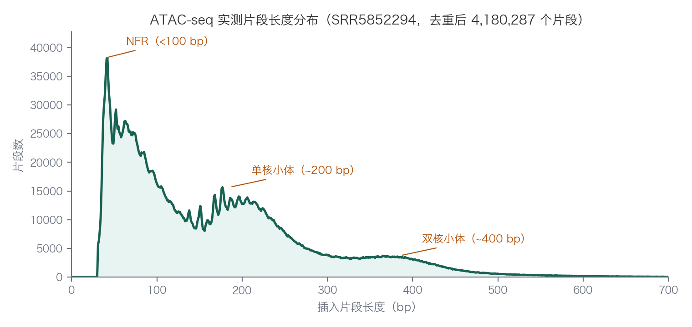{#fig-06-fragment-dist}

提取片段长度并数频次的命令：

```{.bash .numberLines data-book-role="code"}
samtools view SRR5852294.final.bam | awk '$9>0{print $9}' \
  | sort -n | uniq -c | awk 'BEGIN{OFS="\t"}{print $2,$1}' \
  > fragment_dist_SRR5852294.txt
```

NFR 片段（<100 bp）富集在启动子和增强子；单核小体片段更多地围绕在转录因子结合位点两侧。后续分析（如只取 NFR 片段做足迹分析）都以这个分布为前提。

### 质控指标：TSS 富集度、FRiP 与线粒体比例 {#topic-06-atac-qc}

ENCODE 为 ATAC-seq 定义了一套现行指标（[数据标准页](https://www.encodeproject.org/atac-seq/)）：

| 指标 | 含义 | ENCODE 现行标准 |
| :--- | :--- | :--- |
| 比对率 | 比对上的 reads 比例 | >95% 理想，>80% 可接受 |
| TSS 富集度 | TSS 处信号与全基因组背景之比 | mm10 RefSeq：<10 预警、10–15 可接受、>15 理想 |
| FRiP | 落在峰内的 reads 比例 | >0.3 理想，>0.2 可接受 |
| 线粒体比例 | chrM reads 占比 | 无硬阈值，越低越好（影响有效深度） |
| NRF / PBC1 / PBC2 | 文库复杂度与瓶颈 | NRF>0.9、PBC1>0.9、PBC2>3 |

: ATAC-seq 质控指标（ENCODE 现行标准） {#tbl-06-atac-qc}

[**ataqv**](https://github.com/ParkerLab/ataqv) 一条命令输出上述全部指标：

```{.bash .numberLines data-book-role="code"}
ataqv mouse --tss-file mm10_tss.bed \
  --peak-file peaks/ATAC_SRR5852294_peaks.narrowPeak \
  SRR5852294.shifted.bam > ataqv_SRR5852294.txt
```

ataqv 内置的 mouse TSS 注释用 Ensembl 风格染色体名（1、2…），与 UCSC 风格（chr1…）的 BAM 不匹配时 TSS 富集度会算成 0——用 `--tss-file` 提供与 BAM 命名一致的 TSS BED 即可（本文用 HOMER 的 mm10 注释生成）。本书实测（全量数据）：

```{.text data-book-role="output"}
SRR5852294: TSS 富集度 3.3, FRiP 20.4%, 高质量常染色体比对 8,170,128
SRR5852295: TSS 富集度 3.0, FRiP  7.5%, 高质量常染色体比对 10,317,964
SRR5852296: TSS 富集度 3.3, FRiP 14.2%, 高质量常染色体比对  7,293,154
SRR5852297: TSS 富集度 3.5, FRiP 32.6%, 高质量常染色体比对 15,182,560
```

::::: {.callout-warning .book-warning title="注意｜如何解读“不达标”的指标"}

这套数据集的 TSS 富集度只有 3.0–3.5，远低于 ENCODE 的"理想"线。这是**真实情况**而非操作失误：2017 年的 LT-HSC 原代细胞数据，加上 TSS 注释文件的选择都会影响绝对值。正确的反应是：（1）确认不是命名不匹配或流程错误；（2）横向比较同一研究内的样本（本组内四个样本一致地低，说明是数据集特性）；（3）在报告里如实写出并说明口径。质控指标是判断的工具，不是自动判死刑的开关。

:::::

找峰环节与 ChIP-seq 相同，只是没有 `-c` 对照，且对双端数据推荐直接用真实片段：

```{.bash .numberLines data-book-role="code"}
macs3 callpeak -t SRR5852294.final.bam -f BAMPE -g mm \
  -n ATAC_SRR5852294 -q 0.01 --outdir peaks
```

`-f BAMPE` 让 MACS 用配对 reads 的实际片段长度，无需建模与延伸。另一个常见口径是在偏移校正后的 BAM 上用 `--nomodel --extsize 200 --shift -100` 模拟，两者结果可比；本书四个样本用 BAMPE 口径得到 24,964 / 14,971 / 28,796 / 55,203 个峰。

## 重复一致性与统一 peak 集合 {#sec-06-06}

[]{#src-0060-ChIP-seq-732}

两条案例线到这里各有一批峰。把它们用于比较之前，必须回答两个问题：重复之间一致吗？跨样本比较的"统计单位"是什么？

### 为什么峰的交集会骗人 {#topic-06-venn-trap}

[]{#src-0060-ChIP-seq-736}

比较两组峰最直观的做法是取交集、画 Venn 图。但峰是**阈值化的产物**：某区域在样本 A 里 p 值过了阈值、在样本 B 里差一点点没过，取交集时它被算作"样本 B 特异"——尽管两个样本的信号强度几乎相同。交集结果还依赖两个样本各自的阈值与峰数量，天然不对称。原教程对本案例数据的统计可以说明问题的量级（原教程结果）：两个 WT 重复分别得到 7,167 与 10,232 个峰，WT1 中 98% 的峰能在 WT2 中找到，反过来只有 67%——同样的数据、同样的实验，"谁对谁取交集"就改变了"特异峰"的定义。

::: {.callout-warning .book-warning title="注意｜Venn 图的正确用法"}

Venn 图适合展示"明确定义后的集合重叠"，不适合作为判断样本一致性的依据。判断一致性看下述 IDR 与信号相关性。

:::

### IDR：用重复定义可信峰 {#topic-06-idr}

[]{#src-0060-ChIP-seq-747}[]{#src-0060-ChIP-seq-755}[]{#src-0060-ChIP-seq-760}

**IDR（irreproducible discovery rate）** 的思路与 FDR 类似，但针对重复：把两个重复各自的峰列表按信号强度排序后配对，真实信号在两个重复中的排序高度一致，噪声的排序则不一致；IDR 找到"排序一致性开始崩溃"的位置，把之前的峰判为可重复[^ch06-idr-paper]。

使用要点：

- 峰列表**不能预先卡严阈值**——IDR 需要完整的"信号+噪声"排序（惯例：`-p 1e-2` 宽松阈值）；
- 生物学重复用 **IDR≤0.05**；
- 组蛋白修饰的宽峰**不适合** IDR（宽峰的边界与配对本身不明确）；
- 若一个重复质量差，IDR 只会给出很少的可重复峰——这本身就是诊断信号。ENCODE 的"拯救"策略把两个重复合并后随机对半拆成伪重复，用更严的 0.0025 阈值做一致性检查（rescue/self-consistency 比值 <2 通过）。

ATAC-seq 同样适用 IDR（ENCODE ATAC 流程采用同一框架）。

### IDR 实操 {#topic-06-idr-practice}

先对两个重复各自用宽松阈值找峰，再交给 `idr`：

```{.bash .numberLines data-book-role="code"}
# 宽松阈值的重复峰列表
macs3 callpeak -t align/SRR2500883.q30.bam -c align/SRR2500885.q30.bam \
  -f BAM -g mm -n NRF1_WT1_loose -p 1e-2 --outdir peaks
macs3 callpeak -t align/SRR2500884.q30.bam -c align/SRR2500885.q30.bam \
  -f BAM -g mm -n NRF1_WT2_loose -p 1e-2 --outdir peaks
# IDR（按 p 值排序配对）
idr --samples peaks/NRF1_WT1_loose_peaks.narrowPeak peaks/NRF1_WT2_loose_peaks.narrowPeak \
  --input-file-type narrowPeak --rank p.value \
  --output-file peaks/idr_WT12.narrowPeak --output-file-type narrowPeak \
  --plot --log-output-file peaks/idr.log
# 保留 IDR<=0.05（对应 score>=532）
awk '$5>=532' peaks/idr_WT12.narrowPeak > peaks/NRF1_WT_idr.narrowPeak
```

本书实际运行（WT 侧全量数据）：宽松阈值下两个重复各得 20,156 与 30,032 个峰；IDR 输出 15,818 个配对峰，其中 **8,156 个**通过 IDR≤0.05。对比 6.4 节单样本严格阈值的 10,027/15,306：**跨重复的可重复峰（8,156）比任何一个单重复的严格峰都少**——这正是"可信度要用重复购买"的直观体现。

### 统一峰集合与 reads 计数 {#topic-06-consensus-counts}

[]{#src-0060-ChIP-seq-765}[]{#src-0060-ChIP-seq-780}

跨样本比较需要一个**统一的区域集合**作为统计单位：把所有样本的峰合并、去重叠，得到统一峰集合（consensus set），再对每个样本数出落入每个区域的 reads。这一步把"各有各的峰列表"转换成"同一个人为定义的行 × 每个样本一列的计数矩阵"——第 5 章差异表达分析的输入正是同一种结构（见 [5.5 节](05-rna-seq.md#sec-05-06)），6.7 节的差异分析因此可以直接复用那套方法。

```{.bash .numberLines data-book-role="code"}
# 合并两个重复的峰区间，得到统一峰集合
cat peaks/NRF1_WT1_peaks.narrowPeak peaks/NRF1_WT2_peaks.narrowPeak \
  | awk 'BEGIN{OFS="\t"}{print $1,$2,$3}' | sort -k1,1 -k2,2n \
  | bedtools merge -i - > peaks/union_peaks.bed
wc -l peaks/union_peaks.bed
# 每个样本数出落在各区域的 reads
bedtools intersect -a peaks/union_peaks.bed -b align/SRR2500883.q30.bam -c \
  > counts_WT1.txt
```

比较样本间整体相似性时，reads 密度的 **Pearson 相关系数（PCC）** 比 Venn 图可靠，但注意：PCC 在全基因组范围计算时，主要反映一致的背景信号。原教程对本案例的统计（原教程结果）：全基因组逐碱基密度的 PCC 在两个 WT 重复间为 0.98、WT 与 TKO 之间 0.97、ChIP 与 input 之间也有 0.96——两两都很高，因为峰区域只占基因组很小部分。**只在统一峰集合内计算**密度相关性（或看散点图）才能看到分组结构。

计数的归一化与比较要同时考虑区域长度与文库大小。常用 RPKM（每千碱基每百万比对 reads 的 reads 数）做展示级别的归一化，见 @eq-06-rpkm ：

$$
\mathrm{RPKM} = \frac{\text{区域内的 reads 数}}{\text{区域长度(kb)} \times \text{文库比对 reads 总数(百万)}}
$$ {#eq-06-rpkm}

统计检验则交给 6.7 节的计数模型，它们自带更合理的归一化。

## 差异结合与差异可及性分析 {#sec-06-07}

### 从峰到计数矩阵 {#topic-06-diff-idea}

[]{#src-0060-ChIP-seq-797}[]{#src-0060-ChIP-seq-802}

差异分析要回答的问题是：**哪些区域在条件之间的富集差异超出了重复之间的波动？** 上一节已经把数据整理成"区域 × 样本"的计数矩阵，于是第 5 章差异表达的整套方法——DESeq2、edgeR 的负二项模型、多重检验校正——可以直接迁移：基因换成峰区域，表达量换成 reads 计数（方法见 [5.5 节](05-rna-seq.md#sec-05-06)）。这类计数驱动的工具之外，还有一类用隐马尔可夫模型把基因组切分为"获得/不变/丢失"状态的工具（如 chromstaR），适合需要全基因组分段解释的场合，代价是丢失定量的连续性。

DiffBind 把这套流程封装成专门面向峰数据的工具；ATAC-seq 的差异可及性用完全相同的框架，只是行换成了 ATAC 峰。以下术语约定沿用原教程：在某条件下更强的峰称为该条件特异（WT-specific/TKO-specific），两条件间变化小于两倍的称为共享峰。

### DiffBind 实操 {#topic-06-diffbind}

[]{#src-0060-ChIP-seq-807}

**DiffBind**（Bioconductor）以样本表驱动整个流程[^ch06-diffbind-paper]。以 ATAC 案例为例，先写样本表（CSV，bam 为 6.5 节产物、峰为各样本 MACS3 输出）：

```{.text data-book-role="data" data-code-title="atac_samplesheet.csv"}
SampleID,Condition,Replicate,bamReads,Peaks,PeakCaller
WT_rep1,WT,1,SRR5852294.final.bam,peaks/ATAC_SRR5852294_peaks.narrowPeak,narrow
WT_rep2,WT,2,SRR5852295.final.bam,peaks/ATAC_SRR5852295_peaks.narrowPeak,narrow
KO_rep1,KO,1,SRR5852296.final.bam,peaks/ATAC_SRR5852296_peaks.narrowPeak,narrow
KO_rep2,KO,2,SRR5852297.final.bam,peaks/ATAC_SRR5852297_peaks.narrowPeak,narrow
```

然后是五步（本书在 DiffBind 3.20 上实际运行的顺序与函数名）：

```{.r .numberLines data-book-role="code"}
library(DiffBind)
samples <- read.csv("atac_samplesheet.csv")
dba <- dba(sampleSheet = samples)     # 读入样本表
dba <- dba.count(dba)                 # 统一峰集合 + 计数（默认 minOverlap=2）
dba <- dba.normalize(dba)             # 归一化
dba <- dba.contrast(dba, group1 = dba$masks$WT, group2 = dba$masks$KO,
                    name1 = "WT", name2 = "KO")   # 定义比较
dba <- dba.analyze(dba)               # DESeq2 差异检验
report <- dba.report(dba)             # 提取差异峰
length(report)
```

几个实测要点：

- **版本差异**：网上大量教程（含本书上一版）写的 `dba.contrast(condition="Condition")` 与 `bFullLibrarySize` 参数都是 DiffBind 2.x 的写法；3.x 中前者直接报错，后者并入 `dba.normalize(library = DBA_LIBSIZE_FULL / DBA_LIBSIZE_PEAKREADS)`。
- **每组至少几个重复**：design 公式模式下 DiffBind 默认要求每组 ≥3 个重复；2×2 设计需要像上面那样显式给出分组。
- **黑名单与灰名单**：`dba.analyze()` 默认自动套用（本例识别 mm10 并从 32,183 个一致峰中去除了 658 个黑名单区域；conda 安装需补 GenomeInfoDb 包才能启用）。
- **归一化选择**：预期少数峰变化时用峰内 reads 归一化（PEAKREADS），预期全局重排时用全文库归一化（FULL），全局变化场景还应考虑 spike-in。

本书在小子集（每样本 200 万对）与全量数据上各跑了一遍：一致峰集合 7,754（小子集）/ 32,183（全量），DESeq2 全部正常收敛，**默认 FDR<0.05 下差异峰为 0 个**。作为对照，原教程对 NRF1 数据的 DiffBind 分析（原教程结果，未在本书数据上复现）在 FDR<5% 下得到 6,946 个差异结合峰，多数在 TKO 中更强。

### 解读结果与它的边界 {#topic-06-diff-interpret}

**0 个差异峰是失败吗？** 对本例的诊断（用 `dba.report(th=1)` 看全部位点）：31,525 个检验区域中最小的原始 p 值达到 6×10⁻⁴，但 FDR 全部 ≥0.90。也就是说：**信号存在，但 n=2 的设计撑不起三万个区域的多重检验**——再加上 6.5 节那个 46% 比对率的 KO 重复贡献了额外方差。诚实的结论是"本数据集在当前设计下无法给出可信的差异可及性位点"，而不是"Irf8 敲除不影响可及性"。要得到正面的结论，需要更多重复或更聚焦的检验区域（例如先用 pooled 峰定义更小的候选集）。

原教程对 NRF1 数据的结果解读可以对照学习（原教程结果）：PCA 图中重复按条件分开聚类，说明条件效应大于重复噪声——这是差异分析可信的前提；MA 图显示多数峰不变、少数高可信变化；全局变化明显时（所有峰整体偏移）需要考虑 spike-in 归一化，否则相对归一化会把真实的全局变化"归一化掉"。

::::: {.callout-warning .book-warning title="注意｜差异结果能支持什么结论"}

差异峰列表支持的是"这些区域的富集在两组间不同"。它**不直接**说明：哪个转录因子造成差异（那是 motif 与联合分析的课题）；差异如何改变表达（需要表达数据）；机制是什么。把"差异可及"写成"调控了基因表达"，每一步都要单独的证据。

:::::

## 注释、motif、可视化与解释边界 {#sec-06-08}

[]{#src-0060-ChIP-seq-820}

最后一组问题：峰在基因组的什么位置、可能属于哪些基因、序列里有什么信息、和其他数据有什么关系。

### 峰落在基因组的哪里：注释与 TSS 距离 {#topic-06-annotation}

[]{#src-0060-ChIP-seq-823}[]{#src-0060-ChIP-seq-839}

注释回答"峰落在哪种基因组特征上"：启动子、外显子、内含子、基因间区……注释文件（GTF）可来自 Ensembl、UCSC 或 NCBI（[4.3 节](04-sequence-alignment.md#sec-04-03)比较过三家的差异）。注释的麻烦在重叠：一个峰可能同时落在启动子和另一个基因的内含子。惯例是按层级分配（如 promoter > exon > intron > intergenic），或按重叠比例分配——**层级顺序是一个主观决定，报告时要写明**，否则"70% 的峰在启动子"可能只是层级选择的产物。

**HOMER** 的 `annotatePeaks.pl` 一条命令完成位置注释与最近基因：

```{.bash .numberLines data-book-role="code"}
# narrowPeak 转成 chr/start/end/name/score 五列
awk 'BEGIN{OFS="\t"}{print $1,$2,$3,"peak_"NR,$8}' \
  peaks/NRF1_WT1_peaks.narrowPeak > peaks/homer_peaks.txt
annotatePeaks.pl peaks/homer_peaks.txt mm10 -size given \
  > peaks/homer_annotation.txt
```

本书实际运行（10,027 个 NRF1 WT1 峰）输出的前几行：

```{.text data-book-role="output"}
peak_9901  chrX  74270571  74270900  ...  promoter-TSS (NM_052835)  -81   Rpl10
peak_8230  chr7  60004978  60005327  ...  promoter-TSS (NM_013670)   47   Snrpn
```

**到最近 TSS 的距离分布**是更少依赖注释层级的一张图：把每个峰到最近转录起始位点的距离画成直方图。转录因子常见双峰分布——一簇贴着启动子（近端），一簇散布在远处（远端增强子）。只统计距离本身，不预设"峰属于哪个基因"，信息更中立。

### 峰与靶基因：便利与陷阱 {#topic-06-target-genes}

[]{#src-0060-ChIP-seq-844}[]{#src-0060-ChIP-seq-848}

"峰 → 靶基因"的分配是最容易被过度解释的一步。最简单的做法是把峰分给最近的 TSS，但小鼠中存在距启动子 1 Mb 以外的增强子（原教程引述的例子）；启动子近端的峰也未必调控最近的那个基因。 Capture Hi-C 等三维基因组技术能提供更可靠的峰-基因对应，但数据与算力成本都高。

实用约定：把分析分成近端（如 TSS±2 kb）与远端两组分别做；远端峰的"靶基因"只作为线索而不是结论。GO 富集等下游分析对靶基因误配很敏感，把假基因名放进富集分析会得到"看起来显著、实际是噪声"的功能注释。

### 功能富集：GO、KEGG 与背景集 {#topic-06-enrichment}

[]{#src-0060-ChIP-seq-851}[]{#src-0060-ChIP-seq-858}

拿到候选基因列表后做 GO/KEGG 富集的通用方法在第 5 章（[5.6 节](05-rna-seq.md#sec-05-07)）已经讲过（clusterProfiler 等），这里只强调峰数据特有的一个决定：**背景集**。检验"靶基因是否富集在某功能"时，分母用什么基因？用全基因组所有基因，还是用所有表达基因、或所有有峰的基因？背景选宽了富集被稀释，选窄了容易"人人显著"。峰数据的合理背景常取"同样有峰检测能力的基因集"（例如同一细胞类型中所有开放区域的基因）。

结果报告的纪律与第 5 章一致：按 p 值而非变化倍数排序、给出完整富集表、避免挑选性展示"最好看"的条目。

### Motif 分析：从头发现与已知扫描 {#topic-06-motif}

[]{#src-0060-ChIP-seq-863}[]{#src-0060-ChIP-seq-867}[]{#src-0060-ChIP-seq-882}

motif 分析回答"峰的序列里藏着什么结合信号"，有两条互补路线：

- **从头发现（de novo）**：在峰序列里搜索显著富集的短序列模式，不预设是什么；
- **已知扫描（known motif）**：用 JASPAR/HOCOMOCO 等数据库的已知 PWM，检验峰里某个已知因子的基序是否富集。

从头发现的富集**必须**对照背景序列（GC 含量匹配的随机区域，或 shuffled 峰序列），否则基因组组成偏差会伪装成"富集"。motif 表示为位置权重矩阵（PWM），画成 sequence logo。

HOMER 的 `findMotifsGenome.pl` 一条命令完成背景匹配与统计：

```{.bash .numberLines data-book-role="code"}
# 用 IDR 可重复峰做 motif（8,156 个）
awk 'BEGIN{OFS="\t"}{print $1,$2,$3,"idr_"NR}' peaks/NRF1_WT_idr.narrowPeak \
  > peaks/idr_peaks.bed
findMotifsGenome.pl peaks/idr_peaks.bed mm10 peaks/homer_motif_out \
  -size 200 -mask
```

本书实际运行的结果极具说服力——已知 motif 富集第一名就是 **NRF1 自身**：

```{.text data-book-role="output"}
NRF1(NRF)/MCF7-NRF1-ChIP-Seq(Homer)  一致序列 CTGCGCATGCGC
p=1e-2738；7,661 条目标序列中 3,147 条（41%）含该 motif
```

从免疫沉淀、找峰、IDR 到 motif，整条链独立地指向同一个蛋白——这是 ChIP-seq 分析链最漂亮的自我验证。TF 的 ChIP-seq 峰中含目标 motif 的比例通常在 60–80%（原教程对本数据用不同方法统计为 64% 与 73%）；不含 motif 的峰可能来自间接互作、交叉交联伪影或同源二聚体的协作结合，这正是"峰 ≠ 直接结合位点"的边界。

::: {.callout-note .book-extension title="拓展阅读｜motif 之外的序列分析" collapse="true"}

峰序列还能做**已知 motif 的存在性扫描**（检验协同因子的富集）、**足迹分析**（ATAC 数据中利用 Tn5 切断偏好推断结合 occupation）、**序列保守性**（UCSC 的 phastCons/phyloP 分数配合 bedtools 聚合）。共同原则：所有"富集"都要有背景对照。

:::

### 可视化：信号热图与轨道图 {#topic-06-heatmap}

基因组浏览器（IGV，见 [4.8 节](04-sequence-alignment.md#sec-04-08)）适合逐区域检查；跨样本的全局比较靠信号热图与平均信号谱。**deepTools**（命令行工具套件）的标准三步：

```{.bash .numberLines data-book-role="code"}
# 1. 生成大片段覆盖度（bigWig）
bamCoverage -b align/SRR2500883.q30.bam -o WT1_cov.bw \
  --binSize 10 --normalizeUsing CPM -p 6
# 2. 以峰顶为中心计算矩阵（峰前后各 1 kb）
computeMatrix reference-point -S WT1_cov.bw -R peaks/idr_sorted.bed \
  -a 1000 -b 1000 --referencePoint center -o matrix.gz -p 6
# 3. 热图与平均谱
plotHeatmap -m matrix.gz -out heatmap.png --dpi 200
plotProfile -m matrix.gz -out profile.png --dpi 200
```

热图的行按信号排序、颜色编码 reads 密度，一眼看出几千个峰上的信号集中程度与样本间模式。两个解读陷阱：色阶是非线性时会放大弱差异；行不排序时低信号行会"藏"在高信号行之间。对比多个样本时保持同一色尺。

### 与其他数据联合分析 {#topic-06-integration}

[]{#src-0060-ChIP-seq-886}[]{#src-0060-ChIP-seq-890}[]{#src-0060-ChIP-seq-901}[]{#src-0060-ChIP-seq-906}

区域信号数据天然适合互相叠加：ChIP 峰 × 表达数据（第 5 章的 RNA-seq：结合变化是否伴随表达变化）、峰 × 可及性（NRF1 案例中的 DNase-seq/本章的 ATAC-seq）、峰 × DNA 甲基化（WGBS）、峰 × 三维结构（Hi-C 环）。操作上都是同一模式：用 bedtools 把峰与另一数据的区间或信号对齐，再比较条件间的变化方向（delta-delta 散点图）。

::::: {.callout-warning .book-warning title="注意｜联合分析前先统一处理链"}

比较任何两组区域数据前，确认它们经过**可比的预处理**：同样的参考基因组版本、相近的 reads 长度、一致的唯一比对标准、一致的找峰阈值。用不同流程处理的数据做"对比"，差异里混进了流程差异。

:::::

至此两条案例线走完全程。回头看本章开头的三个问题：富集永远相对背景而言（input 对照、Tn5 偏好校正）；每一步处理都在控制特定偏差（打断、GC、PCR、比对、拷贝数）；结论的边界由设计与数据决定——8,156 个可重复峰与一个 0 差异的诚实结果，都是这套框架能给出的正当答案。

[^ch06-nrf1-paper]: Yin Y, et al. Competition between DNA methylation and transcription factors determines binding of NRF1. *Nature* 528:575–579（2015）。[论文页](https://www.nature.com/articles/nature16462)；数据：[GSE67867](https://www.ncbi.nlm.nih.gov/geo/query/acc.cgi?acc=GSE67867)。

[^ch06-atac-paper]: Buenrostro JD, et al. Transposition of native chromatin for fast and sensitive epigenomic profiling of open chromatin, DNA-binding proteins and nucleosome position. *Nature Methods* 10:1213–1218（2013）。[论文页](https://www.nature.com/articles/nmeth.2688)。

[^ch06-irf8-data]: Irf8 ATAC-seq 数据：Genome-wide maps of chromatin accessibility in Irf8+/+ and Irf8-/- mice LT-HSC cells。[GSE101670](https://www.ncbi.nlm.nih.gov/geo/query/acc.cgi?acc=GSE101670)。

[^ch06-idr-paper]: Li Q, Brown JB, Huang H, Bickel PJ. Measuring reproducibility of high-throughput experiments. *Annals of Applied Statistics* 5:1752–1779（2011）。[论文页](https://projecteuclid.org/journals/annals-of-applied-statistics/volume-5/issue-3/Measuring-reproducibility-of-high-throughput-experiments/10.1214/11-AOAS466.full)。

[^ch06-macs-paper]: Zhang Y, et al. Model-based analysis of ChIP-Seq (MACS). *Genome Biology* 9:R137（2008）。[论文页](https://link.springer.com/article/10.1186/gb-2008-9-9-r137)。

[^ch06-park2009]: Park PJ. ChIP-seq: advantages and challenges of a maturing technology. *Nature Reviews Genetics* 10:669–680（2009）。[PMC 全文](https://pmc.ncbi.nlm.nih.gov/articles/PMC3191340/)。

[^ch06-diffbind-paper]: Ross-Innes CS, et al. Differential oestrogen receptor binding is associated with clinical outcome in breast cancer. *Nature* 481:389–393（2012）（DiffBind 的示例分析）。[论文页](https://www.nature.com/articles/nature10730)。

[^ch06-cutrun-paper]: Skene PJ, Henikoff S. An efficient targeted nuclease strategy for high-resolution mapping of DNA binding sites. *eLife* 6:e21856（2017）。[论文页](https://elifesciences.org/articles/21856)。

[^ch06-cuttag-paper]: Kaya-Okur HS, et al. CUT&Tag for efficient epigenomic profiling of small samples and single cells. *Nature Communications* 10:1930（2019）。[论文页](https://www.nature.com/articles/s41467-019-09983-4)。

[^ch06-picelli-paper]: Picelli S, et al. Tn5 transposase and tagmentation procedures for massively scaled sequencing projects. *Genome Research* 24:2033–2040（2014）。[论文页](https://www.ncbi.nlm.nih.gov/pmc/articles/PMC3959581/)。
