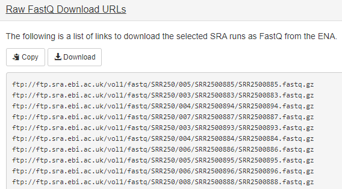
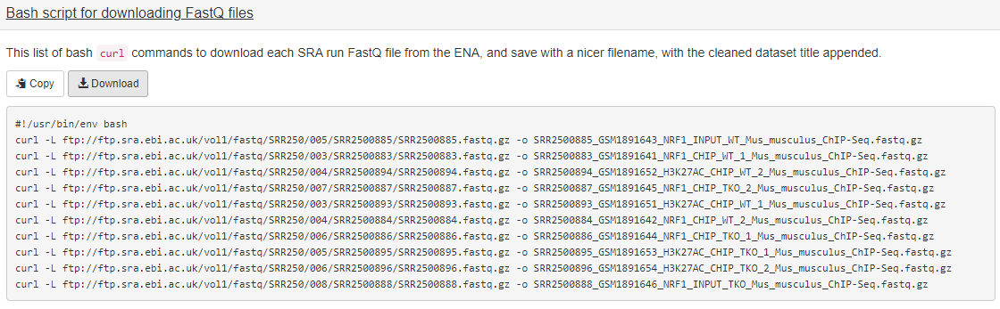
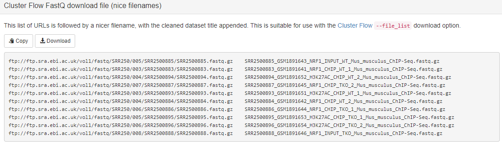
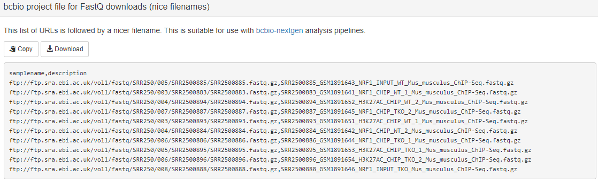
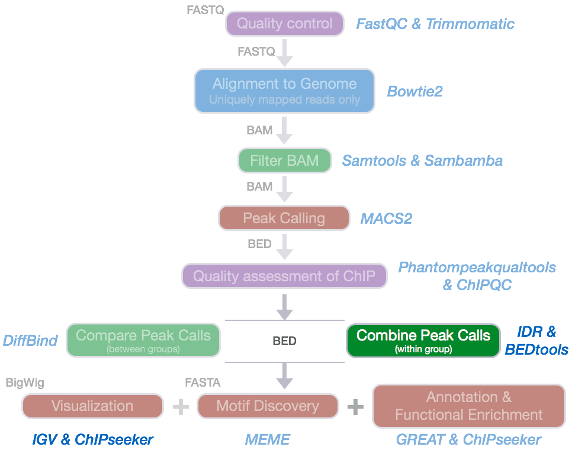
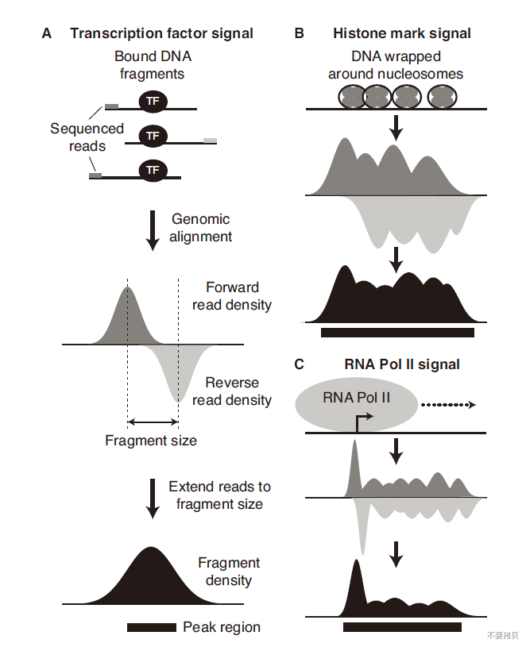
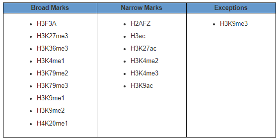

# ChIP-seq与ATAC-seq：从富集信号到差异分析 {#sec-ch06}

## 本章提要 {#chapter-summary-06 .unnumbered}

本章把 ChIP-seq 与 ATAC-seq 放在共同的区域信号分析框架中，同时分别说明实验对照、预处理和质量评价。内容从蛋白结合、组蛋白修饰与染色质可及性开始，经过 peak calling、重复一致性和统一区域的构建，进入差异结合或差异可及性分析，最后学习注释、motif 与图形展示。阅读时要结合各自的实验背景解释结果，并把质量控制、统计比较和生物学解释连接起来。

## 蛋白结合、组蛋白修饰与染色质可及性 {#sec-06-01}

区分三类信号的生物学含义。

### ChIP-Seq和ATAC-Seq数据分析 {#src-0060-ChIP-seq-20}

[]{#ChIP_seq}


### ChIP-seq 简介 {#src-0060-ChIP-seq-22}

**ChIP-seq** (Chromatin immunoprecipitation followed by high-throughput sequencing) 即染色质免疫共沉淀高通量测序技术，把 **ChIP** 实验技术与第二代高通量测序技术相结合，可以用来寻找全基因组上检测与组蛋白、转录因子等互作的 DNA 区域，也就是我们常说的我感兴趣的转录因子在全基因组上结合在哪些区域、组蛋白修饰在全基因组上富集在哪些区域。这个方法有助于我们深入了解转录调控机制。

#### ChIP-seq 实验 {#src-0060-ChIP-seq-26}

下一代高通量测序技术（next-generation sequencing, NGS）自 `2005` 年 **454 公司**首次推出第一款高通量测序仪**454 Genome Sequencers** [1, 2] 开始，一直是一个快速发展的领域，产生了一系列可用的文库构建流程和测序技术，将基因组水平的研究带入一个新的发展阶段。常用的高通量平台包括 `Illumina 公司的 Solexa 测序仪` , `Roche 公司的 454 测序仪` , `SOLID 公司的 (ABI)` 以及 `Thermo Fisher` 公司旗下的子公司 `Life Technologies` 的 `Ion Torrent的测序技术` 以及 `Pacific Biosciences` 公司的 `SMRT (DNA单分子实时测序技术)` 和 `Oxford Nanopore Technologies` 公司的`纳米孔单分子测序技术`（详情见 [2019-浅谈基因测序技术的发展及其在肿瘤中的应用](http://libproxy.hzau.edu.cn/rwt/CNKI/http/NNYHGLUDN3WXTLUPMW4A/KXReader/Detail?TIMESTAMP=637247240431171250&DBCODE=CJFQ&TABLEName=CJFDLAST2019&FileName=ZJTY201902090&RESULT=1&SIGN=dpZRZloduk0HVtKvSKWdjrojUNE%3d)）。这些技术在测序概念、通量和运行时间、获得的序列信息的长度和错误率等方面有所不同（详情见 [2015-High-Throughput Sequencing Technologies](https://www.ncbi.nlm.nih.gov/pmc/articles/PMC4494749/)）。

 `ChIP-seq` 是一项基于 [免疫沉淀（IP)](https://www.thermofisher.com/cn/zh/home/life-science/protein-biology/protein-biology-learning-center/protein-biology-resource-library/pierce-protein-methods/immunoprecipitation-ip.html) 的实验，利用高通量测序技术对一群细胞进行`免疫沉淀`鉴定全基因组上蛋白的结合位点（图 1）[8]，此项技术最早于 2007 年公开报道[3,4,5,6]。这里我们描述了最广泛使用 `Illumina` 测序平台的流程。流程使用与其他平台是相似的，但在文库的构建和测序步骤上略有不同。


{#fig-07-chip-seq-and-atac-seq-001}


> 图一

简要来说主要包括以下四个步骤：

1. **甲醛交联**：首先将染色质结合的蛋白质与 DNA 通过甲醛交联，从而可以得到蛋白质-DNA 复合物。为什么要做这一步呢？我们要研究蛋白与 DNA 之间的关系， 我们得保持他们当前的状态；不同物种、不同组织、不同细胞类型的交联时间都是不同的，只有恰当的交联的时间才能保证后续实验的顺利进行，交联时间太短，导致蛋白质-DNA聚合物松散；交联时间过长会导致蛋白质-DNA聚合物紧密，导致后面片段化十分困难、解交联麻烦等。
2. **获得染色质：**通过超声波将其随机打断或者酶解成一定长度范围内的染色质小片段（一般为 200-600 bp 左右）。因为我们当前二代测序的片段长度有限，所以一般选择打断在 200-600bp。
3. **免疫沉淀**：接下来，通过特异性抗体免疫沉淀出目标蛋白质-DNA 复合体，然后解交联，从而特异性地富集与目标蛋白结合的 DNA 片段。通过对目标蛋白的纯化与检测，选择特定长度的DNA片段，最后进行建库测序。
4. **文库准备：**测序文库的准备包括 `DNA 末端修复`、`测序接头的连接`。在复杂的情况下，比如在流式细胞仪上的同一个 `lane` 上运行多个样本。为了获得足够的测序量，对连接产物进行纯化和 PCR 扩增。PCR 扩增是产生 `bias` 的来源，因此 PCR 循环的次数应保持在最低限度。然后将文库加载到流式细胞仪上并进行测序。
5. **测序：** 打断的 DNA 片段的测序总是沿着 `5'-3'` 的方向进行。正向和反向接头被随机连接到双链 DNA 片段的两端。单端测序从正向接头或反向接头开始，而双端测序从两端开始。`reads` 的长度通常短于共孵育 DNA片段，因此只有片段末端被测序。

#### ChIP-seq 技术革新 {#src-0060-ChIP-seq-44}


##### CUT&RUN {#src-0060-ChIP-seq-46}

**CUT&RUN** （**Cleavage Under Targets and Release Using Nuclease**）是研究 DNA-蛋白质互作的一项革命性技术，无需用甲醛进行交联和免疫共沉淀。在这种方法中，初代使用**与 Protein A 结合的微球菌核酸酶**与所选择的抗体结合，并立即切割相邻的 DNA，然后释放与抗体靶向结合的 DNA，回收的 DNA 片段可直接进行 ChIP-qPCR 或者二代测序。该过程在原位进行，避免交联和增溶问题，减少了背景噪音，从而使得使用少量细胞在保证测序质量的前提下测序深度为平常 ChIP-seq 所需测序深度的十分之一。由于微球菌核酸酶激活时细胞核是完整的，CUT&RUN 可以检测目标位点周围的局部环境，使得 CUT&RUN 还能检测到转录因子的长距离 3D 互作位点。


{#fig-07-chip-seq-and-atac-seq-002}


::: {.callout-note title="待完善" collapse="true"}
补ATAC和相关技术比较，不把不同实验混成同一信号。
:::

## 实验对照、重复与主案例设计 {#sec-06-02}

建立适当背景和可比较的样本组。

### ChIP-seq 实验设计 {#src-0060-ChIP-seq-52}


#### ChIP-seq对照的设计 {#src-0060-ChIP-seq-54}

为了准确地识别 ChIP-seq 样本中的富集区域，需要将 reads 分布与背景分布（即在进行抗体孵育之前的 DNA）进行比较，以控制潜在的偏差。ChIP-seq 实验最好的对照是在抗体孵育步骤之前对从打断后的染色质中纯化的 Input DNA 进行序列测定。其他`对照`可以使用不同的策略进行准备: 模拟 `IP` 遵循 `ChIP-seq` 实验流程的所有步骤，但不使用任何抗体。`非特异性 IP` 可以通过使用不与染色质结合的蛋白质的抗体来实现，比如：`免疫球蛋白G` (IgG)。然而，这两种方法都可以得到少量的低复杂度的共纯化DNA，而这并不能反映真实的背景分布。在研究`组蛋白修饰`时，一种能识别 `H3` 或 `H4` 的 `H3 泛抗体`或 `H4 泛抗体`是一种很好的选择, 因为捕获修饰时候同时捕获了潜在核小体分布。

#### `bias` 的来源 {#src-0060-ChIP-seq-58}

`input` 样本是控制一些可能导致某些区域丰度异常高的 `biases` 所必需的。可能最重要的 `bias` 来源是在超声或消化过程中染色质的不均匀打断。致密的异染色质区是很难剪切的，并且与开放的常色质区域相比，即使在 `input` 样本中，也变得捕捉的量不足 。染色质的紧密的影响是线性的，例如：染色质越开放，文库中能捕捉到的量越高。此外，PCR 扩增产生的不均匀片段和 `bias` 将导致富含 GC 序列的过度表达。同样，背景分布将与基因组的 GC 含量呈正相关。这在哺乳动物细胞中尤为普遍，因为常染色质区被富集 `CpG 岛`。因此，在比较 `CpG` 富集的地区与其他拥有较少 `CpGs` 的区域时，应考虑到这一点。

`bias` 的另一个来源是对数据的计算处理过程。在基因组回比步骤，只有唯一比对上的 reads 才保留下来进行后续分析，导致在重复区域低覆盖度。最后，`在癌症样品和细胞系中，基因组与参考基因组有很大的不同`。在所研究的细胞系中被删除的区域将显示为缺失，而重复或扩增的区域会产生更多的 `reads`，并且看起来更富集。

为了解释这些 `biases`，将一个 ChIP-seq (或至少一组重复)与对照样本进行比较是至关重要的，对照样本将用于在 `Peak calling` 步骤中控制潜在的假阳性 `Peak` 。

#### 抗体质量 {#src-0060-ChIP-seq-66}

由于 `ChIP-seq` 是一种基于抗体的免疫沉淀实验，其效率很大程度上取决于抗体的质量和特异性。因此选择一个好的抗体是至关重要的。例如，之前有报道说，大约三分之一的商业 ChIP-seq 抗体对组蛋白修饰不起作用。此外，同一蛋白质的单个抗体可能识别不同的表位，这些表位可能根据基因组位置的不同而暴露在不同的表位上（尤其是单克隆抗体）。例如，一种特定于某因子的抗体可能检测富集在启动子区，而另一种针对同一因子的抗体也可能检测富集在基因间间区。因此，建议对同一种蛋白的几种抗体进行检测并验证其特异性，例如，在 `Western blot` 分析中通过 `knock-out` 和 `knock-down` 来验证它们的特异性。

#### 测序深度 {#src-0060-ChIP-seq-70}

为了在实验中捕获所有真正的结合位点，测序的 `reads` 数量是一个决定因素。所需的 `reads` 数取决于基因组的大小和感兴趣因子的结合模式（转录因子的窄峰和组蛋白修饰的宽峰）。这两个参数共同定义了基因组的有效大小，例如，需要覆盖的碱基对 (bp) 的数量。它还取决于 `Peak calling` 的灵敏度: 为了确定最高富集的峰(`input` > 30x)，大约三分之一的 `reads` 就足够了。一旦对样本进行测序，`饱和度分析`就可以显示是否在给定数量的`回比上的 reads` 下在样本中所有的的 `Peak是否`都被鉴定到。在黑腹果蝇中，转录因子和组蛋白修饰表明，在 1600万(`16 M`) 左右的 `reads` 处达到饱和 ；相反，在哺乳动物中，转录因子至少需要 `30M reads`，组蛋白修饰需要最少 `60M reads`。`Input` 样本需要测序至少和 `ChIP` 样本一样深，因为在这种情况下，也是需要覆盖整个基因组。

#### 测序片段的长度与测序方式 {#src-0060-ChIP-seq-74}

测序 reads 相关的决定因素的是 reads 长度和单端或双端测序。单端和双端 reads 是从随机连接到 DNA 片段两端的一个或两个接头测序的结果。在大多数 ChIP-seq 研究中，reads 长度和测序类型不是关键的考虑因素，而目前标准的 `50-nt 单端测序`足以捕捉推断结合位点所需的大部分信息。通常，较长或双末端 reads 都有更高的机会唯一地回比到基因组，即使在轻微重复的区域也是如此。因此，可以覆盖更大比例的基因组，并且在比对过程中过滤掉较少的 reads。如果该因子被期望结合重复区域，建议使用尽可能长的 reads 和双末端测序。如果 reads 范围超出重复区域，这将增加进行唯一比对的几率。然而，重复区域仍然很难研究，即使是较长的或双末端 reads，它所带来的成本增加可能不会随着预期产量的增加而扩大。

#### 样品重复的设置 {#src-0060-ChIP-seq-78}

重复样本可以呈现不同水平的变异。技术重复的范围从重新测序文库到在同一细胞培养的重复中进行 ChIP-seq。然而，为了评估生物的变异性和获得对已确定的结合区的置信度，`ChIP-seq 实验应该用生物学重复`（不同的细胞培养物或个体）。一般来说，建议至少重复三次，以获得合理可靠的结果，并强制统计模型成立（尽管许多模型已经适应了只有两次可用重复的情况）。对于每个条件，最低要求是对 ChIP 进行两次重复，对相应的 `input` 进行一次重复。如果数据要表现出很高的内在变异性，可能需要更多的重复，例如：当取自不同个体的样本时。

#### 数据的下载 {#src-0060-ChIP-seq-229}

我们需要下载的示例数据集为文章 [Competition between DNA methylation and transcription factors determines bind- ing of NRF1.](https://www.nature.com/articles/nature16462) 中的，都为单端测序。

| Sample name        | GEO ID     | SRA ID     | raw reads  |
| ------------------ | ---------- | ---------- | ---------- |
| NRF1_CHIP_WT1      | GSM1891641 | SRR2500883 | 40,570,927 |
| NRF1_CHIP_WT_2     | GSM1891642 | SRR2500884 | 40,365,286 |
| H3K27AC_CHIP_WT1   | GSM1891651 | SRR2500893 | 41,972,346 |
| H3K27AC_CHIP_WT2   | GSM1891652 | SRR2500894 | 40,822,025 |
| NRF1_INPUT_WT      | GSM1891643 | SRR2500885 | 22,773,779 |
| NRF1_CHIP_TKO_1    | GSM1891644 | SRR2500886 | 32,306,980 |
| NRF1_CHIP_TKO_2    | GSM1891645 | SRR2500887 | 45,342,909 |
| H3K27AC_CHIP_TKO_1 | GSM1891653 | SRR2500895 | 50,829,570 |
| H3K27AC_CHIP_TKO_2 | GSM1891654 | SRR2500896 | 45,485,455 |
| NRF1_INPUT_TKO     | GSM1891646 | SRR2500888 | 24,937,026 |

这些数据被用来测试`转录因子结合对 DNA 甲基化`的敏感性，例如：测试 DNA 甲基化是否影响转录因子的结合。其基本假设是，如果在正常 `WT` 细胞中，一些转录因子在 DNA 甲基化时不能结合，那么在去除了甲基化的 `TKO细胞`时，就会出现新的结合位点。通过使用 `DNase-seq` 分析开放的染色质区域，与 WT 相比，我们可以确定 TKO 细胞中获得转录因子结合的新区域。`MOtif` 分析确定 `NRF1` 是对DNA甲基化敏感的潜在候选分子，我们在 WT 和 TKO 细胞中用 NRF1 的ChIP-seq 验证了这一点。

这里我们推荐一个在线网站：[SRA Explorer](https://sra-explorer.info/#)（https://sra-explorer.info/#），我们可以直接输入 `GSE30567`, `SRP043510`, `PRJEB8073`, `ERP009109` or `human liver miRNA` 这些信息来获取我们的数据链接。具体细节这里不做展示，大家可以自己去实践。

当我们将上面十个 SRR 号输入后，我们会得到下面几种结果：


{#fig-07-chip-seq-and-atac-seq-004}


可以清楚的看到，结果有好几种下载方式的链接或者命令。

- #### [Raw FastQ Download URLs](https://sra-explorer.info/#fastqURLs)：纯粹的下载 FASTQ 的链接。


{#fig-07-chip-seq-and-atac-seq-005}


- #### [Bash script for downloading FastQ files](https://sra-explorer.info/#fastqURLs_bashCURL) ：通过软件 curl 来下载的命令。


{#fig-07-chip-seq-and-atac-seq-006}


- #### [Aspera commands for downloading FastQ files](https://sra-explorer.info/#fastqURLs_aspera)：通过软件 Aspera 来下载的命令。

> 这里有几个选项：
>
> 1、如果你是基于 linux 那么你得选择 linux，如果你是基于 OSX 系统那么就得选择这个
>
> 2、如果你想下载完后重新命令那么选择 Append `mv` command to rename downloaded files ，反之选择 Don't rename files。


{#fig-07-chip-seq-and-atac-seq-007}


- #### [Cluster Flow FastQ download file (nice filenames)](https://sra-explorer.info/#fastqURLs_niceNames)：将会输出链接以及对应的名称


{#fig-07-chip-seq-and-atac-seq-008}


- #### [bcbio project file for FastQ downloads (nice filenames)](https://sra-explorer.info/#fastqURLs_bcbio) 


{#fig-07-chip-seq-and-atac-seq-009}


当然，你也可以下载 SRA 或者其他格式文件，但是我们一般需求都是从 FASTQ 开始。

下面我们开始下载本次所需数据，创建`01_down.sh` 脚本文件，然后运行 `bash 01_down.sh` （非并行，花了 40 分钟左右）即可。

```bash
#!/usr/bin/env bash
ascp -QT -l 300m -P33001 -i $HOME/.aspera/connect/etc/asperaweb_id_dsa.openssh era-fasp@fasp.sra.ebi.ac.uk:vol1/fastq/SRR250/005/SRR2500885/SRR2500885.fastq.gz .
ascp -QT -l 300m -P33001 -i $HOME/.aspera/connect/etc/asperaweb_id_dsa.openssh era-fasp@fasp.sra.ebi.ac.uk:vol1/fastq/SRR250/003/SRR2500883/SRR2500883.fastq.gz .
ascp -QT -l 300m -P33001 -i $HOME/.aspera/connect/etc/asperaweb_id_dsa.openssh era-fasp@fasp.sra.ebi.ac.uk:vol1/fastq/SRR250/004/SRR2500894/SRR2500894.fastq.gz .
ascp -QT -l 300m -P33001 -i $HOME/.aspera/connect/etc/asperaweb_id_dsa.openssh era-fasp@fasp.sra.ebi.ac.uk:vol1/fastq/SRR250/007/SRR2500887/SRR2500887.fastq.gz .
ascp -QT -l 300m -P33001 -i $HOME/.aspera/connect/etc/asperaweb_id_dsa.openssh era-fasp@fasp.sra.ebi.ac.uk:vol1/fastq/SRR250/003/SRR2500893/SRR2500893.fastq.gz .
ascp -QT -l 300m -P33001 -i $HOME/.aspera/connect/etc/asperaweb_id_dsa.openssh era-fasp@fasp.sra.ebi.ac.uk:vol1/fastq/SRR250/004/SRR2500884/SRR2500884.fastq.gz .
ascp -QT -l 300m -P33001 -i $HOME/.aspera/connect/etc/asperaweb_id_dsa.openssh era-fasp@fasp.sra.ebi.ac.uk:vol1/fastq/SRR250/006/SRR2500886/SRR2500886.fastq.gz .
ascp -QT -l 300m -P33001 -i $HOME/.aspera/connect/etc/asperaweb_id_dsa.openssh era-fasp@fasp.sra.ebi.ac.uk:vol1/fastq/SRR250/005/SRR2500895/SRR2500895.fastq.gz .
ascp -QT -l 300m -P33001 -i $HOME/.aspera/connect/etc/asperaweb_id_dsa.openssh era-fasp@fasp.sra.ebi.ac.uk:vol1/fastq/SRR250/006/SRR2500896/SRR2500896.fastq.gz .
ascp -QT -l 300m -P33001 -i $HOME/.aspera/connect/etc/asperaweb_id_dsa.openssh era-fasp@fasp.sra.ebi.ac.uk:vol1/fastq/SRR250/008/SRR2500888/SRR2500888.fastq.gz .
```

到这里我们可以看到前面这一部分都是相同的 `ftp://ftp.sra.ebi.ac.uk/vol1/fastq/SRR250/`，然后接下来都是 `SRR` 号的最后一位数字即 `00+SRR号最后一位`，然后就是 `SRR号/SRR号.fastq.gz`。

```bash
#!/usr/bin/env bash

cat `cut -f1 SRR.list`|while read id;
do
    ascp -QT -l 300m -P33001 -i ~/.aspera/connect/etc/asperaweb_id_dsa.openssh era-fasp@fasp.sra.ebi.ac.uk:/vol1/fastq/${id:0:6}/00${id:0-1}/$id/${id}.fastq.gz ./
done
```

::: {.callout-note title="待完善" collapse="true"}
补齐样本表、数据对应关系和两个案例的学习任务。
:::

## ChIP-seq预处理与质量评估 {#sec-06-03}

判断富集信号是否足以支持peak与差异分析。

### ChIP-seq 数据分析流程 {#src-0060-ChIP-seq-82}

ChIP-seq 数据分析包括几个步骤（图 1.1B）。

得到原始序列文件后的第一步是执行标准的高通量数据质量控制。

1. 这一步确保数据质量高：没有污染以及文库复杂度高（见 [3.7 节](03-sequencing-technologies.md#sec-03-07)与 [4.7 节](04-sequence-alignment.md#sec-04-07)）。
2. 原始的 reads 回比到研究物种的参考基因组上（见[第 4 章](04-sequence-alignment.md)）。
3. 随后可进行特异性 ChIP-seq 的质量控制，检查 ChIP-seq 样品中的富集情况，并排除过度碎片（见本章 [6.3 节](#sec-06-03)）。
4. 接下来是 ChIP-seq 分析的核心，鉴定全基因上感兴趣的因子富集的区域，也叫 `Peak calling`（见 [6.4 节](#sec-06-04)）。
5. 一旦确定了峰值区域，还可以评估需要峰值位置的特定 ChIP-seq 的质量控制措施（见 [6.3 节](#sec-06-03)）。
6. 还有几乎每一步都需要涉及的数据可视化（见 [6.8 节](#sec-06-08)）。
7. 尤其重要的是，在 `Peak calling` 之后，要确保预测的峰值准确地捕捉到结合模型。`Peak calling` 后的分析取决于实验设计与生物学问题。
8. 比如，如果在实验中有重复或多个条件下，那么下一步可能是样本之间的比较（见 [6.6 节](#sec-06-06)与 [6.7 节](#sec-06-07)）。

生物学重复将提供有关数据中的重现性和内在生物和技术变异性的信息。差异结合分析解决了哪一 `Peak` 区域在两种情况下显示出明显不同的丰度（例如：与观察到的相同条件的重复之间的变化相比，差异比预期的要大得多）。最后，`Peak` 区间或差异 `Peak` 可以被用来做各种下游分析，比如`基因组注释`、`GO分析`、`Pathway 分析`、`motif 查找`、`与其他基因组数据联合分析`。


{#fig-07-chip-seq-and-atac-seq-003}


#### 代码运行环境的准备 {#src-0060-ChIP-seq-100}

```bash
mkdir bio_soft
cd bio_soft
mkdir my_soft  # 用于保存可执行文件

# 安装 conda 
# 官方链接：https://docs.conda.io/en/latest/
# For the installers "Anaconda" and "Miniconda," the default is 2.7.
# For the installers "Anaconda3" or "Miniconda3," the default is 3.7

wget -c https://repo.anaconda.com/miniconda/Miniconda3-latest-Linux-x86_64.sh
bash Miniconda3-latest-Linux-x86_64.sh
# 然后 source 环境变量 .bashrc 文件，使其生效
source ~/.bashrc

# 运行以下命令，使 conda 不自动激活 base 环境，因为我们自己环境还有不急于 conda 的
conda config --set auto_activate_base false

# 运行以下命令，可以看到是有一个叫做 base 的环境的
conda env list 

# 添加镜像源
# 将清华源官方链接中的信息添加到 .condarc 中
# https://mirror.tuna.tsinghua.edu.cn/help/anaconda/

# 安装下载数据软件 aspera，此不基于 conda 安装
wget https://download.asperasoft.com/download/sw/connect/3.9.8/ibm-aspera-connect-3.9.8.176272-linux-g2.12-64.tar.gz 
tar -xvf ibm-aspera-connect-3.9.8.176272-linux-g2.12-64.tar.gz
bash ibm-aspera-connect-3.9.8.176272-linux-g2.12-64.sh
echo 'export PATH=$PATH:~/.aspera/connect/bin/' >> ~/.bashrc # add to .bashrc env 
source ~/.bashrc

# 安装 SRAtools
# https://github.com/ncbi/sra-tools/wiki/02.-Installing-SRA-Toolkit
# https://ftp-trace.ncbi.nlm.nih.gov/sra/sdk/current/
wget --output-document sratoolkit.tar.gz http://ftp-trace.ncbi.nlm.nih.gov/sra/sdk/current/sratoolkit.current-centos_linux64.tar.gz
tar -xvf sratoolkit.tar.gz
echo "PATH=$PATH:~/bio_soft/sratoolkit.2.10.5-centos_linux64/bin" >> ~/.bashrc
source ~/.bashrc

# 安装 FASTQC，质检 FASTQ 文件用
# https://www.bioinformatics.babraham.ac.uk/projects/download.html
wget https://www.bioinformatics.babraham.ac.uk/projects/fastqc/fastqc_v0.11.9.zip
unzip fastqc_v0.11.9.zip
chmod 755 fastqc
ln -s ~/bio_soft/FastQC/fastqc ~/bio_soft/my_soft/fastqc # 软链接到专门管理可执行文件夹中
source ~/.bashrc

# 安装 MultiQC，汇总所有质检结果
# https://multiqc.info/docs/
conda install -c bioconda -c conda-forge multiqc
ln -s /miniconda3/envs/ChIP_seq/bin/multiqc ~/bio_soft/my_soft/multiqc


# 安装 fastp
# https://github.com/OpenGene/fastp
wget http://opengene.org/fastp/fastp
chmod a+x ./fastp
echo 'PATH=$PATH:~/bio_soft/my_soft'  >> ~/.bashrc
source ~/.bashrc

# 安装 bowtie2
## 第一种
conda install -c bioconda bowtie2

## 第二种
wget https://github.com/BenLangmead/bowtie2/releases/download/v2.4.1/bowtie2-2.4.1-linux-x86_64.zip

unzip bowtie2-2.4.1-linux-x86_64.zip 
echo "PATH=$PATH:~/bio_soft/bowtie2-2.4.1-linux-x86_64" >> ~/.bashrc
source ~/.bashrc

# 安装 htslib
wget https://github.com/samtools/htslib/archive/1.10.2.zip
unzip 1.10.2.zip
mkdir htslib.1.10.2
cd htslib-1.10.2
autoheader
autoconf
./configure --prefix=/public/home/xrzhang/bio_soft/htslib.1.10.2
make
make install
echo "PATH=$PATH:~/bio_soft/htslib.1.10.2/bin" >> ~/.bashrc

# 安装 samtools 1.10 版本
## 第一种
conda install -c bioconda samtools

## 第二种
## https://www.htslib.org/download/
## samtools 说明书 http://www.htslib.org/doc/samtools.html
wget https://github.com/samtools/samtools/releases/download/1.10/samtools-1.10.tar.bz2
tar -jxvf samtools-1.10.tar.bz2
mkdir samtools.1.10
cd samtools-1.10
./configure --prefix=/public/home/xrzhang/bio_soft/samtools.1.10
make 
make install
echo "PATH=$PATH:~/bio_soft/samtools.1.10/bin" >> ~/.bashrc
source ~/.bashrc

# 安装 bedtools 2.29.1 版本
## https://bedtools.readthedocs.io/en/latest/content/installation.html
wget https://github.com/arq5x/bedtools2/releases/download/v2.29.1/bedtools-2.29.1.tar.gz
tar -xvf bedtools-2.29.1.tar.gz 
cd bedtools2/
make
echo "PATH=$PATH:~/bio_soft/bedtools2/bin" >> ~/.bashrc
source ~/.bashrc


# 安装 Picard
## 第一种
conda install -c bioconda picard

## 第二种
wget https://github.com/broadinstitute/picard/releases/download/2.23.0/picard.jar
# 以后移动到自己常用的 bin 目录下
java -jar picard.jar -h

# 创建我们此次所需要的环境
conda create -n ChIP_seq python=3.7 

conda activate ChIP_seq
conda install 
```

#### 数据质控 {#src-0060-ChIP-seq-311}

由于我们测序下机刚得到的数据是含有接头序列，且碱基质量层次不齐，这会在很大程度上影响我们后续回比到基因上的过程，会导致回比率偏低等问题。所以我们一般在拿到数据后查看完质量后，就需要进行一定的修剪和过滤。在此部分将会陈述我们需要注意哪些质控的标准以及怎么去过滤。

一些软件为高通量测序数据提供了易于操作的质量控制。`FastQC` 是最常用的工具之一，它可以在 `FASTQ` 和其他来自多个测序平台的文件格式上运行。其他工具为数据处理提供了额外的功能，比如：`NGS QC Toolkit`（ 见 ref3 ）和 `fastx-toolkit` （[hannonlab.cshl.edu/fastx_toolkit/](http://hannonlab.cshl.edu/fastx_toolkit/)） 。

##### 使用FastQC对测序进行评估 {#src-0060-ChIP-seq-317}

与之前章节内容类似，我们这次再次强调FastQC是为了突出一些和ChIP-Seq数据分析有关的质量报告内容，读者灵活掌握即可。

- **每个位点的测序质量** 在许多测序 `runs` 中，由于测序化学的逐步降解，碱基识别（ `base calling` ）精度随着循环次数的增加而下降。此外，在第一个循环中也会出现轻微的质量下降和运行过程中的瞬时波动。这种系统的质量变化可以从每个测序周期的 `Q 值` 分布中看到。如果 `50%` 的 reads 显示 `Q < 25` ( 或在 `Q < 10` 占10%)，FastQC 会发出警告，表明基于质量的读数修整是值得推荐的。在本文中可以看到数据质量这部分是没有问题的，可能是上传的非原始下机数据而是过滤后的数据。

- **每个位点的碱基成分** 在 ChIP-seq 流程中，DNA 被打断成随机的片段。因此，核苷酸的组成在整个过程中应该是恒定的（ 图 3.1B ）。由于两条链的测序概率相等，G 和 C 将同等丰度，但将根据基因组的 GC 含量与 A 和 T 分开。

> 注意：不同的测序类型这部分并不是绝对的，也就是并非所有得到测序得到的 FASTQ 文件这部分都是 AT 重合、GC 重合的。比如在 DNA 甲基化测序这种对碱基处理后的 WGBS 这部分是不一样的，这里不予详细讨论。

- **每条 reads 的平均 GC 含量** 在一个复杂的 ChIP-seq 文库中，reads 是从大量富集的DNA片段中随机取样的。因此，每条 reads 的 GC 含量分布应成正态分布。偏差表示 reads 的 `biased` 或来自不同 `GC` 含量的有机体的污染。当针对接头序列进行过滤时，其中一些偏差会得到解决。

> 注意：富集的 DNA 片段反映了所研究的转录因子（ TF ）或组蛋白修饰的序列特异性。因此，在某些情况下，GC 含量可能会偏离均匀分布。例如：如果 TF 结合在 CpG岛 或低复杂性区域，如端粒。

- **其他质量指标** 在复杂的 ChIP-seq 文库中，大多数富集片段将是唯一的。高水平的重复 （ 即相同的高通量测序 reads ）表明存在富集偏差，例如由于起始物质数量不足而导致的 PCR 过度扩增。过量的自由引物表明，在文库准 备过程中，这些引物没有被有效地去除（见 **章节 1.1** ）。在此例中我们结合 CD 两图可以猜测 D 图中原始数据中的 GC 含量分布的异常很有可能是图 C 中过表达序列引起的，当我们修剪和过滤后，可以看到当没有过表达序列时候，GC 含量分布是正常的。
- 此外，如果 DNA 片段短于 reads 长度，则用于测序的接头将出现在 reads 上。由于 DNA 片段的平均长度为 200 bp，在短 reads 中接头应基本不存在，但在较长 reads 时，接头应开始出现在位置 70-100 bp 附近。在早期的测序周期中接头的高含量表明了文库的过度碎片化。默认情况下，FastQC 将搜索几个常用的 `Illumina` 接头。用户也可以提供自定义接头序列。

```bash
#!/usr/bin/env bash

# cd data
mkdir QC
ls *gz | xargs fastqc -t 10 -q -o QC 

cd QC
multiqc .
```

##### 根据报告对数据进行修剪和过滤 {#src-0060-ChIP-seq-345}

接下来，含有过度的接头序列和低质量的碱基将被过滤掉。这可以通过完全删除相应的 reads 来实现，从而在整个数据集中保持相等的读取长度，或者通过修剪它们来实现。

> 注意：对于样本的比较，样本具有相同的  reads 长度是很重要的。不同的 reads 长度意味着基因组的可回比的比例不同，这在比较分析中可能导致人为现象。

###### 接头的去除 {#src-0060-ChIP-seq-351}

- 如果富集的 DNA 片段小于 read 长度，则高通量测序 reads 将延伸到下游接头。由于所包含的接头序列将影响基因组比对，它们需要在基因组比对之前删除。
- 接头匹配的严格性依赖于几个参数，包括所需的最小重叠和最大错配。此步骤的低严格性可确保检测到大多数接头。不同的匹配模式指定在 reads 中允许的接头位置以及哪部分需要被去除。

###### 低质量的修剪 {#src-0060-ChIP-seq-356}

- reads 中的低质量序列可能会影响其基因组比对。大多数 reads 长度较短的 ChIP-seq 数据集不需要低质量的修剪。然而，如果在质检中大量的质量 `drop` 是可见的，reads 应该进行修剪或丢弃。
- 删除低质量序列的一种常见方法是在 Q 值低于给定阈值的第一个位置修剪每个 reads 的内容（通常 Q < 20）。或者，可以容忍单个低质量的位置，这样，只有当滑动窗口中的平均 Q 值低于给定阈值时，才会修剪 reads。
- 作为另一种选择，数据集中的所有 reads 都可以在低质量序列开始成簇出现之前的某一点上进行剪切。这避免了 reads 长度的差异，并允许集成具有不同测序长度的 ChIP-seq 数据集（比如在比较 50nt 和 100nt reads 时候，所有的 reads 应该都被修剪为 50nt）。

- 建议始终在修剪数据集上重新运行 FastQC 。此外，大多数工具返回修剪的 reads 数、删除的核苷酸和删除的 reads 。如果数据集之间出现很大的差异，则应重新检查样本的质量。如有必要，应调整修剪参数以使采样尽可能具有可比性。

- 质量修剪和过滤的常用工具是 **`Trim Galore`**、**`FLEXBAR`**、**`Trimmomatic`**、**`fastp`** 。

**fastp 过滤**

这里我们将用 fastp 来进行数据过滤。fastp 是基于 C++ 开发的，使用高效算法，且支持多线程，具有丰富的功能的软件。根据 reads 质量、长度过滤，自动查找并裁剪接头序列、对 reads 进行滑动质量裁剪、对双端数据进行碱基校正、分子标签 UMI 处理等。

```bash
#!/usr/bin/env bash

# mkdir clean_data
cd data

ls *gz | while read id;
do
  out=${id%%.*}
  fastp --thread 10 -i $id -o ../clean_data/${out}_clean.fastq.gz -h ../clean_data/${out}.html	 
done
```

> bsub -J fastp -n 10 -R span[hosts=1] -o %J.out -e %J.err -q normal "bash 03_trim.sh"

速度很快，参数也基本不需要改变。


{#fig-07-chip-seq-and-atac-seq-010}


fastp 也可以自动生成全自动的人性化报告，但是为了前后更好的对比，这里仍然使用 FASTQC 进行再一次质检。

```bash
#!/usr/bin/env bash

# cd clean_data
mkdir QC
ls *gz | xargs fastqc -t 10 -q -o QC 
multiqc .
```


{#fig-07-chip-seq-and-atac-seq-011}


FASTQC 质检结果。（A）测序 reads 每个位点的碱基质量值 Q 的分布。箱式图的上下须分别表示 10% 和 90%。背景颜色绿色、黄色、红色依次代表质量好、可接受、差。（B）测序 reads 每个位点的 ATCG 碱基的相对百分比折线图。（C）表示测序 reads 中是否有过表达序列，左边表示原始数据中的情况，右边表示进行修剪和过滤后的情况。（D）表示文库中所有 reads 的 GC 含量分布，蓝色表示预期的 GC 含量分布呈正态分布，红色表示文库中的 GC 含量分布情况。左边表示未修剪和过滤前，右边表示修剪和过滤后。

#### 序列比对 {#src-0060-ChIP-seq-404}

**高通量测序回比到参考基因组上确定了共纯化的 DNA 片段的来源。**本节介绍参数设置的不同对比概念和注意事项，以及评估比对质量的措施。

基因组回比的目标是找到参考基因组中高通量测序 reads 的最可能的来源。除了大的基因组和大量的 reads，还因为 reads 和参考序列之间可能存在的不匹配而变得更加复杂。这些序列偏差可能是由于产生高通量测序 reads 过程中的扩增或测序错误引起的，也可能是由于参考基因组水平上的基因组变异或错误造成的。

##### 比对概念 {#src-0060-ChIP-seq-409}

由于 ChIP-seq reads 是直接从 DNA 片段衍生的，所以数据通常用连续短 read 比对软件比对。这些比对算法中的许多都采用了 “种子扩展 **seed-and-extend**” 的方法。在第一步中，该算法识别 **k-mer** 种子，即指定长度的 reads 片段，这些片段精确地映射到基因组中的给定位置（ `ref1` ）。依赖于算法，种子匹配必须是精确的，或者可以容忍一定数量的错配。在第二步中，使用动态规划在两个方向上扩展种子，以达到无间隙的最大可映射长度，并最终生成完全比对。

基于概念上的差异，可用的算法在比对准确性（ 灵敏度和精度 ）以及计算性能（ 运行时间和内存 ）方面有所不同。差异还受种子长度选择的影响，较短的种子可提高敏感性，而较长的种子可使搜索速度更快。

大多数算法分配一个质量分数来估计获得的比对的准确性（见第 4.2.4 节）。在某些情况下，此分数考虑到 reads 的碱基识别准确性（ 即 FASTQ 文件中的 Q 值）中来衡量错配。

##### 常用工具 {#src-0060-ChIP-seq-417}

目前常见的 ChIP-seq 比对工具主要为：Bowtie、Bowtie2、BWA。Bowtie2 和 BWA 能够通过跨区域（gapped alignment）考虑 indel（插入和缺失）比对，常用于长的 reads 和双端 reads 的比对。Bowtie 常用于短 reads 的比对。 

有各种各样的对齐工具，它们在概念、建立索引方法、计算性能和映射精度方面都有所不同（详细信息见 `ref1` ）。一个非常流行的用于 ChIP-seq 数据的工具是基于 “ 种子和扩展  **seed-and-extend** ” 的算法 Bowtie2，它提供了高精度和高速度（ `ref2` ）。由于其高效的索引编码，**Bowtie2** 的内存需求相对较小，支持其在普通笔记本电脑或台式计算机上的应用。此外，许多专门的应用程序都是为特定的用例而设计的。例如，**Bowtie2** 明确支持来自新兴的第三代测序方法的 reads 比对。另外，`ENCODE` 计划依赖于 **BWA** 算法，以高效和可重复的方式比对数百个 ChIP-seq 数据集（ `ref3` ）。

##### 参数和注意事项 {#src-0060-ChIP-seq-423}

- 错配
由于测序错误和单核苷酸变异，一些 reads 将不会完全匹配参考基因组。为了避免丢失这些 reads ，在比对过程中应该允许一定数量的错配。最佳阈值取决于样品的类型和实验类型。大多数比对算法允许指定每条 reads 比对的绝对错配数，或者指定相对于 reads 长度的不匹配频率（对于 **Bowtie2** 的参数设置 **4.3** 节）。

> 注意：对于高度突变的细胞（如癌细胞）的 ChIP-seq 实验，或当与低质量的参考基因组比对时，应该允许更多的错配。此外，一些平台显示出比其他平台高得多的错误率。例如，`Illumina` 测序通常引入的误差不到 0.1%，而第三代测序方法的错误率可能超过 10%（ `ref4` ）。

- 多重比对

多重比对，即比对到基因组中的多个位置的 reads ，在短的 reads 比对中呈现了相当大的挑战（ `ref5` ）。这种模棱两可的比对最常见的来源是重复区域，例如占人类基因组 10% 以上的 *`Alu`* 元素。重复区域也可以起源于片段甚至全基因组的复制，例如拟南芥。

引入了不同的概念来处理多重比对事件。按照保守的方法，许多工作流只保留唯一比对的 reads ，以便进行进一步的分析。或者，可以通过使用全部或仅使用一个随机选择的比对位置来考虑多个映射事件。

> 注意：当报告一个 reads 的多个比对位置时，比对的数量可能会大大高于 reads 的总数。

由于 ChIP-seq 中共纯化的 DNA 片段约为 200bp，如果有足够数量的 reads 唯一地排列在重复序列周围，那么在较短的重复区域内的结合位点仍将被捕获。如果初步分析表明与某种类型的重复序列结合，也可以对从 [**Repbase**](https://www.girinst.org/repbase/) 中提取的一致重复序列进行比对。这通常可以实现更高的覆盖率，并允许对重复序列的结合进行更精确的量化。在研究预期在重复区域结合的蛋白质时需要考虑的其他因素见 `章节 1`。

- 其他参数

**基因组版本** 大多数参考基因组存在多个版本。通常建议使用最新版本。对于大多数分析来说，考虑到常规染色体就足够了（例如人类中的 **chr1-22, X, Y** ）。删除任何 **`scaffolds`** ，因为这可能会导致比对模糊不清。

> 注意：如果所研究的生物体没有参考基因组序列，则 ChIP-seq 数据可以与近亲物种的基因组进行比对。在这种情况下，考虑到基因组序列的差异，允许更多的错配是可取的。或者，可以通过 ChIP-seq reads 的从头组装来重建结合位点（见 `ref6` ）。虽然结合位点在基因组中的位置尚不清楚，但这种方法允许进行某些下游分析，如 `Motif` 查找。此外，与单个 reads 相比，增加组装的结合位点的长度可以促进与密切相关的基因组序列的比对。将 ChIP-seq 和 `input` 样本中 reads 的数据组合在一起，可以组装更大的 `contigs`。
>
> 注意：在等位基因特异性结合的分析中，reads 中存在的杂合单核苷酸变异（ `SNVs` ）被用来区分给定染色体的父本或母本上的结合。通常，可以通过在 reads 比对中将 `SNV` 信息与错配项叠加在一起来评估这一点。可以考虑调整允许的错配数量，以捕获所有 reads 变异。然而，为了避免参考偏差，最近的一项研究将 ChIP-seq reads 直接比对到根据 `SNV` 信息重建的单倍体亲本染色体（ `ref6` ）

**Soft-clipping** 一些比对算法通过所谓的 `Soft-clipping` 来提高比对率。例如：在 reads 的任何一端的核苷酸都可以从比对中被排除。这对于绕过 reads 末端的低质量序列很有用，但也可以用来定位与未注释的基因组重排有交集的的 reads 。

**单末端与双末端 reads** 正如在 **第1.4章** 中更详细地解释的，早期大多数 ChIP-seq 实验使用单端测序，现在由于双端建库普遍相对单端便宜，而且准确度更高，目前一般采用双端建库。如果双末端 reads 可用，则应将两个一起进行比对，以提高比对精确度。从而与单端测序相比，双端唯一比对的比例增加。

- 输出格式
reads 比对信息通常存储在在 `BGZF` 压缩的 `BAM` 文件或相应的可读 `SAM` 对应文件中报告（ `ref7` ）。`header` 部分提供了有关原始 `fastq` 文件、比对软件的应用（包括参数的选择）和使用的参考基因组的详细信息。在比对部分中，每个比对由 reads的名称、序列和质量信息以及关于参考基因组中的比对坐标的信息来描述。扩展的 `CIGAR` 字符串描述比对上的 reads 比例、插入、缺失等信息。可选字段允许添加额外的标记，例如，报告基因组中某一给定 reads 的比对数量（多重比对）或 重复。
- `SAMtools` 是一个软件包，它提供了各种要处理 `SAM/BAM` 的实用程序（ `ref7` ）。特别地，排序和索引允许快速检索与特定基因组区域重叠的比对，而无需将所有比对信息加载到内存中。同样，[**Picard**](https://broadinstitute.github.io/picard/) 提供了一组命令行工具，包括一些用于预先过滤的选项。

##### 使用 Bowtie2 进行基因组比对 {#src-0060-ChIP-seq-456}

本节演示如何使用 `Bowtie2` 对 ChIP-seq 数据进行比对，然后是几个后续处理步骤。首先，从 **UCSC** 下载参考基因组（ 老鼠基因组 `mm10` ），然后使用 `Bowtie2` 建立索引。然后在示例 `FASTQ` 文件上运行 `Bowtie2` ，并对生成的 `BAM` 文件进行过滤、排序和索引。

`Bowtie2` 使用的是一种非常快速且节省内存的比对算法（ `ref2` ）。与上一版本不同的是，**Bowtie2** 不再提供参数来显示定义错配和多重比对的阈值。相反，**Bowtie2** 实现了一种评分方案，该方案将用户可配置的惩罚分配给 `gap` 和 `extension` 等。错配罚分由 `FASTQ` 文件中相应碱基的 `Q` 值加权（见 `章节 3.1` ）。如果比对总得分高于用户定义的阈值，则该比对被视为有效。比对分数在 `SAM/BAM` 文件的 `MAPQ` 文件中报告。更多详细信息见[ **Bowtie2** 说明书](http://bowtie-bio.sourceforge.net/bowtie2/manual.shtml)。

**Bowtie2** 生成的比对文件通常通过过滤给定的比对得分进行事后处理。一个常用的过滤标准是 `MAPQ > 20`，它通常保持唯一比对 reads 。可以使用 `Samtools`  执行过滤，如下所示。使用 **bedtools** 的 `bamToBed` 命令，可以很容易地从 `BAM` 文件生成 `BED` 文件（ 见 `第2.2.4章` ）。

一旦对 BAM 文件进行了排序和索引，就可以通过一些指标来评估数据质量。

**比对上的 reads 所占百分比** 即从初始 `FASTQ` 文件中 reads 能够成功地与参考基因组比对上的 reads 数应尽可能高，通常 `>70%` 。`比对率 < 50%` 的文库可能包含大量污染或其他缺陷，应将其排除。

BAM 文件中唯一比对 reads 起始位置的分比例可作为文库复杂性的度量。在 `input` 样本中， reads 应该分布在整个基因组中，然而在 ChIP-seq 样本中，它们应该聚集在某些地方。因此，在 ChIP-seq 样本中，唯一比对的 reads 开始的比例应该始终低于 `Input` 样本。此外，与组蛋白修饰相比，`TFs` 的这一部分有减少的趋势，反映了它们在不同位点的更有选择性的结合。ChIP-seq 示例通常显示大约 80% 的唯一reads 。
  
相对丰度过高的 reads ，使我们可以检查潜在的人为因素。此类重复的数量过高可能会降低文库的复杂性。

- 下载 mm10 基因组序列文件和注释信息

进入 UCSC https://genome-asia.ucsc.edu/cgi-bin/hgGateway?db=mm10&redirect=manual&source=genome.ucsc.edu，可以看到有几种方式下载，其中推荐用 `rsync` 下载。

**Download sequence and annotation data:**

- [Using rsync](https://genome-asia.ucsc.edu/goldenPath/help/ftp.html) (recommended)
- [Using FTP](ftp://hgdownload.soe.ucsc.edu/goldenPath/mm10/)
- [Using HTTP](http://hgdownload.soe.ucsc.edu/downloads.html#mouse)
- [Data use conditions and restrictions](https://genome-asia.ucsc.edu/goldenPath/credits.html#mouse_credits)
- [Acknowledgments](https://genome-asia.ucsc.edu/goldenPath/credits.html#mouse_credits)

然后我们进入到 UCSC 对应的小鼠 mm10 相关数据下载链接 [ftp://hgdownload.soe.ucsc.edu/goldenPath/mm10/bigZips/](ftp://hgdownload.soe.ucsc.edu/goldenPath/mm10/bigZips/) 中，下载 .fa 基因组序列文件。

```bash
# wget 下载
wget ftp://hgdownload.soe.ucsc.edu/goldenPath/mm10/bigZips/mm10.fa.gz

# rsync 下载，这个真的快，高达 10 M/s
rsync -avzP rsync://hgdownload.soe.ucsc.edu/goldenPath/mm10/bigZips/mm10.fa.gz .
```

下载完成后，我们可以看到其中包含的信息是很杂乱的，所以我建议下载各条染色体序列，然后合并成一个

```bash
> grep '>' mm10.fa 
>chr1
>chr10
>chr11
>chr12
>chr13
>chr14
>chr15
>chr16
>chr17
>chr18
>chr19
>chr1_GL456210_random
>chr1_GL456211_random
>chr1_GL456212_random
>chr1_GL456213_random
>chr1_GL456221_random
>chr2
>chr3
>chr4
>chr4_GL456216_random
>chr4_JH584292_random
>chr4_GL456350_random
>chr4_JH584293_random
>chr4_JH584294_random
>chr4_JH584295_random
>chr5
>chr5_JH584296_random
>chr5_JH584297_random
>chr5_JH584298_random
>chr5_GL456354_random
>chr5_JH584299_random
>chr6
>chr7
>chr7_GL456219_random
>chr8
>chr9
>chrM
>chrX
>chrX_GL456233_random
>chrY
>chrY_JH584300_random
>chrY_JH584301_random
>chrY_JH584302_random
>chrY_JH584303_random
>chrUn_GL456239
>chrUn_GL456367
>chrUn_GL456378
>chrUn_GL456381
>chrUn_GL456382
>chrUn_GL456383
>chrUn_GL456385
>chrUn_GL456390
>chrUn_GL456392
>chrUn_GL456393
>chrUn_GL456394
>chrUn_GL456359
>chrUn_GL456360
>chrUn_GL456396
>chrUn_GL456372
>chrUn_GL456387
>chrUn_GL456389
>chrUn_GL456370
>chrUn_GL456379
>chrUn_GL456366
>chrUn_GL456368
>chrUn_JH584304
```

```bash
# 分别下载各个染色体序列，然后选取合并
rsync -avzP rsync://hgdownload.cse.ucsc.edu/goldenPath/mm10/bigZips/chromFa.tar.gz .
gzip -d chromFa.tar.gz
tar -xvf chromFa.tar
# 只保留常用的染色体（ chr1-19,X,Y,M ）
rm chromFa.tar ./*random* ./chrUn*

# merge_fa.sh 写入以下内容
list_str=" "
for index in {1..19} X Y M
do
    list_str=${list_str}" "chr${index}.fa
done

cat $list_str > mm10_genome.fa
rm -rf chr*

```

- bowtie2-build 对基因组序列建立索引

```bash
bowtie2-build --threads 15 mm10_genome.fa ./mm10
```

- 建立完索引后我会看到了以下几个以 bt2 结尾的文件

```bash
mm10.1.bt2  mm10.2.bt2  mm10.3.bt2  mm10.4.bt2  mm10.rev.1.bt2  mm10.rev.2.bt2
```

- 回比 `04_align.sh` 

```bash
cd ~/qliu/ChIP-seq

for i in `ls clean_data/*gz`
do
sample=$(basename $i | sed 's/_clean.fastq.gz//g')
bowtie2 -x ../index/mm10_ucsc/mm10 -p 10 -U $i \
  | samtools view -h -@ 10 -bS -q 30 | samtools sort -@ 10 > align/${sample}.bam
done

nohup bash 04_align.sh &
```

```
-x：后面根之前 bowtie2-build 建立的索引的路径，mm10 为建立索引时的前缀
-p：表示使用多少线程
-U：表示单端
如果是双端数据则为：-1 fq1 -2 fq2
默认是 --end-to-end 全局比对模式；--local 表示局部比对
一般默认参数即可。
简要介绍以下上面的命令就是：bowtie2 比对默认输出 SAM 文件 → samtools 对 SAM 文件排序，过滤低质量的 reads，保留 uniq 的 reads，输出 BAM 文件 → 然后再对 BAM 文件进行排序。
```

##### end-to-end 与 --local 的区别 {#src-0060-ChIP-seq-622}


{#fig-07-chip-seq-and-atac-seq-012}


顾名思义全局比对就是头对头尾对尾，不对 reads 进行任何修剪，而局部比对，则会对 reads 进行 soft-clip 切除尾部或者头部来最大化比对分数，分值越高，即越相似。

不推荐对 ChIP-seq 数据使用局部比对模式进行比对，即用默认的全局比对 end-to-end 即可。

::: {.callout-note title="待完善" collapse="true"}
补指标计算、图形解释和数据质量判定示例。
:::

## Peak calling原理与参数 {#sec-06-04}

理解peak来自信号相对背景的判断。

### 寻找富集的区域 {#src-0060-ChIP-seq-630}

寻找富集的区域也就是我们常说的`Peak calling`，这一步是 ChIP-seq 分析流程中的核心步骤，因为它能鉴定全基因组上被 `转录因子（TF）` 和 `组蛋白修饰` 结合的区域。本章介绍了不同类型的 `ChIP-seq` 信号以及这些信号如何影响 `Peak` 的识别。描述了大多数 `Peak callers` 通常的算法，介绍了一些现有的工具以及各自的特性。最后，提供了 `TF` 和 `组蛋白修饰` 类型的 ChIP-seq 数据 `Peak calling` 的示例代码

#### ChIP-seq 信号类型 {#src-0060-ChIP-seq-634}

ChIP-seq 实验的目的是为了鉴定全基因组研究人员感兴趣的 `TF` 和 `组蛋白修饰` 的结合区域。这些结合位点显示高度的 reads 富集，即 `Peak`。正如 章节 1 和 章节 5 所介绍的，ChIP 样本的高通量测序是从两端随机进行的，并且不覆盖富集的 DNA 片段的完整长度。因此，正向和反向链的比对 reads 形成特征的双峰分布（ 图 6.1 ）。在待定所研究的蛋白质的类型上，ChIP-seq 信号的形状，因此也就是 `Peak callling` 算法有不同。

- 转录因子的 `sharp` 信号

**转录因子（TF）** 通常识别特定的 DNA 序列 `motifs`。因此，富集的 DNA 片段集中在 `motif` 周围，导致锐利的“尖峰”富集区（ 图 6.1A ）。`TFs` 显示同型结合的特征是紧密相邻的多个结合位点的簇，这些结合位点将表现为合并两个或更多个特定峰的更宽区域。

- 组蛋白修饰的 `Broad` 信号

**组蛋白修饰**通常跨好几个核小体，即不是特定定位在 DNA 序列上，而是取决于相邻 TF 的位置。因此，覆盖同一区域的 DNA 片段对应于几个松散定位于 DNA 上的核小体。结果，ChIP-seq 信号表现为可以达到几千个碱基的宽度的富集区（ 图 6.1B ）。

- RNA 聚合酶 II 的 `Mixed` 信号

**RNA聚合酶 II （ POLII ）**的定位被用作基因转录的标志。在某些情况下，`Pol II` 在基因启动子处暂停，表明调控转录起始水平。因此，ChIP-seq 信号可以表现为启动子处的 `Sharp` 信号（ 对应于起始或暂停 ）和基因 `Body` 内的 `braod` 信号（ 对应于转录延伸 ）的混合信号（ 图 6.1C ）。

#### 通常的 `Peak calling` 算法 {#src-0060-ChIP-seq-650}

许多 `Peak caller` 遵循相同的框架，该框架沿着基因组滑动窗口，计算 ChIP 样本相对于 `Input` 样本中的 reads 的富集程度，并定义针对多次测试校正的显著性打分。

由于 `ChIP-seq` 实验流程包括大小选择步骤，DNA片段具有紧密的大小分布，通常在 **200bp** 左右，这表示数据的分辨率。然后，通过计算基因组中最富集区域内正向和反向链分布之间的距离，可以估计由单端测序产生的 reads 的原始片段大小（ 图 6.1 ）。当应用双端测序并且可以从 reads 重构片段时，使用平均片段大小。

> 图 6.1 不同类型的研究蛋白的 ChIP-seq 信号特性，实验设计、reads 密度、片段密度和 Peak 区域类型
>
> （ A ）转录因子的 `sharp` 信号
>
> （ B ）组蛋白修饰的 `Broad` 信号
>
> （ C ）RNA 聚合酶 II 的 `Mixed` 信号
>


{#fig-07-chip-seq-and-atac-seq-013}


>
> 注意：并不是所有的组蛋白修饰类型都是 宽峰的。
>
> 图片来源 [ENCODE Target-specific Standards](https://www.encodeproject.org/chip-seq/histone/)
>


{#fig-07-chip-seq-and-atac-seq-014}


>
> 建议深入阅读 ENCODE 分析：
>
> [Histone ChIP-seq Data Standards and Processing Pipeline](https://www.encodeproject.org/chip-seq/histone/)
>
> [Transcription Factor ChIP-seq Data Standards and Processing Pipeline](https://www.encodeproject.org/chip-seq/transcription_factor/)

##### reads 的富集 {#src-0060-ChIP-seq-683}

使用通常对应于估计片段大小的 `两倍` 的滑动窗口扫描基因组。对于每个窗口，对于 ChIP 和 Input 样本的 reads 都通过文库中的比对上的 reads 总数来进行均一化。然后使用这些数目来计算富集倍数。

##### 显著性 {#src-0060-ChIP-seq-687}

然后，可以使用泊松或负二项分布将均一化的 reads 数与来自零假设的背景模型进行比较，以计算显著性或 `P` 值。许多不同的模型已经被应用于 ChIP-seq 数据，以及完全不同的方法，例如机器学习，但是简单的模型已经被证明具有同样好的性能（ ref1 ）。

##### 多重检验校正 {#src-0060-ChIP-seq-690}

当多次应用统计检验时，即对于被检验的数千个基因组窗口，一些 `P` 值将只是偶然地通过阈值。因此，重要的是根据检验运行的次数来校正它们，即多重检验是正确的（ ref1 ）。这可以通过 `FDR（ false discovery rate ）` 来实现。如果提供了 `Input` 样本，则可以通过交换 ChIP 和 Input 样本以 `call` Input 中的 `Peak` 来计算经验 `FDR` 值。然后，通过 `Input` 样本中高于该分数的峰值总数除以 ChIP 样本中的数目，为 ChIP 样本中的每个峰值分数计算 FDR。`FDR` 或 `q-value` 也可以通过置换或随机抽样（ 例如使用 `Benjamini-Hochberg` ）从模型中估计出来（ ref2 ）。

##### 阈值的选择 {#src-0060-ChIP-seq-693}

通过不同 `Peak caller` 方法找到的 `Peak` 数量高度依赖于所使用的阈值和参数，因此应谨慎考虑。最重要的是将分析集中在一个等级的列表上。`Peak` 应根据评分或适合于评估 reads 富集程度的 `q-value` 等指标进行排序。普遍接受的 `p/q值` 阈值 `0.05` 不能很好地适用于对其进行检验的数千个区域的基因组数据，并且最小阈值 `10^-5` 至 `10^-30` 更适合 `ChIP-seq peaks`。富集倍数相对于 `Input` 样本中的信号不是对 `Peak` 进行排序的好方法（ (例如，相同的 2 倍富集可以来自 `2/1` 或 `10/5`，其中 ChIP 样品中的绝对计数，因此在第二部分中峰高是 5 倍 ）。然而，它可以用于设置最小阈值，2 倍被普遍接受，但是 5 倍更适合 `ChIP-seq Peak`（ `ref2` ）。同样，它仍然可以用于设置最小阈值，`5%` 是普遍接受的阈值，但 `1%` 更适合 `ChIP-seq Peaks`。更重要的是，选择阈值的困难可以通过在重复样本内或跨不同条件彼此比较 ChIP-seq 样本来克服，这将在第 8 章中讨论。

#### 现有工具和注意事项 {#src-0060-ChIP-seq-697}

ChIP-seq 于2007年推出，随后几年开发了许多 `Peak caller` 工具（ `ref3` ）。包括迄今为止最流行的 `MACS` （ `ref4` ）以及在 **ENCODE** 流程（ `ref1` ）中的 `SPP` （ `ref5` ）。然而，那些 `Peak caller` 是在第一个 ChIP-seq 数据集上开发的，并且并不总是很好地适应当前的 ChIP-seq 数据集，这些数据集利用了最近的方法学改进，例如双末端测序，高测序深度，最重要的是，增加了实验分辨率。

##### 单末端与双末端文库 {#src-0060-ChIP-seq-701}

在 ChIP-seq 实验中，由于片段大小可以从单端数据中估计出来，因此使用双端比单端数据仅略微提高了寻找 `Peaks` 的性能（ `ref6` ）。大多数 ChIP-seq 数据集都是使用单端文库生成的，并且一些 `Peak caller` 不适用于双端数据。在比较双末端与单末端数据集时，双末端也可以被视为单末端输入（仅使用两个集合中的一个）。

##### 测序深度和文库复杂度 {#src-0060-ChIP-seq-705}

生成的第一个 ChIP-seq 数据集具有大约 2 - 5M （ M = Million = 1e6 ）条测序 reads （ `ref7` ），而最近的有大约 20 到 50M 的 reads，这导致十年来测序深度增加了10倍。良好的测序深度对于能够识别样品中所有真正的结合位点是至关重要的，并且可以通过执行饱和度分析来评估（ 见 `章节 6.6` ）。然而，由于到相同位置的 reads 比对也可以由 PCR 扩增人工产物产生，所以比对的 reads 总数不一定反映文库的复杂性（ 见 `章节 4` ）。因此，一些 `Peak caller` 在计算 reads 富集之前有去除重复的步骤。虽然这一策略对于其中重复主要是 PCR 人工产物的具有几百万条 reads 的数据集是有效的，但如今，高测序深度意味着比对到相同位置的更多 reads 实际上可能来自真正不同的DNA片段（ `ref6` ）（ **这里再一次表明作者觉得 ChIP-seq 分析不应该去重复** ）。因此，如果 ChIP-seq 文库具有良好的质量并且显示出高复杂性，我们不建议删除重复的 reads 再进行 `Peak calling` 。一些 `Peak caller` （ 例如：MACS2 ）现在可以基于使用测序深度和比对的基因组大小对真实重复项的估计来删除一小部分重复 reads 。

#### 新一代的 Peak caller {#src-0060-ChIP-seq-709}

最近开发的方法确实考虑了上面讨论的一些细节。MACS 的升级版 `MACS2` ，既能鉴定 `Broad Peaks` 又能鉴定 `Sharp Peaks` （ 示例代码见`章节 6.5` ）。**Peakzilla**（ `ref12` ）是专门开发用于在高分辨率下从转录因子 ChIP-seq 数据中鉴定 `Peak`（ 示例代码见`章节 6.4` ）。**HOMER** （ `ref13` ）, 最初设计为在 `Peak` 区域重新识别 `motif` 的工具（ 示例代码见 `章节 9` ）。也有其他类型的工具，如 **findPeaks**，用于鉴定不同类型的 ChIP-seq 的 `Peak` 。**JAMM**（ `ref14` ）使用重复的样本来提高 `Peak` 宽度的分辨率和精度。**GEM**（ `ref15` ）通过包括关于 `TF motif` 的信息作为附加输入来识别高分辨率的 `Peak` ，然而，我们更喜欢使用 `Motif` 信息来验证 `Peak`，而不是在识别步骤。已经专门开发了其他方法来比较不同的样本，在 **章节 8** 将对此进行讨论。

#### Postprocessing {#src-0060-ChIP-seq-713}

可以 `Post-processing` 处理步骤来去除在 `Peak calling` 过程中不能过滤的人为造成的 `Peak`。这样的 `Peak` 出现在基因组 `blacklisted` 区域中，这些区域在任何 `ChIP-seq` 数据集（ ChIP 和 Input ）中显示非常高的 reads 丰度，通常位于着丝粒和端粒，并已被 `ENCODE` 定义为几个物种（  见`章节 2.2.2` ）。我们还选择去除位于线粒体染色体（ **chrM** ）上的 `Peak`。

#### `Peakzilla`：转录因子类型数据 {#src-0060-ChIP-seq-717}

**Peakzilla** 专为 `Sharp` 的 TF ChIP-seq 数据而设计，以便在高分辨率下 `call peak`，即解析由 **TF homotypic** 结合产生的紧密间隔的 `Peak summits`。**Peakzilla** 可以使用于没有对照 `control` 的 `ChIP-exo` 数据。简而言之，它使用来自高度富集区域的正向和反向 reads 的双重分布来估计片段大小。然后，它使用滑动窗口直接扫描沿基因组的 reads 的双重分布来对区域进行评分。为此，它首先计算 ChIP 样本中的 reads 数减去 control 样本中的 reads 数（ **通过文库中比对的 reads  总数进行归一化** ）。此方法允许比变化倍数更改更好的排序。然后，它用 `p-value` 对这个原始分数进行加权，`p-value` 值检查数据与预期的正向和反向 reads 的双高斯分布的匹配程度。这允许在不去除重复 reads 的情况下用 PCR 人工产物过滤掉位置，以及更好地识别准确的 `Peak summits` 位置。最后，通过交换 ChIP 和 control 样本计算经验 FDR，计算每个区域的富集倍数，并通过多重检验进行校正。默认情况下，它返回最小得分为 1 的峰值和 2 的富集倍数。唯一需要的输入是两个 ChIP 和 control 文件。

#### `MACS2`：组蛋白修饰类型数据 {#src-0060-ChIP-seq-721}

`MACS` 是最早用来鉴定 ChIP-seq 数据的 `Peaks` 软件之一，并且仍然是最受欢迎的一种。最初，它被开发用来识别 `sharp` 的 `Peak`，但定义的 `Peak` 相对较宽。最新版本 `MACS2` 现在两者都可以鉴定。简而言之，它首先删除所有重复的 reads 。然后，使用来自高度富集区域的正向和反向 reads 的双重分布来估计片段大小。它将所有reads 扩展到估计的片段大小，并将 ChIP 和 Input 样本扩展到相同的测序深度，即根据样品间的测序深度来进行矫正（Normalization）。然后，它使用滑动窗口扫描沿基因组的片段分布，对区域进行评分。为此，它将 ChIP 中的富集程度与对照样本进行比较，并使用局部泊松分布计算显著性得分。最后，它使用 **Benjamini-Hochberg** 过程对多重检验进行校正。默认情况下，它返回最小 `q-value` 得分为 0.05 的 `Peak`。输入参数包括 ChIP 和 Input 文件的路径、文件格式、基因组大小、输出目录和样本名称。`--broad` 是用来鉴定 `broad peaks`。

虽然目前已经出现了非常多的寻找peak的软件，但是MACS2仍然是最为常用的一个。

#### 饱和度分析 {#src-0060-ChIP-seq-727}

为了检查样品的测序深度是否足以识别大多数结合区域，建议进行饱和分析。它涉及对 reads 的数量进行随机二次取样，并计算使用这些子集识别的峰值数量。然后根据使用的 reads 数绘制峰值数量。如果峰的数量显示饱和并达到一个平台，那么样品的测序足够深。**NRF1** ChIP-seq 样本在 `2000万 reads` 时显示饱和（ 图 6.2 ）。

::: {.callout-note title="待完善" collapse="true"}
更新并验证选定版本，校订统计表述与参数适用条件。
:::

## ATAC-seq专属处理与质控 {#sec-06-05}

掌握不能直接照搬ChIP流程的环节。

待完善

## 重复一致性与统一peak集合 {#sec-06-06}

构造跨样本可比较的统计单位。

### ChIP-Seq数据的比较分析 {#src-0060-ChIP-seq-732}

ChIP-seq 数据的比较分析对于在重复实验之间或在不同的生理条件下比较感兴趣的蛋白质的结合是必不可少的。此章节将介绍通过 `Peaks` 之间取交集来快速比较和如何使用基于 `Peak`  reads 密度的定量的方法来研究差异结合。

#### Peak 区域的交集 {#src-0060-ChIP-seq-736}

比较样本间 `Peak` 的一种简单的方法是简单的取交集。这导致了在两个样品中是否发现峰的 `binary view` ，提供了对不同样品之间的 `Peak` 区域的相似性的粗略估计。然而，这种方法本质上低估了相似性，因为 `Peak calling` 依赖于应用于区域排序列表上的置信阈值（  见`章节 6` ）。因此，一个样品中超过阈值的 `Peak` 在第二个样品中可能刚好低于阈值，即使它显示出相当的富集（ `ref1` ）。另一种选择是将来自第一个样本的高置信度 `Peaks` 与第二个样本中用较低置信阈值识别的所有 `Peak` 取交集（ `ref1/ ref2` ）。虽然在较小的程度上，`Peak` 的简单取交集也低估了样品之间的差异，因为即使两个样品中的一个 `Peak` 高于阈值，它仍然可以显示出非常不同的富集。

重复样本数不同，使用默认 `Peak` 阈值标识的 `Peak` 数量不同（ 7167 Vs 10232 ）。因此，分析是不对称的：`WT_1` 中 98% 的 `Peak` 与 WT_2 重合，但 WT_2 中只有 67% 的 `Peak` 与 WT_1 重合。然而，如果考虑到附加的富集区，WT_2 中的附加 `Peak` 可能已经很好地存在于 WT_1 中。当样品未饱和时，更深的测序也会增加重复交集数目。`Peak` 区域长度的差异会进一步扭曲结果，特别是如果接受任何重叠，比如 1bp 。

> 注：由于这些偏差，通常在 Venn 图中显示的峰重叠可能具有误导性，因为不重叠的峰不应被解释为特定于样品的峰。

尽管存在这些限制，我们可以在本示例中得出结论，WT 和 TKO 细胞中 NRF1 的两个重复实验似乎共享它们的大部分 `Peak` 区域。正如预期的那样，我们观察到 WT 和 TKO 之间重叠的峰值较少。然而，仍然有很大的重叠（ WT 76% 或者 TKO 45% )，这表明许多峰值是在不同条件之间共享的。

所有成对比较的结果热图允许我们检查哪些样本比其他样本更相似（ 图 8.1A ）。正如预期的那样，样本按条件进行聚类。此外，WT  `Peak` 似乎更经常与 TKO `Peak` 共享，而反之亦然，尽管这可能是由于 TKO 样本中的较高峰数而造成的伪像。

#### Irreproducible Discovery Rate (IDR) {#src-0060-ChIP-seq-747}

如上所述，ChIP-seq 分析中的每一个比较都强烈依赖于在 `Peak calling` 步骤中选择的阈值。因此，**ENCODE** 开发了不可复制的发现率（ `IDR` ），作为一种基于它们在重复之间的可重复性来识别真正 `Peak` 的标准（ `ref3` ）。其基本思想是，使用线性阈值生成的 `Peak list` 将包含真正的 `Peak` 和 `noise`。当列表中的 `Peak` 被排序时，例如在它们的富集倍数或显著性上，对于真正的 `Peak`，这些排序将很好地相关，而 `noise` 将显示不相关。IDR 使用统计方法来找到曲线中的点，在该点上，重复 `rank` 之间的关联的 `heterogeneity` 急剧增加。

> 注意：此方法也可用于来自不同 `Peak callers` 生成的相同样本的 `Peak list` 。在没有重复的情况下，这种方法可以帮助在单个样品中定义可靠的峰。
>
> **注意：IDR 不适用于组蛋白修饰数据，因为宽峰的交集不明确。**

#### Peak calling for IDR {#src-0060-ChIP-seq-755}

只要评分不会产生太多的关联，从而导致排名不明确。**IDR** 可以与任何对 `Peak` 进行排名的 `Peak caller` 的输出一起使用。在这里，我们展示了如何将 IDR 与 `peakzilla` 峰值一起使用。如前所述，为了使 IDR 工作，峰值列表必须同时包含真正的峰值和噪声，因此必须放宽峰值调用参数。

当比较重复时，需要一个统一的 `Peak` 集合作为参考集合。这既可以由 IDR 软件从单独识别的 `Peak` 区域创建，也可以由用户提供。对于后者，在 `Peak calling` 之前合并重复应该有助于识别所有可能的 `Peak` 区域，来自合并样本的 `Peak list` 通常用于 IDR 分析。

#### 计算 IDR {#src-0060-ChIP-seq-760}

下一步是运行 IDR 软件以鉴定可重现的 `Peak`。对于生物学重复，通常的阈值是 0.05，即最后 `list` 中高达 5% 不能被重现出来。技术重复应使用较低的阈值，因为它们的总体可变性较低。

IDR 的概念在很大程度上依赖于有两个好的重复。如果其中一个重复显示质量较差，例如如果 `IP` 不是有效的，IDR 将只记录非常少的可重现峰。对于这种情况，**ENCODE** 开发了一种拯救策略，方法是将两个重复汇集在一起，然后随机地将 reads 分成两个伪重复。这些并不代表真正的生物或实验变异，但用于对来自 DNA片段群体的reads 采样中的随机噪声进行建模。对于伪复制的 IDR 比较，为了降低了噪声，建议使用较低的阈值 （ 0.0025 ）。

#### reads 密度的比较 {#src-0060-ChIP-seq-765}

在 reads 密度的水平上，评估样本之间的总体相似性的最简单的方法是全局地关联它们的 reads 密度。这可以通过计算整个基因组的标准化 reads 密度上的 `Pearson` 相关系数（ `PCC` ）来实现，无论是对于每个单独的碱基对（ `ref3` ），还是在沿着基因组的滑动窗口中。然而，由于 `Peak` 区域仅代表基因组的一小部分， reads 密度的高相关性将主要反映一致的背景信号，如 ChIP 和 Input 样本之间的高相关性所显示的（见 `表1` ）。

> 表1 reads 密度的 `Pearson` 相关系数（ PCC ）

| Sample1        | Sample2         | PCC  |
| -------------- | --------------- | ---- |
| NRF1_CHIP_WT_1 | NRF1_CHIP_WT_2  | 0.98 |
| NRF1_CHIP_WT_1 | NRF1_CHIP_TKO_1 | 0.97 |
| NRF1_CHIP_WT-1 | NRF1_INPUT_WT   | 0.96 |

> 沿着基因组的每个碱基对的 reads 密度的PCC（ 不包括两个样本中具有零 reads 的位置 ）。

为了具体比较 `Peak` 区域中的 reads 密度，可以仅在至少一个样本中包含 `Peak` 的区域内计算 `PCC` 值。还可以使用散点图在视觉上比较每个区域的标准化平均 reads 密度。这代表了 `Peak` 区域中信号的更定量比较，而不是 **8.1节** 中解释的重叠 `Peak` 区域的二元方法。

#### 合并 `Peak` 区间 {#src-0060-ChIP-seq-780}

为了聚焦于包含高信号并且可能在不同样本之间存在差异的基因组窗口，我们在 `Peak` 区域内执行 reads 密度的比较。为此，我们将来自所有实验的 `Peak` 区域合并（ 可以针对所有可能的成对比较单独执行 ）。尽管这也依赖于 `Peak caller` 阈值，但它允许对所有 `Peak` 进行定量比较，包括仅存在于一个样本中的那些。

我们将合并区域与原始 reads 重叠，以计算每个样本中落入其中的 reads 数。这些原始 reads 数将直接用作下一节中识别差异 `Peak` 区域的输入。

由于 Peak 区域具有不同的大小，并且样本包含不同数量的比对 reads ，因此将每个 reads 计数标准化为该区域的大小和样本中比对 reads 的总数，以获得 `RPKM` 值（ reads per kilobase per million）。

我们现在可以可视化散点图中跨样本的 `Peak` 区域中的标准化 reads 数，并计算相关的 PCC 值。散点图为探索数据和得出结论提供了一种不带偏见的方式。为了更好地可视化数据的分布，RPKM 值以 log2 标准化。为了确认 WT 和 TKO 细胞之间 NRF1 结合的变化是可重复的，我们比较了重复之间的 TKO 和 WT 变化倍数。为此，我们向所有数据点添加一个伪计数（ 这里是0.1 ），以避免被0除，并以 log2 标准化，以获得以 0 为中心的正态分布。

我们观察到，WT 和 TKO 的重复样本的 reads 密度沿对角线排列，并且相关性很好（ PCC > 0.9 ）（ 图8.1 C ）。当比较 WT 和 TKO 样本时，reads 密度仍然相关，但小于重复之间的相关性（ PCC = 0.74 或 0.81 ）（图8.1D）。

此外，我们发现在 WT 样品中识别的所有峰在两种条件下都显示出相似的 reads 密度，因为 WT 样品中具有高 reads 密度的所有区域在 TKO 样品中也具有高 reads 密度并沿对角线排列（ 图8.1 D ）。相反，在 TKO 样本中识别的许多峰具有低 reads 数或不存在于 WT 样本中，通过图左上部分的数据点群体可视化。

> 注意：在曲线图的左下部分有很少或没有具有低 reads 数密度的点，这是由于我们只选择了在至少一个样本中被称为 `Peak` 的区域，因此显示了 reads 计数的最小富集。在图 8.1 C 中，对于 TKO 重复样品，左下角的点表示在 WT 样品中识别但在 TKO 样品中具有背景 reads 密度的峰。如果从成对比较中合并 `Peak` 区域，则它们不会出现。

由于两个重复都显示了在 TKO 样本中获得的 `Peak`，因此检查重复 1和重复 2中的这些 `Peak` 是否相同是很有趣的。这是通过比较 `delta-delta` 曲线图中的变化倍数来确认的，这表明在 WT 和 TKO 之间观察到的 reads 密度变化在两个重复之间高度一致（ PCC = 0.67 ）（`图 8.1 E`）。

::: {.callout-note title="待完善" collapse="true"}
补可运行代码与反例：交集/差集不等于差异结合检验。
:::

## 差异结合与差异可及性分析 {#sec-06-07}

在考虑重复变异与归一化后比较区域信号。

#### 差异结合分析 {#src-0060-ChIP-seq-797}

一旦散点图确认样品间存在差异 `Peak` ，统计方法可以定义共享 `Peak` 或差异 `Peak` 的组，用于进一步分析。差异结合分析主要有两种类型的工具（ `ref4` ）。第一种类型采用基于  reads 计数数据的定量方法来比较一种条件下的结合强度与另一种条件下的结合强度。第二种类型使用**隐马尔可夫模型**将基因组分割成`丢失、不变或获得`的区域。然而，这些工具不允许在这三种截然不同的状态之外进行定量描述。在这里，我们介绍了使用 `DESeq2` 和 `DiffBind` 进行定量分析的典型分析流程，`DiffBind` 为 ChIP-seq 分析提供了专门围绕 `DESeq2` 的封装。

在以下部分中，如果显示条件之间差异结合的 `Peak` 区域分别在 WT或 TKO 细胞中显示更多的 NRF1 结合，则它们被称为 “WT-specific ” 或 “ TKO-specific ”。相反，显示条件之间的结合（ 在任一方向上 ）变化小于2倍的 `Peak` 被称为 “shared Peaks” 。

##### 使用DESeq2进行分析 {#src-0060-ChIP-seq-802}

具有差异富集的 `Peak` 区域的鉴定在概念上类似于差异表达基因的鉴定，因为两者都依赖于 reads 数的比较。这使我们能够采用最初为 `RNA-seq` 数据分析而设计的成熟的统计方法，例如 `R/Bioconductor` 软件包 `DESeq2` （ `ref5` ）和 `edgeR`（ `ref6` ）。DESeq2 使用基于负二项的广义线性模型来检验零假设，即两个条件之间 reads 数的 `log2FC` 等于零。它可以分解为四个主要步骤（ 包含在 DESeq() 函数中）：

这个软件的统计学原理，我们在这个部分不再过多的介绍。在大多数peak不发生变化的情况下，DESeq2或者edgeR等RNA-Seq常用的差异表达分析软件都可以用来分析ChIP-Seq的差异peak信息。

##### Diffbind {#src-0060-ChIP-seq-807}

**DiffBind** 是一个封装工具，它将 `R/Bioconductor` 软件包 DESeq、`DESeq2` 或 `edgeR` 应用于 ChIP-seq 数据（ 默认：DESeq2 ）。它提供了一个简单的流程，并在几个步骤中进行数据可视化，这允许检测重复一致性和条件之间的总体差异。它需要一个类似于 `ChIPQC` 的样本表 （ 参见附件中的 `NRF1_Sample_Sheet.csv` ），该样本表以 `data.frame` 或 `CSV` 格式总结有关样本所需的信息。

导入数据后，通过生成显示成对欧几里德距离的热图以及由此产生的样品的层次聚类，可以基于 `Peak` 位置检查样品的总体相似性（ 类似于 `8.1 节`中生成的热图 ）。

**DiffBind** 中的下一步定义将用于比较的一致 `Peak` 值集。函数 `dba.count()` 中的 `minOverlapp` 参数设置了 `Peak` 必须出现在给定数量的样本中才能包含到一致集合中的要求（ 默认值：2 ）。使用一致 `Peak` 集合处的富集（ 输入标准化 reads数 ）值重复成对距离的热图可视化通常将改善按样本类型的聚类。`minOverlay` 可以降低到 1，以包括所有 `Peak` ，这可能会增加噪音，但会减少假阴性。函数 `dba.contrast()` 的作用是：定义使用样本表中的哪一列进行比较。通过在 `block` 参数中指定混杂参数的列，可以考虑实验设置中的混杂参数。`minMembers` 参数设置每个比较组中所需的最小唯一样本数（ 默认：2 ）。运行差异结合分析的最后一个函数是 `dba.Analyze()` 。这里需要考虑的一个重要参数是 `bFullLibrarySize`，它决定是否将整个文库的大小用于标准化（ 默认值：TRUE ）。这对于预期全局变化的比较是可取的。相反，仅考虑峰值区域内的 reads 数（ `bFullLibrarySize = false` ）适用于预期不到一半的峰值将发生变化的比较。

> 注意：全局变化可能需要使用 `spike-in` 进行标准化（ `ref7 / ref8` ）。

**DiffBind** 可以使用函数 `dba.report()` 导出差异 `Peak` 并可视化结果。

从 **DiffBind** 获得的差异 `Peak` 上的 PCA 图 再次表明 WT 和 TKO 样品在重复之间紧密聚类，并且在条件之间很好地分离。`MA` 图显示了分析中每个 `Peak` 的 log2 转换的富集倍数变化与 log2 转换的平均富集（ `图 8.2 C` ）。在 FDR < 5% 的默认阈值下，DiffBind 鉴定到了 6946 个差异结合 `Peak` ；其中大多数在 TKO 细胞中表现出更强的结合。请注意，这个阈值比我们在第 `8.4.1` 节中的 DESeq2 分析中的阈值更宽松，反映在鉴定到更多数量的差异 `Peak` 。箱式图显示了与那些在 WT 细胞中显示明显的更多 （ + ）或更少（ - ）结合的 `Peak` 相比， log2 转化的富集在所有 `Peak` 中的分布（ `图 8.2 D` ）。在 NRF1 数据中，我们观察到所有 `Peak` 的 reads 密度都有很大的变化，表明全库大小标准化更适合于此数据集。最后，可以使用热图对每个差异 `Peak` 的每个重复的标准化富集进行可视化和聚类（  `图 8.2E` ）。这再次证实，大多数 `Peak` 在 TKO 中显示出更高的富集，并且重复之间具有相似的水平，因此聚在一起。

::: {.callout-note title="待完善" collapse="true"}
修正函数参数，补NRF1样本表、代码及ATAC迁移练习。
:::

## 注释、motif、可视化与解释边界 {#sec-06-08}

形成可靠的功能线索并避免过度解释靶基因关系。

### 下游分析 {#src-0060-ChIP-seq-820}

本节介绍如何注释已鉴定的 `Peak` 的基因组序列，并注释到基因，然后对其进行功能特征分析。它还提出了解决所研究蛋白质的 DNA 序列特异性的初步步骤，并对如何将 ChIP-seq 与其他功能基因组学数据集成进行了展望。

#### 结合基因组位置的序列特征 {#src-0060-ChIP-seq-823}

**转录因子 （ TF ）**结合位点的基因组 context 可以告知其在细胞中的潜在功能。ChIP-seq  Peak 的基因组分布可以在不同的间隔尺寸水平上进行评估，从全局对染色质类型（ 颜色 ）的分类到单个基因中的特定区域。

在大多数情况下，第一步是检查 ChIP-seq Peak 相对于注释基因的位置。然而，同样的方法也可以应用于其他基因组特征，例如重复区域，CpG 岛或增强子区域。

基因可分为编码蛋白基因、假基因和非编码 RNAs （ 称为基因生物型 ）。注释包括转录区域，但不包括前面的启动子，启动子通常被定义为转录起始位点（ TSS ）上游的 2kb 。基因本身分为内含子和外显子，如果是蛋白质编码基因，则进一步分为 5‘UTR、CDS 和 3’UTR 。基因组的其余部分被称为基因间区。

基因注释（ GTF 格式 ）可从 [**Ensembl**](http://asia.ensembl.org/index.html)、[**UCSC**](http://genome.ucsc.edu/) 或 [**NCBI**](https://www.ncbi.nlm.nih.gov/) 以及物种特定资源数据库（例如：[flybase](http://flybase.org/) 、[arabidopsis](https://www.arabidopsis.org/) ）。根据来源的不同，注释文件在布局和信息内容方面可能会有所不同。例如，**NCBI RefSeq** 注释仅包括一组简明的手动整理的转录本，而 **Ensembl** 报告了潜在的异构体的图谱，包括自动注释的转录本，而没有实验支持。**UCSC KnownGenes** 是另一个广泛使用的注释源，具有相当数量的转录本。对 `长非编码 RNA` （ `LncRNA` ）基因最全面的分析可以从 **PTANTOM** 项目中获得（ [**FANTOM**](http://fantom.gsc.riken.jp/) ）（ `ref1` ）。

基因组特征也可以通过 `R/Bioconductor` 注释包检索（ 详情见 [annotation](http://bioconductor.org/packages/devel/workflows/html/annotation.html) ）。 我们在 R 中提供替代代码，用于在脚本中进行基因组位置分析，见附加在线文件。

基因注释可能很难处理，因为许多特征是重叠的。这发生在基因水平上，每个基因的多个转录异构体进一步扩增。重叠注释可以通过基于关于蛋白质功能的先验假设来定义符号的层次结构来解决（ 例如：**`exon > 5' UTR > 3' UTR > intron > promoter > intergenic`** ）或通过使用其他类别（ 例如：ambiguous ）。当使用层次结构时，需要注意确保相关分布不是由于强加的层次结构，而是反映了明确分配的 `Peak` 的分布。

重叠注释的问题由于 ChIP-seq  Peak 可能非常宽而进一步恶化。解决这个问题的一种方法是只使用 TF Peak。对于较宽的区域，例如组蛋白修饰，可以考虑重叠的程度，使得例如需要 `>50%` 的 Peak 区域位于给定特征内。或者，可以通过与每个注释的重叠部分将区域指定给多个特征。以下代码显示了如何将 NRF1 和 H3K27ac Peak 分配给不同基因组特征的示例。它使用基于编码蛋白基因的 `Ensembl` 注释的小鼠基因组预处理文件（ mm10）（ 作为附加在线文件提供 ）。

#### 距离基因的距离 {#src-0060-ChIP-seq-839}

TF 结合位点可以发生在启动子区域内（ TSS 的近端 ）或基因间区位置（TSS的远端 ）。为了区分位于 TSS 近端或远端的 Peak ，检查每个 Peak 与最近的 TSS 的距离，而与特定的目标基因分配无关。由于许多 TF 既结合近端点又结合远端点，因此到 TSS 的距离通常呈双模态分布（ `图 9.1C` ）。对于也可以具有位置偏好的组蛋白修饰，预期有不同的模型。例如，H3K27me3 修饰几乎只发生在启动子区，而 H3K4me3 修饰和 H3K4me1 修饰之间的平衡允许区分启动子和增强子区域（ `ref2` ）。

下面的代码计算每个 Peak 到最接近的 TSS 的距离。它使用基于所有编码蛋白基因转录本的 Ensembl 注释的小鼠基因组预处理文件（ mm10 ）。

#### 功能分析 {#src-0060-ChIP-seq-844}

一种流行的下游分析是探索靶基因的功能。

##### 注释到靶基因 {#src-0060-ChIP-seq-848}

Peak 到基因的分配仍然是一项不平凡的任务，因为 TF 和增强子可以从非常长的差异激活它们的目标基因，小鼠中的基因被位于 1Mb 之外的增强子调控（`ref4`）。即使已经探索了几个概念来分配目标基因，最简单和最有效的方法是使用最近的 TSS（ `ref5` ）。理想情况下，重新开发的技术，如 **Capture Hi-C**（ `Chi-C` ) ( `ref6` )，可以用来推断可靠的关联，但数据的可用性和处理仍然是有限的。

##### 基因富集分析 {#src-0060-ChIP-seq-851}

以基因本体论（ **GO** ）的形式在许多物种上都可以获得对基因功能的全面描述（ `ref7` ）。GO被组织成三个不重叠的本体，它们描述蛋白质的生理作用（ 生物学过程：Biological Process ），分子活性（ 分子功能：Molecular Function ）或在细胞内的位置（ 细胞成分：Cellular Component）。此外，分配给蛋白质的每个 GO 术语都与一个 GO 号相关联，指定所分配的功能是例如通过实验验证的，还是仅仅从正交学中推断出来的。

基于GO注释，可以检验一系列基因特定功能的富集。对于每个GO `term`，将列表中与该 `term` 相关联的基因的部分与其总体出现进行比较，以识别明显过度表达的 `term`。显著性通常使用`超几何检验`的 p 值来计算。值得注意的是，GO 富集可能受到 `baseline` 选择的强烈影响，即是否对基因组中的所有基因或一组特定的 `control` 基因（ 即背景文件 ）进行富集检验。`通常应用的` control `集都是表达基因（ 例如根据 RNA-seq 数据 ）或具有共享的和差异的 ChIP-seq Peak 的基因`。用于 GO 分析的流行在线工具包括 **David** 以及用于可视化结果的 **REViGO**。

> 注意：与用于 `Peak calling` 的阈值选择类似（ 参见 第6.2.5章 ），应始终根据 p 值而不是变化倍数对富集的类别进行排序和选择。在报告或可视化围棋分析结果时，应避免任意选择GO terms。应提供完整的富集注释信息表作为补充信息。

##### 其它类型的基因富集分析 {#src-0060-ChIP-seq-858}

富集的概念可以扩展到在研究上下文中感兴趣的任何预定义的基因列表。例如，可以对目标基因进行检验以富集发育调节基因或某一蛋白质的相互作用伙伴。可以从已发表或数据库中检索参考文献列表，也可以手动编辑参考文献列表。

另一个流行的功能注释来源是 **KEGG** 数据库，它收集手动整理的生物学途经。最初为酶和代谢过程设计的 KEGG 现在包含了数百张手工绘制的 map，包括人类疾病和药物设计（ `ref8`）。**KEGG Mapper** 工具允许将基因列表映射到通路上，通路图可以根据用户定义的信息进行着色。最后，像 **g：profiler** 这样的工具将广泛的不同功能注释集成到一个联合资源中，以便能够对基因列表进行全面的功能解释。

#### 序列分析 {#src-0060-ChIP-seq-863}

分析 `Peak` 区域下的 DNA 序列提供了对所研究蛋白质的 DNA 结合偏好或在相邻位置重复结合的潜在协同因子的洞察。

##### Motif 分析 {#src-0060-ChIP-seq-867}

**De novo motif discovery** motif 分析中的第一个策略是在没有先验假设的情况下搜索富含 Peak 区域的序列，也称为从头 motif 发现。搜索通常在围绕 `TF Peak summits` 或组蛋白修饰的整个区域的 `50-200bp` 的窗口中执行。大多数 Motif 发现工具都遵循基于 `word-based` 或基于 `profile-based` 的方法（ `ref9` ）。在例如在 `DREME`（ `ref10` ）中实现的基于 `word-based` 的方法中，所有可能的 `k-mer`（ 即长度为 k 的序列 ）都被穷举以生成在输入序列中以增加的频率出现的共识基序。相反，基于 `Profile-based` 的方法，如 `MEME`（ `ref10` ），迭代地优化序列比对以获得最佳评分 `motif`。最近，应用**深度学习**方法来发现 ChIP-seq 数据中的结合 `motif`（ `ref11` ）。

`Motifs` 在整个基因组中出现的频率很高。因此，任何富集的基序都应始终对照背景序列进行检验，要么由用户提供，要么由 `randomisation` 生成。这些背景序列的选择可能会强烈影响所发现的 `motif`。

**HOMER** 是一种可以通过命令行运行的流行工具。它将目标区域和背景区域的基因组坐标作为输入，或者生成具有匹配目标区域的 GC 含量的可能性的随机背景区域。**MEME-ChIP** （ `ref12` ）是一个所谓的集成工具，它结合了几种 `Motif` 发现算法。它可以作为在线工具运行，将目标区域和背景区域的 `FASTA` 序列作为输入，或使用随背景字母频率变化的随机控制。

> 注意：Motif 表示为位置权重矩阵（ PWM ），这些矩阵由多序列比对构建而成。PWM 报告 motif 中每个位置的每个核苷酸出现的概率，这可以被可视化为 **`Sequence logo`**。

**HOMER** 输出在目标序列中找到的 Motif 的排序列表（ `图 9.2A` ）。对于每个 motif，它表示序列（以 logo 表示 ）与背景序列相比，靶标中该 motif 的富集相对应的 p 值，以及已知 motif 中该 motif 的最佳匹配。在 NRF1 中，如预期的那样，发现与已知的NRF1 motif 匹配的从头识别的 motif 在 Peak 区域中最富集，大约 64%。

**已知 motif 搜索** motif 分析中的第二个策略是扫描已定义 motif 的Peak 区域，也称为已知 motif 搜索。许多 TF 的 motif 现在已经从体外（ 例如通过指数富集（ **SELEX** ）（ `ref13` ）或蛋白质结合矩阵（ **PBM** ）或体内（ 例如使用 ChIP-seq ) 实验获得，并且可以在公共数据库中获得（例如：**JASPAR** （ `ref14` ） 或者 **HOCOMOCO** （ `ref15` ））。已知基序的 PWMs 可用于扫描感兴趣的基因组区域以识别 motif （ 例如：使用 **MAST**（ `ref15` ） ）。为了选择有意义的 `Motif` 出现，需要应用 p 值阈值，我们建议根据 `motif` 的信息内容进行调整（ 例如： 根据 motif 的长度，相同的阈值将具有不同的严格性）。下面的代码显示了如何在我们的Peak 区域搜索已知的 NRF1 motif。

使用已知的 NRF1 motif 在特定阈值下，我们发现 73% 的 `Peak` 区域含有一个 `motif`。在 TF 的 ChIP-seq 数据中，带有 Motif 的  `Peak` 的比例通常在 `60-80%` 左右。一些非特异性峰可能是由实验偏差引起的，如 `crosslinking artefacts` 。可以将相同的代码调整为在 `Control` 区域上运行（ 使用命令 `shuffledBed` 生成 ）。可替换地，可以使用 `Peak` 的子选择，例如 TKO 特定的 `Peak` 与共享的 `Peak`。最后，可以使用**超几何检验**来统计评估 **targets 区**和 **control 区**的富集程度的比较（例如：使用 R 中的函数 `phyper` ）。同样的分析可以运行更多的 `motif`，甚至所有可能的 `k-mers`。与从头开始的 motif 发现方法相比，使用已知 motif 扫描 `Peak` 区域的优点是，该信息可以用于进一步的分析，例如探索不同 `Motif` 在特定区域中的组织和共生（ 例如，彼此之间的距离或方向 ）。此外，计算 `metaplot` 中的位置富集使我们能够可视化是否以及在何处在 `Peak` 周围富集了 `motif`。

##### 序列保守性 {#src-0060-ChIP-seq-882}

当具有额外物种的多个比对可用时，可以探索 Peak 或 motif 的保守性水平。为此，可以从 UCSC 基因组浏览器以 bigwig 格式下载 **PhastCons** 或 **PhyloP** 等保守性分数，并且可以使用 **bwtool** 或 **bedtools** 进行处理（ 见 `章节 9.4.1`）。

#### 结合其他数据分析 {#src-0060-ChIP-seq-886}

基因组研究通常需要几种类型的实验来解决特定的生物学问题。此外，可以公开获得大量相关的基因组数据集。因此，ChIP-seq 数据与其他数据类型的结合分析是一种常见的分析。这种数据集成的一个示例可以在 NRF1 数据集的原始发布中找到。

##### 额外的 ChIP-seq 数据集 {#src-0060-ChIP-seq-890}

第一步通常是与其他 ChIP-seq 数据集集成，这可能包括 TF 和组蛋白修饰的数据组合。

> 注意：为了避免任何偏见和错误解释，强烈建议使用包括数据预处理（ 例如 reads 长度，修整 ）， reads 比对（ 例如索引，用于唯一 reads 的过滤阈值 ）和 `Peak calling` ( 例如算法、Peak 阈值 ）的类似流水线来处理每种类型的数据集（ 或重新处理公共数据）。

可视化和比较 TF 和组蛋白修饰的几个 ChIP-Sseq 数据集的流行方法是生成 Peak 区域中 reads 密度的热图。这种整合应该考虑到识别的 Peak 区域的不同性质：组蛋白修饰的信号通常较宽，并且 Peak 在 TF 信号周围。因此，建议对以特定位置为中心的区域进行比较分析，如 TF Peak summits 或 TSS，而不是合并所有富集区域。下面，我们提供代码为跨样本的 NRF1 共享和差异 Peak 区域生成这样的热图。有几种对用户友好的在线工具可用于根据测序数据生成热图和其他表达图（例如：deeptools2）。

密度热图显示在共享 Peak 和 TKO 特定 Peak 中的 Peak 周围的 reads 密度的分布（`图 9.2C` ）。它也可以从 第 8.3 章 的整个 Peak 列表中生成。

> 注意：重要的是要记住，尽管热图是很好的可视化工具，但它们不是表示数据的具体方式，因为颜色比例的细微变化可能会对人眼产生误导。在这里生成的密度热图的示例中，由于以相对较小的数字显示数千个区域，如果行不会按降序 RPKM 值排序，则具有低  reads 密度的一些区域在具有高 reads 密度的区域之间将不可见。此外，用户很容易以非线性步骤排列颜色标度以突出特定的特征，例如在我们的情况下，我们使用从白色到黑色的线性标度从 0 到10，并注释所有大于10 直到 100到黑色的附加值，因为密度值遵循下降的指数曲线。

##### 表达数据 {#src-0060-ChIP-seq-901}

将 ChIP-seq 与RNA-seq 或芯片数据的基因表达信息结合，允许我们研究 TF 的结合或组蛋白修饰的存在是否与其目标基因的表达相关。为此，可以将 Peak 区域的信号与假定的目标基因的表达水平进行比较。如果有几个条件可用，在所谓的 `delta-delta` 散点图中比较结合和基因表达的变化可能更具信息性（ 见 `章节 8.3.4` ）。请注意，由于可以将几个 Peak 分配给同一基因，因此某些基因表达值可能会多次出现。这可以通过取给定目标基因的所有相关 Peak 的最小、最大或平均信号来解决。

> 注意：这种分析对假阳性目标基因引入的噪音很敏感，当被分配到最接近的 TSS 的基因时。由于远端 Peak 可能比近端 Peak 更经常被错误分配，因此分别对近端和远端 Peak 进行下游分析是有用的（ 例如，≤ 2kb vs > 2kb ）。

##### 其他类型数据 {#src-0060-ChIP-seq-906}

最后，其他类型的基因组数据也可以整合到分析中，例如染色质可及性（ 例如 `DNase-seq` 或 `ATAC-seq` ）或 DNA 甲基化（ 例如 `WGBS-seq` 或 `RRBS-seq`)。这可以通过使用 `bwtool` 或 `bedtools` 在 Peak 区域上汇总信息来执行（ 见 `章节 9.4.1` ）。例如，可以在 Peak 区域上计算信号平均值或在峰值区域的相关子集中进行比较。与基因表达的比较类似，`delta-delta` 散点图可用于将结合的变化与染色质可及性或 DNA 甲基化的变化进行比较。

除了用于靶基因分配，来自高分辨率基于 `Hi-C` 的方法的数据也可以通过比较 ChIP-seq 结合的变化与包含差异 Peak 的基因组区域的相互作用谱的变化来集成。

::: {.callout-note title="待完善" collapse="true"}
补实际图形生成、背景选择练习与结果验收标准。
:::
