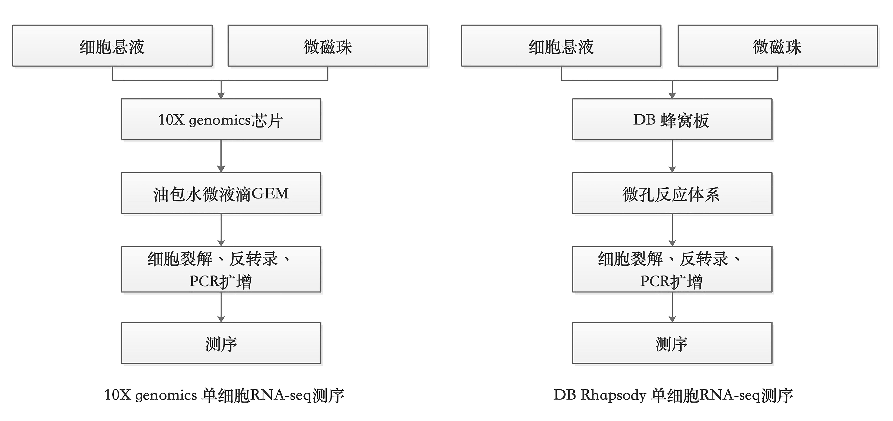
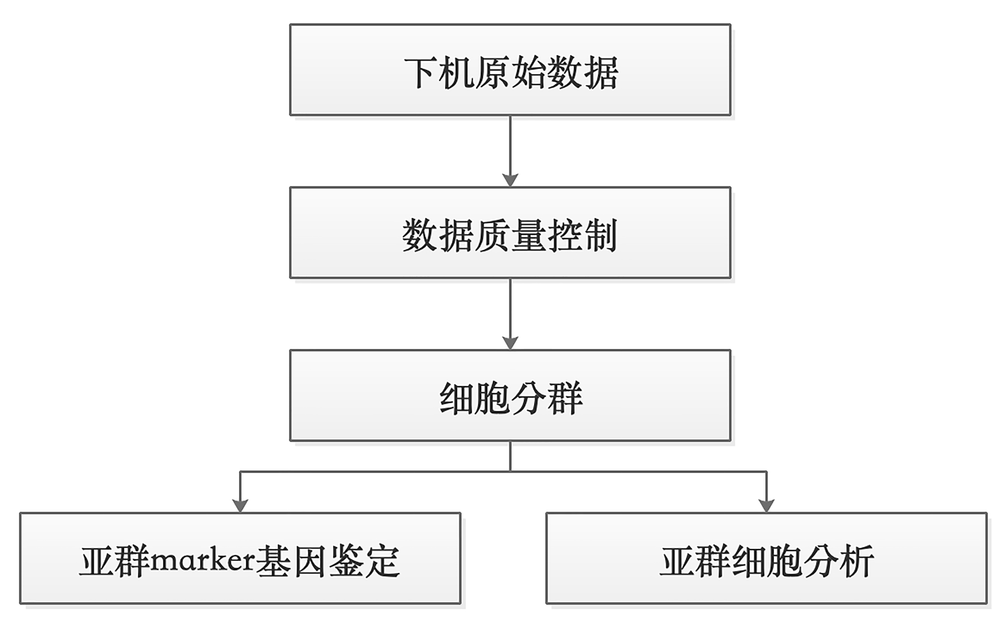

# 单细胞与空间组学 {#sec-ch09}

## 本章提要 {#chapter-summary-09 .unnumbered}

本章从组织平均信号走向细胞差异与空间位置。单细胞部分依次学习数据结构与质控、归一化和特征选择、降维聚类、细胞类型注释，以及多样本比较；空间部分介绍技术、数据结构与质量控制，随后学习空间表达展示和组织区域的解释。最后讨论单细胞与空间信息如何结合，并整理完整案例和常见误区。第 5 章的表达分析和第 11 章的统计知识可作为参考，分析中应持续核对样本、细胞和空间位置的对应关系。

## 从组织平均到细胞差异与空间位置：研究问题与数据结构 {#sec-09-01}

#### 单细胞RNA-seq {#src-0050-RNA-seq-56}

前面转录组测序，研究对象都是对多个细胞混合的RNA进行测序，针对的是某一个组织、器官、甚至生物体（例如小型昆虫等），检测到的基因表达情况是所有细胞表达均值。而单细胞测序可以对每一个细胞单独测序，这对发育、肿瘤异质性、微小组织等研究十分重要，单细胞测序已成为目前热门的生命科学技术之一。

单细胞测序是目前的热门技术之一，单细胞测序不仅可以对样本中每个细胞进行转录组测序，还可以进行基因组测序、DNA甲基化测序和ATAC-seq测序。目前得到最广泛应用的单细胞测序平台是10X genomics单细胞平台和BD Rhapsody平台，分别基于DROP-seq技术[^rna-ref-10]和Cyto-seq技术[^rna-ref-11][^rna-ref-12]（@fig-06-rna-seq-002）。

{#fig-06-rna-seq-002}

10X genomics平台与BD Rhapsody平台在单细胞RNA-seq测序中最大的不同在于微反应载体的不同。10X genomics芯片检测的细胞在液相中实现流动分选：

1. 大量连接着后续反应所需接头、barcode、UMI等序列的微磁珠在芯片管道中流动；
2. 流动的细胞与微磁珠相遇后被吸附上去；
3. 吸附着细胞的微磁珠与流动的油相遇形成油包水滴的乳浊液，亲水的微磁珠和吸附的细胞包裹在油包水的微液滴里，称为GEM（Gel bead in emulsion）;
4. 在GEM里完成细胞裂解、反转录、扩增等；
5. 每个细胞里扩增后的cDNA都带着特异的接头序列，随后进行测序。

BD Rhapsody平台采用蜂窝板技术进行单细胞分离和捕获：

1. 单细胞悬液流过含有大量微孔的蜂窝板使细胞落入微孔中；
2. 将微磁珠铺到蜂窝板上，使微孔中形成微磁珠与细胞的反应体系；
3. 在微磁珠里完成细胞裂解、反转录、扩增等。

两者后续的建库、测序是几乎一样的流程，单次捕获的细胞数量都可以达到很好的通量，在3,000至10,000之间，差距不大。

::: {.callout-note title="待完善"}
本节的系统讲解、示例数据、分析代码和结果核验待补充。
:::

## 单细胞数据的质控：细胞、基因、双细胞与背景信号 {#sec-09-02}

待完善

## 归一化、特征选择、降维与聚类 {#sec-09-03}

待完善

## 细胞类型注释与证据核查 {#sec-09-04}

待完善

## 多样本比较：批次、重复与差异分析 {#sec-09-05}

待完善

## 空间转录组的技术、数据结构与质量控制 {#sec-09-06}

#### 其他转录组测序 {#src-0050-RNA-seq-81}

随着技术的发展，转录组测序也发展出了更多的测序技术。

##### 空间转录组测序（Spatial Transcritome sequencing）[^rna-ref-13] {#src-0050-RNA-seq-91}

普通的RNA测序，包括单细胞RNA测序都无法提供组织内部空间不同位置的转录组信息，空间转录组测序在获取转录组信息的同时还加入了空间位置信息。将待研究的组织制作为冰冻切片，转移到组织透化芯片上，不同组织区域的RNA信息释放到芯片上的小孔中，对这些RNA进行测序即可获得各个空间位置的转录组信息。空间转录组并不是单细胞转录组测序的升级，因为芯片上的小孔捕获的通常是多个细胞，二者能够形成较好的互补，可能会成为未来的热门技术。

##### 链特异RNA-Seq {#src-0050-RNA-seq-95}

在RNA测序的建库过程中，会丢失RNA链信息，即RNA是来自基因组上哪一条DNA链。然而在基因组中，有许多基因是重叠出现在同一个区域的正负链位置的。要想解决这一问题，就需要获得链特异的RNA-Seq数据，可以采取lillumina RNA ligation method、dUTP method、RT method。

此外，通过对RNA技术的改进可以进行转录起始位点的鉴定：GRO-Seq、NET-Seq和SLAM-Seq；翻译效率的测定：Ribosome footprint；RNA二级结构的测定：PARS、SHAPE-Seq和SHAPE-Map；以及RNA 结合蛋白位点的测定CLIP-seq 。

::: {.callout-note title="待完善"}
本节的系统讲解、示例数据、分析代码和结果核验待补充。
:::

## 空间表达可视化、组织区域与结果解释 {#sec-09-07}

待完善

## 单细胞与空间信息的结合、完整案例与常见误区 {#sec-09-08}

#### 单细胞RNA-seq {#src-0050-RNA-seq-1182}

{#fig-06-rna-seq-009}

待完善

[^rna-ref-10]: 原稿文献编号 10；完整书目信息待完善。

[^rna-ref-11]: 原稿文献编号 11；完整书目信息待完善。

[^rna-ref-12]: 原稿文献编号 12；完整书目信息待完善。

[^rna-ref-13]: 原稿文献编号 13；完整书目信息待完善。
