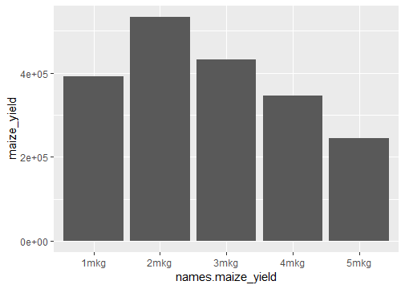
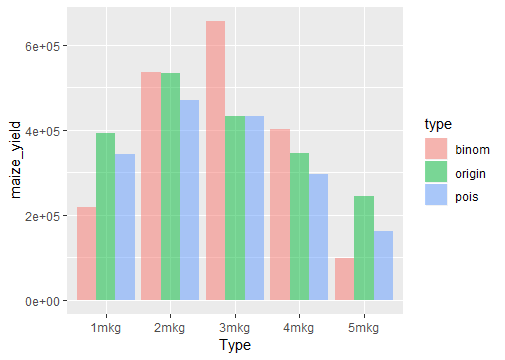
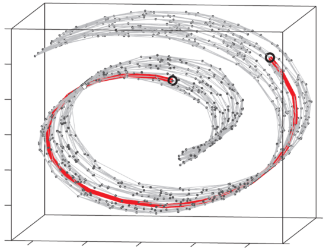
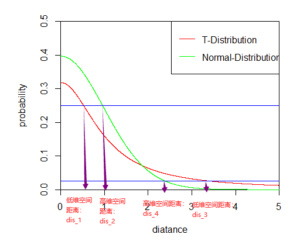

# 统计学基础与学习建议 {#sec-ch11}

::: {.hero-book .book-chapter-summary}

## 本章提要 {#chapter-summary-11 .unnumbered}

本章集中介绍理解分析结果所需的统计基础，并提供进一步学习的方向。内容依次涉及描述数据与不确定性、概率分布和计数数据、效应量与假设检验、归一化、回归与比较方向、相关性和降维聚类，以及稳健解释与常见误区。可以按顺序学习，也可以在前面的实战中遇到问题时回来查阅。理解每种方法处理什么数据、依赖什么假设，以及结果能支持什么判断，是本章的主要目标。

:::

## 描述数据与量化不确定性 {#sec-11-01}

区分数据本身的变异与估计结果的不确定性。

### 常用数据分析的数学原理 {#src-0080-statistics-1}

[]{#statistics}


::: {.book-placeholder}
本节内容待补充。
:::
## 概率分布与计数数据 {#sec-11-02}

理解为什么不同数据需要不同统计模型。

::: {.book-placeholder}
本节内容待补充。
:::
## 效应量、假设检验与多重比较 {#sec-11-03}

正确解释差异分析的结果列与筛选标准。

### 假设检验 {#src-0080-statistics-3}

::: {.book-placeholder}
本节内容待补充。
:::
::: {.book-placeholder}
本节内容待补充。
:::
## 归一化及其隐含假设 {#sec-11-04}

理解何时样本之间可以比较，以及比较的尺度是什么。

::: {.book-placeholder}
本节内容待补充。
:::
## 回归、设计公式与比较方向 {#sec-11-05}

能把实验设计写成模型，并解释模型估计的量。

### 线性回归 {#src-0080-statistics-5}

::: {.book-placeholder}
本节内容待补充。
:::
::: {.book-placeholder}
本节内容待补充。
:::
## 相关性、聚类与PCA {#sec-11-06}

能用探索性分析检查样本关系，避免把图形当作检验结论。

### 主成分分析 {#src-0080-statistics-7}

::: {.book-placeholder}
本节内容待补充。
:::
### 主坐标分析 {#src-0080-statistics-9}

::: {.book-placeholder}
本节内容待补充。
:::
### 聚类 {#src-0080-statistics-11}

::: {.book-placeholder}
本节内容待补充。
:::
::: {.book-placeholder}
本节内容待补充。
:::
## 稳健解释、可视化与常见统计误区 {#sec-11-07}

对结果保持可验证的判断，知道结论的边界。

### tSNE {#src-0080-statistics-13}

在这一章节中，我们将会对t-SNE的算法做一个比较详尽的介绍。同时，也会在理论讲述的最后，给大家带来实战代码的讲解。

在具体讲解t-SNE之前，我们首先要了解两个信息论中的概念：信息熵和相对熵（K-L散度）。

#### 信息熵与相对熵 {#src-0080-statistics-19}


##### 信息熵 {#src-0080-statistics-21}


::::: {.callout-note .book-core title="核心知识｜信息熵"}

1948年，美国科学家香农发表的论文《通信的数学理论》，奠定了信息论的理论基础。其定义的信息熵这一概念，实现了对“不确定性”的数学化度量。从定义上来看：信息熵是从总体上、从平均意义上表示信源$X$每一个符号（不论哪一个符号）所含有的平均信息量（或信源发送信息前，每一个符号的平均不确定性），见 @eq-05-statistics-and-exploration-001 。

:::::


$$
H(X)=-\sum_{i=1}^rp(a_i)logp(a_i)
$$ {#eq-05-statistics-and-exploration-001}

<!-- Original equation tag: 1 -->


其中，$p(a_i)$代表随机事件$X$为$a_i$时的概率。是不是感觉很抽象？没关系，接下来我们将举一个生活中十分常见的例子来帮助大家理解这个公式。

平时早晨出门前我们会习惯性的查看当天的天气预报，如果天气预报说“今天白天下雨的概率是百分之九十，晴天的概率是百分之十”，我们一般就会选择带伞出门，因为我们认为下雨的可能性非常大；如果天气预报说“今天白天下雨的概率是百分之五十，晴天的概率是百分之五十”，我们就会犹豫是否带伞，因为，今天有可能下雨，也有可能不下雨，并且无法判断到第大概率会出现哪一种情况；如果天气预报说“今天白天下雨的概率是百分之十，晴天的概率是百分之九十”，我们一般就会不带伞出门，因为我们认为下雨的可能性比较小，晴天的可能性非常大。显然，在第一条和第三条天气预报中，下雨这件事的不确定性程度较小，要么是大概率下雨，要么是大概率晴天，都有助于我们决策是否带伞。而第二条天气预报关于下雨的不确定性程度就大多了。而这种信源的平均不确定性就可以用信息熵来描述，假设三条新闻分别为$X_1,X_2,X_3$，他们所具有的的平均不确定性分别是：


$$
\begin{aligned}
H(X_1)&=-\sum_{i=1}^rp(a_i)\log_2 p(a_i)=-(0.9\times \log_2 0.9+0.1\times \log_2 0.1)=0.4689956\\
H(X_2)&=-\sum_{i=1}^rp(a_i)\log_2 p(a_i)=-(0.5\times \log_2 0.5+0.5\times \log_2 0.5)=1\\
H(X_3)&=-\sum_{i=1}^rp(a_i)\log_2 p(a_i)=-(0.1\times \log_2 0.1+0.9\times \log_2 0.9)=0.4689956
\end{aligned}
$$ {#eq-05-statistics-and-exploration-002}


由计算结果，我们可以直观看出$H(X_1)=H(X_3)<H(X_2)$。这也与我们平日里的经验认知相符，在平日里做决策时，往往是“几个事件旗鼓相当”情况下最难做出决定。因此，通过这个例子，大家是不是对信息熵这个概念有了比较直观的认识了？接下来我们将了解相对熵这个概念。

##### 相对熵 {#src-0080-statistics-40}


::::: {.callout-warning .book-warning title="注意｜KL 散度不满足对称性"}

相对熵，又称K-L散度( Kullback–Leibler divergence)，是描述两个概率分布$P$和$Q$差异的一种方法。在信息论中，$D(P||Q)$表示当用概率分布$Q$来拟合真实分布$P$时，产生的信息损耗，其中$P$表示真实分布，$Q$表示$P$的拟合分布。有人将K-L散度称为K-L距离，认为K-L散度描述了不同分布之间的距离。但事实上，K-L散度并不满足距离的概念，因为度量距离应该满足对称性，而显然K-L散度并不对称，见 @eq-05-statistics-and-exploration-003 。

:::::


$$
D_{KL}(p||q)=\sum_{i=1}^np(x_i)(logp(xi)-logq(x_i))=\sum_{i=1}^np(x_i)log\frac {p(x_i)}{q(x_i)}
$$ {#eq-05-statistics-and-exploration-003}

<!-- Original equation tag: 2 -->


上面我们讲了好长一段的理论，大家可能感觉还是不是很直观，下面我举一个简单的例子带着大家直观的感受一下相对熵到第是怎样一回事。

假设，我们在火星上开展玉米种植试验，一个生长周期结束了，我们得到了玉米产量的数据，见 @fig-05-statistics-and-exploration-001 。现在，我们需要把火星上的数据传送回地球，最好的结果就是按照数据原始的样貌进行传送。但是，假设现在数据传送的成本代价昂贵。虽然直接传送数据样貌最为准确，但是由于成本过于昂贵，我们难以承受这个代价。因此，我们就想，能不能使用一个模型来描述这些数据，这样只需传递模型和几个模型参数，我们就能得到玉米产量的大概分布，同时传送的成本也得以控制。


{#fig-05-statistics-and-exploration-001}


假设，我们现在想用泊松分布和二项分布去近似原始数据，得到的结果见 @fig-05-statistics-and-exploration-002 。


{#fig-05-statistics-and-exploration-002}


接着，我们利用相对熵（K-L散度）计算两种模型的信息损失量：


$$
D_{KL}(origin||binom)=\sum_{i=1}^np(x_i)log\frac {p(x_i)}{q(x_i)}=0.1597662
$$ {#eq-05-statistics-and-exploration-004}


$$
D_{KL}(origin||pois)=\sum_{i=1}^np(x_i)log\frac {p(x_i)}{q(x_i)}=0.201369
$$ {#eq-05-statistics-and-exploration-005}


所以，我们发现用二项分布近似原始分布的信息损失量比用泊松分布近似原始分布的信息损失量小，因此，当我们在考虑二项分布和泊松分布时，较优的一个选择是二项分布。

到这里，我们对信息熵和相对熵（K-L散度）这两个概念已经有了直观的认识，接下来，就进入本章的重点部分：t-SNE算法详解。

#### t-SNE算法详解 {#src-0080-statistics-71}


##### t-SNE概述 {#src-0080-statistics-73}

t-SNE(t-distributed stochastic neighbor embedding，t分布-随机近邻嵌入)是一种非线性降维的算法，属于流形学习的范畴，可以把数据集中数据之间的高维欧式距离转变成条件概率来表示数据之间的相似度。

流形是局部具有欧几里得空间性质的空间。举个例子理解一下，例如比较经典的“瑞士卷”（见 @fig-05-statistics-and-exploration-003 ），数据是三维的，但其本质是一个二维流形。图中两个黑点之间的距离显然不能用欧式距离来衡量，如果用三维空间的欧氏距离来计算则它们的距离要比实际距离近得多，它们之间的实际距离应该是红色的这一条弧线。我们再举一个例子，如果你要测量北京到西安的距离，你可以拿一个缩小一定比例的地球仪，用卷尺经过地球仪表面上的这两点来测量它们之间的距离，然后再乘以相应的倍数，即可得到北京到西安的距离。同样的，你还可以把三维的地球仪展开成二维的地球，然后拿直尺直接测量北京到西安的距离。而这个三维地球仪到二维地图的展开，就属于流形学习，流形学习可以使欧式距离重新生效。


{#fig-05-statistics-and-exploration-003}


t-SNE算法的降维过程可以分为下面几个步骤：

1. 计算高维空间数据点的概率分布F1（欧式距离转换成高斯分布）；

2. 计算低维空间数据点的概率分布F2（用t分布随机初式化二维的点）；

3. 利用相对熵（K-L散度）衡量两种分布的差异，进行迭代，若F1与F2概率分布尽可能的接近则降维成功。

##### SNE算法原理 {#src-0080-statistics-90}

我们首先了解一下t-SNE的前身SNE的算法原理，因为这样我们会更加理解t-SNE相对于SNE带来的提升。我们以4个细胞，每个细胞有4个基因，构成一个$4\times 4$的矩阵为例（见 @tbl-11-statistics-and-learning-01 ），详细讲解一下SNE的每一步算法过程。

每一列代表一个基因，每一行代表一个细胞；$FPKM_{i,j}$ 代表第 i 个细胞、第 j 个基因的表达值。

|          | $gene_1$     | $gene_2$     | $gene_3$     | $gene_4$     |
| -------- | ------------ | ------------ | ------------ | ------------ |
| $cell_1$ | $FPKM_{1,1}$ | $FPKM_{1,2}$ | $FPKM_{1,3}$ | $FPKM_{1,4}$ |
| $cell_2$ | $FPKM_{2,1}$ | $FPKM_{2,2}$ | $FPKM_{2,3}$ | $FPKM_{2,4}$ |
| $cell_3$ | $FPKM_{3,1}$ | $FPKM_{3,2}$ | $FPKM_{3,3}$ | $FPKM_{3,4}$ |
| $cell_4$ | $FPKM_{4,1}$ | $FPKM_{4,2}$ | $FPKM_{4,3}$ | $FPKM_{4,4}$ |

: $4\times 4$ 的矩阵 {#tbl-11-statistics-and-learning-01}

**将欧式距离转化成概率分布**

根据我们假定的数据，每一个细胞都有四个基因表达值特征，我们可以根据此计算两两细胞之间的欧式距离。以$cell_1$为例，$cell_1$与$cell_2、cell_3、cell_4$之间的欧式距离计算见下：


$$
dis(cell_1,cell_2)=\sqrt{\sum_{x=1}^4(FPKM_{1,i}-FPKM_{2,i})^2}\\
$$ {#eq-05-statistics-and-exploration-006}


$$
dis(cell_1,cell_3)=\sqrt{\sum_{x=1}^4(FPKM_{1,i}-FPKM_{3,i})^2}
$$ {#eq-05-statistics-and-exploration-007}


$$
dis(cell_1,cell_4)=\sqrt{\sum_{x=1}^4(FPKM_{1,i}-FPKM_{4,i})^2}
$$ {#eq-05-statistics-and-exploration-008}


接着，我们用正态分布的公式转化$cell_1$ 与$cell_2、cell_3、cell_4$的距离：


$$
f(dis(cell_1,cell_2)) = \frac{1}{\sqrt{2\pi}\sigma}e^{-\frac{dis(cell_1,cell_2)^2}{2\sigma^2}}\\
f(dis(cell_1,cell_3)) = \frac{1}{\sqrt{2\pi}\sigma}e^{-\frac{dis(cell_1,cell_3)^2}{2\sigma^2}}\\
f(dis(cell_1,cell_4)) = \frac{1}{\sqrt{2\pi}\sigma}e^{-\frac{dis(cell_1,cell_4)^2}{2\sigma^2}}
$$ {#eq-05-statistics-and-exploration-009}


然后归一化，把距离变成概率:


$$
p_{cell_2|cell_1} = \frac {e^{-\frac{dis(cell_1,cell_2)^2}{2\sigma^2}}} {e^{-\frac{dis(cell_1,cell_2)^2}{2\sigma^2}}+e^{-\frac{dis(cell_1,cell_3)^2}{2\sigma^2}}+e^{-\frac{dis(cell_1,cell_4)^2}{2\sigma^2}}}\\
p_{cell_3|cell_1} = \frac {e^{-\frac{dis(cell_1,cell_3)^2}{2\sigma^2}}} {e^{-\frac{dis(cell_1,cell_2)^2}{2\sigma^2}}+e^{-\frac{dis(cell_1,cell_3)^2}{2\sigma^2}}+e^{-\frac{dis(cell_1,cell_4)^2}{2\sigma^2}}}\\
p_{cell_4|cell_1} = \frac {e^{-\frac{dis(cell_1,cell_4)^2}{2\sigma^2}}} {e^{-\frac{dis(cell_1,cell_2)^2}{2\sigma^2}}+e^{-\frac{dis(cell_1,cell_3)^2}{2\sigma^2}}+e^{-\frac{dis(cell_1,cell_4)^2}{2\sigma^2}}}\\
$$ {#eq-05-statistics-and-exploration-010}


同理，我们可以对每一个$cell_i$都算出以其为中心，其余$cell_j$与其距离的概率分布$p_{cell_j|cell_i},j\ne i$ 。例如，我们现在举的这个例子中，我们可以同样的算出：


$$
p_{cell_1|cell_2},p_{cell_3|cell_2},p_{cell_3|cell_2}\Rightarrow \sigma_{cell_2}\\
p_{cell_1|cell_3},p_{cell_2|cell_3},p_{cell_4|cell_3}\Rightarrow \sigma_{cell_3}\\
p_{cell_1|cell_4},p_{cell_2|cell_4},p_{cell_3|cell_4}\Rightarrow \sigma_{cell_4}
$$ {#eq-05-statistics-and-exploration-011}


对于这四个细胞，唯一的未知量就是$\sigma$，如果对于每一个细胞，我们都知道它的标准差，那么我们就能描述出高维空间上该细胞与其周围细胞的分布情况，如何估算每个细胞的$\sigma_{cell_i}$呢？这里我们就引入一个新的概念——困惑度（perplexity），这是一个基于信息熵计算出来的值。

**根据困惑度估计$\sigma$**

困惑度（perplexity）可以表示细胞的邻近个数，在t-SNE图上的直观反映是细胞点的分布是否紧凑，见 @eq-05-statistics-and-exploration-012 。perplexity设置越大，细胞分布越紧凑，一般情况下困惑度选择5-50。


$$
Prep(P_{cell_i})=2^{H(P_{cell_i})}\\
H(P_{cell_i})=-\sum_{j\ne i}p_{cell_j|cell_i}log(p_{cell_j|cell_i})
$$ {#eq-05-statistics-and-exploration-012}


于是，对于我们的示例来说，一旦我们定义了一个困惑度，也就是等式左边已经确定，那么唯一的未知量就是等式右边的$\sigma$，这样等式就变成了一个可解方程，我们就能计算得出每一个细胞特定的$\sigma$。这里，为了直观观察这一步骤的过程，我们还是以$cell_1$为例来看一遍如何计算$\sigma$：


$$
H(P_{cell_1})=-(p_{cell_2|cell_1}log(p_{cell_2|cell_1})+p_{cell_3|cell_1}log(p_{cell_3|cell_1})+p_{cell_4|cell_1}log(p_{cell_4|cell_1}))\\
Prep(P_{cell_1})=2^{H(P_{cell_1})}\Rightarrow 预设值：困惑度（perplexity）
$$ {#eq-05-statistics-and-exploration-013}


这样两个方程联立，我们就能解出$cell_1$的$\sigma_{cell_1}$，同理我们就能解出$\sigma_{cell_2}、\sigma_{cell_3}、\sigma_{cell_4}$ 。这样我们就完成了高维空间数据点概率分布的估计。

这里，根据我们之前介绍的信息熵，大家可以思考一下，在估计$\sigma$时，信息熵值的大小与$\sigma$具有怎样的关系？反应怎样的生物学意义？

提示：

1.信息熵越大，$\sigma$越小；

2.信息熵越大，代表$cell_i$临近的细胞个数越多。

**低维空间的正态分布近似**

当我们确定了高维数据的概率分布之后，利用正态分布初始化SNE的二维点，例如初始化低维数据点$x_1,x_2,x_3,x_4$分别对应高维空间上的$cell_1,cell_2,cell_3,cell_4$ 。我们同样可以计算类似的条件概率，以$x_1$为例：


$$
q_{x_2|x_1} = \frac {e^{-{dis(x_1,x_2)^2}}} {e^{-{dis(x_1,x_2)^2}}+e^{-{dis(x_1,x_3)^2}}+e^{-{dis(x_1,x_4)^2}}}\\
q_{x_3|x_1} = \frac {e^{-{dis(x_1,x_3)^2}}} {e^{-{dis(x_1,x_2)^2}}+e^{-{dis(x_1,x_3)^2}}+e^{-{dis(x_1,x_4)^2}}}\\
q_{x_4|x_1} = \frac {e^{-{dis(x_1,x_4)^2}}} {e^{-{dis(x_1,x_2)^2}}+e^{-{dis(x_1,x_3)^2}}+e^{-{dis(x_1,x_4)^2}}}\\
$$ {#eq-05-statistics-and-exploration-014}


同理，我们可以对每一个$x_i$都算出以其为中心，其余$x_j$与其距离的概率分布$Q_{x_j|x_i},j\ne i$ 。这样我们就在低维空间得到了我们样本点的概率分布，接下来，我们的目标就是希望高维空间和低维空间之间的分布尽可能的相同，这里我们就用到了之前讲解的相对熵（K-L散度）这一概念，计算过程见下（$i$最大值是4，只是因为我们举的例子只有4个细胞，实际情况$i$最大值等于细胞数目）：


$$
C=\sum_{i=1}^4D_{KL}(P_i||Q_i)=\sum_{i=1}^4 \sum_{j=1}^3 p_{j|i}log\frac {p_{j|i}}{q_{j|i}}
$$ {#eq-05-statistics-and-exploration-015}


这样我们的目标就是获得最小的$C$值，也就是获得最小的K-L散度，后面就是进行进行梯度优化，通过迭代，使低维空间的分布逼近高维空间的分布，最终确定SNE的二维点。一般默认梯度优化的迭代次数是1000。以上就是SNE的算法原理。

##### t-SNE相对于SNE的提升 {#src-0080-statistics-177}

上面的内容我们了解了SNE的算法原理，那么相对于SNE，t-SNE又做了哪些重要的优化呢？

**1. t-SNE解决了概率不对称问题**
 SNE高维情况：
 

$$
p_{j|i} = \frac {e^{-\frac{dis(i,j)^2}{2\sigma^2}}} {\sum_{k\ne i}e^{-\frac{dis(i,k)^2}{2\sigma^2}}}
$$ {#eq-05-statistics-and-exploration-016}


 t-SNE高维情况：
 

$$
p_{ij}=\frac {p_{j|i}+p_{i|j}}{2n}
$$ {#eq-05-statistics-and-exploration-017}


**2. t-SNE使用t分布作为降维后的概率分布**
SNE低维情况：


$$
q_{j|i} = \frac {e^{-{dis(i,j)^2}}} {\sum_{k\ne i}e^{-{dis(i,k)^2}}}
$$ {#eq-05-statistics-and-exploration-018}


t-SNE低维情况：


$$
q_{ij} = \frac {(1+{dis(i,j)^2})^{-1}} {\sum_{k\ne i}(1+{dis(i,k)^2})^{-1}}
$$ {#eq-05-statistics-and-exploration-019}


对于第一个优化我们直观上很好理解，因为，我们认为空间上两个点$(a,b)$的距离不论是$a\Rightarrow b$还是$b\Rightarrow a$都应该相等。那么我们为什么要用t分布来作为降维后的概率分布呢？它与正态分布有什么不同吗？

观察 @fig-05-statistics-and-exploration-004 ，在正态分布与t分布相交前，对于同一个概率值（y轴坐标），我们发现t分布的距离总是小于正态分布的距离（$\mathrm{dis}_1<\mathrm{dis}_2$)；在正态分布与t分布相交后，对于同一个概率值（y轴坐标），我们发现t分布的距离总是大于正态分布的距离（$\mathrm{dis}_3>\mathrm{dis}_4$)。所以由此我们可以了解到 t分布使得相近的细胞更加紧凑，较远的细胞更加疏远。换句话说，t-SNE倾向于保留数据中的局部结构。距离较远的两个细胞在t-SNE图上的表示可能失真。


{#fig-05-statistics-and-exploration-004}


##### t-SNE的优缺点 {#src-0080-statistics-210}

**优点**

- 非常优秀的降维可视化方法

**缺点**
- 基本只用于可视化
- t-SNE倾向保留局部结构，有时候会“只见数木不见森林”
- t-SNE结果中距离没有太大意义，因为都是计算的概率
- t-SNE训练速度比较慢

**特点**
- 受初值影响

#### R语言实战 {#src-0080-statistics-225}

这一部分我们就进入t-SNE实战环节，代码如下:


```{.r .numberLines data-book-role="code"}
# t-SNE需要使用Rtsne这一个包
library(Rtsne)
##加载t-SNE需要的数据
load("C:/Users/Jay/Desktop/t-SNE/data/GTEx.RData")
accession.df = read.csv(file="C:/Users/Jay/Desktop/t-SNE/data/GTEx_accession_table.csv")
accession.df
annotation.df = read.csv(file="C:/Users/Jay/Desktop/t-SNE/data/GTEx_v7_Annotations_SampleAttributesDS.txt",header = T,sep = "\t")
annotation.df
tissue_info = as.character(annotation.df$SMTS[match(accession_id_vec,annotation.df$SAMPID)])

##删除第一列基因名字，第二列描述信息
GTEx.TPM.gene.mat = GTEx.TPM.gene.mat[,c(-1,-2)]
##对每一行基因计算方差，筛选高变异的基因进行t-SNE运算，减少运算负担
SD.vector = apply(GTEx.TPM.gene.mat,1,FUN=function(x){sd(x)})
##依靠方差结果对GTEx.TPM.gene.mat数据进行排序
GTEx.TPM.gene.mat.sort = GTEx.TPM.gene.mat[order(SD.vector,decreasing = T),]
##查看尾部数据是否是变异较小的
tail(GTEx.TPM.gene.mat.sort)
##筛选前3000高变异基因
GTEx.TPM.gene.mat.log2.top3000 = GTEx.TPM.gene.mat.sort[1:3000,]

set.seed(20200503)
##行是观测，列是变量。如果把基因当做变量，那么每一列就是一个基因，每一行就是样本
##dims 输出的维度
##perplexity设置5-50
tSNE_res = Rtsne(t(GTEx.TPM.gene.mat.log2.top3000),dims = 3,perplexity = 10,pca = T)

##分别用生成t-SNE的三个维度进行可视化
library(ggplot2)
##首先把信息都综合到一个data.frame中
tSNE_res.df = as.data.frame(tSNE_res$Y)
colnames(tSNE_res.df) = c("tSNE1","tSNE2","tSNE3")
tSNE_res.df$tissue = tissue_info
##可视化tSNE1与tSNE2
ggplot(data = tSNE_res.df, aes(tSNE1,tSNE2,color=tissue)) + 
  geom_point()  + 
  geom_text(aes(label=tissue)) + 
  theme_bw()
##可视化tSNE1与tSNE3
ggplot(data = tSNE_res.df, aes(tSNE1,tSNE3,color=tissue)) + 
  geom_point()  + 
  geom_text(aes(label=tissue)) + 
  theme_bw()
##可视化tSNE2与tSNE3
ggplot(data = tSNE_res.df, aes(tSNE2,tSNE3,color=tissue)) + 
  geom_point()  + 
  geom_text(aes(label=tissue)) + 
  theme_bw()
```

::: {.book-placeholder}
本节内容待补充。
:::